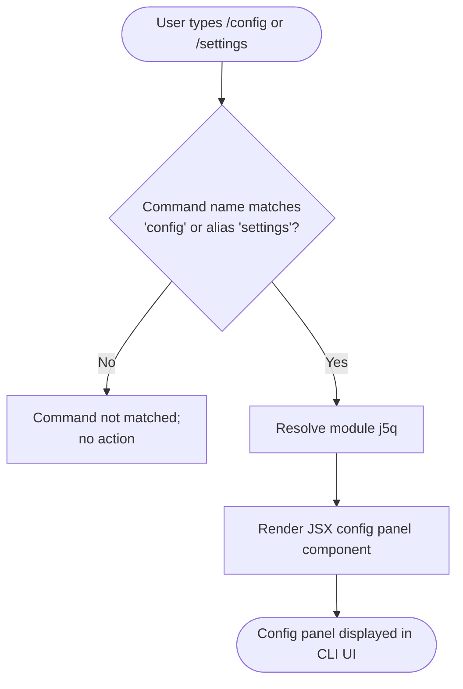

# `/config`

> Analysis basis: CC v2.1.144 bundle.js (AST extraction + Claude interpretation)
> Minimum version: v2.1.144

---

## Overview

The `/config` command (also accessible as `/settings`) is a local JSX slash command that opens the application configuration panel when invoked from the Claude Code CLI prompt. It acts as a direct shortcut to the settings UI surface, requiring no arguments and producing no text output of its own.

---

## Registration

| Field | Value |
|---|---|
| type | `local-jsx` |
| name | `config` |
| description | `Open config panel` |
| aliases | `["settings"]` |
| module\_id | `j5q` |

Analysis basis: CC v2.1.144 bundle.js:+10534653

---

## Input Branching

Because the depth-2 call graph traversal returned no call edges and no string/numeric literals for module `j5q`, a detailed multi-path flowchart cannot be constructed from verified data. The command's registration type (`local-jsx`) indicates it renders a JSX component rather than executing a multi-step imperative pipeline, so branching logic is internal to the React render tree.



> **Note:** Steps D–F are inferred from the `local-jsx` type and `module_id: j5q`. Internal panel state, sub-tabs, and conditional renders within the JSX component are <!-- TODO: not found in depth-2 traversal; needs --depth 4 -->.

---

## Behavioral Spec

### Panel Activation

```
function activateConfigPanel(commandInput):
    # commandInput is the raw slash-command token entered by the user
    if commandInput matches "config" or any registered alias:
        load module identified as config-panel-module
        mount JSX config panel into the CLI UI surface
        return rendered panel
    else:
        pass  # not handled by this command
```

Analysis basis: CC v2.1.144 bundle.js:+10534653

### Alias Resolution

The command registers the alias `settings`, meaning `/settings` is treated as fully equivalent to `/config` at the routing layer. No behavioral difference between the two invocations exists at the registration level.

```
function resolveAlias(token):
    canonical_name = "config"
    aliases = ["settings"]
    if token == canonical_name or token in aliases:
        return canonical_name
    return None
```

Analysis basis: CC v2.1.144 bundle.js:+10534653

### Argument Handling

<!-- TODO: not found in depth-2 traversal; needs --depth 4 -->

The registration data contains no argument schema, no literal tokens for sub-commands, and no call edges that would indicate argument parsing. Whether the command accepts positional arguments, flags, or sub-section specifiers (e.g., `/config theme`) cannot be confirmed from the available data.

### Panel Content and Sub-sections

<!-- TODO: not found in depth-2 traversal; needs --depth 4 -->

The internal structure of the JSX config panel — including which settings are exposed, how values are read and written, and what validation is applied — resides inside module `j5q` and was not reachable within the two-level call graph traversal.

---

## State & Side Effects

| Item | Detail |
|---|---|
| Telemetry | None detected in depth-2 traversal |
| Hook registration | <!-- TODO: not found in depth-2 traversal; needs --depth 4 --> |
| appState changes | <!-- TODO: not found in depth-2 traversal; needs --depth 4 --> |
| Sound | <!-- TODO: not found in depth-2 traversal; needs --depth 4 --> |
| UI surface | Mounts a JSX panel component into the CLI UI (inferred from `local-jsx` type) |
| Persistence | <!-- TODO: not found in depth-2 traversal; needs --depth 4 --> |

---

## Version History

| Version | Change |
|---|---|
| v2.1.144 | Initial analysis; command registered as `local-jsx`, module `j5q`, with alias `settings` |

---

## Common Mistakes

1. **Expecting text output in the conversation stream.** Because `/config` is typed `local-jsx`, it renders a panel component rather than printing text. Users who expect a textual summary of current settings will not receive one.
2. **Using `/setting` (singular) instead of `/settings`.** Only the plural form `settings` is registered as an alias. Singular or other variants will not match the command.
3. **Assuming the command accepts sub-section arguments.** No argument schema was found in the registration data. Appending tokens such as `/config theme` or `/config api` may not navigate directly to a sub-section; behavior is unconfirmed without deeper traversal.
4. **Conflating `/config` with a programmatic API.** This command opens an interactive UI panel; it is not a read/write interface for configuration values from scripts or pipes.

---

## Appendix — Identifier Mapping

> For bundle debugging only. Identifiers change across versions.

| Identifier | Role |
|---|---|
| `j5q` | Module ID for the config panel JSX component (not an obfuscated function identifier; listed here for traceability) |

> No obfuscated function or variable identifiers were returned by the depth-2 AST traversal for this module. The `identifiers` array in the source data is empty.