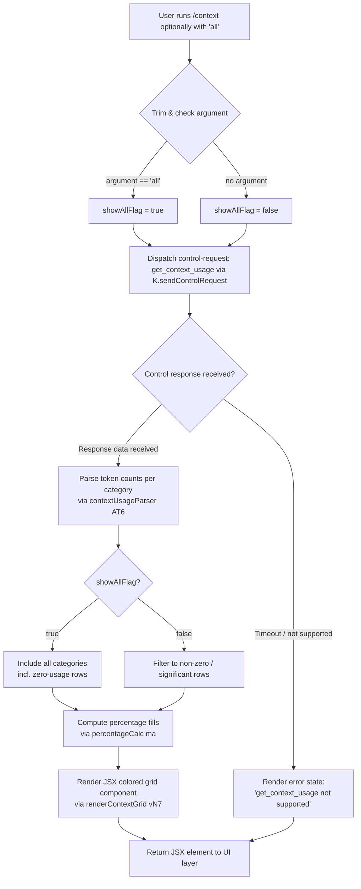

# `/context`

> Analysis basis: CC v2.1.147 bundle.js (AST extraction + Claude interpretation)
> Minimum version: v2.1.147

---

## Overview

`/context` visualizes the current conversation's context window utilization as a colored grid rendered directly in the terminal UI. It sends a `get_context_usage` control request through the bridge transport layer, collects token-usage data from the running session, and renders a JSX component showing usage breakdowns by category (system prompt, tools, messages, memory files, etc.) with color-coded fill indicators.

---

## Registration

| Field | Value |
|---|---|
| type | `local-jsx` |
| name | `context` |
| description | `Visualize current context usage as a colored grid` |
| argumentHint | `[all]` |
| thinClientDispatch | `control-request` |
| module_id | `qw1` |
| load_inline | `true` |
| loc_byte | `10962400` |
| loc_byte_end | `10962626` |
| loc_line | `8521` |
| arbor_handler.name | `NN7` |
| arbor_handler.fqn | `claude-2.1.147::NN7` |
| arbor_handler.kind | `AsyncFunction` |
| arbor_handler.resolution_path | `module_id` |
| arbor_handler.n_hits | `0` |

Analysis basis: CC v2.1.147 bundle.js:+10962400

---

## Input Branching

The command has 3+ distinct branches based on the optional `[all]` argument and the data returned by the control request, so a Mermaid flowchart is used.



Analysis basis: CC v2.1.147 bundle.js:+10961094 (handler entry `NN7`), +10961125 (`"all"` literal), +10961160 (`K.sendControlRequest`), +10961190 (`"get_context_usage"` literal)

---

## Behavioral Spec

### Handler Entry — contextCommandHandler (NN7)

The primary async handler is `NN7`, resolved via `module_id → qw1`.

```
async function contextCommandHandler(args, sessionContext):
    trimmedArg = args.trim()                          // +10961100
    showAll = checkAllArg(trimmedArg)                 // t3 at +10961133
    if showAll:
        showAllFlag = true
    else:
        showAllFlag = false

    response = await sessionContext.sendControlRequest(  // K.sendControlRequest +10961160
        type: "get_context_usage"                        // literal +10961190
    )

    if response indicates unsupported:
        return errorElement("get_context_usage not supported")

    categoryData = parseUsageResponse(response)          // AT6 +10961330
    grid = buildColoredGrid(categoryData, showAll)       // vN7 +10961503
    return createElement(grid)                           // qT6.createElement +10961224
```

Analysis basis: CC v2.1.147 bundle.js:+10961094

---

### Argument Normaliser — checkAllArg (t3)

```
function checkAllArg(trimmedArg):
    result = NXH(trimmedArg)     // NXH at +4070004
    return result === "all"      // literal "all" at +10961125
```

Analysis basis: CC v2.1.147 bundle.js:+10961133

---

### Control Request Dispatch — sendControlRequest (K)

The handler dispatches `"get_context_usage"` via the thin-client bridge control-request pathway. The registration field `thinClientDispatch: "control-request"` confirms this route. The response is awaited asynchronously.

```
function dispatchControlRequest(type):
    // K.sendControlRequest pads the request ID with spaces
    // K.map at +15141784, K.padEnd at +15141797
    paddedId = type.padEnd(requiredWidth, "  ")   // literal "  " at +15141818
    send(paddedId)
    return awaitResponse()
```

Analysis basis: CC v2.1.147 bundle.js:+10961160, +15141784, +15141797, +15141818

---

### Usage Response Parser — parseUsageResponse (AT6)

`AT6` is the primary data-shaping function that translates the raw control response into per-category token counts and display labels.

```
function parseUsageResponse(responseData):
    categories = []

    // Filter relevant fields from response
    filtered = responseData.filter(...)              // A.filter +10959198
    systemEntry = filtered.find(...)                 // A.find +10959516

    // Build labelled category rows
    // Labels found in literals:
    rows = [
        { key: "Free space",         label: "Free space"         },  // +10959233
        { key: "Autocompact buffer", label: "Autocompact buffer" },  // +10959256
        { key: "Project",  src: "projectSettings"  },               // +10960202, +10960182
        { key: "User",     src: "userSettings"     },               // +10960239, +10960222
        { key: "Local",    src: "localSettings"    },               // +10960274, +10960256
        { key: "Flag",     label: "Flag"            },               // +10960309
        { key: "Policy",   label: "Policy"          },               // +10960345
        { key: "Plugin",   src: "plugin"            },               // +10960375, +10960364
        { key: "Built-in", src: "built-in"          },               // +10960407, +10960394
        { key: "MCP",      src: "mcp"               },               // +10961761, literals at +1091761
        { key: "Messages", label: "Messages"        },               // +9782788
        { key: "Memory files", label: "Memory files"},               // +9782226
        { key: "Skills",   label: "Skills"          },               // +9782288
    ]

    // String-convert token counts
    String(tokenCount)                              // +10960434

    // Compute usage percentage via percentageCalc
    percentages = computePercentages(rows)          // ma at +10960933

    return { rows, percentages }
```

Analysis basis: CC v2.1.147 bundle.js:+10959157 (`T1`/`zK`/`SJK` locale formatter), +10959198, +10959516, +10960182–+10960407

---

### Percentage Calculator — percentageCalc (ma)

```
function percentageCalc(tokenCount, totalTokens):
    ratio = T1(tokenCount / totalTokens)            // T1 at +207441 (locale formatter)
    rounded = Math.round(ratio * 100)               // Math.round at +207444
    return rounded
```

The locale formatter `T1` uses `"en-US"` locale and `"compact"` notation (literals at +209394, +209412) and formats numbers with `.0` suffix (literal at +207386). Threshold constants `20` and `10` (at +207415, +207457) gate display of the `"< 20"` string (literal at +207424).

Analysis basis: CC v2.1.147 bundle.js:+10960933, +207441–207457

---

### Grid Renderer — buildColoredGrid (vN7)

```
function buildColoredGrid(categoryData, showAllFlag):
    // Determine compact_boundary marker
    boundary = getCompactBoundary()                 // OO→_W7→pX at +10277428/+10277475
    // boundary literal "compact_boundary" at +10277345

    // Slice display list based on showAll flag
    displayRows = showAllFlag
        ? categoryData.rows
        : categoryData.rows.slice(H...)             // H.slice at +10277498

    // Colour-coded fill percentage threshold: 80%
    // literal 80 at +10961536
    fillThreshold = 80

    // Render JSX
    return createElement(contextGridComponent,
        { rows: displayRows, threshold: fillThreshold, boundary })
```

Analysis basis: CC v2.1.147 bundle.js:+10961503, +10961056 (`OO`), +10277345, +10277428, +10277498, +10961536

---

### Data Receiver — responseDataHandler (VnH)

`VnH` registers an event listener on the bridge channel for the `"data"` event (literal at +7476542) and converts the message buffer to string (`M.toString` at +7476574) before forwarding to the render pipeline.

```
function responseDataHandler(channel):
    channel.on("data", (msg) => {              // K.on +7476537, "data" +7476542
        text = msg.toString()                  // M.toString +7476574
        parsed = parsePayload(text)            // _p at +7476601
        element = createElement(parsed)        // J6H.createElement +7476604
        return element
    })
```

Analysis basis: CC v2.1.147 bundle.js:+7476537, +7476542, +7476574

---

### System Prompt Category Label — systemCategoryLabel

When computing context breakdown the response includes a `"system"` category key (literal at +10961307) for system-prompt token attribution.

Analysis basis: CC v2.1.147 bundle.js:+10961307

---

## State & Side Effects

| Item | Detail |
|---|---|
| Telemetry | No `tengu_*` events found directly in `NN7`'s implementation body; the callgraph reaches `tengu_amber_creek` (+3351745), `tengu_pewter_brook` (+3351653), `tengu_marlin_porch` (+3712758), `tengu_amber_redwood2` (+9768195), `tengu_cobalt_raccoon` (+9760038) through shared utilities within depth-2 traversal |
| Control request | Sends `"get_context_usage"` to the bridge transport via `K.sendControlRequest`; registered as `thinClientDispatch: "control-request"` in the registration object |
| Hook registration | None directly; `r9 → D9A.register` (+57468) is reached through shared logger utility `kJK` |
| appState changes | None; command is read-only / display-only |
| Sound | None observed in call graph |
| JSX output | Returns a React/Ink JSX element via `qT6.createElement` (+10961224) rendered in the terminal UI |
| Locale formatting | Uses `"en-US"` locale with `"compact"` notation for token counts |

---

## Version History

| Version | Change |
|---|---|
| v2.1.147 | Initial analysis |

---

## Common Mistakes

1. **Expecting text output**: `/context` returns a JSX visual component, not plain text. In headless or SDK-streaming modes only `prompt`-type commands are supported (`"only prompt commands are supported in streaming mode"` literal at +14936846); `/context` (type `local-jsx`) will fail silently or return nothing in those modes.
2. **Misreading the `[all]` flag**: Without the `all` argument, zero-usage or negligible categories are filtered out. Pass `/context all` to see every slot including free space and autocompact buffer rows.
3. **Confusing the 80% threshold**: The colored fill indicator changes behaviour at 80% utilisation (literal at +10961536), not at 90% or 100%. Operators monitoring context health should treat 80% as the warning boundary.
4. **Assuming immediate data**: The command dispatches an async control request; in thin-client deployments the response depends on round-trip latency to the bridge layer. The render does not block the UI thread.
5. **Calling in non-interactive sessions**: Because this command type is `local-jsx` (not `prompt`), it cannot be invoked from the non-interactive `--print` / SDK mode. Use the `get_context_usage` control-request API directly for programmatic access.

---

## Appendix — Identifier Mapping

> For bundle debugging only. Identifiers change across versions.

| Identifier | Role |
|---|---|
| `NN7` | Main async handler for `/context` command (arbor_handler) |
| `z9` | Session/display-mode initialisation utility called by handler |
| `VbH` | Set membership check helper (`kmK.has`) |
| `G7_` | Terminal type detector (iTerm / screen / tmux) |
| `r1` | String coercion helper (calls `String`) |
| `UH` | String coercion / utility |
| `bn` | Background detection helper |
| `Al4` | Terminal multiplexer probe (`VR9.spawnSync` for tmux control-mode check) |
| `_l4` | Prefix check helper (`H.startsWith`) |
| `N` | Debug/logging utility (calls `Q_6`, `vJK`, `CH`, `f4`, `lRH`, `kJK`) |
| `vJK` | Log-line formatter (calls `Av`, `VJK`, `j9A`) |
| `j9A` | Numeric dimension formatter (`NDK`, `IDK`) |
| `CH` | JSON stringifier wrapper (`JSON.stringify`) |
| `f4` | Path-based text redactor (`l1A`, `H.replace`, `A.lastIndexOf`, `A.slice`) |
| `l1A` | Path-map traversal (`WJK.map`) |
| `lRH` | Log writer (`b1A → H.write`) |
| `kJK` | Structured logger / hook registrar (many sub-calls incl. `D9A.register`) |
| `XRH` | Buffered line writer (timeout, join, push, setImmediate) |
| `XAH` | Formatted output helper (`o1A`, `gXH.join`, `o8`, `h6`) |
| `C_6` | Config writer (`q8`) |
| `e1A` | Path joiner (`gXH.join`, `h6`) |
| `t1A` | File rotation helper (`yI.stat`, `yI.rename`, `yI.unlink`) |
| `IJK` | Async file appender (`yI.mkdir`, `yI.appendFile`) |
| `r9` | Hook registrar (`D9A.register`) |
| `W7_` | OS/platform check (`o6`, `Boolean`) |
| `HA` | Settings loader (calls `Km`) |
| `Km` | Settings orchestrator (`gR`, `Wq`, `Xg8`, `WF`, `xI6`) |
| `Wq` | Settings dedup set (`zKA.has/add`, `pu`, `PKA.push`, `process.memoryUsage`) |
| `Xg8` | Individual settings loader (`Date.now`, `C8`, `uI6`, `Tl`, `U16`, `jWA`, …) |
| `WF` | Settings field composer (many field helpers) |
| `ql4` | Context-mode selector |
| `V6` | Subscription / reactive-store helper (`Df6`, `wf6`, `Ct`, `As6`, `x6`, `Pg.has/get`) |
| `Ct` | Store context accessor (`UH`, `rC`) |
| `As6` | Subscription dedup helper (`b4_.has/add`, `V$H.get`, `C4_`, `p4_`) |
| `x6` | Effect scheduler (`F6`, `MG`, `o4_`, `k$H`, `Date.now`, `EQ4`) |
| `t3` | Argument normaliser (calls `NXH`) |
| `NXH` | Internal normalisation function |
| `K` | Control-request sender (`sendControlRequest`, `L.map`, `M.padEnd`) |
| `VnH` | Bridge data-event listener (`K.on`, `M.toString`, `_p`, `J6H.createElement`) |
| `_p` | Payload renderer (`tM_`, `Of_`, `j1H`) |
| `Of_` | React element factory wrapper (`CU9.createElement`) |
| `j1H` | Display-frame builder (`UH`, `wFH`) |
| `wFH` | Frame compositor (`bn`, `L5_`, `z9`, `UH`, `V6`) |
| `AT6` | Usage-response parser and category-row builder |
| `T1` | Locale number formatter (`zK → SJK`, `"en-US"`, `"compact"`) |
| `zK` | Locale format selector (`SJK`) |
| `SJK` | Core locale formatter |
| `MxH` | Category-label helper |
| `ma` | Percentage calculator (`T1`, `Math.round`) |
| `ZH` | String coercion wrapper (`String`) |
| `vN7` | Coloured-grid builder (calls `OO`) |
| `OO` | Compact-boundary resolver (`_W7 → pX`, `H.slice`) |
| `_W7` | Boundary marker extractor (`pX`) |
| `Cj8` | Full system-prompt assembly orchestrator (large sub-graph) |
| `AT6` | (see above) category-row parser |
| `UG` | Environment-info assembler (many sub-calls for OS, shell, model, memory) |
| `bf6` | Memory-file loader (`_4`, `oqH`, `Nn`, `bH`, `pY`, `Ph9`, `Jh9`, …) |
| `gG` | Message / tool normaliser for API submission (large sub-graph) |
| `hH` | System-prompt section builder (settings config, model-command menu) |
| `_A` | Config persistence helper (`fz`, `sq6`, `VY`, `Ux6`, `jC`, `Km`) |
| `M8` | Global-config file manager (`_L_`, `MG`, `k$H`, `Wf6`) |
| `k$H` | Config file reader/writer (`q.readFileSync`, `q.mkdirSync`, `q.statSync`, …) |
| `_L_` | Config rotation / backup helper (many filesystem ops) |
| `sq6` | Atomic-write helper (lock, temp-file, rename, chmod, fsync) |
| `z6` | Session runner / bridge event loop (large sub-graph including `_MK`, `g6`) |
| `_MK` | Headless-plugin install orchestrator (`hw8`, `XjH`, `AE`, `Ux`, `mv8`, …) |
| `H6` | Main REPL loop / session driver (very large sub-graph) |
| `uH` | MCP connection manager (`AH.setOnConnect/Data/Close`, `K6`, `nS1`, `iS1`) |
| `AH` | MCP adapter (`qH.has`, `z8`, `CH`, `c`, `E06`, `YMK`, `wd`, `y.enqueue`, …) |
| `dH` | Map used for per-category token-count state in `Cj8` |