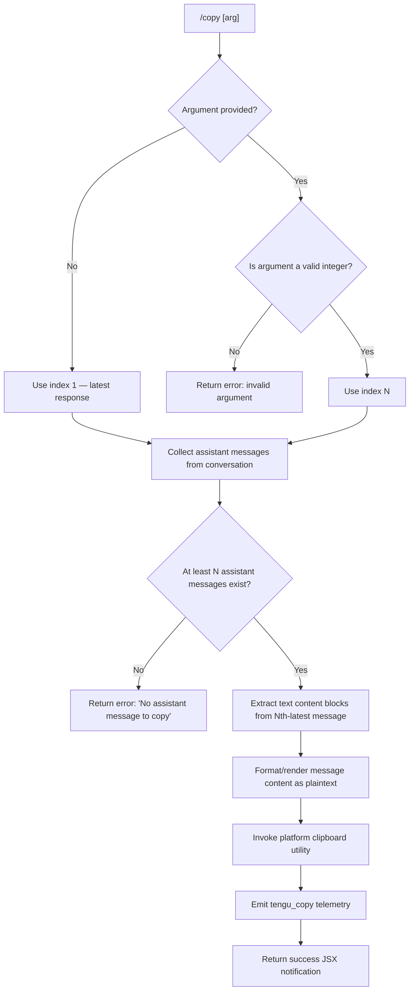

# `/copy`

> Analysis basis: CC v2.1.147 bundle.js (AST extraction + Claude interpretation)
> Minimum version: v2.1.147

---

## Overview

`/copy` copies Claude's most recent assistant response to the system clipboard. An optional integer argument `N` allows the user to copy the Nth-latest assistant response instead of the most recent one. The command locates assistant messages in the current conversation, extracts their text content, formats it, and invokes the appropriate platform clipboard utility.

---

## Registration

| Field | Value |
|---|---|
| type | `local-jsx` |
| name | `copy` |
| description | `Copy Claude's last response to clipboard (or /copy N for the Nth-latest)` |
| module_id | `eO1` |
| load_inline | `true` |
| loc_byte | `10543693` |
| loc_byte_end | `10543879` |
| loc_line | `8391` |
| arbor_handler.name | `wE7` |
| arbor_handler.fqn | `claude-2.1.147::wE7` |
| arbor_handler.kind | `AsyncFunction` |
| arbor_handler.resolution_path | `module_id` |
| arbor_handler.n_hits | `0` |

Analysis basis: CC v2.1.147 bundle.js:+10543693

---

## Input Branching

Four distinct branches exist: no argument (copy latest), valid integer N (copy Nth-latest), invalid non-integer argument, and no assistant messages found.



---

## Behavioral Spec

### Main Handler — `wE7` (asyncCopyHandler)

Analysis basis: CC v2.1.147 bundle.js:+10542878

```
async function asyncCopyHandler(context):
    rawArg = context.args.trim()

    if rawArg is empty:
        targetIndex = 1
    else:
        n = Number(rawArg)
        if not Number.isInteger(n) or n < 1:
            return errorResult("invalid argument — expected a positive integer")
        targetIndex = n

    assistantMessages = collectAssistantMessages(context.messages)
    // assistantMessages is filtered to role == "assistant"

    if assistantMessages.length < targetIndex:
        return errorResult("No assistant message to copy")
        // literal at bundle.js:+10542919

    targetMessage = assistantMessages[assistantMessages.length - targetIndex]
    // most-recent is index 0 from the tail; targetIndex=1 → last element

    plaintext = renderMessageAsPlaintext(targetMessage)

    writeToClipboard(plaintext)
    // see platformClipboardDispatch below

    emit telemetry("tengu_copy")
    // bundle.js:+10543297

    return successJsx()
```

Analysis basis: CC v2.1.147 bundle.js:+10542878–10543693

---

### Assistant Message Collection — `aO1` (collectAssistantMessages)

Analysis basis: CC v2.1.147 bundle.js:+10538896

```
function collectAssistantMessages(messages):
    if not Array.isArray(messages):
        return []
    result = []
    for msg in messages:
        if filterByRole(msg) matches "assistant":
            // filterByRole delegates to LK (roleFilter) — bundle.js:+10538928
            result.push(msg)
    return result
```

---

### Message Content Rendering — `oO1` / `rO1` (renderMessageAsPlaintext / formatTableOrText)

Analysis basis: CC v2.1.147 bundle.js:+10538477, +10537964

The renderer uses a lexer (`Vf.lexer`) to tokenise message content, then dispatches to either table-formatting or plain-text formatting based on content shape.

```
function renderMessageAsPlaintext(message):
    tokens = lexer(message.content)
    // Vf.lexer — bundle.js:+10538477

    idx = tokens.indexOf(...)
    // locate separator token — bundle.js:+10538523

    if content has table structure:
        // detected via literal "table" — bundle.js:+10538590
        formatted = formatTable(tokens)
        // formatTable (rO1) uses:
        //   column separator literal "\\|" — bundle.js:+10538007
        //   display separator " | "       — bundle.js:+10538166
        //   alignment: "center", "right", "left"
        //                               — bundle.js:+10538201,+10538243,+10538283
        //   minimum column count: 3     — bundle.js:+10538066
        //   width measurement via Bun.stringWidth (j8) — bundle.js:+10538082
    else:
        formatted = renderPlaintext(tokens)
        // literal "plaintext" — bundle.js:+10539031

    return formatted
```

Content type determination also checks the `"assistant"` role literal (bundle.js:+10538826) and `"text"` block type (bundle.js:+10249397).

---

### Platform Clipboard Dispatch — `mU_` → `mT` / `rc4` / `lc4` / `cc4` (writeToClipboard)

Analysis basis: CC v2.1.147 bundle.js:+10539242

```
function writeToClipboard(text):
    encoded = encodeForTerminal(text)
    // mT dispatches encoding strategy:
    //   - Kitty terminal protocol  — literal "kitty"   bundle.js:+3343184
    //   - iTerm2 protocol          — literal "iTerm2"  bundle.js:+3343677
    //     uses "load-buffer", "-w" — bundle.js:+3343687,+3343721
    //   - tmux passthrough         — literal "tmux"    bundle.js:+3343749
    //     encodes as utf8/base64   — bundle.js:+3343850,+3343867

    platform = detectPlatform()
    dispatch by platform:
        case "darwin":                         // bundle.js:+3344062
            spawn("pbcopy", [])                // bundle.js:+3344088
        case "linux":                          // bundle.js:+3344114
            try spawn("wl-copy", [])           // Wayland — bundle.js:+3344153
            fallback spawn("xclip",            // bundle.js:+3344199
                ["-selection", "clipboard"])   // bundle.js:+3344220,+3344233
            fallback spawn("xsel",             // bundle.js:+3344265
                ["--clipboard", "--input"])    // bundle.js:+3344284,+3344298
        case "win32":                          // bundle.js:+3344565
            spawn("powershell",                // bundle.js:+3344577
                ["-NoProfile",                 // bundle.js:+3344591
                 "-NonInteractive",            // bundle.js:+3344604
                 "-Command", ...])             // bundle.js:+3344622

    tempDir managed via tO1 / DX:
        base dir: CLAUDE_CODE_TMPDIR or "/tmp" // bundle.js:+3913661
        dir permissions: 0o700 (448 decimal)   // bundle.js:+3914342
        file permissions: 0o777 (511 decimal)  // bundle.js:+3914152
```

---

### Text Normalisation — `fE7` (normaliseTokens) and `sO1` / `zDH` (stripFormatting)

Analysis basis: CC v2.1.147 bundle.js:+10537704, +10538991, +10247753

```
function normaliseTokens(content):
    tokens = lexer(content)           // Vf.lexer — bundle.js:+10537704
    zDH.replace(token, ...)           // strip markdown escapes — bundle.js:+10247753
    accumulate into array via A.push  // bundle.js:+10537769
    return tokens

function stripFormatting(text):
    return text.replace(pattern, replacement)  // bundle.js:+10538991
```

---

## State & Side Effects

| Item | Detail |
|---|---|
| Telemetry | `tengu_copy` (bundle.js:+10543297) — fired on every successful copy |
| Telemetry (indirect) | `tengu_mcp_oauth_flow_start`, `tengu_mcp_oauth_flow_success`, `tengu_mcp_oauth_flow_error` — reachable via deep MCP sub-graph, not directly triggered by `/copy` |
| Telemetry (indirect) | `tengu_bg_spare_enable`, `tengu_bg_spare_spawn`, `tengu_bg_spare_claim`, `tengu_bg_spare_claim_fail`, `tengu_bg_dispatch_low_mem`, `tengu_bg_sendclaim_failed`, `tengu_daemon_config_reload`, `tengu_daemon_yield` — daemon/bg-session infrastructure pulled into the call graph at depth ≤ 2 |
| Clipboard write | Spawns a platform-native process (`pbcopy`, `wl-copy`, `xclip`, `xsel`, or `powershell`) with text piped to stdin |
| Temp file (conditional) | `tO1` may write a temp file under `CLAUDE_CODE_TMPDIR` or `/tmp` for terminal-protocol clipboard passthrough (Kitty/iTerm2/tmux); directory created with mode 0o700 |
| appState changes | None directly; read-only access to `context.messages` |
| Hook registration | None |
| Sound | None |

---

## Version History

| Version | Change |
|---|---|
| v2.1.147 | Initial analysis |

---

## Common Mistakes

1. **Passing a non-integer argument** — `/copy 2.5` or `/copy latest` will fail validation because `Number.isInteger` is checked strictly (bundle.js:+10543002). Only bare positive integers are accepted.
2. **Expecting `/copy` to copy tool output** — the command filters strictly for `role == "assistant"` text blocks (bundle.js:+10538826, +10249397). Tool-use results and user messages are excluded.
3. **Index confusion** — `/copy 1` is the *most recent* response; `/copy 2` is the second-most-recent. Passing an index larger than the number of assistant turns in the session produces the "No assistant message to copy" error.
4. **Clipboard tool absent on Linux** — the command tries `wl-copy` first, then `xclip`, then `xsel`. If none of these are installed the clipboard write will silently fail. Install at least one of these utilities on headless or minimal Linux environments.
5. **Remote SSH sessions** — terminal-protocol passthrough (OSC 52 / Kitty / tmux) is used when a local clipboard binary is unavailable; behaviour depends on whether the terminal emulator supports the protocol.

---

## Appendix — Identifier Mapping

> For bundle debugging only. Identifiers change across versions.

| Identifier | Role |
|---|---|
| `wE7` | Main async copy command handler (asyncCopyHandler) |
| `aO1` | Collect assistant messages from conversation array |
| `oO1` | Render message as plaintext / table dispatcher |
| `rO1` | Table column formatter (pad, align, measure widths) |
| `fE7` | Token normaliser for message content |
| `sO1` | Strip markdown formatting from text |
| `zDH` | Regex-based escape/format remover |
| `mU_` | Top-level clipboard write orchestrator |
| `mT` | Terminal-protocol clipboard encoder selector |
| `mj` | Kitty terminal clipboard encoder |
| `Qc4` | Kitty protocol frame builder |
| `rc4` | macOS / native clipboard spawner |
| `lc4` | tmux clipboard passthrough handler |
| `cc4` | replaceAll-based text normaliser used before clipboard write |
| `tO1` | Temp directory/file writer for clipboard passthrough |
| `DX` | Temp directory creator with permission enforcement |
| `y_L` | Filesystem path validator (lstat + chmod) |
| `LK` | Role filter predicate (keeps "assistant" messages) |
| `Vf` | Markdown lexer wrapper |
| `j8` | String display-width measurement (delegates to `Bun.stringWidth`) |
| `$E7` | Map helper over message tokens |
| `ZC1` | Daemon status reader (reads `daemon.status.json`) |
| `ll` | Daemon status JSON loader |
| `p9H` | Text trimmer / token cleaner (uses `_.trim`, 1000ms constant) |
| `aE6` | Path joiner for daemon status file |
| `CH` | JSON stringifier utility |
| `EkH` | MCP server initialisation orchestrator (deep dep) |
| `RHH` | MCP config resolver (deep dep) |
| `CKH` | MCP server connector with OAuth/type dispatch (deep dep) |
| `SHH` | SDK-type MCP server handler (deep dep) |
| `cD6` | SSE/HTTP MCP transport handler (deep dep) |
| `TN` | MCP tool schema builder (deep dep) |
| `o$` | Tool definition assembler (deep dep) |
| `rj7` | MCP connection state manager (deep dep) |
| `Su_` | Needs-auth cache checker (deep dep) |
| `WK8` | MCP client capabilities checker (deep dep) |
| `GK8` | MCP server hash generator (deep dep) |
| `MP` | SHA-256 hash builder (deep dep) |
| `XK8` | Config key extractor (deep dep) |
| `pK` | Config store accessor (deep dep) |
| `z8` | MCP debug logger (deep dep) |
| `ux_` | MCP server start/connect entry (deep dep) |
| `Hw7` | MCP initialisation prologue (deep dep) |
| `PF` | Auth config accessor (deep dep) |
| `P8H` | Full MCP OAuth server lifecycle manager (deep dep) |
| `RaH` | Pending-auth request tracker (deep dep) |
| `AJ8` | Post-connect MCP state setter (deep dep) |
| `Ud` | MCP reconnect orchestrator (deep dep) |
| `qm` | Config load helper (deep dep) |
| `Y` | Supervisor daemon config reload handler (deep dep) |
| `k7` | MCP error logger (deep dep) |
| `ZH` | Error-to-string converter (deep dep) |
| `eD7` | SSH environment clipboard tool selector (deep dep) |
| `mx_` | MCP "complete_authentication" tool handler (deep dep) |
| `SaH` | Pending redirect URI reader (deep dep) |
| `CaH` | Pending auth request reader (deep dep) |
| `wL1` | MCP needs-auth cache writer (deep dep) |
| `IJ8` | Needs-auth cache path builder (deep dep) |
| `bx_` | MCP token exchange handler (deep dep) |
| `B2_` | MCP config include/exclude checker (deep dep) |
| `M8` | Global config save (deep dep) |
| `OL1` | MCP tool argument integer validator (deep dep) |
| `Gi` | Generic async iterator / batch mapper (deep dep) |
| `g06` | parseInt radix-10 wrapper (deep dep) |
| `Ru_` | parseInt radix-10 wrapper variant (deep dep) |
| `_D5` | MCP server roster refresh (deep dep) |
| `EK8` | MCP server capability flag checker (deep dep) |
| `r8` | Timed subprocess runner with abort (deep dep) |
| `k7K` | MCP server update applier (deep dep) |
| `kJ8` | MCP state serialiser (deep dep) |
| `sN` | MCP server cleanup coordinator (deep dep) |
| `laH` | MCP log flusher (deep dep) |
| `N` | Platform command runner / shell executor (deep dep) |
| `vJK` | Shell command builder (deep dep) |
| `j9A` | Command existence checker (deep dep) |
| `f4` | Sensitive value redactor (deep dep) |
| `l1A` | Token map formatter (deep dep) |
| `lRH` | Log rotate writer (deep dep) |
| `b1A` | Raw stream writer (deep dep) |
| `kJK` | Transcript / log file writer (deep dep) |
| `XRH` | Buffered output batcher (deep dep) |
| `XAH` | Transcript line formatter (deep dep) |
| `F6` | Config directory resolver (deep dep) |
| `C_6` | Filesystem error classifier (deep dep) |
| `e1A` | Log file path builder (deep dep) |
| `t1A` | Log file rotation handler (deep dep) |
| `IJK` | Async log file appender (deep dep) |
| `r9` | Signal handler registration (deep dep) |
| `RH` | Error reporter / logger (deep dep) |
| `n_` | Error normaliser (deep dep) |
| `UH` | String coercer (deep dep) |
| `j1` | Essential-traffic marker (deep dep) |
| `FpK` | Rolling log buffer manager (deep dep) |
| `c` | Core render / JSX helper (deep dep) |
| `w` | Daemon session orchestrator (deep dep) |
| `C` | Child process wrapper (deep dep) |
| `mH` | Feature-ok telemetry emitter (deep dep) |
| `bH` | Feature-bad telemetry emitter (deep dep) |
| `sG8` | macOS memory pressure checker (deep dep) |
| `T$6` | CLAUDE.md / project rules loader (deep dep) |
| `g` | Retire-if-settled session helper (deep dep) |
| `V6` | Config watcher / reload trigger (deep dep) |
| `v6A` | Background session Unix socket connector (deep dep) |
| `S6A` | Background session lifecycle manager (deep dep) |
| `EQ4` | File watcher setup (deep dep) |
| `Tn` | File watcher debounce timer (deep dep) |
| `$i` | Temp path sanitiser (deep dep) |
| `o4_` | Config schema validator (deep dep) |
| `k$H` | Config file reader with backup/migrate (deep dep) |
| `B6` | JSON.parse wrapper (deep dep) |
| `OC` | Config value prefix stripper (deep dep) |
| `q8` | Filesystem write-atomic helper (deep dep) |
| `hy9` | Config backup directory scanner (deep dep) |
| `AL_` | Backup path joiner (deep dep) |

---

Note: index built via Arbor fallback; some signals (telemetry, literals) may be missing — see arbor-fallback.js.