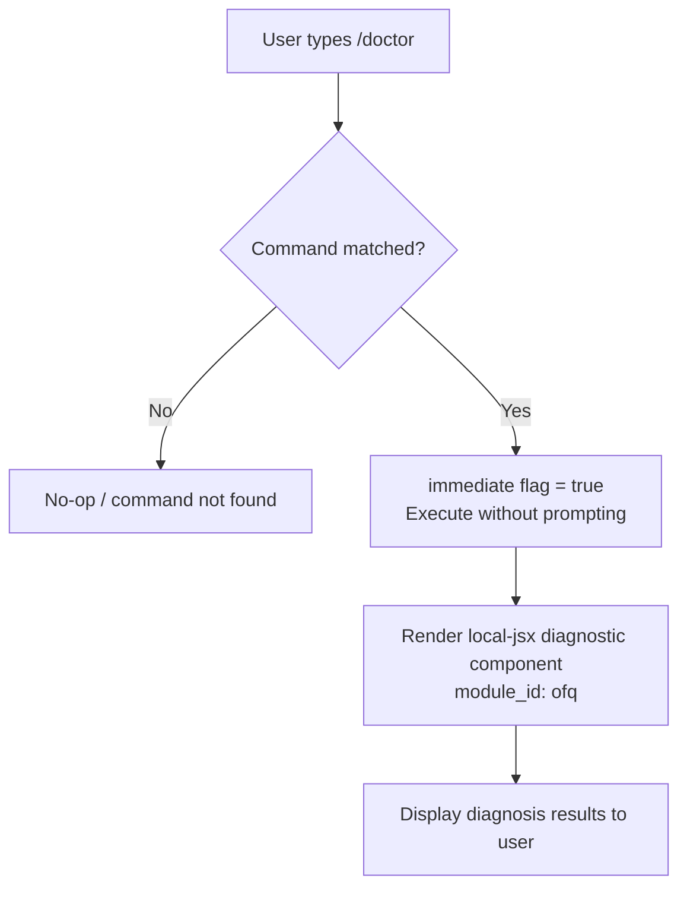

```
---
type: feature-spec
feature: "doctor"
cc_version: 2.1.147
updated: "2026-05-19"
tags: ["doctor", "commands", "slash-commands"]
source: "bundle-analysis"
bundle_verified: true
inherited_from: 2.1.144
analysis_basis: "CC v2.1.144 bundle.js (AST extraction + Claude interpretation)"
author: "ryujaeuk <ryujaeuk@gmail.com>"
repository: "https://github.com/MyLittleLuckyDog/cc-gnothi"
license: "AGPL-3.0-only"
---

# `/doctor`

> Analysis basis: CC v2.1.144 bundle.js (AST extraction + Claude interpretation)
> Minimum version: v2.1.144

---

## Overview

The `/doctor` command diagnoses and verifies the user's Claude Code installation and settings. It is a locally-rendered JSX command (`type: "local-jsx"`) that executes immediately upon invocation without requiring additional user input. Its core mechanism is to inspect the current environment and surface any configuration or installation issues directly in the CLI.

---

## Registration

| Field | Value |
|---|---|
| type | `local-jsx` |
| name | `doctor` |
| description | `Diagnose and verify your Claude Code installation and settings` |
| immediate | `true` |
| module_id | `ofq` |

Analysis basis: CC v2.1.144 bundle.js:+10624100

---

## Input Branching

Because the `immediate: true` flag is set on this command's registration, no further user input is solicited after the slash command is typed. The command runs as soon as it is matched.



Analysis basis: CC v2.1.144 bundle.js:+10624100

---

## Behavioral Spec

### Immediate Execution

Because `immediate` is `true`, the command dispatcher does not wait for additional arguments or confirmation before invoking the command handler. The following pseudocode describes this path:

```
function dispatchDoctorCommand(registeredCommand, userInput):
    if registeredCommand.immediate == true:
        skipArgumentCollection()
        invokeHandler(registeredCommand.moduleId)  // moduleId = "ofq"
    else:
        collectArguments(userInput)
        invokeHandler(registeredCommand.moduleId)
```

Analysis basis: CC v2.1.144 bundle.js:+10624100

### Local JSX Rendering

The command uses `type: "local-jsx"`, meaning its output is rendered as a React/JSX component inside the CLI's terminal UI layer rather than as plain text streamed from a model. The component is identified by module `ofq`.

```
function renderDoctorComponent(moduleId):
    component = resolveLocalJsxModule(moduleId)  // resolves module "ofq"
    mountComponentInTerminalUI(component)
    // Component is responsible for running diagnostics and
    // rendering results as structured terminal output
```

Analysis basis: CC v2.1.144 bundle.js:+10624100

### Diagnostic Logic

> <!-- TODO: not found in depth-2 traversal; needs --depth 4 -->
>
> The internal diagnostic checks performed by module `ofq` (e.g., which installation properties are verified, what conditions trigger warnings vs. errors, how results are formatted) were not resolved during the depth-2 AST traversal. A deeper traversal (--depth 4 or greater) targeting module `ofq` is required to enumerate individual check functions, their pass/fail conditions, and output literals.

---

## State & Side Effects

| Item | Detail |
|---|---|
| Telemetry | <!-- TODO: not found in depth-2 traversal; needs --depth 4 --> No `tengu_*` telemetry events were found at traversal depth ≤ 2 for this command. |
| Hook registration | <!-- TODO: not found in depth-2 traversal; needs --depth 4 --> |
| appState changes | <!-- TODO: not found in depth-2 traversal; needs --depth 4 --> |
| Sound | <!-- TODO: not found in depth-2 traversal; needs --depth 4 --> |

---

## Version History

| Version | Change |
|---|---|
| v2.1.144 | Initial analysis. Command registered as `local-jsx`, `immediate: true`, module `ofq`. |

---

## Common Mistakes

1. **Expecting model output**: Because `/doctor` is `type: "local-jsx"` and `immediate: true`, it does not invoke the language model. Users should not expect a conversational or AI-generated response; output comes entirely from the local diagnostic component.
2. **Passing arguments**: The `immediate` flag means the command fires without argument collection. Any text typed after `/doctor` may be ignored or cause unexpected behavior depending on the dispatcher's argument-handling for immediate commands.
3. **Assuming telemetry coverage**: No telemetry events were identified at traversal depth ≤ 2. This does not guarantee the command emits no telemetry; deeper traversal of module `ofq` is needed before concluding that this command is fully silent with respect to analytics.
4. **Version assumptions**: The `module_id` (`ofq`) is an obfuscated bundle identifier and will likely change across CC versions. Do not hard-code or rely on it outside of v2.1.144 bundle debugging.

---

## Appendix — Identifier Mapping

> For bundle debugging only. Identifiers change across versions.

| Identifier | Role |
|---|---|
| `ofq` | Module ID for the `/doctor` command's local-jsx implementation (not a function identifier, but an obfuscated module key used by the command dispatcher to resolve the JSX component) |

> No additional obfuscated function identifiers were returned by the depth-2 AST traversal for this command. A deeper traversal is required to populate this table further.
```