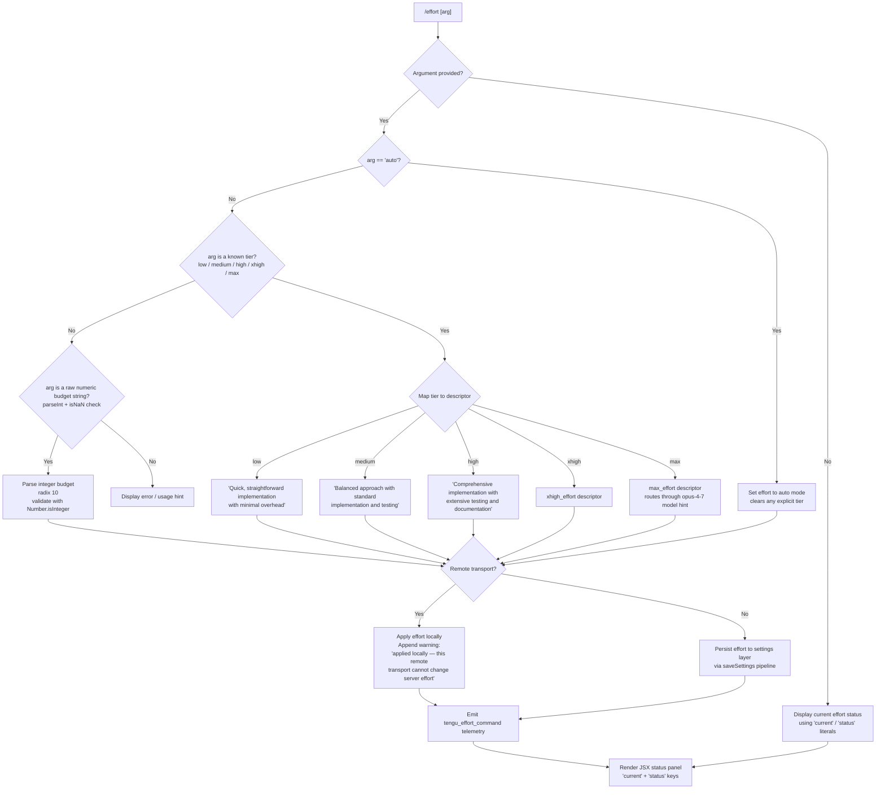

# `/effort`

> Analysis basis: CC v2.1.139 bundle.js (AST extraction + Claude interpretation)
> Minimum version: v2.1.139

---

## Overview

The `/effort` command sets the reasoning and implementation effort level for Claude's model usage within a session or globally. It accepts a named tier (`low`, `medium`, `high`, `xhigh`, `max`, or `auto`) and maps this to an internal effort-mode descriptor that influences how the model approaches tasks. On remote (thin-client) transports, the effort setting is applied locally with a warning that the remote server's effort level cannot be changed.

---

## Registration

| Field | Value |
|---|---|
| type | `local-jsx` |
| name | `effort` |
| description | Set effort level for model usage |
| argumentHint | `[low\|medium\|high\|xhigh\|max\|auto]` |
| immediate | `null` |
| thinClientDispatch | `control-request` |
| module_id | `aPq` |
| load_inline | `true` |
| loc_byte | `11504354` |
| loc_byte_end | `11504617` |
| loc_line | `7160` |
| arbor_handler.name | `cT7` |
| arbor_handler.fqn | `claude-2.1.139::cT7` |
| arbor_handler.kind | `AsyncFunction` |
| arbor_handler.resolution_path | `module_id` |
| arbor_handler.n_hits | `1` |

Analysis basis: CC v2.1.139 bundle.js:+11504354

---

## Input Branching

Six named effort tiers plus an `auto` mode and an unset/clear case produce more than three distinct branches; a flowchart is appropriate.



Analysis basis: CC v2.1.139 bundle.js:+11494967, +11495070, +11495088, +4047441, +4047469, +4047162, +4047181, +4048682, +4048760, +4048853, +4049356, +4049370, +4047698

---

## Behavioral Spec

### Handler Entry Point (`cT7`)

The Arbor-resolved handler `cT7` is an `AsyncFunction` reached via `module_id` resolution path (`aPq`). It is the authoritative entry for all `/effort` invocations.

```
async function effortHandler(args, appState):
    rawArg = args[0] ?? null

    if rawArg is null:
        return renderEffortStatus(appState)   // shows "current" / "status"

    normalizedArg = rawArg.toLowerCase()      // H.toLowerCase call at +11495622

    if isKnownTierName(normalizedArg):        // S56 / LF.includes check
        tier = normalizedArg
    else if looksLikeInteger(normalizedArg):  // parseInt(x, 10) + isNaN guard
        tier = resolveNumericTier(normalizedArg)
    else:
        return renderUsageError()

    descriptor = mapTierToDescriptor(tier)
    applyEffortToSession(appState, descriptor)

    if appState.transport == "remote":
        warnRemote(appState)                  // appends " (applied locally — …)" literal

    emitTelemetry("tengu_effort_command")
    return renderEffortStatus(appState)
```

Analysis basis: CC v2.1.139 bundle.js:+11502749, +11502766, +11502818, +11495622, +11495672

---

### Tier Name Validation (`S56`)

`S56` wraps an `includes` check against a fixed list of valid named tiers. The allowed values are the string literals present in the bundle.

```
function isKnownTierName(value):
    VALID_TIERS = ["low", "medium", "high", "xhigh", "max", "auto", "unset"]
    return VALID_TIERS.includes(value)        // S56 → LF.includes at +4046998
```

Valid named tier strings (from literals):
- `"low"` — "Quick, straightforward implementation with minimal overhead" (bundle.js:+4048694)
- `"medium"` — "Balanced approach with standard implementation and testing" (bundle.js:+4048775)
- `"high"` — "Comprehensive implementation with extensive testing and documentation" (bundle.js:+4048853)
- `"xhigh"` — maps to internal `xhigh_effort` key (bundle.js:+4046646, +4049356)
- `"max"` — maps to internal `max_effort` key, associates with model hint `opus-4-7` (bundle.js:+4047698, +4046292, +4047525)
- `"auto"` — clears explicit tier, reverts to automatic selection (bundle.js:+4047469)
- `"unset"` — explicitly unsets any configured effort (bundle.js:+4047441)

Analysis basis: CC v2.1.139 bundle.js:+4046998, +4047441

---

### Numeric Budget Parsing (`dR` / `au9`)

When the argument is not a named tier, the command attempts to interpret it as a raw numeric token.

```
function resolveNumericTier(rawString):
    str = String(rawString)                   // coerce at +4047113
    parsed = parseInt(str, 10)                // radix 10 at +4047173
    if isNaN(parsed):
        return null                           // invalid; isNaN guard at +4047181
    if not Number.isInteger(parsed):          // au9 → Number.isInteger at +4048557
        return null
    return parsed
```

Analysis basis: CC v2.1.139 bundle.js:+4047113, +4047162, +4047173, +4047181, +4048557

---

### Effort-to-Model Mapping (`ij`, `y56`, `h56`)

Certain high-end tiers trigger model-specific routing logic. The `ij` family of functions cross-references the current model identifier string against a hardcoded allowlist.

```
function resolveModelForTier(tier, currentModel):
    MODEL_ALLOWLIST = [
        "claude-3-",        // prefix match at +4046024
        "claude-opus-4-0",  // +4046042
        "claude-opus-4-1",  // +4046065
        "claude-sonnet-4-0",// +4046088
        "claude-sonnet-4-5",// +4046113
        "claude-haiku-4-5", // +4046138
        "claude-opus-4-7",  // +4046173
        "claude-opus-4-6",  // +4046196
        "claude-sonnet-4-6",// +4046219
        "claude-opus-4-5",  // +4046419
    ]

    if tier == "max":
        preferredModel = "claude-opus-4-7"  // opus-4-7 hint at +4047525
        // Uses My (providerSelector) and $w (platformDispatch) to route
        // through firstParty / anthropicAws / foundry / mantle / gateway providers
    elif tier == "xhigh":
        // Routes similarly, descriptor = xhigh_effort
    else:
        // No model override; keep current model
    return selectedModel
```

Provider backend literals detected: `"firstParty"`, `"anthropicAws"`, `"foundry"`, `"mantle"`, `"gateway"` (bundle.js:+2002011–+2002078).

Analysis basis: CC v2.1.139 bundle.js:+4046004, +4046013, +4047525, +4046292, +4046646

---

### Settings Persistence Pipeline (`UL_` → `k_`)

After tier resolution the setting is persisted using the standard layered-settings write path.

```
async function persistEffortSetting(tier, scope):
    // bQL = settings scope resolver at +4049108
    // w_H = settings write dispatcher at +4049130
    settingsLayer = resolveSettingsLayer(scope)
    // Layers in priority order: policySettings, flagSettings, userSettings,
    //   projectSettings, localSettings  (literals at +1186497–+1177776)
    // Settings file paths:
    //   global: ~/.claude/settings.json        (+1177958)
    //   local:  ~/.claude/settings.local.json  (+1178020)

    acquireLock()              // saveConfigWithLock path via c8_ / dSH
    existingConfig = readConfigFile()
    mergedConfig = mergeEffortKey(existingConfig, tier)
    writeConfigAtomically(mergedConfig)
    releaseLock()

    // apply_flag_settings post-write hook fires at +11494050
    applyFlagSettings()
```

Lock-contention telemetry: `tengu_config_lock_contention` (bundle.js:+3132840).  
Stale-write guard telemetry: `tengu_config_stale_write` (bundle.js:+3132976).  
Auth-loss-prevention telemetry: `tengu_config_auth_loss_prevented` (bundle.js:+3133319).  
Config-parse-error telemetry: `tengu_config_parse_error` (bundle.js:+3135421).

Lock acquisition timeout: 60 000 ms (bundle.js:+3133521).  
Maximum backup rotation: 5 copies (bundle.js:+3133770).  
Config file permission bits: `0o600` (384 decimal, bundle.js:+3134052).

Analysis basis: CC v2.1.139 bundle.js:+4049108, +4049130, +1186497, +1186519, +3132840, +3133521

---

### Remote-Transport Warning (`oPq` / `LN`)

When the active session uses a remote transport (detected via the `ccr` transport identifier, bundle.js:+4045464), the command applies the effort change to local state only and appends a human-readable caveat.

```
function maybeWarnRemote(appState, result):
    if appState.transportType == "ccr":
        result.message += " (applied locally — this remote transport can't change server effort)"
        // literal at +11493927
    return result
```

Analysis basis: CC v2.1.139 bundle.js:+11493927, +4045464

---

### JSX Status Render (`cT7` → `g9.createElement`)

The handler's final step constructs a JSX element tree. Key string keys used in the output object are `"current"` (bundle.js:+11502787) and `"status"` (bundle.js:+11502802). The model name list `n4H` is included-checked to determine which tier labels to surface (bundle.js:+11502749).

```
function renderEffortStatus(appState):
    currentTier = readEffortFromState(appState)
    statusLabel = formatTierLabel(currentTier)   // H array at +11502766
    return createElement(EffortStatusComponent, {
        current: currentTier,
        status:  statusLabel,
    })
```

Analysis basis: CC v2.1.139 bundle.js:+11502749, +11502787, +11502802, +11502818

---

## State & Side Effects

| Item | Detail |
|---|---|
| Telemetry — `tengu_effort_command` | Fired on every successful tier change (bundle.js:+11495260) |
| Telemetry — `tengu_slate_finch` | Fired inside the settings-dispatch layer `UL_` (bundle.js:+4049140) |
| Telemetry — `tengu_config_lock_contention` | Fired when the config-file lock takes longer than expected (bundle.js:+3132840) |
| Telemetry — `tengu_config_stale_write` | Fired when a stale write is detected during config save (bundle.js:+3132976) |
| Telemetry — `tengu_config_auth_loss_prevented` | Fired when a write is aborted to prevent overwriting auth credentials (bundle.js:+3133319) |
| Telemetry — `tengu_config_parse_error` | Fired when the config file cannot be parsed (bundle.js:+3135421) |
| Settings write | Persists `effort` key to the appropriate settings layer (user / project / local) |
| `apply_flag_settings` hook | Triggered post-write to propagate the new effort value to runtime flags (bundle.js:+11494050) |
| Session-only scope | When dispatched via thin-client `control-request`, the change is annotated `(this session only)` (bundle.js:+11494880) |
| Model routing side-effect | `max` and `xhigh` tiers may alter the active model to `claude-opus-4-7` or equivalent via provider-dispatch (bundle.js:+4047525) |
| Config lock file | Lock is acquired and released around every config write; timeout 60 000 ms (bundle.js:+3133521) |
| JSX render | Returns a React element tree via `g9.createElement` (bundle.js:+11502818) |

---

## Version History

| Version | Change |
|---|---|
| v2.1.139 | Initial analysis |

---

## Common Mistakes

1. **Passing an unrecognised tier name** — the command validates the argument against a fixed list. Misspellings (e.g. `"highest"`) fall through to the numeric parser and then fail silently with a usage error, because they are neither a named tier nor a valid integer.
2. **Expecting the remote server's effort to change** — when running against a remote Claude Code relay (`ccr` transport), `/effort` only adjusts the local client state. The server-side effort level is unaffected; see the warning message at bundle.js:+11493927.
3. **Confusing `max` and `xhigh`** — both are high-effort tiers, but `max` specifically maps to the `max_effort` descriptor and prefers `claude-opus-4-7`, while `xhigh` maps to `xhigh_effort` with its own model-routing path. They are not interchangeable aliases.
4. **Expecting `auto` to restore a previous explicit setting** — `auto` clears any explicit tier entirely and defers to automatic selection; there is no stack of previous values.
5. **Assuming `/effort` with no argument changes anything** — omitting the argument only displays the current effort status; no mutation occurs.

---

## Appendix — Identifier Mapping

> For bundle debugging only. Identifiers change across versions.

| Identifier | Role |
|---|---|
| `yJ8` | Top-level effort command module initialiser |
| `G3` | App-state accessor / getter |
| `uJH` | App-state field reader (called by G3) |
| `O3H` | Effort setting reader from app-state |
| `dR` | Tier argument normaliser and validator |
| `au9` | Integer-validity sub-checker (wraps Number.isInteger) |
| `S56` | Known-tier name inclusion checker |
| `TV` | Effort application coordinator |
| `M3H` | Core effort-set logic dispatcher |
| `ij` | Model-compatibility checker for effort tiers |
| `SH` | String coercion / label formatter |
| `R1` | Provider-type resolver (firstParty / anthropicAws / …) |
| `A` | Model-name list (toLowerCase normalised) |
| `My` | Provider selector (WA dispatch) |
| `$w` | Platform-specific effort dispatcher |
| `pa6` | Pre-apply effort validator |
| `b6` | Settings write helper with Date.now timestamp |
| `Ua6` | Post-apply effort validator |
| `y56` | xhigh-effort model router |
| `h56` | max-effort model router |
| `y0H` | Tier-name list formatter for display |
| `UL_` | Settings-layer dispatcher (bQL + w_H + j6) |
| `bQL` | Settings scope resolver |
| `w_H` | Settings write dispatcher |
| `o1` | Subscription / plan type resolver (pro check) |
| `fFA` | Plan-feature flag reader |
| `LFA` | Plan-limit accessor |
| `Pw` | API-key / auth configuration reader |
| `j6` | Config persistence orchestrator with lock |
| `L46` | Config pre-write validator |
| `M46` | Config merge helper |
| `Ya` | Config schema validator |
| `Da` | Config field extractor |
| `Ql6` | Lock-acquisition and deduplication handler |
| `G8_` | Growthbook experiment event emitter |
| `k8_` | Post-lock config write finaliser |
| `hJ8` | Effort command JSX component (React function) |
| `H` | Model-name array / random-delay utility (dual use) |
| `kT7` | Effort command inner handler (applies + persists) |
| `oPq` | Remote-transport detection and warning injector |
| `LN` | Remote-transport app-state accessor |
| `C56` | Effort flag settings applicator |
| `$3H` | Flag settings reader |
| `k_` | Settings load-and-save orchestrator |
| `wf` | Settings file path builder |
| `B6` | File existence checker |
| `Ix8` | Settings file parser |
| `LG` | Settings merge / deep-assign helper |
| `D8` | ENOENT-safe file reader |
| `N` | Log / debug utility |
| `Sb8` | Settings cache timestamp recorder |
| `Zd` | Settings file resolver (QZ.resolve based) |
| `dSH` | Atomic file write with lock and permission preservation |
| `yH` | JSON serialiser (JSON.stringify wrapper) |
| `DD` | Settings in-memory cache invalidator |
| `Sh6` | Append-mode settings file writer |
| `ak` | `.claude` directory path builder |
| `A_` | Settings deep-merge utility |
| `LH` | Settings persistence finaliser with error logging |
| `Ix` | Settings load telemetry wrapper |
| `H8` | Global config save orchestrator |
| `c8_` | Config-file locked writer with backup rotation |
| `suH` | Config serialisation helper |
| `E09` | Config Object.entries iterator |
| `tuH` | Config write timestamp recorder |
| `cfH` | Global config file reader with parse-error telemetry |
| `w46` | Config validation helper |
| `Q` | React / UI rendering context |
| `d8_` | Config backup writer |
| `NT7` | Full effort-change flow (display + persist + remote-warn) |
| `cT7` | Arbor-resolved async handler — command entry point |