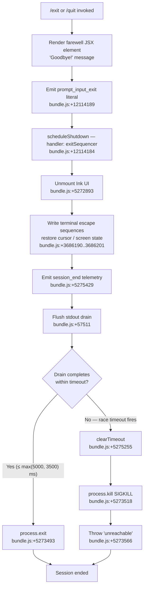

# `/exit`

> Analysis basis: CC v2.1.147 bundle.js (AST extraction + Claude interpretation)
> Minimum version: v2.1.147

---

## Overview

`/exit` (aliased as `/quit`) terminates the current Claude Code CLI session. When invoked, the command triggers an orderly shutdown sequence: it displays a farewell message, flushes pending I/O, fires session-end telemetry, and calls `process.exit` — optionally escalating to `process.kill` if the process has not terminated cleanly within the allotted timeout window.

---

## Registration

| Field | Value |
|---|---|
| type | `local-jsx` |
| name | `exit` |
| description | `null` |
| aliases | `["quit"]` |
| immediate | `true` |
| module_id | `BS1` |
| load_inline | `true` |
| loc_byte | `12114752` |
| loc_byte_end | `12114913` |
| loc_line | `9968` |
| arbor_handler.name | `AQ7` |
| arbor_handler.fqn | `claude-2.1.147::AQ7` |
| arbor_handler.kind | `AsyncFunction` |
| arbor_handler.resolution_path | `module_id` |
| arbor_handler.n_hits | `1` |

Analysis basis: CC v2.1.147 bundle.js:+12114752

---

## Input Branching

The command has more than three distinct behavioral branches during shutdown — farewell rendering, normal exit path, forced-kill escalation path, and drain/race timeout path — so a flowchart is used.



---

## Behavioral Spec

### 1. Command Entry Point (handler: `exitHandler`)

Analysis basis: CC v2.1.147 bundle.js:+12114001

```
async function exitHandler(context):
    // Step 1: notify the process-role classifier
    processRoleClassifier(context)           // Rq → T3H  bundle.js:+12114001

    // Step 2: display farewell animation helper
    farewellAnimator()                       // H (random + setTimeout)  bundle.js:+12114013

    // Step 3: send detach-request to background layer
    detachRequestDispatcher()                // mLH  bundle.js:+12114017

    // Step 4: enqueue scheduled-task cleanup
    scheduledTaskEnqueue()                   // iP8, "scheduled task"  bundle.js:+12114048

    // Step 5: render farewell JSX
    element = createElement(...)             // bl_.createElement  bundle.js:+12114078
    // element references _Q7 (farewellComponent) → hX "Goodbye!" literal  bundle.js:+12113965

    // Step 6: invoke exit sequencer
    exitSequencer(element)                   // s9  bundle.js:+12114184

    // Step 7: record prompt_input_exit event
    recordExitEvent("prompt_input_exit")     // bundle.js:+12114189
```

---

### 2. Detach-Request Dispatcher (`detachRequestDispatcher`)

Analysis basis: CC v2.1.147 bundle.js:+10550400

```
function detachRequestDispatcher():
    // Signals the background/daemon layer before teardown
    backgroundSignal()                       // Bd6  bundle.js:+10550400
    taskStateUpdater("task")                 // Mz1 → v8  bundle.js:+10550419
    socketWriter("detach-request")           // Jo → jo.write  bundle.js:+10550425
    // "detach-request" literal  bundle.js:+10550434
    sessionStateWriter()                     // h8H  bundle.js:+10550480
```

---

### 3. Exit Sequencer (`exitSequencer`)

Analysis basis: CC v2.1.147 bundle.js:+5274961

This is the central async shutdown pipeline. It races a drain promise against a hard timeout and forces a kill if needed.

```
async function exitSequencer(element):
    // Phase A: UI teardown
    terminalEscapeWriter()                  // VVH bundle.js:+5275029
        yYH.writeSync(ESC_SAVE)             // "\x1B7"  bundle.js:+3686190
        uiUnmount()                         // H.unmount  bundle.js:+5272893
        yYH.writeSync(ESC_RESTORE)          // "\x1B8"  bundle.js:+3686201
        terminalMultiplexerFix(ue6)         // fixes tmux / screen / ghostty escape sequences
        stringNormalizer(UH)

    // Phase B: goodbye output
    writeGoodbyeLine(dP_)                   // bundle.js:+5275035
        sV, dR, h6
        pathResolver(PD6) → statSync check
        contentOrganizerResolver(CO) → v4 → r9
        replaceAll("\\", "\"")              // bundle.js:+5273204..5273227
        yYH.writeSync(output)               // bundle.js:+5273285
        P6.dim(dimmedSuffix)                // bundle.js:+5273301

    // Phase C: schedule forced-kill fallback
    forcedKillScheduler = setTimeout(
        forcedKillCallback(cP_),
        max(5000, 3500)                     // bundle.js:+5275058, 5275065
    )
    forcedKillCallback(cP_):
        clearTimeout(timer)
        QL.get(pidMap)
        process.exit(code)                  // bundle.js:+5273493
        process.kill(pid, signal)           // bundle.js:+5273518
        // if still alive: throw Error("unreachable") bundle.js:+5273566

    // Phase D: telemetry flush
    telemetryFlusher(r_6)                   // bundle.js:+5275356
        startupPerfReport(bS8)              // tengu_startup_perf  bundle.js:+212052
        performanceCheckpointWriter(JKA)

    // Phase E: session-end metrics
    sessionEndMetrics(M18)                  // bundle.js:+5275369
        scrollSummaryEvent(z9)              // tengu_scroll_summary  bundle.js:+5274361
            amberCreekEvent()               // tengu_amber_creek  bundle.js:+3351745
            pewterBrookEvent()              // tengu_pewter_brook  bundle.js:+3351653
        cacheEvictionHint(Y86)              // tengu_cache_eviction_hint  bundle.js:+5275394

    // Phase F: drain race
    drainPromise = stdoutDrain(WRH)         // D9A.drain  bundle.js:+57511
    raceResult = await Promise.race([
        drainPromise,
        abortSignalTimeout(AbortSignal.timeout(...))  // bundle.js:+5275320
    ])

    // Phase G: supervisor session close
    supervisorSessionClose(Y)              // bundle.js:+5275232
        sessionReporter(LPH)               // bundle.js:+15131747
        q.write("supervisor")              // bundle.js:+15131764
        sessionStoppers(T, V, Z)

    // Phase H: clean up forced-kill timer
    clearTimeout(forcedKillScheduler)      // bundle.js:+5275255

    // Phase I: final write and exit
    yYH.writeSync(finalNewline)            // bundle.js:+5275498
    // process.exit fires via cP_ if not already done
```

---

### 4. Farewell Component (`farewellComponent`)

Analysis basis: CC v2.1.147 bundle.js:+12113956

```
function farewellComponent():
    // Renders the string "Goodbye!" to the terminal UI
    // hX references the literal "Goodbye!" at bundle.js:+12113965
    return JSXElement { text: "Goodbye!" }
```

---

### 5. Forced-Kill Escalation (`forcedKillCallback`)

Analysis basis: CC v2.1.147 bundle.js:+5273412

```
function forcedKillCallback(pidMap, exitCode):
    clearTimeout(pendingTimer)
    pid = QL.get(pidMap)
    if process exits cleanly:
        process.exit(exitCode)              // bundle.js:+5273493
    else:
        process.kill(pid, SIGKILL)          // bundle.js:+5273518
        throw new Error("unreachable")      // bundle.js:+5273566
```

The window before escalation is `max(5000, 3500)` = **5000 ms** (bundle.js:+5275058).

---

### 6. Background Daemon Interaction

Analysis basis: CC v2.1.147 bundle.js:+15117797, +15118376

The call chain through `mLH` interacts with the background daemon layer. Relevant telemetry events emitted in the daemon subsystem (reachable via depth-2 traversal from `AQ7`) include `tengu_bg_dispatch_sigkill_escalate` and `tengu_bg_dispatch_low_mem`, indicating that the daemon manager may itself escalate SIGKILL or throttle under low-memory conditions during a shutdown triggered by `/exit`.

---

## State & Side Effects

| Item | Detail |
|---|---|
| Telemetry — session_end | `session_end` string literal fired via `M18` / `z9` path (bundle.js:+5275429) |
| Telemetry — prompt_input_exit | Literal `"prompt_input_exit"` recorded at command handler return (bundle.js:+12114189) |
| Telemetry — tengu_scroll_summary | Fired in `sessionEndMetrics` → `scrollSummaryEvent` (bundle.js:+5274361) |
| Telemetry — tengu_amber_creek | Fired inside scroll-summary path (bundle.js:+3351745) |
| Telemetry — tengu_pewter_brook | Fired inside scroll-summary path (bundle.js:+3351653) |
| Telemetry — tengu_cache_eviction_hint | Fired via `Y86` in `sessionEndMetrics` (bundle.js:+5275394) |
| Telemetry — tengu_startup_perf | Fired during telemetry flush via `bS8` (bundle.js:+212052) |
| Telemetry — tengu_bg_dispatch_sigkill_escalate | Daemon layer; may fire if background worker requires SIGKILL (bundle.js:+15117797) |
| Telemetry — tengu_bg_dispatch_low_mem | Daemon layer; fires when memory is low during shutdown (bundle.js:+15118376) |
| Telemetry — tengu_bg_spare_enable / claim / claim_fail / spawn | Daemon spare-process lifecycle events (bundle.js:+15119071..+15117490) |
| Telemetry — tengu_daemon_config_reload | Supervisor config-reload event (bundle.js:+15132565) |
| UI unmount | `H.unmount()` called to tear down the Ink React tree (bundle.js:+5272893) |
| Terminal escape sequences | ESC-save (`\x1B7`) and ESC-restore (`\x1B8`) written to stdout; tmux/screen double-escape correction applied (bundle.js:+3686190, +3686201, +3343266) |
| Detach-request socket message | `"detach-request"` written to daemon socket before teardown (bundle.js:+10550434) |
| Stdout drain | `D9A.drain` awaited with `Promise.race` and abort-signal timeout (bundle.js:+57511, +5275320) |
| Forced process kill | `process.exit` called after drain; `process.kill` SIGKILL escalation if not clean within 5000 ms (bundle.js:+5273493, +5273518) |
| Startup perf report | Performance checkpoint data written to file via `JAH` (fsyncSync) and logged (bundle.js:+182402..+182507) |
| Sound | <!-- TODO: not found in depth-2 traversal; needs --depth 4 --> |
| appState changes | Session supervisor (`Y`) stops watchers `T`, `V`, `Z`; config map updated (bundle.js:+15132040, +15132160, +15132169) |

---

## Version History

| Version | Change |
|---|---|
| v2.1.147 | Initial analysis |

---

## Common Mistakes

1. **Using `/exit` expecting an immediate hard kill** — the command performs an orderly drain sequence that can take up to 5 000 ms before forcing termination. If the process appears to hang briefly after `/exit`, this is by design.
2. **Confusing `/exit` and `/quit`** — both names are identical aliases for the same handler (`AQ7`); there is no behavioral difference between them (bundle.js:+12114752).
3. **Assuming no telemetry on exit** — `/exit` emits multiple telemetry events (`session_end`, `prompt_input_exit`, `tengu_scroll_summary`, etc.) before the process terminates. Network-restricted environments may observe a short delay while these are flushed.
4. **Sending `/exit` while a background daemon session is active** — the `"detach-request"` message must be written to the daemon socket before shutdown; if the socket is unavailable, the detach step may silently fail but the process still exits.
5. **Expecting a visible farewell in non-TTY or piped output** — the `"Goodbye!"` message is rendered via Ink JSX and the terminal escape sequences (`\x1B7`/`\x1B8`) are written directly to stdout. In non-interactive contexts the visual output may be suppressed.

---

## Appendix — Identifier Mapping

> For bundle debugging only. Identifiers change across versions.

| Identifier | Role |
|---|---|
| `AQ7` | Main exit command handler (AsyncFunction; Arbor-resolved entry point) |
| `Rq` | Process-role classifier (calls `T3H`) |
| `T3H` | Process-role classification helper |
| `H` | Farewell animator (uses `Math.random` + `setTimeout`) |
| `mLH` | Detach-request dispatcher (coordinates daemon detach before shutdown) |
| `Bd6` | Background signal sender |
| `Mz1` | Task-state updater |
| `QjH` | Task-state helper |
| `v8` | Task-type constant provider |
| `Jo` | Socket writer (writes detach-request message) |
| `CH` | JSON serialiser helper (`JSON.stringify` wrapper) |
| `h8H` | Session-state writer |
| `Nf` | Auxiliary pre-exit notifier |
| `iP8` | Scheduled-task enqueue function |
| `k0` | Task queue accessor (`oV`) |
| `oV` | Core state store accessor |
| `JE7` | Scheduled-task entry builder |
| `SZ` | Cron/schedule expression parser |
| `K` | Schedule column formatter (`padEnd`) |
| `w` | Process manager / daemon worker controller |
| `L` | Async task tracker (`q.add` / `q.delete`) |
| `j` | Background session killer (`y.kill`) |
| `D` | Daemon cleanup / disposal coordinator |
| `$` | ZC1-based helper (session lookup) |
| `J` | Date/day-of-week calculator |
| `DN` | Schedule description normaliser (`H.trim` / `D3L`) |
| `D3L` | Cron-field parser (`H.split` / `parseInt` / `Array.from`) |
| `A` | String case converter (`toLowerCase`) |
| `EQH` | Scheduled-time resolver (sets seconds/minutes/hours/date/month) |
| `_` | Generic utility / date-time object |
| `O` | Date-time manipulator (setSeconds, setMinutes, etc.) |
| `M` | Connection/stream closer (`A.close`, `q.close`) |
| `q` | File unlinker (`HfK.unlinkSync`) |
| `Hq` | Duration formatter (`Math.floor` / `Math.round`) |
| `bq` | String truncator (`H.indexOf` / `H.substring`) |
| `j8` | String-width measurer (`Bun.stringWidth`) |
| `Yq` | Grapheme-aware string splitter (`cz`) |
| `cz` | Grapheme segmentation helper |
| `_Q7` | Farewell JSX component wrapper (renders `hX` / "Goodbye!") |
| `s9` | Exit sequencer (main async shutdown pipeline) |
| `VVH` | Terminal UI unmounter and escape-sequence writer |
| `nh` | Post-unmount cleanup hook |
| `ue6` | Terminal escape sequence emitter (saves/restores screen state) |
| `FTH` | Terminal-type detector (ghostty, iTerm, etc.) |
| `mTH` | Multiplexer-mode helper |
| `zG` | tmux/screen escape-sequence fixer (`H.replaceAll`) |
| `UH` | String coercer (`String(...)`) |
| `dP_` | Goodbye-line writer (path resolution + dimmed output) |
| `sV` | Session-value accessor |
| `dR` | Directory resolver |
| `h6` | Path existence checker (`oV`) |
| `PD6` | Path resolver / stat checker (`q.statSync`) |
| `sy` | Store reader (`oV`) |
| `w_` | Working-directory resolver (`oV`) |
| `F6` | File-system utility helper |
| `CO` | Content organiser resolver (`v4` → `r9`) |
| `v4` | Config value reader (`r9`) |
| `F7q` | Formatting helper |
| `cP_` | Forced-kill callback (`process.exit` / `process.kill`) |
| `WRH` | Stdout drain awaiter (`D9A.drain`) |
| `Y` | Supervisor session closer (stops watchers, updates config) |
| `LPH` | Session reporter (writes session metadata) |
| `M1` | Async-local-storage store reader (`m_L.getStore`) |
| `q8` | Queue/state accessor |
| `Hi_` | Helper invoking `en_` |
| `ZH` | String converter (`String(...)`) |
| `sx1` | Session stats formatter (`Math.max`, `qz`) |
| `T` | Keyboard/event listener stopper (`preventDefault` / `IW`) |
| `b` | Event object (keyboard) |
| `IW` | Settings writer (`_A` / `userSettings`) |
| `V` | Watcher with `stop` / `updateConfig` / `start` |
| `kfK` | Heartbeat helper (`xt`) |
| `xt` | Heartbeat emitter |
| `Z` | Secondary watcher (`Z.start`) |
| `c` | Generic callback / continuation |
| `r_6` | Telemetry flush coordinator (`bS8` / `JKA`) |
| `bS8` | Startup performance reporter (`tengu_startup_perf`) |
| `pu` | Node `require` wrapper |
| `JKA` | Performance checkpoint writer (`WKA`, `JAH`, `YKA`, `N`) |
| `WKA` | Path joiner / opener (`Cy6.join`, `o8`, `h6`) |
| `JAH` | Atomic file writer (`openSync` / `writeFileSync` / `fsyncSync` / `closeSync`) |
| `YKA` | Checkpoint aggregator (`_.entries`, `Sy6`, `sc`) |
| `N` | Log/output formatter (`CH`, `toUpperCase`, `hI`, `lRH`, `kJK`) |
| `M18` | Session-end metrics emitter (`tengu_scroll_summary`, cache hint) |
| `B7q` | Metrics helper |
| `U7q` | Duration/time calculator (`Date.now`, `Math.max`, `Math.round`, `Object.assign`) |
| `m7q` | Metrics aggregation helper |
| `z9` | Scroll-summary and fullscreen-mode reporter |
| `VbH` | Known-hash checker (`kmK.has`) |
| `G7_` | String builder (`r1`, `UH`) |
| `bn` | Accumulator (`Al4`) |
| `W7_` | Boolean flag evaluator (`o6`, `Boolean`) |
| `HA` | Keyboard shortcut handler (`Km`) |
| `ql4` | Amber-creek event emitter (`V6`) |
| `V6` | Core event dispatcher (`Df6`, `wf6`, `Ct`, `As6`, `zf6`, `Pg`, `x6`) |
| `Y86` | Cache-eviction-hint emitter (`tengu_cache_eviction_hint`) |
| `f18` | Promise-race / timeout helper (`$Z`, `Eg`, `r8`) |
| `r8` | Abort/timeout error factory (`setTimeout`, `clearTimeout`, `L.unref`) |