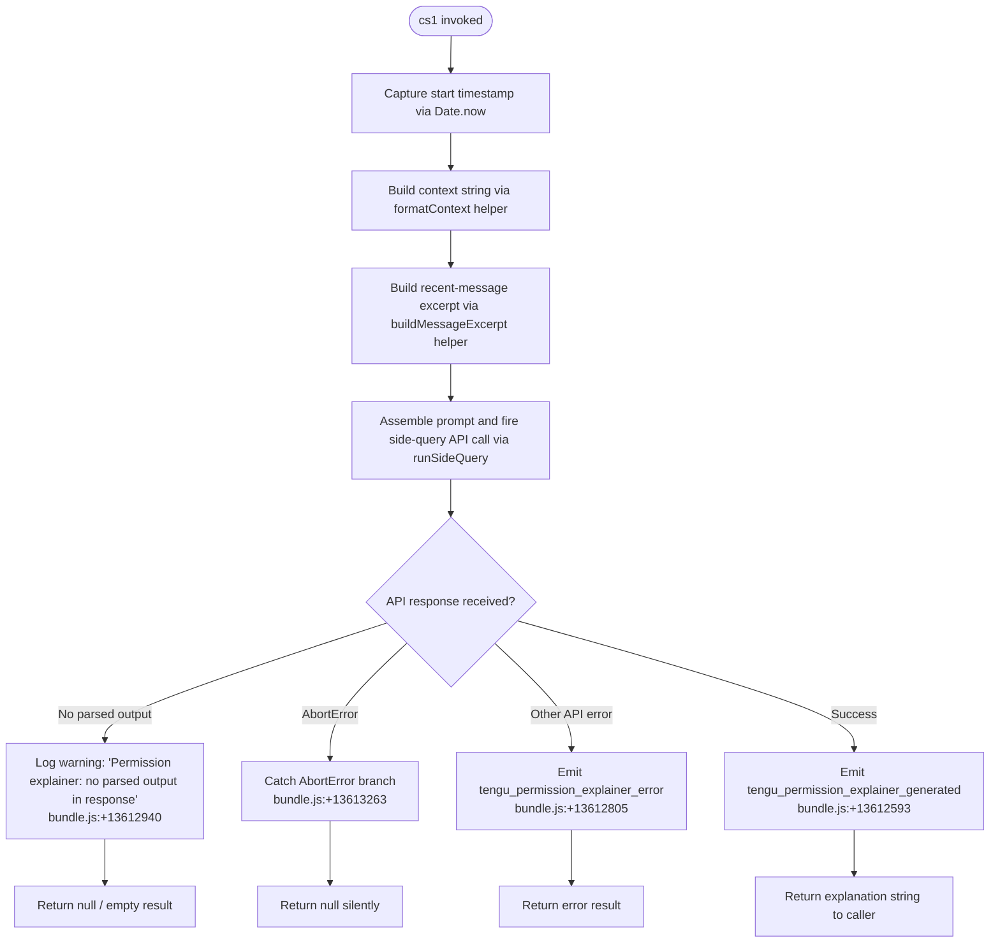

# `/explain_command`

> Analysis basis: CC v2.1.147 bundle.js (AST extraction + Claude interpretation)
> Minimum version: v2.1.147

---

## Overview

`/explain_command` is an internal tool-type command that generates a natural-language explanation of why a given tool or permission was requested. It invokes a side API call against the Claude model to produce a human-readable justification string, primarily used by the permission-request UI to surface rationale to the user before they accept or deny an action.

---

## Registration

| Field | Value |
|---|---|
| type | `tool` |
| name | `explain_command` |
| description | `null` |
| loc_byte | `13612110` |
| loc_byte_end | `13612146` |
| loc_line | `12289` |
| arbor_handler.name | `cs1` |
| arbor_handler.fqn | `claude-2.1.147::cs1` |
| arbor_handler.kind | `AsyncFunction` |
| arbor_handler.resolution_path | `direct` |
| arbor_handler.n_hits | `1` |

Analysis basis: CC v2.1.147 bundle.js:+13612110

---

## Input Branching

The handler exhibits four distinct top-level branches: early-exit when the response contains no parsed output, abort-error handling, generic API-error handling, and the success path that emits telemetry and returns the explanation. A Mermaid diagram is therefore required.



---

## Behavioral Spec

### Main handler — `permissionExplainerHandler` (bundle ident: `cs1`)

```
async function permissionExplainerHandler(toolName, toolInput, context):
    startTime = Date.now()                          // bundle.js:+13611829

    // 1. Format context string (bundle ident: B45)
    contextString = formatContextString(context)    // bundle.js:+13611850

    // 2. Build a short excerpt from recent assistant messages
    //    - filter messages to role == "assistant"   // bundle.js:+13611404
    //    - keep last 3 messages                     // bundle.js:+13611424
    //    - truncate each message body to 1000 chars // bundle.js:+13611369
    //    - extract text-type content blocks only    // bundle.js:+13611507
    //    - reverse, slice, prepend "..."            // bundle.js:+13611605
    //    - join into single string
    excerpt = buildMessageExcerpt(messages)         // bundle.js:+13611868

    // 3. Assemble full prompt via buildExplainerPrompt (bundle ident: Bq)
    prompt = buildExplainerPrompt(toolName, toolInput, contextString, excerpt)
                                                    // bundle.js:+13612015

    // 4. Execute side-query API call (bundle ident: rb)
    //    - tagged as "side_query"                   // bundle.js:+12891956
    //    - uses "permission_explainer" label        // bundle.js:+13612168
    //    - emits tengu_permission_explainer_generated on success
    //    - emits tengu_permission_explainer_error on failure
    response = await runSideQuery(prompt)           // bundle.js:+13612028

    // 5. Check parsed output presence
    if response has no parsed output:
        log("Permission explainer: no parsed output in response")
                                                    // bundle.js:+13612940
        return null

    // 6. Error classification
    if error.name == "AbortError":                  // bundle.js:+13613263
        return null
    if error indicates api_error:                   // bundle.js:+13613334
        emit telemetry("tengu_permission_explainer_error")
                                                    // bundle.js:+13612805
        return errorResult

    // 7. Happy path
    emit telemetry("tengu_permission_explainer_generated")
                                                    // bundle.js:+13612593
    return explanationString
```

### Context string formatter — `formatContextString` (bundle ident: `B45`)

```
function formatContextString(context):
    // Serialises the tool-call context object to a compact string
    // Uses JSON serialisation helper (CH → JSON.stringify)  // bundle.js:+13611315
    // Converts result to String                            // bundle.js:+13611341
    return String(jsonSerialise(context))
```

### Message excerpt builder — `buildMessageExcerpt` (bundle ident: `F45`)

```
function buildMessageExcerpt(messages):
    // Keep only assistant-role messages                    // bundle.js:+13611404
    assistantMessages = messages.filter(m => m.role == "assistant")

    // Take at most 3 most-recent messages                  // bundle.js:+13611424
    recent = assistantMessages.reverse().slice(0, 3)

    // For each message, extract text blocks, truncate to 1000 chars
    //                                                      // bundle.js:+13611369
    textParts = recent.flatMap(m =>
        m.content
            .filter(block => block.type == "text")         // bundle.js:+13611507
            .map(block => block.text.slice(0, 1000))
    )

    // Prepend ellipsis sentinel and join                   // bundle.js:+13611605
    textParts.unshift("...")
    return textParts.join(" ")                             // bundle.js:+13611646
```

### Prompt assembler — `buildExplainerPrompt` (bundle ident: `Bq`)

```
function buildExplainerPrompt(toolName, toolInput, contextString, excerpt):
    // Delegates to normalisedPromptBuilder (ps) which in turn
    // calls filterAndFormatPrompt (FF) for model-family routing   // bundle.js:+2168172
    // and singleLineNormaliser (lq) for whitespace normalisation  // bundle.js:+2168208
    // and multiPartJoiner (bJ) for final assembly                 // bundle.js:+2168221
    return assembledPromptString
```

### Side-query executor — `runSideQuery` (bundle ident: `rb`)

```
async function runSideQuery(prompt):
    // Builds API client via buildAPIClient (xm)              // bundle.js:+12891924
    // Attaches "side_query" tag                              // bundle.js:+12891956
    // Sends request; measures performance via performance.now  // bundle.js:+12892999
    // On success: records tengu_api_success                  // bundle.js:+12893407
    //   with Math.round timing and Math.max token counts     // bundle.js:+12893681
    // Applies 1h prompt-cache config                         // bundle.js:+12892806
    //   (tengu_prompt_cache_1h_config)
    // Calls responseExtractor (mOH) to obtain parsed output  // bundle.js:+12893282
    // Optionally computes request hash via hashRequest (Go_) // bundle.js:+12892117
    return parsedResponse
```

### API client builder — `buildAPIClient` (bundle ident: `xm`)

```
function buildAPIClient(options):
    // Resolves auth via oauthTokenStore (bD/i$)
    // Sets headers including:
    //   "x-app"                                              // bundle.js:+2897993
    //   "User-Agent"                                         // bundle.js:+2898021
    //   "X-Claude-Code-Session-Id"                          // bundle.js:+2898039
    //   "x-claude-remote-container-id"                      // bundle.js:+2898083
    //   "x-claude-remote-session-id"                        // bundle.js:+2898124
    //   "x-client-app"                                      // bundle.js:+2898163
    //   "x-claude-code-agent-id"                            // bundle.js:+2898197
    //   "x-claude-code-parent-agent-id"                     // bundle.js:+2898260
    // Sets max timeout to 600000 ms (10 min)                // bundle.js:+2898900
    // Handles cloud gateway session expiry                   // bundle.js:+2899080
    // Routes through proxy-auth helper if workspace trust accepted // bundle.js:+1762288
    return configuredClient
```

### Tool-type guard — `isMcpToolCheck` (bundle ident: `iq`)

```
function isMcpToolCheck(toolName):
    // Checks Object.hasOwn for tool properties               // bundle.js:+3137997
    // Returns true if toolName starts with "mcp_tool" prefix // bundle.js:+3138049
    //   (literal "mcp_tool" at bundle.js:+3138077)
    return boolean
```

---

## State & Side Effects

| Item | Detail |
|---|---|
| Telemetry — success | `tengu_permission_explainer_generated` (bundle.js:+13612593) |
| Telemetry — error | `tengu_permission_explainer_error` (bundle.js:+13612805) |
| Telemetry — API success | `tengu_api_success` (bundle.js:+12893407) |
| Telemetry — prompt cache | `tengu_prompt_cache_1h_config` (bundle.js:+12854453) |
| Telemetry — OAuth (indirect) | `tengu_oauth_token_refresh_*` family (bundle.js:+2939252–2940916) |
| Telemetry — config errors | `tengu_config_parse_error` (bundle.js:+3187440) |
| Side-query API call | Fires a non-interactive `"side_query"`-tagged API request to the Claude backend |
| Auth side-effect | May trigger an OAuth token refresh cycle via the token-refresh lock machinery |
| appState changes | None directly; returns explanation string to caller for UI display |
| Hook registration | None observed within depth-2 traversal |
| Sound | None observed |
| File I/O (indirect) | Config read via `q.readFileSync` (bundle.js:+3186859); backup copy via `q.copyFileSync` (bundle.js:+3187948) through config subsystem |

---

## Version History

| Version | Change |
|---|---|
| v2.1.147 | Initial analysis |

---

## Common Mistakes

1. **Treating `explain_command` as a user-facing slash command.** It is registered as `type: "tool"`, not a `prompt`-type command. It is invoked programmatically by the permission-request UI layer, not typed by the user at the prompt.
2. **Expecting a non-null return on all paths.** The handler explicitly returns `null` for both the no-parsed-output case and the `AbortError` case. Callers must guard against null results.
3. **Ignoring the 1000-character truncation on message excerpts.** Consumers who supply very long assistant messages will receive silently truncated context; this affects explanation quality (bundle.js:+13611369).
4. **Assuming `description` is populated.** The registration has `description: null`; do not rely on a description string being present in any registration-metadata introspection.
5. **Confusing `mcp_tool` prefix with the `mcp__` prefix class.** The `isMcpToolCheck` guard (bundle ident `iq`) uses the literal `"mcp_tool"` (bundle.js:+3138077), not the `mcp__` prefix used by the MCP dynamic-name command class.

---

## Appendix — Identifier Mapping

> For bundle debugging only. Identifiers change across versions.

| Identifier | Role |
|---|---|
| `cs1` | Main async handler for `explain_command` (permissionExplainerHandler) |
| `Rt_` | Pre-flight / context preparation helper called by cs1 |
| `x6` | Config file watcher / loader used within Rt_ |
| `k$H` | Configuration reader (readFileSync wrapper, JSON parse, backup) |
| `hy9` | Directory listing helper used by k$H |
| `EQ4` | File watch setup helper used by x6 |
| `B45` | Context string formatter |
| `CH` | JSON serialisation utility (JSON.stringify wrapper) |
| `F45` | Recent message excerpt builder |
| `Bq` | Full prompt assembler |
| `ps` | Normalised prompt builder called by Bq |
| `FF` | Filter-and-format prompt helper |
| `lq` | Single-line whitespace normaliser |
| `bJ` | Multi-part prompt joiner |
| `WW` | Prompt-part composition coordinator |
| `rb` | Side-query executor |
| `xm` | API client builder |
| `bD` | Auth store accessor (AsyncLocalStorage getStore) |
| `Wu4` | URL/path string parser |
| `Rq` | Request queue manager |
| `jn` | Session context resolver |
| `Rd6` | Secondary store accessor (f99.getStore) |
| `h6` | Response helper (oV) |
| `Nt8` | URL encoder helper |
| `UH` | String coercion utility |
| `i$` | OAuth token resolver (z1_) |
| `z1_` | OAuth token refresh / lock orchestrator |
| `mD` | Auth credential dispatcher |
| `Uv` | Credential builder |
| `r$` | API key / OAuth token resolver |
| `ZqH` | Auth token normaliser |
| `Pu4` | Proxy / gateway configuration handler |
| `OUH` | Gateway JWT refresh helper |
| `sU6` | Proxy auth helper invoker |
| `xWH` | Proxy header builder |
| `lmA` | Proxy URL parser |
| `a14` | Proxy port parser (parseInt + isNaN) |
| `EC` | Trust-state checker |
| `gP` | Proxy helper runner |
| `Eu4` | HTTP request executor (streaming) |
| `Zu4` | Auth header sanitiser (masks authorization header) |
| `Tu4` | Response validator |
| `rq_` | Token-count maximiser (Math.max wrapper) |
| `Gu4` | Stream reader / watchdog with timeout |
| `RD` | Provider-type router |
| `HQ6` | First-party API header builder |
| `gj4` | URL prefix checker |
| `eg6` | Provider enum normaliser |
| `tz` | Proxy configuration resolver |
| `ul` | Proxy URL string parser |
| `pu6` | Proxy auth modules (Eh, fm) |
| `Xu4` | Model endpoint resolver |
| `Br6` | Bedrock endpoint builder |
| `IXH` | Vertex endpoint resolver |
| `R9` | OAuth custom URL validator |
| `v3H` | Gateway JWT refresh scheduler |
| `JW4` | Gateway JWT HTTP POST |
| `Ky8` | Timestamp utility |
| `DM6` | Header case-normaliser |
| `w$H` | SDK error/warn logger |
| `SfK` | File realpath/stat checker |
| `Nj5` | Realpath result handler |
| `Vj` | Model capability checker |
| `BmH` | WIF (Workload Identity Federation) credential provider |
| `Lc6` | WIF token exchange HTTP caller |
| `GW4` | WIF error classifier |
| `IW` | User settings accessor |
| `P` | Daemon IPC socket reader |
| `fj5` | Daemon protocol frame handler |
| `KM` | Daemon frame encoder |
| `LfK` | Daemon lease / heartbeat scheduler |
| `HY` | Background-service check (v$H) |
| `RK` | Socket path builder |
| `Mj5` | Daemon worker lifecycle manager |
| `KN6` | Daemon socket write helper |
| `SGH` | Streaming response assembler |
| `jq` | Model-name / response normaliser |
| `Ij` | Model name string cleaner |
| `eP` | Response text replacer |
| `Sh` | Auth-aware response shim |
| `st7` | Conversation history finder |
| `Go_` | Request hash generator (SHA-256) |
| `bd6` | Response context builder |
| `Ws6` | Workspace trust helper |
| `tVH` | Prompt-cache config applicator |
| `V6` | Config snapshot resolver |
| `As6` | Config cache accessor |
| `MZ` | Config merge helper |
| `_1_` | Base config reader |
| `nr6` | Response post-processor |
| `mOH` | Parsed output extractor |
| `Um` | Random-bytes / ID generator |
| `M8` | Config object constructor |
| `I5` | Auth + config coordinator |
| `bZH` | Agent-address resolver (aOL) |
| `GQ` | Agent-address formatter (oOL) |
| `oOL` | Agent URI parser |
| `XD_` | Agent URI slice helper |
| `a1H` | Agent URI prefix checker |
| `iq` | MCP tool-type guard (hasOwn + startsWith check) |
| `K8` | Generic error wrapper |
| `ZH` | String coercion utility (String wrapper) |
| `AL_` | Backup directory path builder |
| `N` | Log-level formatter / logger |
| `RH` | Error reporter (logError) |
| `OC` | String prefix stripper |
| `B6` | JSON.parse wrapper |
| `q8` | Config error classifier |
| `F6` | Filesystem path utility |
| `o4_` | Config field accessor |
| `MG` | Module path resolver |
| `r9` | Signal registration helper (D9A.register) |
| `Tn` | File watch callback handler |
| `vq` | Config change debouncer |
| `AQ6` | Object entries mapper |
| `ImH` | Allowed-model-list checker |
| `_99` | Model index finder |
| `W24` | Model string includes checker |
| `C9H` | Model-family string matcher (R9H.includes) |
| `G24` | Model alias resolver |
| `GA` | Plan-type resolver |
| `gs` | Max-plan handler |
| `W3H` | Team-plan handler |
| `hmH` | Enterprise-plan handler |
| `kv` | Tier builder (W3 + gf) |
| `tP` | FirstParty provider handler |
| `W3` | Base tier constructor (hA) |
| `hA` | Header assembler (UH wrapper) |
| `gf` | Provider metadata builder |
| `yv` | Alternative tier builder |
| `h` | Away-summary idle check |
| `I` | Away-summary generator |
| `Vg` | Away-summary trigger |
| `Z` | Away-summary state tracker |
| `s6K` | Away-summary cache checker |
| `u` | PTY write flush helper |
| `b` | PTY idle timer |
| `t` | Voice toggle silence handler |
| `e` | Voice focus silence handler |
| `W` | Skills batch emitter |
| `g` | MCP tool filter |
| `B` | MCP tool + state accessor |
| `l` | Active-tool filter |
| `i` | PTY write stream |
| `d` | PTY data handler (Ta_) |
| `G` | PTY repaint orchestrator |
| `p` | Supervisor idle/restart watchdog |
| `y5H` | Timing capture helper |
| `w86` | Unknown utility (depth-2 limit reached) |
| `uF1` | Unknown utility (depth-2 limit reached) |
| `By8` | Model alias constant |
| `Ly8` | Gateway refresh constant / helper |
| `qk6` | Gateway retry policy |
| `nmA` | Proxy TLS helper |
| `ERH` | Vertex endpoint error handler |
| `CZH` | Agent address class |
| `eA8` | Agent URI builder |
| `my8` | Prompt-cache flag resolver |
| `uy8` | Cache config type helper |
| `wf6` | Config version checker |
| `Df6` | Config defaults filler |
| `Ct` | Config struct constructor |

---

Note: index built via Arbor fallback; some signals (telemetry, literals) may be missing — see arbor-fallback.js.