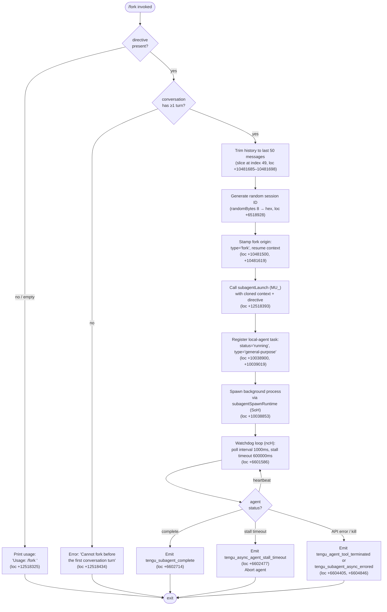

# `/fork`

> Analysis basis: CC v2.1.147 bundle.js (AST extraction + Claude interpretation)
> Minimum version: v2.1.147

---

## Overview

`/fork` spawns a background agent that inherits the full current conversation context, then continues independently from a user-supplied directive. The command deep-copies the conversation history (trimming to the last 50 messages at index 49), assigns a new random session ID, and launches an asynchronous local-agent task via the subagent runtime. If no directive is provided or no conversation turns exist yet, the command exits early with a usage hint or an error respectively.

---

## Registration

| Field | Value |
|---|---|
| type | `local-jsx` |
| name | `fork` |
| description | Spawn a background agent that inherits the full conversation |
| argumentHint | `<directive>` |
| module_id | `Gp1` |
| load_inline | `true` |
| loc_byte | `12518697` |
| loc_byte_end | `12518893` |
| loc_line | `10725` |
| arbor_handler.name | `fo7` |
| arbor_handler.fqn | `claude-2.1.147::fo7` |
| arbor_handler.kind | `AsyncFunction` |
| arbor_handler.resolution_path | `module_id` |
| arbor_handler.n_hits | `0` |

Analysis basis: CC v2.1.147 bundle.js:+12518697

---

## Input Branching

There are four distinct execution branches (no directive → usage; no conversation history → error; valid input → spawn; post-spawn monitoring), so a flowchart is used.



---

## Behavioral Spec

### 1. Entry guard — directive and history validation

```
async function forkCommandHandler(input, appContext):
    directive = input.trim()                          # loc +12518301
    if directive is empty:
        print "Usage: /fork <directive>"              # loc +12518325
        return

    history = getConversationHistory(appContext)
    if history has zero turns:
        throw "Cannot fork before the first conversation turn"  # loc +12518434
```

Analysis basis: CC v2.1.147 bundle.js:+12518301, +12518325, +12518434

---

### 2. Subagent launch — context preparation (subagentLaunchWrapper)

The main launch routine (`MU_`) performs the following steps before handing off to the runtime:

```
function subagentLaunchWrapper(directive, appContext):
    # Trim history to at most 50 entries (indices 0..49)
    trimmedHistory = fullHistory.slice(0, 50)         # loc +10481685, value 50 at +10481685, 49 at +10481698

    # Generate a unique fork session ID
    sessionId = randomBytes(8).toString("hex")         # loc +6518928, byte count 8 at +6518944

    # Stamp the fork metadata onto the cloned context
    clonedContext = {
        ...appContext,
        origin: "fork",                                # loc +10481500
        resumeMode: "resume",                          # loc +10481619
        messages: trimmedHistory
    }

    # Retrieve REPL contexts for MCP state inheritance
    replContexts = appContext.getReplContexts()        # loc +10481540

    # Build subagent system prompt block
    systemPrompt = buildSubagentSystemPrompt(clonedContext)  # loc +12518365 ("system")

    # Build session launch descriptor
    launchDescriptor = buildLaunchDescriptor(
        sessionId, directive, clonedContext, systemPrompt,
        subagentType = "subagent",                    # loc +10482160
        spawnMode   = "spawn"                          # loc +10482225
    )

    return spawnSubagentRuntime(launchDescriptor)
```

Analysis basis: CC v2.1.147 bundle.js:+10481413, +10481540, +10481635, +10481667, +10481688, +10481715, +10481742

---

### 3. Subagent runtime setup (subagentSpawnRuntime)

```
function subagentSpawnRuntime(descriptor):
    # Create working directory for the new agent
    mkdir(subagentWorkdir)                            # loc +12690154
    # Create JSONL transcript file
    open(transcriptFile)                              # loc +12692297
    # Optionally create a symlink for fork-context access
    symlink(...)                                      # loc +12692472
    # Register the task in the active-task registry
    registry.add(sessionId)                           # loc +12690260
    # Launch background process
    bgProcess = spawnProcess(descriptor)              # loc (via xk / KB.spawn)
    # Track process start time
    startTimestamp = Date.now()                       # loc +12693436
    # Transition agent status to "running"
    updateStatus("running")                           # loc +10038945
    # Register as type "local_agent"
    registerTask(type="local_agent")                  # loc +10038900
    return bgProcess
```

Analysis basis: CC v2.1.147 bundle.js:+10038853, +10038878, +10038895, +10038900, +10038945, +12692419

---

### 4. Watchdog / polling loop (agentWatchdog)

The watchdog (`ncH`) drives the lifecycle of the running background agent:

```
function agentWatchdog(agentHandle):
    POLL_INTERVAL_MS   = 1000      # loc +6602669
    STALL_TIMEOUT_MS   = 600000    # loc +6601586  (10 minutes)
    PROGRESS_FRACTION  = 0.1       # loc +6602916

    lastHeartbeat = Date.now()
    while agentHandle.isRunning():
        event = awaitNextEvent(agentHandle, timeout=POLL_INTERVAL_MS)

        if event is "watchdog_stall":                # loc +6602072
            emit("tengu_async_agent_stall_timeout")  # loc +6602477
            agentHandle.abort()
            break

        if event is "subagent_complete":             # loc +6602714
            emit("tengu_subagent_complete")
            break

        if event is "subagent_stall_timeout":        # loc +6602734
            emit("tengu_subagent_stall_timeout")
            agentHandle.abort()
            break

        if event is "query_progress":                # loc +6602976
            reportProgress(PROGRESS_FRACTION)

        if (Date.now() - lastHeartbeat) > STALL_TIMEOUT_MS:
            handleStall()

    finalizeAgent(agentHandle)
```

Analysis basis: CC v2.1.147 bundle.js:+6601520, +6601586, +6602072, +6602477, +6602669, +6602714, +6602734, +6602760, +6602905

---

### 5. System-prompt assembly for the forked agent

The forked agent's system prompt is assembled by `buildSystemPromptForAgent` (`UG`), which collects and concatenates a series of conditional blocks. Key blocks observed in the literals:

| Block key | Content summary | loc_byte |
|---|---|---|
| `ant_model_override` | Model override injection | +12827979 |
| `env_info_static` | Static environment info (CLI/desktop/web/IDE availability) | +12828044 |
| `env_info_simple` | Simplified environment block | +12828079 |
| `language` | Language setting | +12828115 |
| `output_style` | Output style selection | +12828150 |
| `bg-session` | Background-session hint (`"bg"`) | +12828180 |
| `scratchpad` | Scratchpad setting | +12828207 |
| `context_management` | Context management mode | +12828234 |
| `brief` | Brief mode | +12828273 |
| `reproduce_verify_workflow` | Reproduce-and-verify instructions | +12828327 |

The `bg-session` flag is set to `"bg"` for forked agents (literal `"bg"` at +12834302), signalling that the agent operates as a background session. When a git worktree is in use, an additional block is injected: "This is a git worktree — an isolated copy of the repository. Run all commands from this directory. Do NOT `cd` to the original repository root." (literal at +12829833).

Analysis basis: CC v2.1.147 bundle.js:+12827515, +12827566, +12827580, +12827595, +12827632, +12828180, +12834302, +12829833

---

### 6. Memory loading for the forked agent

The memory loader (`bf6`) checks for CLAUDE.md and team-memory before building the combined memory prompt:

```
function loadAgentMemory(context):
    if memoryMode is "auto":                          # loc +3271890
        recordEvent("tengu_moth_copse")               # loc +3271961
    
    if teamMemory.isTeamMemoryEnabled():              # loc +3272103
        teamMemPath = teamMemory.getTeamMemPath()     # loc +3272129
    else:
        recordEvent("tengu_team_memdir_disabled")     # loc +3273121

    combinedPrompt = Nd4.buildCombinedMemoryPrompt(
        localMemory, teamMemory
    )                                                 # loc +3272733
    return combinedPrompt
```

Analysis basis: CC v2.1.147 bundle.js:+3271771, +3271890, +3272103, +3272129, +3272733

---

### 7. Subagent-stop / completion handoff

When the forked agent produces a result, the completion handler (`tK8`) records the outcome and surfaces it to the parent session:

```
function subagentCompletionHandler(result):
    emit("tengu_agent_tool_completed")               # loc +6598576
    outcome = classifyOutcome(result)                # (auto-mode classifier, loc +6600219)

    if classifierUnavailable:
        # Warn user about unreviewed output
        warnUser("Note: The safety classifier was unavailable …")  # loc +6600741

    if outcome is "cancelled":
        recordStatus("cancelled")                    # loc +6604381
    elif outcome is "user_kill_async":
        recordStatus("user_kill_async")              # loc +6604575

    emit("subagent_end")                             # loc +6599154
    emit("tengu_agent_tool_terminated")              # loc +6604405
```

Analysis basis: CC v2.1.147 bundle.js:+6598576, +6598857, +6599154, +6600219, +6600741, +6604381, +6604405, +6604575

---

## State & Side Effects

| Item | Detail |
|---|---|
| Telemetry — subagentLaunch | `subagent_launch` string literal at +10481433; `subagent_fork_prompt_missing` at +10481451 if directive absent |
| Telemetry — stall | `tengu_async_agent_stall_timeout` (loc +6602477) |
| Telemetry — forked turns | `tengu_forked_agent_default_turns_exceeded` (loc +10457381) |
| Telemetry — completion | `tengu_agent_tool_completed` (loc +6598576); `tengu_agent_tool_terminated` (loc +6604405) |
| Telemetry — auto-mode | `tengu_auto_mode_decision` (loc +6600219) |
| Telemetry — memory | `tengu_moth_copse`, `tengu_memdir_disabled`, `tengu_herring_clock`, `tengu_team_memdir_disabled` |
| Telemetry — slim subagent CLAUDE.md | `tengu_slim_subagent_claudemd` (loc +9001894) |
| Telemetry — bg session | `tengu_bg_spare_enable`, `tengu_bg_spare_spawn`, `tengu_bg_spare_claim`, `tengu_bg_spare_claim_fail`, `tengu_bg_dispatch_sigkill_escalate`, `tengu_bg_dispatch_low_mem` |
| Telemetry — daemon | `tengu_daemon_control`, `tengu_daemon_yield`, `tengu_daemon_idle_exit`, `tengu_daemon_config_reload` |
| Filesystem — transcript | Writes JSONL transcript under a new subagent workdir (loc +12690154, +12692297) |
| Filesystem — symlink | Creates a `fork-context-ref` symlink (literal at +12624603) |
| Filesystem — metadata | Writes `.meta.json` file (literal at +12608572) alongside `.jsonl` transcript (loc +12608728) |
| appState changes | Active-task registry updated (`registry.add` / `registry.delete` via `BT8`, loc +12690260, +12690285); agent status transitions: `"pending"` → `"running"` → `"completed"` / `"cancelled"` / `"killed"` |
| AbortController | New AbortController created per fork (loc +4667558); `"abort"` event listener registered at +4667705 |
| Hook registration | `K.register` called at +10039211; session registered as `type="local_agent"`, `"general-purpose"` |
| Sound | None observed in depth-2 traversal |

---

## Version History

| Version | Change |
|---|---|
| v2.1.147 | Initial analysis |

---

## Common Mistakes

1. **Invoking `/fork` before any conversation turn exists.** The command checks whether at least one assistant-user exchange has occurred and throws "Cannot fork before the first conversation turn" (literal at +12518434) if not.
2. **Omitting the directive argument.** Running `/fork` with no text causes the command to print the usage string (`"Usage: /fork \<directive\>"`, literal at +12518325) and return immediately without spawning anything.
3. **Expecting the forked agent to share live state.** The fork copies a *trimmed snapshot* of the conversation (last 50 messages). Any state mutations in the parent session after the fork point are not reflected in the background agent.
4. **Assuming unlimited turns.** The watchdog enforces a stall timeout of 600 000 ms (10 minutes, literal at +6601586). Long-running tasks that exceed this threshold are aborted and emit `tengu_async_agent_stall_timeout`.
5. **Using relative file paths inside the forked agent.** The system prompt for agent threads explicitly states that cwd is reset between bash calls; the spec recommends absolute file paths (literal at +12833391).

---

## Appendix — Identifier Mapping

> For bundle debugging only. Identifiers change across versions.

| Identifier | Role |
|---|---|
| `fo7` | Main `/fork` command handler (AsyncFunction) — Arbor-resolved handler |
| `MU_` | Subagent launch wrapper — prepares context, session ID, and descriptor |
| `LT7` | Conversation history builder; retrieves app state and trims message array |
| `S_` | App-state accessor used by history builder and watchdog |
| `kP8` | Allowed-tools / configuration extractor |
| `UG` | System-prompt assembly orchestrator for the forked agent |
| `wo_` | Sub-routine within UG; composes base role line |
| `b6` | Configuration flag reader |
| `Tw8` | Plugin/MCP system-prompt section builder |
| `HA` | Capability-header builder |
| `gs7` | Per-model default writing-style block injector (references `claude-opus-4-7`) |
| `Qs7` | Notification-function injector |
| `Xo_` | Output-style block builder (`off` / `additive` / `compact`) |
| `Pt7` | Output-style wrapper |
| `kW6` | Scratchpad-section builder |
| `ds7` | Scratchpad delegator |
| `Ht7` | Hooks / schedule / routines section builder |
| `bf6` | Memory loader; reads CLAUDE.md and team-memory |
| `ls7` | Language-section builder |
| `ft7` | Environment-info static section builder |
| `Mt7` | Environment-info simple section builder (worktree-aware) |
| `ns7` | Namespace/language section stub |
| `is7` | Instruction-section builder |
| `Ot7` | `bg-session` section builder (sets `"bg"` / `"none"` / `"worktree"`) |
| `zt7` | Context-management section builder |
| `Dt7` | Brief-mode section builder |
| `Jt7` | Focus-mode / single-file section builder |
| `qt7` | Environment-variables section builder |
| `KH1` | MCP tool-list resolver |
| `At7` | Auxiliary system-prompt section |
| `rs7` | Reproduce-verify-workflow section builder |
| `os7` | Compression/autocompact notice injector |
| `as7` | Verified-vs-assumed tool section builder |
| `ss7` | Output-style delegator to `Xo_` |
| `ts7` | Tone-and-style section builder |
| `_t7` | Base agent-identity string builder |
| `Nh9` | Memory + SL_ combiner |
| `J$H` | API-provider classifier (firstParty / anthropicAws) |
| `bx` | Main-thread system-prompt getter |
| `ncH` | Subagent watchdog / event loop |
| `SoH` | Subagent runtime spawner |
| `nIH` | Low-level subagent process initialiser |
| `BT8` | Active-task set manager (add/finally/delete) |
| `Qr_` | Subagent working-directory creator |
| `A3` | Transcript path resolver |
| `IrH` | Subagent file-handle initialiser (mkdir + open) |
| `fE` | Subagent environment builder |
| `xk` | AbortController factory with signal wiring |
| `xX` | Session start-time recorder |
| `_r` | Model-resolution pipeline entry |
| `hT` | Model-alias router (opusplan / haiku / sonnet) |
| `lq` | Model-string normaliser and capability mapper |
| `jJq` | Inference-profile detector |
| `wJq` | Full model-resolution chain |
| `Tm` | Claude-3/opus/sonnet model capability checker |
| `f` | MCP server initialiser |
| `EkH` | MCP connection builder |
| `k7K` | MCP client update applier |
| `_D5` | MCP tool-list diff builder |
| `gF` | AsyncLocalStorage run helper |
| `bD` | AsyncLocalStorage store getter |
| `QF` | Request-store accessor |
| `tK8` | Subagent completion/handoff handler |
| `tD6` | Auto-mode safety classifier |
| `_48` | Post-completion result builder |
| `_y` | Full REPL-session runner (parent query loop) |
| `ncH` | Watchdog + event router for background agent lifecycle |
| `qw6` | API response processor / summary router |
| `FW` | Stream-event dispatcher |
| `G8` | UUID-based session ID generator |
| `Xsq` | Agent-state updater |
| `Kr` | Permission-set builder for spawned session |
| `vW_` | Permission-filter for allowed/denied tool sets |
| `Mz` | Permission-string parser |
| `CW` | Permission-mode encoder |
| `V6` | Error-reporter / telemetry emitter |
| `yG7` | Core agent query loop (model call orchestrator) |
| `Cx` | Agent session coordinator |
| `Vj8` | Agent exit handler |
| `LLH` | Background-session launcher |
| `l2` | In-process subagent runner |
| `hL` | Agent initialiser |
| `B26` | Agent session-start recorder |
| `aH` | Tool-result aggregator |
| `UL7` | MCP-tool refresher |
| `KLH` | Deferred-tool pool manager |
| `sY8` | MCP attachment builder |
| `Zd` | MCP tool-bundle assembler |
| `H8H` | Fork-context reference resolver |
| `v4` | Transcript reader |
| `YkH` | Fork-context filter |
| `U26` | Agent-metadata writer (.meta.json / .jsonl) |
| `_Pq` | OTel span creator for subagent spawn |
| `APq` | OTel span finaliser |
| `zJq` | All-agent span batch updater |
| `lVH` | Individual span state updater |
| `Dz6` | Fork-specific configuration accessor |
| `FYH` | Fork run-mode flag reader |
| `oV` | Low-level console/output primitive |
| `UH` | String-conversion utility |
| `ZH` | String-cast wrapper |
| `bH` | Base output renderer |
| `mH` | Message renderer |
| `nM` | No-op / null renderer |
| `ck` | Cryptographic random-bytes generator |
| `du_` | Task-duration accumulator |
| `_O` | Pending-task flush helper |
| `gKH` | Task-state updater with speculation abort |
| `o7` | HTML-entity replacer (`&amp;`, `&lt;`, `&gt;`) |
| `DK` | Dependency-key cache (memoisation) |
| `w` | Background-process manager (spawn/kill/freemem) |
| `j` | Background-session kill dispatcher |
| `D` | Memory-pressure session evictor |
| `p` | Spinner / progress renderer |
| `C` | File-watcher / change-detector |
| `y` | Output stream writer |
| `z` | Daemon-control event emitter |
| `R` | Trim-and-resolve utility |
| `S` | Idle-exit timer |
| `n2_` | Tool-name normaliser |
| `pW` | Parallel-work tracker |
| `M4` | Output-mode selector |

---

Note: index built via Arbor fallback; some signals (telemetry, literals) may be missing — see arbor-fallback.js.