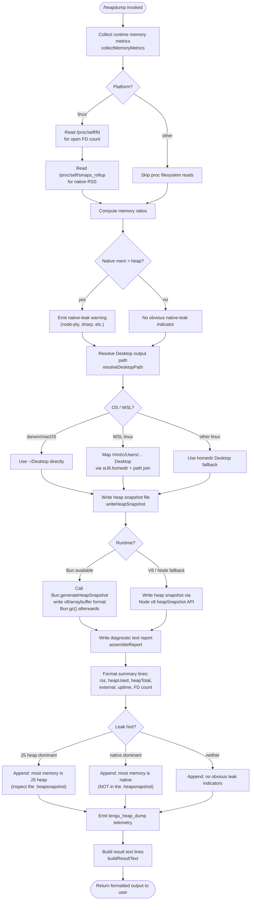

# `/heapdump`

> Analysis basis: CC v2.1.147 bundle.js (AST extraction + Claude interpretation)
> Minimum version: v2.1.147

---

## Overview

`/heapdump` is a hidden diagnostic command that captures the JavaScript heap state of the running Claude Code process and writes it to the user's Desktop directory. It also collects a broad snapshot of runtime memory metrics (V8 heap statistics, OS-level memory, open file descriptors, and smaps data) and formats a human-readable diagnostic report alongside the `.heapsnapshot` file. The command is intended for memory-leak investigation and is surfaced only to developers and power users who know to invoke it directly.

---

## Registration

| Field | Value |
|---|---|
| type | `local` |
| name | `heapdump` |
| description | `Dump the JS heap to ~/Desktop` |
| supportsNonInteractive | `true` |
| isHidden | `true` |
| module_id | `Oh1` |
| load_inline | `true` |
| loc_byte | `12048627` |
| loc_byte_end | `12048790` |
| loc_line | `9943` |
| arbor_handler.name | `pF7` |
| arbor_handler.fqn | `claude-2.1.147::pF7` |
| arbor_handler.kind | `AsyncFunction` |
| arbor_handler.resolution_path | `module_id` |
| arbor_handler.n_hits | `0` |

Analysis basis: CC v2.1.147 bundle.js:+12048627

---

## Input Branching

The command has more than three distinct internal branches (platform detection, memory-ratio analysis, file-descriptor collection, Bun vs. V8 snapshot path, and output-format assembly), so a Mermaid flowchart is used.



Analysis basis: CC v2.1.147 bundle.js:+12046158, +12043659, +12045276, +12046454, +12046697, +12047196, +12047528

---

## Behavioral Spec

### Top-level Handler — `heapdumpHandler` (bundle: `pF7`)

The Arbor-resolved handler is `pF7`, an `AsyncFunction` reached via `module_id → Oh1`.

```
async function heapdumpHandler(options):
    lines = []
    report = await runHeapdumpCore(options)     // fh1
    lines.push(report)
    lines.push("Open the .heapsnapshot in Chrome DevTools → Memory → Load to inspect retainers.")
    formattedOutput = buildResultText(lines)    // UF7
    return formattedOutput
```

Analysis basis: CC v2.1.147 bundle.js:+12047496, +12047615, +12047642, +12047652, +12047764

---

### Core Heap Dump Orchestrator — `runHeapdumpCore` (bundle: `fh1`)

```
async function runHeapdumpCore(options):
    // 1. Trigger GC and collect memory snapshot
    gcAndSnapshot()                             // h6 → oV

    // 2. Collect all memory metrics
    metrics = await collectMemoryMetrics()      // uF7

    // 3. Build report lines
    reportLines = formatReport(metrics)         // N

    // 4. Pad/align column widths
    alignedLines = alignColumns(reportLines)    // K

    // 5. Resolve Desktop output directory
    desktopPath = resolveDesktopPath()          // XjA

    // 6. Construct filename with path join
    outputPath = pathJoin(desktopPath, filename)   // fl_.join

    // 7. Write diagnostic text report to Desktop
    writeFile(outputPath, reportContent)        // KeH.writeFile + CH (JSON.stringify)

    // 8. Write heap snapshot (Bun or V8 path)
    writeHeapSnapshot(outputPath)              // mF7

    // 9. Construct output object / error wrapper
    result = buildOutputResult()               // c, n_, Az, RH

    // 10. Emit telemetry
    emit("tengu_heap_dump")                    // loc_byte 12046748

    return result
```

Analysis basis: CC v2.1.147 bundle.js:+12046158, +12046217, +12046259, +12046454, +12046466, +12046563, +12046606, +12046697, +12046746, +12046748, +12046917, +12046926, +12047004

---

### Memory Metrics Collector — `collectMemoryMetrics` (bundle: `uF7`)

Gathers a comprehensive picture of the process's memory state from multiple sources.

```
async function collectMemoryMetrics():
    result = {}

    // V8 / Node built-ins
    result.memoryUsage      = process.memoryUsage()         // loc +12043659
    result.heapStatistics   = v8.getHeapStatistics()        // u08.getHeapStatistics, loc +12043683
    result.resourceUsage    = process.resourceUsage()       // loc +12043709
    result.uptime           = process.uptime()              // loc +12043735
    result.heapSpaceStats   = v8.getHeapSpaceStatistics()   // u08.getHeapSpaceStatistics, loc +12043760
    result.activeHandles    = process._getActiveHandles()   // loc +12043802
    result.activeRequests   = process._getActiveRequests()  // loc +12043839

    // Linux-only: open file-descriptor count
    if platform == "linux":
        fdEntries = await fs.readdir("/proc/self/fd")       // KeH.readdir, loc +12043890, +12043902
        result.fdCount = fdEntries.length

        // Linux-only: native RSS via smaps
        try:
            smaps = await fs.readFile("/proc/self/smaps_rollup", "utf8")  // loc +12043952, +12043965, +12043991
            result.smapsRss = parseSmaps(smaps)             // G → F06, YN8
        catch:
            result.smapsRss = null

    // Heap-space breakdown push
    result.heapSpaces = []
    for each space in result.heapSpaceStats:
        result.heapSpaces.push(space)                       // X.push, loc +12044244

    // Memory ratio computation
    heapUsedMB  = result.memoryUsage.heapUsed  / 1048576   // constant loc +12044196
    rssMB       = result.memoryUsage.rss       / 1048576
    uptimeHours = result.uptime / 3600                      // constant loc +12044191

    // Native vs JS heap threshold
    if rssMB > heapUsedMB * 100:                            // constant loc +12044343
        result.leakHint = "native"
        result.leakMessage = "Native memory > heap - leak may be in native addons (node-pty, sharp, etc.)"
                                                            // loc +12044429
    else:
        result.leakHint = "js_heap_or_none"

    // Format float fields to fixed decimal places
    result.heapUsedMBFormatted = heapUsedMB.toFixed(...)    // P.toFixed, loc +12044552

    return result
```

Analysis basis: CC v2.1.147 bundle.js:+12043659, +12043683, +12043709, +12043735, +12043760, +12043802, +12043839, +12043890, +12043952, +12044063, +12044191, +12044196, +12044244, +12044343, +12044429, +12044552

- FD enumeration path: `/proc/self/fd` (bundle.js:+12043902)
- RSS via smaps: `/proc/self/smaps_rollup` (bundle.js:+12043965), encoding `"utf8"` (bundle.js:+12043991)
- Native-leak threshold multiplier: **100×** heap used (bundle.js:+12044343)
- Uptime divisor (seconds → hours): **3600** (bundle.js:+12044191)
- MB divisor: **1 048 576** (bundle.js:+12044196)

---

### Desktop Path Resolver — `resolveDesktopPath` (bundle: `XjA`)

```
function resolveDesktopPath():
    homeDir = os.homedir()                          // sU8.homedir, loc +1010357
    platform = detectPlatform()                     // o6

    if platform == "linux":
        // WSL detection: scan /mnt/c/Users for non-system accounts
        wslUsers = scanWslUsers("/mnt/c/Users")     // loc +1010625
        // Filter out system folders: "Public", "Default", "Default User", "All Users"
        //   loc +1010669, +1010688, +1010708, +1010733
        realUser = firstNonSystemUser(wslUsers)
        if realUser found:
            return path.join("/mnt/c/Users", realUser, "Desktop")  // V5.join, loc +1010393
        // fall through to generic homedir path

    // macOS / generic
    desktopPath = path.join(homeDir, "Desktop")     // "Desktop" constant loc +1010403
    return desktopPath
```

Analysis basis: CC v2.1.147 bundle.js:+1010350, +1010357, +1010393, +1010403, +1010533, +1010570, +1010625, +1010669, +1010688, +1010708, +1010733, +1010842

---

### Heap Snapshot Writer — `writeHeapSnapshot` (bundle: `mF7`)

```
async function writeHeapSnapshot(basePath):
    // Bun runtime path (preferred)
    if Bun is available:
        snapshot = Bun.generateHeapSnapshot()           // loc +12047196
        // Write in v8/arraybuffer format
        writeFileSync(basePath + ".heapsnapshot",       // Mh1.writeFileSync, loc +12047176
                      snapshot, { format: "v8", encoding: "arraybuffer" })
                                                        // "v8" loc +12047221, "arraybuffer" loc +12047226
        Bun.gc(/* expose = */ true)                     // loc +12047253  (force GC after snapshot)

    else:
        // V8 / Node fallback via v8.writeHeapSnapshot or stream
        writeV8HeapSnapshot(basePath)
```

Analysis basis: CC v2.1.147 bundle.js:+12047176, +12047196, +12047221, +12047226, +12047253

File mode for written files: **384** (octal `0o600`) — owner read/write only (bundle.js:+12046641).

---

### Result Text Builder — `buildResultText` (bundle: `UF7`)

```
function buildResultText(lines):
    // Compute column widths using Math.max
    maxWidth = Math.max(...lineLengths)             // loc +12047871

    // Append leak-hint suffix lines
    if leakHint == "js_heap":
        lines.push("— most memory is JS heap (inspect the .heapsnapshot)")
                                                    // loc +12047939
    else if leakHint == "native":
        lines.push("— most memory is native (NOT in the .heapsnapshot)")
                                                    // loc +12047999
    else:
        lines.push("  (no obvious leak indicators)")
                                                    // loc +12048136

    // Format and join
    output = formatWithLeH(lines, maxWidth)         // LeH, loc +12048183
    return output
```

Analysis basis: CC v2.1.147 bundle.js:+12047871, +12047939, +12047999, +12048136, +12048183

---

### Platform Detection (used in multiple sub-functions)

The literal `"macos"` (bundle.js:+12045283) and `"darwin"` (bundle.js:+12045702) both appear in the `uF7`/`o6` sub-path, indicating that the code normalises `process.platform === "darwin"` to the display string `"macos"` for branch decisions.

The literal `"No obvious leak indicators. Check heap snapshot for retained objects."` (bundle.js:+12045548) is emitted when no memory anomaly is detected.

---

### Report Formatter — `formatReport` (bundle: `N`)

```
function formatReport(metrics):
    lines = []
    lines = buildDebugLines(metrics)                // vJK, "debug" literal loc +201876
    for each line in lines:
        line = formatCell(line)                     // f4 (trim, replace, slice)
        line = applyCase(line)                      // _.toUpperCase, loc +202002
    lines = writeLogLines(lines)                    // lRH → b1A → H.write
    lines = applyRotation(lines)                    // kJK → XRH / XAH / IJK
    return lines
```

Analysis basis: CC v2.1.147 bundle.js:+12046217, +201876, +201900, +201918, +201940, +201958, +202002, +202022, +202025, +202041, +202047, +202061

---

### Column Aligner — `alignColumns` (bundle: `K`)

```
function alignColumns(lines):
    mapped = lines.map(l => l.padEnd(width, "  "))  // M.padEnd, "  " loc +15141797, +15141818
    return mapped
```

Analysis basis: CC v2.1.147 bundle.js:+12046259, +15141784, +15141797

---

## State & Side Effects

| Item | Detail |
|---|---|
| Telemetry | `tengu_heap_dump` (bundle.js:+12046748) — fired once per invocation after snapshot is written |
| Telemetry (background, incidental) | `tengu_bg_dispatch_sigkill_escalate`, `tengu_bg_dispatch_low_mem`, `tengu_bg_spare_enable`, `tengu_bg_spare_claim`, `tengu_bg_spare_claim_fail`, `tengu_bg_proto_mismatch`, `tengu_bg_dispatch_stale_drop`, `tengu_bg_attach_legacy_autorespawn`, `tengu_bg_attach`, `tengu_bg_attach_stall_gave_up`, `tengu_bg_attach_stall_respawn`, `tengu_bg_attach_kick` — these are in traversed background-daemon code, not directly in the heapdump path |
| File writes | One `.heapsnapshot` file + one text diagnostic report written to `~/Desktop` (or WSL Windows Desktop). File mode `0o600` (bundle.js:+12046641) |
| GC side effect | `Bun.gc(true)` is called after snapshot generation (bundle.js:+12047253), triggering a full garbage-collection cycle in the Bun runtime |
| `/proc` reads | On Linux: reads `/proc/self/fd` (FD enumeration) and `/proc/self/smaps_rollup` (native RSS). No-op on non-Linux |
| appState changes | None detected in depth-2 traversal |
| Sound | None detected in depth-2 traversal |
| Hook registration | `r9 → D9A.register` (bundle.js:+57468) is reachable via the `kJK` log-rotation sub-path — this appears to be a file-rotation lifecycle hook, not a command hook |
| isHidden | `true` — command does not appear in `/help` listings |
| supportsNonInteractive | `true` — can be invoked in non-interactive / scripted mode |

---

## Version History

| Version | Change |
|---|---|
| v2.1.147 | Initial analysis |

---

## Common Mistakes

1. **Expecting output on non-Desktop systems**: The command always writes to `~/Desktop`. If that directory does not exist (e.g., a headless server without a Desktop folder), the write will fail. The path logic includes a WSL mapping but no general fallback for servers.
2. **Confusing the text report with the snapshot**: Two files are created — a human-readable `.txt`-style diagnostic and a `.heapsnapshot` binary. Only the `.heapsnapshot` can be loaded into Chrome DevTools; the text file is a summary only.
3. **Interpreting "native > heap" warnings as definitive**: The threshold is `rss > heapUsed × 100` (bundle.js:+12044343). This ratio is deliberately conservative; a warning only suggests investigation, not a confirmed leak.
4. **Running on non-Bun runtimes expecting identical output**: The snapshot format differs between the Bun path (`Bun.generateHeapSnapshot`, format `"v8"/"arraybuffer"`) and the Node/V8 fallback. Both produce a `.heapsnapshot` but via different APIs.
5. **Not opening the file in Chrome DevTools**: The command's output explicitly instructs the user to open the `.heapsnapshot` via **Chrome DevTools → Memory → Load** (bundle.js:+12047652). Third-party tools may not parse the Bun-generated format correctly.
6. **Invoking in production with Bun.gc**: The forced GC call (`Bun.gc(true)`, bundle.js:+12047253) introduces a stop-the-world pause in the Bun runtime, which will temporarily block all event-loop processing.

---

## Appendix — Identifier Mapping

> For bundle debugging only. Identifiers change across versions.

| Identifier | Role |
|---|---|
| `pF7` | Top-level `heapdump` async handler (Arbor-resolved entry point) |
| `fh1` | Core heap-dump orchestrator (collects metrics, writes files, emits telemetry) |
| `uF7` | Memory metrics collector (process, V8, smaps, FD count) |
| `mF7` | Heap snapshot writer (Bun or V8 path) |
| `UF7` | Result text builder (formats summary lines, appends leak hints) |
| `h6` | GC trigger / snapshot initialiser |
| `oV` | Low-level GC invocation helper |
| `XjA` | Desktop path resolver (macOS / Linux / WSL) |
| `N` | Report formatter (builds structured diagnostic lines) |
| `K` | Column aligner (padEnd for table output) |
| `vJK` | Debug-line builder (structures raw metrics into labelled rows) |
| `j9A` | Sub-helper for debug-line construction |
| `f4` | Cell formatter (trim, replace, slice operations on report strings) |
| `l1A` | Map helper used in cell formatting |
| `lRH` | Log-line writer wrapper |
| `b1A` | Low-level write helper for report lines |
| `kJK` | Log-rotation / file-append manager |
| `XRH` | Rotation state machine (clearTimeout, setTimeout, push/join) |
| `XAH` | Rotation commit helper (join, h6, o8) |
| `IJK` | Rotation append executor (mkdir, appendFile, rename, unlink) |
| `C_6` | Error-code helper used in rotation path |
| `e1A` | Path-join helper for log rotation |
| `t1A` | Stat / rename / unlink helper for log file management |
| `r9` | Rotation lifecycle hook registrar → `D9A.register` |
| `G` | smaps parser / text-extraction helper |
| `F06` | Sub-helper used by smaps parser |
| `YN8` | Sub-helper used by smaps parser and connection-state checker |
| `X` | Heap-space array collector; also background connection manager |
| `RH` | Output-result constructor / error wrapper |
| `n_` | Error normalisation helper |
| `P` | Floating-point formatter (toFixed); also background IPC message handler |
| `J` | Buffer/subarray utility; also background channel index |
| `w` | Background daemon process manager (spawn, kill, timers) |
| `KM` | IPC stream end/close helper |
| `fj5` | Background session/PTY manager |
| `ZH` | String coercion helper |
| `CH` | JSON.stringify wrapper |
| `H` | Random/timeout utility; also includes-check helper |
| `_` | String-case utility (toUpperCase); also generic container |
| `A` | toLowerCase helper; also Map-based registry |
| `q` | unlink helper; also Set-based registry |
| `L` | Promise-lifecycle manager (add/finally/delete); also path helper |
| `M` | Close-operation pair (A.close, q.close); also padEnd target |
| `Az` | Output assembly helper |
| `LeH` | Final output formatter (line width alignment) |
| `F6` | Filesystem / path utility used in Desktop resolution and log rotation |
| `c` | Generic continuation / callback helper |