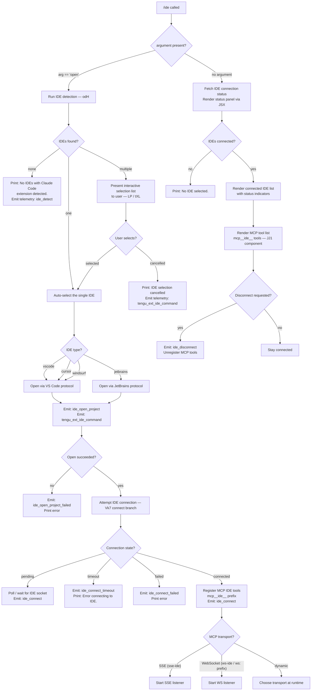

# `/ide`

> Analysis basis: CC v2.1.147 bundle.js (AST extraction + Claude interpretation)
> Minimum version: v2.1.147

---

## Overview

The `/ide` command manages IDE integrations by detecting running IDE instances that have the Claude Code extension installed, displaying their connection status, and optionally opening or connecting to a selected IDE. It serves as the primary control surface for the IDE ↔ Claude Code bridge, supporting VS Code, Cursor, Windsurf, and JetBrains-family IDEs.

---

## Registration

| Field | Value |
|---|---|
| type | `local-jsx` |
| name | `ide` |
| description | `Manage IDE integrations and show status` |
| argumentHint | `[open]` |
| module_id | `PJ1` |
| load_inline | `true` |
| loc_byte | `11068369` |
| loc_byte_end | `11068525` |
| loc_line | `8576` |
| arbor_handler.name | `Vk7` |
| arbor_handler.fqn | `claude-2.1.147::Vk7` |
| arbor_handler.kind | `AsyncFunction` |
| arbor_handler.resolution_path | `module_id` |
| arbor_handler.n_hits | `0` |

Analysis basis: CC v2.1.147 bundle.js:+11068369

---

## Input Branching

Four distinct top-level branches are present: no argument (status display), `open` subcommand (IDE detection + interactive selection), a connection/attach flow (MCP tool registration), and an error/cancellation path. A Mermaid flowchart is used.



---

## Behavioral Spec

### Main Handler (`Vk7`)

The handler is an `AsyncFunction` resolved from module `PJ1` via the `module_id` path.

Analysis basis: CC v2.1.147 bundle.js:+11064483

```
async function ideCommandHandler(args, appState):
    emit telemetry("tengu_ext_ide_command", ...)

    subcommand = args[0]  // "open" or undefined

    if subcommand == "open":
        ides = await detectRunningIDEs()       // odH
        if ides is empty:
            print("No IDEs with Claude Code extension detected.")
            return

        selected = await promptIDESelection(ides)  // LP / tXL
        if selected is null:
            print("IDE selection cancelled")
            return

        result = await openIDEProject(selected)    // bH, mH calls
        if result.failed:
            emit("ide_open_project_failed")
            return

        emit("ide_open_project", { ide: selected.type, scope: "worktree"|"project" })
        await connectToIDE(selected)

    else:
        // Status display path
        renderIDEStatusPanel(appState)            // JJ1 JSX component
```

Analysis basis: CC v2.1.147 bundle.js:+11064605

---

### IDE Detection (`odH`)

Scans the system for running IDE processes that expose a Claude Code extension socket. Uses platform-specific strategies.

Analysis basis: CC v2.1.147 bundle.js:+5245086

```
async function detectRunningIDEs():
    port = parseInt(...)
    candidates = await buildCandidateList()    // aq8

    on linux:
        run shell command:
            "ps aux | grep -E 'code|cursor|windsurf|idea|...' | grep -v grep"
        parse output lines

    on macOS / Windows:
        scan known socket/pipe directories    // lXL

    results = await Promise.all(candidates.map(probe))  // dXL / It8

    for each candidate:
        resolve path (GN.resolve)
        if path starts with "/mnt/c/Users":
            // WSL path — skip system accounts (Public, Default, All Users)
        normalize to NFC unicode
        record IDE type (vscode / cursor / windsurf / jetbrains / appcode)

    emit("ide_detect", { count: results.length })
    if any probe failed:
        emit("ide_detect_failed", ...)

    return filtered, deduplicated list
```

Constants found in detection:
- WSL path prefix: `/mnt/c/Users` (bundle.js:+5243177)
- Excluded accounts: `Public`, `Default`, `Default User`, `All Users` (bundle.js:+5243271–5243335)
- Linux process scan regex covers: `code`, `cursor`, `windsurf`, `idea`, `pycharm`, `webstorm`, `phpstorm`, `rubymine`, `clion`, `goland`, `rider`, `datagrip`, `dataspell`, `aqua`, `gateway`, `fleet`, `android-studio` (bundle.js:+5249963)
- IDE socket directory name: `ide` (bundle.js:+5242892)
- Config directory: `.claude` (bundle.js:+5242970)

---

### IDE Selection and Display (`LP`, `tXL`)

Formats the list of candidate IDEs for interactive display and collects the user's selection.

Analysis basis: CC v2.1.147 bundle.js:+5250838

```
function formatIDEList(ides):
    for each ide in ides:
        label = buildLabel(ide)     // IDE type uppercase → "IDE"
        line = toLowerCase(ide.type) + " " + basename(ide.path)
        append formatted entry

function pickIDE(ideList):
    entries = formatIDEList(ideList)
    selection = interactiveSelect(entries)    // tXL
    if selection cancelled:
        return null
    return ideList[selection.index]
```

Supported IDE type labels (bundle.js:+11064898–11064980):
- `vscode`
- `cursor`
- `windsurf`
- `jetbrains` (also `appcode` variant — bundle.js:+5250337)

---

### IDE Connection Flow (`Vk7` connect branch, `hP_`, `tXL`)

After a target IDE is selected or when connecting on status display, the handler attempts to open a persistent connection.

Analysis basis: CC v2.1.147 bundle.js:+11065568

```
async function connectToIDE(ide):
    state = "pending"
    emit("ide_connect", { ide: ide.type })

    transport = chooseTransport(ide)
    // SSE transport key: "sse-ide"  (bundle.js:+11062470)
    // WebSocket transport key: "ws-ide"  (bundle.js:+11062490)
    // WebSocket URL prefix: "ws:"  (bundle.js:+11067398)
    // Dynamic selection key: "dynamic"  (bundle.js:+11067515)

    try:
        socket = await attemptConnect(transport, ide.socketPath)
        // connect timeout: 5000 ms  (bundle.js:+15099319)
        // error on timeout: "send-claim timeout"  (bundle.js:+15099375)

        onSuccess:
            registerMCPTools(ide)   // prefix: "mcp__ide__"  (bundle.js:+11067178)
            state = "connected"

    catch ECONNREFUSED:
        emit("ide_connect_failed")
        print("Error connecting to IDE.")   // bundle.js:+11066900
        suggest: "restart your IDE"         // bundle.js:+11065703

    catch timeout:
        emit("ide_connect_timeout")

    return state
```

---

### Status Panel JSX Component (`JJ1`)

Renders the live IDE status panel when `/ide` is called without arguments.

Analysis basis: CC v2.1.147 bundle.js:+11066371

```
function IDEStatusPanel(props):
    [connectionState, setConnectionState] = useState()
    appState = useAppState()            // J6 / wf_
    refContainer = useRef()

    useEffect:
        subscribe to IDE connection events
        on change: setConnectionState(newState)

    connectedIDEs = appState.ideConnections.filter(connected)

    if connectedIDEs is empty:
        render "No IDE selected."            // bundle.js:+11064838

    for each ide in connectedIDEs:
        render IDE entry with:
            - IDE type and path
            - MCP tool list (tools prefixed "mcp__ide__")
            - Disconnect button → emit("ide_disconnect")

    // Tool list truncation:
    separator  = ", "    (bundle.js:+11068125)
    ellipsis   = ", …"   (bundle.js:+11068139)

    // Connection status callback (Xk7)
    renderConnectionProgress(state)
```

---

### MCP Tool Registration (`CF_`)

When an IDE connection is established, the handler registers MCP tools under the `mcp__ide__` prefix.

Analysis basis: CC v2.1.147 bundle.js:+11067863

```
function registerIDEMCPTools(connectedIDEs):
    // Normalize tool names to NFC  (bundle.js:+11067968)
    for each ide in connectedIDEs:
        tools = ide.tools.slice(0, MAX_DISPLAY)
        normalizedNames = tools.map(t => t.name.normalize("NFC"))

    // Display limit constants:
    // Value 100 at bundle.js:+11067827
    // Value 0   at bundle.js:+11067846
    // Value 3   at bundle.js:+11067900

    buildDisplayString(normalizedNames):
        if names.length <= 3:
            return names.join(", ")
        else:
            return first3.join(", ") + ", …"
```

Analysis basis: CC v2.1.147 bundle.js:+11067827

---

### Daemon / Background Service Interaction

The IDE command interacts with the Claude Code background daemon to manage connection state. Key paths within `D` (daemon normalize) and `w` (daemon session manager):

Analysis basis: CC v2.1.147 bundle.js:+15117127

```
function daemonIDEBridge():
    // Platform guard: "windows" path treated separately
    //   (bundle.js:+15117293)

    sysInfo = getSystemInfo():
        platform = o6()           // platform identifier
        freemem  = R6A.freemem()

    // Spare background session management
    spareRefillKey = "daemon_bg_spare_refill"  (bundle.js:+15097364)

    // Session state lifecycle strings:
    // "done", "killed", "stopped", "failed", "crashed",
    // "blocked", "working", "idle", "active", "resuming"

    // Daemon control events:
    //   "daemon_stop"         (bundle.js:+15153814)
    //   "daemon_stop_failed"  (bundle.js:+15153851)

    // Reconnection error codes observed:
    //   "enoent"        (bundle.js:+15119373)
    //   "econnrefused"  (bundle.js:+15119401)
```

---

## State & Side Effects

| Item | Detail |
|---|---|
| Telemetry — `tengu_ext_ide_command` | Emitted at command entry (bundle.js:+11064485) |
| Telemetry — `tengu_run_hook` | Emitted when IDE hooks execute (bundle.js:+12772747) |
| Telemetry — `tengu_bg_spare_enable` | Background spare session enabled (bundle.js:+15117130) |
| Telemetry — `tengu_bg_spare_spawn` | Background spare spawned (bundle.js:+15117490) |
| Telemetry — `tengu_bg_spare_claim` | Spare session claimed for IDE session (bundle.js:+15119192) |
| Telemetry — `tengu_bg_spare_claim_fail` | Spare claim failed (bundle.js:+15119455) |
| Telemetry — `tengu_bg_sendclaim_failed` | Send-claim handshake failed (bundle.js:+15098898) |
| Telemetry — `tengu_bg_dispatch_sigkill_escalate` | SIGKILL escalation during dispatch (bundle.js:+15117797) |
| Telemetry — `tengu_bg_dispatch_low_mem` | Low-memory dispatch condition (bundle.js:+15118376) |
| Telemetry — `tengu_bg_attach` | Session attach event (bundle.js:+15109864) |
| Telemetry — `tengu_bg_attach_kick` | Attach kick (bundle.js:+15111962) |
| Telemetry — `tengu_bg_attach_stall_ms` | Attach stall duration (bundle.js:+15102088) |
| Telemetry — `tengu_bg_attach_stall_gave_up` | Attach stall gave up (bundle.js:+15110776) |
| Telemetry — `tengu_bg_attach_stall_respawn` | Stall triggered respawn (bundle.js:+15111045) |
| Telemetry — `tengu_bg_attach_legacy_autorespawn` | Legacy auto-respawn (bundle.js:+15109453) |
| Telemetry — `tengu_bg_roster_parse_failed` | Daemon roster file parse error (bundle.js:+10997725) |
| Telemetry — `tengu_bg_proto_mismatch` | Protocol version mismatch (bundle.js:+15106138) |
| Telemetry — `tengu_bg_dispatch_stale_drop` | Stale dispatch dropped (bundle.js:+15107377) |
| Telemetry — `tengu_bg_low_mem_mb` | Background low-memory MB reading (bundle.js:+12461757) |
| Telemetry — `tengu_daemon_control` | Daemon start/stop control event (bundle.js:+15153889) |
| Telemetry — `tengu_daemon_config_reload` | Daemon config reloaded (bundle.js:+15132565) |
| Telemetry — `tengu_daemon_idle_exit` | Daemon exited due to idle (bundle.js:+15137729) |
| Telemetry — `tengu_daemon_yield` | Daemon yielded to foreground (bundle.js:+15136736) |
| Telemetry — `tengu_config_parse_error` | Config file parse error (bundle.js:+3187440) |
| Telemetry — `tengu_feature_ok` / `tengu_feature_bad` / `tengu_feature_sad` | Feature gate outcomes (bundle.js:+960829, +960887, +960964) |
| MCP tool registration | Registers tools under `mcp__ide__` prefix upon successful connection (bundle.js:+11067178) |
| appState changes | IDE connection state written and tracked; disconnects remove entries |
| Socket / transport | Creates Unix socket or WebSocket connection to IDE extension; SSE transport also supported |
| Process management | May spawn background PTY host process (`--bg-pty-host`) for session management (bundle.js:+15097621) |
| File I/O | Reads/writes daemon status file `daemon.status.json` (bundle.js:+12183634); reads `pins.json` (bundle.js:+4054801) |
| Sound | None observed in traversal |

---

## Version History

| Version | Change |
|---|---|
| v2.1.147 | Initial analysis |

---

## Common Mistakes

1. **Running `/ide open` with no IDE extension installed** — The command will exit with "No IDEs with Claude Code extension detected." Ensure the Claude Code extension is installed and the IDE is running before invoking `/ide open`.
2. **Using `/ide open` under WSL without the IDE running on Windows** — Detection skips system Windows accounts (`Public`, `Default`, `Default User`, `All Users`) and requires a socket under `/mnt/c/Users/<real-user>/.claude/ide`.
3. **Expecting instant connection** — The connect flow has a 5 000 ms timeout (`send-claim timeout`). If the IDE extension is slow to start, the command may emit `ide_connect_timeout`. Waiting for the IDE extension to fully load before running `/ide open` avoids this.
4. **Assuming all MCP `mcp__ide__` tools are listed in the status panel** — The display truncates after 3 tool names with `", …"` (bundle.js:+11068139). The full tool set is registered regardless.
5. **Conflating `/ide` (status) with `/ide open`** — Without the `open` argument the command only renders a read-only status panel; it does not attempt new connections.
6. **Ignoring "restart your IDE" advice** — When `ide_connect_failed` is emitted, the recommended recovery action is to restart the IDE (bundle.js:+11065703), not to restart Claude Code.

---

## Appendix — Identifier Mapping

> For bundle debugging only. Identifiers change across versions.

| Identifier | Role |
|---|---|
| `Vk7` | Main async handler for `/ide` command (arbor_handler) |
| `CF_` | MCP tool registration / display string builder for IDE tools |
| `odH` | IDE detection function — scans running processes and sockets |
| `lXL` | Candidate socket path builder for IDE detection |
| `aq8` | Parallel IDE candidate prober (Promise.all wrapper) |
| `dXL` | Per-candidate IDE probe dispatcher |
| `It8` | Individual IDE socket probe / port parser |
| `LP` | IDE list formatter and display label builder |
| `tXL` | Interactive IDE selection renderer (entries → user pick) |
| `ULq` | IDE path matcher / regex helper |
| `hP_` | IDE connection initiator (wraps tXL + connect) |
| `gP` | IDE protocol client constructor (i2H wrapper) |
| `i2H` | Low-level IDE IPC client implementation |
| `JJ1` | JSX status panel component for `/ide` (no-arg display) |
| `Xk7` | Connection progress / status callback renderer |
| `ii` | IDE connection subscription helper |
| `J6` | App-state selector hook |
| `wf_` | App-state context accessor (throws outside provider) |
| `zA` | App-state setter hook |
| `_Y` | App-state store synchronizer (useSyncExternalStore) |
| `sN` | Cleanup helper for IDE status subscriptions |
| `laH` | Cleanup formatter helper |
| `b6` | Async context / store accessor (used across IDE and daemon) |
| `sb6` | Synchronous store getter wrapper |
| `Fc` | Context fallback resolver |
| `w_` | Environment/option accessor |
| `oV` | Option value extractor |
| `D` | Daemon/IDE connection normalizer and session orchestrator |
| `V6` | Config normalizer / config-file reader |
| `V6A` | Background PTY host spawner |
| `w` | Daemon session manager (dispatch, connect, monitor) |
| `C` | Session kill / lifecycle manager |
| `z` | Daemon supervisor write channel |
| `Ou` | Graceful shutdown orchestrator (Promise.race) |
| `S6A` | Background session lifecycle tracker (done/killed/stopped/failed states) |
| `Y` | Session roster manager (start/stop/update) |
| `j` | Active session value iterator |
| `y` | Session writer / kill helper |
| `p` | Supervisor transient writer with timeout |
| `T$6` | Pins file reader (`pins.json`) |
| `M$_` | Pins directory path resolver |
| `wG` | Jobs directory path helper |
| `v9L` | Job directory scanner |
| `dq` | Job state file reader and cache |
| `RK` | Job path joiner |
| `bw` | Active-state constant accessor (`TZ`) |
| `h5` | Job state file writer (atomic via `ez`) |
| `ez` | Atomic file writer (randomBytes + rename) |
| `Cw` | Job cache invalidator |
| `gsH` | Roster file writer with retry |
| `BU` | Roster file reader and parser |
| `qI7` | Roster entry writer |
| `v6A` | Spare session claim and connect flow |
| `tw5` | Connect-with-timeout helper |
| `ew5` | Raw socket connect helper (EN8.connect) |
| `sw5` | Claim frame builder |
| `bU` | Binary framing encoder (Buffer + writeUInt32BE) |
| `KB` | Claim manager (KB.claim, KB.spawn, KB.buildClaimFrame) |
| `So_` | Auth socket path writer |
| `zT6` | Auth socket path resolver |
| `MF_` | Base socket directory path builder |
| `ZC1` | Daemon status file writer (`daemon.status.json`) |
| `aE6` | Status file path builder |
| `ll` | Daemon status helper |
| `M1` | Async-local-storage store accessor |
| `ZH` | String coercion helper |
| `sG8` | macOS memory stats helper |
| `Ny` | PTY-pids path resolver |
| `jyH` | PTY-pids directory path helper |
| `QLH` | PTY-pids path accessor |
| `UU` | PTY session path builder |
| `qF_` | PTY helper (HI7 wrapper) |
| `BsH` | Base PTY path builder |
| `gw1` | Spare socket path builder |
| `Hc` | Spare socket directory helper |
| `Qw1` | Spare socket alternate path builder |
| `Hj5` | Spawn argument array builder (`cf`) |
| `cf` | Array.isArray guard helper |
| `aw5` | Spawn environment assembler (Object.assign) |
| `N` | Log / output formatter |
| `vJK` | Output styling helper |
| `j9A` | NDK/IDK platform detection |
| `f4` | Message formatter with redaction |
| `l1A` | Line-format mapper |
| `lRH` | Output writer |
| `b1A` | H.write wrapper |
| `kJK` | Transcript / conversation log writer |
| `XRH` | Async log flush / debounce scheduler |
| `XAH` | Log entry formatter |
| `C_6` | Log level formatter (`q8` wrapper) |
| `e1A` | Log path builder |
| `t1A` | Log file rotation handler |
| `IJK` | Log append and rotate handler |
| `r9` | AbortController / signal registrar |
| `RH` | Error handler / logger |
| `n_` | Error coercer (Error + String) |
| `j1` | Error formatter |
| `XwA` | UH wrapper for error display |
| `FpK` | Error queue manager (shift/push) |
| `q8` | Base error formatter |
| `UH` | String converter |
| `rC` | Config reader |
| `Ct` | Config accessor (UH + rC) |
| `As6` | Config setter with dedup guard |
| `C4_` | Config write and experiment event emitter |
| `p4_` | Config persistence (y29, HA, Jy9, VbH) |
| `x6` | Config file watcher orchestrator |
| `k$H` | Config file reader with backup/migration |
| `EQ4` | File watch subscription manager |
| `T_` | Shell command executor (sh -c) |
| `T8` | Shell command wrapper |
| `_1` | Platform-specific helper dispatcher |
| `bH` | Platform branch A executor |
| `mH` | Platform branch B executor |
| `Az` | Async utility helper |
| `SfK` | Filesystem realpath + stat resolver |
| `J8` | Error code extractor (`q8`) |
| `Nj5` | Claude version directory builder (`LY8`) |
| `LY8` | Claude versions path helper |
| `Pk` | IPC message pusher |
| `CH` | JSON serialiser (JSON.stringify) |
| `B6` | JSON parser (JSON.parse) |
| `LPH` | Session state broadcaster |
| `sx1` | Session metrics formatter (Object.keys + Math.max) |
| `T` | Keyboard input interceptor (preventDefault + IW) |
| `kfK` | Heartbeat sender (`xt`) |
| `Z` | Periodic timer (setInterval) |
| `S` | Timer canceller |
| `g` | MCP tool filter (mcp__ prefix, orphaned-permission check) |
| `oH` | Tool result filter (Z6) |
| `vH` | Orphaned permission checker |
| `V` | Permission validator |
| `K` | Display row formatter (padEnd 40) |
| `P` | Daemon IPC socket reader/writer |
| `J` | Daemon message router |
| `KM` | Socket end + JSON response writer |
| `fj5` | Daemon message dispatcher (full protocol handler) |
| `LfK` | Dispatch timeout manager |
| `k6A` | Dispatch ID generator |
| `HY` | Background service label resolver |
| `$j5` | Dispatch cleanup helper |
| `X` | Repaint orchestrator (YN8, jy, PU, Promise.all) |
| `WT` | Working-tree path resolver (FbH.join) |
| `G$` | Path realpath normaliser |
| `RMH` | Conversation log reader (readline interface) |
| `Lj5` | Stall-MS reporter (V6, Math.max) |
| `u` | Write-flush helper |
| `b` | State-change observer |
| `h8H` | Dispatch housekeeping |
| `Mj5` | Session-level dispatch handler |
| `I` | Away-summary scheduler (rate-limit aware) |
| `t` | Toggle-silence voice timeout handler |
| `e` | Focus-silence voice timeout handler |
| `B` | Session pair (g + $) |
| `l` | Repaint filter |
| `i` | Session I/O bridge (w + d) |
| `d` | Session input handler (Ta_) |
| `KN6` | Socket write-destroy helper |
| `G` | Repaint initiator (F06 + YN8) |
| `tLq` | Process kill helper (process.kill) |
| `Uq` | String slice/index helper |
| `K8` | State coercer (c wrapper) |
| `W` | Skills/config change debouncer (setTimeout + clearTimeout) |
| `qzH` | Config-change event handler (hL + e2 + K.map) |
| `hL` | Hook dispatcher (h6, Ah, Z2, EZ, JV, b6) |
| `e2` | Hook executor (full hook lifecycle) |
| `pgH` | Policy-settings gate (H.some) |
| `tw8` | Skills cache invalidator ref |
| `qo` | Skills reload orchestrator (gHH, Vw8, gA1) |
| `gHH` | Skills index cache clearer |
| `Vw8` | Skills reload trigger |
| `gA1` | Skills load helper |
| `_kH` | Pw8 cache clearer |
| `Nf` | No-op / utility stub |