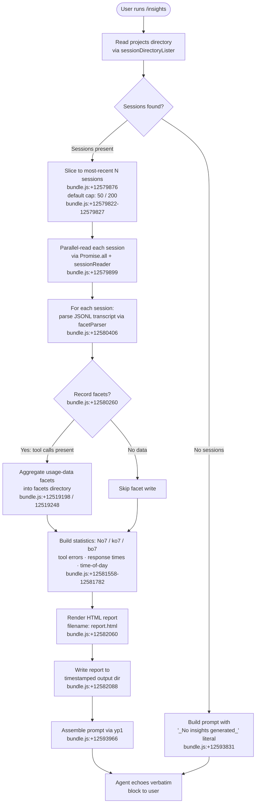

# `/insights`

> Analysis basis: CC v2.1.147 bundle.js (AST extraction + Claude interpretation)
> Minimum version: v2.1.147

---

## Overview

`/insights` generates a rich HTML usage-analysis report by aggregating session transcripts and facet data from Claude Code's local storage, then instructs the agent to deliver a fixed, verbatim confirmation message that includes a link to the report. The command operates as a `prompt`-type handler: it does all data collection and report writing synchronously before returning a fully-formed prompt string, so the agent's only job is to echo the pre-composed `<message>` block back to the user.

---

## Registration

| Field | Value |
|---|---|
| type | `prompt` |
| name | `insights` |
| description | Generate a report analyzing your Claude Code sessions |
| loc_byte | `12592760` |
| loc_byte_end | `12594064` |
| loc_line | `11623` |
| handler_method | `getPromptForCommand` |
| handler_method_start | `12592934` |
| handler_method_end | `12594063` |
| prompt_body.length | `513` characters |
| prompt_body.trace | `call→yp1(...) (1 literals)` |
| arbor_handler.name | `getPromptForCommand` |
| arbor_handler.kind | `Method` |
| arbor_handler.fqn | `claude-2.1.147::getPromptForCommand` |
| arbor_handler.resolution_path | `direct` |
| arbor_handler.n_hits | `1` |

Analysis basis: CC v2.1.147 bundle.js:+12592760

---

## Input Branching

The command has 3+ distinct internal branches: session-list slicing and availability check, per-session facet aggregation (which itself forks on session count and data presence), and the final report-write / prompt-assembly path. A Mermaid flowchart is used.



---

## Behavioral Spec

### 1. Session Discovery (`sessionDirectoryLister`)

```
function sessionDirectoryLister(storageRoot):
    entries = fs.readdir(storageRoot)               // uo7→uy.readdir :+12579430
    dirs    = entries.filter(entry => entry.isDirectory())  // uo7→_.filter + K.isDirectory :+12579484
    for dir in dirs:
        files = facetFileScanner(dir)               // FeH :+12579588
        validFiles = files where filename ends with ".jsonl"  // :+12662217
        push validFiles to session list
    sort session list by mtime descending           // uo7→q.sort :+12579734
    return sorted list
```

Analysis basis: CC v2.1.147 bundle.js:+12579411 (`uo7` / `QQ`)

---

### 2. Session Slicing

```
function sliceSessions(sessionList):
    // Numeric limits found at bundle.js:+12579822 and :+12579827
    SOFT_LIMIT = 50
    HARD_LIMIT = 200
    recent = sessionList.slice(0, HARD_LIMIT)       // A.slice :+12579876
    // Inner batch size for parallel reads: 10 concurrent, 9 overlap
    // bundle.js:+12579680 / :+12579685
    return recent
```

Analysis basis: CC v2.1.147 bundle.js:+12579822

---

### 3. Facet File Scanner (`facetFileScanner`)

```
function facetFileScanner(sessionDir):
    entries = fs.readdir(sessionDir)                // FeH→HL.readdir :+12662111
    files   = entries.filter(e => e.isFile() and filenameValidator(e.name))  // :+12662188
    // filenameValidator checks against regex via Ar→qkL.test :+6518888
    for file in files:
        stat = await fs.stat(file)                  // FeH→HL.stat :+12662420
        push { name, path, size, mtime } to results
    return results
```

Analysis basis: CC v2.1.147 bundle.js:+12662111

---

### 4. Per-Session Transcript Parsing (`sessionReader` + `facetParser`)

```
function sessionReader(sessionPath):
    raw  = fs.readFile(sessionPath, "utf-8")        // Zo7→uy.readFile :+12525305
    data = jsonSafeParser(raw)                      // B6→JSON.parse :+182634
    return data                                     // includes usage-data + session-meta sub-dirs

function facetParser(sessionData, sessionId):
    // jT8 dispatcher: :+12580406
    // Iterates all conversation entries
    for entry in sessionData.entries:
        // Branch: skip entries that are tool_use from mcp__ prefixed tools
        // literals "mcp__" :+14926580, "assistant" :+14926669, "tool_use" :+14926737
        recordFacet(entry)                          // No7 :+12528591 aggregates per-tool stats
    return aggregatedFacets
```

Analysis basis: CC v2.1.147 bundle.js:+12525305 (`Zo7`) and :+12580406 (`jT8`)

---

### 5. Statistics Aggregation (`statisticsBuilder`)

The statistics builder (`No7`, `ko7`, `bo7`) computes multiple facets in parallel branches:

```
function statisticsBuilder(allSessions):
    // Tool-error tallying (No7) :+12528591
    toolErrors = aggregateToolErrors(allSessions)
    // Response-time bucketing into bands (bundle.js :+12535973-12536033):
    //   "2-10s", "10-30s", "30s-1m", "1-2m", "2-5m", "5-15m", ">15m"
    responseTimes = bucketResponseTimes(allSessions)
    // Time-of-day segmentation into four named periods (bundle.js :+12536821-12536974):
    //   "Morning (6-12)", "Afternoon (12-18)", "Evening (18-24)", "Night (0-6)"
    timeOfDay = segmentByTimeOfDay(allSessions)
    // Session-level stats via at_a_glance key :+12533000
    atAGlance = buildAtAGlance(allSessions)
    return { toolErrors, responseTimes, timeOfDay, atAGlance }
```

Limits observed:
- Session data cap: 1,800,000 ms (30 min) idle threshold (bundle.js:+12527228)
- HTML section max characters: 8,192 (bundle.js:+12535142)
- Parallel fetch batch: 30,000 ms / 25,000 ms timeouts (bundle.js:+12524518, :+12524539)

Analysis basis: CC v2.1.147 bundle.js:+12530858 (`Ip1`), :+12531454 (`ko7`)

---

### 6. HTML Report Rendering (`reportHtmlBuilder`)

```
function reportHtmlBuilder(stats, reportDir):
    // bo7 :+12581782 — main HTML composer
    // Color palette literals (bundle.js):
    //   primary blue  "#2563eb" :+12573638
    //   cyan          "#0891b2" :+12573776
    //   green         "#10b981" :+12573948
    //   purple        "#8b5cf6" :+12574091
    //   red (errors)  "#dc2626" :+12577354
    //   green (ok)    "#16a34a" :+12577603
    //   yellow        "#eab308" :+12578096
    html = renderSections(stats)
    // Empty-state guards:
    //   no tool errors  → "<p class=\"empty\">No tool errors</p>"     :+12577365
    //   no time data    → "<p class=\"empty\">No time data</p>"       :+12536771
    //   no response data→ "<p class=\"empty\">No response time data</p>" :+12535921
    //   generic empty   → "<p class=\"empty\">No data</p>"            :+12535464
    filename = "report.html"                        // :+12582060
    writeToDir = buildTimestampedOutputPath(reportDir)  // using Date parts :+12581861-12581990
    fs.writeFile(writeToDir + "/" + filename, html) // uy.writeFile :+12582088
    return { reportUrl, htmlFilePath, facetsDir }
```

Analysis basis: CC v2.1.147 bundle.js:+12574308 (`So7`), :+12577141 (`Ro7`), :+12581782 (`bo7`)

---

### 7. Prompt Assembly (`getPromptForCommand` / `yp1`)

```
function getPromptForCommand(context):
    // kp1 collects all session data and writes the report (steps 1–6 above)
    reportData = insightsDataCollector(context)     // kp1 :+12593033

    if reportData is empty or null:
        summaryText = "_No insights generated_"     // :+12593831
    else:
        // Math.round applied to numeric stats      // :+12593321
        summaryText = formatAtAGlance(reportData)

    // yp1 called at :+12593966 — assembles the 513-char prompt string
    // Prompt instructs agent to output the <message> block verbatim.
    // The <message> block contains:
    //   - "Your shareable insights report is ready:" followed by report URL
    //   - Separator literal " · " :+12593392
    //   - Prompt: "Want to dig into any section or try one of the suggestions?"
    // At-a-glance summary injected for agent context only (user has not seen it).
    prompt = yp1(reportData, summaryText)

    // CH (JSON.stringify wrapper) called at :+12593984 for embedded data
    // wT8 (path resolver) called at :+12594030 for file paths
    return prompt
```

Analysis basis: CC v2.1.147 bundle.js:+12592934–12594063 (`getPromptForCommand`)

---

### 8. Facet Write Path (`facetWriter` / `Vo7` / `Eo7`)

```
function facetWriter(facetData, facetDir):
    fs.mkdir(facetDir, { recursive: true })         // Vo7→uy.mkdir :+12525403
    // sub-dirs: "usage-data" :+12519198, "session-meta" :+12519294, "facets" :+12519248
    outPath = pathJoiner(facetDir, sessionId)       // AB.join :+12525440
    fs.writeFile(outPath, jsonSerializer(facetData))// uy.writeFile :+12525484
    // On write error: RH (error logger) called :+12525550

function sessionMetaWriter(metaData, metaDir):
    // Eo7 :+12581481
    fs.mkdir(metaDir, { recursive: true })          // :+12525089
    path = pathJoiner(metaDir, sessionId)           // :+12525133
    fs.writeFile(path, jsonSerializer(metaData))    // :+12525177
```

Analysis basis: CC v2.1.147 bundle.js:+12525403 (`Vo7`), :+12581481 (`Eo7`)

---

## State & Side Effects

| Item | Detail |
|---|---|
| Telemetry | No `tengu_*` events are emitted directly by the `/insights` handler itself; the telemetry events found in the call graph (`tengu_daemon_yield`, `tengu_daemon_control`, `tengu_transcript_phantom_parent`, `tengu_transcript_parent_cycle`, `tengu_chain_parent_cycle`, `tengu_chain_timestamp_fallback`, `tengu_chain_parallel_tr_recovered`, `tengu_relink_walk_broken`) are emitted by lower-level session-chain and daemon utilities reached transitively — not by the `/insights` invocation path proper. |
| File writes | Creates/overwrites `report.html` in a timestamped output directory under the Claude Code data directory (bundle.js:+12582060, :+12582088) |
| Facet writes | Writes per-session facet JSON files under `usage-data/` and `session-meta/` sub-directories (bundle.js:+12519198, :+12519294) |
| Directory creation | `fs.mkdir` with `recursive: true` for both report output dir and facet dirs (bundle.js:+12525403, :+12525089, :+12581801) |
| appState changes | None observed at depth-2 traversal |
| Hook registration | None observed at depth-2 traversal |
| Sound | None observed |
| Agent output | Agent is instructed to echo the `<message>` block **verbatim** — no free-form generation; the message contains the report URL and an invitation to discuss sections |

---

## Version History

| Version | Change |
|---|---|
| v2.1.147 | Initial analysis |

---

## Common Mistakes

1. **Running `/insights` in a workspace with no prior sessions** — the command returns `_No insights generated_` (bundle.js:+12593831) rather than an error; users may think the command failed when the data directory is simply empty.
2. **Expecting live/streaming output** — the entire report is pre-built before the agent responds; there is no streaming progress indicator from the agent during report generation.
3. **Assuming the agent summarises the data itself** — the agent is explicitly told to output the `<message>` block verbatim and is given the at-a-glance summary only for its own context. The agent does not re-analyse the raw data.
4. **Looking for the report inside the project directory** — the HTML file is written to a timestamped path inside Claude Code's internal data directory, not the current working directory. The report URL in the agent message is the canonical reference.
5. **Expecting the facet directory to accumulate indefinitely** — the session list is hard-capped at 200 entries (bundle.js:+12579827) and only the most-recent 50 are used for the report (bundle.js:+12579822).

---

## Appendix — Identifier Mapping

> For bundle debugging only. Identifiers change across versions.

| Identifier | Role |
|---|---|
| `__handler_insights` | Synthetic BFS entry point for the `/insights` command handler |
| `kp1` | Main insights data collector — orchestrates session reading, facet aggregation, and report writing |
| `uo7` | Session directory lister — reads and sorts session dirs by mtime |
| `QQ` | Path joiner used within session directory enumeration |
| `FeH` | Facet file scanner — reads `.jsonl` files from a session directory |
| `Ar` | Filename validator (regex test against `.jsonl` pattern) |
| `Zo7` | Session file reader — reads a single session file and parses JSON |
| `ti_` | Session-meta path resolver |
| `pZ6` | Base path builder for usage-data / facets sub-directories |
| `B6` | JSON safe-parser wrapper |
| `EkH` | MCP client manager (reached transitively via session-processing path) |
| `jT8` | Per-session facet dispatcher — iterates transcript entries and routes to sub-parsers |
| `g6H` | Low-level session-chain reader / transcript index builder |
| `Np1` | Per-message facet extractor — processes individual transcript messages |
| `Hr_` | Insights statistics formatter / summary builder |
| `No7` | Tool-error and per-tool statistics aggregator |
| `ko7` | Session-level statistics compiler (response times, counts) |
| `bo7` | HTML report section renderer |
| `Co7` | JSON-to-HTML serializer helper used within report rendering |
| `N7H` | Tool-usage table HTML builder |
| `So7` | Time-of-day distribution HTML builder |
| `Ro7` | Response-time bar-chart HTML builder |
| `Vo7` | Facet writer — writes usage-data JSON to facets directory |
| `Eo7` | Session-meta writer — writes session metadata JSON |
| `To7` | Report metadata reader/writer (reads existing report file, unlinks stale) |
| `vo7` | Report generation orchestrator — calls `DjH`, `vp1`, `LK` to produce final report |
| `DjH` | HTML file generator — creates the report HTML file on disk |
| `vp1` | HTML template helper |
| `Go7` | Parallel session-batch processor |
| `Po7` | Single-session statistics collector |
| `Vp1` | Per-session report segment builder |
| `yp1` | Prompt string assembler — builds the 513-char prompt returned by `getPromptForCommand` |
| `CH` | JSON serializer wrapper (`JSON.stringify`) |
| `wT8` | Path resolver for report output directory |
| `RH` | Error logger (logs to MCP debug/error log) |
| `n_` | Error wrapper / string coercion utility |
| `UH` | String coercion utility |
| `ZH` | String coercion utility (alternative form) |
| `jo7` | NaN-safe numeric validator |
| `Ip1` | Statistical percentile / distribution calculator |
| `BeH` | Object-entries helper for facet accumulation |
| `Uq` | Array slice/index helper |
| `hp1` | File cleanup / unlink helper |
| `mZ6` | Tool-name normalizer |
| `wo7` | File extension extractor (`path.extname`) |
| `IYH` | Diff utility for content comparison |
| `fL` | Array index-of helper |
| `hf` | Duration formatter |
| `ei_` | Facet eligibility checker |
| `mo7` | Object-keys iterator for session metadata |
| `Va7` | Binary JSONL parser (low-level buffer reader) |
| `va7` | Minimal binary file reader helper |
| `Za7` | Alternative binary JSONL parser |
| `AU1` | Session index re-linker |
| `d4H` | Transcript chain builder |
| `Da7` | Chain segment sorter / deduplicator |
| `Ya7` | Chain entry validator |
| `Oa7` | Chain ordering helper |
| `GU1` | Session group updater |
| `NT8` | Chain node tracker |
| `IT8` | Chain iterator factory |
| `UrH` | Session map builder |
| `Er_` | Message content renderer |
| `WE6` | Markdown/HTML content escaper |
| `Vr_` | Attachment/image content filter |
| `wa7` | Content-type validator for attachments |
| `ja7` | Array-some predicate helper for attachment filtering |
| `Y5` | HTML entity encoder |
| `o7` | HTML entity replacement helper |
| `DT8` | Markdown bold formatter |
| `LK` | Session filter — removes irrelevant session entries |
| `kv` | Base storage path resolver |
| `TK` | Template key resolver |
| `FyH` | Report section finaliser |
| `G8` | UUID generator for report identity |
| `Fj8` | Report file writer with hash-based deduplication |
| `$G` | Report post-processor |
| `Oo7` | Storage root resolver (calls `kv`) |
| `_WH` | Daemon inter-process communication helper (transitive) |
| `s8` | Generic utility / passthrough |
| `laH` | Connection cleanup helper (MCP, transitive) |
| `sN` | MCP server cleanup sequence |
| `k7K` | MCP update applier |
| `_D5` | MCP server state reconciler |
| `EK8` | MCP capability flag checker |
| `r8` | Retry/timeout wrapper |
| `ZC1` | Session lifecycle event emitter |
| `B` | Tool/permission lookup (transitive) |