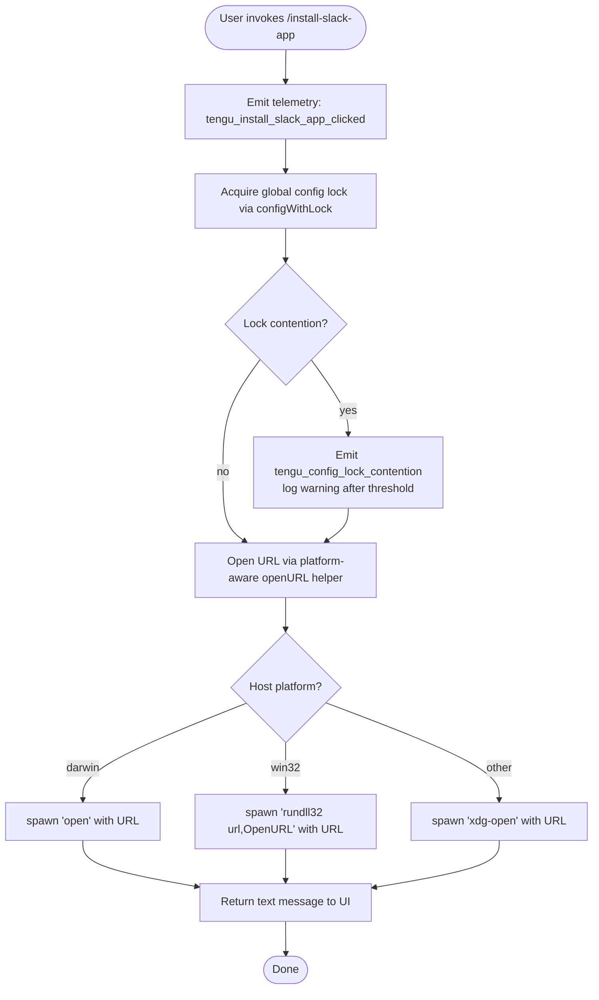

# `/install-slack-app`

> Analysis basis: CC v2.1.147 bundle.js (AST extraction + Claude interpretation)
> Minimum version: v2.1.147

---

## Overview

The `/install-slack-app` command opens the Claude Slack app installation page in the user's default web browser. It fires a telemetry event immediately upon invocation, then delegates to a platform-aware URL-opening utility, and returns a short informational text message to the user. The command performs no agent prompting and requires no user-supplied arguments.

---

## Registration

| Field | Value |
|---|---|
| type | `local` |
| name | `install-slack-app` |
| description | `Install the Claude Slack app` |
| supportsNonInteractive | `false` |
| module_id | `hP1` |
| load_inline | `true` |
| loc_byte | `11155436` |
| loc_byte_end | `11155622` |
| loc_line | `9208` |
| arbor_handler.name | `lk7` |
| arbor_handler.fqn | `claude-2.1.147::lk7` |
| arbor_handler.kind | `AsyncFunction` |
| arbor_handler.resolution_path | `module_id` |
| arbor_handler.n_hits | `0` |

Analysis basis: CC v2.1.147 bundle.js:+11155436

---

## Input Branching

The command's top-level flow is essentially linear (no user arguments are parsed), but the URL-opening helper (`openURL`) branches on the host platform. Three or more distinct platform paths exist, so a Mermaid flowchart is used.



Analysis basis: CC v2.1.147 bundle.js:+11155042, +6463144, +6463160, +6463244, +6463318, +6463325

---

## Behavioral Spec

### 1. Handler Entry — `installSlackAppHandler` (`lk7`)

The Arbor-resolved handler is the async function `lk7`. It is loaded inline via a `load: () => Promise.resolve({call: lk7})` shape inside module `hP1`.

```
async function installSlackAppHandler(context):
    emit telemetry("tengu_install_slack_app_clicked")
    await saveGlobalConfig(context)          // M8 — acquires lock, persists state
    openURLInBrowser(SLACK_INSTALL_URL)      // MK → platform branch
    return { type: "text",
             content: "Opening Slack app installation page in browser…" }
```

Analysis basis: CC v2.1.147 bundle.js:+11155040, +11155080, +11155155, +11155175, +11155188

The string `"Opening Slack app installation page in browser…"` is the exact user-facing feedback message.
Analysis basis: CC v2.1.147 bundle.js:+11155188

The return object carries `type: "text"`.
Analysis basis: CC v2.1.147 bundle.js:+11155175

### 2. Config Persistence — `saveGlobalConfig` (`M8`)

Before opening the browser the handler calls the global config save routine. This routine:

1. Acquires a filesystem lock on the config file path.
2. If lock acquisition takes longer than expected, emits `tengu_config_lock_contention` and logs a warning: `"Lock acquisition took longer than expected - another Claude instance may be running"`.
3. Re-reads the on-disk config after acquiring the lock.
4. Guards against auth-loss: if the freshly read config is missing authentication data that the in-memory cache holds, it refuses to write and emits `tengu_config_auth_loss_prevented`, logging the message `"saveGlobalConfig fallback: re-read config is missing auth that cache has; refusing to write. See GH #3117."`.
5. On a successful guard check, writes the updated config through `configWithLockWriter` (`_L_`) which performs atomic file replacement.

```
async function saveGlobalConfig(context):
    await withConfigLock():
        freshConfig = readConfigFromDisk()
        if freshConfig is missing auth AND inMemoryCache has auth:
            emit telemetry("tengu_config_auth_loss_prevented")
            log warning("saveGlobalConfig fallback: re-read config is missing auth …")
            return   // abort write
        writeConfigAtomically(mergedConfig)
```

Analysis basis: CC v2.1.147 bundle.js:+3181861, +3182042, +3182068, +3184859, +3185338

#### 2a. Config Lock Writer — `configWithLockWriter` (`_L_`)

The atomic write procedure:

```
function configWithLockWriter(configPath, data):
    ensure parent directory exists (mkdirSync recursive)
    acquire file lock:
        if contention detected after timeout:
            emit telemetry("tengu_config_lock_contention")
            log error("Lock acquisition took longer than expected …")
    timestamp = Date.now()
    httpClient = buildHTTPClient()          // n99
    send config update via network layer    // N
    stat existing file
    if ENOENT:
        handle missing file gracefully
    read current file content (utf-8)
    parse JSON via safeJSONParse            // k$H → B6
    check for stale-write condition:
        if detected: emit tengu_config_stale_write
    perform atomic file copy/replace:
        copy to temp path
        keep up to 5 backups               // literal: 5
        rename temp → final
    unlock
```

Analysis basis: CC v2.1.147 bundle.js:+3184559, +3184565, +3184581, +3184586, +3184631, +3184727, +3184770, +3184857, +3184995, +3185117, +3185125, +3185540, +3185789, +3186886

Backup directory name: `"backups"` — Analysis basis: CC v2.1.147 bundle.js:+3186371  
Config read encoding: `"utf-8"` — Analysis basis: CC v2.1.147 bundle.js:+3186886  
Backup retention limit: `5` files — Analysis basis: CC v2.1.147 bundle.js:+3185789  
Lock-timeout warning message: `"Lock acquisition took longer than expected - another Claude instance may be running"` — Analysis basis: CC v2.1.147 bundle.js:+3184770

#### 2b. Config Parse Guard — `configReader` (`k$H`)

```
function configReader(filePath):
    if config accessed before initialisation:
        throw Error("Config accessed before allowed.")
    raw = fs.readFileSync(filePath, "utf-8")
    parsed = safeJSONParse(raw)             // B6 → JSON.parse
    stripBOMIfPresent(parsed)               // OC
    buildBackupIndex(filePath)              // hy9
    return parsed
```

Analysis basis: CC v2.1.147 bundle.js:+3186797, +3186803, +3186859, +3186886, +3186906, +3186909, +3187049

Error string `"Config accessed before allowed."` — Analysis basis: CC v2.1.147 bundle.js:+3186803

### 3. URL Opening — `openURLInBrowser` (`MK`)

```
async function openURLInBrowser(url):
    validate url scheme:
        if not "http:" or "https:":
            throw Error via urlSchemeGuard    // IIL
    detect platform via openURLDispatch       // WJ
    spawn platform command:
        if platform == "darwin":
            spawn("open", [url])
        elif platform == "win32":
            spawn("rundll32", ["url,OpenURL", url])
        else:
            spawn("xdg-open", [url])
    await completion via processRunner       // T8
```

Analysis basis: CC v2.1.147 bundle.js:+6462835, +6462857, +6463072, +6463085, +6463144, +6463160, +6463193, +6463244, +6463256, +6463318, +6463325

URL scheme validation enforces `"http:"` or `"https:"` only.  
Analysis basis: CC v2.1.147 bundle.js:+6462835, +6462857

Platform strings checked: `"darwin"`, `"win32"` (fallthrough for Linux/other).  
Analysis basis: CC v2.1.147 bundle.js:+6463144, +6463160

#### 3a. Process Runner — `spawnProcess` (`T8`) → `processExecutor` (`T_`)

```
function spawnProcess(cmd, args, options):
    runner = processExecutor(cmd, args, options)   // T_
    context = getAsyncLocalContext()               // b6 → sb6
    await runner.run():
        on success: return exit code
        on error:   log via errorReporter (RH)
                    return error details
```

Timeout for spawn operations: `10` seconds (likely applies to process launch, not URL fetch).  
Analysis basis: CC v2.1.147 bundle.js:+1044118

Memory check interval: `1 000 000` µs units observed in the executor path.  
Analysis basis: CC v2.1.147 bundle.js:+1044640

### 4. Background Session Management (transitive, via `configWithLockWriter`)

The call graph reaches the background-daemon manager (`w`) transitively through the config-lock subsystem. This is infrastructure shared across many commands; for `/install-slack-app` it is incidental. Key constants observed:

- SIGKILL escalation timeout: `30` s  
  Analysis basis: CC v2.1.147 bundle.js:+15117752
- Grace period before SIGKILL: `15` s  
  Analysis basis: CC v2.1.147 bundle.js:+15117763
- Daemon reconnect wait: `2000` ms  
  Analysis basis: CC v2.1.147 bundle.js:+15117423
- Memory threshold unit: `1024` (KB conversion)  
  Analysis basis: CC v2.1.147 bundle.js:+15118270

---

## State & Side Effects

| Item | Detail |
|---|---|
| Telemetry — primary | `tengu_install_slack_app_clicked` fired immediately on invocation (bundle.js:+11155042) |
| Telemetry — config lock | `tengu_config_lock_contention` if another Claude instance holds the config lock (bundle.js:+3184859) |
| Telemetry — stale write | `tengu_config_stale_write` if on-disk config diverged during the lock window (bundle.js:+3184995) |
| Telemetry — auth guard | `tengu_config_auth_loss_prevented` if a write would erase cached auth (bundle.js:+3185338) |
| Telemetry — config parse error | `tengu_config_parse_error` on JSON parse failure (bundle.js:+3187440) |
| Telemetry — bg SIGKILL | `tengu_bg_dispatch_sigkill_escalate` (background daemon, transitive) |
| Telemetry — bg low memory | `tengu_bg_dispatch_low_mem` (background daemon, transitive) |
| Telemetry — bg spare session | `tengu_bg_spare_enable`, `tengu_bg_spare_claim`, `tengu_bg_spare_claim_fail`, `tengu_bg_spare_spawn` (background daemon, transitive) |
| Browser side effect | Opens the Slack app installation URL in the system default browser via platform command (`open` / `rundll32` / `xdg-open`) |
| Config file | Global config may be read and re-written (with lock) as part of the `saveGlobalConfig` call |
| Config backups | Up to 5 timestamped backup files written to the `backups/` subdirectory alongside the config file |
| Non-interactive | `supportsNonInteractive: false` — command must be run in an interactive session |
| appState changes | No explicit appState mutation observed in the depth-2 traversal beyond config persistence |
| Sound | <!-- TODO: not found in depth-2 traversal; needs --depth 4 --> |
| Hook registration | <!-- TODO: not found in depth-2 traversal; needs --depth 4 --> |

---

## Version History

| Version | Change |
|---|---|
| v2.1.147 | Initial analysis |

---

## Common Mistakes

1. **Running in non-interactive mode**: `supportsNonInteractive` is `false`. Invoking `/install-slack-app` from a script or CI pipeline will fail or be silently skipped — it must be called from an interactive Claude Code session.
2. **Expecting a browser to open in headless environments**: The command spawns `open`, `rundll32`, or `xdg-open` depending on platform. In headless Linux environments without a display server, `xdg-open` will fail silently or emit an error; no fallback URL is printed to stdout by this command.
3. **Assuming the command modifies agent context**: `/install-slack-app` is not a prompt-type command. It does not inject any text into the conversation or instruct the agent. It solely opens a browser URL and returns a static confirmation string.
4. **Concurrent Claude instances causing lock contention**: If another Claude Code process is running and holding the global config lock when this command fires, the `saveGlobalConfig` call will block and emit `tengu_config_lock_contention`. On very slow filesystems this can delay the browser-open step noticeably.
5. **Expecting URL to be configurable**: The Slack installation URL is hardcoded in the bundle. There is no user-facing argument or configuration knob to redirect it to a custom endpoint.

---

## Appendix — Identifier Mapping

> For bundle debugging only. Identifiers change across versions.

| Identifier | Role |
|---|---|
| `lk7` | Main handler — `installSlackAppHandler` (AsyncFunction, Arbor-resolved via module_id `hP1`) |
| `c` | Telemetry emit helper |
| `M8` | `saveGlobalConfig` — global config persistence with lock |
| `_L_` | `configWithLockWriter` — atomic config file write with backup rotation |
| `_` | Filesystem abstraction (internal `fs`-like layer) |
| `F6` | File-existence / stat utility |
| `L` | Temp-file lifecycle manager (add / finally / delete) |
| `q` | Low-level filesystem operations (readFileSync, statSync, mkdirSync, etc.) |
| `M` | Resource close / cleanup helper |
| `n99` | HTTP client factory |
| `et8` | HTTP transport initialiser |
| `N` | Network request dispatcher |
| `vJK` | HTTP connection handler |
| `H` | Retry / jitter scheduler |
| `CH` | JSON serialiser wrapper |
| `f4` | Header-building utility |
| `lRH` | Auth token resolver |
| `kJK` | HTTP request executor (chunked / streaming) |
| `q8` | Error classification helper |
| `k$H` | `configReader` — guarded config file reader with JSON parse |
| `B6` | Safe JSON parser |
| `OC` | BOM / prefix stripper |
| `hy9` | Backup index builder |
| `RH` | Error reporter / logger |
| `AL_` | Backup path resolver |
| `w` | Background daemon / session manager |
| `Wf6` | Config merge utility |
| `A` | Platform string normaliser (toLowerCase) |
| `Z` | Directory entry filter |
| `X` | MCP / SDK connection manager |
| `YN8` | MCP transport factory |
| `n_` | Error constructor wrapper |
| `V` | Backup array slicer |
| `sq6` | Atomic file replacer (write-to-temp + rename, with fchmod/fsync) |
| `O` | Symlink / stat checker |
| `J8` | Errno classifier |
| `sUH` | Config schema validator |
| `yy9` | Config entry enumerator |
| `tUH` | Config timestamp recorder |
| `HL_` | Config symlink resolver |
| `MK` | `openURLInBrowser` — platform-aware URL opener |
| `IIL` | URL scheme validator (enforces http/https) |
| `WJ` | Platform detection for URL opening |
| `T8` | `spawnProcess` — child-process spawner |
| `T_` | `processExecutor` — low-level process runner with memory/timeout tracking |
| `i2H` | Process I/O stream manager |
| `D` | Background session dispatcher |
| `JFK` | Exit-code string formatter |
| `Az` | Async context accessor |
| `b6` | AsyncLocalStorage context reader |
| `sb6` | Store getter for async context |
| `w_` | Observable / event emitter base |

---

Note: index built via Arbor fallback; some signals (telemetry, literals) may be missing — see arbor-fallback.js.