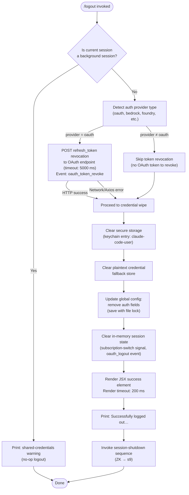

# `/logout`

> Analysis basis: CC v2.1.147 bundle.js (AST extraction + Claude interpretation)
> Minimum version: v2.1.147

---

## Overview

The `/logout` command signs the user out of their Anthropic account by revoking the active OAuth token, clearing all stored credentials from both secure storage and the local configuration file, and then terminating the CLI session. In background ("bg") sessions the command detects that credentials are shared and refuses to act, instead printing an informational message directing the user to run `/logout` from their main terminal.

---

## Registration

| Field | Value |
|---|---|
| type | `local-jsx` |
| name | `logout` |
| description | `Sign out from your Anthropic account` |
| module_id | `gyq` |
| load_inline | `true` |
| loc_byte | `11103851` |
| loc_byte_end | `11104039` |
| loc_line | `9060` |
| arbor_handler.name | `IcL` |
| arbor_handler.fqn | `claude-2.1.147::IcL` |
| arbor_handler.kind | `AsyncFunction` |
| arbor_handler.resolution_path | `module_id` |
| arbor_handler.n_hits | `0` |

Analysis basis: CC v2.1.147 bundle.js:+11103851

---

## Input Branching

The handler has four distinct execution paths depending on session type and logout outcome, so a flowchart is used.



Analysis basis: CC v2.1.147 bundle.js:+7469484 (handler `IcL`), +7469265 (`oauth_logout`), +7469110 (`subscription-switch`), +7469594 (background-session message), +7469793 (success message)

---

## Behavioral Spec

### Top-level handler (`IcL`)

The Arbor-resolved handler is `IcL` (an `AsyncFunction`), reached via `module_id → gyq`.

```
async function logoutHandler(context):
    authType = detectAuthProviderType(context)   // hA / UH path

    if isBackgroundSession(context):             // Rq check
        printWarning(SHARED_CREDENTIALS_MSG)     // bundle.js:+7469594
        return

    // Token revocation
    if authType == "oauth":                      // pK / Ma8 path
        try:
            POST(oauthRevokeEndpoint,
                 body = { grant_type: "refresh_token", ... },
                 headers = { "Content-Type": "application/json" },
                 timeout = 5000)                 // bundle.js:+2038411
            emit telemetry("oauth_token_revoke") // bundle.js:+2038421
        catch NetworkError:
            pass  // non-fatal; proceed to wipe

    // Credential wipe
    clearSecureStorage()        // n2q → fvH.unlink  bundle.js:+6674516
    clearPlaintextFallback()    // RY_ → BO6.unlink  bundle.js:+4675831
    updateGlobalConfig(         // N1_ → M8 / _L_    bundle.js:+7468840
        removeAuthFields = true
    )

    // In-memory state reset
    emitEvent("subscription-switch")  // bundle.js:+7469110
    emitEvent("oauth_logout")         // bundle.js:+7469265

    // UI feedback
    renderJSXElement(successView)     // VZ_.createElement bundle.js:+7469768
    await sleep(200)                  // bundle.js:+7469888

    print("Successfully logged out from your Anthropic account.")
                                      // bundle.js:+7469793

    // Session shutdown
    shutdownSession()                 // ZK → s9
```

Analysis basis: CC v2.1.147 bundle.js:+7469484

---

### Background-session guard (`Rq` / `T3H`)

```
function isBackgroundSession(context):
    // Checks process launch arguments or environment for
    // "bg", "daemon", or "daemon-worker" markers
    // bundle.js:+2181150, +2181160, +2181174
    return matchesBackgroundMarker(context.launchMode)
```

If this returns `true`, the handler emits the message:
> "This background session shares credentials with other sessions; /logout here has no effect. Run /logout from your main terminal to sign out."

(bundle.js:+7469594) and returns immediately without performing any credential operations.

Analysis basis: CC v2.1.147 bundle.js:+7469484 (`IcL → Rq`), +2181227 (`Rq → T3H`)

---

### Auth-provider detection (`hA` / `UH`)

```
function detectAuthProviderType(context):
    // Returns one of: "oauth", "bedrock", "foundry",
    // "anthropicAws", "mantle", "vertex", "firstParty"
    // bundle.js:+2029601..+2029818
    providerKey = readAuthConfig(context)
    return providerKey.toLowerCase()
```

Only the `"oauth"` branch triggers token revocation. All other provider types skip directly to the credential-wipe phase.

Analysis basis: CC v2.1.147 bundle.js:+7468623 (`AJ6 → hA`), +2029561 (`hA → UH`)

---

### OAuth token revocation (`Ma8` / `R9`)

```
async function revokeOAuthToken(token, endpoint):
    // Constructs POST request:
    //   body:    { grant_type: "refresh_token", token: <value> }
    //   headers: { "Content-Type": "application/json" }
    //   timeout: 5000 ms   (bundle.js:+2038411)
    response = await httpClient.post(endpoint, body, headers)

    // Error classification (bundle.js:+173224..+173552):
    //   401/403        → "auth"
    //   ECONNABORTED   → "timeout"
    //   ECONNREFUSED / ENOTFOUND → "http"
    //   Axios error    → "network"   (bundle.js:+2038545)
    // All errors are non-fatal; revocation is best-effort.
    logErrorIfPresent(response)
```

The OAuth endpoint URL is resolved through `R9` which checks the environment (`prod`, `staging`, `local`) and an optional `CLAUDE_CODE_CUSTOM_OAUTH_URL`. Custom URLs must match an approved list; otherwise an error is thrown: `"CLAUDE_CODE_CUSTOM_OAUTH_URL is not an approved endpoint."` (bundle.js:+946134).

Analysis basis: CC v2.1.147 bundle.js:+7468745 (`AJ6 → Ma8`), +2038253 (`Ma8 → k_.post`), +2038421 (`oauth_token_revoke`)

---

### Secure-storage credential wipe (`n2q`, `RY_`)

```
function clearSecureStorage():
    // Primary path: unlink keychain file (fvH.unlink)
    //   Keychain service key: "claude-code-user" (bundle.js:+2049357)
    //   Uses NFC-normalized, sha256-hashed path (bundle.js:+2049139,+2049177)
    unlinkKeychainEntry("claude-code-user")   // bundle.js:+6674516

    // Fallback plaintext store (if primary was skipped or failed)
    // Emits telemetry for each storage path taken:
    //   "secure_storage_credentials_write"    (bundle.js:+2209546)
    //   "primary_transient_skip_fallback"     (bundle.js:+2209644)
    //   "plaintext_fallback_used"             (bundle.js:+2209793)
    //   "primary_and_fallback_failed"         (bundle.js:+2209896)

function clearPlaintextFallback():
    // RY_ → BO6.unlink (bundle.js:+4675831)
    // Also clears any pending timeout (clearTimeout, bundle.js:+4670522)
    unlinkFile(plaintextCredentialPath)
```

Analysis basis: CC v2.1.147 bundle.js:+7469438 (`_J6 → n2q`), +6674516, +7469450 (`_J6 → RY_`), +4675831

---

### Global config update with file lock (`N1_` / `M8` / `_L_`)

```
function updateGlobalConfig(removeAuthFields):
    // Acquires file lock on ~/.claude.json
    // Lock contention warning: emits tengu_config_lock_contention
    //   if acquisition exceeds threshold (bundle.js:+3184770)

    acquireFileLock()

    currentConfig = readConfigFile("utf-8")  // bundle.js:+3186886

    // Safety check: refuses to write if the re-read config is
    // missing auth fields that the in-memory cache has, to prevent
    // accidental auth wipe (bundle.js:+3185186, GH #3117):
    //   "saveConfigWithLock: re-read config is missing auth…"
    // Emits: tengu_config_auth_loss_prevented

    if safetyCheckPasses:
        newConfig = stripAuthFields(currentConfig)
        writeConfigFile(newConfig)           // atomic via temp + rename
        backupOldConfig()                    // stores up to 5 backups
                                             // (bundle.js:+3185789)

    releaseFileLock()
```

Analysis basis: CC v2.1.147 bundle.js:+7468840 (`AJ6 → N1_`), +3181861 (`M8 → _L_`), +3184770, +3185186

---

### In-memory state reset (`_J6`)

```
function resetInMemoryState():
    clearSubscriptionState()    // Xw6   bundle.js:+7469342
    clearIRState()              // ir6   bundle.js:+7469348
    clearA29Cache()             // rr6 → A29.clear  bundle.js:+2918513
    resetWState()               // W$H   bundle.js:+7469360
    clearSessionListeners()     // LTH   bundle.js:+7469385
        // LTH calls:
        //   Ct   → shutdown config watchers
        //   lUH  → process.off("exit"), clear V$H/_s6/zf6/b4_/Pg sets
        //           (bundle.js:+3165393..+3165560)
        //   cUH.emit("exit")
        //   fG, RH, n_  → drain essential-traffic queue
        //                  (bundle.js:+965020)
    resetN2Q()                  // n2q   bundle.js:+7469438
    resetRY_()                  // RY_   bundle.js:+7469450
```

Analysis basis: CC v2.1.147 bundle.js:+7468603 (`AJ6 → _J6`), +7469342..+7469450

---

### Session shutdown (`ZK` / `s9`)

```
async function shutdownSession():
    // ZK → s9 (bundle.js:+7469872)
    // s9 orchestrates:
    //   1. Render final output via VVH (yYH.writeSync, H.unmount)
    //   2. Drain write queue (WRH → D9A.drain, bundle.js:+57511)
    //   3. Flush telemetry (r_6 → bS8, bundle.js:+210848)
    //   4. Write session_end event (bundle.js:+5275429)
    //   5. Race between graceful exit and AbortSignal.timeout
    //      (bundle.js:+5275320)
    //   6. process.exit or process.kill("SIGKILL") if stuck
    //      (bundle.js:+5273493, +5273518)
    //   Max graceful wait: 3500 ms (bundle.js:+5275065)
    //   Timer unref delay:  200 ms (bundle.js:+7469888)
    //                      2000 ms (bundle.js:+5275243)
```

Analysis basis: CC v2.1.147 bundle.js:+7469856 (`IcL → setTimeout`), +7469872 (`IcL → ZK`), +5273493, +5275065

---

## State & Side Effects

| Item | Detail |
|---|---|
| Telemetry — `tengu_feature_ok` | Emitted on successful storage operations (bundle.js:+960829) |
| Telemetry — `tengu_feature_sad` | Emitted on storage soft-failure (bundle.js:+960964) |
| Telemetry — `tengu_feature_bad` | Emitted on storage hard-failure (bundle.js:+960887) |
| Telemetry — `tengu_config_lock_contention` | Emitted when config file lock acquisition is slow (bundle.js:+3184859) |
| Telemetry — `tengu_config_stale_write` | Emitted when a stale write is detected (bundle.js:+3184995) |
| Telemetry — `tengu_config_parse_error` | Emitted on JSON parse failure of config file (bundle.js:+3187440) |
| Telemetry — `tengu_config_auth_loss_prevented` | Emitted when the safety guard blocks a write that would erase auth (bundle.js:+3185338) |
| Telemetry — `tengu_daemon_config_reload` | Emitted when daemon config is refreshed during shutdown (bundle.js:+15132565) |
| Telemetry — `tengu_startup_perf` | Emitted from startup profiler during session teardown (bundle.js:+212052) |
| Telemetry — `tengu_scroll_summary` | Emitted during final render flush (bundle.js:+5274361) |
| Telemetry — `tengu_pewter_brook` | Emitted for display/fullscreen state at shutdown (bundle.js:+3351653) |
| Telemetry — `tengu_cache_eviction_hint` | Emitted during cache drain on exit (bundle.js:+5275394) |
| OAuth revocation event | `oauth_token_revoke` HTTP POST (bundle.js:+2038421) |
| In-process events | `subscription-switch` (bundle.js:+7469110), `oauth_logout` (bundle.js:+7469265) |
| Keychain entry removed | `claude-code-user` service key (bundle.js:+2049357) |
| Plaintext fallback removed | Credential file unlinked via `BO6.unlink` (bundle.js:+4675831) |
| Global config mutated | Auth fields stripped from `~/.claude.json`; up to 5 rolling backups created (bundle.js:+3185789) |
| In-memory caches cleared | `A29`, `V$H`, `_s6`, `zf6`, `b4_`, `Pg` sets cleared (bundle.js:+2918513, +3165512..+3165560) |
| Process listeners removed | `process.off("exit")`, `process.removeListener("beforeExit")` (bundle.js:+3165393, +3166085, +3166108) |
| Intervals cleared | `clearInterval` on background config-watcher interval (bundle.js:+3166050) |
| Session terminated | `process.exit` or `SIGKILL` after max 3500 ms graceful window (bundle.js:+5275065) |
| Sound | <!-- TODO: not found in depth-2 traversal; needs --depth 4 --> |

---

## Version History

| Version | Change |
|---|---|
| v2.1.147 | Initial analysis |

---

## Common Mistakes

1. **Running `/logout` inside a background or daemon session.** The command detects `"bg"`, `"daemon"`, and `"daemon-worker"` launch modes (bundle.js:+2181150) and exits silently with an advisory message. Credentials are **not** removed. Always run `/logout` from the main interactive terminal.

2. **Expecting instant credential removal when using non-OAuth providers.** For providers such as `bedrock`, `foundry`, `anthropicAws`, `mantle`, or `vertex` (bundle.js:+2029601), the OAuth token revocation POST is skipped entirely. The secure-storage and config wipe still runs, but there is no network-side revocation.

3. **Assuming a failed network revocation means logout did not occur.** The POST to the OAuth revocation endpoint is best-effort with a 5000 ms timeout (bundle.js:+2038411). If the network call fails, the CLI proceeds with the full local credential wipe regardless.

4. **Interrupting the CLI immediately after typing `/logout`.** The session-shutdown sequence (`ZK → s9`) waits up to 3500 ms (bundle.js:+5275065) for the write queue and telemetry to drain before issuing `SIGKILL`. Interrupting during this window may leave config backups in an incomplete state.

5. **Setting `CLAUDE_CODE_CUSTOM_OAUTH_URL` to an unapproved endpoint.** The URL is validated against an allowlist; any other value raises `"CLAUDE_CODE_CUSTOM_OAUTH_URL is not an approved endpoint."` (bundle.js:+946134), blocking both revocation and the rest of the logout flow.

---

## Appendix — Identifier Mapping

> For bundle debugging only. Identifiers change across versions.

| Identifier | Role |
|---|---|
| `IcL` | Main logout handler (AsyncFunction, Arbor-resolved) |
| `AJ6` | Pre-logout state-wipe coordinator (called by `IcL`) |
| `_J6` | In-memory session-state reset orchestrator |
| `Rq` | Background-session detector |
| `T3H` | Background-mode flag reader |
| `Xw6` | Subscription-state clearer |
| `ir6` | IR-state clearer |
| `rr6` | `A29` cache clearer |
| `W$H` | W-state resetter |
| `LTH` | Session listener teardown coordinator |
| `Ct` | Config-watcher shutdown |
| `UH` | String/environment utility |
| `rC` | Config-read helper (`Qh`) |
| `lUH` | Process event listener remover + cache set cleaner |
| `B4_` | Interval and process-listener cleaner |
| `RH` | Essential-traffic queue drainer |
| `n_` | Error/string normalisation utility |
| `j1` | Queue accessor (`XwA`) |
| `FpK` | Queue shift/push helper (`lb6`) |
| `n2q` | Secure-storage credential wiper |
| `r2q` | Secure-storage sub-helper |
| `$0_` | Storage path resolver (`OWA`) |
| `sAH` | Storage access helper |
| `m16` | Path-join helper for storage |
| `RY_` | Plaintext-fallback credential wiper |
| `vY_` | Clearance sub-helper (`CY_`) |
| `CY_` | Timeout-based clearance helper |
| `c_8` | Path builder for fallback credential |
| `hA` | Auth-provider type reader |
| `pK` | OAuth token revocation initiator |
| `e99` | Credential key-value store accessor |
| `H` | Primary credential store handle |
| `_` | Secondary credential store handle |
| `$0H` | Async credential read coordinator |
| `$W4` | Storage write-lock coordinator |
| `bH` | Credential batch helper |
| `c` | Low-level credential operation |
| `K8` | Credential key helper |
| `mH` | Credential metadata helper |
| `K` | Parallel list/map utility |
| `Ma8` | OAuth HTTP POST (token revocation) |
| `R9` | OAuth endpoint URL resolver |
| `ODA` | OAuth URL base selector |
| `RmK` | OAuth URL construction helper |
| `N` | HTTP request builder / logger |
| `vJK` | Request dispatch helper |
| `j9A` | Network dispatch sub-helper |
| `CH` | JSON stringify wrapper |
| `f4` | URL path formatter |
| `l1A` | URL map helper |
| `lRH` | Log-write helper |
| `b1A` | Buffered write helper |
| `kJK` | Log-file rotation writer |
| `XRH` | Async write queue |
| `XAH` | Log-path builder |
| `F6` | Filesystem existence checker |
| `C_6` | Error-code normaliser |
| `e1A` | Log-file path joiner |
| `t1A` | Log-file rotate-and-rename |
| `IJK` | Append-file writer |
| `r9` | Write-queue registrar |
| `Ia` | Session identity accessor |
| `N1_` | Global config save coordinator |
| `D29` | Config path + lock orchestrator |
| `WaA` | Config path resolver |
| `Nv` | Path normaliser + hash helper |
| `gP` | Path-to-config mapping helper |
| `AZ` | User-info resolver (`jQ6.userInfo`) |
| `ZH` | String coercion utility |
| `M8` | Global config read-modify-write |
| `_L_` | Config save with lock and backup |
| `n99` | Config object merge helper |
| `q8` | Error-code matcher |
| `k$H` | Config file reader + backup writer |
| `Wf6` | Config field validator |
| `AL_` | Backup directory path builder |
| `Z` | Config version/prefix checker |
| `X` | SDK/MCP connection manager |
| `V` | Renderer/display manager |
| `sq6` | Atomic file write (temp + rename) |
| `sUH` | Config schema validator |
| `yy9` | Config entry enumerator |
| `tUH` | Config timestamp updater |
| `HL_` | Config directory maker + symlink helper |
| `Le8` | Config legacy migration helper |
| `ZXH` | Session context accessor |
| `iQH` | OTEL metrics attribute builder |
| `BE` | String coercion helper (ZH) |
| `A4` | OTEL event emitter |
| `Ck8` | OTEL resource builder |
| `xZH` | OTEL tracer/meter factory |
| `Um` | Random bytes + M8 config init |
| `h6` | Low-level OS-info helper |
| `Rw_` | UH string util wrapper |
| `I5` | Metrics exporter (`mD`, `x6`) |
| `S6q` | Histogram/span helpers |
| `A98` | Identity attribute builder |
| `u86` | OTEL attribute sanitiser |
| `ZK` | Session-exit orchestrator (calls `s9`) |
| `s9` | Full shutdown sequencer |
| `VVH` | Terminal output unmounter |
| `nh` | Output finaliser helper |
| `ue6` | TTY write + restore helper |
| `dP_` | Output path builder + dim-print |
| `sV` | Scroll state reader |
| `dR` | Display region helper |
| `PD6` | CWD stat helper |
| `CO` | Colour/value formatter |
| `F7q` | Final output formatter |
| `cP_` | Force-exit helper (SIGKILL path) |
| `WRH` | Write-queue drain trigger |
| `Y` | Renderer tick / config updater |
| `LPH` | Renderer layout helper |
| `sx1` | Renderer scroll calculator |
| `T` | Input event stopper |
| `kfK` | Heartbeat scheduler |
| `r_6` | Telemetry flush initiator |
| `bS8` | Telemetry batch builder |
| `JKA` | Telemetry file-path resolver |
| `M18` | Scroll summary + render finaliser |
| `B7q` | Render buffer helper |
| `U7q` | Timing / rounding utility |
| `z9` | Display mode detector (fullscreen/tmux) |
| `Y86` | Cache eviction hint emitter |
| `f18` | Promise race / shutdown gate |
| `r8` | Timeout-with-abort helper |