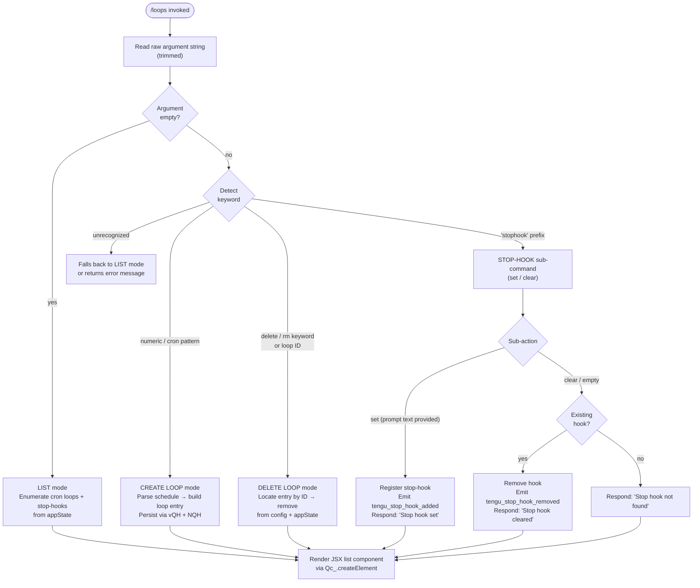

# `/loops`

> Analysis basis: CC v2.1.147 bundle.js (AST extraction + Claude interpretation)
> Minimum version: v2.1.147

---

## Overview

The `/loops` command is the unified management interface for Claude Code's recurring background automation: it lets the user list all active loop (cron) entries, create new ones with a human-readable schedule, and delete existing ones. It also manages **stop-hooks** — one-shot callbacks that fire when the current session stops — from the same surface.

---

## Registration

| Field | Value |
|---|---|
| type | `local-jsx` |
| name | `loops` |
| description | `List, create, and delete recurring loops and stop-hooks` |
| loc_byte | `11952413` |
| loc_byte_end | `11952595` |
| loc_line | `9821` |
| immediate | `true` |
| module_id | `wk1` |
| load_inline | `true` |
| arbor_handler.name | `PB7` |
| arbor_handler.fqn | `claude-2.1.147::PB7` |
| arbor_handler.kind | `AsyncFunction` |
| arbor_handler.resolution_path | `module_id` |
| arbor_handler.n_hits | `0` |

Analysis basis: CC v2.1.147 bundle.js:+11952413

---

## Input Branching

The command supports four distinct top-level user intents, each parsed from the raw argument string by the handler `PB7`. A Mermaid flowchart is used because there are more than three distinct branches.



Analysis basis: CC v2.1.147 bundle.js:+11951370, +11951500, +11951553, +11951656, +11952018, +11951812, +11951834, +11952130

---

## Behavioral Spec

### 1. Command Entry Point

`PB7` is an `AsyncFunction` resolved via `module_id → wk1`. It is the root handler for `/loops`.

```
async function loopsCommandHandler(context):
    emit telemetry("tengu_loops_command")           // +11951372
    appState  = getAppState()                        // +11951421
    rawArg    = context.arg.trim()

    loopsList = appState.loops ?? []                 // type "cron"  +11951467
    hooksMap  = appState.stophooks ?? {}             // +11951553

    branch = classifyArgument(rawArg)

    if branch == "list":
        return renderLoopsList(loopsList, hooksMap)
    if branch == "create-loop":
        entry = buildLoopEntry(rawArg)               // via NQH +11952018
        persist(entry)                               // via vQH +11951656
        return renderConfirmation(entry)
    if branch == "delete-loop":
        id = parseDeleteTarget(rawArg)
        removeLoop(id, appState)
        return renderConfirmation("deleted")
    if branch == "stophook-set":
        registerStopHook(rawArg, appState)           // via wsH / DsH +11951794 +11952106
        return renderMessage("Stop hook set")        // +11952130
    if branch == "stophook-clear":
        result = clearStopHook(appState)
        if result == NOT_FOUND:
            return renderMessage("Stop hook not found")  // +11951812
        else:
            return renderMessage("Stop hook cleared")    // +11951834
```

Analysis basis: CC v2.1.147 bundle.js:+11951370, +11951421, +11951500

---

### 2. Schedule Parsing (`SZ` — schedule-parse function)

Parses a human-readable or cron-like string into an internal schedule descriptor. Called when creating a new loop.

```
function parseSchedule(raw):
    s = raw.trim()                           // +4748873
    if s matches "Every minute" pattern:
        return { type: "cron", interval: "* * * * *" }   // +4748993
    if s matches "Every hour" pattern:
        return { type: "cron", interval: "0 * * * *" }   // +4749210
    if s matches numeric range "1-5":        // +4749917
        minutes = parseInt(...)              // +4749049
        // clamp to valid cron range: max minute = 59  (+11951137), max hour = 23 (+11951208)
        // max day-of-month = 31 (+11951261), max minute field = 60 (+11951103)
        return buildCronDescriptor(minutes)
    // Weekday resolution using UTC date helpers:
    day = J.getUTCDay()                      // +4749750
    J.setUTCDate(...)                        // +4749769
    J.setUTCHours(...)                       // +4749800
    return finalScheduleObject
```

Analysis basis: CC v2.1.147 bundle.js:+4748873, +4749049, +4749210, +4748993, +11951103, +11951137, +11951208, +11951261

---

### 3. Loop Schedule Human-Description (`JB7` — interval-description function)

Converts a stored cron expression back into a short English description for display in the list view.

```
function intervalToDescription(cronExpr):
    parts  = cronExpr.match(pattern)         // +11950958
    mins   = parseInt(parts.minutes)         // +11950995
    result = Math.max(1, ...)               // +11951080
    result = Math.ceil(result)              // +11951091
    result = Math.round(result)             // +11951164
    // schedule object → DN (schedule-normalizer)  +11951328
    return humanLabel
```

Analysis basis: CC v2.1.147 bundle.js:+11950958, +11950995, +11951080, +11951164

---

### 4. Loop Entry Construction (`NQH` — entry-builder function)

Assembles the data object for a new loop before writing it to persistent storage.

```
function buildLoopEntry(scheduleDescriptor, promptText):
    id        = He9.randomUUID()             // +4752429
    createdAt = Date.now()                   // +4752491
    resolved  = resolveSchedule(scheduleDescriptor)  // via VXH  +4752537
    fileData  = readCurrentConfig()          // via VZH  +4752581
    fileData.push(newEntry)                  // +4752594
    // UUID length = 8 chars minimum         // +4752454
    return newEntry
```

Analysis basis: CC v2.1.147 bundle.js:+4752429, +4752491, +4752537, +4752581

---

### 5. Loop Persistence (`vQH` — loop-write function)

Writes the updated loop array to the `.claude` config directory.

```
function persistLoops(loopArray, configDir):
    base = resolveConfigBase()               // via M4  +4752238
    GA8.mkdir(configDir, { recursive: true }) // +4752249
    path = TA8.join(configDir, ".claude")    // +4752259
    serialized = loopArray.map(serialize)    // +4752310
    GA8.writeFile(path, serialized)          // +4752346
    // encoding: "utf-8"                     // +4751129
    updateSummary = s1H(path)               // +4752360
    CH(serialized)                           // +4752367
```

Analysis basis: CC v2.1.147 bundle.js:+4752238, +4752249, +4752259, +4752346

---

### 6. Existing Config Load (`VZH` — config-reader function)

Reads the current loops configuration from disk before mutation operations.

```
async function readLoopsConfig(configPath):
    canonicalPath = F6(configPath)           // +4751082
    raw = _.readFile(canonicalPath, "utf-8") // +4751101  literal +4751129
    summary = s1H(raw)                       // +4751112
    parsed  = t9(raw)                        // +4751151
    validated = RH(parsed)                   // +4751173
    if not Array.isArray(validated):         // +4751245
        validated = N(validated)             // +4751424
    serialized = CH(validated)               // +4751471
    return DN(serialized)                    // +4751493
```

Error codes handled during read: `ENOENT`, `EACCES`, `EPERM`, `ENOTDIR`, `ELOOP`, `EROFS`
Analysis basis: CC v2.1.147 bundle.js:+4751082, +4751101, +172908–172977

---

### 7. Stop-Hook Registration (`wsH` / `DsH` — stophook-register / stophook-apply functions)

Two cooperating functions manage stop-hooks.

```
function registerStopHook(promptText, appState):
    // wsH path: +11951794
    hookId  = If1.randomUUID()               // via Vf1  +10324322
    hooksGate = checkGate("hooks_gate")      // literal +10323374
    trustGate = checkGate("trust_gate")      // literal +10323428
    newMsg  = {
        role:    "system",                   // +11951701
        type:    "prompt",                   // +10323293
        content: promptText,
        kind:    "goal",                     // +10324263
        op:      "append"                    // +10324198
    }
    appState.applyMessageOp(newMsg)          // +10324175
    appState.setAppState(...)               // +10323765 (via DsH)
    emit telemetry("tengu_stop_hook_added")  // +10323864
    // Status label: "Stop" is used in display  // +10323186

function clearStopHook(appState):
    // DsH path: +11952106
    existingHook = appState.stophooks[current]
    if not existingHook:
        return NOT_FOUND
    appState.applyMessageOp({ op: "remove", ... })  // +10323807
    emit telemetry("tengu_stop_hook_removed")        // +10324232
    return CLEARED
```

Analysis basis: CC v2.1.147 bundle.js:+11951794, +11952106, +10323374, +10323428, +10323864, +10324232

---

### 8. List Rendering (`ae` + `YsH` — list-collector and display-formatter)

```
function collectAndRenderLoops(loopsList, hooksMap):
    // ae: +11951410  — collects loop + stophook records
    display = []
    for each loop in loopsList:
        label  = intervalToDescription(loop.schedule)   // via YsH  +11951417
        padded = label.padEnd(columnWidth)               // +15141797  width=40 +15143789
        display.push({ id: loop.id, label: padded, status: loop.status })

    for each hookKey in hooksMap:
        display.push({ id: hookKey, label: "stophook", ... })

    return display   // fed into Qc_.createElement JSX component  +11952173
```

Column width constant: `40` characters (`+15143789`)
Analysis basis: CC v2.1.147 bundle.js:+11951410, +11951417, +15141797, +15143789, +11952173

---

### 9. Loop Deletion Sub-path (`oe` — delete-coordinator)

```
function deleteLoop(id, loopsList, persistFn):
    candidate = loopsList.filter(e => e.id == id)  // via oe  +4752816
    known     = alreadyKnownSet.has(id)             // +4752831
    if not candidate and not known:
        return error("not found")
    // remove entry, rewrite config
    await persistFn(loopsList.filter(e => e.id != id))
    return "deleted"
```

Analysis basis: CC v2.1.147 bundle.js:+4752807, +4752816, +4752831

---

## State & Side Effects

| Item | Detail |
|---|---|
| Telemetry — command entry | `tengu_loops_command` (+11951372) — fired unconditionally on handler entry |
| Telemetry — stop-hook added | `tengu_stop_hook_added` (+10323864) |
| Telemetry — stop-hook removed | `tengu_stop_hook_removed` (+10324232) |
| Telemetry — daemon control | `tengu_daemon_control` (+15153889) — emitted by daemon layer reached via loop dispatch |
| Telemetry — daemon config reload | `tengu_daemon_config_reload` (+15132565) |
| Telemetry — bg spawn/claim | `tengu_bg_spare_spawn`, `tengu_bg_spare_claim`, `tengu_bg_spare_claim_fail`, `tengu_bg_spare_enable` — background worker events reached through loop execution path |
| Telemetry — SIGKILL escalation | `tengu_bg_dispatch_sigkill_escalate` (+15117797) |
| Telemetry — low memory | `tengu_bg_low_mem_mb` (+12461757), `tengu_bg_dispatch_low_mem` (+15118376) |
| Telemetry — feature flags | `tengu_feature_ok` (+960829), `tengu_feature_bad` (+960887), `tengu_feature_sad` (+960964) |
| Telemetry — daemon stop | `tengu_daemon_control` path covers `daemon_stop` (+15153814) and `daemon_stop_failed` (+15153851) string signals |
| Telemetry — send-claim fail | `tengu_bg_sendclaim_failed` (+15098898) |
| Telemetry — daemon yield | `tengu_daemon_yield` (+15136736) |
| appState changes | Loops array updated on create/delete; stop-hook entry added/removed via `applyMessageOp` |
| File system | Loop config written to `.claude` directory (+4752270); uses `GA8.mkdir` + `GA8.writeFile` |
| File encoding | `"utf-8"` (+4751129) for all config reads/writes |
| JSX rendering | Output rendered via `Qc_.createElement` (+11952173); command is `local-jsx` type |
| Immediate execution | `immediate: true` — command runs without requiring explicit confirmation |
| Background daemon | Loop execution dispatches work through the background daemon subsystem (`V6A`, `S6A`, `w`); daemon sends/receives via `KB.spawn`, `KB.claim` |
| Stop-hook send-claim timeout | 5 000 ms (`+15099319`) |
| Stop-hook retry interval | 500 ms (`+15099523`) |
| Session roster | Updated via `_.rosterEntry` (+15124285) |
| Loop state values observed | `active`, `idle`, `working`, `bg`, `daemon`, `blocked`, `crashed`, `done`, `killed`, `stopped`, `failed`, `resuming` |
| Idle timeout | 300 000 ms (5 min) before an idle background loop is considered stale (+15124543) |
| Hook guard gates | `hooks_gate` (+10323374), `trust_gate` (+10323428) checked before stop-hook registration |

---

## Version History

| Version | Change |
|---|---|
| v2.1.147 | Initial analysis |

---

## Common Mistakes

1. **Providing an unrecognized schedule string.** The parser (`SZ`) understands natural-language phrases such as `"Every minute"` and `"Every hour"`, cron-like numeric fields, and the range format `"1-5"`. Free-form prose schedules are not accepted and will fall through to an error or list path.
2. **Expecting immediate loop execution.** Creating a loop schedules it; the first run is governed by the cron interval, not by the creation moment.
3. **Clearing a stop-hook that was never set.** The command will respond with `"Stop hook not found"` (+11951812) rather than silently succeeding.
4. **Assuming stop-hooks survive across sessions.** Stop-hooks are keyed to the current session's `appState`; they are fired (and consumed) when the session stops, not persisted globally.
5. **Mixing loop IDs and schedule strings in delete commands.** The delete path (`oe`) expects a loop ID, not a re-statement of the schedule; passing a schedule string will result in a not-found error.

---

## Appendix — Identifier Mapping

> For bundle debugging only. Identifiers change across versions.

| Identifier | Role |
|---|---|
| `PB7` | Main async handler for `/loops` command (Arbor-resolved, `module_id → wk1`) |
| `c` | Generic utility / logger called at handler entry |
| `ae` | Loop + stophook list collector; calls `VZH` and `k0` |
| `VZH` | Config-reader: reads loop config from disk, validates, parses |
| `F6` | Path canonicaliser used in config reads |
| `s1H` | Summary/hash helper; joins via `TA8.join`, calls `M4` |
| `M4` | Calls `oV`; low-level value coercer |
| `t9` | JSON/schema parser layer; calls `q8` |
| `q8` | Error-code normaliser |
| `RH` | Schema validator / record normaliser; manages rolling buffer (`lb6`), error logger |
| `n_` | Error-message formatter using `Error` + `String` |
| `UH` | String coercion helper |
| `j1` | Record-type router; calls `XwA` |
| `FpK` | Queue manager: shifts/pushes `lb6` ring buffer |
| `N` | Content normaliser: casing, trim, hash, path expansion |
| `vJK` | Value-join handler: calls `Av`, `VJK`, `j9A` |
| `H` | Generic context/state bag (also used as timer host via `Math.random`, `setTimeout`) |
| `CH` | JSON serialiser wrapper around `JSON.stringify` |
| `f4` | Field-redaction helper; replaces sensitive values with `"[REDACTED]"` |
| `lRH` | Line-read helper; calls `b1A` |
| `kJK` | File-content reader with byte-length guard (`Buffer.byteLength`); manages `IJK` binding |
| `DN` | Schedule-string normaliser: trims, calls `D3L`, accumulates result |
| `D3L` | Cron-field parser: splits, matches, `parseInt`, builds `Set` via `K.add` |
| `A` | Array accumulator (context-dependent) |
| `L` | Promise-chain host; manages add/finally/delete lifecycle |
| `q` | Pending-set tracker; uses `HfK.unlinkSync` for cleanup |
| `M` | Stream/channel abstraction; `close`, `finally` |
| `k0` | Loop-key resolver; calls `oV` |
| `oV` | Low-level config-value accessor |
| `YsH` | Display-label formatter; calls `UwH`, pads strings, pushes to display array |
| `UwH` | Column-set builder; calls `K.set`, `tdq` |
| `K` | Map abstraction (context-dependent: display column map or generic) |
| `tdq` | Row-mapper; maps via `H.map` |
| `h6` | App-state accessor shortcut; calls `oV` |
| `SZ` | Schedule parser: parses human-readable strings into cron descriptors |
| `w` | Background-worker runner: manages spawn, kill, SIGKILL, memory checks, V6, retire |
| `C` | Worker-child process controller: `SfK`, `Az`, `N`, `RH`, `Nj5`, write |
| `SfK` | Filesystem real-path + stat resolver for worker binary |
| `Az` | Worker argument builder |
| `Nj5` | Worker log-path resolver; calls `LY8` |
| `z` | IPC stream writer; sub-handles `bH`, `mH`, `Pk`, `Ou` |
| `mH` | Failure-side IPC handler; calls `c`; emits `tengu_feature_bad` |
| `bH` | Success-side IPC handler; calls `c`; emits `tengu_feature_ok` |
| `sG8` | Memory-guard check (macOS, 1024 MB threshold); calls `o6`, `V6` |
| `V6` | Active-session registry check: `Df6`, `wf6`, `Ct`, `V$H`, `As6`, `zf6`, `Pg`, `x6` |
| `T$6` | Pins-file reader (`pins.json`); reads + filters loop pin records |
| `M$_` | Config-path builder for pins: `jX.join`, `wG` |
| `B6` | JSON parser wrapper around `JSON.parse` |
| `J8` | ENOENT-tolerant file-read helper; calls `q8` |
| `v9L` | Recursive directory reader for loop configs; filters directories, pushes entries |
| `g` | Retired-session filter: `oH.filter`, `vH.has` |
| `oH` | Session-list holder; calls `Z6` |
| `vH` | Retired-session set; references `V` |
| `v6A` | Spare-worker claim and IPC connect: `KB.claim`, `So_`, `tw5`, `sw5`, `EN8.connect`, write, end |
| `So_` | Session-directory initialiser: mkdir, `writeFile`, `JSON.stringify`, 448/384-byte limits |
| `tw5` | Claim-frame timeout handler: 5 000 ms timeout, `ew5`, `q8`, `r8` |
| `sw5` | Claim-frame builder: `KB.buildClaimFrame` |
| `ZH` | String-cast utility; wraps `String()` |
| `bU` | Binary-frame encoder: `Buffer.from`, `Buffer.allocUnsafe`, `writeUInt32BE`, `writeUInt8`, copy |
| `S6A` | Full loop-session lifecycle manager: spawn, track, retire, delete, roster |
| `RK` | Roster-key builder: `jX.join`, `wG` |
| `dq` | Session-state file reader/writer with caching (`hOH` map); validates numeric fields |
| `bw` | Activity-state writer; calls `TZ`; sets `"active"` status |
| `h5` | Hook-path helper: `ez`, `jX.join`, `CH`, `Cw` |
| `gsH` | Post-session hook runner: `nw1.then`, `BU`, `Date.now`, `qI7`, catch |
| `QLH` | Hook-log-path builder: `Y$.join`, `jyH` |
| `Ny` | Hook-output splitter: `o6`, `Y$.join`, `jyH`, `H.split` |
| `UU` | Hook-config builder: `o6`, `qF_`, `Y$.join`, `BsH` |
| `zT6` | Hook-dir creator: `Y$.join`, `MF_` |
| `Y` | Loop-config hot-reloader: stop/updateConfig/start cycle, `kfK`, set, `Z.start`, `c`; emits `tengu_daemon_config_reload` |
| `D` | Worker-restart debounce loop: 2 000 ms delay, calls `V6`, `sG8`, `o6`, `V6A`, `Az`, `N`, `q8`, `RH`; emits `tengu_bg_spare_spawn` |
| `$` | Disposable resource wrapper; calls `ZC1` |
| `V6A` | Spare-worker spawner via `Bun.spawn`: `eMK.randomBytes`, `XB.mkdir/unlink`, `Hj5`, `aw5`, `M.unref`; emits `tengu_bg_spare_refill` |
| `S` | Spawn-result disposable |
| `j` | Active-worker iterator: `A.values`, `y.kill` |
| `y` | Worker-kill coordinator: `z.write`, `c`; emits `tengu_daemon_yield` |
| `J` | Date-calculation context host for weekday scheduling; references `w` |
| `oe` | Delete-loop coordinator: `ya`, `VZH`, filter, set-membership check, `vQH` |
| `ya` | Config-presence probe; calls `_.has` |
| `vQH` | Loop-write function: mkdir `.claude`, `writeFile`, serialize entries |
| `wsH` | Stop-hook register path: `h6`, `YsH`, `getAppState/setAppState`, `applyMessageOp`, `If1` |
| `If1` | UUID generator for hook IDs; calls `Vf1.randomUUID` |
| `JB7` | Interval-to-description converter: parse cron fields, `Math.max/ceil/round`, calls `DN` |
| `NQH` | Loop-entry builder: `He9.randomUUID`, `Date.now`, `VXH`, `VZH`, push, `h6`, `ll`, `vQH` |
| `VXH` | Schedule-validity checker called from `NQH` |
| `f` | MCP-client registry: `EkH`, `k7K`, `_D5`, values/get/filter |
| `EkH` | MCP-server connector: iterates entries, builds connections (`ux_`, `mx_`, `bx_`), manages `rj7`, `GK8`, `XK8`, `OL1`, `g06`, `Ru_` |
| `RHH` | MCP-record type dispatcher: `gQ`, `CKH`, `iYH`, `SHH`, `cD6`, `Object.assign` |
| `TN` | MCP-tool-name router: `o$`, `c2_` |
| `s8` | MCP-state snapshot helper; calls `_` |
| `F06` | MCP-filter predicate |
| `rj7` | MCP-retry scheduler: `Su_`, `WK8`, `Date.now` |
| `GK8` | MCP-connection-state updater: `WK8`, `MP` |
| `XK8` | MCP-capability-flag setter: `pK` |
| `z8` | MCP-debug logger: pushes `bbH`, calls `Gl.logMCPDebug` |
| `ux_` | MCP-tool-call executor: `Hw7`, `PF`, `sD7`, `P8H`, `RaH`, `AJ8`, `Ud`, `qm`, `Y`, `rN`, `k7`, `ZH`, `Promise.race`, `_w7`, `eD7` |
| `mx_` | MCP-OAuth-callback handler: `PF`, `tD7`, `SaH`, `CaH`, `L`, `ZH` |
| `wL1` | MCP-tool-result processor: `vJ8.then`, `Su_`, `M1`, `IJ8`, `CH` |
| `bx_` | MCP-binary-message handler: `MP`, `pK`, `z8`, `ZH` |
| `B2_` | MCP-capability-check helper: `M8`, `A.includes` |
| `k7` | MCP-error logger: pushes `bbH`, calls `Gl.logMCPError` |
| `OL1` | MCP-orphan checker; calls `Gi` |
| `g06` | MCP-tool-count extractor; calls `parseInt` |
| `Ru_` | MCP-resource-count extractor; calls `parseInt` |
| `k7K` | MCP-update applier: `applyMcpUpdate`, `kJ8`, `A.cleanup`, `sN`, `nj` |
| `kJ8` | MCP-state serialiser; calls `CH` |
| `sN` | MCP-client-state cleaner: `laH`, `K.cleanup` |
| `_D5` | MCP-client reconciler: `Object.entries`, filter, `getClients`, `EK8`, `r8`, `N`, `laH`, `EkH`, `k7K`, `Object.fromEntries` |
| `EK8` | MCP-transport-capability checker: `uIL.has`, `mIL.has` |
| `r8` | Async-retry wrapper: `K`, `Error`, `q`, `setTimeout`, `clearTimeout`, `L.unref` |
| `laH` | MCP-log formatter; calls `CH` |
| `ll` | Loop-display-text builder; calls `p9H` |
| `p9H` | Prompt-text trimmer: `Ks`, `_.trim` |
| `Ks` | Text-slicer with pipe limit (200 chars, 1 000 000 byte max): `H.slice`, `kPA`, `b6` |
| `DsH` | Stop-hook apply function: `Gp_`, `K8`, `h6`, `YsH`, `getAppState`, `Date.now`, `Pw`, `setAppState`, `applyMessageOp`, `If1`, `c`, `bH`; emits `tengu_stop_hook_added` |
| `Gp_` | Policy/gate evaluator: `Qm`, `BY`, `h_`, `S7` |
| `Qm` | Policy-settings reader: `m8`, `Cu6`, `WF` |
| `m8` | Config-section accessor: `Cu6`, `WF` |
| `BY` | Gate-result builder: `m8`, `XA` |
| `h_` | Trust-level resolver |
| `S7` | Hook-policy evaluator: `XQ4` |
| `XQ4` | Policy-rule matcher: `UH`, `DRH`, `Rq`, `x6`, `HBH`, `YF`, `b6`, `UY.resolve` |
| `K8` | State-snapshot helper; calls `c`; emits `tengu_feature_sad` |
| `Pw` | Output-token counter: `_RH`, `Object.values`; reads `"outputTokens"` field |