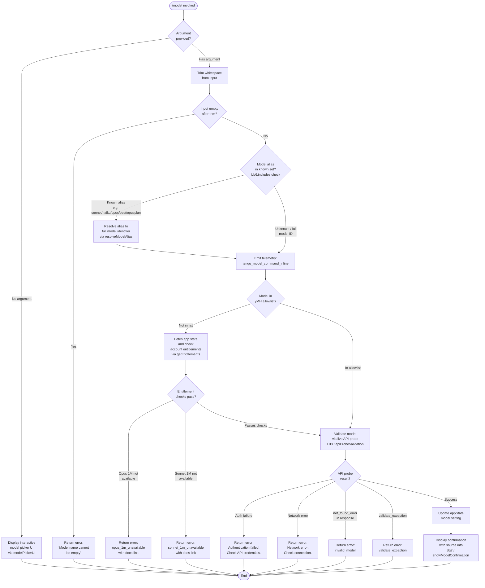

# `/model`

> Analysis basis: CC v2.1.147 bundle.js (AST extraction + Claude interpretation)
> Minimum version: v2.1.147

---

## Overview

The `/model` command allows users to set or inspect the AI model used by Claude Code for the current session. When invoked with a model name argument, it validates the model identifier against the user's account entitlements, performs a live API probe to confirm availability, and then updates application state to use the selected model. When invoked without an argument, it displays an interactive model picker showing the current model configuration and available options.

---

## Registration

| Field | Value |
|---|---|
| type | `local` |
| name | `model` |
| description | Set the AI model for Claude Code |
| argumentHint | `<model>` |
| supportsNonInteractive | `true` |
| module_id | `fR1` |
| load_inline | `true` |
| loc_byte | `12139757` |
| loc_byte_end | `12139931` |
| loc_line | `9972` |
| arbor_handler.name | `TQ7` |
| arbor_handler.fqn | `claude-2.1.147::TQ7` |
| arbor_handler.kind | `AsyncFunction` |
| arbor_handler.resolution_path | `module_id` |
| arbor_handler.n_hits | `0` |

Analysis basis: CC v2.1.147 bundle.js:+12139757

---

## Input Branching

The command exhibits four distinct top-level branches based on argument presence and validity, followed by nested branches for model-alias resolution and availability checking.



---

## Behavioral Spec

### 1. Entry Point — Handler (`TQ7`)

The main handler is the async function `TQ7`, resolved via `module_id → fR1` by the Arbor symbol graph.

```
async function handleModelCommand(context, args):
    rawInput = args[0] ?? ""
    trimmed  = rawInput.trim()                       // H.trim @ +12131568

    if trimmed is empty:
        return errorResult("Model name cannot be empty")  // literal @ +12093274

    resolvedModel = resolveAliasIfKnown(trimmed)     // Ub6.includes @ +12131584
    emit telemetry("tengu_model_command_inline")     // @ +12131726

    if not in yMH allowlist:                         // yMH.includes @ +12131671
        entitlements = getAppState().entitlements    // _.getAppState @ +12131607
        checkEntitlementGates(resolvedModel, entitlements)  // d08 @ +12131651

    result = validateModelViaAPI(resolvedModel)      // jS1 @ +12131791

    if result.ok:
        updateModelInState(resolvedModel)
        showModelConfirmation(resolvedModel)
    else:
        return errorResult(result.error)
```

Analysis basis: CC v2.1.147 bundle.js:+12131568

---

### 2. Alias Resolution (`lq`)

The function mapped to `lq` normalises user-supplied shorthand aliases into canonical model identifiers. The following shorthand tokens are supported (derived from string literals found in the implementation):

| Alias token | Resolved meaning |
|---|---|
| `sonnet` | Current Sonnet family model (bundle.js:+2172073) |
| `haiku` | Current Haiku family model (bundle.js:+2172112) |
| `opus` | Current Opus family model (bundle.js:+2172151) |
| `best` | Highest-capability model (bundle.js:+2172188) |
| `opusplan` | Opus in plan mode, else Sonnet (bundle.js:+2170590 / +2170607) |
| `[1m]` suffix | Extended 1M-context variant (bundle.js:+2172058) |

```
function resolveModelAlias(input):
    lower = input.toLowerCase()
    trimmed = lower.trim()

    if trimmed == "sonnet":
        return canonicalSonnet()
    if trimmed == "haiku":
        return canonicalHaiku()
    if trimmed == "opus":
        return canonicalOpus()
    if trimmed == "best":
        return bestAvailableModel()
    if trimmed == "opusplan":
        return opusPlanModel()       // "Opus Plan" label @ +2170898
    if trimmed ends with "[1m]":
        base = trimmed without "[1m]" suffix
        return extendedContextVariant(base)

    // No alias match — return input unchanged
    return trimmed
```

Analysis basis: CC v2.1.147 bundle.js:+2172050 through +2172234

---

### 3. Entitlement Gate (`d08` + `Sy`)

Before API validation, certain model/context combinations are gated behind account entitlement checks.

```
function checkEntitlementGates(modelId, appState):
    entitlements = resolveEntitlements(appState)    // Sy @ +12097258

    // Gate 1: Opus with 1M context
    if modelId targets opus-1m variant:
        if not entitlements.allowsOpus1M:
            emit event("model_switch", reason="opus_1m_unavailable")  // @ +12095197
            raise UserError(
                "Opus with 1M context is not available for your account. " +
                "Learn more: https://code.claude.com/docs/en/model-config#extended-context-with-1m"
            )  // literal @ +12095235

    // Gate 2: Sonnet 4.6 with 1M context
    if modelId targets sonnet-4-6[1m] variant:        // literal @ +12097020
        if not entitlements.allowsSonnet1M:
            emit event("model_switch", reason="sonnet_1m_unavailable")  // @ +12095414
            raise UserError(
                "Sonnet 4.6 with 1M context is not available for your account. " +
                "Learn more: https://code.claude.com/docs/en/model-config#extended-context-with-1m"
            )  // literal @ +12095454
```

Analysis basis: CC v2.1.147 bundle.js:+12095165, +12095382

---

### 4. Entitlement Resolution (`Sy` → `ML6` → `WW`)

Entitlement tier computation is a multi-step resolution that considers subscription plan type.

```
function resolveEntitlements(appState):
    planInfo = buildPlanInfo(appState)              // ML6 @ +12097060
    tierSet  = computeTierCapabilities(planInfo)    // WW  @ +12097067

    // Recognised plan tiers (literals in WW sub-graph):
    //   "max"                    @ +2941653
    //   "team"                   @ +2941724
    //   "default_claude_max_5x"  @ +2941739
    //   "enterprise"             @ +2941834
    //   "enterprise_usage_based" @ +2941856

    return tierSet
```

Analysis basis: CC v2.1.147 bundle.js:+12097258

---

### 5. Live API Validation (`F08`)

When the model is not in the internal pre-approved allowlist, a lightweight "side query" is sent to the Anthropic API to confirm the model name is valid for the user's credentials.

```
async function validateModelViaAPI(modelId):
    if modelId.trim() == "":
        return { ok: false, error: "Model name cannot be empty" }  // @ +12093274

    // Resolve full model list via FF (model-list fetcher)
    availableModels = fetchAvailableModels()        // FF @ +12093308
    normalised = modelId.toLowerCase()             // @ +12093397

    // Check against known-bad set (wS1 cache)
    if wS1.has(normalised):                        // @ +12093518
        return { ok: false, error: getCachedError(normalised) }

    // Send ephemeral probe request                // "ephemeral" @ +12093707
    probeResponse = await sendSideQuery(           // rb @ +12093563
        messages: [{ role: "user", content: "Hi" }],  // @ +12093648, +12093682
        model: modelId,
        maxTokens: 1024                            // @ +12891772
    )

    // Classify probe outcome
    if probeResponse is auth error:
        return { ok: false, error: "Authentication failed. Please check your API credentials." }
                                                   // @ +12093973
    if probeResponse is network error:
        return { ok: false, error: "Network error. Please check your internet connection." }
                                                   // @ +12094075
    if probeResponse.error.type == "not_found_error":  // @ +12094194
        wS1.set(normalised, "invalid_model")       // cache result @ +12093726
        return { ok: false, error: "invalid_model" }  // @ +12095697

    if probeResponse is validate_exception:        // @ +12095794
        return { ok: false, error: "validate_exception" }

    // Success path — cache and return
    yg7(normalised, probeResponse)                 // post-probe processing @ +12093767
    emit telemetry("tengu_api_success")            // @ +12893407
    return { ok: true }
```

API probe uses: `side_query` request type (bundle.js:+12891956), `ephemeral` cache control (bundle.js:+12093707), max tokens: 1024 (bundle.js:+12891772).

Analysis basis: CC v2.1.147 bundle.js:+12093237 through +12094276

---

### 6. Model Confirmation Display (`Sg7`)

After a successful model switch, a confirmation message is rendered to the user. The display includes source attribution (which settings layer controls the model) and contextual annotations.

```
function showModelConfirmation(modelId, appState):
    // Determine which settings layer owns the current model value
    source = resolveModelSource(appState)
    // Possible sources (literals @ +12096503–+12096563):
    //   "model"            — session-level override
    //   "projectSettings"  — .claude/settings.json
    //   "localSettings"    — .claude/settings.local.json
    //   "policySettings"   — managed/policy settings

    // Build display path for settings file
    //   paths: [".claude", "settings.json"]        @ +1205919, +1205929
    //          [".claude", "settings.local.json"]   @ +1205991

    if source == "policySettings":
        label = "Managed settings"                 // @ +12096665

    // Append mode annotations
    annotations = []
    if fastModeEnabled:
        annotations.append(" · Fast mode ON")      // @ +12096262
    else:
        annotations.append(" · Fast mode OFF")     // @ +12096359

    if usageCreditsApply:
        annotations.append(" · Draws from usage credits")  // @ +12096313

    render bold(modelId) + dim(source path) + annotations
    // P6.bold @ +12096723, P6.dim @ +12096697
```

Analysis basis: CC v2.1.147 bundle.js:+12096499 through +12096731

---

### 7. Model List Fetcher (`FF`)

The full canonical model list is assembled from multiple sources, normalised, and filtered.

```
function buildModelList(context):
    rawList = fetchFromAPI()                       // XA @ +2166025
    mapped  = rawList.map(m => m.toLowerCase())   // @ +2166102
    trimmed = mapped.map(m => m.trim())            // @ +2166113

    // Filter to known providers
    anthropicModels = trimmed.filter(
        m => m.startsWith("anthropic.")            // @ +2166178
          or m.startsWith("claude-")               // @ +2165799
    )

    // Additional classification helpers called:
    //   isDeprecated(m)     — ImH / _99
    //   isRecommended(m)    — W24
    //   hasProvider(m)      — C9H
    //   normaliseId(m)      — lq
    //   groupByFamily(m)    — G24

    return anthropicModels
```

Analysis basis: CC v2.1.147 bundle.js:+2166025 through +2166527

---

### 8. Provider / Backend Detection (`hA` → `UH`)

Model display and routing are adjusted based on the detected API backend.

```
function detectBackend(appState):
    // Backend identifiers found in literals:
    //   "bedrock"       @ +2029601
    //   "foundry"       @ +2029651
    //   "mantle"        @ +2029761
    //   "vertex"        @ +2029809
    //   "anthropicAws"  @ +2030270
    //   "gateway"       @ +2030290
    //   "firstParty"    @ +2170798

    backend = appState.apiProvider
    return backend
```

Analysis basis: CC v2.1.147 bundle.js:+2029561 through +2030290

---

## State & Side Effects

| Item | Detail |
|---|---|
| Telemetry | `tengu_model_command_inline` (emitted on every non-empty inline invocation, bundle.js:+12131726); `tengu_api_success` (emitted after successful API probe, bundle.js:+12893407); `tengu_feature_bad` (emitted on handler error path, bundle.js:+960887); `tengu_feature_ok` (emitted on handler success path, bundle.js:+960829) |
| appState changes | Model field updated in application state via `_.getAppState()` after successful validation (bundle.js:+12131607) |
| Validation cache | `wS1` (a Map) is consulted before and written after each API probe to avoid redundant network calls (bundle.js:+12093518, +12093726) |
| API side-effect | A live ephemeral "side query" probe request is sent to the Anthropic API for unknown model IDs. Request type: `side_query`, max tokens: 1024 (bundle.js:+12891772, +12891956) |
| Error reporting | On probe failures referencing `model:` prefix in error messages (bundle.js:+12094276). Issue tracker URL embedded: `https://github.com/anthropics/claude-code/issues` (bundle.js:+12892341) |
| Docs links | Extended-context unavailability errors link to `https://code.claude.com/docs/en/model-config#extended-context-with-1m` (bundle.js:+12095235, +12095454) |
| Sound | <!-- TODO: not found in depth-2 traversal; needs --depth 4 --> |
| Hook registration | <!-- TODO: not found in depth-2 traversal; needs --depth 4 --> |

---

## Version History

| Version | Change |
|---|---|
| v2.1.147 | Initial analysis |

---

## Common Mistakes

1. **Passing an empty string after whitespace**: The argument hint `<model>` suggests a value is required. Whitespace-only input is treated as empty and returns `"Model name cannot be empty"` immediately — the user must supply a non-blank token.
2. **Using an alias without knowing its resolution**: Aliases like `best`, `sonnet`, and `opusplan` resolve to specific canonical model IDs at runtime based on the user's account. The resolved ID, not the alias, is what is stored in settings.
3. **Assuming all models are always available**: Models in the 1M-context tier (`[1m]` suffix for opus and sonnet-4-6) require matching account entitlements. Attempting to set them without the correct subscription tier yields an immediate error with a documentation link.
4. **Expecting instant validation without network access**: For model IDs not in the internal pre-approved allowlist (`yMH`), the command performs a live API probe. Offline environments or incorrect API credentials will cause the validation to fail even for valid model names.
5. **Conflating session model with persisted settings**: The `/model` command updates the active session's model. Whether the change persists depends on which settings layer (`localSettings`, `projectSettings`, `policySettings`) holds the `model` key. A `policySettings`-locked model displays "Managed settings" and may not be overridable.
6. **Using full versioned model IDs vs. aliases**: While full IDs (e.g. `claude-sonnet-4-6`) are accepted, they bypass alias resolution and go directly to API validation. Aliases are convenience shortcuts that get resolved to the current recommended version for that family.

---

## Appendix — Identifier Mapping

> For bundle debugging only. Identifiers change across versions.

| Identifier | Role |
|---|---|
| `TQ7` | Main async handler for `/model` command (arbor_handler, module `fR1`) |
| `H` | Generic utility / string-holding variable used in trim/random/setTimeout calls |
| `_` | App state accessor namespace (e.g. `_.getAppState`, `_.toLowerCase`) |
| `d08` | Entitlement gate dispatcher — routes to `Sy` and state accessor |
| `Sy` | Entitlement resolver — combines plan info and tier capabilities |
| `ML6` | Plan-info builder — calls `CJ` (provider check) and `lq` (alias normaliser) |
| `CJ` | Provider/backend classification helper |
| `lq` | Model alias normaliser and canonical ID resolver |
| `WW` | Tier capability set builder — processes plan strings into feature flags |
| `GA` | Tier capability sub-resolver (called by `WW`, `tP`, `ejH`, `UHH`, `lKH`) |
| `gs` | Tier helper (reads `"max"` tier) |
| `W3H` | Tier helper (reads `"team"` / `"default_claude_max_5x"` tiers) |
| `hmH` | Tier helper (reads `"enterprise"` / `"enterprise_usage_based"` tiers) |
| `kv` | Provider-flag combiner (calls `W3`, `gf`) |
| `tP` | Plan-type processor (calls `u9H`, `m9H`, `hA`, `GA`, `q1`) |
| `W3` | Backend/provider resolver (calls `hA`) |
| `hA` | API-provider type checker (calls `UH`) |
| `gf` | Feature-flag aggregator (calls `MRH`, `dj4`, `AaA`, `_Q6`, `hA`) |
| `yv` | Model-availability checker (calls `W3`, `gf`) |
| `c` | Generic utility / constant container |
| `jS1` | Validation orchestrator — calls `vl_` (validation pipeline) and `Nl_` (result renderer) |
| `vl_` | Full validation pipeline — calls `FF`, `mH`, `Cg7`, `bg7`, `Rg7`, `F08`, `ZH` |
| `FF` | Model list fetcher and classifier |
| `A` | Model list entry (mapped to lowercase in list processing) |
| `f` | Model metadata record accessor |
| `K` | Model display-name formatter (padEnd 40 chars) |
| `q` | Model set / file operations helper |
| `AQ6` | Model entry builder using `Object.entries` |
| `ImH` | Deprecation checker (`X24.includes`) |
| `_99` | Index-lookup helper for deprecated models |
| `W24` | Recommended-model checker (calls `C9H`, `lq`) |
| `C9H` | Provider-presence checker (`R9H.includes`) |
| `G24` | Model-family grouper (calls `C9H`, `lq`, `H99`) |
| `mH` | Feature flag checker (calls `c`; emits `tengu_feature_bad`) |
| `Cg7` | Opus 1M availability checker (lowercase + `UHH` + `tP`) |
| `UHH` | Usage-credit helper (calls `u9H`, `GA`, `dXq`) |
| `bg7` | Sonnet 1M availability checker (lowercase + `lKH`) |
| `lKH` | Usage-credit helper for Sonnet (calls `u9H`, `GA`, `dXq`) |
| `Rg7` | Model-prefix validator (`R9H.includes`, lowercase check) |
| `F08` | Live API probe validator — orchestrates probe, caches results |
| `rb` | API request sender (fetch, streaming, error classification) |
| `yg7` | Post-probe result processor (calls `hg7`, `String`) |
| `ZH` | String coercion utility |
| `Nl_` | Validation result renderer — builds output message with annotations |
| `bH` | Feature-flag gate for result rendering (calls `c`; emits `tengu_feature_ok`) |
| `vK` | Model display formatter (calls `hA`, `UH`) |
| `UH` | String conversion helper |
| `J3H` | Fast-mode indicator builder |
| `CD` | Model-display row builder (calls `vK`, `WW`, `lq`, `Ql`) |
| `Ql` | Display-row sub-component (calls `UH`) |
| `ejH` | Opus-specific annotation builder (calls `GA`, `lq`, `bJ`, `Ql`, `GW`) |
| `bJ` | Combined model+tier display component (calls `lq`, `WW`) |
| `GW` | Usage-credit annotation builder (calls `u9H`) |
| `Sg7` | Model confirmation display renderer (calls `zWH`, `m8`, `jC`, `dl`) |
| `zWH` | Settings-source path resolver (calls `Hm`, `m8`) |
| `m8` | Settings file path builder (calls `Cu6`, `WF`) |
| `jC` | Path join helper (`Pv.join`, constructs `.claude/settings.json` paths) |
| `dl` | Settings-layer display builder (calls `C9H`, `CJ`, `lq`) |