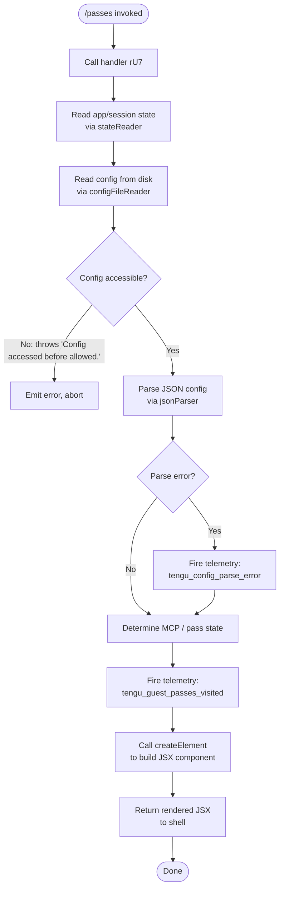

# `/passes`

> Analysis basis: CC v2.1.147 bundle.js (AST extraction + Claude interpretation)
> Minimum version: v2.1.147

---

## Overview

The `/passes` command allows Claude Code users to share a free week of Claude Code with friends (guest passes). When invoked, it renders a JSX-based UI component that displays pass information, and fires a telemetry event (`tengu_guest_passes_visited`) to record that the feature was accessed. The command is wired through the async handler `rU7`, which coordinates configuration reading, background session state, and React element rendering.

---

## Registration

| Field | Value |
|---|---|
| type | `local-jsx` |
| name | `passes` |
| description | `Share a free week of Claude Code with friends` |
| loc_byte | `11901435` |
| loc_byte_end | `11901757` |
| loc_line | `9727` |
| isHidden | `null` (not hidden) |
| module_id | `kI1` |
| load_inline | `true` |
| arbor_handler.name | `rU7` |
| arbor_handler.fqn | `claude-2.1.147::rU7` |
| arbor_handler.kind | `AsyncFunction` |
| arbor_handler.resolution_path | `module_id` |
| arbor_handler.n_hits | `2` |

Analysis basis: CC v2.1.147 bundle.js:+11901435

---

## Input Branching

The command's handler (`rU7`) follows a mostly linear flow: it reads configuration state, fires telemetry, and returns a rendered JSX element. However, subordinate calls (particularly config reading via `configReaderWithLock` and background session management) contain multiple branching paths. Three or more distinct internal state branches are present, so a Mermaid flowchart is used.



---

## Behavioral Spec

### Top-Level Handler (`rU7`)

The handler is an `AsyncFunction` resolved via `module_id` → `kI1`. It coordinates three primary sub-calls before producing a JSX result.

```
async function passesCommandHandler(appContext):
    sessionState  = readSessionState(appContext)       // wW8 → I5, x6
    configManager = initConfigManager(appContext)      // M8 → _L_, k$H
    
    fire_telemetry("tengu_guest_passes_visited")       // bundle.js:+11901258

    element = createElement(PassesComponent, {
        sessionState: sessionState,
        configManager: configManager,
        context: appContext
    })                                                 // bundle.js:+11901307

    return element
```

Analysis basis: CC v2.1.147 bundle.js:+11901118, +11901152, +11901158, +11901307

---

### Config File Reading (`configFileReader` / `k$H`)

Called internally by the config manager. This function enforces a guard that prevents config access before the system is ready, reads and parses the config file, and handles backup/restore logic.

```
function configFileReader(configPath):
    if not configAccessAllowed():
        throw Error("Config accessed before allowed.")   // bundle.js:+3186803

    rawBytes = fs.readFileSync(configPath, "utf-8")     // bundle.js:+3186859, +3186886
    
    try:
        parsed = jsonParser(rawBytes)                   // bundle.js:+182634
    catch err:
        fire_telemetry("tengu_config_parse_error")      // bundle.js:+3187440
        // attempt recovery from backup
    
    check prefix via prefixChecker(parsed)              // OC → startsWith, slice
    
    if err.code == "ENOENT":                            // bundle.js:+3187033
        // file not found — treat as fresh config
    
    stat = fs.statSync(configPath)                      // bundle.js:+3187400
    
    // copy file to backup directory
    destDir  = path.basename(...) + backupsSubdir       // bundle.js:+3187592, +3186371
    path.join(destDir, ...)                             // bundle.js:+3187831
    fs.mkdirSync(destDir, {recursive: true})            // bundle.js:+3187619
    
    // enumerate existing backups
    entries = fs.readdirStringSync(destDir)             // bundle.js:+3187677
    
    // copy file, timestamp-tagged
    timestamp = Date.now()                              // bundle.js:+3187930
    fs.copyFileSync(src, dest)                          // bundle.js:+3187948
    
    return parsed
```

Analysis basis: CC v2.1.147 bundle.js:+3186797, +3186844, +3186859, +3186906, +3187400

---

### Config Lock Manager (`saveConfigWithLock` / `_L_`)

Manages safe writes to the config file using a file-system lock, with contention detection and auth-loss prevention.

```
function saveConfigWithLock(configPath, updater):
    lockDir = path.dirname(configPath)                  // bundle.js:+3184565
    fs.mkdirSync(lockDir, {recursive: true})            // bundle.js:+3184586
    
    lockTimestamp = Date.now()                          // bundle.js:+3184631
    
    // Acquire file lock (n99 → et8)
    lock = acquireFileLock(lockDir)                     // bundle.js:+3184644
    
    if lock.contention:
        fire_telemetry("tengu_config_lock_contention")  // bundle.js:+3184859
        log("Lock acquisition took longer than expected...")  // bundle.js:+3184770
    
    reread = configFileReader(configPath)               // bundle.js:+3185148
    
    // Stale-write guard
    if cacheHasAuth and not reread.hasAuth:
        fire_telemetry("tengu_config_auth_loss_prevented")   // bundle.js:+3185338
        log("saveConfigWithLock: re-read config is missing auth...")
        // bundle.js:+3185186
        return
    
    if configChanged:
        fire_telemetry("tengu_config_stale_write")      // bundle.js:+3184995
    
    // Enumerate and rotate backups (keep last 5)
    backups = fs.readdirStringSync(backupsDir)          // bundle.js:+3185548
    backups.filter(f => f.startsWith(".backup."))       // bundle.js:+3185583, +3185656
    if backups.length > 5:                              // bundle.js:+3185789
        fs.unlinkSync(oldest)                           // bundle.js:+3185907
    
    // Atomic write via safe-write helper (sq6)
    safeWriteFile(configPath, newContent)               // bundle.js:+3186029
    
    release lock
```

Analysis basis: CC v2.1.147 bundle.js:+3184559, +3184631, +3185148, +3185338, +3185789

---

### Session State Reader (`sessionStateReader` / `wW8`)

Reads the current session/authentication state, used to populate the passes UI with user context.

```
function sessionStateReader(appContext):
    state = readInternalState(appContext)    // I5 → mD, x6
    
    // mD resolves credentials:
    //   - checks ANTHROPIC_API_KEY         // bundle.js:+2924835
    //   - checks apiKeyHelper              // bundle.js:+2924929
    //   - if neither: throws              // bundle.js:+2925256
    //   - authenticates via oauthResolver  // r$, Uv, ZqH
    
    return state
```

Analysis basis: CC v2.1.147 bundle.js:+11531853, +11531901, +2922859, +2925256

---

### Config State Enumeration (literals observed in `M8`)

When the config manager initializes, it classifies the installation state using a fixed set of string values:

| State String | loc_byte |
|---|---|
| `"unknown"` | +3182521 |
| `"local"` | +3182596 |
| `"migrated"` | +3182583 |
| `"native"` | +3182628 |
| `"installed"` | +3182614 |
| `"disabled"` | +3182647 |
| `"enabled"` | +3182673 |
| `"no_permissions"` | +3182687 |
| `"not_configured"` | +3182708 |
| `"global"` | +3182727 |

These are returned as part of the data model surfaced to the passes JSX component.

Analysis basis: CC v2.1.147 bundle.js:+3182521 – +3182727

---

### Background Session Management (subsidiary)

The handler reaches into the background-session subsystem (`w`, `V6`, `v6A`, `S6A`, `D`) to surface session capacity for the passes UI:

```
function queryBackgroundSessions():
    sessions = getActiveSessions()              // V6 → x6, Pg.get/has
    
    for each session in sessions:
        if session.state in ["done","killed","stopped","failed","crashed"]:
            retireIfSettled(session)
        
        if memoryLow(os.freemem()):
            fire_telemetry("tengu_bg_dispatch_low_mem")   // bundle.js:+15118376
            // SIGKILL escalation if needed
            fire_telemetry("tengu_bg_dispatch_sigkill_escalate")  // bundle.js:+15117797
    
    // Spare session management
    if spareEnabled:
        fire_telemetry("tengu_bg_spare_enable")   // bundle.js:+15119071
    
    return sessionList
```

Low memory threshold: 1024 MB (bundle.js:+12461779); platform check for `"macos"` (bundle.js:+12461730).

Analysis basis: CC v2.1.147 bundle.js:+15117127, +15118376, +15119068

---

## State & Side Effects

| Item | Detail |
|---|---|
| Telemetry — `tengu_guest_passes_visited` | Fired immediately when `/passes` is invoked (bundle.js:+11901258) |
| Telemetry — `tengu_config_parse_error` | Fired if the on-disk config JSON cannot be parsed (bundle.js:+3187440) |
| Telemetry — `tengu_config_lock_contention` | Fired if config lock acquisition is slow (bundle.js:+3184859) |
| Telemetry — `tengu_config_stale_write` | Fired if a stale config overwrite is detected (bundle.js:+3184995) |
| Telemetry — `tengu_config_auth_loss_prevented` | Fired when a write would have erased authentication data (bundle.js:+3185338) |
| Telemetry — `tengu_bg_dispatch_low_mem` | Fired during background session sweep when memory is low (bundle.js:+15118376) |
| Telemetry — `tengu_bg_dispatch_sigkill_escalate` | Fired when a background session requires SIGKILL (bundle.js:+15117797) |
| Telemetry — `tengu_bg_spare_enable` | Fired when spare session pool is activated (bundle.js:+15119071) |
| Telemetry — `tengu_bg_sendclaim_failed` | Fired when claiming a spare session fails (bundle.js:+15098898) |
| Telemetry — `tengu_bg_spare_claim` | Fired on successful spare claim (bundle.js:+15119192) |
| Telemetry — `tengu_bg_spare_spawn` | Fired when a new spare session is spawned (bundle.js:+15117490) |
| Telemetry — `tengu_bg_spare_claim_fail` | Fired on spare claim exhaustion (bundle.js:+15119455) |
| Telemetry — `tengu_bg_low_mem_mb` | Memory-pressure metric event (bundle.js:+12461757) |
| Telemetry — `tengu_feature_ok` / `tengu_feature_bad` | Feature flag check results (bundle.js:+960829, +960887) |
| Config file backup | On each config read, the current file is copied to a `backups/` subdirectory with a `Date.now()` timestamp. At most 5 backups are retained; the oldest is deleted when the limit is exceeded. |
| Auth-loss guard | If a pending config write would remove authentication credentials, the write is silently refused and telemetry is emitted. Addresses GH #3117. |
| JSX render | `bc_.createElement` is called to build and return the passes UI component (bundle.js:+11901307). |
| Hook registration | `r9` → `D9A.register` (bundle.js:+57468) — registers a cleanup/disposal hook during session watcher setup. |
| File-system side effects | `fs.mkdirSync`, `fs.copyFileSync`, `fs.readdirStringSync`, `fs.statSync` are called during config backup (bundle.js:+3187619, +3187948, +3187677, +3187400). |
| Sound | <!-- TODO: not found in depth-2 traversal; needs --depth 4 --> |

---

## Version History

| Version | Change |
|---|---|
| v2.1.147 | Initial analysis |

---

## Common Mistakes

1. **Invoking `/passes` before authentication is complete** — The config reader will throw `"Config accessed before allowed."` if invoked before the system finishes initializing credentials. Ensure the session is fully authenticated first.
2. **Assuming the command takes arguments** — `/passes` has no documented argument schema in the registration; passing text after the command name will likely be ignored.
3. **Expecting instant output when config contention is high** — If another Claude Code instance holds the config file lock, the command may exhibit a perceptible delay before rendering the passes UI. The `tengu_config_lock_contention` telemetry event signals this condition.
4. **Misreading the backup count limit** — The system keeps at most 5 config backups (bundle.js:+3185789). Automated scripts that invoke config-mutating commands in rapid succession will not accumulate unbounded backups.
5. **Confusing `/passes` with a billing command** — This command surfaces a guest-pass sharing UI. It does not directly modify subscription state or call payment APIs.

---

## Appendix — Identifier Mapping

> For bundle debugging only. Identifiers change across versions.

| Identifier | Role |
|---|---|
| `rU7` | Top-level async handler for `/passes` command (Arbor-resolved entry point) |
| `x6` | File watcher / session watch helper |
| `F6` | Logging / error-output utility |
| `o4_` | Session options builder |
| `k$H` | Config file reader (reads, parses, backs up config JSON) |
| `q` | Node `fs` module binding (sync I/O: `readFileSync`, `statSync`, `mkdirSync`, `copyFileSync`, `readdirStringSync`) |
| `B6` | JSON parser wrapper |
| `OC` | String prefix checker (startsWith / slice) |
| `H` | Random / timer utility (`Math.random`, `setTimeout`) |
| `_` | Extended filesystem helper (`readdirStringSync`, `statSync`, `toUpperCase`) |
| `q8` | Async queue / task scheduler |
| `hy9` | Backup directory enumerator |
| `AL_` | Backup path builder (`path.join`, directory resolver) |
| `f` | MCP tool registry helper |
| `$` | Symbol / dispose utility |
| `N` | HTTP/network request builder |
| `vJK` | Network sub-handler (Av, VJK, j9A) |
| `CH` | JSON serializer (`JSON.stringify`) |
| `f4` | Header formatter / redactor (`[REDACTED]` insertion) |
| `lRH` | Log-record helper (`b1A`) |
| `kJK` | File-upload / byte-length request builder |
| `RH` | Subprocess runner / shell executor |
| `n_` | Error normalizer |
| `UH` | String coercer |
| `j1` | Subprocess watcher (`XwA`) |
| `FpK` | Queue shift/push manager |
| `c` | App state / context store |
| `w` | Background session dispatch loop |
| `A` | Session map (get/set/values) |
| `C` | Subprocess lifecycle manager (kill, write) |
| `mH` | Feature-bad telemetry reporter |
| `bH` | Feature-ok telemetry reporter |
| `sG8` | Memory pressure checker (macOS) |
| `T$6` | Async file reader with JSON parse and filter |
| `g` | Session retire-if-settled helper |
| `V6` | Active session list provider |
| `v6A` | Spare session claimer / IPC connector |
| `S6A` | Session lifecycle finalizer (done/killed/stopped/failed states) |
| `L` | Lock / task queue manager |
| `D` | Background session supervisor / watchdog loop |
| `S` | Disposable session wrapper |
| `EQ4` | File watcher setup (watchFile / unwatchFile) |
| `Tn` | Watch-event transformer |
| `r9` | Hook/cleanup registrar (`D9A.register`) |
| `wW8` | Session state reader (top-level, calls `I5`) |
| `I5` | Internal state resolver (calls `mD`, `x6`) |
| `mD` | Credential/auth resolver |
| `cK` | String utility (used in credential formatting) |
| `Uv` | OAuth token handler |
| `EO` | First-party auth checker |
| `GJ` | Auth context builder |
| `r$` | Full auth negotiation function (API key + OAuth) |
| `ZqH` | Token validator |
| `M8` | Config manager initializer (enumerates install states) |
| `_L_` | `saveConfigWithLock` — atomic config writer with backup rotation |
| `n99` | File lock acquirer |
| `et8` | Low-level lock primitive (`l99`) |
| `Wf6` | Config change detector |
| `Z` | Path string with startsWith check |
| `X` | Parallel async executor (`Promise.all`, `RH`, `n_`) |
| `YN8` | Async sub-task builder |
| `V` | Buffer/slice accumulator |
| `sq6` | Atomic safe-write helper (temp file + rename) |
| `O` | `lstat` result with `isSymbolicLink` |
| `J8` | Error-code classifier |
| `M` | Stream/socket wrapper (read, write, close) |
| `sUH` | Config state string mapper |
| `yy9` | Object-entries iterator |
| `tUH` | Timestamp recorder (`Date.now`) |
| `HL_` | Symlink-aware copy helper (`sq6`) |

---

Note: index built via Arbor fallback; some signals (telemetry, literals) may be missing — see arbor-fallback.js.