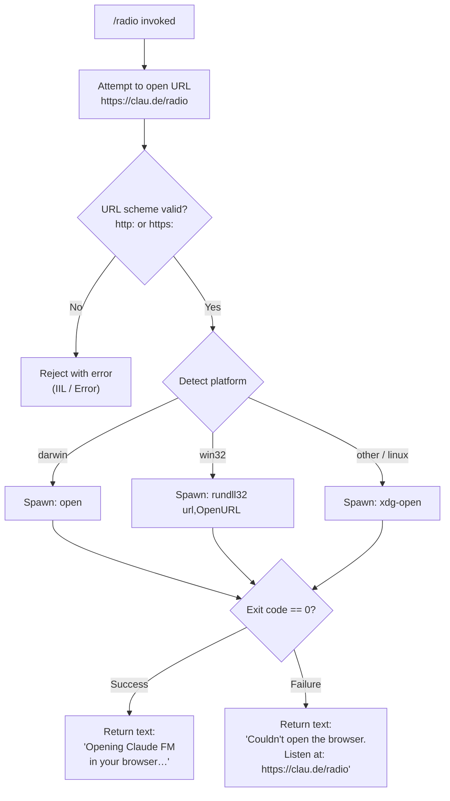

# `/radio`

> Analysis basis: CC v2.1.147 bundle.js (AST extraction + Claude interpretation)
> Minimum version: v2.1.147

---

## Overview

The `/radio` command opens the Claude FM lo-fi radio stream (`https://clau.de/radio`) in the user's default browser. It is a local, non-interactive command that performs a single side effect — launching a URL — and returns a text message confirming success or providing a fallback URL on failure. No agent or LLM inference is involved.

---

## Registration

| Field | Value |
|---|---|
| type | `local` |
| name | `radio` |
| description | `Listen to Claude FM lo-fi radio` |
| supportsNonInteractive | `false` |
| module_id | `zS1` |
| load_inline | `true` |
| loc_byte | `12092993` |
| loc_byte_end | `12093198` |
| loc_line | `9962` |
| arbor_handler.name | `Ig7` |
| arbor_handler.fqn | `claude-2.1.147::Ig7` |
| arbor_handler.kind | `AsyncFunction` |
| arbor_handler.resolution_path | `module_id` |
| arbor_handler.n_hits | `0` |

Analysis basis: CC v2.1.147 bundle.js:+12092993

---

## Input Branching

The command has 3+ distinct branches (URL-open success/failure on macOS, Windows, and Linux/other). A Mermaid flowchart is used.



Analysis basis: CC v2.1.147 bundle.js:+12092751, +6462785, +6462835, +6462857, +6463110, +6463144, +6463160, +6463244, +6463318, +6463325, +12092804, +12092872

---

## Behavioral Spec

### Top-Level Handler (`Ig7` — radioCommandHandler)

The handler is an `AsyncFunction` resolved via `module_id` → `zS1` through the Arbor symbol graph.

```
async function radioCommandHandler(commandInput):
    targetUrl = "https://clau.de/radio"
    result = await openUrlInBrowser(targetUrl)
    if result.success:
        return { type: "text", content: "Opening Claude FM in your browser…" }
    else:
        return { type: "text", content: "Couldn't open the browser. Listen at: https://clau.de/radio" }
```

Analysis basis: CC v2.1.147 bundle.js:+12092754, +12092791, +12092804, +12092872

---

### URL Opener (`MK` — openUrlInBrowser)

Validates the URL scheme, detects the host platform, and spawns the appropriate system command to open the URL.

```
async function openUrlInBrowser(url):
    parsedScheme = extractScheme(url)          // IIL / scheme-validator
    if parsedScheme not in ["http:", "https:"]:
        throw Error("invalid URL scheme")      // IIL → Error, loc +6462785

    platform = getCurrentPlatform()            // WJ
    exitCode = await spawnOpenCommand(url, platform)   // T8

    return { success: exitCode == 0 }
```

Analysis basis: CC v2.1.147 bundle.js:+6463072, +6463085, +6463193, +6462835, +6462857, +6463110

---

### Scheme Validator (`IIL` — validateUrlScheme)

Inspects the protocol portion of the URL string. If the scheme is neither `"http:"` nor `"https:"`, it raises an `Error`.

```
function validateUrlScheme(url):
    scheme = url.split(":")[0] + ":"
    if scheme != "http:" and scheme != "https:":
        throw new Error("unsupported scheme: " + scheme)
    return scheme
```

Analysis basis: CC v2.1.147 bundle.js:+6462785, +6462835, +6462857

---

### Platform-Aware Spawn (`T8` — spawnPlatformOpen)

Selects and spawns the correct OS-native URL-opening utility based on `process.platform`.

```
async function spawnPlatformOpen(url, platform):
    if platform == "darwin":
        cmd = "open"
        args = [url]
    else if platform == "win32":
        cmd = "rundll32"
        args = ["url,OpenURL", url]
    else:
        cmd = "xdg-open"
        args = [url]

    exitCode = await spawnChildProcess(cmd, args)   // T_ → i2H subtree
    return exitCode
```

Analysis basis: CC v2.1.147 bundle.js:+6463144, +6463160, +6463193, +6463244, +6463256, +6463318, +6463325

---

### Child Process Spawner (`T_` → `i2H` — spawnAndWait)

Spawns the system command as a child process and waits for completion, with a memory/resource cap around the subprocess execution. The `i2H` function orchestrates process setup including environment configuration, error callbacks, promise rejection on critical failures, and result collection.

```
async function spawnAndWait(cmd, args, options):
    // i2H wires up: NPA (env/options), hB8, SB8, CB8 (stdio handling),
    // bJA (process start), eq6 (exit-code capture),
    // yB8/OPA/CJA/xJA (signal/error handlers),
    // SJA.bind / RJA.bind (bound callbacks),
    // zJA (cleanup), fPA (result builder),
    // q16 (stdout accumulator), LPA/MPA/UJA (finalization)
    //
    // Constant: max output buffer ~1,000,000 bytes (loc +1044640)
    // Constant: process pool limit 10 (loc +1044118)
    // Constant: retry interval 1 (loc +1040121)

    process = spawnProcess(cmd, args, mergedOptions)
    await processExitPromise(process)
    return collectResult(process)

    on error:
        reject(Promise.reject(...))   // loc +1040020
```

Analysis basis: CC v2.1.147 bundle.js:+1044173, +1044679, +1039854, +1039867, +1039878, +1039887, +1039904, +1040020, +1040035, +1040157, +1040174, +1040183, +1040204, +1040248, +1040287, +1040312, +1040384, +1040405, +1040846, +1040869, +1040886, +1044640, +1044118, +1040121

---

### Background Spare Process Manager (`D` — bgSpareProcessManager)

Called indirectly from `T_` (via `Az` and `N` at loc +1044998 and +1045004), this function manages a pool of background spare processes. It is not specific to `/radio` but is exercised whenever a child process is launched.

```
function bgSpareProcessManager(context):
    // Checks V6 (spare availability), disposes stale spares ($.dispose),
    // reads free memory via R6A.freemem,
    // applies platform guard: "windows" excluded (loc +15117293)
    // Polling interval: 2000 ms (loc +15117423)
    // Emits telemetry: tengu_bg_spare_enable, tengu_bg_spare_spawn
    // Logs at "warn" level on resource pressure (loc +15117597)
    // Recurses with Date.now() timestamps (loc +15117399)

    if platform == "windows":
        skip spare management
    checkMemoryAndSpawnSpare()
    scheduleNextCheck(intervalMs=2000)
```

Analysis basis: CC v2.1.147 bundle.js:+15117127, +15117164, +15117196, +15117210, +15117286, +15117293, +15117331, +15117399, +15117423, +15117488, +15117490, +15117534, +15117541, +15117569, +15117597, +15117613

---

### String Conversion Helper (`JFK` — toStringHelper)

Small utility called from `T_` (loc +1044872) that coerces a value to a `String`. Used to normalize command output or identifiers before further processing.

```
function toStringHelper(value):
    return String(value)
```

Analysis basis: CC v2.1.147 bundle.js:+1044447, +1044872

---

### Log Dispatcher (`N` — logDispatch)

Formats and routes log entries (level `"debug"` observed at loc +201876). Called from `T_` at loc +1045004 and internally reaches channel helpers `Q_6`, `vJK`, `CH`, `f4`, `hI`, `lRH`, `kJK`.

```
function logDispatch(level, message, context):
    // Normalizes level to uppercase (_.toUpperCase, loc +202002)
    // Checks channel inclusion (H.includes, loc +201940)
    // Trims message (H.trim, loc +202025)
    // Routes to appropriate sink (CH / hI / lRH / kJK)
    // Default level seen: "debug" (loc +201876)
```

Analysis basis: CC v2.1.147 bundle.js:+201876, +201900, +201918, +201940, +201958, +202002, +202022, +202025, +202041, +202047, +202061

---

### Error Logger (`RH` — errorLogger)

Handles error-level logging within the subprocess pipeline. Calls `n_` and `UH` for formatting, `j1` for output, `FpK` for error type inspection, pushes to `bbH` error accumulator (loc +966283), and delegates to `Gl.logError` (loc +966323).

```
function errorLogger(err, context):
    formatted = formatError(err)        // n_, UH
    writeOutput(formatted)              // j1
    classifyError(err)                  // FpK
    errorAccumulator.push(formatted)    // bbH.push
    Gl.logError(err)                    // external log sink
```

Analysis basis: CC v2.1.147 bundle.js:+965923, +965936, +966182, +966265, +966283, +966323

---

### Context Store Reader (`b6` → `sb6` — getAsyncLocalContext)

Retrieves the current async-local store context (via `ab6.getStore()`, loc +970814), falling back to `Fc` if the store is absent. Then resolves working context through `w_` → `oV`.

```
function getAsyncLocalContext():
    store = ab6.getStore()
    if store is null:
        return Fc()        // fallback context
    return store

function resolveWorkingContext(store):
    return oV(store)       // w_ → oV, loc +40409
```

Analysis basis: CC v2.1.147 bundle.js:+970814, +970835, +970865, +970884, +40409

---

## State & Side Effects

| Item | Detail |
|---|---|
| Telemetry | `tengu_bg_spare_enable` (loc +15117130), `tengu_bg_spare_spawn` (loc +15117490) |
| Browser launch | Spawns `open` (macOS), `rundll32 url,OpenURL` (Windows), or `xdg-open` (Linux/other) as a child process |
| URL opened | `https://clau.de/radio` (hardcoded, loc +12092754) |
| appState changes | None observed in depth-2 traversal |
| Hook registration | None observed in depth-2 traversal |
| Sound | None observed in depth-2 traversal |
| Background spare pool | `bgSpareProcessManager` (`D`) may spawn/recycle background processes; skipped on Windows (loc +15117293) |
| Error accumulation | Failed subprocess errors pushed to internal `bbH` accumulator (loc +966283) and forwarded to `Gl.logError` (loc +966323) |
| Logging | Debug-level log dispatched via `N`/`logDispatch`; error-level via `RH`/`errorLogger`; "warn" level on memory pressure (loc +15117597) |
| Output buffer cap | ~1,000,000 bytes maximum for subprocess stdout/stderr (loc +1044640) |
| Process pool limit | 10 concurrent child processes (loc +1044118) |
| Non-interactive support | `false` — command must be run in an interactive session |

---

## Version History

| Version | Change |
|---|---|
| v2.1.147 | Initial analysis |

---

## Common Mistakes

1. **Running in non-interactive mode**: `supportsNonInteractive` is `false`. Invoking `/radio` in a script or pipe context will not function as expected and may silently fail or be rejected before the handler is reached.
2. **Expecting LLM output**: `/radio` is a pure local side-effect command. It does not invoke the Claude model; no AI response is generated.
3. **Blocked browser on headless systems**: On servers or CI environments without a display or default browser configured, `xdg-open` (Linux) will fail. The command will return the fallback message with the raw URL rather than opening anything.
4. **Windows path assumptions**: On `win32`, the command relies on `rundll32` with `url,OpenURL`. Custom or locked-down Windows environments that restrict `rundll32` will cause the open attempt to fail.
5. **Assuming the URL is configurable**: The target URL (`https://clau.de/radio`) is hardcoded in the bundle (loc +12092754). There is no parameter or configuration to redirect it.

---

## Appendix — Identifier Mapping

> For bundle debugging only. Identifiers change across versions.

| Identifier | Role |
|---|---|
| `Ig7` | `radioCommandHandler` — top-level async handler for `/radio`; resolved via Arbor `module_id` path |
| `MK` | `openUrlInBrowser` — validates URL scheme and dispatches to platform-specific open logic |
| `IIL` | `validateUrlScheme` — checks `http:` / `https:` scheme validity; throws `Error` on mismatch |
| `WJ` | `getPlatform` — reads current OS platform identifier |
| `T8` | `spawnPlatformOpen` — selects and spawns the OS-native URL opener (`open`, `rundll32`, `xdg-open`) |
| `T_` | `spawnAndWaitOrchestrator` — orchestrates child process lifecycle, calls `i2H` and supporting utilities |
| `i2H` | `spawnProcessCore` — low-level child-process setup: env, stdio, exit handling, promise resolution |
| `D` | `bgSpareProcessManager` — manages background spare process pool; emits telemetry; skips Windows |
| `JFK` | `toStringHelper` — coerces a value to `String` |
| `Az` | `unknownUtility_Az` — called from `T_`; role not fully resolved at depth-2 |
| `N` | `logDispatch` — routes log entries by level (debug, error, etc.) to appropriate sinks |
| `q8` | `unknownUtility_q8` — called from `T_`; role not fully resolved at depth-2 |
| `RH` | `errorLogger` — formats and records error-level messages; pushes to error accumulator |
| `b6` | `getAsyncLocalContext` — retrieves async-local storage store for current execution context |
| `sb6` | `asyncLocalStoreReader` — calls `ab6.getStore()` and falls back to `Fc` if absent |
| `w_` | `resolveWorkingContext` — resolves working directory or execution context via `oV` |

---

Note: index built via Arbor fallback; some signals (telemetry, literals) may be missing — see arbor-fallback.js.