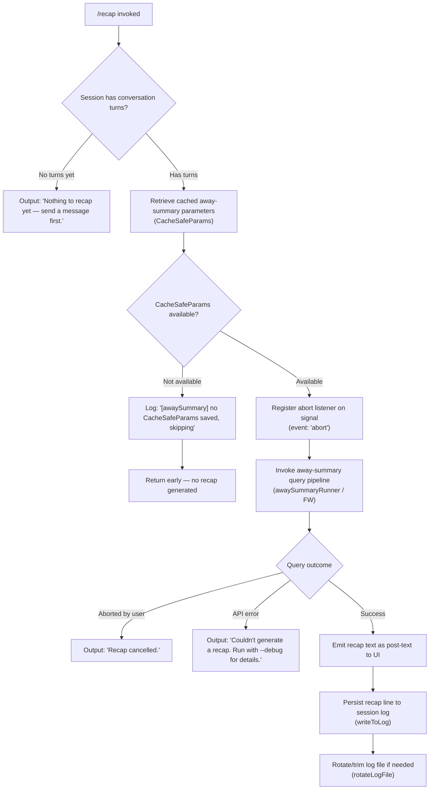

# `/recap`

> Analysis basis: CC v2.1.147 bundle.js (AST extraction + Claude interpretation)
> Minimum version: v2.1.147

---

## Overview

The `/recap` command triggers an immediate, on-demand one-line summary of the current Claude Code session. It invokes the same "away summary" pipeline that normally runs automatically when the user returns from being idle, but forces it to execute right now. The result is displayed as a single compact line of text describing what has happened in the session so far.

---

## Registration

| Field | Value |
|---|---|
| type | `local` |
| name | `recap` |
| description | `Generate a one-line session recap now` |
| loc_byte | `12411258` |
| loc_byte_end | `12411474` |
| loc_line | `10504` |
| supportsNonInteractive | `false` |
| thinClientDispatch | `post-text` |
| load_inline | `true` |
| load_ident | `Hi7` |
| arbor_handler.name | `Hi7` |
| arbor_handler.fqn | `claude-2.1.147::Hi7` |
| arbor_handler.kind | `AsyncFunction` |
| arbor_handler.resolution_path | `load_ident` |
| arbor_handler.n_hits | `0` |

Analysis basis: CC v2.1.147 bundle.js:+12411258

The handler was inlined via `load:()=>Promise.resolve({call: Hi7})`. The Arbor symbol graph resolved the handler as `Hi7` (an `AsyncFunction`) via the `load_ident` resolution path. The `callGraph` also begins at `Hi7`, confirming this is the command's main entry point.

---

## Input Branching

The command has 4+ distinct outcome branches (no conversation turns yet, recap cancelled by abort signal, recap failed due to API error, and recap succeeded), warranting a Mermaid flowchart.



Analysis basis: CC v2.1.147 bundle.js:+12411008, +12411100, +12411158, +5306140, +5306254

---

## Behavioral Spec

### Handler Entry — `recapCommandHandler` (Hi7)

```
async function recapCommandHandler(context):
    // Check whether any conversation turns exist
    if conversationTurns is empty:
        display("Nothing to recap yet — send a message first.")
        return

    // Attempt to load previously cached away-summary parameters
    params = getCacheSafeParams(context)
    if params is null:
        log.debug("[awaySummary] no CacheSafeParams saved, skipping")
        return

    // Register abort-signal listener so the user can cancel mid-flight
    signal.addEventListener("abort", onAbortHandler)

    // Run the away-summary pipeline (shared with idle-return recap)
    result = await awaySummaryRunner(params, context)

    // Handle each possible outcome
    match result.status:
        case "aborted":
            display("Recap cancelled.")
        case "api-error":
            display("Couldn't generate a recap. Run with --debug for details.")
        case "ok":
            displayPostText(result.text)
            writeToSessionLog(result.text)
            rotateLogFileIfNeeded()
```

Analysis basis: CC v2.1.147 bundle.js:+12410866 (Hi7→w18 call edge), +12411008, +12411100, +12411158, +5306140, +5306198, +5306254, +5306658, +5306747, +5306808

---

### Away-Summary Pipeline — `awaySummaryRunner` (w18)

The core pipeline shared between the automatic idle-return summary and this manual `/recap` invocation.

```
async function awaySummaryRunner(params, context):
    // Validate that cached parameters are present
    if params is null:
        log.debug("[awaySummary] no CacheSafeParams saved, skipping")
        return { status: "no-turn" }

    // Bind abort listener
    abortController.signal.addEventListener("abort", () => abortController.abort())

    // Invoke the main query entry point with "avoid_prompts" mode
    // to suppress interactive tool-use prompts during a background summary
    queryResult = await mainQueryEntry(params, { mode: "avoid_prompts" })

    // Collect the flat-mapped message text from the result
    textLines = flatMapResultMessages(queryResult)

    return textLines
```

Analysis basis: CC v2.1.147 bundle.js:+5306119 (w18→NHH), +5306138 (w18→N), +5306235 (w18→addEventListener), +5306266 (w18→abort), +5306313 (w18→FW)

---

### Tool-Use Denial During Recap — `toolDenyPolicy` (vJK)

Because `/recap` runs in `avoid_prompts` mode, tool calls are rejected rather than interactively confirmed.

```
function toolDenyPolicy(toolRequest, context):
    // Deny all tool calls and return a static refusal message
    // so the summary generation cannot trigger side-effects
    if toolRequest is present:
        return { decision: "deny", reason: "Away summary cannot use tools" }

    // Otherwise fall through to normal approval logic
    return normalApprovalChain(toolRequest, context)
```

Analysis basis: CC v2.1.147 bundle.js:+5306431 (`"deny"`), +5306446 (`"Away summary cannot use tools"`), +5306499 (`"other"`), +5306514 (`"away_summary"`)

---

### Session Log Writing — `writeToLog` (lRH / b1A)

After a successful recap, the one-liner is appended to the persistent session log file.

```
function writeToLog(text, logHandle):
    logHandle.write(text)                   // append recap line
    rotateLogIfNeeded(logHandle)            // check size / rotation policy
```

Analysis basis: CC v2.1.147 bundle.js:+189952 (lRH→b1A), +189888 (b1A→H.write)

---

### Log File Rotation — `rotateLogFile` (kJK)

Manages the on-disk log file lifecycle: creates directories as needed, appends content, renames old files, and enforces a byte-length cap.

```
async function rotateLogFile(logDir, content):
    dirName = path.dirname(logDir)

    // Ensure directory exists
    await fs.mkdir(dirName, { recursive: true })

    // Determine current log path
    currentPath = buildCurrentLogPath(logDir)

    // Check existing file stats; if file ends with ".txt" strip suffix
    stats = await fs.stat(currentPath)
    if currentPath.endsWith(".txt"):
        currentPath = currentPath.slice(0, -4)       // strip last 4 chars

    // Append new content
    await fs.appendFile(currentPath, content)

    // Enforce size cap via rename + unlink rotation
    byteSize = Buffer.byteLength(content)
    if byteSize exceeds threshold:
        await fs.rename(currentPath, rotatedPath)
        await fs.unlink(oldRotatedPath)             // remove oldest shard

    // Schedule next write via deferred promise chain
    scheduleNextWrite()
```

Analysis basis: CC v2.1.147 bundle.js:+201388 (kJK→XRH), +201413 (kJK→XAH), +201421 (kJK→path.dirname), +200742 (t1A→fs.stat), +200835 (t1A→endsWith), +200846 (`".txt"`), +200857 (slice, −4 chars), +200898 (t1A→fs.rename), +200938 (t1A→fs.unlink), +201142 (IJK→fs.mkdir), +201201 (IJK→fs.appendFile), +201596 (kJK→Buffer.byteLength)

---

### Output Dispatch — `flatMapResultMessages` (Y5q)

After the query completes, the output messages are flattened into a single text stream for display.

```
function flatMapResultMessages(messages):
    return messages.flatMap(msg => extractTextParts(msg))
```

Analysis basis: CC v2.1.147 bundle.js:+5306974 (Y5q→H.flatMap), +5306764 (w18→Y5q)

---

## State & Side Effects

| Item | Detail |
|---|---|
| Telemetry (query engine, reachable via callGraph) | `tengu_auto_compact_rapid_refill_breaker`, `tengu_auto_compact_succeeded`, `tengu_ptl_surfaced_to_user`, `tengu_orphaned_messages_tombstoned`, `tengu_model_fallback_triggered`, `tengu_query_error`, `tengu_model_response_keyword_detected`, `tengu_malformed_tool_use_response`, `tengu_stop_hook_block_count`, `tengu_streaming_tool_execution_used`, `tengu_streaming_tool_execution_not_used`, `tengu_loop_dynamic_wakeup_ends_turn`, `tengu_post_autocompact_turn`, `tengu_query_before_attachments`, `tengu_query_after_attachments`, `tengu_mcp_tools_refreshed_mid_turn`, `tengu_feature_ok`, `tengu_feature_bad`, `tengu_bg_spare_enable`, `tengu_bg_low_mem_mb`, `tengu_bg_spare_spawn`, `tengu_forked_agent_default_turns_exceeded`, `tengu_fork_agent_query`, `tengu_bg_dispatch_sigkill_escalate`, `tengu_bg_dispatch_low_mem`, `tengu_bg_spare_claim`, `tengu_bg_spare_claim_fail`, `tengu_daemon_yield` |
| Tool use during recap | All tool calls are denied with the message `"Away summary cannot use tools"` (bundle.js:+5306446) |
| appState changes | `getAppState` / `setAppState` calls reachable via `tY8`; the away-summary pipeline reads and may update app state (bundle.js:+10453758, +10454538) |
| Session log | Recap text is appended to the session log file via `fs.appendFile`; log rotation (`rename`/`unlink`) may occur (bundle.js:+201201, +200898, +200938) |
| Abort signal | An `"abort"` event listener is registered on the AbortController signal for the duration of the recap query (bundle.js:+5306235, +5306254) |
| Non-interactive support | `supportsNonInteractive: false` — command is unavailable in non-interactive (pipe/CI) mode |
| Dispatch mode | `thinClientDispatch: "post-text"` — result is posted as plain text back to the UI layer |
| Sound | <!-- TODO: not found in depth-2 traversal; needs --depth 4 --> |

---

## Version History

| Version | Change |
|---|---|
| v2.1.147 | Initial analysis |

---

## Common Mistakes

1. **Running `/recap` before any messages are sent** — The command will immediately return `"Nothing to recap yet — send a message first."` and produce no output. At least one conversation turn must exist for a recap to be generated (bundle.js:+12411008).

2. **Expecting tool-use side effects in the recap** — The recap pipeline runs with `avoid_prompts` mode and explicitly denies all tool calls (`"Away summary cannot use tools"`). The summary is generated purely from conversation context already in memory; no filesystem or shell tools will execute (bundle.js:+5306446).

3. **Calling `/recap` in non-interactive mode** — `supportsNonInteractive: false` means invoking this command from a script or piped session is not supported and will be rejected by the CLI before the handler runs (bundle.js:+12411258).

4. **Expecting a multi-line detailed summary** — The command description explicitly says "one-line session recap". The output is intentionally terse; it is the same format produced by the automatic idle-return away-summary, not a full conversation dump.

5. **Ignoring the `--debug` flag on failure** — When the API call fails, the error details are suppressed in normal output. The user-facing message `"Couldn't generate a recap. Run with --debug for details."` indicates that verbose error information is only visible under `--debug` (bundle.js:+12411158).

---

## Appendix — Identifier Mapping

> For bundle debugging only. Identifiers change across versions.

| Identifier | Role |
|---|---|
| `Hi7` | `recapCommandHandler` — async handler entry point for `/recap`; resolved via `load_ident` |
| `w18` | `awaySummaryRunner` — shared away-summary pipeline (idle-return and manual recap) |
| `NHH` | `getCacheSafeParams` — retrieves cached query parameters needed for recap |
| `N` | `mainQueryEntry` — primary query dispatch function |
| `vJK` | `toolApprovalPolicy` — tool-call approval/denial logic (denies during recap) |
| `j9A` | `approvalChainHelper` — lower-level approval chain utility |
| `NDK` | `approvalChainNodeA` — approval chain node |
| `IDK` | `approvalChainNodeB` — approval chain node |
| `CH` | `jsonStringifyHelper` — JSON serialisation utility |
| `f4` | `buildLogFilePath` — constructs the session log file path |
| `l1A` | `mapLogPathSegments` — maps path segments for log construction |
| `lRH` | `writeToLog` — writes recap text to the session log |
| `b1A` | `logFileWriter` — low-level file write helper |
| `kJK` | `rotateLogFile` — manages log file rotation (mkdir, appendFile, rename, unlink) |
| `XRH` | `scheduleNextWrite` — deferred/batched write scheduler (uses clearTimeout/setTimeout/setImmediate) |
| `XAH` | `buildLogEntry` — assembles a structured log entry for writing |
| `F6` | `logFilePathResolver` — resolves the active log file path |
| `C_6` | `logErrorCodeHandler` — handles `EISDIR` and similar filesystem errors |
| `e1A` | `buildLogEntryPath` — constructs individual log entry file path |
| `t1A` | `rotateLogShard` — performs stat/rename/unlink rotation of a single log shard |
| `IJK` | `appendAndRotate` — appends content then triggers rotation if needed |
| `r9` | `registerExitHandler` — registers process exit / signal handler |
| `FW` | `runQueryWithAgent` — runs a full agent query turn (used by away-summary) |
| `tY8` | `agentQueryCore` — core agent query logic (app state, model call, UUID generation) |
| `xk` | `initAgentStream` — initialises the streaming agent request |
| `_KH` | `agentStateLoader` — loads/dumps agent state for context |
| `COH` | `agentContextBuilder` — builds agent context object |
| `K6q` | `agentParamsResolver` — resolves final query parameters |
| `M` | `shutdownConnections` — closes open connections (A.close, q.close) |
| `lJ8` | `agentSessionSetup` — sets up agent session data |
| `ck` | `generateSessionId` — generates a random hex session identifier (8 bytes → hex) |
| `G` | `agentGlobals` — module-level globals array (F06, YN8 entries) |
| `H8H` | `buildApiRequest` — assembles the API request object |
| `v4` | `apiRequestPrep` — prepares API request (calls exit handler registration) |
| `YkH` | `filterMessageHistory` — filters message history for the request (ant filter, VT8, CT8, ya7) |
| `Cx` | `agentTurnDispatcher` — dispatches a single agent turn (calls yG7, Vj8, bH, mH) |
| `yG7` | `agentTurnLoop` — main agentic turn loop (streaming, tool use, compaction, hooks) |
| `Vj8` | `subagentExitHandler` — handles subagent exit/ready state transitions |
| `bH` | `turnMetricsRecorder` — records per-turn metrics |
| `mH` | `turnStateUpdater` — updates turn-level state |
| `HG6` | `toolUseSummaryChecker` — checks tool-use summary set membership |
| `ijH` | `interruptibleToolChecker` — checks whether an in-progress tool is interruptible |
| `yP8` | `postTurnSummaryWriter` — writes post-turn summary |
| `PM1` | `notificationDispatcher` — dispatches UI notification messages |
| `D` | `daemonSessionManager` — manages background daemon sessions |
| `V6` | `bgSessionCreator` — creates a new background session |
| `$` | `disposableResource` — disposable resource wrapper |
| `sG8` | `memoryPressureHandler` — handles low-memory background session events |
| `V6A` | `bgSpawnWorker` — spawns background PTY worker process |
| `c` | `coreUtility` — shared low-level utility (used in many places) |
| `Az` | `daemonCleanup` — daemon cleanup helper |
| `q8` | `configAccessor` — reads configuration values |
| `RH` | `errorEventEmitter` — emits error events with logging |
| `BG7` | `forkedAgentRunner` — runs a forked sub-agent query |
| `G8` | `bgSessionDispatcher` — dispatches work to a background session (randomUUID, kill) |
| `J` | `bgSessionPool` — manages the pool of background sessions |
| `w` | `bgSessionWorker` — individual background session worker lifecycle |
| `j` | `bgSessionKiller` — kills background session workers |
| `y` | `bgSessionTransient` — transient background session handler |
| `Y5q` | `flatMapResultMessages` — flattens query result messages into text parts |
| `_` | `stringToUpperCase` — uppercase conversion helper (also used as generic placeholder) |
| `A` | `pathNormaliser` — lowercase/slice path normalisation utility |
| `q` | `unlinkSyncWrapper` — synchronous file unlink wrapper |
| `Av` | `approvalValidator` — validates tool approval decisions |
| `VJK` | `approvalChainMiddleware` — middleware in tool approval chain |
| `Qb_` | `queryBatchHelper` — batches query sub-operations |
| `hG7` | `hintClearer` — clears inline hints after turn |
| `ww_` | `rapidRefillBreaker` — circuit-breaker for rapid auto-compact refill |

---

Note: index built via Arbor fallback; some signals (telemetry, literals) may be missing — see arbor-fallback.js.