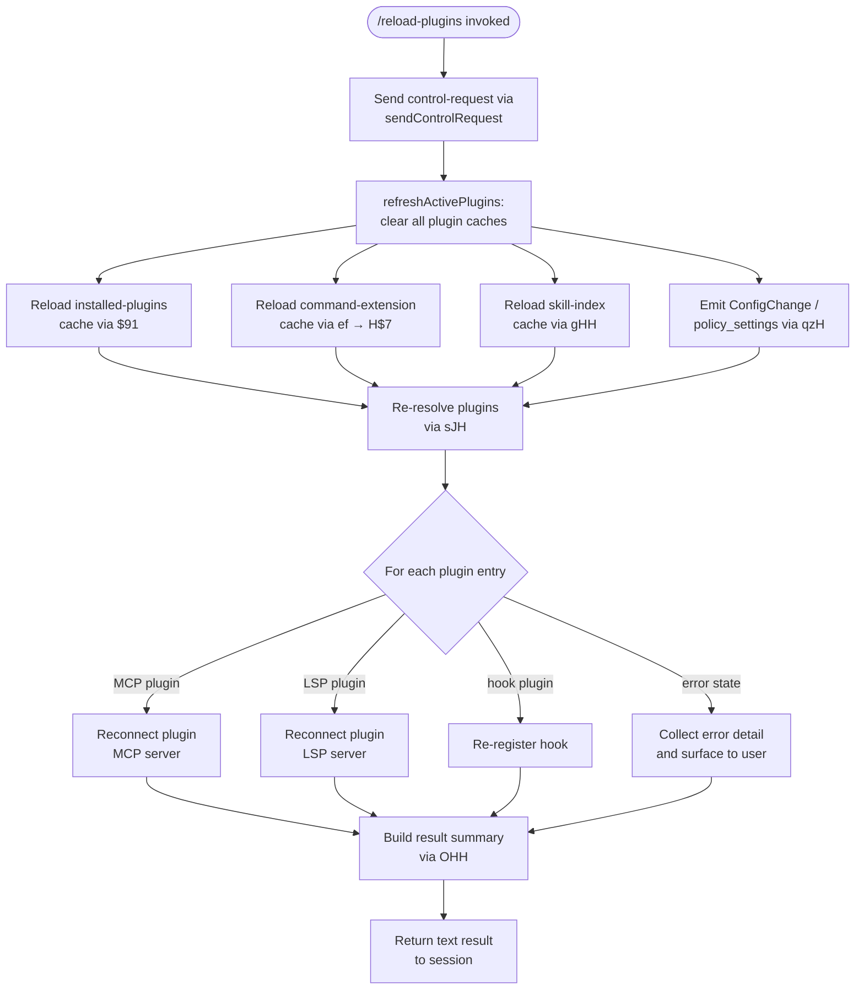

# `/reload-plugins`

> Analysis basis: CC v2.1.147 bundle.js (AST extraction + Claude interpretation)
> Minimum version: v2.1.147

---

## Overview

`/reload-plugins` is a session-management command that activates pending plugin changes without restarting the Claude Code process. It clears all plugin-related caches, re-resolves installed plugins, and re-connects any plugin MCP servers and LSP servers — bringing the live session into sync with any plugin edits or installations that occurred since the session began.

---

## Registration

| Field | Value |
|---|---|
| type | `local` |
| name | `reload-plugins` |
| description | `Activate pending plugin changes in the current session` |
| supportsNonInteractive | `false` |
| thinClientDispatch | `"control-request"` |
| module_id | `Hh1` |
| load_inline | `true` |
| loc_byte | `12043013` |
| loc_byte_end | `12043232` |
| loc_line | `9936` |
| arbor_handler.name | `RF7` |
| arbor_handler.kind | `AsyncFunction` |
| arbor_handler.resolution_path | `module_id` |
| arbor_handler.fqn | `claude-2.1.147::RF7` |
| arbor_handler.n_hits | `0` |

Analysis basis: CC v2.1.147 bundle.js:+12043013

---

## Input Branching

The command's handler (`RF7`) fans out across five major phases, each with its own branching logic, giving more than three distinct paths. A Mermaid flowchart is used.



---

## Behavioral Spec

### 1. Entry — Control Request

The handler (`RF7`) begins by dispatching a thin-client control-request through `sendControlRequest` (call edge `RF7 → A.sendControlRequest`, Analysis basis: CC v2.1.147 bundle.js:+12042072). The string literal `"ccr"` is used as the request-type discriminator (Analysis basis: CC v2.1.147 bundle.js:+12042053), and the event name `"reload_plugins"` is attached to the payload (Analysis basis: CC v2.1.147 bundle.js:+12042102).

```
async function reloadPluginsHandler(context):
    sendControlRequest("ccr", { event: "reload_plugins" })
    await refreshPluginCaches(context)
    result = await resolveAndReconnect(context)
    return buildTextResult(result)
```

### 2. Cache Clearing — `refreshActivePlugins` (sJH)

`refreshActivePlugins` (identifier `sJH`) is the first substantive sub-routine reached from `RF7` (Analysis basis: CC v2.1.147 bundle.js:+12042443). Its opening step logs the diagnostic string `"refreshActivePlugins: clearing all plugin caches"` (Analysis basis: CC v2.1.147 bundle.js:+12039920) and then fans out to three parallel cache-clear operations:

1. **Installed-plugins cache** (`$91`) — calls `clearInstalledPluginsCache`, which logs `"Cleared installed plugins cache"` (Analysis basis: CC v2.1.147 bundle.js:+9526577).
2. **Command-extension / skill-index cache** (`ef` → `H$7`) — invokes cache-clear helpers `Vw8`, `mq8`, `jz8`, `qy_` across plugin-root paths (Analysis basis: CC v2.1.147 bundle.js:+9493638–9493656). The skill-index sub-path (`gHH`) calls `H.clearSkillIndexCache` and resolves via `Promise.resolve` (Analysis basis: CC v2.1.147 bundle.js:+12597637).
3. **Pending-writes cache** (`_kH`) — calls `Pw8.clear` to flush buffered writes (Analysis basis: CC v2.1.147 bundle.js:+9470523).

All three clears are wrapped in `Promise.all` (Analysis basis: CC v2.1.147 bundle.js:+12040027).

```
async function refreshPluginCaches():
    log("refreshActivePlugins: clearing all plugin caches")
    await Promise.all([
        clearInstalledPluginsCache(),      // $91
        clearCommandExtensionCaches(),     // ef → H$7, _kH
        clearSkillIndexCache()             // gHH
    ])
```

### 3. Plugin Re-resolution — `resolveAndReconnect` (sJH continued)

After the cache flush, `sJH` iterates over the plugin entries produced by `ei` (the plugin-loader) and `VNH` (the LSP-config loader). For each entry it builds a normalised plugin descriptor, then classifies the entry as MCP, LSP, hook, or error.

```
async function resolveAndReconnect(context):
    plugins = await loadPluginEntries()        // ei
    lspConfigs = await loadLSPConfigs()        // VNH
    results = []

    for entry in [...plugins, ...lspConfigs]:
        kind = classify(entry)                 // "plugin", "skill", "agent", "hook", "lsp"
        if kind == "plugin" or kind == "agent":
            status = await reconnectMCPServer(entry)   // hF7 / SF7
        elif kind == "hook":
            status = reRegisterHook(entry)             // nLH
        elif kind == "lsp":
            status = await reconnectLSPServer(entry)   // VNH path
        else:
            status = { error: entry.error }

        results.push(buildEntry(entry, status))

    configChangeEmitter.emit("ConfigChange", "policy_settings")   // C08.emit
    return results
```

Classification uses the literal discriminators `"plugin"`, `"skill"`, `"agent"`, `"plugin MCP server"`, `"hook"`, and `"plugin LSP server"` (Analysis basis: CC v2.1.147 bundle.js:+12042167, +12042198, +12042226, +12042258, +12042692, +12042751).

### 4. MCP Server Reconnection (hF7 / SF7)

`hF7` handles active-plugin filtering (Analysis basis: CC v2.1.147 bundle.js:+12040577): it filters the plugin list, maps to connection descriptors, and calls `ey1` to attempt the socket reconnection. `SF7` performs an analogous pass for skill-type entries (Analysis basis: CC v2.1.147 bundle.js:+12040610). Both share a `q.has` membership check before attempting reconnect (Analysis basis: CC v2.1.147 bundle.js:+12041517, +12041791).

```
function reconnectMCPPlugins(activeSet, entries):
    filtered = entries.filter(e => activeSet.has(e.id))    // hF7
    return filtered.map(e => attemptMCPConnect(e))         // ey1

function reconnectSkillPlugins(activeSet, entries):
    filtered = entries.filter(e => activeSet.has(e.id))    // SF7
    return filtered.map(e => attemptMCPConnect(e))
```

### 5. Hook Re-registration (nLH)

`nLH` (Analysis basis: CC v2.1.147 bundle.js:+12042475) reads the existing hook configuration via `RQ` → `t5` (which loads `known_marketplaces.json`, Analysis basis: CC v2.1.147 bundle.js:+9498144), validates the plugin graph through `gY6`, and calls `r9` → `D9A.register` to re-register each hook entry (Analysis basis: CC v2.1.147 bundle.js:+57468). Known error labels surfaced during re-registration: `"dependency-unsatisfied"` (Analysis basis: CC v2.1.147 bundle.js:+11220054), `"not-found"` (Analysis basis: CC v2.1.147 bundle.js:+11220091), `"dependency-resolution"` (Analysis basis: CC v2.1.147 bundle.js:+11221066), and `"generic-error"` (Analysis basis: CC v2.1.147 bundle.js:+12041570).

```
async function reRegisterHooks(pluginGraph):
    marketplaces = await loadKnownMarketplaces()   // RQ → t5
    validated    = validatePluginGraph(pluginGraph) // gY6
    for hook in validated.hooks:
        hookRegistry.register(hook)                 // r9 → D9A.register
    return collectErrors(validated)
```

### 6. Result Formatting (OHH)

`RF7` delegates final output assembly to `OHH` (Analysis basis: CC v2.1.147 bundle.js:+12042518). `OHH` maps the result list to human-readable lines using `BA` for scope formatting, joins them with the separator `" · "` (Analysis basis: CC v2.1.147 bundle.js:+12042285), and slices the final list to a maximum of five display items (`value: 5` at Analysis basis: CC v2.1.147 bundle.js:+4914392). An error entry uses the tag `"error"` (Analysis basis: CC v2.1.147 bundle.js:+12042340); a success entry uses `"text"` (Analysis basis: CC v2.1.147 bundle.js:+12042415).

```
function buildResultText(entries):
    lines = entries
        .slice(0, 5)
        .map(e => formatEntry(e))          // BA for scope
        .join(" · ")
    return { type: "text", content: lines }
```

### 7. LSP Config Loading (VNH)

`VNH` reads `.lsp.json` files from the plugin directory (Analysis basis: CC v2.1.147 bundle.js:+7900088), parses them with `B6` (JSON parser), validates schema with `k.record` / `k.string` (Analysis basis: CC v2.1.147 bundle.js:+7900151, +7900160), and emits `"lsp-config-invalid"` on schema failure (Analysis basis: CC v2.1.147 bundle.js:+7900358). Relative paths within the plugin directory are enforced; the error `"Invalid path: must be relative and within plugin directory"` is raised for out-of-bounds paths (Analysis basis: CC v2.1.147 bundle.js:+7901288).

```
async function loadLSPConfigs(pluginDir):
    raw = await readFile(join(pluginDir, ".lsp.json"))
    parsed = JSON.parse(raw)
    if not schemaValid(parsed):
        emitError("lsp-config-invalid")
        return []
    return validated(parsed)
```

---

## State & Side Effects

| Item | Detail |
|---|---|
| Telemetry | No `tengu_*` events are emitted directly by the `/reload-plugins` call path at depth ≤ 2. Daemon-level events (`tengu_daemon_yield`, `tengu_daemon_control`) and background-worker events may fire as side effects of the control-request dispatch. |
| Control-request dispatch | Sends a `"ccr"` / `"reload_plugins"` request via `thinClientDispatch: "control-request"` before any cache work begins (bundle.js:+12042053, +12042102). |
| Cache invalidation | Installed-plugins cache, command-extension cache, skill-index cache, and buffered-writes cache are all cleared synchronously before re-resolution (bundle.js:+12039920). |
| Config-change event | `C08.emit("ConfigChange", "policy_settings")` is fired after re-resolution, propagating the updated plugin graph to subscribers (bundle.js:+12041007). |
| Hook registry | Each plugin hook is re-registered via `D9A.register` (bundle.js:+57468). |
| LSP servers | `.lsp.json` entries are re-parsed and reconnected; invalid configs emit `"lsp-config-invalid"`. |
| MCP servers | Active plugin MCP servers are reconnected through the `ey1` path. |
| File I/O | Reads `.lsp.json`, `known_marketplaces.json`, `marketplace.json`, `manifest.json`, settings JSON files as part of the re-resolution pipeline. |
| Non-interactive | `supportsNonInteractive: false` — the command will not execute in headless / pipe mode. |

---

## Version History

| Version | Change |
|---|---|
| v2.1.147 | Initial analysis |

---

## Common Mistakes

1. **Running in non-interactive mode**: The command sets `supportsNonInteractive: false`. Invoking it from a script or pipe will result in a no-op or error rather than a plugin reload.
2. **Expecting immediate MCP reconnection**: The control-request is dispatched first; the actual cache-clear and reconnection are asynchronous. If a plugin MCP server is still starting up, a second invocation of `/reload-plugins` may be needed.
3. **Invalid `.lsp.json` paths**: LSP config entries that reference paths outside the plugin directory (e.g., using `..`) are rejected with a hard error and the entire LSP config for that plugin is skipped.
4. **yarn / pnpm lockfiles in plugin packages**: The re-resolution pipeline explicitly skips plugin packages that use yarn or pnpm lockfiles, emitting a warning instead of installing (Analysis basis: CC v2.1.147 bundle.js:+4921205).
5. **Managed-scope plugins**: Plugins installed to a managed scope cannot be modified; attempting to reload changes in a managed scope raises `"Cannot install plugins to managed scope"` (Analysis basis: CC v2.1.147 bundle.js:+4877323).

---

## Appendix — Identifier Mapping

> For bundle debugging only. Identifiers change across versions.

| Identifier | Role |
|---|---|
| `RF7` | Main handler for `/reload-plugins` (AsyncFunction, arbor-resolved) |
| `t3` | Helper called early in RF7; connection/transport utility |
| `NXH` | Sub-utility reached from t3 |
| `zc` | Intermediate step in RF7; delegates to v8 |
| `v8` | Low-level utility called from zc and O |
| `sJH` | `refreshActivePlugins` — cache-clear + re-resolution orchestrator |
| `N` | Logger / notification emitter (used throughout) |
| `vJK` | Plugin-root enumeration helper |
| `j9A` | Sub-helper of vJK; calls NDK / IDK |
| `CH` | JSON serialisation wrapper (`JSON.stringify`) |
| `f4` | String/path manipulation helper |
| `l1A` | Map helper within f4 |
| `lRH` | Write-buffer helper using b1A |
| `b1A` | Low-level write wrapper (`H.write`) |
| `kJK` | Logging / append-file subsystem (mkdir, appendFile, rename, unlink) |
| `XRH` | Batched I/O flush helper (clearTimeout, setTimeout, setImmediate) |
| `XAH` | Append-helper variant using o1A, o8, h6 |
| `F6` | Path / filesystem base utility |
| `C_6` | Calls q8; likely error-code helper |
| `e1A` | Path-join helper (gXH.join) |
| `t1A` | File rotation helper (stat, endsWith, rename, unlink) |
| `IJK` | Append-file writer with rotation logic |
| `r9` | Hook-registration dispatcher → D9A.register |
| `$91` | Installed-plugins cache clear (logs "Cleared installed plugins cache") |
| `ef` | Command-extension cache reload orchestrator |
| `H$7` | Cache-clear fan-out (Vw8, mq8, jz8, qy_, RH, etc.) |
| `AE` | Sub-helper of H$7; calls N, uI6, VY, rAA |
| `Vw8` | Individual cache-clear slot A |
| `mq8` | Individual cache-clear slot B |
| `jz8` | Individual cache-clear slot C |
| `qy_` | Plugin-root filter/map helper (uses "pluginRoot" key) |
| `RH` | Error collector; pushes to bbH and logs via Gl.logError |
| `Gq8` | Cache-clear slot D |
| `mC_` | Cache-clear slot E |
| `iA1` | Cache-clear slot F |
| `qo` | Skill-index reload coordinator |
| `gHH` | Skill-index clear (calls H.clearSkillIndexCache) |
| `gA1` | Sub-helper of qo |
| `tw8` | Sub-helper of qo / W |
| `qP_` | Sub-helper of ef; calls mq8 |
| `YP_` | Sub-helper of ef |
| `_kH` | Pending-writes cache clear (Pw8.clear) |
| `FPq` | Sub-helper of sJH |
| `Quq` | Sub-helper of sJH |
| `w_` | Async utility wrapper (calls oV) |
| `oV` | Low-level async primitive |
| `K` | MCP connection map / collection (L.map, M.padEnd) |
| `ei` | Plugin-loader / entry iterator |
| `N2_` | Plugin file reader (readFile, JSON.parse via B6) |
| `J8` | Error-code helper (calls q8) |
| `B6` | JSON.parse wrapper |
| `SQ` | File-extension checker (H.endsWith) |
| `_jq` | Plugin-status processor (status, http, download, network) |
| `xY6` | MCPB archive extractor / plugin-loader core |
| `ZH` | String coercer wrapper |
| `VNH` | LSP config loader (reads .lsp.json) |
| `$tL` | LSP path validator and config merger |
| `ftL` | Relative-path resolver for LSP entries |
| `$` | Session/connection container (calls ZC1) |
| `ZC1` | Daemon-status writer (daemon.status.json) |
| `ll` | Sub-helper of ZC1 (calls p9H) |
| `M1` | Async-storage getter (m_L.getStore) |
| `aE6` | Path builder for daemon.status.json (EC1.join, o8) |
| `O` | Plugin collection B (calls v8) |
| `hF7` | Active-plugin MCP reconnect filter/map |
| `ey1` | MCP socket reconnect helper |
| `SF7` | Skill-plugin MCP reconnect filter/map |
| `nLH` | Hook re-registration orchestrator |
| `RQ` | Marketplace/settings loader coordinator (calls t5) |
| `t5` | known_marketplaces.json reader |
| `yw8` | Path builder for known_marketplaces.json (SL.join) |
| `pZH` | Plugin entry map iterator (Object.entries, m8, Array.isArray) |
| `m8` | Plugin descriptor constructor (calls Cu6, WF) |
| `Cu6` | Descriptor helper A (FAA, Pg8, gAA) |
| `WF` | Plugin descriptor builder (w_, k86, tk8, Z86, etc.) |
| `bZ` | Error constructor wrapper |
| `BA` | Scope formatter (H.includes, H.split) |
| `TX` | Policy-check + hook-type dispatcher (bz6, fHH, oHq, aHq, NOL) |
| `bz6` | Host-pattern policy checker |
| `cA8` | Calls m8; policy-settings extractor |
| `oHq` | Host-pattern match helper (Ww_, N) |
| `aHq` | Path-pattern match helper (N) |
| `IOL` | Policy-gate helper (mzH, iHq) |
| `fHH` | File-based hook descriptor (calls m8) |
| `NOL` | Negative policy gate (qz) |
| `PKH` | Plugin marketplace config reader (.claude-plugin, marketplace.json) |
| `pW6` | Marketplace path builder (SL.join, BC_, JF, q8) |
| `BC_` | Marketplace JSON safe-parser (F6, B6, ZH, safeParse) |
| `q8` | Error-code constant helper |
| `vG` | Plugin version reader (iJ_, BA, t5, BZ, N, ZH) |
| `iJ_` | Raw plugin file reader (BA, F6, yw8, readFile, B6, PKH) |
| `Xy7` | Membership-check set helper (q.has) |
| `gY6` | Plugin-graph resolver / installer core |
| `xZ` | Calls m8; plugin-type extractor |
| `kq8` | BA + TX composite; policy+hook dispatcher |
| `y16` | Path prefix validator (H.startsWith, "./") |
| `b6` | Async-store current-scope getter (sb6, w_) |
| `sb6` | Async-store reader (ab6.getStore, Fc) |
| `_E` | Plugin settings file reader (gC_, S16, h16, QC_, ZH, N) |
| `gC_` | readFileSync-based settings loader (F6, FW6, J8, B6) |
| `QC_` | Settings-entries iterator (Object.entries, uS) |
| `j` | Process-set manager (A.values, y.kill) |
| `y` | Subprocess wrapper (z.write, c) |
| `X` | MCP server connection manager (YN8, jy, PU, VLH, Ti, RH, n_) |
| `YN8` | MCP connection factory slot A |
| `n_` | Error normaliser (Error, String) |
| `yb` | Hook validator (BA, hS) |
| `hS` | Hook-type sub-validator |
| `f98` | semver checker (TQ.valid, TQ.coerce, TQ.satisfies) |
| `W` | Plugin-reload event bus (z.add, clearTimeout, setTimeout, qzH, pgH, N, qo, L, _kH, M.emit) |
| `z` | EventEmitter base (bH, mH, Pk, Ou) |
| `qzH` | ConfigChange emitter (hL, e2, K.map; emits "ConfigChange", "policy_settings") |
| `pgH` | Plugin-state predicate (H.some) |
| `g6q` | Dependency/cycle/cross-marketplace checker |
| `f` | Tool-registry map (EkH, k7K, L.get, N, L.values, $, _D5) |
| `_A` | Settings writer/loader main entry (fz, F6, Pg8, WF, BP, Ux6, VY, Km, RH, XxH.emit) |
| `fz` | Settings-write helper (AfH, WF) |
| `Pg8` | Settings-path resolver (jWA, AfH, XF, YWA, Tl) |
| `BP` | Settings-backup helper (El) |
| `TF8` | Settings-timestamp setter (lx6.set, Date.now) |
| `$WH` | Settings-write entry (Ru6, WF) |
| `sq6` | Atomic file writer (readlinkSync, lstatSync, writeFileSync, fchmodSync, renameSync, unlinkSync) |
| `VY` | Cache-clear pair (bI6.clear, pI8.clear) |
| `Ux6` | Append-file logger for settings (UMH.mkdir, readFile, appendFile, writeFile) |
| `jC` | Path builder (.claude/settings.json via Pv.join) |
| `Km` | Settings-load orchestrator (gR, Wq, Xg8, WF, xI6; logs loadSettingsFromDisk_start/end) |
| `BY6` | Plugin-root boundary validator (mb.resolve, A.startsWith, Error) |
| `B` | Tool-availability map (g, $) |
| `g` | Tool-filter set (oH.filter, vH.has) |
| `Q` | File-cache map with read/unlink (LT6, Rw1) |
| `LT6` | Cached file reader (nx.readFile, fJH, J8, vq) |
| `Rw1` | Cached file unlinker (nx.unlink, fJH, J8) |
| `KH` | Queue with process-manager (YH, w) |
| `YH` | Queue enqueue helper (CM1, hC, p.push, y.enqueue, h6) |
| `w` | Worker/process pool manager (A.get, c, C.kill, setTimeout, mH, bH, KB.spawn, etc.) |
| `l` | Active-filter for process pool (o.filter) |
| `o` | Voice/audio recording manager (complex; unrelated to plugins but reachable) |
| `lz6` | Semver range builder (xw_, TQ.validRange, TQ.minVersion, K.join) |
| `xw_` | Semver complexity guard (N, "too-complex") |
| `Zq8` | Dependency-resolution entry (q4q → lzH) |
| `q4q` | Dependency resolver sub-step (lzH) |
| `Vq8` | npm/git/URL version resolver (MPL, T8, TQ.clean, Eq8.maxSatisfying) |
| `MPL` | Version-map utility |
| `T8` | Git ls-remote runner (T_, b6) |
| `FY6` | Plugin installer / upgrade orchestrator |
| `udH` | Plugin archive download/extract (XKH, F6, b4q, N, CH, WPL, h4q, PPL, R4q, C4q, Error, o4.rm) |
| `hq8` | Plugin file-check helper (f16) |
| `j4q` | Sub-step of FY6 |
| `XHH` | Plugin hash verifier (N, L.substring, K4q.createHash "sha256", mJ_, M.substring) |
| `uS` | Plugin config safe-parse (bq8, xW) |
| `P` | Stream reader with size limit (Buffer.concat, J.indexOf, KM, ZH; "ETOOLARGE") |
| `Y98` | Package-manager detector (s6q.readdir, t9, A.has, N, T_; detects yarn.lock, pnpm-lock.yaml) |
| `yp` | Sub-step of FY6 (UH) |
| `PYH` | Plugin post-install hook (uS) |
| `Iq8` | Plugin cleanup helper (YPL, vq8, VG.rm) |
| `FJ_` | Plugin-registry updater (_E, L.findIndex, L.push, gW6, N; logs "Updated"/"Added") |
| `h` | Away-summary scheduler (Vg, Date.now, Math.min, I, Z, s6K) |
| `Vg` | Away-summary gate |
| `I` | Away-summary generator (N, Date.now, VY8, xM5, s6K, Z, w18, mH, sM1, B.at, bH) |
| `Z` | Away-summary state machine sub-step |
| `s6K` | Away-summary helper |
| `fH` | Process-exit hook array (process.exit) |
| `i` | Tool-call dispatcher (w, d) |
| `d` | Tool-call entry (Ta_) |
| `R` | Session renderer (C) |
| `C` | Output stream writer (SfK, Az, N, RH, Nj5, z.write) |
| `e` | Voice focus-timeout handler (G.current, Q.setTimeout, N, i) |
| `G` | Focus-state ref (F06, YN8) |
| `DPL` | Dependency-install fallback (yb, BA, N, xZ, kq8, vG, _.push) |
| `b` | Plugin-list array helper |
| `pk` | Plugin-name normaliser (Ys.has, H.toLowerCase) |
| `lf` | UH wrapper (UH) |
| `UH` | String normaliser (String) |
| `A4` | OTEL metrics emitter (Ck8, N, xZH, u86, L.split, Object.entries, A.emit) |
| `Ck8` | OTEL resource builder |
| `xZH` | OTEL attribute builder (Um, h6, Rw_, I5, S6q, Object.assign, A98) |
| `u86` | OTEL meter helper |
| `OHH` | Result-text formatter (H.map, BA, q.join/slice, v8; max 5 items, separator " · ") |

---

Note: index built via Arbor fallback; some signals (telemetry, literals) may be missing — see arbor-fallback.js.