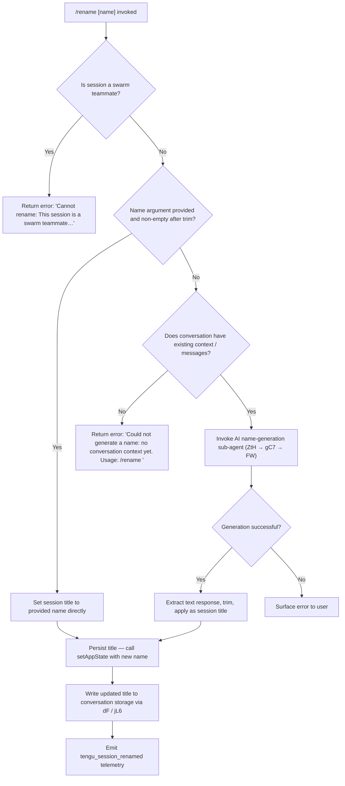

# `/rename`

> Analysis basis: CC v2.1.147 bundle.js (AST extraction + Claude interpretation)
> Minimum version: v2.1.147

---

## Overview

The `/rename` command (also available as `/name`) allows users to set or update the display name of the current Claude Code conversation session. When called with an explicit name argument, the session title is updated immediately; when called without an argument, the command attempts to auto-generate a name by invoking the AI model against the existing conversation context. The command enforces guardrails for swarm-teammate sessions and for sessions that lack sufficient conversation history for auto-generation.

---

## Registration

| Field | Value |
|---|---|
| type | `local-jsx` |
| name | `rename` |
| description | `Rename the current conversation` |
| argumentHint | `[name]` |
| immediate | `true` |
| aliases | `["name"]` |
| module_id | `hG1` |
| load_inline | `true` |
| loc_byte | `11502809` |
| loc_byte_end | `11503008` |
| loc_line | `9372` |
| arbor_handler.name | `QC7` |
| arbor_handler.fqn | `claude-2.1.147::QC7` |
| arbor_handler.kind | `AsyncFunction` |
| arbor_handler.resolution_path | `module_id` |
| arbor_handler.n_hits | `0` |

Analysis basis: CC v2.1.147 bundle.js:+11502809

---

## Input Branching

Five distinct execution paths are possible depending on session state and the presence of a name argument. A Mermaid flowchart is required.



Analysis basis: CC v2.1.147 bundle.js:+11502059 (trim check), +11501954 (swarm-teammate guard), +11502171 (no-context error), +11500178 (rename literal)

---

## Behavioral Spec

### Top-Level Handler (`QC7`)

The Arbor-resolved handler `QC7` (an `AsyncFunction`) is the entry point for the `/rename` command. It dispatches to the core rename implementation (`AW8`) and reads the current app state reference (`H`) as well as an abort-signal helper (`_W8`).

```
async function handleRenameCommand(args, context):
    abortSignal = getAbortSignal(context)       // _W8 → K0
    appState    = getCurrentAppState(context)   // H
    return await coreRename(args, appState, abortSignal)  // AW8
```

Analysis basis: CC v2.1.147 bundle.js:+11502500 (`QC7` → `AW8`), +11502516 (`QC7` → `H`), +11502558 (`QC7` → `_W8`)

---

### Core Rename Logic (`AW8`)

`AW8` is the primary async function performing all validation and dispatch.

```
async function coreRename(rawArg, appState, abortSignal):
    // 1. Swarm-teammate guard
    sessionContext = getSessionContext(appState)   // Yf → EW → Rt8.getStore
    if sessionContext.isSwarmTeammate:
        return renderError("Cannot rename: This session is a swarm teammate. Teammate names are set by the team leader.")

    // 2. Trim the user-supplied argument
    trimmedArg = rawArg.trim()                     // H.trim at +11502059

    // 3. Branch on whether an explicit name was given
    if trimmedArg is non-empty:
        newTitle = trimmedArg
    else:
        // 4. No explicit name — auto-generate
        hasContext = conversationHasMessages(appState)
        if NOT hasContext:
            return renderError("Could not generate a name: no conversation context yet. Usage: /rename <name>")

        newTitle = await generateNameFromContext(appState, abortSignal)  // ZtH

    // 5. Apply the new title
    appState.setAppState({ sessionTitle: newTitle })   // _.setAppState at +11502310

    // 6. Persist to conversation storage
    persistConversationTitle(newTitle)                 // dP8 → BkH → dF → jL6

    // 7. Notify any observers / render updated UI
    notifyRename(newTitle)                             // ROH
```

Analysis basis: CC v2.1.147 bundle.js:+11502093 (`AW8` → `ZtH`), +11502278 (`AW8` → `h6`), +11502296 (`AW8` → `BkH`), +11502310 (`AW8` → `setAppState`), +11502329 (`AW8` → `dP8`), +11502352 (`AW8` → `ROH`)

---

### Session-Context Check (`Yf` / `EW`)

Determines whether the active session is a swarm teammate by consulting an AsyncLocalStorage store.

```
function getSessionContext(appState):
    store = sessionStore.getStore()   // Rt8.getStore at +2178684
    return store ?? { isSwarmTeammate: false }
```

Analysis basis: CC v2.1.147 bundle.js:+11501934 (`AW8` → `Yf`), +2179825 (`Yf` → `EW`), +2178684 (`EW` → `Rt8.getStore`)

---

### Auto-Name Generation Orchestrator (`ZtH`)

Called when no explicit name is supplied. Forks a lightweight sub-agent session, runs the name-generation query, and collects the text response.

```
async function generateNameFromContext(appState, abortSignal):
    // Fork current session state for the sub-agent
    forkResult = forkSessionForNameGeneration(appState)   // V6 at +11500639
    emit telemetry("tengu_rename_full_session_fork")      // +11500642

    // Compute timestamps for the sub-agent conversation
    timestamp = computeTimestamp()                        // HU_ at +11500680

    // Run the generation query (abort-capable)
    rawResponse = await runNameGenerationQuery(           // gC7 at +11500699
        forkResult,
        timestamp,
        abortSignal
    )

    // Extract and clean result
    textResult = extractTextFromResponse(rawResponse)     // e28 at +11500751
    cleanedName = trimAndNormalize(textResult)            // Rk at +11500792

    // Second pass: filter / post-process the candidate name
    filteredName = filterCandidateName(cleanedName)       // LK at +11501260
    finalName    = normalizeWhitespace(filteredName)      // yG1 at +11501289

    return buildNameString(finalName)                     // ZH at +11501345
```

Analysis basis: CC v2.1.147 bundle.js:+11500639, +11500642, +11500680, +11500699, +11500751, +11500792, +11501260, +11501289, +11501345

---

### Name-Generation Query Sub-Agent (`gC7`)

Sets up and executes the AI query that generates the session name. Tool use is explicitly denied for this sub-agent.

```
async function runNameGenerationQuery(forkResult, timestamp, abortSignal):
    // Build query configuration — deny tool use
    queryConfig = {
        toolPolicy: "deny",             // literal "deny" at +11500084
        toolPolicyReason: "Session name generation cannot use tools",  // +11500099
        origin: "rename_generate_name", // literal at +11500202
        type: "rename"                  // literal at +11500178
    }

    // Attach abort listener
    abortController = new AbortController()
    abortSignal.addEventListener("abort", () => abortController.abort())  // +11499888

    // Run the main agent query loop
    queryResult = await runAgentQuery(forkResult, queryConfig, abortController)  // FW at +11499966

    // Kill any spawned sub-processes
    cleanupProcesses()    // G8 at +11499986

    // Flatten message history for extraction
    messageList = flattenMessageHistory(queryResult)   // q.flatMap at +11500324

    // Normalise and extract the name text
    rawName = extractNameField(messageList)            // yG1 at +11500489

    // Format and convert to string
    return formatNameString(rawName)                   // ZH at +11500557
```

Analysis basis: CC v2.1.147 bundle.js:+11499838 (`gC7` → `NHH`), +11499888, +11499907 (abort literal), +11499966, +11499986, +11500084, +11500099, +11500178, +11500202, +11500324, +11500489, +11500557

---

### Agent Query Runner (`FW`)

The general-purpose forked-agent query function invoked by the name-generation path. Builds message context, creates a conversation snapshot, and streams/collects the response.

```
async function runForkedAgentQuery(forkResult, queryConfig, abortController):
    startTime = Date.now()                    // +10455888
    snapshot  = buildConversationSnapshot()   // tY8 at +10456004
    lastMsg   = conversationHistory.at(-1)    // G.at at +10456218
    sessionId = generateId()                  // ck at +10456244

    msgRecord = buildMessageRecord(sessionId) // H8H at +10456268
    normMsg   = normalizeMessage(msgRecord)   // N at +10456288

    // Collect context messages
    contextSlice = conversationHistory.at(index)   // H.at at +10456358
    enriched     = enrichContext(contextSlice)      // Cx at +10456419

    // Check for tombstone / special message types
    hasTombstone  = checkMessageFlags(enriched)     // HG6 at +10456599
    hasInterrupt  = getInterruptFlag()               // ijH at +10456689
    progressState = getProgressState()               // yP8 at +10456718
    pendingItems  = getPendingItems()                // PM1 at +10456739

    // Build message batch and map to API format
    messageBatch = buildBatch(...)                   // D.push at +10456844
    apiMessages  = messageBatch.map(toApiFormat)     // D.map at +10457157

    // Delimit with separator
    separator = ", "                                 // literal at +10457181

    // Dispatch query and collect result
    result = await dispatchQuery(apiMessages, queryConfig, abortController)  // BG7 at +10457473

    emit telemetry("tengu_forked_agent_default_turns_exceeded")  // +10457381 (when applicable)
    emit telemetry("tengu_fork_agent_query")                     // +10457824

    return result
```

Analysis basis: CC v2.1.147 bundle.js:+10455888, +10456004, +10456218, +10456244, +10456268, +10456288, +10456358, +10456419, +10456599, +10456689, +10456718, +10456739, +10456844, +10457157, +10457181, +10457381, +10457473, +10457824

---

### Conversation Persistence (`dF` / `jL6`)

After the new title is resolved, it is written back to persistent conversation storage.

```
async function persistConversationTitle(newTitle):
    filePath = joinPaths(storageDir, conversationId)   // U9H.join at +2182857
    existing = await readConversationFile(filePath)    // Mk.readFile at +2182935
    parsed   = jsonParse(existing)                     // B6 (JSON.parse) at +2182926
    parsed.title = newTitle
    serialized = jsonStringify(parsed)                 // CH (JSON.stringify)
    await writeConversationFile(filePath, serialized)  // Mk.writeFile at +2182964
    emit telemetry("tengu_session_renamed")            // +12637168
```

Analysis basis: CC v2.1.147 bundle.js:+2183119 (`dF` → `jL6`), +2182857, +2182926, +2182935, +2182964, +2183005 (`jL6` → `N`), +12637168

---

### Title Metadata Tagging (`BkH` / `cx` / `N8H`)

Beyond persisting the raw title string, the implementation tags the conversation record with a `custom-title` or `ai-title` discriminator depending on whether the name was user-supplied or AI-generated.

```
function tagConversationTitle(entry, source):
    if source == "user":
        entry.tag = "custom-title"   // literal at +12637076
    else:
        entry.tag = "ai-title"       // literal at +12637241
    logTitleChange(entry)            // I7H at internal dispatch
    emitTitleEvent(entry)            // lZ6.emit
```

Analysis basis: CC v2.1.147 bundle.js:+10354288 (`BkH` → `h6`), +10354326 (`BkH` → `cx`), +10354341 (`BkH` → `N8H`), +12637076, +12637241

---

### Response Text Extraction (`e28`)

Extracts plain-text content from the sub-agent response array.

```
function extractTextFromResponse(responseItems):
    parts = []
    for item in responseItems:
        if Array.isArray(item):
            parts.push(...item)            // _.push at +11497457
        else:
            parts.push(item)
    joined = parts.join("")               // _.join at +11497573
    return joined.slice(...)              // A.slice at +11497605
```

Analysis basis: CC v2.1.147 bundle.js:+11497457, +11497475, +11497573, +11497605

---

### Name Cleaning and Normalisation (`Rk` / `TK` / `Fj8`)

Post-processes the raw AI-generated candidate name: strips whitespace, trims to a reasonable length, removes disallowed characters, and normalises unicode.

```
function cleanCandidateName(rawName):
    // Phase 1: trim control characters and leading/trailing whitespace
    stage1 = trimAndStrip(rawName)     // TK at +12889821

    // Phase 2: deep content normalisation (tool-schema aware)
    stage2 = deepNormalise(stage1)     // Fj8 at +12889890

    // Phase 3: process group entries, map to display strings
    stage3 = mapToDisplayEntries(stage2, sessionContext)  // H.map at +12889907

    // Phase 4: post-normalise via full agent-format pipeline
    stage4 = agentFormatNormalise(stage3)  // FyH at +12890008

    // Phase 5: build final header record
    finalRecord = buildHeaderRecord(stage4)  // HX at +12890110

    // Phase 6: apply global string finaliser
    result = applyGlobalFinisher(finalRecord) // $G at +12890216

    return result
```

Analysis basis: CC v2.1.147 bundle.js:+12889821, +12889890, +12889895, +12889907, +12890008, +12890110, +12890216

---

### Agent-Name Propagation (`bLH`)

When the rename applies to a named agent session (multi-agent / swarm context), the new name is additionally written to the agent-name metadata field.

```
function propagateAgentName(entry, newName):
    entry.metadata["agent-name"] = newName   // literal "agent-name" at +12640099
    logTitleChange(entry)                    // I7H
    emit(events.agentNameSet, entry)         // Ir_.emit at +12640184
    emit telemetry("tengu_agent_name_set")   // +12640197
```

Analysis basis: CC v2.1.147 bundle.js:+12640078 (`bLH` → `JV`), +12640087 (`bLH` → `I7H`), +12640099, +12640184, +12640197

---

## State & Side Effects

| Item | Detail |
|---|---|
| Telemetry — `tengu_rename_full_session_fork` | Fired when a forked session is created for AI name-generation (bundle.js:+11500642) |
| Telemetry — `tengu_session_renamed` | Fired after the session title is successfully persisted to conversation storage (bundle.js:+12637168) |
| Telemetry — `tengu_agent_name_set` | Fired when an agent-name metadata field is updated (multi-agent paths) (bundle.js:+12640197) |
| Telemetry — `tengu_fork_agent_query` | Fired upon completion of the forked-agent sub-query used for name generation (bundle.js:+10457824) |
| Telemetry — `tengu_forked_agent_default_turns_exceeded` | Fired if the name-generation sub-agent exceeds its default turn limit (bundle.js:+10457381) |
| appState changes | `sessionTitle` field updated via `_.setAppState` (bundle.js:+11502310) |
| Conversation file write | Title persisted to conversation JSON on disk via `Mk.writeFile` (bundle.js:+2182964) |
| Title tag written | Metadata discriminator `"custom-title"` or `"ai-title"` written to conversation record (bundle.js:+12637076, +12637241) |
| Agent-name metadata | `"agent-name"` key updated in session entry for multi-agent sessions (bundle.js:+12640099) |
| Event emission — `lZ6.emit` | Internal event bus notified on title change (bundle.js:+12637155, +12640184) |
| Sub-agent teardown | Spawned sub-processes killed after name-generation query completes (bundle.js:+11499986 → `G8` / `j`) |
| Abort signal | An `AbortController` is created and wired to the parent abort signal during AI name generation (bundle.js:+11499888, +11499907) |
| Tool use | Explicitly denied (`"deny"`) during the name-generation sub-agent run with the reason `"Session name generation cannot use tools"` (bundle.js:+11500084, +11500099) |
| Swarm guard | Returns an error string and halts execution for swarm-teammate sessions (bundle.js:+11501954) |
| No-context guard | Returns `"Could not generate a name: no conversation context yet. Usage: /rename <name>"` when conversation is empty and no explicit name is given (bundle.js:+11502171) |

---

## Version History

| Version | Change |
|---|---|
| v2.1.147 | Initial analysis |

---

## Common Mistakes

1. **Calling `/rename` with no argument on an empty conversation.** The command requires at least some prior conversation context to auto-generate a name. If no messages exist yet, it returns an error asking you to supply an explicit name. Always provide an explicit name (`/rename <name>`) at session start.

2. **Attempting to rename a swarm-teammate session.** Teammate session names are controlled exclusively by the swarm team leader. Invoking `/rename` inside a teammate session returns a hard error and does not apply the name. Use `/rename` only from the team-leader or a standalone session.

3. **Expecting instant display of an AI-generated name.** When no argument is provided, the command forks a sub-agent and makes an API call; there is a latency cost before the name appears. If a response is needed immediately, pass the desired name directly as the argument.

4. **Using the alias `/name` interchangeably without considering tool-completion context.** The aliases `rename` and `name` are functionally identical, but shell completion or IDE integrations may surface only one form. Either works at runtime.

5. **Assuming the command works in non-interactive / SDK execution modes.** The `immediate: true` flag means the command is processed before the next agent turn, but the UI rendering path (`local-jsx` type) may not produce visible output in headless or SDK contexts.

---

## Appendix — Identifier Mapping

> For bundle debugging only. Identifiers change across versions.

| Identifier | Role |
|---|---|
| `QC7` | Top-level async command handler for `/rename` (Arbor-resolved entry point) |
| `AW8` | Core rename implementation — validates, branches, applies title |
| `_W8` | Abort-signal accessor helper |
| `K0` | Low-level abort-signal constructor/factory |
| `Yf` | Session-context retrieval wrapper |
| `EW` | AsyncLocalStorage accessor for session context |
| `ZtH` | Auto-name generation orchestrator |
| `V6` | Session-state fork utility |
| `Df6` | Fork helper — dependency 1 |
| `wf6` | Fork helper — dependency 2 |
| `Ct` | Conversation-state builder used during fork |
| `UH` | String coercion / formatting utility |
| `rC` | Recursive conversation-content reader |
| `As6` | Fork-state accumulator |
| `C4_` | Experiment / growthbook event emitter |
| `p4_` | Post-fork state packager |
| `x6` | File-watch / conversation-file accessor |
| `F6` | File-path resolver |
| `o4_` | File-watch options builder |
| `k$H` | Config file reader with ENOENT/EEXIST handling |
| `EQ4` | File-watch setup routine |
| `HU_` | Timestamp computation for sub-agent context |
| `D86` | Timestamp adjustment factor |
| `gC7` | Name-generation query sub-agent runner |
| `NHH` | Sub-agent initialisation helper |
| `A` | Abort-controller / signal handler |
| `M` | Connection/stream close helper |
| `FW` | Forked-agent query dispatcher |
| `tY8` | Conversation snapshot builder |
| `G` | Conversation history accessor |
| `ck` | Random ID generator (uses `MPq.randomBytes`) |
| `H8H` | Message record constructor |
| `N` | Message normaliser / formatter |
| `Cx` | Context enrichment helper |
| `HG6` | Tombstone / special-message-type checker |
| `ijH` | Interrupt-flag accessor |
| `yP8` | Progress-state accessor |
| `PM1` | Pending-items collector |
| `D` | Conversation session / process manager |
| `c` | Generic utility / config constant accessor |
| `BG7` | API query dispatcher for forked agent |
| `G8` | Sub-process cleanup helper |
| `J` | Process list accessor |
| `j` | Process kill helper |
| `q` | File / temp-file unlink helper |
| `yG1` | Name-field extractor from message list |
| `Wh` | Whitespace-trim wrapper |
| `ZH` | String-conversion finaliser |
| `e28` | Response text-array flattener |
| `_` | Array/string utility (multi-use) |
| `Rk` | Candidate-name cleaning pipeline entry point |
| `TK` | Phase-1 name trimmer (strip control chars) |
| `Fj8` | Deep content normaliser (hash/cache-aware) |
| `Bj8` | Normaliser dependency — content block handler |
| `gG` | Full agent-format message builder |
| `OD7` | Message-array mapper |
| `b6` | Buffer/encoding helper |
| `CH` | JSON serialiser wrapper (`JSON.stringify`) |
| `B6` | JSON deserialiser wrapper (`JSON.parse`) |
| `d11` | Normaliser sub-step |
| `q8` | Error-code / status helper |
| `L` | Promise / task queue manager |
| `FyH` | Agent-format normalisation pipeline |
| `Tx_` | Content-push accumulator for normalisation |
| `xF1` | Full agent query execution engine |
| `HX` | Header-record builder |
| `hA` | Auth/credential accessor |
| `$5` | Model-config accessor |
| `Vt8` | API key type detector (sk-ant prefix check) |
| `Bq` | Request parameter builder |
| `kmH` | Client/config finaliser |
| `$G` | Global string finaliser |
| `LK` | Message filter (post-generation filtering) |
| `h6` | Logger / output emitter |
| `oV` | Low-level logger sink |
| `BkH` | Conversation-metadata write orchestrator |
| `zR` | Metadata field setter |
| `XM` | Path-join + tag builder |
| `sy` | Tag-string formatter |
| `w_` | Tag-path helper |
| `cx` | Title-change event dispatcher |
| `JV` | Title-record constructor |
| `I7H` | Append-to-log file helper |
| `v4` | Log-entry formatter |
| `N8H` | Agent-name metadata writer |
| `BG` | Background-update flag |
| `tr` | Transaction/lock helper |
| `f` | MCP server manager |
| `EkH` | MCP server initialisation |
| `RHH` | MCP server entry builder |
| `TN` | MCP config parser |
| `K` | MCP client list |
| `s8` | MCP string constant holder |
| `F06` | MCP format helper |
| `rj7` | MCP server launcher |
| `GK8` | MCP transport selector |
| `XK8` | MCP port allocator |
| `z8` | MCP debug logger |
| `ux_` | MCP OAuth flow handler |
| `mx_` | MCP OAuth callback handler |
| `wL1` | MCP connection state manager |
| `bx_` | MCP reconnect handler |
| `B2_` | MCP capability filter |
| `y` | Output stream writer |
| `k7` | MCP error logger |
| `OL1` | MCP initialisation result handler |
| `g06` | MCP retry-count parser |
| `Ru_` | MCP retry-delay parser |
| `k7K` | MCP update applicator |
| `kJ8` | MCP update serialiser |
| `sN` | MCP client cleanup helper |
| `$` | Disposable resource manager |
| `ZC1` | Session state snapshot creator |
| `_D5` | MCP full-state reconciler |
| `EK8` | MCP capability-set membership checker |
| `r8` | Timeout/retry scheduler |
| `laH` | MCP log entry formatter |
| `_8H` | Secondary metadata field writer |
| `bLH` | Agent-name propagation handler |
| `dF` | Conversation JSON file read-modify-write |
| `jL6` | Low-level conversation file I/O |
| `t3` | NXH-dependent helper |
| `NXH` | Unknown depth-3 helper |
| `dP8` | App-state key enumerator |
| `ROH` | Post-rename UI notification / observer trigger |
| `RK` | Job-directory path builder |
| `wG` | Job-path resolver |
| `jG` | Basename extractor for job paths |
| `dq` | Async stat/read with cache (hOH) |
| `J8` | Status-code normaliser |
| `Cw` | Cache-entry deleter |
| `h5` | Atomic file-write wrapper |
| `ez` | Low-level atomic write (randomBytes + rename) |
| `RH` | Error logger with queue |
| `n_` | Error message formatter |
| `j1` | Error chain builder |
| `XwA` | Error-record constructor |
| `FpK` | Error-queue rotator |