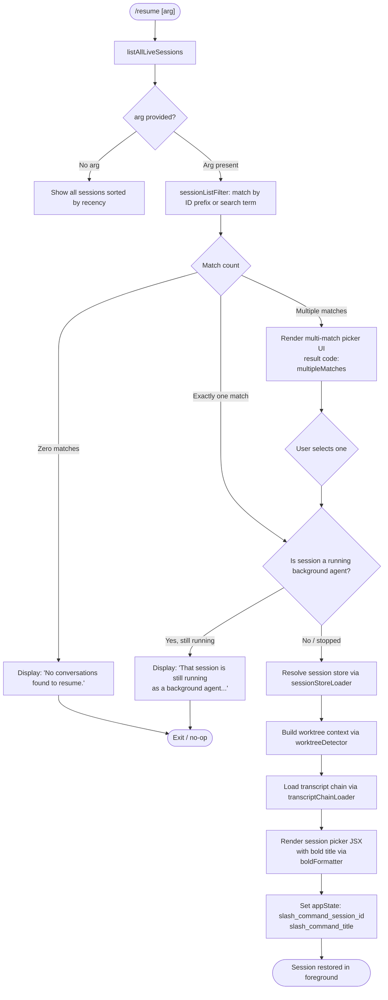

# `/resume`

> Analysis basis: CC v2.1.147 bundle.js (AST extraction + Claude interpretation)
> Minimum version: v2.1.147

---

## Overview

`/resume` (aliased as `/continue`) allows the user to reattach to a previous Claude Code conversation by searching for it by session ID or a text search term. It lists all live sessions, filters them according to the supplied argument, and then opens the matched conversation — guarding against attempts to resume a session that is currently running as a background agent.

---

## Registration

| Field | Value |
|---|---|
| type | `local-jsx` |
| name | `resume` |
| description | `Resume a previous conversation` |
| argumentHint | `[conversation id or search term]` |
| aliases | `["continue"]` |
| module_id | `bZ1` |
| load_inline | `true` |
| loc_byte | `11662285` |
| loc_byte_end | `11662482` |
| loc_line | `9411` |
| arbor_handler.name | `lu7` |
| arbor_handler.fqn | `claude-2.1.147::lu7` |
| arbor_handler.kind | `AsyncFunction` |
| arbor_handler.resolution_path | `module_id` |
| arbor_handler.n_hits | `0` |

Analysis basis: CC v2.1.147 bundle.js:+11662285

---

## Input Branching

Six or more distinct paths exist in the handler, so a Mermaid flowchart is used.



Analysis basis: CC v2.1.147 bundle.js:+11660773, +11660887, +11661322, +11661583, +11661807

---

## Behavioral Spec

### 1. Session Enumeration

```
async function enumerateSessions():
    sessions = await sessionStore.listAllLiveSessions()   // g4H → A.listAllLiveSessions
    sessions = sessions.filter(isNotHidden)               // CZ1 → H.filter
    return sessions
```

`listAllLiveSessions` resolves through `g4H`, which calls `Promise.resolve` before delegating to the underlying session-store accessor and then filters to interactive-mode sessions only (literal `"interactive"` at bundle.js:+8535860).

Analysis basis: CC v2.1.147 bundle.js:+11660773, +8535769, +8535860

---

### 2. Argument Matching / Session Filter

```
function sessionListFilter(sessions, arg):
    if arg is empty:
        return sessions sorted by last-modified descending
    lower = arg.toLowerCase()
    # exact UUID prefix match
    hit = sessions.find(s => s.id.startsWith(lower))
    if hit:
        return [hit]
    # fuzzy text search against title / last-prompt
    candidates = sessions.filter(s =>
        s.title.startsWith(lower) OR
        s.lastPrompt.includes(lower)
    )
    candidates.sort((a, b) => a.title.localeCompare(b.title))
    return candidates
```

Analysis basis: CC v2.1.147 bundle.js:+11658116, +11658135, +11658162, +11658195

---

### 3. Background-Agent Guard

When exactly one session is matched, the handler checks whether that session is currently attached to a running background agent:

```
function backgroundAgentGuard(session):
    if session.status == "running" AND session.mode == "bg":
        return {
            blocked: true,
            message: "That session is still running as a background agent. " +
                     "Open `claude agents` to attach to it, or stop it there " +
                     "first to resume here."
        }
    return { blocked: false }
```

The exact user-facing string is sourced at bundle.js:+11660887. If `blocked` is `true`, the command renders this message and exits without loading the transcript.

Analysis basis: CC v2.1.147 bundle.js:+11660887

---

### 4. Worktree Detection

Before loading the full transcript the handler invokes a worktree-detection helper (`uyH`) to discover any Git worktrees associated with the session root:

```
async function detectWorktrees(sessionPath):
    spawn git ["worktree", "list", "--porcelain"]
    // literals: "worktree", "list", "--porcelain" at +11657769, +11657776
    parse output lines (prefix "worktree " stripped at offset +9)
    normalise paths with Unicode NFC
    emit telemetry: tengu_worktree_detection
    return worktreeList
```

Telemetry event `tengu_worktree_detection` fires at bundle.js:+11657858. Parsed offset constant `9` appears at bundle.js:+11658008; normalisation form `"NFC"` at bundle.js:+11658021.

Analysis basis: CC v2.1.147 bundle.js:+11657749, +11657776, +11657858, +11658008

---

### 5. Transcript Chain Loading

```
async function loadTranscriptChain(sessionId, worktrees):
    // rd delegates to vU1 (file-tree traversal) and KhH (binary transcript parser)
    files = await fileSystemScanner(sessionPath)      // vU1
    chain = await transcriptParser(files)             // KhH → Va7
    // Va7 reads JSONL transcript, resolves parent-uuid links,
    // detects phantom parents (telemetry: tengu_transcript_phantom_parent)
    // detects parent cycles   (telemetry: tengu_transcript_parent_cycle)
    return chain
```

The transcript parser (`Va7`) reads files using `my.openSync` / `my.readSync` / `my.closeSync`, allocates buffers via `Buffer.allocUnsafe` up to 1 048 576 bytes (bundle.js:+12645857), and resolves `"parentUuid"` links to reconstruct message ordering.

Analysis basis: CC v2.1.147 bundle.js:+11661708, +12643368, +12645857

---

### 6. No-Match / Zero-Results Path

```
function handleNoResults():
    display "No conversations found to resume."
    return   // command exits, no state change
```

Literal string at bundle.js:+11661322.

Analysis basis: CC v2.1.147 bundle.js:+11661322

---

### 7. Multi-Match UI

When more than one session matches the search term, `lu7` renders a JSX picker (via `Hw.createElement`) and sets the result code `"multipleMatches"` (bundle.js:+11658473). The user selects one entry; the selected session then re-enters the single-match path (step 3 onward).

Analysis basis: CC v2.1.147 bundle.js:+11661173, +11658473

---

### 8. State Commit

On successful resolution the handler writes two appState keys:

```
function commitSessionToState(sessionId, title):
    appState.set("slash_command_session_id", sessionId)
    appState.set("slash_command_title",      title)
```

These literals appear at bundle.js:+11661583 and +11661807 respectively.

The bold formatter helper (`SZ1` → `P6.bold`) is applied to the session title in the rendered picker UI at bundle.js:+11661857.

Analysis basis: CC v2.1.147 bundle.js:+11661583, +11661807, +11661857

---

## State & Side Effects

| Item | Detail |
|---|---|
| Telemetry — `tengu_worktree_detection` | Fired during worktree discovery (bundle.js:+11657858) |
| Telemetry — `tengu_transcript_phantom_parent` | Fired when a transcript entry references an unknown parent UUID (bundle.js:+12648052) |
| Telemetry — `tengu_transcript_parent_cycle` | Fired when a cycle is detected in the parent-uuid chain (bundle.js:+12651615) |
| Telemetry — `tengu_chain_parent_cycle` | Fired in the chain-ordering layer on cycle detection (bundle.js:+12630094) |
| Telemetry — `tengu_chain_timestamp_fallback` | Fired when timestamp ordering falls back to insertion order (bundle.js:+12630243) |
| Telemetry — `tengu_chain_parallel_tr_recovered` | Fired when parallel tool-result chains are recovered (bundle.js:+12632109) |
| Telemetry — `tengu_relink_walk_broken` | Fired when the walk-relink step hits a broken link (bundle.js:+12629604) |
| appState changes | `slash_command_session_id` and `slash_command_title` set on successful resume |
| Hook registration | None observed at depth ≤ 2 |
| Sound | None observed at depth ≤ 2 |
| File I/O | Transcript files read via `my.openSync`/`readSync`/`closeSync`; directories enumerated via `HL.readdir`/`HL.realpath` |
| Background-agent block | Displays user-facing message and aborts when target session `status == "running"` in `"bg"` mode |

---

## Version History

| Version | Change |
|---|---|
| v2.1.147 | Initial analysis |

---

## Common Mistakes

1. **Using `/resume` while the target session is a running background agent.** The command will refuse and show an error directing the user to `/claude agents` instead; the session must be stopped there first.
2. **Providing an ambiguous search term.** If the term matches more than one session, a picker is shown — the command does not resume automatically.
3. **Expecting fuzzy mid-string matching.** The filter uses `startsWith` for both ID-prefix and title matching, so a mid-string substring will not match.
4. **Confusing `/resume` with `/continue`.** Both names are equivalent aliases; `/continue` is simply an alias registered in the same command object.
5. **Resuming a session from a different working directory with Git worktrees.** The handler runs worktree detection relative to the session's stored path; if that path is no longer accessible the worktree list may be empty, which can affect context reconstruction.

---

## Appendix — Identifier Mapping

> For bundle debugging only. Identifiers change across versions.

| Identifier | Role |
|---|---|
| `lu7` | Main async handler for `/resume` (arbor_handler) |
| `CZ1` | Session pre-filter (removes hidden/ineligible sessions) |
| `g4H` | Session store accessor — calls `A.listAllLiveSessions` |
| `hf` | UI helper called at session-list and match stages |
| `RH` | Error/logging utility used throughout the handler |
| `ZH` | String coercion / display helper |
| `uyH` | Worktree detection helper (runs `git worktree list --porcelain`) |
| `T_` | Subprocess spawner used by worktree detection |
| `i2H` | Process-spawn core (used by `T_`) |
| `w_` | Working-directory resolver |
| `BW8` | Transcript-rendering entry point (delegates to `rZ6`) |
| `rZ6` | Transcript layout formatter |
| `vU1` | File-system scanner / transcript file enumerator |
| `KhH` | Binary transcript parser coordinator |
| `Va7` | Low-level JSONL/binary transcript reader (openSync/readSync) |
| `va7` | Lightweight file reader variant (openSync/readSync/closeSync) |
| `Za7` | Transcript buffer parser (handles `parentUuid` link resolution) |
| `d4H` | Transcript chain builder (ordering by timestamp/parent) |
| `Da7` | Chain segment sorter and deduplicator |
| `Oa7` | Chain ordering helper |
| `GU1` | Chain lookup helper |
| `Ya7` | Chain validation helper (NaN-safe timestamp check) |
| `c4H` | Conversation store accessor (get operations for all store keys) |
| `g6H` | Conversation store mutator (set operations for all store keys) |
| `AU1` | Store walk / relink helper |
| `$a7` | Relink walk sub-step |
| `BX6` | Full conversation-state loader (delegates to `VU1` + `d4H`) |
| `VU1` | Conversation-state initialiser (merges store + `g6H`) |
| `Na7` | Session directory resolver |
| `rd` | Orchestrator: worktrees → file scan → transcript chain |
| `uyH` | Worktree list parser (also listed above; dual role confirmed) |
| `Er_` | Transcript message normaliser |
| `WE6` | Message content extractor |
| `d1` | Text-content parser |
| `Vr_` | Attachment / image content parser |
| `wa7` | Array-content validator |
| `ja7` | Content-array some-check helper |
| `UrH` | Message map helper |
| `zr_` | Compound message transformer |
| `NT8` | Transcript index get/set helper |
| `IT8` | Transcript values-from-map helper |
| `vT8` | Timestamp parser (Date.parse wrapper) |
| `SZ1` | Bold-title formatter (delegates to `P6.bold`) |
| `A7H` | Additional UI component used in picker rendering |
| `Ur` | Utility called during conversation-state load |
| `so7` | Sub-helper called inside store mutator |
| `pX` | Store-entry post-processor |
| `_R` | Internal store state helper |
| `U1A` | Message-object builder |
| `m1A` | Message-type detector helper |
| `p1A` | Message field replacement helper |
| `Ar` | Regex-test helper (used in match filtering) |
| `QQ` | Path join helper for project-level directory |
| `zPH` | Transcript slice/push helper |
| `Dr_` | Directory recursive transcript scanner |
| `BZ6` | Store cache get/set helper |
| `Lz` | Path replace/slice utility |
| `KhH` | (See above — binary transcript parser coordinator) |
| `ba7` | Transcript header parser |
| `s8` | Store sentinel helper |
| `_WH` | Stream message-frame parser |
| `HgK` | Frame-header detection helper |
| `_gK` | Frame-payload extractor |
| `qgK` | JSON-frame parser |
| `AgK` | Alternate JSON-frame parser |
| `t9` | Error-code utility (calls `q8`) |
| `oV` | Low-level working-directory utility |
| `sy` | Session-path helper |
| `XT` | Recursive directory reader helper |
| `L9` | File-listing helper called during scan |
| `Lz` | (See above) |

---

Note: index built via Arbor fallback; some signals (telemetry, literals) may be missing — see arbor-fallback.js.