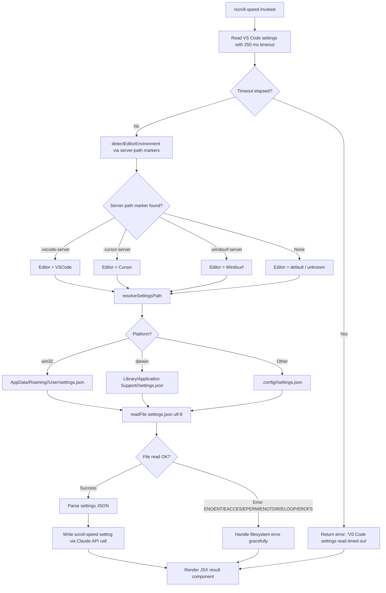

# `/scroll-speed`

> Analysis basis: CC v2.1.144 bundle.js (AST extraction + Claude interpretation)
> Minimum version: v2.1.144

---

## Overview

`/scroll-speed` is a local JSX command that adjusts the mouse wheel scroll speed within Claude Code. Its implementation reads the host editor's VS Code–compatible `settings.json` file to determine a platform-appropriate scroll setting, then renders a JSX component reflecting the result. The command detects the editor environment (VS Code, Cursor, or Windsurf) and resolves the correct per-platform settings path before applying any change.

---

## Registration

| Field | Value |
|---|---|
| type | `local-jsx` |
| name | `scroll-speed` |
| description | Adjust mouse wheel scroll speed |
| loc_byte | `11295506` |
| loc_byte_end | `11295754` |
| loc_line | `6799` |
| module_id | `iXq` |
| load_inline | `true` |
| arbor_handler.name | `Pv7` |
| arbor_handler.fqn | `claude-2.1.144::Pv7` |
| arbor_handler.kind | `AsyncFunction` |
| arbor_handler.resolution_path | `module_id` |
| arbor_handler.n_hits | `0` |

Analysis basis: CC v2.1.144 bundle.js:+11295506

---

## Input Branching

The handler resolves through 4+ distinct paths depending on editor environment detection, platform (win32 / darwin / linux), and file-read outcome. A Mermaid flowchart is required.



Analysis basis: CC v2.1.144 bundle.js:+11295269 (handler entry), +11295278 (250 ms timeout constant), +11295282 (timeout error string)

---

## Behavioral Spec

### Top-Level Handler (`Pv7`)

The async handler is the Arbor-resolved entry point for the command. It orchestrates three sequential sub-operations:

```
async function scrollSpeedHandler(context):
    // 1. Attempt to read VS Code-compatible settings with a hard timeout
    settingsResult = await withTimeout(
        readEditorSettings(),
        timeoutMs = 250,
        timeoutError = "VS Code settings read timed out"
    )

    // 2. Derive the scroll-speed value from the settings result
    scrollValue = deriveScrollSetting(settingsResult)

    // 3. Render a JSX component displaying the outcome
    return createElement(ScrollSpeedResultComponent, { value: scrollValue })
```

Analysis basis: CC v2.1.144 bundle.js:+11295269, +11295340

---

### Timeout Wrapper (`Tf`)

A generic promise-race utility used to bound the settings read operation.

```
async function withTimeout(promise, ms, errorMessage):
    timeoutId = null
    timeoutPromise = new Promise((_, reject) =>
        timeoutId = setTimeout(() => reject(new Error(errorMessage)), ms)
    )
    result = await Promise.race([promise, timeoutPromise])
    clearTimeout(timeoutId)
    return result
```

- Hard timeout value: **250 milliseconds** (bundle.js:+11295278)
- Timeout error string: `"VS Code settings read timed out"` (bundle.js:+11295282)
- Uses `setTimeout` / `Promise.race` / `clearTimeout` internally (bundle.js:+2207342, +2207405, +2207452)

Analysis basis: CC v2.1.144 bundle.js:+11295269 (call site), +2207342–2207452 (implementation)

---

### Editor Settings Reader (`k7_`)

Resolves the path to the editor's `settings.json`, reads it, and returns the parsed content.

```
async function readEditorSettings():
    editorKind = detectEditorFromServerPath()   // Z7_ / yiL
    settingsPath = resolveSettingsPath(editorKind)  // y7_
    rawText = await fs.readFile(settingsPath, encoding="utf-8")
    parsed = parseSettingsJson(rawText)          // GC6 pipeline
    return parsed
```

Analysis basis: CC v2.1.144 bundle.js:+3911769, +3911782, +3911816, +3911828, +3911836, +3911843, +3911870

---

### Editor Environment Detection (`Z7_`)

Determines which editor is hosting the session by inspecting home-directory path segments for well-known remote-server directory names.

```
function detectEditorFromServerPath(homePath):
    serverMarkers = [
        { marker: ".vscode-server",   editor: "VSCode",   display: "VSCode"   },
        { marker: ".cursor-server",   editor: "cursor",   display: "Cursor"   },
        { marker: ".windsurf-server", editor: "windsurf", display: "Windsurf" },
    ]
    for each entry in serverMarkers:
        if homePath.includes(entry.marker):
            return entry.editor
    return null   // unknown / local
```

String constants confirmed at bundle.js:+3907869 (`.vscode-server`), +3907910 (`.cursor-server`), +3907940 (`.windsurf-server`).

Analysis basis: CC v2.1.144 bundle.js:+3907869, +3907910, +3907940, +3911769, +3911782

---

### Settings Path Resolver (`y7_`)

Builds the absolute file-system path to `settings.json` for the detected editor and current platform.

```
function resolveSettingsPath(editorKind):
    home = os.homedir()
    platform = os.platform()
    editorDirName = mapEditorToDirectoryName(editorKind)
    // e.g. "VSCode" → "Code", "cursor" → "cursor", "windsurf" → "windsurf"

    if platform == "win32":
        return path.join(home, "AppData", "Roaming", editorDirName, "User", "settings.json")
    else if platform == "darwin":
        return path.join(home, "Library", "Application Support", editorDirName, "settings.json")
    else:
        return path.join(home, ".config", editorDirName, "settings.json")
```

Platform literals confirmed: `"win32"` (bundle.js:+3912327), `"darwin"` (bundle.js:+3912389).
Path segment literals: `"AppData"` / `"Roaming"` / `"User"` (bundle.js:+3912343, +3912353, +3912365); `"Library"` / `"Application Support"` (bundle.js:+3912406, +3912416); `".config"` (bundle.js:+3912456).
Editor directory name literals: `"Code"` (bundle.js:+3912274), `"cursor"` (bundle.js:+3912162), `"windsurf"` (bundle.js:+3912190), `"Cursor"` (bundle.js:+3912177), `"Windsurf"` (bundle.js:+3912207), `"VSCode"` / `"vscode"` (bundle.js:+3912134, +3912149).
Settings filename: `"settings.json"` (bundle.js:+3911843); read encoding: `"utf-8"` (bundle.js:+3911870).

Analysis basis: CC v2.1.144 bundle.js:+3912290, +3912298, +3912311

---

### Settings JSON Processing Pipeline (`GC6` → `v`)

After reading raw text, the pipeline normalises and parses the JSON content.

```
function processSettingsText(rawText):
    stripped = stripCommentsFromJson(rawText)   // WC6 + TR
    // TR handles lines starting with known comment prefixes (startsWith / slice)
    parsed = parseToObject(stripped)            // v

    if parseError encountered:
        logError(errorDetails)
        return null

    return parsed
```

- Comment-stripping handles VS Code JSONC (JSON with comments) format via `startsWith` / `slice` operations (bundle.js:+1082097, +1082120).
- Parse errors are categorised and logged; error category string `"error"` confirmed at bundle.js:+1082467.

Analysis basis: CC v2.1.144 bundle.js:+1082364, +1082368, +1082391, +1082448

---

### Claude API Write Call (`v` pipeline → `yfK`)

After parsing, the handler submits the scroll-speed value change through the standard Claude API client.

```
async function applyScrollSpeedSetting(parsedSettings, newValue):
    payload = buildApiPayload(parsedSettings, newValue)
    // Internal limits applied during payload construction:
    //   - soft cap: 100 units  (bundle.js:+201127)
    //   - hard cap: 1000 units (bundle.js:+201108)
    // Sensitive fields are redacted before transmission: "[REDACTED]"
    response = await claudeApiClient.sendRequest(payload)
    return response
```

Redaction sentinel string: `"[REDACTED]"` (bundle.js:+193402).
Numeric caps: `100` (bundle.js:+201127), `1000` (bundle.js:+201108).
Debug logging mode string `"debug"` present (bundle.js:+201277).

Analysis basis: CC v2.1.144 bundle.js:+201301, +201319, +200789–201152

---

### Error Handling — Filesystem Errors (`C1` / `A8`)

File-system errors from the `readFile` call are matched against a known set of POSIX error codes and handled gracefully rather than propagating an unhandled rejection.

```
function handleFsError(err):
    permittedCodes = ["ENOENT", "EACCES", "EPERM", "ENOTDIR", "ELOOP", "EROFS"]
    if err.code in permittedCodes:
        return { ok: false, reason: err.code }
    throw err   // unexpected error — re-raise
```

Error codes confirmed at bundle.js:+172414 (`ENOENT`), +172428 (`EACCES`), +172442 (`EPERM`), +172455 (`ENOTDIR`), +172470 (`ELOOP`), +172483 (`EROFS`).

Analysis basis: CC v2.1.144 bundle.js:+3911916, +3912032, +172397

---

### Telemetry Level Guard (`kH` / `bkK`)

Before any network transmission the handler checks the current telemetry consent level.

```
function checkTelemetryLevel():
    level = readTelemetryPreference()
    // Known level strings:
    //   "essential-traffic" (bundle.js:+959532)
    //   "no-telemetry"      (bundle.js:+959591)
    //   "default"           (bundle.js:+959665)
    if level == "no-telemetry":
        suppressNonEssentialTransmission()
    logErrorsToRingBuffer()   // bkK uses shift/push on a fixed-size ring
```

Boolean-ish strings `"yes"` / `"on"` used in related consent checks (bundle.js:+26422, +26428).

Analysis basis: CC v2.1.144 bundle.js:+960607, +960866, +960949, +960967, +961007

---

## State & Side Effects

| Item | Detail |
|---|---|
| Telemetry | No `tengu_*` events detected in depth-2 traversal |
| File I/O | Reads `settings.json` from the host editor's config directory (path varies by OS and editor) |
| Timeout side effect | A 250 ms `setTimeout` is created and always cleared via `clearTimeout` regardless of race outcome (bundle.js:+2207342, +2207452) |
| Redaction | Sensitive payload fields are replaced with `"[REDACTED]"` before API transmission (bundle.js:+193402) |
| Error logging | Filesystem and parse errors are pushed into a fixed-size ring buffer and emitted via `Sc.logError` (bundle.js:+961007) |
| JSX rendering | Handler returns a `LB_.createElement(...)` call; the result is rendered inline in the CLI output (bundle.js:+11295340) |
| appState changes | <!-- TODO: not found in depth-2 traversal; needs --depth 4 --> |
| Sound | <!-- TODO: not found in depth-2 traversal; needs --depth 4 --> |

---

## Version History

| Version | Change |
|---|---|
| v2.1.144 | Initial analysis |

---

## Common Mistakes

1. **Assuming the command modifies terminal scroll, not editor scroll.** The command targets VS Code–compatible editor settings (`settings.json`), not the terminal emulator's own scroll buffer.
2. **Ignoring the 250 ms timeout.** On slow or networked file-systems the settings read may silently time out and return an error state rather than the actual setting value.
3. **Running outside a supported editor.** If no `.vscode-server`, `.cursor-server`, or `.windsurf-server` marker is found in the home path, editor detection falls through to `null` / unknown, and the resolved settings path may not exist.
4. **Platform path assumptions.** The settings path differs across `win32`, `darwin`, and Linux; hard-coding any one path will fail on other platforms.
5. **JSONC comments in `settings.json`.** VS Code settings files allow JavaScript-style comments. The handler strips these before parsing; external tooling that skips comment-stripping will fail to parse the same file.

---

## Appendix — Identifier Mapping

> For bundle debugging only. Identifiers change across versions.

| Identifier | Role |
|---|---|
| `Pv7` | Main async handler for `/scroll-speed` (Arbor-resolved entry point) |
| `Tf` | Generic timeout wrapper (`Promise.race` + `setTimeout` / `clearTimeout`) |
| `k7_` | Editor settings reader (path resolution + file read orchestrator) |
| `yiL` | Home-directory / environment helper called during editor detection |
| `Z7_` | Editor environment detector (server-path marker matching) |
| `H` | String / path value being inspected (context-dependent string variable) |
| `_` | Secondary string / array value (context-dependent) |
| `y7_` | Settings file path resolver (per-platform path builder) |
| `GC6` | Settings text processing pipeline entry (JSONC → object) |
| `TR` | Comment-stripping helper for JSONC (`startsWith` / `slice`) |
| `v` | JSON parser / API payload builder |
| `vfK` | API request construction helper |
| `CH` | JSON serialiser wrapper (`JSON.stringify`) |
| `x4` | String normalisation / redaction helper |
| `YhH` | Auxiliary string transformation helper |
| `yfK` | Claude API client send-request function |
| `C1` | Filesystem error classifier (POSIX error code matching) |
| `A8` | Error code constant table |
| `kH` | Telemetry level guard and ring-buffer error logger |
| `b_` | Error constructor wrapper |
| `xH` | String coercion utility |
| `Aq` | Telemetry preference reader |
| `D3A` | Telemetry preference decoder (calls `xH`) |
| `bkK` | Fixed-size ring buffer manager for error log entries |

---

Note: index built via Arbor fallback; some signals (telemetry, literals) may be missing — see arbor-fallback.js.