# `/team-onboarding`

> Analysis basis: CC v2.1.147 bundle.js (AST extraction + Claude interpretation)
> Minimum version: v2.1.147

---

## Overview

`/team-onboarding` is a `prompt`-type slash command that scans the invoking user's local Claude Code transcript history over a configurable window (defaulting to 365 days) and co-authors a tailored `ONBOARDING.md` guide for teammates who are new to Claude Code. The command collects usage statistics, classifies past sessions by task type, detects MCP server configurations, and produces a Markdown guide — then enters a collaborative revision loop to refine team name, starter tasks, and tips before writing the final file.

---

## Registration

| Field | Value |
|---|---|
| type | `prompt` |
| name | `team-onboarding` |
| description | Help teammates ramp on Claude Code with a guide from your usage |
| isHidden | `false` |
| handler_method | `getPromptForCommand` |
| handler_method_start (byte) | `12444955` |
| handler_method_end (byte) | `12445665` |
| loc_byte | `12444617` |
| loc_byte_end | `12445666` |
| loc_line | `10646` |
| prompt_body.length | `4539` characters |
| prompt_body.trace | `identifier→$ (local→1 ext vars)` |
| arbor_handler.name | `getPromptForCommand` |
| arbor_handler.kind | `Method` |
| arbor_handler.fqn | `claude-2.1.147::getPromptForCommand` |
| arbor_handler.resolution_path | `direct` |
| arbor_handler.n_hits | `2` |
| `handler_method_start` | `12444955` |
| `handler_method_end` | `12445665` |

Analysis basis: CC v2.1.147 bundle.js:+12444617

---

## Input Branching

The handler has more than three distinct branches (transcript scan present/absent, MCP config present/absent, zero-session edge case, guide-template substitution, revision loop), so a Mermaid flowchart is used.

```mermaid
flowchart TD
    A([User invokes /team-onboarding]) --> B[Compute window: clamp days between 0 and 365\nMath.min / Math.max / Math.floor]
    B --> C[Scan local transcript directory\nread .jsonl files ≤ 24 h × 60 min × 1000 ms per unit]
    C --> D{Transcript files found?}
    D -- None --> E[Set USAGE_DATA to empty / zero-session state]
    D -- Found --> F[Parse each .jsonl: extract sessionDescriptors\ntool counts, MCP counts, prNumbers, first user message]
    F --> G[Read .mcp.json for MCP server entries\nname + urlOrigin per server]
    G --> H[Detect currentRepo via git config user.name\nand git remote get-url origin]
    H --> I[Substitute WINDOW_DAYS, USAGE_DATA,\nGUIDENAME template into prompt body]
    E --> I
    I --> J[Emit acknowledgment line immediately\nbefore any classification or tool calls]
    J --> K[Classify sessions into task-type buckets\nbuild_feature / debug_fix / improve_quality /\nanalyze_data / plan_design / prototype / write_docs]
    K --> L{≈ 0 sessions?}
    L -- Yes --> M[Leave work-type breakdown as TODO]
    L -- No --> N[Pick top 3-5 categories with rough percentages\nRender with spaces + Title Case]
    M --> O[Write draft ONBOARDING.md\nASCII bar charts, real numbers, generatedBy name]
    N --> O
    O --> P[Render guide in code block\nAppend --- horizontal rule + Review heading]
    P --> Q[Ask 3 numbered review questions:\n1 team name, 2 starter task, 3 team tips]
    Q --> R{User provides answers}
    R --> S[Update ONBOARDING.md:\nteam name, tips, starter task]
    S --> T[Emit exact closing line:\nSaved to ONBOARDING.md. Drop it in your team docs…]
    T --> U{Further edits requested?}
    U -- Yes --> S
    U -- No --> V([Done])
```



Analysis basis: CC v2.1.147 bundle.js:+12444955

---

## Behavioral Spec

### 1. Handler Entry and Window Calculation

The `getPromptForCommand` method (Arbor resolution: `direct`, n_hits: 2) is the sole handler for this command. Upon entry it computes the look-back window in days by composing `Math.min`, `Math.max`, and `Math.floor` to clamp the raw input to an integer in the range `[0, 365]`. The constant `365` is the upper bound for the window.

```
function computeWindowDays(rawInput):
    days = Math.floor(rawInput)
    days = Math.max(0, days)
    days = Math.min(365, days)   // upper bound: 365 days (bundle.js:+12445204)
    return days
```

Analysis basis: CC v2.1.147 bundle.js:+12445158, +12445167, +12445176, +12445204

---

### 2. Transcript Discovery and Parsing (`transcriptScanner`)

The handler calls the transcript-scanner utility (bundle identifier: `$m1`) to enumerate `*.jsonl` files in the user's local Claude Code transcript directory. The time cutoff is computed as `Date.now()` minus `windowDays × 24 × 60 × 1000` (note: the constants `24`, `60`, and `1000` appear at bundle.js:+12433453, +12433456, +12433462).

```
async function transcriptScanner(transcriptDir, windowDays):
    cutoffMs = Date.now() - windowDays * 24 * 60 * 1000
    entries = await fs.readdir(transcriptDir)
    jsonlFiles = entries.filter(f => path.extname(f) === ".jsonl")  // ".jsonl" at +12433568
    results = []
    for file in jsonlFiles:
        stat = await fs.stat(path.join(transcriptDir, file))
        if not stat.isFile(): continue
        raw = await fs.readFile(path.join(transcriptDir, file), "utf8")
        lines = raw.split("\n")
        session = parseSession(lines)   // regex-based extraction below
        results.append(session)
    return results
```

The parser (`parseSession`) applies several regex patterns to each JSONL file:
- Extracts session title and first user message via regex exec calls (identifiers: `Bi7`, `Fi7`, `gi7`).
- Detects PR/code-review links matching `"name":"mcp__` prefix (literal at +12434147).
- Detects content arrays via `"content":[` (literal at +12434497).
- Records tool and MCP usage counts; if the first user message has fewer than 3 meaningful tokens (constant `3` at +12434600) it falls back to tool/MCP counts as a weak classification hint.
- Caps the number of sessions returned at 10 (constant `10` at +12433964) for the descriptors array.

Analysis basis: CC v2.1.147 bundle.js:+12433481, +12433537, +12433551, +12433587, +12433938, +12433979, +12434025, +12434288, +12434344, +12434519, +12434604, +12434637

---

### 3. MCP Server Config Reader (`mcpConfigReader`)

A separate reader (bundle identifier: `ci7`) reads the project-level `.mcp.json` file (literal at +12435679) encoded as `utf8` (literal at +12435692), then extracts the `mcpServers` key (literal at +12435735). For each server entry it exposes the `name` field and, where present, a `urlOrigin` so the prompt can infer access instructions.

```
async function mcpConfigReader(projectRoot):
    filePath = path.join(projectRoot, ".mcp.json")
    try:
        raw = await fs.readFile(filePath, "utf8")
        parsed = JSON.parse(raw)
        return parsed.mcpServers ?? {}
    except (error):
        return {}
```

Analysis basis: CC v2.1.147 bundle.js:+12435655, +12435668, +12435702, +12435679, +12435692, +12435735

---

### 4. Git Metadata Collection (`gitMetadataCollector`)

The handler invokes a git-metadata helper (bundle identifier: `di7`) and a separate identity extractor (bundle identifier: `T_`) to determine:
- **User name** (`generatedBy` field): runs `git config user.name` (literals at +12436302, +12436309, +12436318).
- **Remote origin URL** (for repo identification): runs `git remote get-url origin` (literals at +12436374, +12436383, +12436393).
- **Current repo name**: derived via `path.basename` from the working directory path.

```
async function gitMetadataCollector():
    userName = await runGit(["config", "user.name"]).trim()
    remoteUrl = await runGit(["remote", "get-url", "origin"]).trim()
    repoName = path.basename(process.cwd())
    return { generatedBy: userName, remoteUrl, repoName }
```

Analysis basis: CC v2.1.147 bundle.js:+12436299, +12436302, +12436309, +12436318, +12436374, +12436383, +12436393, +12436490

---

### 5. Prompt Assembly and Template Substitution

After collecting all data, the handler assembles the final prompt by substituting three template placeholders into the prompt body (4539 characters; trace: `identifier→$ (local→1 ext vars)`):

| Placeholder | Substituted With |
|---|---|
| `{{WINDOW_DAYS}}` | Clamped integer day count (literal at +12445415) |
| `{{USAGE_DATA}}` | JSON-serialised transcript summary (literal at +12445490) |
| `{{GUIDE_TEMPLATE}}` | Embedded guide template string (literal at +12445455) |

The substitution is performed via `String.prototype.replaceAll` (call site at +12445402) followed by a `String(...)` coercion (at +12445433). The result type is `"text"` (literal at +12445649), consistent with a plain-text prompt submission.

```
function assemblePrompt(rawPromptBody, windowDays, usageData, guideTemplate):
    result = rawPromptBody
        .replaceAll("{{WINDOW_DAYS}}", String(windowDays))
        .replaceAll("{{USAGE_DATA}}", JSON.stringify(usageData))
        .replaceAll("{{GUIDE_TEMPLATE}}", guideTemplate)
    return { type: "text", content: result }
```

Analysis basis: CC v2.1.147 bundle.js:+12445402, +12445415, +12445433, +12445455, +12445490, +12445511, +12445649

---

### 6. Agent-Side Behavior: Acknowledgment-First Protocol

The prompt instructs the agent to emit a specific acknowledgment line as its very first visible output — before any reasoning, classification, or tool calls. This is an explicit ordering constraint embedded in the prompt body (length 4539, traced to the `$` variable).

The acknowledgment line pattern (short citation fragment): `"Looking at how you've used Claude…"` must appear before the session classification step.

```
agent procedure onReceiveTeamOnboardingPrompt(prompt):
    // Step 1 — mandatory first output
    emit acknowledgment line immediately

    // Step 2 — classify sessions
    sessionTypes = classifySessions(prompt.usageData.sessionDescriptors)

    // Step 3 — gather remaining pieces (repos, MCP servers)
    repos = detectRepos(prompt.usageData.currentRepo)
    mcpServers = describeMcpServers(prompt.usageData.mcpServers)

    // Step 4 — write draft guide
    guide = renderGuide(sessionTypes, repos, mcpServers, prompt.usageData)
    writeFile("ONBOARDING.md", guide)

    // Step 5 — render guide in code block then ask 3 review questions
    emit fenced code block containing guide
    emit "---" horizontal rule
    emit "**Review**" heading
    emit numbered questions [teamName, starterTask, teamTips]

    // Revision loop
    loop:
        answers = awaitUserResponse()
        updateFile("ONBOARDING.md", answers)
        if no further edits:
            emit exact closing line
            break
```

Analysis basis: CC v2.1.147 bundle.js:+12444955 (handler start), +12445665 (handler end)

---

### 7. Session Classification Taxonomy

The prompt defines seven mutually-exclusive task-type categories. Classification priority uses the session's first user message as the primary signal; PR links and session title serve as enrichment; tool/MCP counts are a weak fallback when the first message is uninformative (fewer than 3 tokens per the literal at +12434600).

| Internal Key | Display Name | Scope |
|---|---|---|
| `build_feature` | Build Feature | New functionality, scripts, tools, config/CI/env setup |
| `debug_fix` | Debug Fix | Investigating and fixing bugs |
| `improve_quality` | Improve Quality | Refactoring, tests, cleanup, code review |
| `analyze_data` | Analyze Data | Queries, metrics, number crunching |
| `plan_design` | Plan Design | Architecture, approach, strategy, design review |
| `prototype` | Prototype | Spikes, POCs, throwaway exploration |
| `write_docs` | Write Docs | PRDs, RFCs, READMEs, design docs, copy/doc review |

If approximately zero sessions are found, the breakdown section is left as a `TODO` placeholder. The guide renders category names with spaces and Title Case (e.g. "Build Feature", not "build_feature").

Analysis basis: CC v2.1.147 bundle.js:+12444955

---

### 8. ASCII Bar-Chart Rendering

The guide template uses 20-character-wide ASCII bar charts with `█` for filled blocks and `░` for empty blocks. Bar width is proportional to the percentage value of each category among the top 3–5 selected. Real numbers from the usage data are used; no placeholder values appear in the rendered guide.

```
function renderBarChart(percentage, totalWidth=20):
    filled = Math.round(percentage / 100 * totalWidth)
    empty = totalWidth - filled
    return "█".repeat(filled) + "░".repeat(empty)
```

Analysis basis: CC v2.1.147 bundle.js:+12444955 (prompt body instructions)

---

### 9. Flint Harbor Integration (`flintHarborShare`)

The handler (via identifier `ioH`, called at +12445511) emits the `tengu_flint_harbor_prompt` event at +12444992 and the `tengu_flint_harbor_share` event at +12445957, indicating integration with an internal "Flint Harbor" sharing subsystem. This is in addition to the command-specific `tengu_team_onboarding_invoked` and `tengu_team_onboarding_generated` events. The Flint Harbor call connects to a session-sharing pathway (identifier `eA` at +9245920; `V6` at +9245954).

Analysis basis: CC v2.1.147 bundle.js:+12445511, +9245902, +9245920, +9245954

---

## State & Side Effects

| Item | Detail |
|---|---|
| **Telemetry — invocation** | `tengu_team_onboarding_invoked` (bundle.js:+12445215) |
| **Telemetry — generation complete** | `tengu_team_onboarding_generated` (bundle.js:+12445534) |
| **Telemetry — Flint Harbor prompt** | `tengu_flint_harbor_prompt` (bundle.js:+12444992) |
| **Telemetry — Flint Harbor share** | `tengu_flint_harbor_share` (bundle.js:+9245957) |
| **Telemetry — config parse error** | `tengu_config_parse_error` (bundle.js:+3187440) |
| **Telemetry — config lock contention** | `tengu_config_lock_contention` (bundle.js:+3184859) |
| **Telemetry — config stale write** | `tengu_config_stale_write` (bundle.js:+3184995) |
| **Telemetry — config auth loss prevented** | `tengu_config_auth_loss_prevented` (bundle.js:+3185338) |
| **Telemetry — feature flag ok/bad** | `tengu_feature_ok` / `tengu_feature_bad` (bundle.js:+960829, +960887) |
| **Telemetry — daemon/bg (indirect)** | `tengu_bg_dispatch_sigkill_escalate`, `tengu_bg_dispatch_low_mem`, `tengu_bg_spare_enable`, `tengu_bg_spare_claim`, `tengu_bg_spare_claim_fail`, `tengu_bg_spare_spawn`, `tengu_bg_low_mem_mb`, `tengu_daemon_control` — emitted by background session infrastructure reached via `V6` / `w` call chain |
| **File written** | `ONBOARDING.md` in the current working directory (written by agent after user confirms) |
| **File read** | Local transcript `*.jsonl` files; `.mcp.json` in project root |
| **Config lock** | Acquires a write-lock on the global config when saving; emits contention telemetry if acquisition takes longer than expected (literal: `"Lock acquisition took longer than expected…"` at +3184770) |
| **Auth-loss guard** | Refuses to overwrite `~/.claude.json` if a re-read detects missing auth that the cache holds (literals at +3185186 and +3182068, referencing GH #3117) |
| **Background session dispatch** | Command invocation flows through the background session dispatcher (`V6`) which manages spare session pools and memory pressure |
| **Hook registration** | `r9` calls `D9A.register` (bundle.js:+57468) — registers a file-watch hook during transcript scanning |
| **Sound** | None detected in depth-2 traversal |
| **appState changes** | Session is registered in the active-session map via `As6` / `C4_` path; session UUID generated via `crypto.randomUUID` (at +3158162) |

---

## Version History

| Version | Change |
|---|---|
| v2.1.147 | Initial analysis — command registered as `prompt` type; 365-day window; 7-category session taxonomy; Flint Harbor sharing integration; `ONBOARDING.md` file output |

---

## Common Mistakes

1. **Invoking with no local transcripts**: If the Claude Code transcript directory is empty or all files are older than the window, `USAGE_DATA` will be a zero-session object. The agent will leave the work-type breakdown as a `TODO` and still produce a guide shell — this is expected behavior, not an error.

2. **Expecting an interactive question-first flow**: The command is designed to produce a concrete draft guide immediately (draft-first, revise-second). Users who expect the agent to ask clarifying questions before drafting will be surprised; the design explicitly inverts this to reduce blank-screen friction.

3. **Forgetting that the closing line is exact**: After revisions, the agent emits a specific, non-paraphrased closing sentence referencing `ONBOARDING.md`. Automation or testing that pattern-matches on this line must use the canonical form beginning `"Saved to \`ONBOARDING.md\`."`.

4. **Assuming the window default is unlimited**: The look-back window is clamped to a maximum of 365 days (bundle.js:+12445204). Passing a larger value has no effect.

5. **Editing `ONBOARDING.md` externally mid-session**: The revision loop applies edits to the in-memory draft and then writes the file. External edits made between turns may be overwritten by the agent's next `ONBOARDING.md` write.

6. **Missing `.mcp.json`**: If no `.mcp.json` is present in the project root, the MCP server section of the guide will be empty or omitted. This is silently handled — no error is surfaced to the user.

---

## Appendix — Identifier Mapping

> For bundle debugging only. Identifiers change across versions.

| Identifier | Role |
|---|---|
| `__handler_team-onboarding` | Synthetic BFS entry point for the command handler (not a real bundle symbol) |
| `V6` | Background session dispatcher / active-session manager |
| `Df6` | Background session sub-routine A (called from dispatcher) |
| `wf6` | Background session sub-routine B (called from dispatcher) |
| `Ct` | Session context builder |
| `UH` | String-coercion / identifier normalisation utility |
| `rC` | Session record constructor |
| `Qh` | Session queue helper |
| `As6` | Active-session registry (de-duplicate and register new sessions) |
| `C4_` | New session creator (generates UUID, emits event) |
| `ATH` | Session type classifier (firstParty vs other) |
| `Um` | Random-bytes session token generator |
| `CH` | JSON.stringify wrapper |
| `ig4` | Session metadata enricher |
| `p4_` | Session persistence helper |
| `y29` | Session index updater |
| `HA` | Key-map lookup helper (`Km`) |
| `Jy9` | Session journal writer |
| `VbH` | Session deduplication set checker |
| `x6` | Transcript file loader / watcher orchestrator |
| `F6` | Filesystem path resolver utility |
| `o4_` | File-watch options builder |
| `k$H` | Config file reader (reads, parses, backs up config JSON) |
| `q` | Filesystem module proxy (readFileSync, statSync, mkdirSync, etc.) |
| `B6` | JSON.parse wrapper |
| `OC` | String prefix stripper (startsWith + slice) |
| `_` | General-purpose filesystem / string utility |
| `q8` | Error-rethrow / error-normalisation helper |
| `hy9` | Sibling-repo directory discoverer |
| `N` | Markdown / text formatter (handles uppercase, trim, includes checks) |
| `RH` | Async retry-with-backoff runner |
| `c` | Core config / app-state accessor |
| `AL_` | Directory path builder (join + existence check) |
| `w` | Background session process wrapper (spawn, kill, memory checks) |
| `EQ4` | File-watch event loop (watchFile / unwatchFile) |
| `Tn` | Watch-event debouncer |
| `r9` | Hook registrar (calls `D9A.register`) |
| `M8` | Transcript batch loader (loads multiple transcript files) |
| `_L_` | Single transcript file loader and parser |
| `L` | Async task queue / lifecycle manager |
| `M` | Async resource (close, lifecycle) |
| `n99` | Transcript entry normaliser |
| `et8` | JSONL line decoder |
| `Wf6` | Transcript file filter |
| `A` | Generic collection / map utility |
| `Z` | Path prefix matcher |
| `X` | MCP connection manager |
| `YN8` | MCP connection factory |
| `n_` | Error constructor wrapper |
| `V` | Array slice utility |
| `sq6` | Atomic file writer (write-to-temp then rename, with permissions) |
| `O` | Filesystem stat / symbolic-link checker |
| `J8` | Error code extractor |
| `H` | Multi-purpose string / event-emitter context (varies by call site) |
| `sUH` | Session state serialiser |
| `yy9` | Object entries iterator for session data |
| `tUH` | Timestamp stamper (Date.now wrapper) |
| `HL_` | Config file atomic writer (uses `sq6`) |
| `li7` | Usage-data collection orchestrator (calls transcript scanner, MCP reader, git metadata) |
| `w_` | Platform / environment detector (`oV`) |
| `oV` | OS/platform identifier |
| `WT` | Project directory path resolver |
| `$v` | Projects subdirectory path builder |
| `Lz` | Path component formatter |
| `VUK` | Math.abs-based path distance calculator |
| `$m1` | Transcript scanner (readdir, filter .jsonl, parse sessions) |
| `t9` | Error-safe async wrapper |
| `K` | Array map/padEnd utility |
| `$` | Prompt body template string holder (external variable referenced by trace) |
| `ZC1` | Conversation/session store accessor |
| `z` | Background session state machine |
| `bH` | Background session "stopped" state handler |
| `mH` | Background session "running" state handler |
| `Pk` | Session registry push helper |
| `Ou` | Promise.race / process.exit orchestrator (shutdown) |
| `D` | Background daemon controller |
| `sG8` | OS-detection helper (macos check) |
| `V6A` | Background spare-session spawner (Bun.spawn) |
| `Az` | Async operation result accumulator |
| `ci7` | MCP config file reader (reads `.mcp.json`) |
| `di7` | Git metadata sub-collector |
| `T_` | Git command runner (execa wrapper) |
| `i2H` | Process spawner / child-process manager |
| `NPA` | Win32 command adapter (.exe / cmd /q) |
| `hB8` | Spawn option builder A |
| `SB8` | Spawn option builder B |
| `CB8` | Spawn option builder C |
| `bJA` | Finite-number type guard |
| `eq6` | Child-process error formatter |
| `yB8` | Reflect.apply / defineProperty wrapper |
| `OPA` | Process event-listener attacher (on "exit") |
| `CJA` | Timeout-race wrapper for child processes |
| `xJA` | Process kill helper (H.kill + promise) |
| `SJA` | SIGTERM signal handler |
| `RJA` | SIGKILL signal handler |
| `fPA` | Buffered-output collector (stdout/stderr/all) |
| `q16` | Output buffer finaliser |
| `LPA` | Pipe-stream connector |
| `MPA` | Output stream aggregator |
| `UJA` | stdout line binder |
| `JFK` | String coercion for command args |
| `s2H` | Remote URL parser (git remote origin → host/org/repo) |
| `cFK` | localhost URL detector |
| `Uq` | String index/slice utility |
| `ioH` | Flint Harbor share emitter (prompt + session share events) |
| `j1` | Network traffic classifier (essential-traffic / no-telemetry / default) |
| `XwA` | HTTP request wrapper |