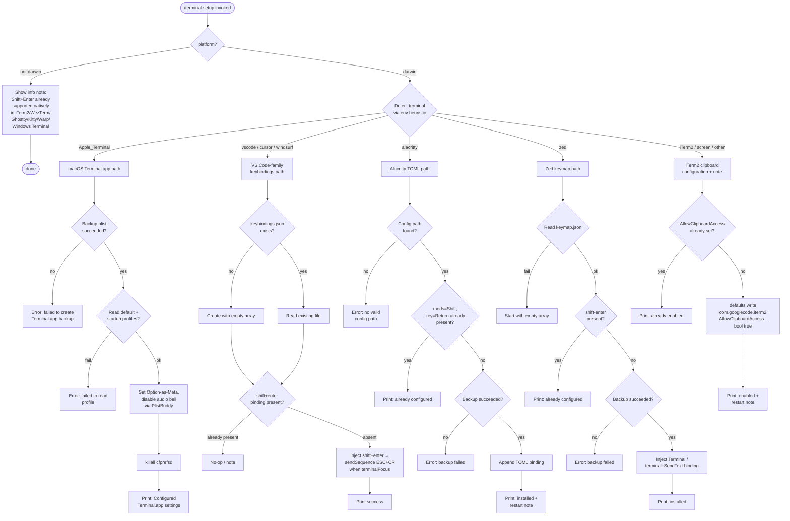

# `/terminal-setup`

> Analysis basis: CC v2.1.147 bundle.js (AST extraction + Claude interpretation)
> Minimum version: v2.1.147

---

## Overview

`/terminal-setup` installs a Shift+Enter key binding for inserting newlines in the user's terminal environment. It detects the active terminal emulator or editor host at runtime, then applies the appropriate configuration change (plist edit, JSON keybindings file, or TOML config) so that Shift+Enter sends a newline rather than submitting input. On macOS with Apple Terminal it also enables "Use Option as Meta key" and switches to a visual bell.

---

## Registration

| Field | Value |
|---|---|
| type | `local-jsx` |
| name | `terminal-setup` |
| description | Install Shift+Enter key binding for newlines |
| loc_byte | 11836963 |
| loc_byte_end | 11837595 |
| loc_line | 9722 |
| module_id | `wQ9` |
| load_inline | `true` |
| arbor_handler.name | `U_L` |
| arbor_handler.fqn | `claude-2.1.147::U_L` |
| arbor_handler.kind | `AsyncFunction` |
| arbor_handler.resolution_path | `module_id` |
| arbor_handler.n_hits | 1 |

Analysis basis: CC v2.1.147 bundle.js:+11836963

---

## Input Branching

The command branches across 6+ distinct terminal/editor targets plus a platform check, so a Mermaid flowchart is used.



---

## Behavioral Spec

### Handler entry point — `terminalSetupHandler` (`U_L`)

The async handler is the top-level entry resolved by Arbor as `U_L` via `module_id` path.

```
async function terminalSetupHandler():
    platform = Je.platform()          // os.platform()
    if platform != "darwin":
        printNote("Note: iTerm2, WezTerm, Ghostty, Kitty, Warp, and Windows Terminal support Shift+Enter natively.")
        return

    terminalId = detectTerminal()     // calls DQ9
    runITermSetup()                   // calls DQ9 for iTerm2 clipboard

    note = detectShiftEnterNote()     // optional UX note
    results = []

    results += runVSCodeFamilySetup() // Y3_ / z3_ for vscode, cursor, windsurf
    results += runAlacrittySetup()    // g_L
    results += runZedSetup()          // Q_L
    if platform == "darwin" and terminalId contains "Apple_Terminal":
        results += runTerminalAppSetup()  // F_L → KQ9 + $Q9 + OQ9

    displayResults(results)
```

Analysis basis: CC v2.1.147 bundle.js:+3928082

---

### Terminal detection — `detectTerminal` (`DQ9`)

```
function detectTerminal():
    // Reads TERM_PROGRAM or similar environment variable
    // Trims whitespace, renders dim-styled label for UI
    // Checks env for values: "Apple_Terminal", "vscode", "cursor",
    //   "windsurf", "alacritty", "zed", "iTerm.app", "screen"
    // Returns matched identifier string or "your current terminal"
```

Analysis basis: CC v2.1.147 bundle.js:+3927074

Known terminal identifier literals (bundle.js:+3926162–3926319):

| Literal | Meaning |
|---|---|
| `"darwin"` | macOS platform check |
| `"Apple_Terminal"` | macOS Terminal.app |
| `"vscode"` | Visual Studio Code |
| `"cursor"` | Cursor editor |
| `"windsurf"` | Windsurf editor |
| `"alacritty"` | Alacritty terminal |
| `"zed"` | Zed editor |
| `"iTerm.app"` | iTerm2 terminal |
| `"screen"` | GNU screen multiplexer |

---

### macOS Terminal.app setup — `terminalAppSetup` (`F_L`)

```
async function terminalAppSetup():
    // 1. Backup existing plist via backupPlist (KQ9)
    //    Path: ~/Library/Preferences/com.apple.Terminal.plist
    //    If backup fails → throw "Failed to create backup of Terminal.app preferences, bailing out"

    // 2. Read default profile name via PlistBuddy:
    //    /usr/libexec/PlistBuddy -c "read ..." <plist>
    //    Key: "Default Window Settings"
    //    If fails → throw "Failed to read default Terminal.app profile"

    // 3. Read startup profile name:
    //    Key: "Startup Window Settings"
    //    If fails → throw "Failed to read startup Terminal.app profile"

    // 4. For each profile (default + startup):
    //    - Set Option-as-Meta key via $Q9 (PlistBuddy write)
    //    - Set visual bell (disable audio bell) via OQ9
    //    If both fail → throw "Failed to enable Option as Meta key or disable audio bell for any Terminal.app profile"

    // 5. Run: killall cfprefsd   (to flush preference daemon)

    // 6. Emit success items:
    //    "- Enabled \"Use Option as Meta key\""
    //    "- Switched to visual bell"
    //    "Shift+Return will now enter a newline."
    //    "Option+Enter will now enter a newline."
    //    "You must restart Terminal.app for changes to take effect."
```

Analysis basis: CC v2.1.147 bundle.js:+3934307

---

### Plist backup utility — `backupPlistFile` (`KQ9`)

```
async function backupPlistFile(plistPath):
    // Resolves: ~/Library/Preferences/com.apple.Terminal.plist
    //   using: path.join(os.homedir(), "Library", "Preferences", "com.apple.Terminal.plist")
    // Runs: defaults export com.apple.Terminal <tmpPath>
    //   via the shell-command runner (T8 / RH)
    // Stats the output to verify it was written
    // On failure → returns error sentinel
    // Copies exported file to backup location (x_L)
```

Analysis basis: CC v2.1.147 bundle.js:+3922372 – 3922610

---

### VS Code-family keybindings setup — `vscodeSetup` (`Y3_`) and `cursorWindsurfSetup` (`z3_`)

Both functions follow the same structure; they differ only in config-path resolution via `W3_`.

```
async function vscodeKeybindingsSetup(editorName):
    configDir = resolveVSCodeConfigDir(editorName)  // W3_
    // Windows: %APPDATA%\Code\User
    // macOS:   ~/Library/Application Support/Code/User
    // Linux:   ~/.config/Code/User
    // (Cursor → "Cursor", Windsurf → "Windsurf")

    kbPath = path.join(configDir, "keybindings.json")
    fs.mkdir(configDir, { recursive: true })

    raw = await fs.readFile(kbPath, "utf-8") catch "[]"
    parsed = parseJsonWithComments(raw)   // cx6

    if not Array.isArray(parsed): parsed = []

    // Check if shift+enter binding already present
    existing = parsed.find(entry => entry.key == "shift+enter"
                                 && entry.command == "workbench.action.terminal.sendSequence")
    if existing:
        return { status: "already configured" }

    // Backup current file (f$6.randomBytes used for backup name)
    await fs.copyFile(kbPath, backupPath)

    // Inject new binding entry:
    //   { key: "shift+enter",
    //     command: "workbench.action.terminal.sendSequence",
    //     args: { text: "\x1b\r" },
    //     when: "terminalFocus" }
    parsed = insertBinding(parsed, newEntry)   // PXA / JXA
    await fs.writeFile(kbPath, JSON.stringify(parsed, null, 2))

    if editorName == "VSCode":
        emit warning about remote server paths
          (.vscode-server / .cursor-server / .windsurf-server)

    return { status: "success", message: "Shift+Enter binding installed" }
```

Analysis basis: CC v2.1.147 bundle.js:+3931573, +3932693, +3932715, +3932767, +3932782

---

### Alacritty setup — `alacrittySetup` (`g_L`)

```
async function alacrittySetup():
    // Resolve config path; search standard locations for alacritty.toml
    // platform = Je.platform()
    // homedir  = Je.homedir()
    configPath = findAlacrittyConfig()
    if not configPath:
        throw "No valid config path found for Alacritty"

    raw = await fs.readFile(configPath, "utf-8")

    // Check idempotency using two markers:
    //   contains 'mods = "Shift"' AND 'key = "Return"'
    if alreadyConfigured(raw):
        return { status: "already configured",
                 message: "Alacritty Shift+Enter key binding already configured" }

    // Backup existing config file
    backupPath = configPath + ".backup." + randomHex
    await fs.copyFile(configPath, backupPath)
    if backup fails:
        throw "Error backing up existing Alacritty config. Bailing out."

    // Append TOML binding block to end of file
    // (or create [[keyboard.bindings]] section)
    newContent = raw + tomlShiftEnterBlock
    await fs.writeFile(configPath, newContent)

    return {
        status: "success",
        message: "Installed Alacritty Shift+Enter key binding",
        note:    "You may need to restart Alacritty for changes to take effect"
    }
```

Analysis basis: CC v2.1.147 bundle.js:+3936042, +3936403, +3936471, +3936501, +3936544

---

### Zed setup — `zedSetup` (`Q_L`)

```
async function zedSetup():
    keymapPath = path.join(os.homedir(), "keymap.json")
    fs.mkdir(dir, { recursive: true })

    raw = await fs.readFile(keymapPath, "utf-8") catch "[]"
    parsed = JSON.parse(raw)   // B6
    if not Array.isArray(parsed): parsed = []

    // Idempotency check: find entry with key == "shift-enter"
    if parsed.find(e => e.key == "shift-enter"):
        return { status: "already configured",
                 message: "Zed Shift+Enter key binding already configured" }

    // Backup
    backupPath = keymapPath + ".backup." + randomHex
    await fs.copyFile(keymapPath, backupPath)
    if fails: throw "Error backing up existing Zed keymap. Bailing out."

    // Inject new binding:
    //   { context: "Terminal",
    //     bindings: { "shift-enter": "terminal::SendText" } }
    parsed.push(newEntry)
    await fs.writeFile(keymapPath, JSON.stringify(parsed, null, 2))

    return { status: "success",
             message: "Installed Zed Shift+Enter key binding" }
```

Analysis basis: CC v2.1.147 bundle.js:+3937507, +3937557, +3937723, +3938176, +3938212, +3938323

---

### iTerm2 clipboard setup — `iterm2Setup` (`DQ9` sub-path)

```
async function iterm2ClipboardSetup():
    // Read current value:
    //   defaults read com.googlecode.iterm2 AllowClipboardAccess
    current = runDefaults("read", "com.googlecode.iterm2", "AllowClipboardAccess")

    if current == "1" or current trimmed == "1":
        return { status: "already enabled",
                 message: "iTerm2 clipboard access already enabled" }

    // Write:
    //   defaults write com.googlecode.iterm2 AllowClipboardAccess -bool true
    result = runDefaults("write", "com.googlecode.iterm2", "AllowClipboardAccess", "-bool", "true")

    if result fails:
        return { status: "error",
                 message: "Couldn't update iTerm2 clipboard setting." }

    return {
        status: "success",
        message: "Enabled \"Applications in terminal may access clipboard\" in iTerm2",
        note: "Restart iTerm2 for this to take effect. Undo: defaults write com.googlecode.iterm2 AllowClipboardAccess -bool false"
    }
```

Analysis basis: CC v2.1.147 bundle.js:+3927139, +3927163, +3927238, +3927523, +3927606

---

### Shell command runner — `runCommand` (`T8` / `RH`)

```
async function runCommand(argv: string[]):
    // Spawns subprocess, collects stdout/stderr
    // Returns { stdout, stderr, exitCode }
    // On error: logs via Gl.logError
    // Uses queue (FpK: lb6.shift / lb6.push) to serialize concurrent calls
    // Timeout: <!-- TODO: not found in depth-2 traversal; needs --depth 4 -->
```

Analysis basis: CC v2.1.147 bundle.js:+1044173, +965923

---

## State & Side Effects

| Item | Detail |
|---|---|
| Telemetry | `tengu_config_auth_loss_prevented` (bundle.js:+3182196) |
| Telemetry | `tengu_bg_spare_enable` (bundle.js:+15117130) |
| Telemetry | `tengu_bg_low_mem_mb` (bundle.js:+12461757) |
| Telemetry | `tengu_bg_spare_spawn` (bundle.js:+15117490) |
| Telemetry | `tengu_config_lock_contention` (bundle.js:+3184859) |
| Telemetry | `tengu_config_stale_write` (bundle.js:+3184995) |
| Telemetry | `tengu_config_parse_error` (bundle.js:+3187440) |
| Telemetry | `tengu_feature_ok` (bundle.js:+960829) |
| File writes | `keybindings.json` (VS Code / Cursor / Windsurf) |
| File writes | `settings.json` (VS Code settings path, referenced at +3930482) |
| File writes | `alacritty.toml` or existing Alacritty config |
| File writes | `keymap.json` (Zed) |
| File writes | `~/Library/Preferences/com.apple.Terminal.plist` (macOS Terminal.app, via `defaults export` + PlistBuddy) |
| Backup files | Each modified config is backed up with `f$6.randomBytes`-derived name before writing |
| External process | `defaults read/write/export` — macOS `defaults` CLI |
| External process | `/usr/libexec/PlistBuddy` — plist editor |
| External process | `killall cfprefsd` — flush macOS preference daemon |
| Config lock | `_L_` acquires a write lock; contention logged as `tengu_config_lock_contention` |
| appState changes | `onboarding_project_complete` flag set via `nFH` path (bundle.js:+3921631) |
| Sound | Visual bell substituted for audio bell in Terminal.app (side effect, not a CLI sound event) |

---

## Version History

| Version | Change |
|---|---|
| v2.1.147 | Initial analysis |

---

## Common Mistakes

1. **Running on non-macOS and expecting configuration changes**: On platforms other than `"darwin"`, the command prints an informational note and exits without modifying any config files. Shift+Enter support is assumed to be native in the listed terminals.
2. **Not restarting the terminal after setup**: The command emits explicit restart-required messages for Terminal.app and Alacritty. Failing to restart means the key binding has no effect even though the config was written successfully.
3. **Running inside a VS Code Remote SSH session**: The keybindings file is written to the host machine's VS Code config directory. For remote development (`.vscode-server`, `.cursor-server`, `.windsurf-server`) the binding may need to be added on the remote side as well; the command emits a warning for this case.
4. **Concurrent Claude instances during plist write**: If another Claude process holds the config lock when Terminal.app plist is being updated, `tengu_config_lock_contention` is emitted and the write may be skipped to avoid data loss (GH #3117 guard).
5. **Expecting idempotency to be silent**: Re-running the command when a binding is already present prints an "already configured" message and returns without error, which is correct behavior — not a bug.

---

## Appendix — Identifier Mapping

> For bundle debugging only. Identifiers change across versions.

| Identifier | Role |
|---|---|
| `U_L` | Main async handler for `/terminal-setup` (arbor_handler) |
| `JEH` | Platform detection helper (wraps `Je.platform`) |
| `lH8` | Top-level per-terminal dispatch router |
| `F_L` | macOS Terminal.app full setup orchestrator |
| `KQ9` | Terminal.app plist backup function |
| `rFH` | Plist path resolver (`~/Library/Preferences/com.apple.Terminal.plist`) |
| `T8` | Shell command runner (spawns subprocess) |
| `T_` | Command execution core / output collector |
| `b6` | Command queue / concurrency serializer |
| `x_L` | Backup file copy utility |
| `M8` | Global config read/write with lock |
| `RH` | Subprocess result handler / error logger |
| `n_` | Error constructor wrapper |
| `UH` | String coercion utility |
| `j1` | Network traffic classifier (essential-traffic) |
| `FpK` | Command queue shift/push operations |
| `q` | File operations set (unlinkSync, etc.) |
| `L` | Async operation tracker (add/finally/delete) |
| `M` | Stream/connection closer (close methods) |
| `A` | Case-normalizer (toLowerCase) |
| `$Q9` | PlistBuddy Option-as-Meta key writer |
| `N` | Telemetry / analytics event emitter |
| `vJK` | Analytics sub-router |
| `H` | Random delay / Math.random helper |
| `CH` | JSON.stringify wrapper |
| `_` | String upper-case / replace utility |
| `f4` | Path fragment extractor (lastIndexOf/slice) |
| `lRH` | Locale/string normalizer |
| `kJK` | Buffered network write helper |
| `OQ9` | PlistBuddy audio-bell disabler |
| `iFH` | Config file reader (uses M8) |
| `IA` | ANSI color string parser / renderer |
| `F$H` | Chalk/color mapping dispatcher (P6.*) |
| `Zg` | Fallback/plain text renderer |
| `D` | Background-process spare pool manager |
| `V6` | Spare process slot creator |
| `Df6` | Spare process config builder |
| `wf6` | Spare process env builder |
| `Ct` | String coercion + path resolver for processes |
| `As6` | Spare pool registry accessor |
| `x6` | Process entry factory (Date.now stamped) |
| `$` | Disposable resource wrapper |
| `ZC1` | Telemetry flush / metrics recorder |
| `sG8` | Low-memory spare-pool monitor |
| `V6A` | Background PTY spawner (Bun.spawn) |
| `_1` | Random hex generator seed |
| `gw1` | Spare socket path builder |
| `Qw1` | Spare lock path builder |
| `Hc` | Spare working-dir path resolver |
| `Hj5` | PTY host config builder |
| `aw5` | PTY environment merger (Object.assign) |
| `Ny` | PTY exit-log path writer |
| `c` | Shared constant / config singleton accessor |
| `Az` | App-state updater |
| `q8` | Error code classifier (ENOENT, EACCES, …) |
| `QH8` | Terminal.app plist import-and-verify helper |
| `u_L` | Process entry lookup (x6 wrapper) |
| `Y3_` | VS Code keybindings installer |
| `D3_` | Remote-server directory detector (.vscode-server etc.) |
| `W3_` | VS Code user-config directory resolver (platform-aware) |
| `cx6` | JSON-with-comments parser |
| `OC` | Comment-strip / prefix-trim utility |
| `t9` | File-error classifier (ENOENT guard) |
| `fb` | Hyperlink renderer (pathToFileURL) |
| `zX` | Terminal hyperlink support detector |
| `WJ` | Hyperlink escape sequence builder |
| `PXA` | JSON keybinding insert operation (for VS Code array) |
| `XF8` | JSON AST insert-at-index helper |
| `fXA` | JSON AST node manipulator (insertion) |
| `WF8` | JSON AST slice / modify helper |
| `Qx6` | JSON substring extractor |
| `z3_` | Cursor/Windsurf keybindings installer |
| `JXA` | JSON keybinding insert (Cursor/Windsurf variant) |
| `g_L` | Alacritty TOML binding installer |
| `Q_L` | Zed keymap installer |
| `B6` | JSON.parse wrapper |
| `nFH` | Onboarding completion notifier |
| `o$` | Config HBH accessor + x6 process-entry lookup |
| `eg9` | Onboarding step tracker |
| `L3_` | CLAUDE.md workspace file locator |
| `F6` | Filesystem existence checker |
| `jx6` | File stat + J8 reader |
| `jz` | Project config writer (with lock) |
| `_L_` | Config file write-with-backup-and-lock |
| `n99` | Config object merger (Object.assign) |
| `k$H` | Config read-with-parse (readFileSync + JSON) |
| `Wf6` | Config cache invalidator |
| `AL_` | Backup directory path resolver |
| `Z` | Version-prefix checker (startsWith) |
| `X` | SDK connection manager |
| `V` | Config version slice |
| `sq6` | Atomic file write (open/fchmod/fsync/rename) |
| `sUH` | Config schema validator |
| `tUH` | Config timestamp stamper (Date.now) |
| `HL_` | File write with directory creation |
| `bH` | Feature flag checker |
| `X3_` | Generic plist-via-defaults reader |
| `B_L` | Defaults command builder |
| `P3_` | Process entry getter (x6) |
| `j3_` | Process entry getter variant |
| `J3_` | Process entry getter variant 2 |
| `DQ9` | iTerm2 clipboard setup + terminal-ID renderer |
| `dH8` | Shift+Enter note generator (backslash hint) |