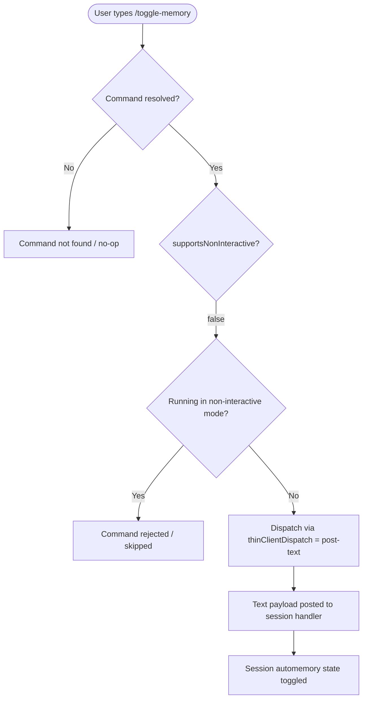

# `/toggle-memory`

> Analysis basis: CC v2.1.144 bundle.js (AST extraction + Claude interpretation)
> Minimum version: v2.1.144

---

## Overview

The `/toggle-memory` command switches the automemory feature on or off for the current session. It is a session-scoped toggle, meaning the change applies only to the active Claude Code session and does not persist globally across unrelated sessions. The command is dispatched via the thin-client post-text mechanism, indicating its action is processed by submitting text rather than executing a local-only side effect.

---

## Registration

| Field | Value |
|---|---|
| type | `local` |
| name | `toggle-memory` |
| description | `Toggle automemory off/on for this session` |
| supportsNonInteractive | `false` |
| thinClientDispatch | `post-text` |
| isHidden | `false` |
| module_id | `jMq` |

Analysis basis: CC v2.1.144 bundle.js:+10636229

---

## Input Branching

Because the AST depth-2 traversal returned an empty call graph and no literals for module `jMq`, the internal branching logic of this command's entry function could not be reconstructed from the extracted data.

<!-- TODO: not found in depth-2 traversal; needs --depth 4 -->

What can be stated from registration metadata alone is the following dispatch path:



Analysis basis: CC v2.1.144 bundle.js:+10636229

---

## Behavioral Spec

### Command Dispatch — Post-Text Mechanism

The `thinClientDispatch` field is set to `post-text`, which means the command does not execute a fully local imperative function to completion on its own. Instead, it posts a text representation of the toggle action into the session's message pipeline for handling by the thin-client layer.

```
function dispatchToggleMemory(session):
    if session.isNonInteractive:
        return REJECTED  // supportsNonInteractive is false

    payload = buildPostTextPayload(command = "toggle-memory")
    session.thinClientChannel.post(payload)
    // Thin-client handler receives payload and mutates automemory state
```

Analysis basis: CC v2.1.144 bundle.js:+10636229

### Non-Interactive Mode Guard

Because `supportsNonInteractive` is `false`, the command is not available when Claude Code is invoked in a scripted or headless (non-interactive) context.

```
function guardNonInteractive(context):
    if context.mode == NON_INTERACTIVE:
        emit error or silently skip
        return
    proceed with toggle dispatch
```

Analysis basis: CC v2.1.144 bundle.js:+10636229

### Automemory State Toggle

Based on the command description ("Toggle automemory off/on for this session"), the command flips a boolean automemory flag scoped to the current session. The exact state variable name and storage location are:

<!-- TODO: not found in depth-2 traversal; needs --depth 4 -->

The general toggle pattern, inferred from description and dispatch type, is:

```
function toggleAutoMemory(sessionState):
    current = sessionState.autoMemoryEnabled
    sessionState.autoMemoryEnabled = NOT current
    notify user of new state (on or off)
```

### Visibility

The command is not hidden (`isHidden: false`), so it appears in the slash-command autocomplete and help listings available to the user.

Analysis basis: CC v2.1.144 bundle.js:+10636229

---

## State & Side Effects

| Item | Detail |
|---|---|
| Telemetry | <!-- TODO: not found in depth-2 traversal; needs --depth 4 --> |
| Hook registration | <!-- TODO: not found in depth-2 traversal; needs --depth 4 --> |
| appState changes | Automemory enabled/disabled flag toggled for the current session (exact field name not recovered at depth 2) |
| Sound | <!-- TODO: not found in depth-2 traversal; needs --depth 4 --> |
| Dispatch side effect | Posts a text payload via `thinClientDispatch = post-text` into the session pipeline |
| Scope | Session-scoped; does not affect other sessions or global configuration |
| Non-interactive | Command is rejected (not executed) when running in non-interactive mode |

---

## Version History

| Version | Change |
|---|---|
| v2.1.144 | Initial analysis; registration confirmed at bundle.js:+10636229 |

---

## Common Mistakes

1. **Running in non-interactive / scripted mode**: Because `supportsNonInteractive` is `false`, invoking `/toggle-memory` from a script or headless pipeline will not work. Use interactive sessions only.
2. **Expecting global persistence**: The command description explicitly scopes the toggle to "this session." Do not expect the automemory state set by this command to carry over to new sessions without additional configuration.
3. **Confusing toggle direction**: The command alternates state each invocation. Invoking it twice in succession returns automemory to its original state. Users who want a guaranteed final state (always on or always off) should confirm the current state before or after invoking.
4. **Assuming immediate model-side effect**: Because dispatch is `post-text`, the toggle is mediated through the thin-client message pipeline and is not a pure local synchronous mutation. Any timing assumptions about when the toggle takes effect within a rapid command sequence may be incorrect.

---

## Appendix — Identifier Mapping

> For bundle debugging only. Identifiers change across versions.

| Identifier | Role |
|---|---|
| `jMq` | Module ID containing the `/toggle-memory` command registration and implementation (not an obfuscated function name; included for bundle lookup reference) |

> No obfuscated function-level identifiers were recovered during the depth-2 AST traversal of module `jMq`. The `identifiers` array returned empty.
> <!-- TODO: not found in depth-2 traversal; needs --depth 4 -->