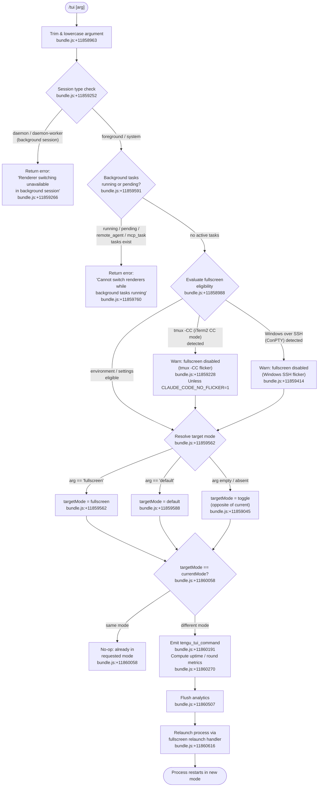

# `/tui`

> Analysis basis: CC v2.1.147 bundle.js (AST extraction + Claude interpretation)
> Minimum version: v2.1.147

---

## Overview

The `/tui` command switches the terminal UI renderer between `default` and `fullscreen` modes at runtime. It validates the current session context (foreground vs. background, active background tasks, environment constraints) before applying the change, and if the new mode differs from the current one it relaunches the process using the alternate rendering path.

---

## Registration

| Field | Value |
|---|---|
| type | `local-jsx` |
| name | `tui` |
| description | `Set the terminal UI renderer (default \| fullscreen)` |
| argumentHint | `[default\|fullscreen]` |
| module_id | `uN1` |
| load_inline | `true` |
| loc_byte | `11860988` |
| loc_byte_end | `11861170` |
| loc_line | `9725` |
| arbor_handler.name | `jU7` |
| arbor_handler.fqn | `claude-2.1.147::jU7` |
| arbor_handler.kind | `AsyncFunction` |
| arbor_handler.resolution_path | `module_id` |
| arbor_handler.n_hits | `0` |

Analysis basis: CC v2.1.147 bundle.js:+11860988

---

## Input Branching

The command has six or more distinct branches based on argument value, session mode, and environment state, so a Mermaid flowchart is used.



Analysis basis: CC v2.1.147 bundle.js:+11858963 through +11860642

---

## Behavioral Spec

### 1. Argument Normalisation

```
function normaliseArgument(rawInput):
    trimmed = rawInput.trim()            // bundle.js:+11858963
    return trimmed.toLowerCase()         // bundle.js:+15143715
```

The argument is always case-folded before any comparison. Unrecognised values fall through to the mode-toggle path.

Analysis basis: CC v2.1.147 bundle.js:+11858963, +15143715

---

### 2. Session-Type Guard

```
function checkSessionType(sessionType):
    // sessionType sourced from Rq → T3H
    // bundle.js:+11859252
    if sessionType in ["daemon", "daemon-worker"]:
        return error(
            "Renderer switching isn't available in a background session"
            + " — press ← to detach and run /tui from a foreground session."
        )                                // bundle.js:+11859266
    return ok
```

Literal error string: `"Renderer switching isn't available in a background session — press ← to detach and run /tui from a foreground session."` (bundle.js:+11859266).

Analysis basis: CC v2.1.147 bundle.js:+11859252, +11859266

---

### 3. Active Background-Task Guard

```
function checkBackgroundTasks(taskList):
    // Object.values called at bundle.js:+11859591
    for task in taskList:
        if task.status in ["running", "pending"]
          or task.type in ["remote_agent", "mcp_task"]:
            return error(
                "Cannot switch renderers while background tasks are running"
                + " — wait for them to finish (or stop them via /tasks),"
                + " then run /tui again."
            )                            // bundle.js:+11859760
    return ok
```

Status strings checked: `"running"` (+11859630), `"pending"` (+11859652); type strings: `"remote_agent"` (+11859673), `"mcp_task"` (+11859698).

Analysis basis: CC v2.1.147 bundle.js:+11859591–+11859760

---

### 4. Fullscreen Eligibility Resolution

The handler delegates to the fullscreen-eligibility function (call chain `jU7 → HA → Km`, bundle.js:+11858988) which loads settings and evaluates environment variables and terminal capabilities:

```
function resolveFullscreenEligibility(environment, settings):
    // loadSettingsFromDisk called: bundle.js:+1213271
    // Checks CLAUDE_CODE_NO_FLICKER env var: bundle.js:+11857273
    // Checks CLAUDE_CODE_DISABLE_ALTERNATE_SCREEN: bundle.js:+11857298
    // Checks CLAUDE_CODE_FORCE_FULLSCREEN_UPSELL: bundle.js:+11857337

    if tmuxControlModeActive(environment):        // bundle.js:+3351228
        if CLAUDE_CODE_NO_FLICKER not set:
            return disabled reason "tmux_cc_auto_off"  // +3352093
        // else: override accepted

    if windowsOverSSH(environment):               // bundle.js:+3351414
        if CLAUDE_CODE_NO_FLICKER not set:
            return disabled reason "win_ssh_auto_off"  // +3352127

    // Additional eligibility signals checked:
    // bg_forced_on (+3351981), env_off (+3352011), env_on (+3352069)
    // settings_on (+3352186), settings_off (+3352220)
    // downsell_on (+3352293), gb_on (+3352358), gb_off (+3352366)

    return eligibility object
```

**tmux -CC detection**: spawns `tmux display-message -p '#{client_control_mode}'` with a 2000 ms timeout (bundle.js:+3350482, +3350505, +3350556); checks that `$TERM_PROGRAM` starts with `"iTerm.app"` (+3350204) and that session starts with `"screen"` or `"tmux"` (+3350272, +3350297).

**Windows-over-SSH detection**: checks `process.platform == "windows"` (+3350766) and inspects SSH-related environment state (+3351414).

Analysis basis: CC v2.1.147 bundle.js:+11858988, +3350204–+3352366, +11857273–+11857337

---

### 5. Mode Resolution and Toggle Logic

```
function resolveTargetMode(arg, currentMode):
    if arg == "fullscreen":
        return "fullscreen"              // bundle.js:+3351562
    if arg == "default":
        return "default"                 // bundle.js:+3351588
    // no argument: toggle
    if currentMode == "fullscreen":
        return "default"
    else:
        return "fullscreen"
    // currentMode sourced via u$H call chain: bundle.js:+11859931
```

Analysis basis: CC v2.1.147 bundle.js:+11859045, +3351562, +3351588, +11859931

---

### 6. No-Op Check

```
function applyModeChange(targetMode, currentMode, eligibility):
    // nv() checks IDE terminal type (Cursor, VSCode, JetBrains)
    // bundle.js:+11860058
    if targetMode == currentMode:
        return noOp                      // already in desired mode
    // else fall through to relaunch
```

The IDE-terminal detection (via `nv`, bundle.js:+11860058) checks for Cursor (+3422381), VSCode (+3422430), and JetBrains (+3421712) terminal identifiers, and probes xterm.js version bounds (1092000–1105000, bundle.js:+3422506, +3422517).

Analysis basis: CC v2.1.147 bundle.js:+11860058

---

### 7. Telemetry Emission and Metrics

```
function emitTuiCommandEvent(targetMode, eligibility, uptime):
    emit("tengu_tui_command", {          // bundle.js:+11860191
        targetMode,
        eligibility,
        uptime: Math.round(process.uptime() * 1000)  // bundle.js:+11860270–+11860281
    })
```

If the command is refused by the background-task guard, `tengu_tui_refused` is emitted instead (+11859719).

Analysis basis: CC v2.1.147 bundle.js:+11859719, +11860191, +11860270

---

### 8. Relaunch Sequence

```
async function relaunchInNewMode(targetMode):
    await flushAnalytics(Q1)             // bundle.js:+11860507
    initRelaunchContext(rC)              // bundle.js:+11860501
    await fullscreenRelaunchHandler(     // bundle.js:+11860616
        xN1 → FJH
    )
    // FJH performs:
    //   - stat check on binary path: bundle.js:+11855768
    //   - flush pending writes (WRH → D9A.drain): bundle.js:+11855934
    //   - flush analytics with 30 000 ms timeout: bundle.js:+11855883
    //   - remove all signal listeners: bundle.js:+11856385
    //   - register SIGINT/SIGTERM/SIGHUP: bundle.js:+11856356–+11856375
    //   - spawnSync new process with inherited stdio: bundle.js:+11856442, +11856477
    //   - process.exit on completion: bundle.js:+11856691
```

The relaunch spawns with `process.removeAllListeners` first (+11856385), then re-registers signal handlers before calling `hN1.spawnSync` (+11856442). The `--resume` flag is passed to the spawned process (+11855821).

Analysis basis: CC v2.1.147 bundle.js:+11860501–+11856691

---

## State & Side Effects

| Item | Detail |
|---|---|
| Telemetry: `tengu_tui_refused` | Fired when background tasks block the switch (bundle.js:+11859719) |
| Telemetry: `tengu_tui_command` | Fired on every accepted mode change, carries target mode and uptime (bundle.js:+11860191) |
| Telemetry: `tengu_amber_creek` | Fired during fullscreen eligibility evaluation (bundle.js:+3351745) |
| Telemetry: `tengu_pewter_brook` | Fired during fullscreen eligibility evaluation (bundle.js:+3351653) |
| Telemetry: `tengu_scroll_summary` | Fired during relaunch scroll-state capture (bundle.js:+5274361) |
| Telemetry: `tengu_slate_kestrel` | Fired during session/plan context resolution (bundle.js:+4671398) |
| Telemetry: `tengu_bg_dispatch_sigkill_escalate` | Background-worker signal escalation during shutdown (bundle.js:+15117797) |
| Telemetry: `tengu_bg_dispatch_low_mem` | Low-memory condition in background dispatch (bundle.js:+15118376) |
| Telemetry: `tengu_bg_spare_enable` | Spare background slot enabled (bundle.js:+15119071) |
| Telemetry: `tengu_bg_spare_claim` | Spare background slot claimed (bundle.js:+15119192) |
| Telemetry: `tengu_bg_spare_claim_fail` | Spare background slot claim failed (bundle.js:+15119455) |
| Telemetry: `tengu_daemon_control` | Daemon lifecycle event (bundle.js:+15153889) |
| Settings load | `loadSettingsFromDisk` runs on every `/tui` invocation to evaluate eligibility (bundle.js:+1213271) |
| Environment variables read | `CLAUDE_CODE_NO_FLICKER` (+11857273), `CLAUDE_CODE_DISABLE_ALTERNATE_SCREEN` (+11857298), `CLAUDE_CODE_FORCE_FULLSCREEN_UPSELL` (+11857337) |
| Analytics flush | All pending analytics are flushed before relaunch with a 30 000 ms timeout (bundle.js:+11855883) |
| Process relaunch | On mode change, the main process is replaced via `spawnSync` with `--resume` (bundle.js:+11856442, +11855821) |
| Signal handler reset | All existing listeners removed and SIGINT/SIGTERM/SIGHUP re-registered before spawn (bundle.js:+11856385, +11856356) |
| Cache clear | Two internal caches (`bI6`, `pI8`) are cleared on settings reload (bundle.js:+26086, +26098) |
| Sound | None observed in depth-2 traversal |

---

## Version History

| Version | Change |
|---|---|
| v2.1.147 | Initial analysis |

---

## Common Mistakes

1. **Running `/tui` in a background (daemon) session**: The command explicitly blocks mode switching when the session type is `"daemon"` or `"daemon-worker"`. Detach to a foreground session first.
2. **Running `/tui` while background tasks are active**: Tasks with status `"running"` or `"pending"`, or type `"remote_agent"` / `"mcp_task"`, will cause the command to refuse. Use `/tasks` to stop them first.
3. **Expecting fullscreen to work under tmux -CC without the override**: When iTerm2's tmux integration mode is active, fullscreen is automatically disabled. Set `CLAUDE_CODE_NO_FLICKER=1` to override this guard.
4. **Expecting fullscreen to work over Windows SSH (ConPTY)**: Same automatic disable applies. `CLAUDE_CODE_NO_FLICKER=1` overrides it.
5. **Running `/tui` with no argument and expecting a predictable result**: No argument triggers a toggle (default ↔ fullscreen). If the current mode is unknown to the user, the result may be surprising; pass `default` or `fullscreen` explicitly for deterministic behaviour.
6. **Interrupting the process during the relaunch window**: The relaunch path removes all signal listeners before re-registering them. Sending a signal in this brief window may not behave as expected.

---

## Appendix — Identifier Mapping

> For bundle debugging only. Identifiers change across versions.

| Identifier | Role |
|---|---|
| `jU7` | Main handler for `/tui` (AsyncFunction, resolved via module_id `uN1`) |
| `A` | Argument string variable / general intermediate |
| `M` | Mode/string working variable |
| `q` | File/resource handle working variable |
| `L` | Task/list/set working variable |
| `HA` | Settings-load entry point (calls `Km`) |
| `Km` | `loadSettingsFromDisk` orchestrator |
| `gR` | Settings sub-loader (flag settings) |
| `Wq` | Performance mark helper (uses `perf_hooks`) |
| `pu` | `require` wrapper for `perf_hooks` |
| `Xg8` | Settings telemetry / load-completion emitter |
| `C8` | File append/log helper |
| `uI6` | Settings merge utility |
| `U16` | Flag-settings applicator |
| `jWA` | Key iteration helper for settings objects |
| `K` | Column padding helper (padEnd) |
| `AfH` | User-settings file path resolver |
| `XF` | Project-settings loader |
| `YWA` | SDK inline settings handler |
| `WF` | Settings field builder / compositor |
| `w_` | Process/environment context reader |
| `k86` | Settings field: key 86 variant a |
| `tk8` | Settings field: key 8 variant t |
| `Z86` | Settings field: key 86 variant Z |
| `TXH` | Settings field: TXH variant |
| `y86` | Settings field: key 86 variant y |
| `tMH` | Settings field: tMH variant |
| `eMH` | Settings field: eMH variant |
| `Og8` | Settings field: Og8 variant |
| `o2A` | Settings field: o2A variant |
| `Nl` | Settings field: Nl variant |
| `B16` | WSL-detection helper |
| `xI6` | Settings post-processor |
| `z9` | Fullscreen eligibility resolver (called from `jU7`) |
| `VbH` | Known-set membership checker |
| `G7_` | Color / terminal string formatter |
| `r1` | String coercion helper (String constructor) |
| `UH` | String coercion / normalisation helper |
| `bn` | tmux control-mode detection helper |
| `Al4` | tmux spawn-sync wrapper |
| `_l4` | Terminal program prefix checker (iTerm.app) |
| `N` | Logger / telemetry emitter |
| `vJK` | Log-file writer orchestrator |
| `j9A` | Node/Deno detection helper |
| `H` | Random/timer utility |
| `CH` | JSON serialisation helper |
| `_` | General array/set variable |
| `f4` | Log line formatter |
| `l1A` | Log-level mapper |
| `lRH` | Buffered write helper |
| `b1A` | Stream write helper |
| `kJK` | File-based logger writer |
| `XRH` | Batch flush / drain helper |
| `XAH` | Log-dir join helper |
| `F6` | Error-type guard / normaliser |
| `C_6` | Error code classifier |
| `e1A` | Log-path join helper |
| `t1A` | Log-file rotation helper |
| `IJK` | Async append-file writer |
| `r9` | `FinalizationRegistry` registration helper |
| `W7_` | Windows-over-SSH detector |
| `ql4` | Fullscreen V6 wrapper caller |
| `V6` | Fullscreen capability evaluator |
| `Df6` | Fullscreen config field extractor a |
| `wf6` | Fullscreen config field extractor b |
| `Ct` | Fullscreen string normaliser |
| `As6` | Fullscreen capability cache helper |
| `x6` | Fullscreen eligibility recorder |
| `Rq` | Session-type reader |
| `T3H` | Session-type enum provider |
| `c` | JSX component or constant |
| `u$H` | Fullscreen state snapshot builder |
| `_A` | Settings-write / state-persist handler |
| `fz` | Settings path resolver |
| `Pg8` | Settings-object builder |
| `BP` | File-read orchestrator |
| `El` | Text-file reader with encoding detection |
| `j3` | File-type checker (FIFO/socket/device) |
| `tb6` | File-read error handler |
| `eb6` | File content normaliser |
| `J8` | Error-code helper (q8 wrapper) |
| `q8` | Errno / error-code registry |
| `TF8` | Timestamp cache setter |
| `$WH` | Settings path + WF builder |
| `Ru6` | Settings directory path resolver |
| `sq6` | Atomic file-write helper |
| `O` | Symbolic-link / stat object |
| `v8` | Stat result processor |
| `VY` | Cache-clear helper (bI6 + pI8) |
| `Ux6` | Git-ignore-aware file writer |
| `b6` | Store-context getter |
| `sb6` | Async-local-store reader |
| `KF8` | Git-command helper |
| `OF8` | git check-ignore runner |
| `T_` | Async process spawner |
| `lFK` | Home-dir config path builder |
| `jC` | `.claude` directory path builder |
| `RH` | Error reporting / logError dispatcher |
| `n_` | Error message formatter |
| `j1` | Error-queue flusher |
| `XwA` | Error-queue item builder |
| `FpK` | Sliding-window error queue |
| `nv` | IDE terminal / xterm.js version detector |
| `$36` | Terminal env-var reader |
| `WJ` | Terminal type classifier |
| `f5_` | xterm.js version range checker |
| `ar4` | xterm.js version parser |
| `c$H` | Terminal-type normaliser |
| `sr4` | Terminal column-width reader |
| `$5_` | Column-width environment reader |
| `rC` | Relaunch context initialiser |
| `Qh` | Relaunch sub-context builder |
| `Hg4` | Auth / plan context reader |
| `EO` | Auth provider resolver |
| `Hz` | Relaunch flag helper |
| `cq6` | Error-queue writer for relaunch |
| `Q1` | Analytics flush entry point |
| `hs9` | Analytics flush orchestrator |
| `l_8` | Analytics batch writer |
| `ES` | Analytics event builder |
| `IY_` | Analytics file reader |
| `hqH` | Analytics UH wrapper |
| `xN1` | Fullscreen relaunch caller |
| `FJH` | Fullscreen relaunch implementation |
| `hx` | Binary path resolver |
| `LY8` | Versioned binary path helper |
| `P6H` | Local-bin path builder |
| `cf` | Array-check / path helper |
| `zR` | Relaunch stdio helper |
| `h6` | Event-emitter helper (oV wrapper) |
| `oV` | EventEmitter base |
| `JD6` | Interval-clear helper |
| `oP_` | clearInterval wrapper |
| `VVH` | TUI unmount / cleanup |
| `nh` | TUI render finaliser |
| `ue6` | Alternate-screen escape writer |
| `M18` | Scroll-state snapshot emitter |
| `sV` | Scroll-state reader |
| `B7q` | Scroll-state serialiser |
| `U7q` | Animation-frame timer |
| `dM` | Timeout-race helper |
| `PV` | Pre-exit hook runner |
| `v4` | Hook list executor |
| `WRH` | Write-drain wrapper (`D9A.drain`) |
| `f18` | Cleanup timeout runner |
| `r8` | Abort-controller / race helper |
| `Vc_` | Relaunch working-directory helper |
| `M4` | EventEmitter sub-class |
| `kN1` | Native (Bun FFI / execve) relaunch |
| `$` | Push-accumulator / module list |
| `w` | Background-worker manager |
| `f` | execve / process-replace helper |
| `z` | Process-stop / daemon-stop helper |
| `ZH` | String-coerce helper (ZH variant) |
| `A2` | Crash-report file writer |