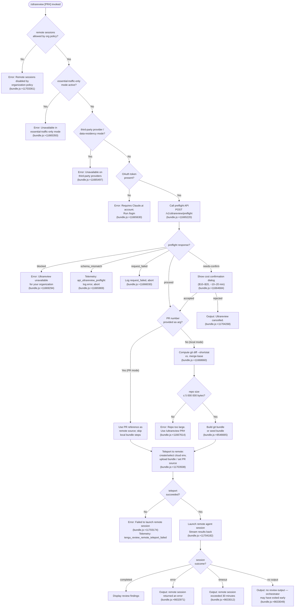

# `/ultrareview`

> Analysis basis: CC v2.1.147 bundle.js (AST extraction + Claude interpretation)
> Minimum version: v2.1.147

---

## Overview

`/ultrareview` is a remote-execution code-review command that finds and verifies bugs across the current branch by launching a sandboxed Claude Code session in the cloud (Claude Code on the web). It bundles or references the local repository, teleports the work to a remote environment, runs an autonomous bug-hunting agent, and streams findings back to the local terminal. The command gates itself behind policy checks, authentication requirements, and repository-size limits before initiating the remote session.

---

## Registration

| Field | Value |
|---|---|
| type | `local-jsx` |
| name | `ultrareview` |
| description | `… · Est. cost … USD · Finds and verifies bugs in your branch. Runs in Claude Code on the web. See …` |
| loc_byte | `11705634` |
| loc_byte_end | `11705893` |
| loc_line | `9527` |
| module_id | `JV1` |
| load_inline | `true` |
| arbor_handler.name | `Sm7` |
| arbor_handler.fqn | `claude-2.1.147::Sm7` |
| arbor_handler.kind | `AsyncFunction` |
| arbor_handler.resolution_path | `module_id` |
| arbor_handler.n_hits | `1` |

Analysis basis: CC v2.1.147 bundle.js:+11705634–11705893

---

## Input Branching

There are many distinct decision paths (policy gate, size gate, auth gate, preflight API response, PR-number vs. local-bundle path, overage dialog, confirmation dialog, and remote session outcome). A Mermaid flowchart is mandatory here.



---

## Behavioral Spec

### 1. Handler Entry — `handlerMain` (`Sm7`)

The top-level async handler is resolved via `module_id` → `JV1`. It is the root of all sub-steps described below.

Analysis basis: CC v2.1.147 bundle.js:+11703324

```
async function handlerMain(commandArgs, appContext):
    // Step 1: Policy gate
    if NOT remoteSessionsAllowed(appContext):
        emit telemetry tengu_review_remote_precondition_failed
        display error "Remote sessions are disabled by your organization's policy. Contact your organization admin to enable them."
        return

    // Step 2: Jitter delay (avoid thundering-herd)
    await randomJitterDelay()          // Math.random * 2 then setTimeout

    // Step 3: Run precondition checks (git, auth, network)
    preconditionResult = await runPreconditionChecks(appContext)
    if preconditionResult.failed:
        return

    // Step 4: Preflight API call
    preflightResult = await callUltrareviewPreflight(appContext)
    if preflightResult.status != "proceed" and preflightResult.status != "needs-confirm":
        return

    // Step 5: Overage / confirmation gate
    if preflightResult.status == "needs-confirm":
        confirmed = await showCostConfirmDialog()
        if NOT confirmed:
            display "Ultrareview cancelled."
            return

    // Step 6: Teleport (build bundle / set PR ref, create remote session)
    sessionInfo = await teleportToRemote(commandArgs, appContext)
    if sessionInfo == null:
        display "Ultrareview failed to launch the remote session. Check that this is a GitHub repo and try again."
        return

    // Step 7: Stream results from remote agent
    await streamRemoteAgentResults(sessionInfo, appContext)

    // Step 8: Post-launch acknowledgement prompt
    display acknowledgement (brief, no repetition of URL or billing)
```

Analysis basis: CC v2.1.147 bundle.js:+11703324–11704246

---

### 2. Policy and Network-Mode Gate — `checkRemoteSessionPolicy` (`Q1`)

```
function checkRemoteSessionPolicy(appContext):
    // Check org-level remote-session toggle
    if featureFlag("allow_remote_sessions") is falsy:
        return { allowed: false, reason: "policy" }

    // Check product-feedback / telemetry gate
    if featureFlag("allow_product_feedback") requires check:
        run slate-kestrel eligibility check
        // telemetry: tengu_slate_kestrel

    // Check network mode from MfL set
    if networkMode in MfL:
        return eligibility object via ES()

    return { allowed: true }
```

Analysis basis: CC v2.1.147 bundle.js:+4674769–4674842

---

### 3. Precondition Check — `runPreconditionChecks` (`xd_`)

This function coordinates all pre-launch environment validations and feeds the results to the remote launch logic.

```
async function runPreconditionChecks(appContext):
    // 3a. Verify inside a git working tree
    gitOk = await checkInsideGitRepo()    // git rev-parse --is-inside-work-tree
    if NOT gitOk:
        return { failed: true, reason: "not_in_git_repo" }

    // 3b. Resolve remote URL
    remoteUrl = await resolveGitRemoteUrl()  // git config --get remote.origin.url
    if remoteUrl is empty:
        return { failed: true, reason: "no_git_remote" }

    // 3c. Validate remote is github.com
    if NOT remoteUrl.includes("github.com"):
        // GHES or non-GitHub remote: optimistic path or error
        pass

    // 3d. Compute diff size (local mode only)
    diffStats = await computeDiffStats()   // git diff --shortstat vs merge-base
    if repoSizeBytes > 5_000_000:
        display "Repo is too large to bundle. Push a PR and use `/ultrareview <PR#>` instead."
        return { failed: true, reason: "too_large" }

    // 3e. Verify branch / HEAD
    gitVerifyOk = await verifyBranch()  // git rev-parse --verify --quiet
    if NOT gitVerifyOk:
        return { failed: true, reason: "no_changes" }

    // 3f. Resolve current branch name
    branchName = await getCurrentBranch()  // git rev-parse --abbrev-ref HEAD
    defaultBranch = await getDefaultBranch()  // git symbolic-ref --short refs/remotes/origin/HEAD

    // 3g. Background eligibility check
    eligibility = await backgroundEligibilityCheck()
    // reports: policy_blocked, not_logged_in, byoc, not_in_git_repo,
    //          no_git_remote, github_app_not_installed

    return eligibility
```

Analysis basis: CC v2.1.147 bundle.js:+11666494–11668723

---

### 4. Preflight API Call — `callUltrareviewPreflight` (`oZ1`)

```
async function callUltrareviewPreflight(appContext):
    response = await httpGet(
        "/v1/ultrareview/preflight",
        headers: { "teleport-org": orgId },
        timeout: 5000
    )

    status = response.data.status
    match status:
        "proceed"       → return { status: "proceed", serverData: response.data }
        "needs-confirm" → return { status: "needs-confirm", serverData: response.data }
        "blocked"       → display "Ultrareview is unavailable for your organization."
                          return { status: "blocked" }
        "essential-traffic-only" →
                          display "Ultrareview runs in Claude Code on the web and is unavailable when essential-traffic-only mode is active."
                          return { status: "blocked" }
        "zdr" / "data-residency" →
                          display "Ultrareview runs in Claude Code on the web and is unavailable on third-party providers."
                          return { status: "blocked" }
        "no-auth" / "no_oauth_token" →
                          display "Ultrareview requires a Claude.ai account. Run /login to authenticate."
                          return { status: "blocked" }
        "schema_mismatch" →
                          emit telemetry "api_ultrareview_preflight"
                          return { status: "error" }
        "request_failed" →
                          emit telemetry "api_ultrareview_preflight"
                          return { status: "error" }
```

Analysis basis: CC v2.1.147 bundle.js:+11665145–11666030

---

### 5. Cost Confirmation Dialog — `showCostConfirmDialog` (`myH` via `mtH`)

```
function showCostConfirmDialog():
    display dialog showing:
        estimated cost: "$10-$20"
        estimated time: "~10–20 min"
    wait for user confirmation (confirm / cancel)
    emit telemetry tengu_review_overage_dialog_shown
    if confirmed:
        return true
    else:
        return false
```

Analysis basis: CC v2.1.147 bundle.js:+11664684, +11664776, +11703963

---

### 6. Repository Size Check — `checkRepoSize` (`Bcq` via `Ucq`)

```
async function checkRepoSize():
    output = await git("count-objects", "-v")
    sizeKB = parseNumber(output)
    sizeBytes = sizeKB * 1024
    emit telemetry tengu_ccr_bundle_max_bytes with { sizeBytes }
    if sizeBytes > 5_000_000:
        return { tooLarge: true }
    if objectCount > 100:
        // marginal warning threshold
        pass
    return { tooLarge: false, sizeBytes }
```

Size limit: 5,000,000 bytes (bundle.js:+8543814)
Object count threshold: 100 (bundle.js:+8543795)

Analysis basis: CC v2.1.147 bundle.js:+8543659–8543814

---

### 7. Git Bundle Construction — `buildGitBundle` (`Xy_`)

```
async function buildGitBundle(options):
    // Confirm inside a git repo
    insideRepo = await git("rev-parse", "--is-inside-work-tree")
    if NOT insideRepo:
        return { status: "not_in_git_repo" }

    // Check for any commits
    refCount = await git("for-each-ref", "--count=1", "refs/")
    if refCount == 0:
        return { status: "empty_repo",
                 message: "Repository has no commits yet" }

    // Attempt stash to capture unstaged changes
    stashRef = await git("stash", "create")
    if stash succeeds:
        bundleMode = "head" or "squashed"
    else:
        bundleMode = "fallback_head" or "fallback_squashed"

    // Seed bundle optimization
    seedBundlePath = resolveSeedBundlePath()    // _source_seed.bundle
    emit telemetry tengu_ccr_bundle_seed_enabled if seed found

    // Write bundle to temp file: ccr-seed + randomUUID + ".bundle"
    bundleFile = writeBundleToTempFile()
    emit telemetry tengu_ccr_bundle_upload

    // Clean up temp refs
    await git("update-ref", "-d", "refs/seed/stash")
    await git("update-ref", "-d", "refs/seed/root")

    if uploadFailed:
        return { status: "upload_failed" }

    return { status: "success", bundleMode, bundleFile }
```

Analysis basis: CC v2.1.147 bundle.js:+8546343–8548447

---

### 8. Teleport to Remote — `teleportToRemote` (`xd_` → `Id`)

```
async function teleportToRemote(commandArgs, appContext):
    // Determine source mode
    prNumber = parseArgAsPRNumber(commandArgs)
    if prNumber:
        sourceMode = "explicit_source_url"
    else:
        bundleResult = await buildGitBundle()
        if bundleResult.status != "success":
            handle error cases (empty repo, no git, too large)
            return null
        sourceMode = "bundle" or "git_repository"

    emit telemetry tengu_teleport_source_decision with { sourceMode }

    // Get or create cloud environment
    environments = await listCloudEnvironments()
    if environments is empty:
        env = await autoCreateDefaultCloudEnv()
        if env creation failed:
            display "Could not create a cloud environment. Set one up at https://claude.ai/code/onboarding?magic=env-setup"
            return null
        emit telemetry "env_create"
    else:
        env = selectBestEnvironment(environments)

    // Construct remote session request
    sessionReq = {
        environment_id: env.id,
        source: bundleOrPRRef,
        task_type: "claude/task",
        title_template: "{description}",
        anthropic_beta: "ccr-byoc-2025-07-29",
        x_organization_uuid: orgUUID,
    }

    response = await httpPost(sessionCreationEndpoint, sessionReq)
    if response.status == 201:
        emit telemetry tengu_ccr_session_link
        emit telemetry tengu_teleport_bundle_mode with { sourceMode }
        return sessionInfo
    elif response.status in [401, 403]:
        display auth error
    elif response.status == 429:
        display rate limit error
    else:
        handle github_repo_access_denied or malformed response

    return null
```

Analysis basis: CC v2.1.147 bundle.js:+11703508, +8560644–8563393

---

### 9. Remote Agent Result Streaming — `streamRemoteAgentResults` (`md_` via `hm7`)

```
async function streamRemoteAgentResults(sessionInfo, appContext):
    // Render initial session-launched UI
    renderLaunchInfo(sessionInfo)   // shows cost estimate, time estimate

    // Poll / stream session state
    pollingInterval = 1000ms
    maxDuration = 1_800_000ms (30 minutes)
    startTime = Date.now()

    loop:
        if elapsed > maxDuration:
            display "remote session exceeded 30 minutes"
            break

        event = await fetchNextSessionEvent(sessionInfo.id)

        match event.type:
            "pending"        → show spinner
            "starting"       → show "starting"
            "running"        → update progress display
            "hook_progress"  → relay intermediate output
            "hook_response"  → relay hook response
            "hook_started"   → update state to "idle"
            "SessionStart"   → mark as active
            "result"         → extract assistant message, display findings, break
            "completed"      → display findings, break
            "archived"       → break
            "error"          → display "remote session returned an error", break

        if no output after completion:
            display "no review output — orchestrator may have exited early"

    emit telemetry tengu_review_remote_launched (on successful launch)
    if session failed to start:
        emit telemetry tengu_review_remote_teleport_failed
```

Analysis basis: CC v2.1.147 bundle.js:+11704182, +8628795–8633605

---

### 10. Background Eligibility Check — `backgroundEligibilityCheck` (`Glq`)

Run concurrently during precondition evaluation. Reports one of the following result codes:

| Code | Meaning |
|---|---|
| `policy_blocked` | Org policy disallows remote sessions |
| `not_logged_in` | No Claude.ai OAuth token |
| `byoc` | Bring-your-own-credentials mode (unsupported) |
| `not_in_git_repo` | Working directory is not a git repo |
| `no_git_remote` | No GitHub remote configured |
| `github_app_not_installed` | GitHub App not installed on the repo |

Analysis basis: CC v2.1.147 bundle.js:+8622208–8622926

---

### 11. Remote Session Creation — `createRemoteSession` (`Id`)

Key error strings and status codes observed:

- `"Remote sessions are disabled by your organization's policy."` — bundle.js:+8560705
- `"No access token found for remote session creation"` — bundle.js:+8560813
- `"Unable to get organization UUID for remote session creation"` — bundle.js:+8561123
- HTTP 401/403 → auth error display
- HTTP 429 → rate-limit display
- `"Server returned a malformed session response (no session id)"` — bundle.js:+8563218
- `"[teleportToRemote] Auto-created default cloud env"` — bundle.js:+8563412
- Beta header sent: `ccr-byoc-2025-07-29` — bundle.js:+8561462

Analysis basis: CC v2.1.147 bundle.js:+8560644–8568596

---

### 12. Jitter Delay — `randomJitterDelay` (`H`)

```
function randomJitterDelay():
    // Spread 0–2 seconds to avoid thundering-herd at command invocation
    delayMs = Math.random() * 2 * 1000
    await setTimeout(delayMs)
```

Multiplier constant: `2` (bundle.js:+13143497)

Analysis basis: CC v2.1.147 bundle.js:+13143499–13143536

---

## State & Side Effects

| Item | Detail |
|---|---|
| Telemetry: `tengu_slate_kestrel` | Fired during first-party / eligibility check (bundle.js:+4671398) |
| Telemetry: `tengu_review_remote_precondition_failed` | Policy or environment gate failed (bundle.js:+11666509) |
| Telemetry: `tengu_review_bughunter_config` | Emitted when bughunter config is loaded (bundle.js:+11664567) |
| Telemetry: `tengu_review_overage_blocked` | User hit overage limit (bundle.js:+11703626) |
| Telemetry: `tengu_review_overage_dialog_shown` | Cost confirmation dialog displayed (bundle.js:+11703963) |
| Telemetry: `tengu_ccr_bundle_max_bytes` | Repo size measurement (bundle.js:+8543288) |
| Telemetry: `tengu_ccr_bundle_seed_enabled` | Seed bundle optimisation active (bundle.js:+8622673) |
| Telemetry: `tengu_ccr_bundle_upload` | Bundle upload outcome (bundle.js:+8546665) |
| Telemetry: `tengu_teleport_bundle_mode` | Source mode used (bundle.js:+8561872) |
| Telemetry: `tengu_ccr_session_link` | Remote session URL captured (bundle.js:+8556272) |
| Telemetry: `tengu_teleport_source_decision` | Source type selected (bundle.js:+8566942) |
| Telemetry: `tengu_review_remote_teleport_failed` | Teleport failed (bundle.js:+11671941) |
| Telemetry: `tengu_review_remote_launched` | Remote session launched successfully (bundle.js:+11672425) |
| Telemetry: `tengu_bg_spare_enable` | Background spare environment enabled (bundle.js:+15117130) |
| Telemetry: `tengu_bg_spare_spawn` | Background spare environment spawned (bundle.js:+15117490) |
| Telemetry: `tengu_daemon_control` | Daemon control event (bundle.js:+15153889) |
| Telemetry: `tengu_daemon_config_reload` | Daemon config reloaded (bundle.js:+15132565) |
| Telemetry: `tengu_feature_ok` | Feature gate passed (bundle.js:+960829) |
| Telemetry: `tengu_feature_bad` | Feature gate failed (bundle.js:+960887) |
| Telemetry: `tengu_feature_sad` | Feature gate indeterminate (bundle.js:+960964) |
| Network I/O | `POST /v1/ultrareview/preflight` with 5 000 ms timeout |
| Network I/O | Cloud environment list / create endpoint |
| Network I/O | Remote session creation endpoint (POST, beta header `ccr-byoc-2025-07-29`) |
| File I/O | Writes temporary git bundle: `ccr-seed<uuid>.bundle`, `_source_seed.bundle` |
| File I/O | Reads `daemon.status.json` for daemon state |
| appState changes | `remoteControlAtStartup` userSettings flag toggled; supervisor process started/stopped |
| Git side effects | Creates/deletes temporary refs `refs/seed/stash`, `refs/seed/root` |
| Process | May call `process.exit` via shutdown helper after 500 ms grace period |

---

## Key Constants and Limits

| Constant | Value | Location |
|---|---|---|
| Repo size hard limit | 5,000,000 bytes | bundle.js:+8543814 |
| Object count warning | 100 | bundle.js:+8543795 |
| Preflight API timeout | 5,000 ms | bundle.js:+11665277 |
| Environment list timeout | 15,000 ms | bundle.js:+8509663 |
| Remote session poll interval | 1,000 ms | bundle.js:+8630386 |
| Remote session max duration | 1,800,000 ms (30 min) | bundle.js:+8630393 |
| Jitter delay multiplier | 2 seconds max | bundle.js:+13143497 |
| Estimated cost display | `$10-$20` | bundle.js:+11664684 |
| Estimated time display | `~10–20 min` | bundle.js:+11664776 |
| Git bundle title width pad | 75 chars | bundle.js:+8549511 |
| Anthropic API version header | `2023-06-01` | bundle.js:+3130349 |
| Beta feature header | `ccr-byoc-2025-07-29` | bundle.js:+8561462 |
| Daemon shutdown grace | 2,000 ms | bundle.js:+15117423 |
| Seed bundle filename suffix | `_source_seed.bundle` | bundle.js:+8547814 |

---

## Version History

| Version | Change |
|---|---|
| v2.1.147 | Initial analysis |

---

## Common Mistakes

1. **Invoking without a Claude.ai account**: `/ultrareview` requires OAuth authentication via `claude.ai`, not just an `ANTHROPIC_API_KEY`. Running it with only an API key will produce the auth-gate error. Use `/login` first.
2. **Running on a repo without a GitHub remote**: The command requires a GitHub (`github.com`) remote URL. Non-GitHub remotes (GitLab, Bitbucket, bare paths) will fail the eligibility check with `no_git_remote` or trigger the GHES optimistic path. Add a GitHub remote with `git remote add origin <REPO_URL>`.
3. **Repository too large for local bundling**: Repositories whose git object store exceeds 5,000,000 bytes cannot be bundled locally. Push the changes to a PR and invoke `/ultrareview <PR#>` instead.
4. **Empty repository**: Running the command in a repository with no commits will fail with `"Repository has no commits yet"`. Make at least one commit before invoking.
5. **Org policy blocking remote sessions**: If the `allow_remote_sessions` feature flag is disabled at the org level, the command fails immediately with a policy error. An org admin must enable remote sessions in admin settings (`/admin-settings/`).
6. **Essential-traffic-only network mode**: In environments configured for essential-traffic-only or data-residency (ZDR) modes, `/ultrareview` is unavailable because it requires outbound connections to Claude Code on the web.
7. **Dismissing the cost confirmation dialog**: If the preflight response returns `needs-confirm`, the user must explicitly confirm the `$10–$20` estimated cost. Dismissing the dialog cancels the review without launching anything.

---

## Appendix — Identifier Mapping

> For bundle debugging only. Identifiers change across versions.

| Identifier | Role |
|---|---|
| `Sm7` | Main async handler for `/ultrareview` (arbor_handler) |
| `Q1` | Policy and remote-session eligibility check |
| `hs9` | Feature flag / network mode reader |
| `l_8` | Feature flag evaluation helper |
| `ES` | Eligibility status builder (firstParty / enterprise / team) |
| `IY_` | File-based config reader (readFileSync, utf-8) |
| `j1` | Telemetry dispatch / event emitter wrapper |
| `XwA` | String conversion / normalisation helper |
| `UH` | Low-level string coercion utility |
| `hqH` | String formatting helper |
| `H` | Jitter delay (Math.random + setTimeout) |
| `xd_` | Precondition orchestrator (git checks, size check) |
| `Oz8` | Git working-tree verifier (rev-parse --is-inside-work-tree) |
| `b6` | Async git command runner |
| `sb6` | Git context store accessor |
| `w_` | OS / platform info helper |
| `T_` | Subprocess / process spawner |
| `i2H` | Low-level process execution core |
| `D` | Background spare-environment manager |
| `JFK` | String-to-identifier converter |
| `Az` | Logger / debug output |
| `N` | Log-level formatter |
| `q8` | Warning emitter |
| `RH` | Error logger with error-code capture |
| `A` | String lowercasing utility |
| `M` | Connection / stream close manager |
| `c` | App state / config accessor |
| `Xh` | Git remote URL resolver (git config --get remote.origin.url) |
| `$C` | Cached remote URL getter |
| `cB8` | Remote URL cache store reader |
| `K` | String padding / map helper |
| `L` | Async task set manager (add / delete / finally) |
| `ebH` | URL credential scrubber (`://***@` replacement) |
| `lAH` | Remote URL parser (http/https, github.com detection) |
| `_` | Generic variable / operand (context-dependent) |
| `iPA` | URL component splitter (includes / split) |
| `Uq` | String slice/index extractor |
| `Bcq` | Repo size checker (git count-objects -v) |
| `Ucq` | Size parser (Number, KB→bytes) |
| `pcq` | Branch diff stats runner |
| `V6` | Task / session state machine |
| `T8` | Process lifecycle helper |
| `z` | Daemon stop / shutdown orchestrator |
| `bH` | State reader for daemon_stop |
| `mH` | State reader for daemon_stop_failed |
| `Pk` | Daemon control command dispatcher |
| `rC` | Daemon RPC client |
| `ATH` | Inter-process communication helper |
| `R4_` | UUID-based remote task creator |
| `Ou` | Graceful shutdown with Promise.race / process.exit |
| `Jg` | Daemon shutdown invoker |
| `Tg` | Timeout-based shutdown handler |
| `r8` | Timed abort helper (setTimeout + clearTimeout) |
| `zv` | Default branch resolver (symbolic-ref refs/remotes/origin/HEAD) |
| `lB8` | Default branch cache reader |
| `PD` | Current branch resolver (rev-parse --abbrev-ref HEAD) |
| `QB8` | Current branch cache reader |
| `$` | Session / daemon status file accessor (daemon.status.json) |
| `ZC1` | Status file path builder |
| `ll` | Path join helper |
| `M1` | Async local storage context accessor |
| `aE6` | Path segment joiner |
| `CH` | JSON stringifier |
| `ud_` | Preflight API call and result dispatcher |
| `oZ1` | Core preflight HTTP request and status router |
| `B6` | JSON parser |
| `Cd_` | Preflight error string mapper |
| `K8` | App state updater |
| `myH` | Cost confirmation dialog orchestrator |
| `mtH` | Confirmation UI renderer (shows $10-$20, ~10–20 min) |
| `DoH` | Admin settings URL builder (/admin-settings/) |
| `NT` | URL composer |
| `X$H` | Account plan / subscription checker |
| `I5` | Subscription type resolver |
| `mD` | Auth context / API key / OAuth token accessor |
| `x6` | Session token cache |
| `GA` | Plan eligibility gate (max / pro tier check) |
| `vC` | Array-based plan membership test |
| `VC` | User role checker (admin / billing / owner / primary_owner) |
| `q1` | Role-membership evaluator |
| `qa8` | Role name normaliser |
| `Aa8` | Role array flattener |
| `So` | Bughunter config renderer |
| `hm7` | Remote agent result streaming orchestrator |
| `md_` | Main streaming / UI render loop |
| `lwH` | Background eligibility check coordinator |
| `Glq` | Full eligibility check (policy, login, git, github app) |
| `T` | UI event / keypress handler |
| `b` | Raw input event object |
| `IW` | User settings accessor |
| `Y` | Supervisor process lifecycle manager |
| `i4H` | Progress bar / spinner renderer |
| `iZ1` | Elapsed-time formatter |
| `Id` | Remote session creator / teleport-to-remote core |
| `i$` | Auth token fetcher |
| `Zy_` | Session request builder |
| `NC` | Organisation UUID resolver |
| `R9` | OAuth endpoint validator (local / staging / prod) |
| `FJ` | HTTP request header builder (Content-Type, anthropic-version) |
| `Xy_` | Git bundle file builder and uploader |
| `h6` | OS platform detector |
| `gcq` | Random UUID generator for bundle naming |
| `Fcq` | Session link telemetry emitter |
| `pr` | Cloud environment lister (teleport_environments_list) |
| `urH` | Default cloud environment creator (teleport_default_environment_create) |
| `ZH` | String coercion utility (String constructor) |
| `$97` | Remote task / session title generator (teleport_generate_title) |
| `oC` | Session state machine event processor |
| `aNH` | GitHub App installation checker |
| `Bq` | Process signal / abort handler |
| `n_` | Error normaliser (Error + String) |
| `cc` | Cancel / abort detector |
| `dz` | Cancellation signal handler |
| `fIH` | Remote agent polling and result extraction loop |
| `CN` | Random bytes generator (cU1.randomBytes) |
| `IrH` | Browser / external URL opener (go.open) |
| `xX` | Timestamp-based poll token generator |
| `g97` | Session result formatter |
| `Vlq` | Session event stream processor (full state machine) |
| `nwH` | Failure display helper |
| `FD` | Error display formatter |
| `ym7` | Result message mapper |
| `bd_` | Post-launch cleanup / cancellation handler |