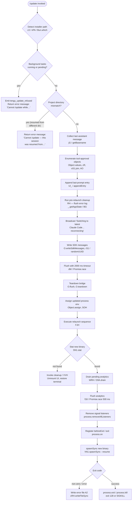

# `/update`

> Analysis basis: CC v2.1.147 bundle.js (AST extraction + Claude interpretation)
> Minimum version: v2.1.147

---

## Overview

`/update` upgrades Claude Code in place to the latest available version while keeping the current conversation alive. It performs a series of pre-flight checks (background task guard, project-directory continuity check), tears down the current process cleanly, and re-execs itself at the new version — all without losing conversation state.

---

## Registration

| Field | Value |
|---|---|
| type | `local` |
| name | `update` |
| description | `Switch to the latest version (conversation continues)` |
| supportsNonInteractive | `false` |
| isHidden | `true` |
| module_id | `aS1` |
| load_inline | `true` |
| loc_byte | `12125889` |
| loc_byte_end | `12126091` |
| loc_line | `9971` |
| arbor_handler.name | `OQ7` |
| arbor_handler.fqn | `claude-2.1.147::OQ7` |
| arbor_handler.kind | `AsyncFunction` |
| arbor_handler.resolution_path | `module_id` |
| arbor_handler.n_hits | `0` |

Analysis basis: CC v2.1.147 bundle.js:+12125889

---

## Input Branching

The handler contains 5 or more distinct branching paths (background-task guard, project-directory mismatch guard, tool-approval format selection, message type detection, and exec vs. fallback), so a Mermaid flowchart is used.



---

## Behavioral Spec

### 1. Handler Entry (`OQ7` — async update handler)

```
async function updateHandler(context):
    installPath = detectInstallPath(context)   # s08 -> c3 -> nPA -> Bun.which "claude"
    if installPath is null:
        emit telemetry: tengu_update_refused    # loc_byte 12123833
        return early

    versionDir  = resolveVersionsDir(installPath)   # hx -> LY8 -> iDH/P6H
    # Paths: ~/.local/share/versions  and  ~/.local/share/bin
```

Analysis basis: CC v2.1.147 bundle.js:+12123733

### 2. Pre-flight Guard — Background Tasks

```
function guardBackgroundTasks(appState):
    taskStates = Object.values(appState.tasks)
    if any task.state == "running" or task.state == "pending":
        return ErrorMessage(
            "Cannot /update while background tasks are running — " +
            "wait for them to finish, then try again."
        )
        # literal loc_byte 12124197
    return null
```

Analysis basis: CC v2.1.147 bundle.js:+12124056

### 3. Pre-flight Guard — Project Directory Continuity

```
function guardProjectDirectory(appState):
    if appState.resumedFromDifferentDir == true:
        return ErrorMessage(
            "Cannot /update — this session was resumed from a different " +
            "project directory. Restart manually with --resume to continue " +
            "on the latest version."
        )
        # literal loc_byte 12124438
    return null
```

Analysis basis: CC v2.1.147 bundle.js:+12124304

### 4. Collect Last Prompt Entry (`Ul_` — append last-prompt)

```
function appendLastPromptEntry(conversationLog):
    entry = {
        key:   "last-prompt",    # literal loc_byte 12624356
        value: lastPromptText
    }
    conversationLog.appendEntry(entry)   # _.appendEntry
    h6(conversationLog)                  # oV helper
```

Analysis basis: CC v2.1.147 bundle.js:+12124657

### 5. Pre-relaunch Broadcast and SDK Message Write

```
async function broadcastAndWrite(bridge, sessionId):
    message = "Switching to latest Claude Code… reconnecting"
    # literal loc_byte 12124949
    bridge.writeSdkMessages(
        role:        "assistant",    # loc_byte 12122782
        stop_reason: "stop_sequence",# loc_byte 12122894
        id:          generateUUID()  # rS1 -> o08.randomUUID
    )
```

Analysis basis: CC v2.1.147 bundle.js:+12124925

### 6. Flush with Timeout (`dM` — timed flush)

```
async function flushWithTimeout(bridge):
    timer   = setTimeout(resolve, 2000)   # literal loc_byte 12125029, "bridge flush" label
    result  = await Promise.race([
                  bridge.flush(),
                  timer
              ])
    clearTimeout(timer)
    return result
```

Analysis basis: CC v2.1.147 bundle.js:+12125016

### 7. Relaunch Sequence (`FJH` — exec relaunch)

```
async function relaunchSequence(newBinaryPath, env):
    # Step 1 — verify binary exists
    stat = await SN1.stat(newBinaryPath)
    if stat fails:
        cleanupTerminal()   # VVH: unmount UI, restore terminal scrollback
        return

    # Step 2 — resolve working directory
    workDir = resolveWorkDir(kN1)   # IN1.isAbsolute, process.cwd, process.chdir

    # Step 3 — drain analytics
    await drainAnalytics(WRH)   # D9A.drain  loc_byte 57511

    # Step 4 — flush analytics with 30 000 ms timeout
    await Promise.race([
        flushAnalytics(f18),           # Promise.race 500 ms inner
        timeout(30000, "flush timeout (relaunch)")  # literal loc_byte 11855883
    ])

    # Step 5 — assign updated env
    env = Object.assign(process.env, buildEnv(SOH))

    # Step 6 — clear signal handlers, register exit hooks
    process.removeAllListeners("SIGINT")   # loc_byte 11856356
    process.removeAllListeners("SIGHUP")   # loc_byte 11856375
    process.on("beforeExit", ...)          # loc_byte 11856531
    process.on("exit", ...)                # loc_byte 11856572

    # Step 7 — spawn new process
    result = hN1.spawnSync(newBinaryPath, ["--resume"], {stdio: "inherit"})
    # literal "--resume" loc_byte 11855821

    if result.error:
        writeErrorFile(A2)     # cRH.writeFileSync, tag "relaunch_spawn_error" loc_byte 11856667
        process.exit(128)      # literal loc_byte 11856804
    else:
        process.exit(0)
        # or process.kill with SIGKILL if needed
```

Analysis basis: CC v2.1.147 bundle.js:+12125192

### 8. Terminal Cleanup (`VVH` — UI unmount)

```
function cleanupTerminal():
    yYH.writeSync(restoreSequence)   # ESC-7 / ESC-8 terminal save/restore
    renderer = QL.get()
    H.unmount(renderer)
    nh()                             # cursor restore
    ue6()                            # alternate screen / tmux-aware write
    # platform-aware: detects ghostty ≥1.2.0, iTerm2 ≥3.6.6, tmux, screen
```

Analysis basis: CC v2.1.147 bundle.js:+11855844

### 9. Install-Path Resolution (`s08` / `c3` / `nPA`)

```
function detectInstallPath():
    which = Bun.which("claude")       # nPA -> Bun.which  loc_byte 1057108
    if which is null:
        return null
    return which

function resolveVersionsDir(claudePath):
    # Uses home directory from Ghq.homedir
    # Constructs: ~/.local/share/versions   (literals: ".local", "share", "versions")
    # and:        ~/.local/share/bin        (literal: "bin")
    # via DJ6.join (path.join) and D26.join
    dirs = pathJoin(homeDir, ".local", "share", "versions")
    return dirs
```

Analysis basis: CC v2.1.147 bundle.js:+12123733, +1057108, +7506344

---

## State & Side Effects

| Item | Detail |
|---|---|
| Telemetry — `tengu_update_refused` | Fired when installer binary is not found (loc_byte 12123833) |
| Telemetry — `tengu_scroll_summary` | Fired during terminal scroll-summary phase (loc_byte 5274361) |
| Telemetry — `tengu_amber_creek` | Fullscreen-mode instrumentation (loc_byte 3351745) |
| Telemetry — `tengu_pewter_brook` | Fullscreen-mode instrumentation (loc_byte 3351653) |
| Telemetry — `tengu_bg_dispatch_sigkill_escalate` | Background-session SIGKILL escalation (loc_byte 15117797) |
| Telemetry — `tengu_bg_low_mem_mb` | Low-memory threshold event (loc_byte 12461757) |
| Telemetry — `tengu_bg_dispatch_low_mem` | Background dispatch under low memory (loc_byte 15118376) |
| Telemetry — `tengu_bg_spare_enable` | Spare worker pool enabled (loc_byte 15119071) |
| Telemetry — `tengu_bg_sendclaim_failed` | Background session claim failure (loc_byte 15098898) |
| Telemetry — `tengu_bg_spare_claim` | Spare worker claimed (loc_byte 15119192) |
| Telemetry — `tengu_bg_spare_spawn` | Spare worker spawned (loc_byte 15117490) |
| Telemetry — `tengu_bg_spare_claim_fail` | Spare worker claim failure (loc_byte 15119455) |
| Telemetry — `tengu_daemon_control` | Daemon lifecycle control event (loc_byte 15153889) |
| Telemetry — `tengu_feature_ok` / `tengu_feature_bad` | Feature flag probe results (loc_byte 960829 / 960887) |
| `appState` read | `_.getAppState()` — reads task states and session resume flag (loc_byte 12124685) |
| `appState` write | `_.setAppState()` — may update after guard checks (loc_byte 12124839) |
| SDK message write | `O.writeSdkMessages` appends a synthetic assistant stop message (loc_byte 12124925) |
| Bridge teardown | `O.flush()` (2000 ms timeout) then `O.teardown()` (loc_byte 12125019, 12125070) |
| Analytics drain | `D9A.drain` + `f18` analytics flush with 30 000 ms outer / 500 ms inner race (loc_byte 57511, 11855883) |
| Conversation log | `_.appendEntry` writes `"last-prompt"` entry before relaunch (loc_byte 12624336) |
| Signal handlers | All `SIGINT`/`SIGHUP` listeners removed; `beforeExit` and `exit` hooks registered (loc_byte 11856356–11856572) |
| Terminal state | UI unmounted, alternate screen exited, cursor restored via `VVH` sequence |
| Process re-exec | `hN1.spawnSync` with `--resume` flag; exits with code `128` on spawn error |
| Error file | On spawn failure: written via `cRH.writeFileSync` tagged `"relaunch_spawn_error"` (loc_byte 11856667) |
| Sound | <!-- TODO: not found in depth-2 traversal; needs --depth 4 --> |

---

## Version History

| Version | Change |
|---|---|
| v2.1.147 | Initial analysis |

---

## Common Mistakes

1. **Invoking `/update` while background tasks are active** — the command will refuse with an explicit message and fire `tengu_update_refused`. Wait until all background task states are neither `"running"` nor `"pending"` before retrying.
2. **Using `/update` in a session resumed from a different project directory** — the command detects the directory mismatch via `appState` and refuses. Use `--resume` on a fresh invocation from the correct directory instead.
3. **Expecting `/update` to appear in the command palette** — the registration sets `isHidden: true`, so it will not surface in autocomplete menus; it must be typed explicitly.
4. **Expecting non-interactive (scripted) use** — `supportsNonInteractive: false` means the command is blocked in piped or headless sessions.
5. **Assuming the conversation is lost** — the handler explicitly writes a synthetic stop message and appends the last prompt to the conversation log before re-execing, so the session continues after the new binary starts.
6. **Interrupting the process during the flush window** — the 2000 ms bridge-flush race and 30 000 ms analytics-flush race are designed to drain state before exec; killing the process in this window may result in partial analytics or missed last-prompt entries.

---

## Appendix — Identifier Mapping

> For bundle debugging only. Identifiers change across versions.

| Identifier | Role |
|---|---|
| `OQ7` | Async update handler (main entry point, arbor_handler) |
| `s08` | Install-path detector / Bun.which wrapper |
| `c3` | Claude binary path resolver |
| `nPA` | `Bun.which` invocation helper |
| `hx` | Versions-directory path builder |
| `LY8` | Path join utility for version dirs |
| `cf` | Array.isArray guard helper |
| `iDH` | `~/.local/share` path constructor (home-dir based) |
| `nM8` | `os.homedir()` wrapper |
| `P6H` | `~/.local/share/bin` path constructor |
| `Rq` | Background-task state checker (reads `T3H`) |
| `T3H` | Task-state constants object (`"running"`, `"pending"`) |
| `c` | Generic context / config accessor |
| `jG` | Last assistant message extractor |
| `h6` | Logging / output helper (`oV`) |
| `oV` | Low-level output primitive |
| `zR` | Tool-approval object resolver |
| `Vc_` | Tool-approval path joiner (`CN1.dirname`, `AO`, `M4`) |
| `w_` | Output primitive wrapper |
| `M4` | Output primitive wrapper |
| `e8H` | Pre-relaunch app-state snapshot helper |
| `mo` | Background-session task-set checker (`VT8`, `ka7.has`) |
| `VT8` | Task-set initialiser |
| `Ul_` | Last-prompt log appender (`v4`, `_.appendEntry`) |
| `v4` | Conversation log accessor |
| `r9` | `D9A.register` — analytics event registrar |
| `_` | App-state / conversation-log facade |
| `RH` | Error-log flush helper (`n_`, `UH`, `j1`, `FpK`, `Gl.logError`) |
| `n_` | Error object constructor |
| `UH` | String coercion helper |
| `j1` | Log-entry formatter (`XwA`) |
| `XwA` | Entry serialiser |
| `FpK` | Error-log ring-buffer manager (`lb6.shift`, `lb6.push`) |
| `BG` | App-state diff / merge helper |
| `O` | Bridge / SDK message transport |
| `v8` | Bridge implementation module |
| `rS1` | UUID generator (`o08.randomUUID`) |
| `dM` | Generic timed-promise race helper (setTimeout / Promise.race / clearTimeout) |
| `SOH` | Environment variable builder (String coercion) |
| `FJH` | Full relaunch orchestrator |
| `JD6` | Interval-clear helper (`oP_`) |
| `oP_` | `clearInterval` wrapper |
| `VVH` | Terminal UI teardown (unmount, scroll restore) |
| `H` | Ink renderer instance |
| `nh` | Cursor-restore helper |
| `ue6` | Alternate-screen / terminal-write helper |
| `FTH` | Terminal-type detector (ghostty, iTerm2) |
| `mTH` | Terminal write helper |
| `zG` | tmux/screen escape replacer |
| `M18` | Scroll-summary renderer (`sV`, `B7q`, `U7q`, `z9`) |
| `sV` | Scroll-summary state initialiser |
| `B7q` | Scroll-summary component |
| `U7q` | Scroll-summary timing helper (Date.now, Math.max, Math.round) |
| `m7q` | Scroll-summary sub-component |
| `z9` | Full-screen / alt-screen renderer |
| `VbH` | Known-terminal-set checker (`kmK.has`) |
| `G7_` | Terminal string formatter |
| `bn` | Terminal block builder (`Al4`) |
| `N` | Text-node / message formatter |
| `W7_` | Windows platform detector |
| `HA` | Keyboard-map helper (`Km`) |
| `ql4` | Viewport renderer |
| `V6` | React/Ink render pipeline |
| `PV` | Pending-flush tracker (`v4`) |
| `WRH` | Analytics drain (`D9A.drain`) |
| `f18` | Analytics flush orchestrator (Promise.race 500 ms) |
| `r8` | Sub-process output handler |
| `K` | Sub-process line formatter |
| `q` | Temp-file unlinker (`HfK.unlinkSync`) |
| `L` | Sub-process lifecycle tracker |
| `kN1` | New-process execve launcher (chdir, require, `f.execve`) |
| `M` | Native module (dlopen) |
| `A` | Process-map / pid tracker |
| `$` | Process-roster store |
| `ZC1` | Roster-entry constructor |
| `w` | Worker / subprocess manager |
| `C` | Subprocess control object |
| `mH` | Feature probe "ok" reporter |
| `bH` | Feature probe "bad" reporter |
| `sG8` | Memory-pressure checker |
| `T$6` | Config-file reader |
| `g` | Worker-pool manager |
| `v6A` | IPC connection helper (`KB.claim`, `EN8.connect`) |
| `S6A` | Worker lifecycle state machine |
| `D` | Dispatcher / scheduler |
| `q8` | Queue helper |
| `S` | Spare-worker slot |
| `f` | Exec-ve + MCP-update facade |
| `EkH` | MCP server connection initiator |
| `k7K` | MCP update applicator (`H.applyMcpUpdate`) |
| `_D5` | MCP server reconnection orchestrator |
| `z` | Daemon stop helper (`bH`, `mH`, `Pk`, `Ou`) |
| `Pk` | Daemon control packet sender |
| `Ou` | Daemon stop-and-wait coordinator |
| `ZH` | String coercion / type guard |
| `A2` | Error-file writer (`cRH.writeFileSync`) |

---

*Note: index built via Arbor fallback; some signals (telemetry, literals) may be missing — see arbor-fallback.js.*