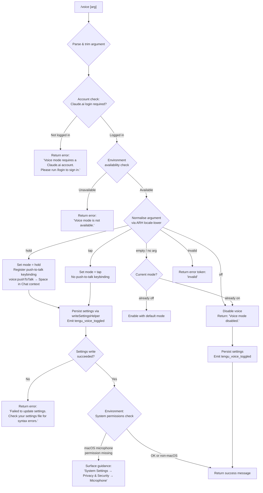

# `/voice`

> Analysis basis: CC v2.1.147 bundle.js (AST extraction + Claude interpretation)
> Minimum version: v2.1.147

---

## Overview

The `/voice` command toggles voice input mode in Claude Code, supporting three sub-modes: `hold` (push-to-talk), `tap` (toggle-on/off), and `off` (disabled). It validates account eligibility and environment availability before mutating the voice-mode setting, then persists the change to the user's settings file and registers a keybinding for push-to-talk when voice is active.

---

## Registration

| Field | Value |
|---|---|
| type | `local` |
| name | `voice` |
| description | `Toggle voice mode` |
| argumentHint | `[hold\|tap\|off]` |
| supportsNonInteractive | `false` |
| isHidden | `null` |
| module_id | `Ru1` |
| load_inline | `true` |
| loc_byte | `12410543` |
| loc_byte_end | `12410785` |
| loc_line | `10504` |
| arbor_handler.name | `sn7` |
| arbor_handler.fqn | `claude-2.1.147::sn7` |
| arbor_handler.kind | `AsyncFunction` |
| arbor_handler.resolution_path | `module_id` |
| arbor_handler.n_hits | `1` |

Analysis basis: CC v2.1.147 bundle.js:+12410543

---

## Input Branching

The command has 5+ distinct branches based on argument value and environment state.



---

## Behavioral Spec

### Top-Level Handler (`sn7`)

The Arbor-resolved async handler (`sn7`, `claude-2.1.147::sn7`) is the command's entry point.

Analysis basis: CC v2.1.147 bundle.js:+12407997

```
async function voiceCommandHandler(args, context):
    trimmedArg = trimArgument(args)            // H.trim at +12408289
    
    // Step 1 – Account gate
    accountStatus = checkAccountEligibility(context)  // yeH at +12407997
    if accountStatus indicates no Claude.ai login:
        return textResult("Voice mode requires a Claude.ai account. Please run /login to sign in.")
                                               // literal at +12408038
    
    // Step 2 – Environment availability gate
    available = checkVoiceAvailability(context)       // mD at +12408008
    if not available:
        return textResult("Voice mode is not available.")
                         // literal at +12408137
    
    // Step 3 – Normalise argument
    normalised = normaliseVoiceArg(trimmedArg)        // an7 at +12408222
    // normalised ∈ { "hold", "tap", "off", "invalid", "" }
    
    // Step 4 – Dispatch on mode
    if normalised == "off":
        newSettings = applyVoiceOff(currentSettings)
        result = writeSettingsAndPersist(newSettings)  // _A at +12408358
        if result.error:
            return textResult("Failed to update settings. Check your settings file for syntax errors.")
        emit telemetry("tengu_voice_toggled", { mode: "off" })  // +12408539
        return textResult("Voice mode disabled.")               // +12408594
    
    if normalised == "invalid":
        return textResult("invalid")                            // +12407958
    
    if normalised in ["hold", "tap"] or normalised == "":
        targetMode = normalised if normalised != "" else deriveToggle(currentVoiceMode)
        newSettings = applyVoiceMode(currentSettings, targetMode)
        result = writeSettingsAndPersist(newSettings)           // _A at +12408358
        if result.error:
            return textResult("Failed to update settings. Check your settings file for syntax errors.")
                                                                // +12408456
        emit telemetry("tengu_voice_toggled", { mode: targetMode }) // +12408539
        
        if targetMode == "hold":
            registerKeybinding(                                  // lJ at +12409804
                action = "voice:pushToTalk",                    // +12409807
                context = "Chat",                               // +12409826
                key = "Space"                                   // +12409833
            )
        
        // Step 5 – macOS microphone permission advisory
        if environment == "macos" and micPermission != "granted":
            surfaceGuidance(                                    // $ at +12409325
                "System Settings → Privacy & Security → Microphone"  // +12409345
            )
        
        // Step 6 – Environment-specific availability message
        if voiceNotAvailableInEnvironment:
            return textResult("Voice mode is not available in this environment.")
                                                                // +12408838
        
        return textResult(successMessage)
    
    // Resolve Promise after all synchronous work          // Promise.resolve at +12408654
    return resolvedResult
```

### Account Eligibility Check (`yeH` / `fi_`)

Analysis basis: CC v2.1.147 bundle.js:+12398530

```
function checkAccountEligibility(context):
    // fi_ checks authentication state
    isAuthenticated = Boolean(getAuthState(context))   // fi_ → eA at +12398456, Boolean at +12398468
    if not isAuthenticated:
        return ACCOUNT_REQUIRED
    // PZ6 performs additional Claude.ai account classification
    return classifyAccount(context)                    // PZ6 at +12398537
```

### Voice Availability Check (`mD`)

The availability check (`mD`) delegates to multiple helpers to verify that the runtime environment and API credentials support voice.

Analysis basis: CC v2.1.147 bundle.js:+12408008

```
function checkVoiceAvailability(context):
    // cK – credential/token check
    credOk = checkCredentials(context)                 // cK at +2922859
    if not credOk: return false
    
    // Uv – environment/platform capabilities
    envOk = checkEnvironmentCapabilities(context)      // Uv at +2922957
    
    // EO – first-party account flag
    firstParty = checkFirstParty(context)              // EO at +2922978
    // literal "firstParty" at +2029885
    
    // XA – additional availability signal
    xaOk = checkXA(context)                            // XA at +2922986
    
    // GJ – gate check
    gateOk = checkGate(context)                        // GJ at +2923012
    
    // r$ – API key / OAuth token resolution
    apiKeyResolved = resolveApiKey(context)             // r$ at +2923118
    // checks ANTHROPIC_API_KEY (+2924835) and apiKeyHelper (+2924929)
    // if neither present and mode == "none" (+2924968):
    //   throw "ANTHROPIC_API_KEY or CLAUDE_CODE_OAUTH_TOKEN env var is required" (+2925256)
    
    // ZqH – final combined gate
    return combinedGate(credOk, envOk, firstParty, xaOk, gateOk, apiKeyResolved)
                                                       // ZqH at +2923248
```

### Argument Normalisation (`an7`)

Analysis basis: CC v2.1.147 bundle.js:+12408222

```
function normaliseVoiceArg(raw):
    trimmed = raw.trim()                               // H.trim at +12407867
    // Valid token set drawn from literals:
    //   "hold"    (+12407914)
    //   "tap"     (+12407926)
    //   "off"     (+12407937)
    // Anything else that is non-empty → "invalid" (+12407958)
    if trimmed == "": return ""
    if trimmed in ["hold", "tap", "off"]: return trimmed
    return "invalid"
```

### Locale / Case Normalisation (`ARH`)

Analysis basis: CC v2.1.147 bundle.js:+12409938

```
function normaliseLocale(input):
    lower = input.toLowerCase()                        // H.toLowerCase at +27077
    // aAA is a set of supported locale codes
    if aAA.has(lower):                                 // aAA.has at +27127
        return lower
    // Fall back to splitting on separator
    parts = lower.split(separator)                     // _.split at +27192
    // Default locale "en" (+27065)
    return parts[0] ?? "en"
```

### Settings Persistence (`_A`)

Analysis basis: CC v2.1.147 bundle.js:+12408358

```
async function writeSettingsAndPersist(newMode):
    // Resolve config file paths
    configPath = resolveConfigPath(WF, AfH)            // fz at +1212804/1212810
    
    // Read current settings from disk
    currentSettings = loadSettingsFromDisk(Km, Xg8)   // _A → Km at +1215587
    
    // Validate: environment check (BP → El)
    envCheck = checkEnvironmentPath(BP)                // BP at +1214777
    
    // Merge voice mode into settings object
    updatedSettings = mergeVoiceSetting(currentSettings, newMode)
    
    // Serialise to JSON
    serialised = JSON.stringify(updatedSettings)       // CH at +1215278
    
    // Atomic write via safe file writer (sq6 uses tmp + rename + fsync)
    writeResult = safeWriteFile(sq6, updatedSettings)  // sq6 at +1215272
    // sq6 internally: openSync → writeFileSync → fchmodSync → fsyncSync → renameSync
    
    // Clear in-memory caches after write
    clearCaches(VY)                                    // VY at +1215414
    // bI6.clear (+26086), pI8.clear (+26098)
    
    // Append to git-ignored config store
    appendIgnoredConfig(Ux6, updatedSettings)          // Ux6 at +1215439
    
    // Resolve config dir path
    configDirPath = resolveConfigDir(jC)               // jC at +1215443
    
    // Update runtime app state
    updateAppState(w_, RH)                             // w_ at +1215463, RH at +1215601
    
    // Emit change event
    XxH.emit(changeEvent)                              // XxH.emit at +1215611
    
    if writeResult.error:
        logError(RH, Gl.logError)
        return { error: true }
    return { error: false }
```

### Keybinding Registration (`lJ` / `zH8` / `l36`)

Registers the push-to-talk action when mode is `hold`.

Analysis basis: CC v2.1.147 bundle.js:+12409804

```
function registerPushToTalkKeybinding():
    // Load keybindings config from disk
    keybindingsPath = resolveKeybindingsPath(G1H)      // G1H at +3767582
    // file: "keybindings.json" (+3767596)
    
    raw = readKeybindingsFile(oU9.readFileSync)         // l36 at +3769556
    parsed = JSON.parse(raw)                           // B6 at +3769586
    
    // Validate "bindings" array exists
    if not parsed.bindings or not Array.isArray(parsed.bindings):
        // emit keybinding_config_invalid_format (+3769701)
        // error: 'keybindings.json must have a "bindings" array' (+3769807)
        return
    
    // Parse binding blocks (Tf_)
    bindingMap = parseBindingBlocks(Tf_, parsed.bindings)
    
    // Register: context="Chat" (+12409826), key="Space" (+12409833)
    //           action="voice:pushToTalk" (+12409807)
    registerBinding(bindingMap, context="Chat", key="Space", action="voice:pushToTalk")
    
    // Deduplicate (Ef_) and apply (YH8 / kf_)
    deduped = deduplicateBindings(Ef_, bindingMap)
    applyBindings(YH8, kf_, deduped)
    
    // Track loaded set (LB9.add at +3776518)
    LB9.add("voice:pushToTalk")
    
    // Emit telemetry
    emit("tengu_custom_keybindings_loaded")            // +3767502
```

### MCP Server Context (`f` / `EkH` / `_D5`)

The voice handler ultimately calls into the MCP supervisor layer to refresh server state after settings change.

Analysis basis: CC v2.1.147 bundle.js:+12409113

```
async function refreshMCPServers(context):
    // Collect current MCP server definitions
    serverEntries = Object.entries(mcpRegistry)        // EkH at +9963664
    
    // For each server: connect / reconnect
    for each [name, serverDef] in serverEntries:
        clientState = resolveClientState(RHH, serverDef)
        if clientState.status == "needs-auth":
            // Skip cached needs-auth connections
            // log: "Skipping connection (cached needs-auth)" (+9964458)
            continue
        
        connectionResult = await connectMCPServer(ux_, serverDef)
        if connectionResult.error:
            logMCPError(k7, z8)
    
    // Apply updates to app state
    applyMCPUpdate(k7K)                                // k7K at +14845301
    
    // Emit supervisor restart if config changed
    emit("tengu_daemon_config_reload")                 // at +15132565 (via Y)
```

---

## State & Side Effects

| Item | Detail |
|---|---|
| Telemetry: voice toggled | `tengu_voice_toggled` (CC v2.1.147 bundle.js:+12408539) — fired on every successful mode change including disable |
| Telemetry: MCP OAuth start | `tengu_mcp_oauth_flow_start` (+9822022) — may fire if MCP re-init triggers OAuth |
| Telemetry: MCP OAuth success | `tengu_mcp_oauth_flow_success` (+9826799) |
| Telemetry: MCP OAuth error | `tengu_mcp_oauth_flow_error` (+9828183) |
| Telemetry: keybindings loaded | `tengu_custom_keybindings_loaded` (+3767502) — fires when push-to-talk binding is registered |
| Telemetry: keybinding fallback | `tengu_keybinding_fallback_used` (+3776531) |
| Telemetry: config parse error | `tengu_config_parse_error` (+3187440) |
| Telemetry: feature gate ok/bad | `tengu_feature_ok` (+960829), `tengu_feature_bad` (+960887) |
| Settings file mutation | `settings.json` under `.claude/` directory (+1205919/+1205929) |
| Local settings | `settings.local.json` (+1205991) |
| In-memory cache invalidation | `bI6.clear()` and `pI8.clear()` after each write (+26086, +26098) |
| Keybinding registration | `voice:pushToTalk` → `Space` in `Chat` context (+12409807/+12409826/+12409833) — registered only when mode is `hold` |
| AppState change event | `XxH.emit` fired after settings persist (+1215611) |
| macOS permission advisory | Path `"System Settings → Privacy & Security → Microphone"` surfaced when microphone permission is absent on macOS (+12409345) |
| Sound | None observed in traversal |

---

## Version History

| Version | Change |
|---|---|
| v2.1.147 | Initial analysis |

---

## Common Mistakes

1. **Omitting the account argument**: Running `/voice` without being logged in to a Claude.ai account returns a hard error and does not fall through to environment checks. Use `/login` first.
2. **Expecting hold-mode keybinding without `hold` argument**: The `voice:pushToTalk` / `Space` keybinding in the `Chat` context is only registered when the mode is explicitly `hold`. Using `tap` or `off` does not create or remove this binding.
3. **Using `/voice` in non-interactive mode**: `supportsNonInteractive: false` means the command will not function in headless/pipe invocations; it is a terminal-interactive-only feature.
4. **Invalid argument tokens**: Any token other than `hold`, `tap`, or `off` (case-normalised) returns the string `"invalid"` rather than an error message, which can be confusing when scripting.
5. **Settings file syntax errors blocking the toggle**: If the existing `settings.json` has syntax errors, the persistence step fails silently with the message `"Failed to update settings. Check your settings file for syntax errors."` — the voice mode is **not** changed in this case.
6. **Environment restriction**: Even with a valid Claude.ai account, some deployment environments return `"Voice mode is not available in this environment."` (+12408838), separate from the generic unavailability message (+12408137).

---

## Appendix — Identifier Mapping

> For bundle debugging only. Identifiers change across versions.

| Identifier | Role |
|---|---|
| `sn7` | Top-level async voice command handler (Arbor FQN: `claude-2.1.147::sn7`) |
| `yeH` | Account eligibility check wrapper |
| `fi_` | Authentication state inspector (uses `Boolean` cast) |
| `mD` | Voice availability orchestrator |
| `cK` | Credential / token validator |
| `Uv` | Environment capability checker |
| `EO` | First-party account flag checker |
| `r$` | API key / OAuth token resolver |
| `ZqH` | Combined availability gate |
| `PZ6` | Claude.ai account classifier |
| `an7` | Voice argument normaliser (trim + validate) |
| `ARH` | Locale/case normaliser for argument tokens |
| `_A` | Settings write orchestrator (async) |
| `fz` | Config path resolver (combines `AfH` + `WF`) |
| `Km` | Settings-load-from-disk coordinator |
| `Xg8` | Settings file loader / merger |
| `C8` | File append / mkdir helper (log sink) |
| `U16` | Flag/policy settings filter |
| `AfH` | User settings path builder |
| `XF` | Inline SDK settings handler |
| `YWA` | SDK inline settings loader |
| `WF` | Runtime settings field aggregator |
| `BP` | Environment path checker |
| `El` | File existence / encoding detector |
| `j3` | File stat / realpath resolver |
| `N` | Platform-normalised file reader |
| `tb6` | File read helper with fallback |
| `sq6` | Atomic safe-write helper (tmp → fsync → rename) |
| `CH` | JSON serialiser wrapper |
| `VY` | In-memory settings cache invalidator |
| `Ux6` | Git-ignored config store appender |
| `b6` | Async-local-storage config accessor |
| `sb6` | Config store getter |
| `KF8` | Config metadata accessor |
| `OF8` | Git-check-ignore runner |
| `T_` | Git ignore checker for path |
| `lFK` | Home-dir config path builder |
| `jC` | `.claude/` directory path resolver |
| `RH` | Settings error logger / reporter |
| `n_` | Error string formatter |
| `UH` | String-coercion utility |
| `j1` | Log deduplication helper |
| `XwA` | UH-based log wrapper |
| `FpK` | Log ring-buffer manager |
| `lJ` | Keybinding registration entry point |
| `zH8` | Keybinding config loader |
| `l36` | Keybindings JSON parser and validator |
| `Zf_` | Keybinding block structure validator |
| `KH8` | Keybinding entry extractor |
| `Tf_` | Duplicate-key parser for keybinding blocks |
| `Ef_` | Keybinding deduplicator / filter |
| `YH8` | Keybinding applicator |
| `kf_` | Individual keybinding registrar |
| `If_` | Internal keybinding helper |
| `Ke` | Keybinding map builder |
| `G1H` | Keybinding file path builder |
| `qp` | Version check for keybinding release |
| `aU9` | Keybinding config writer |
| `bH` | Keybinding error/info reporter |
| `f` | MCP server state refresh dispatcher |
| `EkH` | MCP server connection iterator |
| `RHH` | MCP server entry processor |
| `CKH` | Individual MCP server connector |
| `SHH` | SDK MCP client builder |
| `cD6` | SSE/HTTP MCP transport handler |
| `TN` | MCP tool definition builder |
| `o$` | MCP result formatter |
| `c2_` | MCP response content builder |
| `s8` | MCP server state singleton |
| `rj7` | MCP server reconnect initiator |
| `Su_` | MCP server connection state accessor |
| `WK8` | MCP server key-hash helper |
| `GK8` | MCP server hash + connection wrapper |
| `MP` | MCP server fingerprint hasher (SHA-256) |
| `XK8` | MCP server permission key builder |
| `pK` | MCP permission store accessor |
| `z8` | MCP debug logger |
| `ux_` | MCP supervisor / connection manager |
| `Hw7` | MCP supervisor initialiser |
| `PF` | MCP connection factory |
| `P8H` | MCP OAuth HTTP server handler |
| `RaH` | MCP pending-request tracker |
| `AJ8` | MCP server capabilities refresh |
| `Ud` | MCP reconnect orchestrator |
| `qm` | MCP transport config reader |
| `Y` | MCP supervisor config reload handler |
| `k7` | MCP error logger |
| `ZH` | String coercion / error formatter |
| `eD7` | SSH environment MCP adapter |
| `mx_` | MCP server list getter |
| `SaH` | MCP pending request state getter |
| `CaH` | MCP OAuth pending getter |
| `wL1` | MCP server connection awaiter |
| `M1` | Async-local-storage store getter |
| `IJ8` | MCP needs-auth cache path builder |
| `bx_` | MCP fingerprint + connection validator |
| `B2_` | MCP server definition normaliser |
| `M8` | Global config reader/writer |
| `_D5` | MCP server retry / recovery supervisor |
| `EK8` | MCP tool allow-list checker |
| `r8` | Async operation with timeout helper |
| `k7K` | MCP update applier |
| `kJ8` | MCP update serialiser |
| `sN` | MCP server cleanup coordinator |
| `laH` | MCP server state serialiser |
| `ZC1` | Daemon status JSON writer |
| `ll` | Daemon status path resolver |
| `aE6` | Daemon status file path builder |
| `w` | Background session / worker manager |
| `C` | Child process manager |
| `sG8` | macOS memory stats reporter |
| `T$6` | Background session config reader |
| `g` | Background session pool manager |
| `V6` | Config watch / reload trigger |
| `v6A` | Background worker spawn helper |
| `S6A` | Session lifecycle / roster manager |
| `EQ4` | File-watch registration helper |
| `Tn` | File-change debounce handler |
| `r9` | Process exit handler registrar |
| `o4_` | Config path override resolver |
| `k$H` | Global config file reader |
| `OC` | Config string prefix stripper |
| `hy9` | Config backup directory scanner |
| `AL_` | Config backup path builder |
| `x6` | Config object reader / watcher |
| `F06` | MCP filter predicate |
| `g06` | MCP server count parser |
| `Ru_` | MCP timeout parser |
| `OL1` | Async iterator / race helper |
| `Gi` | Promise/AsyncIterator combinator |

Note: index built via Arbor fallback; some signals (telemetry, literals) may be missing — see arbor-fallback.js.