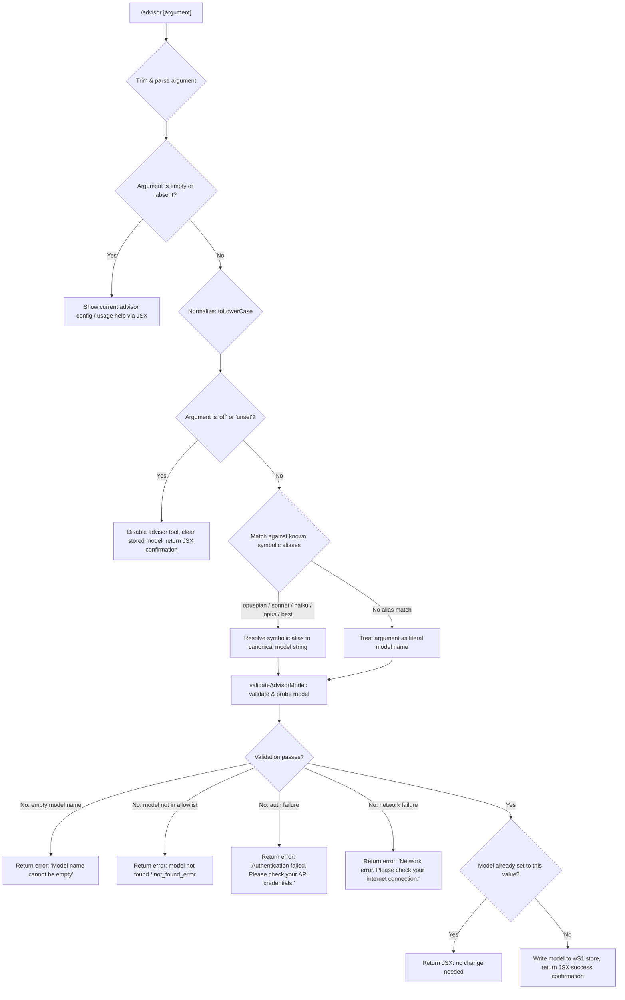

# `/advisor`

> Analysis basis: CC v2.1.148 bundle.js (AST extraction + Claude interpretation)
> Minimum version: v2.1.148

---

## Overview

The `/advisor` command configures the **Advisor Tool**, which allows Claude Code to consult a stronger or alternative model for guidance at key decision points during a task. Users invoke `/advisor` with a model name argument (or a symbolic alias) to set, validate, and optionally probe the advisor model before applying it to the active session. The command renders a JSX confirmation or error UI reflecting the outcome of model selection and validation.

---

## Registration

| Field | Value |
|---|---|
| type | `local-jsx` |
| name | `advisor` |
| description | `Configure the Advisor Tool to consult a stronger model for guidance at key moments during a task` |
| loc_byte | `12101203` |
| loc_byte_end | `12101490` |
| loc_line | `9961` |
| argumentHint | `null` |
| isHidden | `null` |
| module_id | `WS1` |
| load_inline | `true` |
| arbor_handler.name | `Fg7` |
| arbor_handler.fqn | `claude-2.1.148::Fg7` |
| arbor_handler.kind | `AsyncFunction` |
| arbor_handler.resolution_path | `module_id` |
| arbor_handler.n_hits | `1` |

Analysis basis: CC v2.1.148 bundle.js:+12101203

---

## Input Branching

The command exhibits 4+ distinct branches depending on the argument value, model validation result, and network/auth outcomes. A Mermaid flowchart is used.



Analysis basis: CC v2.1.148 bundle.js:+12100659 (handler entry `Fg7`), +12100735 (`"off"`), +12100746 (`"unset"`), +12093062 (`"Model name cannot be empty"`), +12093761 (auth error), +12093863 (network error)

---

## Behavioral Spec

### Top-Level Handler: `advisorCommandHandler` (`Fg7`)

The async handler is the single entry point resolved by Arbor via `module_id → WS1`.

```
async function advisorCommandHandler(commandInput, context):
    rawArg = commandInput.trim()                       // +12100659
    element = createElement(AdvisorResultComponent)    // +12100695

    if rawArg is empty:
        return renderCurrentAdvisorStatus(context)

    normalizedArg = rawArg.toLowerCase()
    resolvedModel = resolveModelAlias(normalizedArg)   // calls lq (+12100813)

    validationResult = validateAndProbeModel(          // calls F08 (+12100827)
        resolvedModel, context
    )

    if validationResult.error:
        return createElement(AdvisorErrorUI, validationResult.error)

    if resolvedModel == "off" or resolvedModel == "unset":
        clearAdvisorModel(context)                     // +12100735, +12100746
        return createElement(AdvisorDisabledUI)

    writeAdvisorModelToStore(resolvedModel, context)   // wS1.set +12093514
    return createElement(AdvisorSuccessUI, resolvedModel, element)
```

Analysis basis: CC v2.1.148 bundle.js:+12100659, +12100695, +12100813, +12100827, +12100853, +12100901, +12100970

---

### Model Alias Resolution: `resolveModelAlias` (`lq`)

Translates symbolic short-names to canonical model identifiers or model-selection strategies.

```
function resolveModelAlias(normalizedInput):
    // Symbolic alias table (bundle.js:+2172032–+2172202):
    aliases = {
        "opusplan": resolve via opusplan strategy,  // +2172032
        "sonnet":   canonical sonnet model,         // +2172073
        "haiku":    canonical haiku model,          // +2172112
        "opus":     canonical opus model,           // +2172151
        "best":     best-available model strategy,  // +2172188
    }

    if normalizedInput in aliases:
        return aliases[normalizedInput]

    // Apply provider-prefix normalization:
    // strip or transform "anthropic." prefix (+2166178)
    // strip or transform "claude-" prefix (+2165799)
    cleaned = applyProviderPrefixNormalization(normalizedInput)

    // Check provider compatibility (bedrock, vertex, etc.) via C9H (+2165327)
    if isKnownProvider(cleaned):
        return buildProviderQualifiedModelName(cleaned)

    return cleaned
```

Analysis basis: CC v2.1.148 bundle.js:+2172032, +2172073, +2172112, +2172151, +2172188, +2171936, +2171947, +2172278

---

### Model Validation & Probe: `validateAndProbeModel` (`F08`)

Performs model name validation, allowlist checks, and a lightweight API probe (with prompt cache and `ephemeral` cache control) before committing the selection.

```
async function validateAndProbeModel(modelName, context):
    trimmedName = modelName.trim()                     // +12093025

    if trimmedName is empty:
        return error("Model name cannot be empty")     // +12093062

    lowerName = trimmedName.toLowerCase()              // +12093185

    if not R9H.includes(lowerName):                    // +12093204
        // Model not in known allowlist
        return error describing unknown model

    if wS1.has(lowerName):                             // +12093306
        // Model already configured — no-op path
        return { noChange: true }

    // Issue a side-query probe API call via rb (+12093351):
    probeResult = await issueAdvisorProbeRequest(      // rb +12091712
        model = lowerName,
        queryType = "side_query",                      // +12891744
        cacheControl = "ephemeral",                    // +12093495
        promptCacheKey = "Hi",                         // +12093470
    )

    if probeResult is auth error:
        return error("Authentication failed. Please check your API credentials.")  // +12093761

    if probeResult is network error:
        return error("Network error. Please check your internet connection.")      // +12093863

    if probeResult.type == "not_found_error":          // +12093982
        return error("model: " + lowerName + " not found")  // +12094064

    // Record validation telemetry
    emit telemetry("tengu_api_success")                // +12893195
    emit telemetry("tengu_prompt_cache_1h_config")     // +12854241

    wS1.set(lowerName, validatedModelEntry)            // +12093514
    return { success: true, model: lowerName }
```

Analysis basis: CC v2.1.148 bundle.js:+12093025, +12093062, +12093185, +12093204, +12093306, +12093351, +12093401, +12093470, +12093495, +12093514, +12093555, +12093761, +12093863, +12093961, +12093982, +12094001, +12094064

---

### Model Name Alias Expansion: `expandModelShorthand` (`yg7` / `hg7`)

Expands version-suffixed shorthand names (e.g., `opus-4-7`, `sonnet-4-5`) to their full canonical API model strings.

```
function expandModelShorthand(rawName):
    candidate = String(rawName)                        // +12094251

    shorthandMap = {
        // Opus variants:
        "opus-4-7"   -> full canonical name,           // +12094331
        "opus_4_7"   -> full canonical name,           // +12094355
        "opus-4-6"   -> full canonical name,           // +12094400
        "opus_4_6"   -> full canonical name,           // +12094424
        "opus-4-5"   -> full canonical name,           // +12094469
        "opus_4_5"   -> full canonical name,           // +12094493
        // Sonnet variants:
        "sonnet-4-6" -> full canonical name,           // +12094538
        "sonnet_4_6" -> full canonical name,           // +12094564
        "sonnet-4-5" -> full canonical name,           // +12094613
        "sonnet_4_5" -> full canonical name,           // +12094639
    }

    lowered = candidate.toLowerCase()                  // hg7 +12094301
    if lowered in shorthandMap:
        return shorthandMap[lowered]

    // Fallback: delegate to provider-aware model resolver (gf)
    return resolveViaProviderGraph(candidate)          // hg7 +12094374
```

Analysis basis: CC v2.1.148 bundle.js:+12093610, +12094283, +12094301, +12094331, +12094355, +12094400, +12094424, +12094469, +12094493, +12094538, +12094564, +12094613, +12094639

---

### Probe API Request Dispatcher: `issueAdvisorProbeRequest` (`rb`)

Dispatches the lightweight validation API call that verifies the chosen model is accessible. Constructs request headers, applies prompt caching (1h), and handles response parsing.

```
async function issueAdvisorProbeRequest(model, options):
    // Build request context via xm (API client) +12891712
    requestPayload = buildAPIRequest(
        model      = model,
        queryType  = options.queryType,              // "side_query" +12891744
        maxTokens  = 1024,                           // +12891560
        messages   = [{role: "user", content: "Hi"}] // +12891316, +12093470
    )

    // Hash the model name for cache key (Go_ / fF1.createHash sha256) +12891905
    cacheKey = sha256(model)[0..4] + sha256(model)[0..7]  // +12847790, +12847792

    // Apply prompt cache hint: 1h ephemeral
    // tengu_prompt_cache_1h_config emitted +12854241

    response = await globalThis.fetch(requestPayload)  // +12891797

    if response is auth error:
        return { error: AUTH_FAILURE }

    if not response.ok:
        return classifyHTTPError(response)

    parsedBody = parseStreamResponse(response)

    // Record timing
    elapsedMs = performance.now() - startTime        // +12892787
    emit("tengu_api_success", { elapsed: elapsedMs }) // +12893195

    return parsedBody
```

Analysis basis: CC v2.1.148 bundle.js:+12891560, +12891712, +12891744, +12891793, +12891797, +12891829, +12891838, +12891850, +12891864, +12892787, +12893167, +12893195

---

### Provider & Model Graph Resolution: `resolveViaProviderGraph` (`gf`)

Walks the provider capability graph to resolve a model name against the active API provider (Bedrock, Vertex, Anthropic first-party, gateway, etc.).

```
function resolveViaProviderGraph(modelName):
    // Known providers: "bedrock", "foundry", "anthropicAws",
    //                  "mantle", "vertex", "firstParty", "gateway"
    //                  (+2029601 – +2030290)

    providerEntry = findProviderEntry(modelName)       // _Q6 +2030797

    if providerEntry is null:
        return buildDefaultModelEntry(modelName)       // hA +2031716

    canonicalName = mapToCanonicalModelId(             // dj4 +2031702
        providerEntry, modelName
    )

    return canonicalName
```

Analysis basis: CC v2.1.148 bundle.js:+2029601, +2029651, +2029707, +2029761, +2029809, +2029818, +2030235, +2030290, +2031677, +2031702, +2031716

---

### Model Display Name Formatter: `formatModelDisplayName` (`fD6`)

Used when rendering the JSX success or status UI to convert internal model IDs to human-readable labels.

```
function formatModelDisplayName(modelId):
    lowered = modelId.toLowerCase()                    // +5266338
    if lowered includes known display suffix:          // +5266361
        return formatted display string
    return modelId
```

Analysis basis: CC v2.1.148 bundle.js:+5266338, +5266361

---

## State & Side Effects

| Item | Detail |
|---|---|
| Telemetry | `tengu_api_success` (+12893195), `tengu_prompt_cache_1h_config` (+12854241), `tengu_bg_dispatch_sigkill_escalate` (+15117585), `tengu_bg_dispatch_low_mem` (+15118164), `tengu_bg_spare_enable` (+15118859), `tengu_bg_spare_claim` (+15118980), `tengu_bg_spare_claim_fail` (+15119243), `tengu_bg_proto_mismatch` (+15105926), `tengu_bg_dispatch_stale_drop` (+15107165), `tengu_bg_attach_legacy_autorespawn` (+15109241), `tengu_bg_attach` (+15109652), `tengu_bg_attach_stall_gave_up` (+15110564), `tengu_bg_attach_stall_respawn` (+15110833), `tengu_bg_attach_kick` (+15111750) |
| Model store write | Validated model name written to `wS1` map via `wS1.set` (+12093514). Cleared on `"off"` / `"unset"`. |
| Probe API side-effect | A live `side_query` API call (max 1024 tokens, +12891560) is made against the chosen model to verify accessibility before committing. |
| Prompt cache | `ephemeral` cache-control hint applied to the probe request (+12093495); `1h` prompt cache configuration emitted (+12854241). |
| appState changes | Advisor model preference updated in session state; no broader appState fields identified at depth-2. |
| Sound | <!-- TODO: not found in depth-2 traversal; needs --depth 4 --> |
| Hash generation | SHA-256 hash of model name computed via `fF1.createHash("sha256")` (+12847853, +12847868) for cache-key derivation. |
| Error output | Auth, network, and model-not-found errors returned as JSX-rendered error components. Console error logging via `w$H` / `console.error` (+2897541). |

---

## Version History

| Version | Change |
|---|---|
| v2.1.148 | Initial analysis |

---

## Common Mistakes

1. **Passing an unrecognized model name without a provider prefix** — the command validates the model via a live probe; if the model string does not match the allowlist (`R9H`) or resolves to `not_found_error`, the command returns an error rather than silently ignoring the argument.
2. **Using `/advisor off` expecting immediate task interruption** — `"off"` and `"unset"` only clear the advisor model preference for future queries; they do not interrupt an in-progress task.
3. **Assuming symbolic aliases like `"best"` or `"opusplan"` map to a fixed model** — these are resolved dynamically at runtime based on the provider graph and may resolve to different canonical model IDs depending on the configured API provider (Bedrock, Vertex, first-party, etc.).
4. **Omitting the argument entirely** — invoking `/advisor` with no argument renders the current configuration status rather than prompting for input; this is by design (read-only display path).
5. **Expecting instant confirmation without a network round-trip** — the command issues a live probe API call (max 1024 tokens) before writing the model to the store; slow or unavailable networks will cause the command to return a network error.

---

## Appendix — Identifier Mapping

> For bundle debugging only. Identifiers change across versions.

| Identifier | Role |
|---|---|
| `Fg7` | Top-level async handler for `/advisor` command (`advisorCommandHandler`) |
| `lq` | Model alias resolver — maps symbolic short-names to canonical model strings |
| `F08` | Model validation and probe orchestrator |
| `rb` | Probe API request dispatcher (issues live `side_query` call) |
| `xm` | Core Anthropic API client — constructs and dispatches HTTP requests |
| `yg7` | Shorthand model name expander (outer wrapper) |
| `hg7` | Shorthand model name expander (inner logic, iterates alias table) |
| `fD6` | Model display name formatter for JSX UI rendering |
| `gf` | Provider-aware model graph resolver |
| `dj4` | Provider-to-canonical model ID mapper |
| `_Q6` | Provider entry lookup (searches known provider list) |
| `hA` | Default model entry builder / string normalizer |
| `W3` | Model string construction helper |
| `kv` | Model resolution sub-step (delegates to W3 and gf) |
| `A99` | Model resolution variant (delegates to kv) |
| `kmH` | Model resolution variant (delegates to gf) |
| `yv` | Model canonicalization sub-pipeline |
| `AaA` | Provider attribute enumerator (Object.entries over provider map) |
| `AQ6` | Provider entry formatter / HA wrapper |
| `HA` | Provider entry to string mapper |
| `FF` | Model filtering and classification pipeline |
| `W24` | Model string matching sub-step (prefix detection) |
| `G24` | Model string matching sub-step (prefix + provider check) |
| `H99` | Model prefix check helper (`startsWith "claude-"`) |
| `ImH` | Model string inclusion checker (X24 allowlist) |
| `_99` | Model index finder (indexOf within candidate list) |
| `Sd6` | Model string membership check (E24 set) |
| `ymH` | Model string normalizer helper (UH delegate) |
| `C9H` | Provider compatibility checker (R9H allowlist includes) |
| `GW` | Model resolution dispatch entry point |
| `u9H` | UH delegate for model string building |
| `UH` | Core string-to-model-identifier converter |
| `tVH` | Prompt-cache and memory-relevance configuration handler |
| `V6` | Provider/model flag applicator (sets flags in Pg map) |
| `GA` | API dispatch-level model applicator |
| `MZ` | Model entry wrapper builder |
| `_1_` | Inner model entry builder (delegates to hA) |
| `bd6` | Request body builder / cache-control injector |
| `Rd6` | Async store reader (`f99.getStore`) |
| `bD` | Sync store reader (`K99.getStore`) |
| `nr6` | Response classifier (temperature check, jq/Pt delegates) |
| `SGH` | Response-level model check (claude-3-, opus-4, sonnet-4 strings) |
| `jq` | Model response wrapper (AQ6/Ij/By8/eP delegates) |
| `Sh` | Model response normalizer (hA delegate) |
| `st7` | Message role/content finder (user/text extraction) |
| `Go_` | SHA-256 hash generator for cache key (`fF1.createHash`) |
| `eP` | Response text cleaner (H.replace) |
| `Y2` | Response message mapper (H.map) |
| `mOH` | Response body processor (vq/Array.isArray/N/CH/Um/I5/h6) |
| `CH` | JSON stringifier wrapper |
| `Um` | Random bytes / nonce generator (`Sy9.randomBytes`) |
| `I5` | Response item classifier (mD/x6) |
| `uF1` | Response utility helper |
| `bZH` | Telemetry event emitter (aOL/RH delegates) |
| `aOL` | Telemetry event router (`CZH`/`H98.has`) |
| `RH` | Telemetry record writer (n_/UH/j1/FpK/bbH/Gl.logError) |
| `GQ` | Telemetry event queuer (oOL/RH) |
| `oOL` | Telemetry event path normalizer |
| `w86` | Telemetry flush / side-channel writer |
| `y5H` | Elapsed time / performance metric helper |
| `c` | Shared utility / context holder |
| `mD` | Auth credential resolver (cK/Uv/EO/XA/GJ/r$/ZqH) |
| `Uv` | OAuth token applicator ($Q6/cK/ZqH/gl/Bv/UH) |
| `sU6` | Proxy auth helper executor (xWH/lmA/h_/N/Date.now/EC/gP) |
| `Eu4` | Stream/connection ID manager (BX9.randomUUID/f.has/f.set/f.get) |
| `RD` | Request decoration helper (HQ6/gj4/hA/eg6) |
| `tz` | Token/auth context injector (UH/EC/ul/pu6/nmA) |
| `Xu4` | Request finalizer (Br6/tV/ERH/IXH/R9) |
| `Br6` | Request dispatch wrapper (HX/Bq/jq/tV) |
| `v3H` | Rate-limit / retry scheduler (Hz/Date.now/Promise/Ly8/JW4/qk6) |
| `Ky8` | Timestamp recorder (Date.now) |
| `DM6` | Header case normalizer (Object.entries/q.toLowerCase) |
| `w$H` | SDK error logger (console.error) |
| `Nt8` | URL encoder helper (H.replace/encodeURIComponent) |
| `Wu4` | URL path parser (split/trim/indexOf/slice) |
| `Rq` | Background context resolver (T3H) |
| `jn` | Error descriptor builder (Rd6) |
| `h6` | Environment capability probe (oV) |
| `i$` | Connection state tracker (z1_) |
| `$99` | Boolean flag coercer |
| `Hz` | Abort/cancel controller reference |
| `h_` | Session trust state accessor |
| `Pu4` | Gateway request helper (GJ/OUH) |
| `Lc6` | WIF / cloud credential fetcher (fetch/AbortSignal.timeout) |
| `BmH` | Provider header builder (Lc6/H.provider/bH/String/mH/GW4/N) |
| `IXH` | Model prefix validator (kDK.find/H.startsWith/Wk6) |
| `Vj` | Response variant dispatcher (r$) |
| `P` | Daemon/subprocess IPC reader (Buffer.concat/J.indexOf/w.off) |
| `w` | Daemon subprocess manager (KB.spawn/C.kill/setTimeout/mH/bH) |
| `KM` | IPC stream terminator (H.end/CH) |
| `J` | IPC message framer (w) |
| `fj5` | Daemon protocol handler (full PTY/session lifecycle) |
| `ZH` | String coercer (String) |
| `T` | Remote control input handler (b.preventDefault/IW/Y/H) |
| `C` | Supervisor write handler (SfK/Az/N/RH/Nj5/z.write) |
| `h` | Focus/blur session poller (Vg/Date.now/Math.min/I/Z/s6K) |
| `I` | Away-summary generator (N/Date.now/VY8/xM5/s6K/Z/w18/mH/_/sM1) |
| `V` | IPC variant dispatcher |
| `EkH` | MCP server connection orchestrator (Object.entries/RHH/TN/H/K.push/s8/K.filter/F06/rj7/GK8/XK8/z8/ux_/mx_/jy/wL1/bx_/B2_/j.push/Promise.all/PU/VLH/Ti/y.push/k7/ZH/OL1/g06/Ru_) |
| `k7K` | MCP update applicator (H.applyMcpUpdate/kJ8/A.cleanup/sN/nj) |
| `N` | Log level router (Q_6/vJK/H.includes/CH/_.toUpperCase/f4/H.trim/hI/lRH/kJK) |
| `$` | Session container reference (ZC1) |
| `_D5` | MCP server state diffuser (Object.entries/A.filter/_.getClients/EK8/q/r8/N/laH/EkH/k7K/Object.fromEntries/K.map) |
| `K` | Display padding helper (L.map/M.padEnd) |
| `M` | Stream/transport adapter (A.close/q.close/L) |
| `q` | File cleanup handler (HfK.unlinkSync) |
| `L` | Active-set tracker (q.add/M.finally/q.delete) |
| `A` | Generic transform / model string holder |
| `H` | Generic value / model response holder |
| `_` | Generic utility / secondary model string |
| `F06` | MCP server type classifier |
| `YN8` | MCP server status checker |
| `G` | MCP server list / push accumulator (F06/YN8) |
| `Ws6` | Session context builder (hA) |
| `uy8` | Cache warm-up helper |
| `my8` | Memory/relevance gate check |

---

Note: index built via Arbor fallback; some signals (telemetry, literals) may be missing — see arbor-fallback.js.