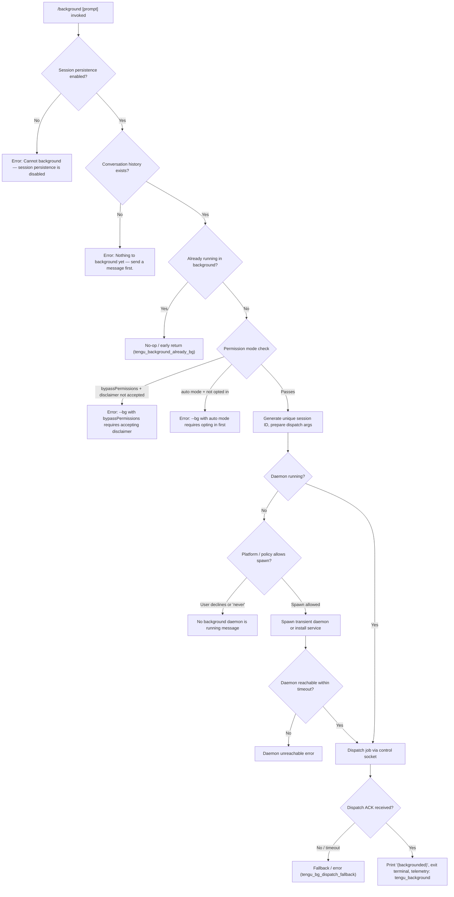

# `/background`

> Analysis basis: CC v2.1.148 bundle.js (AST extraction + Claude interpretation)
> Minimum version: v2.1.148

---

## Overview

The `/background` command (alias `/bg`) detaches the current interactive Claude Code session and hands it off to the background daemon, freeing the terminal for other work. It serializes the session state, dispatches a job to the daemon process (spawning one if necessary), and returns control to the shell. An optional prompt argument may be passed to continue the session with a new instruction after backgrounding.

---

## Registration

| Field | Value |
|---|---|
| type | `local-jsx` |
| name | `background` |
| description | `Send this session to the background and free the terminal` |
| argumentHint | `[prompt]` |
| aliases | `["bg"]` |
| immediate | `null` |
| load_inline | `true` |
| module_id | `zp1` |
| loc_byte | `12516447` |
| loc_byte_end | `12516687` |
| loc_line | `10721` |
| arbor_handler.name | `cr7` |
| arbor_handler.fqn | `claude-2.1.148::cr7` |
| arbor_handler.kind | `AsyncFunction` |
| arbor_handler.resolution_path | `module_id` |
| arbor_handler.n_hits | `0` |

Analysis basis: CC v2.1.148 bundle.js:+12516447

---

## Input Branching

The command has 5+ distinct branches depending on session state, permission mode, and daemon availability.



---

## Behavioral Spec

### Handler Entry — `cr7` (async)

Analysis basis: CC v2.1.148 bundle.js:+12515808

```
async function backgroundCommandHandler(context):
    // 1. Guard: session persistence must be enabled
    if sessionPersistenceDisabled:
        displayError("Cannot background — session persistence is disabled, ...")
        return

    // 2. Guard: there must be conversation history to fork
    if conversationHistoryEmpty:
        displayError("Nothing to background yet — send a message first.")
        return

    // 3. Guard: detect if already backgrounded
    if alreadyBackgrounded:
        emit telemetry: tengu_background_already_bg
        return early

    // 4. Permission-mode gates (see gateCheck sub-function)
    gateResult = checkPermissionGates(currentSettings)
    if gateResult == "gate_blocked":
        return with appropriate error message

    // 5. Build argument vector for the daemon worker
    args = buildDaemonArgVector(sessionState, inputPrompt)

    // 6. Ensure daemon is running (ensureDaemonRunning)
    daemonHandle = await ensureDaemonRunning(context)
    if daemonHandle fails:
        display error per failure code
        return

    // 7. Dispatch job to daemon
    dispatchResult = await dispatchToDaemon(daemonHandle, args)
    if dispatchResult.error:
        emit telemetry: tengu_background_spawn_failed
        display error
        return

    // 8. Success path
    emit telemetry: tengu_background
    displayUI("(backgrounded)")
    exitTerminalSession()
```

Analysis basis: CC v2.1.148 bundle.js:+12515808

---

### Permission Gate — `checkPermissionGates` (maps to call via `Pc` → `gr7`)

Analysis basis: CC v2.1.148 bundle.js:+12492220

```
function checkPermissionGates(settings):
    // Gate 1: bypassPermissions mode
    permMode = settings.permissionMode  // arg "--permission-mode"
    if permMode == "bypassPermissions":
        // Check disclaimer was accepted interactively
        // "--dangerously-skip-permissions" or "--allow-dangerously-skip-permissions"
        if disclaimerNotAccepted:
            return error("--bg with bypassPermissions requires accepting the disclaimer first. " +
                         "Run `claude --dangerously-skip-permissions` once interactively.")

    // Gate 2: auto mode
    if permMode == "auto":
        if autoModeOptInMissing:
            return error("--bg with auto mode requires opting in first. " +
                         "Run `claude --permission-mode auto` once interactively.")

    return "ok"
```

Analysis basis: CC v2.1.148 bundle.js:+12509286 (permission-mode check), +12509529 (bypassPermissions error literal), +12509691 (auto-mode error literal)

---

### Argument Vector Construction — `buildDaemonArgVector` (maps to `Rr7`)

Analysis basis: CC v2.1.148 bundle.js:+12492725

The function assembles the CLI argument list that the daemon worker process will receive. Key argument slots (identified from literals):

| Argument | Purpose |
|---|---|
| `--agent` | Marks invocation as a background agent |
| `--name` / `-n` | Session name |
| `--resume=<id>` / `-r=<id>` / `--resume` / `-r` | Resume a prior session by ID |
| `--session-id=<id>` / `--session-id` | Explicit session identifier (length 9 chars for short form) |
| `--fork-session` | Fork-session mode |
| `-c` / `--continue` | Continue an existing session |
| `--permission-mode` | Pass current permission mode through |
| `CLAUDE_CONFIG_DIR`, `AWS_*`, `GOOGLE_*` | Environment variables forwarded |

```
function buildDaemonArgVector(sessionState, inputPrompt):
    args = []

    // Resolve session identity
    sessionId = generateOrReuseSessionId()   // _p1.randomUUID, sliced to 8 chars
    args.push("--agent", "--name", sessionState.name)
    args.push("--session-id=" + sessionId)

    // Add resume pointer if session has prior history
    if sessionState.hasHistory:
        args.push("--resume=" + sessionState.resumeId)

    // Forwarded permission flags
    if permMode != "default":
        args.push("--permission-mode", permMode)

    // Optional user prompt appended last
    if inputPrompt:
        args.push(inputPrompt)

    return args
```

Analysis basis: CC v2.1.148 bundle.js:+12492768 (`--agent`), +12492795 (`--name`), +12508513 (`--resume=`), +12508867 (`--session-id=`)

---

### Daemon Ensure-Running — `ensureDaemonRunning` (maps to `_B`)

Analysis basis: CC v2.1.148 bundle.js:+12455613

```
async function ensureDaemonRunning(context):
    // Check if daemon socket is already reachable
    status = checkDaemonStatus()   // reads daemon.status.json

    if status == "up":
        // Stale-exec guard: verify binary path hasn't changed
        if binaryIsStale:
            emit telemetry: tengu_bg_daemon_service_stale_exec
            // Fall back to transient spawn
        else:
            return existingDaemonHandle

    // Platform branching: macOS / Linux
    platform = detectPlatform()   // "macos" | "linux"

    if platformAllowsServiceInstall and policy == "ask":
        // Prompt: "Install as a service now? [y/N/never, or 'once' just for now] "
        answer = promptUser()
        emit telemetry: tengu_bg_daemon_cold_start_ask_answer

        if answer == "yes" or answer == "once":
            installDaemonService()
            emit telemetry: tengu_bg_daemon_install
            waitForDaemonReachable(timeout=5000ms)
            if notReachable:
                throw "service installed but the daemon did not become reachable within 5s"
        else if answer == "never":
            persistNeverAnswer()
    else:
        // Transient spawn path
        spawnTransientDaemon(args=["run", "--origin", "transient", "--spawned-by", ...])
        waitForDaemonReachable(timeout=30000ms or 60000ms)
        if notReachable:
            emit telemetry: tengu_bg_daemon_spawn_failed (or transient-unreachable variant)
            throw error

    return daemonHandle
```

Analysis basis: CC v2.1.148 bundle.js:+12455633 (daemon status check), +12460140 (install prompt literal), +12457051 (`run` arg), +12457321 (30 000 ms timeout), +12460671 (5 000 ms timeout)

---

### Dispatch to Daemon — `dispatchToDaemon` (maps to `gi_`)

Analysis basis: CC v2.1.148 bundle.js:+12487775

```
async function dispatchToDaemon(daemonHandle, args):
    // Write dispatch file to jobs directory
    jobDir = path.join(configDir, "jobs", jobId)
    mkdirSync(jobDir)
    writeAtomically(dispatchFile, jobPayload)   // uses randomBytes(4)-hex temp name

    // Open control socket connection ("cli-bg-dispatch")
    socket = connectToControlSocket(daemonHandle.socketPath)
    socket.unref()   // don't keep process alive

    // Set ACK wait timeout: 6000 ms
    ackTimeout = setTimeout(6000)

    // Await lease / ACK response
    result = await waitForAck(socket)

    if result.code == "EALIVE":
        // Daemon acknowledged; job is running
        clearTimeout(ackTimeout)
        emit telemetry: tengu_bg_dispatch
        return success

    else if result.code == "ESTALE" or "stale-short":
        // Previous session still shutting down
        return error("Previous session is still shutting down — try again in a moment")

    else if result.code == "ESTARTING":
        // Daemon still starting up; wait up to 200 ms additional
        ...

    else if ackTimedOut:
        emit telemetry: tengu_bg_dispatch_fallback
        return error("timed out")

    // Spare-slot management (memory-pressure aware)
    if lowMemory:
        emit telemetry: tengu_bg_dispatch_low_mem

    if spareSlotAvailable:
        emit telemetry: tengu_bg_spare_claim
    else:
        emit telemetry: tengu_bg_spare_claim_fail
```

Analysis basis: CC v2.1.148 bundle.js:+12488025 (`cli-bg-dispatch` literal), +12488266 (6 000 ms timeout), +12488368 (`EALIVE`), +12488498 (`ESTALE`), +12489048 (200 ms wait), +12489879 (`tengu_bg_dispatch`)

---

### UI Render — `zT8` (JSX component)

Analysis basis: CC v2.1.148 bundle.js:+12513309

The command renders a JSX component after dispatch. Key behaviors:

- Displays the text `(backgrounded)` upon successful hand-off (literal at +12513589).
- An AbortSignal with a 120-second timeout governs the backgrounding operation (literal at +12513359).
- On the daemon side the session is marked with state `"background session"` (literal at +15153554).

---

### Daemon Worker Reception — `mLH`

Analysis basis: CC v2.1.148 bundle.js:+10550188

When the daemon worker receives the forked job:

```
function daemonWorkerHandleDetach(message):
    // Message type: "detach-request"
    // Worker kind: "daemon-worker"
    if messageType == "detach-request":
        writeToStdout()        // jo.write — acknowledgment
        updateJobState("task")
        notifyDaemonBus()      // h8H
```

Analysis basis: CC v2.1.148 bundle.js:+10550222 (`detach-request`), +10544815 (`task`)

---

## State & Side Effects

| Item | Detail |
|---|---|
| Telemetry: `tengu_background` | Fired on successful backgrounding (bundle.js:+12512901) |
| Telemetry: `tengu_background_already_bg` | Fired when session is already in background (bundle.js:+12515822) |
| Telemetry: `tengu_background_spawn_failed` | Fired when daemon spawn/dispatch fails (bundle.js:+12512832) |
| Telemetry: `tengu_bg_dispatch` | Fired when daemon ACKs the job (bundle.js:+12489879) |
| Telemetry: `tengu_bg_dispatch_fallback` | Fired on dispatch ACK timeout/failure (bundle.js:+12490405) |
| Telemetry: `tengu_bg_dispatch_rescued` | Fired when dispatch recovers after failure (bundle.js:+12495697) |
| Telemetry: `tengu_bg_dispatch_low_mem` | Fired when daemon is under memory pressure (bundle.js:+15118164) |
| Telemetry: `tengu_bg_dispatch_sigkill_escalate` | Fired when daemon escalates to SIGKILL (bundle.js:+15117585) |
| Telemetry: `tengu_bg_spare_enable` | Fired when spare slot is activated (bundle.js:+15118859) |
| Telemetry: `tengu_bg_spare_claim` | Fired when spare slot is claimed for new job (bundle.js:+15118980) |
| Telemetry: `tengu_bg_spare_claim_fail` | Fired when spare slot claim fails (bundle.js:+15119243) |
| Telemetry: `tengu_bg_spare_spawn` | Fired when daemon spawns a spare worker (bundle.js:+15117278) |
| Telemetry: `tengu_bg_daemon_cold_start_ask` | Fired when user is prompted to install service (bundle.js:+12456679) |
| Telemetry: `tengu_bg_daemon_cold_start_ask_answer` | Fired with user's answer to install prompt (bundle.js:+12460215) |
| Telemetry: `tengu_bg_daemon_install` | Fired when daemon service is installed (bundle.js:+12456114) |
| Telemetry: `tengu_bg_daemon_service_stale_exec` | Fired when daemon binary path is stale (bundle.js:+12455731) |
| Telemetry: `tengu_bg_daemon_service_poll_fallthrough` | Fired when service poll falls through (bundle.js:+12456355) |
| Telemetry: `tengu_bg_daemon_spawn_failed` | Fired when transient daemon spawn fails (bundle.js:+12457113) |
| Telemetry: `tengu_daemon_config_reload` | Fired when daemon reloads config (bundle.js:+15132353) |
| Telemetry: `tengu_rename_full_session_fork` | Fired when session is fully forked/renamed (bundle.js:+11500430) |
| Telemetry: `tengu_amber_anchor` | Fired during background-service path (bundle.js:+3178467) |
| Telemetry: `tengu_config_parse_error` | Config read errors during setup (bundle.js:+3187440) |
| Telemetry: `tengu_config_lock_contention` | Config lock contention (bundle.js:+3184859) |
| Telemetry: `tengu_config_stale_write` | Stale write prevention (bundle.js:+3184995) |
| Telemetry: `tengu_config_auth_loss_prevented` | Auth-loss write guard (bundle.js:+3185338) |
| File I/O | Dispatch file written to `<configDir>/jobs/<jobId>/`; `daemon.status.json` read to check daemon health |
| Socket I/O | Control socket connection opened (`bX8.connect`) with `unref()` so it does not keep the CLI process alive |
| Session fork | A new session ID (UUID, first 8 chars) is generated for the background job |
| Job directory | Created via `M_H.mkdir` / `$T8.mkdir`; cleaned up with `M_H.rm` on failure |
| appState changes | Session state transitions to `"background session"` in daemon; terminal process exits |
| Process signals | Daemon may issue `SIGKILL` after grace period if a prior worker does not exit cleanly |
| AbortSignal timeout | 120 seconds governs the overall backgrounding operation (bundle.js:+12513359) |
| Sound | None detected |

---

## Version History

| Version | Change |
|---|---|
| v2.1.148 | Initial analysis |

---

## Common Mistakes

1. **Running `/background` before sending any message** — The command requires at least one exchange in the conversation. If the history is empty it exits with "Nothing to background yet — send a message first."
2. **Using `bypassPermissions` mode without the interactive disclaimer** — If the session was started with `--dangerously-skip-permissions` you must have accepted the disclaimer at least once interactively before `/background` will proceed.
3. **Using `auto` permission mode without prior opt-in** — The first use of auto mode must be done interactively (`claude --permission-mode auto`) before `/background` accepts it.
4. **Invoking `/background` when session persistence is disabled** — Headless or SDK-based sessions without persistence support cannot be backgrounded; the command returns an error immediately.
5. **Calling `/background` when the previous background job has not finished shutting down** — The daemon responds with `ESTALE` / `short_alive` and the command surfaces "Previous session is still shutting down — try again in a moment."
6. **Ignoring daemon-install prompts then retrying** — Answering "never" to the service-install prompt causes subsequent `/background` calls to fail until a daemon is running via other means (`claude daemon install`).

---

## Appendix — Identifier Mapping

> For bundle debugging only. Identifiers change across versions.

| Identifier | Role |
|---|---|
| `cr7` | Async handler for `/background` command (Arbor-resolved entry point) |
| `OT8` | Background command JSX render / main orchestrator function |
| `zT8` | JSX UI component rendered after backgrounding |
| `Pc` | Gate-check + session-ID generation + dispatch prep coordinator |
| `gr7` | Permission-mode gate checker (bypassPermissions / auto checks) |
| `Rr7` | Daemon argument vector builder |
| `gi_` | Core dispatch-to-daemon async function |
| `_B` | Ensure-daemon-running (cold-start, install-or-spawn logic) |
| `vZ6` | Daemon service install/prompt flow |
| `Bi_` | Dispatch fallback / error classifier |
| `xX8` | Control socket listener (lease/ACK handler) |
| `YO` | Control socket writer / request sender |
| `wyH` | Dispatch file path builder |
| `am1` | Dispatch success / result handler |
| `mLH` | Daemon worker message handler (detach-request) |
| `Mz1` | Daemon worker state updater |
| `Jo` | Daemon worker stdout writer (ACK) |
| `h8H` | Daemon bus notifier |
| `$PH` | Environment / production-mode resolver used in handler |
| `wU1` | Sub-resolver within `$PH` |
| `dR` | Sub-resolver within `$PH` |
| `Rq` | Helper called at handler entry (daemon-worker type check) |
| `T3H` | Daemon-worker type constant / helper |
| `ZtH` | Session fork / rename orchestrator (full-session fork path) |
| `gC7` | Fork agent query runner |
| `FW` | Forked-agent main loop |
| `tY8` | App-state getter/setter for forked session |
| `Ek8` | MCP / extra-dir argument builder |
| `X` | MCP server connector (SDK type) |
| `G` | MCP server connector (HTTP/SSE type) |
| `R8H` | Spare-slot spawner |
| `M8` | Config / worktree resolver used during argument build |
| `_L_` | Config file writer with lock and backup |
| `k$H` | Config file reader |
| `sq6` | Atomic file writer (uses temp + rename) |
| `AL_` | Backup-directory path builder |
| `HL_` | Config directory initialiser |
| `n99` | File-write helper with Object.assign merge |
| `V6` | Telemetry / analytics event emitter |
| `ZH` | String coercer / formatter |
| `CH` | JSON serialiser wrapper |
| `B6` | JSON parser wrapper |
| `N` | Logger / debug output helper |
| `RH` | Error normaliser / structured error builder |
| `n_` | Error constructor helper |
| `UH` | String coercer (simple) |
| `j1` | Extended error wrapper |
| `XwA` | Error metadata attacher |
| `FpK` | Error queue manager (shift/push) |
| `w_` | App-store accessor (outer) |
| `oV` | App-store accessor (inner) |
| `sb6` | AsyncLocalStorage store reader |
| `b6` | Context-store reader |
| `ZC1` | Daemon status file reader |
| `aE6` | Status file path builder (`daemon.status.json`) |
| `ll` | Low-level status reader |
| `M1` | AsyncLocalStorage `getStore` wrapper |
| `RK` | Jobs-directory path builder |
| `wG` | Jobs path helper |
| `dq` | Job-state file reader/writer |
| `h5` | Atomic job-file writer |
| `ez` | Atomic file write primitive (randomBytes temp name) |
| `Cw` | Job-file cache invalidator |
| `Ge` | Active/working state resolver |
| `f4` | Path-redaction helper (`[REDACTED]`) |
| `rm1` | Argument list formatter |
| `Sr7` | Shell / platform resolver |
| `qx6` | Windows / Git-Bash check |
| `Fr7` | Argument prefix builder |
| `Lp1` | `--resume` argument parser |
| `dr7` | Agent-type flag checker |
| `Mp1` | Environment variable forwarder builder |
| `Br7` | Session-ID argument parser |
| `fp1` | Fleet / multi-session mode checker |
| `mS` | Background-type classifier (`"bg"`) |
| `UB` | Job-list fetcher |
| `HY` | Background-service label resolver |
| `v$H` | Service-label helper |
| `br7` | Background-status string builder |
| `ut` | Telemetry metadata builder |
| `mqH` | Telemetry event helper |
| `LPH` | Supervisor / heartbeat config writer |
| `sx1` | Config key-width calculator |
| `kfK` | Heartbeat scheduler |
| `xt` | Heartbeat tick function |
| `T` | Remote-control handler (remoteControlAtStartup) |
| `Y` | Supervisor start/stop/update manager |
| `i` | Process-allow checker |
| `w` | Worker process manager (spawn, kill, memory) |
| `d` | Process task dispatcher |
| `Xc` | Permission-mode set membership checker |
| `hr7` | Permission-mode allowed-set |
| `Lm` | Settings loader (userSettings / localSettings / flagSettings / policySettings) |
| `m8` | Settings merger |
| `x6` | Config file watcher / hot-reload |
| `EQ4` | File watch setup (`watchFile` / `unwatchFile`) |
| `JC` | Settings object builder |
| `HX` | Auth-type resolver |
| `hA` | Auth base-URL resolver |
| `$5` | Auth credential helper |
| `Vt8` | API-key type classifier (`sk-ant-` prefix check) |
| `Bq` | Auth provider aggregator |
| `kmH` | Auth finaliser |
| `OO` | `compact_boundary` / output-slice helper |
| `_W7` | Output prefix extractor |
| `pX` | Compact boundary constant |
| `ROH` | Context / file-read orchestrator for dispatch |
| `h6` | Low-level file-open helper |
| `jG` | Job-directory base-name resolver |
| `Rk` | Agent execution driver |
| `TK` | Tool-set builder |
| `Fj8` | File-context assembler |
| `Bj8` | File-context base type |
| `gG` | Full agent query executor |
| `OD7` | Tool-result formatter |
| `d11` | Tool-schema helper |
| `FyH` | Agent result handler |
| `Tx_` | Agent turn runner |
| `xF1` | Core API query function (streaming + non-streaming) |
| `CO` | Telemetry event wrapper (h6 + v4) |
| `xU` | Alternative telemetry event wrapper |
| `NU` | Array normaliser |
| `aJ8` | Tool-call checker |
| `nk` | Tool-schema normaliser |
| `Rd` | Tool-list filter |
| `MsH` | Tool-name prefix checker |
| `LK` | Tool-list filter (H.filter) |
| `yG1` | Session-name generator |
| `Wh` | String trimmer helper |
| `e28` | Message assembler / joiner |
| `G8` | Turn initiator |
| `J` | Worker accessor |
| `j` | Worker kill helper |
| `D` | Worker lifecycle manager |
| `BG7` | Fork-agent callback |
| `ijH` | Stream-event processor |
| `yP8` | Stream idle-warning handler |
| `PM1` | Stream tombstone handler |
| `HG6` | Message-type classifier |
| `Cx` | Subagent-exit / command-lifecycle handler |
| `H8H` | Telemetry pair (v4 + YkH) |
| `ck` | Random-bytes generator for request ID |
| `HU_` | Daemon uptime / health checker |
| `D86` | Daemon health detail helper |
| `NHH` | Abort-controller factory |
| `Rq` | Daemon-worker type check at handler entry |
| `T3H` | Daemon-worker type string constant |
| `ai_` | UUID generator wrapper (v4) |
| `v4` | UUID v4 implementation |
| `r9` | Service/plugin registrar |
| `Nf` | Session-type filter (`"session"`) |
| `aV` | Active-sessions collector |
| `TVH` | Additional argument builder |
| `wD6` | Argument pass-through helper |
| `q8` | Error logger |
| `Wf6` | Config-write lock helper |
| `sUH` | Config sync helper |
| `yy9` | Config entries iterator |
| `tUH` | Config timestamp helper |
| `F6` | Filesystem error classifier |
| `o4_` | Config path resolver |
| `MG` | Config directory getter |
| `YN8` | MCP connection factory |
| `jy` | MCP transport helper |
| `PU` | MCP capability negotiator |
| `VLH` | MCP tool lister |
| `Ti` | MCP tool formatter |
| `F06` | MCP HTTP transport |
| `ey` | Extra argument injector |
| `UB` | Background job list fetcher |

---

Note: index built via Arbor fallback; some signals (telemetry, literals) may be missing — see arbor-fallback.js.