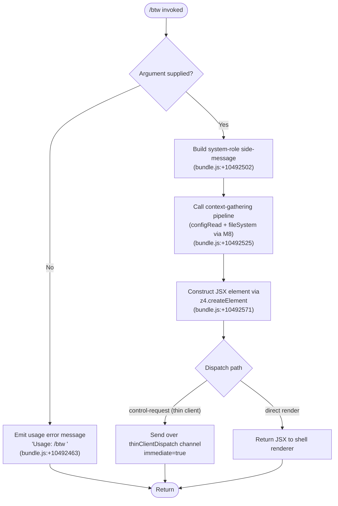

# `/btw`

> Analysis basis: CC v2.1.148 bundle.js (AST extraction + Claude interpretation)
> Minimum version: v2.1.148

---

## Overview

`/btw` ("by the way") allows the user to ask a quick side question or inject an out-of-band remark without formally interrupting or branching the main agentic conversation. The command is dispatched immediately via the `control-request` thin-client channel, and its handler (`PT7`) renders a JSX response directly while delegating context-gathering and config I/O to a supporting pipeline.

---

## Registration

| Field | Value |
|---|---|
| type | `local-jsx` |
| name | `btw` |
| description | Ask a quick side question without interrupting the main conversation |
| argumentHint | `<question>` |
| immediate | `true` |
| thinClientDispatch | `control-request` |
| module_id | `c$1` |
| load_inline | `true` |
| loc_byte | `10492866` |
| loc_byte_end | `10493105` |
| loc_line | `8316` |
| arbor_handler.name | `PT7` |
| arbor_handler.fqn | `claude-2.1.148::PT7` |
| arbor_handler.kind | `AsyncFunction` |
| arbor_handler.resolution_path | `module_id` |
| arbor_handler.n_hits | `0` |

Analysis basis: CC v2.1.148 bundle.js:+10492866

---

## Input Branching

Three distinct branches exist in the handler: missing argument (usage error), system-role injection, and normal question dispatch. A Mermaid flowchart is used accordingly.



Analysis basis: CC v2.1.148 bundle.js:+10492461, +10492463, +10492502, +10492525, +10492571

---

## Behavioral Spec

### 1. Argument Validation

```
async function btwHandler(userInput):
    if userInput is empty or absent:
        return errorMessage("Usage: /btw <your question>")
    proceed to sideMessageDispatch(userInput)
```

If the user invokes `/btw` without any argument text, the handler emits the hard-coded usage string `"Usage: /btw <your question>"` (bundle.js:+10492463) and returns immediately without touching the agent context or config subsystem.

Analysis basis: CC v2.1.148 bundle.js:+10492461, +10492463

---

### 2. System-Role Side-Message Construction

```
async function sideMessageDispatch(question):
    messageRole = "system"          // bundle.js:+10492502
    messageContent = question
    context = await gatherContext() // calls configPipeline (M8)
    element = renderJSX(messageRole, messageContent, context)
    return element
```

The role field of the injected message is set to `"system"` (bundle.js:+10492502), which ensures the side question is framed as an out-of-band system instruction rather than a user turn, thus not visibly interrupting the primary conversation thread. The `immediate: true` flag (registration) means the command bypasses any pending input queue.

Analysis basis: CC v2.1.148 bundle.js:+10492502

---

### 3. Context-Gathering Pipeline (`configPipeline` / `M8`)

```
async function configPipeline(appState):
    stateGraph  = resolveStateGraph(appState)     // MG
    handler     = resolveHandler(appState)        // H → Math.random, setTimeout
    sessionMeta = resolveSessionMeta(appState)    // sUH
    sessionTime = resolveSessionTime(appState)    // yy9 → Object.entries
    timestamp   = resolveTimestamp(appState)      // tUH → Date.now
    context     = buildContextObject(appState)    // N
    config      = readConfigWithLock(appState)    // k$H
    fallback    = resolveFallback(appState)        // Wf6
    fileOps     = resolveFileOps(appState)        // c
    dirHelper   = resolveDirHelper(appState)      // HL_
    return { stateGraph, context, config, ... }
```

`configPipeline` (obfuscated: `M8`, bundle.js:+10492525) is the primary side-effect dispatcher. It reads from the on-disk config via the lock-guarded config reader (`configReadWithLock`, obfuscated: `k$H`) and assembles the context object passed to the JSX renderer.

Analysis basis: CC v2.1.148 bundle.js:+10492525, +3181861, +3181865, +3181885, +3181917, +3181936, +3181961, +3181977, +3182042, +3182058, +3182194, +3182308

---

### 4. Lock-Guarded Config Read (`configReadWithLock` / `k$H`)

```
function configReadWithLock(configPath):
    if configPath not initialized:
        throw Error("Config accessed before allowed.")   // bundle.js:+3186803
    raw = fs.readFileSync(configPath, "utf-8")           // bundle.js:+3186886
    parsed = JSON.parse(raw)                             // via jsonParser
    stripped = stripBomPrefix(parsed)                    // OC
    backupDir = resolveBackupPath(configPath)            // hy9
    if statSync indicates change:
        copyFileSync to backupDir with Date.now stamp    // bundle.js:+3187930, +3187948
    return parsed
```

On a parse error the telemetry event `tengu_config_parse_error` is emitted (bundle.js:+3187440).
On `EEXIST` during backup-directory creation, the error is silently absorbed (bundle.js:+3187654).
Config access before system initialisation throws `"Config accessed before allowed."` (bundle.js:+3186803).

Analysis basis: CC v2.1.148 bundle.js:+3186797, +3186803, +3186859, +3186886, +3186906, +3187400, +3187440, +3187930, +3187948

---

### 5. File-System Lock Acquisition (`fsLock` / `_L_`)

```
function acquireFsLock(lockPath):
    dir = path.dirname(lockPath)
    fs.mkdirSync(dir, { recursive: true })
    timestamp = Date.now()
    writeAtomicSync(lockPath)                        // via atomicWriteSync (sq6)
    if acquisition > expected threshold:
        log("error", "Lock acquisition took longer than expected…")
                                                     // bundle.js:+3184770
        emit telemetry("tengu_config_lock_contention")
    if stale write detected:
        emit telemetry("tengu_config_stale_write")   // bundle.js:+3184995
```

Lock files are written atomically via `atomicWriteSync` (obfuscated: `sq6`), which uses `crypto.randomBytes(6)` for a hex suffix (bundle.js:+1006785, +1006801, +1006813), `fs.openSync`/`writeFileSync`/`fchmodSync`/`fsyncSync` followed by `fs.renameSync` to finalise. The lock-contention warning string is `"Lock acquisition took longer than expected - another Claude instance may be running"` (bundle.js:+3184770).

Auth-loss guard: if a re-read config is missing auth data that the cache holds, the write is aborted and `tengu_config_auth_loss_prevented` is emitted (bundle.js:+3185338). The guard message references GH #3117 (bundle.js:+3185186).

Analysis basis: CC v2.1.148 bundle.js:+3184559, +3184565, +3184586, +3184631, +3184770, +3184859, +3184995, +3185117, +3185148, +3185170, +3185186, +3185338

---

### 6. JSX Render and Dispatch

```
function renderAndDispatch(role, content, context):
    element = z4.createElement(componentType, { role, content, context })
    // bundle.js:+10492571
    if thinClientDispatch == "control-request":
        sendControlRequest(element)   // immediate path
    else:
        return element                // shell renderer path
```

The `immediate: true` flag means the element is not enqueued; it is sent synchronously on the `control-request` channel. The JSX factory used is `z4.createElement` (bundle.js:+10492571).

Analysis basis: CC v2.1.148 bundle.js:+10492571

---

### 7. Background Session / Delay Utility (`delayWithJitter` / `H`)

```
function delayWithJitter(baseMs):
    jitter = Math.random() * 2       // bundle.js:+13143285, +13143287
    delay  = baseMs + 1 + jitter     // bundle.js:+13143301
    return new Promise(resolve => setTimeout(resolve, delay))
                                     // bundle.js:+13143324
```

This utility is reached via the handler chain and is used for retry spacing. Constants: multiplier `2` (bundle.js:+13143285), addend `1` (bundle.js:+13143301).

Analysis basis: CC v2.1.148 bundle.js:+13143285, +13143287, +13143301, +13143324

---

## State & Side Effects

| Item | Detail |
|---|---|
| Telemetry: `tengu_config_lock_contention` | Emitted when lock acquisition exceeds the expected threshold (bundle.js:+3184859) |
| Telemetry: `tengu_config_stale_write` | Emitted when a stale write is detected during config save (bundle.js:+3184995) |
| Telemetry: `tengu_config_parse_error` | Emitted when the config JSON fails to parse (bundle.js:+3187440) |
| Telemetry: `tengu_bg_dispatch_sigkill_escalate` | Emitted when a background session receives a SIGKILL escalation (bundle.js:+15117585) |
| Telemetry: `tengu_bg_dispatch_low_mem` | Emitted when background dispatch detects low memory conditions (bundle.js:+15118164) |
| Telemetry: `tengu_bg_spare_enable` | Emitted when a spare background session slot is enabled (bundle.js:+15118859) |
| Telemetry: `tengu_bg_spare_claim` | Emitted when a spare session is successfully claimed (bundle.js:+15118980) |
| Telemetry: `tengu_bg_spare_claim_fail` | Emitted when spare session claim fails (bundle.js:+15119243) |
| Telemetry: `tengu_config_auth_loss_prevented` | Emitted when a write is aborted to prevent auth data loss (bundle.js:+3185338) |
| Config file I/O | Reads `~/.claude.json` (or equivalent) via lock-guarded read; creates timestamped backups in `backups/` subdirectory (bundle.js:+3186371, +3187948) |
| File-system lock | Atomic lock file written with hex-random suffix, finalised via `rename` (bundle.js:+1006785, +1007473) |
| Auth-loss guard | Write suppressed if re-read config is missing auth data present in cache; references GH #3117 (bundle.js:+3185186, +3185338) |
| thinClientDispatch | `control-request` — sent immediately, bypasses normal input queue |
| `immediate` flag | `true` — no input-queue enqueue; dispatched synchronously |
| JSX render | `z4.createElement` (bundle.js:+10492571) |
| Background session signals | SIGKILL escalation after 30 s / 15 s thresholds (bundle.js:+15117540, +15117551, +15117633) |
| Config lock timeout | 60 000 ms ceiling on config lock wait (bundle.js:+3185540) |
| Config backup retention | Up to 5 backup files retained (bundle.js:+3185789) |

---

## Version History

| Version | Change |
|---|---|
| v2.1.148 | Initial analysis |

---

## Common Mistakes

1. **Omitting the argument**: Calling `/btw` with no text yields the usage message `"Usage: /btw <your question>"` and no agent action is taken. Always supply a question string.
2. **Expecting conversational threading**: `/btw` injects its content as a `"system"`-role message, not a `"user"` turn. The main conversation flow is not branched or forked; the side question is processed as an out-of-band instruction.
3. **Assuming deferred delivery**: Because `immediate: true` is set and the dispatch channel is `control-request`, the message is sent synchronously. Any assumption of queued or deferred processing is incorrect.
4. **Concurrent Claude instances**: The config lock subsystem will emit `tengu_config_lock_contention` if another Claude process holds the lock. The warning message explicitly names this scenario (bundle.js:+3184770).
5. **Config-before-init errors**: If `/btw` is somehow triggered before the config subsystem initialises, a hard `"Config accessed before allowed."` error is thrown (bundle.js:+3186803) — this is a programming invariant, not a user error.

---

## Appendix — Identifier Mapping

> For bundle debugging only. Identifiers change across versions.

| Identifier | Role |
|---|---|
| `PT7` | Main async handler for `/btw` (arbor_handler; AsyncFunction; resolved via module_id) |
| `H` | Delay-with-jitter utility (uses `Math.random` + `setTimeout`) |
| `M8` | Context-gathering / config pipeline dispatcher |
| `_L_` | File-system lock acquisition and config-save orchestrator |
| `_` | Low-level file-system primitive (readdirStringSync, statSync) |
| `F6` | File-existence / access check utility |
| `L` | Async file handle / stream manager (add, finally, delete lifecycle) |
| `q` | Synchronous `fs` wrapper (readFileSync, statSync, copyFileSync, mkdirSync, readdirStringSync, renameSync, unlinkSync) |
| `M` | Promise/stream finaliser (close, finally chain) |
| `n99` | Config object assembler (Object.assign) |
| `et8` | Sub-assembler called by config object assembler |
| `N` | Context-object builder (includes debug logging and path helpers) |
| `vJK` | Sub-context builder (calls `Av`, `VJK`, `j9A`) |
| `CH` | JSON serialisation helper (JSON.stringify) |
| `f4` | String/path formatter (replace, at, lastIndexOf, slice; redacts sensitive values) |
| `lRH` | Sub-formatter helper |
| `kJK` | File read + byte-length measurement pipeline |
| `c` | App-state / session accessor |
| `q8` | Error classification / throw utility |
| `k$H` | Lock-guarded config reader with backup logic |
| `B6` | JSON parse wrapper |
| `OC` | BOM-prefix stripper (startsWith + slice) |
| `hy9` | Backup directory resolver (basename, readdirStringSync, dirname) |
| `RH` | Error logger / push-to-error-list helper |
| `AL_` | Backup path joiner (`backups/` + filename) |
| `w` | Background session spawn and memory monitor |
| `Wf6` | Fallback config-write guard (auth-loss protection, GH #3117) |
| `A` | Case-normalisation helper (toLowerCase) |
| `Z` | Path string with startsWith guard |
| `X` | MCP/SDK connection pipeline (Promise.all, RH, n_) |
| `YN8` | MCP transport factory |
| `n_` | Error constructor wrapper (Error, String) |
| `V` | Slice-able buffer / array |
| `sq6` | Atomic file writer (randomBytes hex suffix, openSync, writeFileSync, fchmodSync, fsyncSync, renameSync) |
| `O` | File-stat result with symbolic-link check |
| `J8` | Error code normaliser |
| `sUH` | Session metadata resolver |
| `yy9` | Session-entries iterator (Object.entries) |
| `tUH` | Timestamp generator (Date.now) |
| `HL_` | Directory + atomic-write helper for config saves (dirname, F6, lE, CH, sq6) |

---

Note: index built via Arbor fallback; some signals (telemetry, literals) may be missing — see arbor-fallback.js.