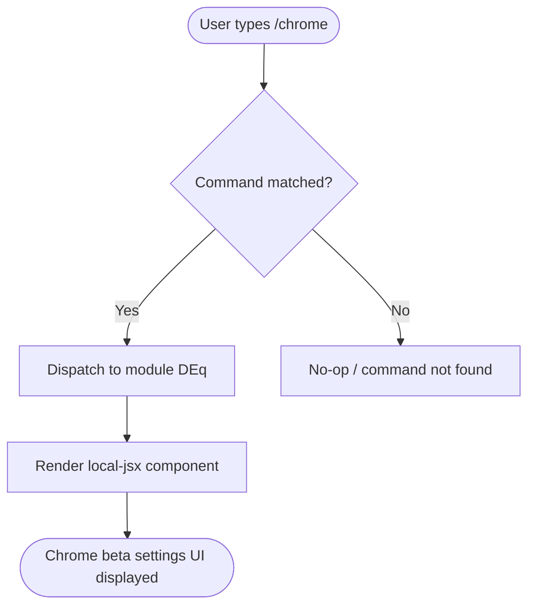

# `/chrome`

> Analysis basis: CC v2.1.144 bundle.js (AST extraction + Claude interpretation)
> Minimum version: v2.1.144

---

## Overview

The `/chrome` slash command provides access to settings for the **Claude in Chrome** browser integration (currently in beta). It is registered as a `local-jsx` command, meaning its output is rendered as a JSX component directly within the Claude Code CLI interface rather than producing plain text output.

---

## Registration

| Field | Value |
|---|---|
| type | `local-jsx` |
| name | `chrome` |
| description | `Claude in Chrome (beta) settings` |
| module_id | `DEq` |

Analysis basis: CC v2.1.144 bundle.js:+11644201

---

## Input Branching

The AST traversal at depth ≤ 2 returned an empty call graph for module `DEq`. No branching paths, argument parsing logic, or conditional dispatch were recoverable at this traversal depth.

<!-- TODO: not found in depth-2 traversal; needs --depth 4 -->

The following flowchart reflects only what can be confirmed from registration data:



Analysis basis: CC v2.1.144 bundle.js:+11644201

---

## Behavioral Spec

### Command Dispatch and JSX Rendering

Because the command type is `local-jsx`, the CLI framework renders the command's output as a React/JSX component inline in the terminal UI rather than streaming text. The general dispatch pattern for `local-jsx` commands follows the pseudocode below:

```
function dispatchLocalJsxCommand(commandName, args, appState):
    registration = lookupCommand(commandName)
    if registration.type != "local-jsx":
        return fallbackHandler(commandName, args)
    component = loadModule(registration.module_id)   // module "DEq"
    props = buildProps(args, appState)
    return renderJSX(component, props)
```

The specific internal behavior of module `DEq` (the Chrome beta settings UI) could not be recovered at traversal depth ≤ 2.

<!-- TODO: not found in depth-2 traversal; needs --depth 4 -->

Analysis basis: CC v2.1.144 bundle.js:+11644201

### Beta Status

The description string `"Claude in Chrome (beta) settings"` confirms the feature is explicitly marked as beta at this version. This label is part of the registered description field and is displayed to the user wherever command descriptions appear (e.g., `/help` output).

Analysis basis: CC v2.1.144 bundle.js:+11644201

---

## State & Side Effects

| Item | Detail |
|---|---|
| Telemetry | None detected at traversal depth ≤ 2 <!-- TODO: not found in depth-2 traversal; needs --depth 4 --> |
| Hook registration | <!-- TODO: not found in depth-2 traversal; needs --depth 4 --> |
| appState changes | <!-- TODO: not found in depth-2 traversal; needs --depth 4 --> |
| Sound | <!-- TODO: not found in depth-2 traversal; needs --depth 4 --> |
| Render mode | `local-jsx` — output is rendered as an inline JSX component, not as streamed text |

---

## Version History

| Version | Change |
|---|---|
| v2.1.144 | Initial analysis — command registered as `local-jsx`, module `DEq`, beta status confirmed |

---

## Common Mistakes

1. **Expecting text output**: Because `/chrome` is a `local-jsx` command, it renders a UI component rather than printing text. Piping or scripting its output will not yield plain-text settings data.
2. **Assuming stable behavior from this spec alone**: The internal logic of module `DEq` was not recoverable at AST traversal depth ≤ 2. Settings options, toggles, and persistence behavior require a deeper traversal (`--depth 4`) before they can be documented authoritatively.
3. **Treating beta features as stable**: The `(beta)` designation in the description indicates the Chrome integration may change significantly across minor versions. Do not rely on undocumented sub-behaviors persisting beyond v2.1.144.

---

## Appendix — Identifier Mapping

> For bundle debugging only. Identifiers change across versions.

| Identifier | Role |
|---|---|
| `DEq` | Module ID for the `/chrome` command's JSX component implementation |

> No additional obfuscated short-form identifiers were present in the extracted AST data for this command at traversal depth ≤ 2.