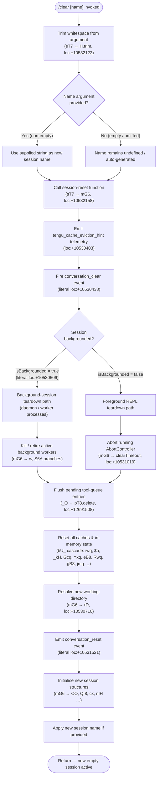

# `/clear`

> Analysis basis: CC v2.1.148 bundle.js (AST extraction + Claude interpretation)
> Minimum version: v2.1.148

---

## Overview

`/clear` starts a fresh conversation session with an empty context window, discarding the active in-memory conversation while leaving the previous session's transcript on disk so it can be resumed later with `/resume`. It accepts an optional `[name]` argument to label the new session and supports both interactive (REPL) and non-interactive modes. The command is also available under the aliases `/reset` and `/new`.

---

## Registration

| Field | Value |
|---|---|
| type | `local` |
| name | `clear` |
| description | `Start a new session with empty context; previous session stays on disk (resumable with /resume)` |
| argumentHint | `[name]` |
| aliases | `reset`, `new` |
| supportsNonInteractive | `true` |
| thinClientDispatch | `post-text` |
| module_id | `CO1` |
| load_inline | `true` |
| loc_byte | `10532296` |
| loc_byte_end | `10532587` |
| loc_line | `8336` |
| arbor_handler.name | `sT7` |
| arbor_handler.fqn | `claude-2.1.148::sT7` |
| arbor_handler.kind | `AsyncFunction` |
| arbor_handler.resolution_path | `module_id` |
| arbor_handler.n_hits | `0` |

Analysis basis: CC v2.1.148 bundle.js:+10532296

---

## Input Branching

The handler has 3+ distinct paths based on the optional name argument and background/foreground session state.



---

## Behavioral Spec

### 1. Entry Point — `sessionClearHandler` (bundle: `sT7`)

```
async function sessionClearHandler(args, context):
    rawName = args ?? ""
    trimmedName = rawName.trim()          // sT7 → H.trim, loc:+10532122

    if trimmedName === "":
        sessionName = undefined
    else:
        sessionName = trimmedName

    await performSessionReset(sessionName, context)  // sT7 → mG6, loc:+10532158
```

Analysis basis: CC v2.1.148 bundle.js:+10532122

---

### 2. Session Reset Orchestrator — `performSessionReset` (bundle: `mG6`)

```
async function performSessionReset(sessionName, context):
    // (a) Obtain working-directory limit for new session
    tokenBudget = computeContextBudget()      // mG6 → UG6, loc:+10530299
    // UG6 uses parseInt (loc:+12733700), Number.isFinite (loc:+12733722),
    // clamps with Math.max/Math.min (loc:+12733918/12733931),
    // base unit = 1000 (literal loc:+12733887), radix 10 (literal loc:+12733711)

    // (b) Collect current hook registrations to re-attach after reset
    hookSnapshot = buildHookSnapshot()        // mG6 → rkH, loc:+10530311
    // rkH builds SessionEnd event (literal loc:+12724425) and
    // fires the full hook-execution pipeline (e2 subtree)

    // (c) Signal abort to all in-flight requests
    abortSignal = AbortSignal.timeout(…)      // mG6 → AbortSignal.timeout, loc:+10530359

    // (d) Emit telemetry
    emit("tengu_cache_eviction_hint")         // loc:+10530403

    // (e) Broadcast conversation_clear to UI layer
    broadcast("conversation_clear")           // literal loc:+10530438

    // (f) Check session background state
    if context.isBackgrounded:               // literal loc:+10530506
        await teardownBackgroundWorkers()    // mG6 → w, loc:+10530598
    else:
        cancelForegroundAbortController()    // mG6 → clearTimeout, loc:+10531019

    // (g) Iterate over active tool-queue entries and flush
    for entry in Object.values(activeEntries):   // mG6 → Object.values, loc:+10530569
        flushPendingToolQueue(entry)             // mG6 → _O, loc:+10531120

    // (h) Clear all in-memory caches
    await clearAllCaches()                   // mG6 → bU_, loc:+10530701

    // (i) Resolve new CWD (absolute path validation)
    newCwd = resolveWorkingDirectory()       // mG6 → rD, loc:+10530710
    // rD validates absolute path (l38.isAbsolute, loc:+7885309),
    // resolves it (l38.resolve, loc:+7885329), throws Error if invalid

    // (j) Clear remaining transient state collections
    transientStore.clear()                   // mG6 → _.clear, loc:+10530719

    // (k) Emit conversation_reset
    broadcast("conversation_reset")          // literal loc:+10531521

    // (l) Initialise new session subsystems
    newSessionId = crypto.randomUUID()       // mG6 → hO1.randomUUID, loc:+10531560
    initSessionEvents()                      // mG6 → QI8, loc:+10531578
    // QI8: randomUUID (loc:+39947), FI6.emit (loc:+40041)

    registerConversationReset()              // mG6 → CO, loc:+10531463
    // CO → h6, v4; v4 → r9 → D9A.register (loc:+57468)

    setupLogging()                           // mG6 → cx, loc:+10531704
    // cx writes to log directory via I7H (appendFileSync, mkdirSync)

    setupTaskTracking()                      // mG6 → nIH, loc:+10531811
    setupSubagentPaths()                     // mG6 → fE, loc:+10531820
    setupWorktreeState()                     // mG6 → k8H, loc:+10531875
    loadPluginHooks()                        // mG6 → $U, loc:+10531902

    if sessionName is defined:
        applySessionName(sessionName)

    return  // new empty session is now active
```

Analysis basis: CC v2.1.148 bundle.js:+10530299

---

### 3. Cache Wipe Cascade — `clearAllCaches` (bundle: `bU_`)

This function performs a broad, coordinated wipe of all subsystem caches to ensure the new session starts from a clean state.

```
async function clearAllCaches():
    // MCP / skill index
    clearSkillIndexCache()          // bU_ → qo → gHH → H.clearSkillIndexCache, loc:+12597425
    refreshMcpConnections()         // bU_ → qo → Vw8, gA1, tw8

    // In-memory context store
    contextStore.clear()            // bU_ → iwq → Up.clear, loc:+6429732
    persistContextToStorage()       // bU_ → iwq → gVH (writes via s18.writeFile)

    // Post-compact / subagent state
    clearPostCompactState()         // bU_ → $o (ZZH, Vj8, kz6, K8H, kj8, mJq, Txq, $wH)
    resetAutonomousLoopDelivered()  // bU_ → $o → SY7.resetAutonomousLoopDelivered, loc:+9758834
    resetOutputTokenCounter()       // bU_ → $o → Pw (Object.values, _RH)

    // Tool-call permission cache
    permissionCache.clear()         // bU_ → _kH → Pw8.clear, loc:+9470311

    // compact / session_start caches
    compactCaches.clear()           // bU_ → kz6 → HE, loc:+4861515

    // Notification / grep caches
    notificationCache.clear()       // bU_ → Gcq → eNH.clear, loc:+8523234
    grepCache.clear()               // bU_ → Gcq → ek_.clear, loc:+8523246

    // UI state caches
    uiPiHCache.clear()              // bU_ → Yxq → PiH.clear, loc:+7827330
    uiYP6Cache.clear()              // bU_ → Yxq → YP6.clear, loc:+7827342

    // Token-budget helper cache
    tokenBudgetCache.clear()        // bU_ → eB8 → tbH.clear, loc:+1057460

    // OAuth / request cache
    requestCache.clear()            // bU_ → Rwq → o18.clear, loc:+6418236

    // "Has" flag cache
    hasCache.clear()                // bU_ → hy8 (H.has, loc:+52832)

    // Sandboxed-bash cache
    sandboxCache.clear()            // bU_ → gB8 → sbH.clear, loc:+1050238

    // Hook-result cache
    await clearHookResultCache()    // bU_ → jmq (hr.clear, JwH.clear, loc:+7899169/7899180)

    // Misc promise / async caches (vk_, q, BD8, ZX, FdH, ml9, uq1, b86)
    await Promise.resolve()         // bU_ → Promise.resolve, loc:+10529627
```

Analysis basis: CC v2.1.148 bundle.js:+10529342

---

### 4. Background Worker Teardown — `teardownBackgroundWorkers` (bundle: `w`)

```
function teardownBackgroundWorkers(context):
    for worker in activeWorkers.values():    // w → A.get, loc:+15117467
        worker.kill("SIGKILL")               // w → C.kill, literal "SIGKILL" loc:+15117633
        setTimeout(escalate, 100)            // w → setTimeout, literal 100 loc:+15117657

    checkMemory()                            // w → R6A.freemem, loc:+15117994
    emitLowMemTelemetry()                    // w → sG8 (tengu_bg_low_mem_mb)

    retireSettledWorkers()                   // w → g.retireIfSettled, loc:+15118296
    spawnSpareIfNeeded()                     // w → V6, loc:+15118856
    claimSpareSession()                      // w → v6A, loc:+15118913
    recordDate()                             // w → Date.now, loc:+15119011
```

Analysis basis: CC v2.1.148 bundle.js:+15117467

---

### 5. SessionEnd Hook Execution — `fireSessionEndHooks` (bundle: `rkH`)

Before tearing down the existing session, the orchestrator fires any registered `SessionEnd` hooks.

```
async function fireSessionEndHooks(context):
    // Build hook event payload typed "SessionEnd"
    payload = buildHookPayload("SessionEnd")   // rkH → hL, loc:+12724398
    // hL resolves effort level (literal "effort", loc:+12735388)
    // and supports extended hook types:
    //   Z2 handles model-name routing for claude-3-*, claude-opus-4-*, etc.
    //   (literals loc:+4070619 … 4070814)
    //   EZ applies "high" effort (literal loc:+4073172)

    // Execute hook pipeline
    await runHookPipeline(payload, context)    // rkH → e2, loc:+12724456
    // e2 is the full hook-execution engine:
    //   - Normalises hook type via N (loc:+12772215)
    //   - Resolves MCP tool hooks via ar_ (loc:+12773817)
    //   - Executes spawn hooks via HE8 (loc:+12776201)
    //   - Executes HTTP hooks via or_ (loc:+12775115)
    //   - Executes BB1 bash hooks (loc:+12775504)
    //   - Merges results and emits tengu_run_hook telemetry

    // Log debug output for background sessions
    debugLog(payload)                          // rkH → iNH, loc:+12724658
    // iNH checks background-session context (literal "background session", loc:+15153554)
```

Analysis basis: CC v2.1.148 bundle.js:+12724398

---

### 6. Working-Directory Resolution — `resolveWorkingDirectory` (bundle: `rD`)

```
function resolveWorkingDirectory(rawPath):
    if not path.isAbsolute(rawPath):         // rD → l38.isAbsolute, loc:+7885309
        rawPath = path.resolve(rawPath)      // rD → l38.resolve, loc:+7885329

    validated = validatePathAccess(rawPath)  // rD → F6, loc:+7885344

    if not accessible(validated):
        throw new Error("path not accessible") // rD → Error, loc:+7885411

    // Normalise using NFC Unicode form (literal "NFC", loc:+970773)
    return normalisePath(validated)          // rD → QU8, loc:+7885455
    // QU8: ab6.getStore, H.normalize (NFC), e_H (also H.normalize)

    emit("tengu_shell_set_cwd")              // loc:+7885468
```

Analysis basis: CC v2.1.148 bundle.js:+7885309

---

## State & Side Effects

| Item | Detail |
|---|---|
| Telemetry — `tengu_cache_eviction_hint` | Fired immediately at reset start (loc:+10530403) |
| Telemetry — `tengu_run_hook` | Fired for each executed SessionEnd hook (loc:+12772535) |
| Telemetry — `tengu_feature_ok` / `tengu_feature_bad` | Fired on hook pipeline success/failure (loc:+960829, +960887) |
| Telemetry — `tengu_hook_plugin_metrics` | Emitted after plugin-hook execution (loc:+12751206) |
| Telemetry — `tengu_shell_set_cwd` | Emitted after new CWD is resolved (loc:+7885468) |
| Telemetry — `tengu_session_renamed` | Emitted if a session name is applied (loc:+12636956) |
| Telemetry — `tengu_repl_hook_finished` | Emitted at end of hook pipeline in REPL context (loc:+12756614) |
| Telemetry — `tengu_hook_plugin_injected` | Emitted when plugin hook is injected (loc:+12770881) |
| Telemetry — `tengu_bg_dispatch_sigkill_escalate` | Emitted if SIGKILL escalation triggers during worker teardown (loc:+15117585) |
| Telemetry — `tengu_bg_low_mem_mb` | Emitted during background worker memory check (loc:+12461545) |
| Telemetry — `tengu_bg_dispatch_low_mem` | Emitted if low-memory condition is detected (loc:+15118164) |
| Telemetry — `tengu_bg_spare_enable` | Emitted when spare-session provisioning is enabled (loc:+15118859) |
| Telemetry — `tengu_bg_spare_claim` | Emitted when a spare session is claimed (loc:+15118980) |
| Telemetry — `tengu_bg_spare_spawn` | Emitted when a new spare session is spawned (loc:+15117278) |
| Telemetry — `tengu_bg_spare_claim_fail` | Emitted when spare session claim fails (loc:+15119243) |
| Telemetry — `tengu_bg_sendclaim_failed` | Emitted when daemon send-claim times out (loc:+15098686) |
| Telemetry — `tengu_daemon_control` | Emitted during daemon lifecycle events (loc:+15153677) |
| Telemetry — `tengu_daemon_config_reload` | Emitted when daemon config is reloaded (loc:+15132353) |
| Broadcast event — `conversation_clear` | Sent to UI/subscriber layer at reset start (literal loc:+10530438) |
| Broadcast event — `conversation_reset` | Sent after caches are wiped and new session is initialised (literal loc:+10531521) |
| Hook registration | `SessionEnd` hooks are fired before the context is cleared (rkH, loc:+12724398) |
| Hook event types observed | `PreToolUse`, `PostToolUse`, `PostToolUseFailure`, `PermissionRequest`, `PermissionDenied`, `UserPromptExpansion`, `SessionStart`, `SessionEnd`, `Setup`, `PreCompact`, `PostCompact`, `Notification`, `StopFailure`, `SubagentStart`, `SubagentStop`, `ConfigChange`, `InstructionsLoaded`, `FileChanged` (literals in e2/Ho_ subtree) |
| Cache wipe | All subsystem caches (skill index, context store, permission cache, compact/post-compact, notification, grep, UI, token-budget, request, sandbox, hook-result) are cleared via `bU_` cascade |
| AbortController | Any active AbortController is cancelled (literal `"abortController"` loc:+10531055, `clearTimeout` loc:+10531019) |
| Previous session on disk | **Preserved** — only in-memory state is cleared; previous transcript is resumable via `/resume` |
| New session ID | Generated via `crypto.randomUUID()` (mG6 → hO1.randomUUID, loc:+10531560) |
| Plugin hooks reload | Plugin hooks are re-loaded for the new session via `$U` (loc:+10531902) |
| MCP connections | MCP connections are refreshed as part of the cache-clear sequence (`qo` → `gHH.clearSkillIndexCache`) |
| Worker SIGKILL timeout | 100 ms escalation timeout for background workers (literal loc:+15117657) |
| Daemon send-claim timeout | 5000 ms (literal loc:+15099107) |

---

## Version History

| Version | Change |
|---|---|
| v2.1.148 | Initial analysis |

---

## Common Mistakes

1. **Expecting the previous session to be gone after `/clear`.** The command only resets the in-memory context; the previous session transcript is written to disk and remains fully accessible via `/resume`. Data is not destroyed.

2. **Confusing `/clear`, `/reset`, and `/new`.** All three names invoke the same handler (`sT7`). They are exact aliases — there is no functional difference between them.

3. **Assuming `/clear [name]` renames the *old* session.** The `[name]` argument labels the *new* session being created, not the one being closed.

4. **Expecting instant hook teardown.** `SessionEnd` hooks fire synchronously before the cache wipe begins. Long-running external hooks (spawn, HTTP, MCP) will delay the actual context reset.

5. **Running `/clear` non-interactively and expecting a full REPL teardown.** With `supportsNonInteractive: true` and `thinClientDispatch: post-text`, the thin-client path skips the REPL-exclusive hook features (e.g., "Prompt stop hooks are not yet supported outside REPL", literal loc:+12773680).

6. **Expecting background daemon workers to be immediately dead.** Worker teardown in backgrounded sessions sends SIGKILL but schedules escalation via a 100 ms `setTimeout` (literal loc:+15117657), so there is a brief window where workers are still running.

---

## Appendix — Identifier Mapping

> For bundle debugging only. Identifiers change across versions.

| Identifier | Role |
|---|---|
| `sT7` | Main async handler for `/clear` (entry point, `arbor_handler`) |
| `mG6` | Session-reset orchestrator — coordinates the full clear sequence |
| `UG6` | Context/token budget computation |
| `BY` | Policy-settings retrieval |
| `m8` | Policy settings accessor |
| `hu` | Utility (calls `oV`) |
| `oV` | Low-level observable/store primitive |
| `dm` | Dispatch helper (calls `PL_`) |
| `PL_` | Dispatch sub-helper (calls `Hh9`) |
| `rkH` | SessionEnd hook preparation and fire |
| `hL` | Hook-list builder (effort/model resolution) |
| `h6` | Reactive state accessor |
| `Ah` | Reactive state accessor variant |
| `Z2` | Model-name routing for hook effort level |
| `EZ` | High-effort hook configuration |
| `JV` | Hook metadata assembler |
| `b6` | Hook base builder (calls `sb6`, `w_`) |
| `e2` | Hook execution engine (full pipeline) |
| `UH` | String coercion utility |
| `Qm` | State snapshot getter |
| `N` | Message/content normaliser |
| `k7H` | Tool-state helper (calls `h_`, `S7`) |
| `Ho_` | Hook-filter / plugin-root resolver |
| `O` | Array-like iteration container |
| `FB1` | Filter helper |
| `er_` | Error-filter helper |
| `QB1` | Queue-batch helper |
| `c` | App-state / context accessor |
| `CH` | JSON serialiser wrapper |
| `RH` | Error logger / telemetry emitter |
| `mH` | State mutator |
| `C2H` | State update helper |
| `iZ` | Abort / timeout manager |
| `J` | Callback registry |
| `Y_H` | Yield/deferred helper |
| `SV` | Session-variable store |
| `oT8` | Hook output parser |
| `ar_` | MCP tool hook executor |
| `eT8` | Plain-text hook output parser |
| `O8H` | Object-entry transformer |
| `or_` | HTTP hook executor |
| `BB1` | Bash hook executor |
| `O7H` | Output collection helper |
| `HE8` | Spawn-process hook executor |
| `WNH` | Watch-path registration |
| `bH` | State store reader |
| `iNH` | Background-session debug logger |
| `Y86` | Telemetry tag helper |
| `L` | Worker set/lifecycle manager |
| `q` | File-cleanup set |
| `M` | Worker/session instance |
| `A` | Process/identifier container |
| `w` | Background worker teardown manager |
| `C` | Worker control (SIGKILL, supervisor) |
| `SfK` | Real-path / stat utility |
| `Az` | Async-helper |
| `Nj5` | Log-writer helper |
| `z` | Stdio stream abstraction |
| `sG8` | Memory-check + telemetry helper |
| `V6` | Spare-session state tracker |
| `T$6` | Pins-file reader |
| `M$_` | Path builder (joins, wG) |
| `B6` | JSON parser wrapper |
| `J8` | Error-code checker (ENOENT) |
| `v9L` | Directory-recursive reader |
| `g` | Worker pool manager (`retireIfSettled`) |
| `oH` | MCP-prefix filter helper |
| `vH` | Orphaned-permission tracker |
| `v6A` | Spare-session claimer / IPC connector |
| `So_` | Session metadata writer (mkdir + writeFile) |
| `tw5` | Claim-frame sender with timeout |
| `sw5` | Claim-frame builder |
| `q8` | Error-code accessor |
| `ZH` | String coercion (wraps `String`) |
| `bU` | IPC binary-frame encoder (Buffer ops) |
| `S6A` | Full spare-session lifecycle manager |
| `K` | Roster-entry formatter |
| `RK` | Config-path builder |
| `dq` | Session-file stat/read/cache manager |
| `bw` | Active-session state helper (calls `TZ`) |
| `h5` | Path-hash helper (calls `CH`, `Cw`) |
| `gsH` | Background-session telemetry timer |
| `QLH` | Session-path joiner |
| `Ny` | Session-name splitter |
| `UU` | Session-record updater |
| `zT6` | Session-directory path builder |
| `Y` | Session config reload + watcher manager |
| `D` | Worker-dispatch scheduler |
| `$` | ZC1 disposable wrapper |
| `V6A` | Spare-session spawner (Bun.spawn) |
| `S` | Disposable handle |
| `wP` | Pending-event drainer |
| `Qw` | Queue-writer helper |
| `bU_` | Cache-wipe cascade coordinator |
| `yU_` | Initial cache-clear sub-helper |
| `qo` | MCP/skill-index refresh dispatcher |
| `gHH` | Skill-index cache clearer |
| `Vw8` | MCP refresh variant A |
| `gA1` | MCP refresh variant B |
| `tw8` | MCP refresh variant C |
| `iwq` | In-memory context store clearer |
| `gVH` | Context-store persistence writer |
| `b86` | Misc cache clear sub-helper |
| `$o` | Post-compact / subagent state resetter |
| `ZZH` | Main-session state resetter |
| `Vj8` | Subagent exit state clearer |
| `kz6` | Session-start cache clearer (calls `HE`) |
| `K8H` | Compact-state clearer (calls `by8`, `Qy8`) |
| `kj8` | R51 cache clearer |
| `mJq` | nD6 / t2_ dual cache clearer |
| `Txq` | Token-counter resetter |
| `$wH` | UI-state resetter |
| `Pw` | Output-token counter resetter |
| `eb_` | End-of-reset notifier |
| `_kH` | Permission-cache clearer (Pw8.clear) |
| `Gcq` | Notification + grep cache clearer |
| `Yxq` | UI PiH + YP6 cache clearer |
| `eB8` | Token-budget cache clearer (tbH.clear) |
| `ml9` | Misc lazy-cache clearer |
| `Rwq` | Request-cache clearer (o18.clear) |
| `hy8` | "Has" flag cache clearer |
| `gB8` | Sandbox-bash cache clearer (sbH.clear) |
| `uq1` | Misc cache clearer |
| `jmq` | Hook-result cache clearer (hr.clear, JwH.clear) |
| `rD` | Working-directory resolver |
| `F6` | Path-access validator |
| `QU8` | NFC path normaliser |
| `e_H` | Path normalise sub-helper |
| `w_` | Observable store writer |
| `hEH` | Transient state entry helper |
| `EN` | Event notifier |
| `_O` | Tool-queue flusher |
| `BT8` | Pending-operation tracker |
| `fcH` | CLI feature-flag checker |
| `V5q` | CLI flag accessor |
| `RO1` | Session-event registration helper |
| `S5H` | Session-state helper |
| `CO` | Conversation-reset emitter |
| `v4` | Event-bus publisher |
| `r9` | Event-bus register |
| `zR` | Reactive ref |
| `XM` | Subagent path manager |
| `sy` | Subagent store accessor |
| `pG6` | Subagent-reset publisher |
| `QI8` | Session-ID emitter (randomUUID + FI6.emit) |
| `od` | Worktree-state publisher |
| `cx` | Conversation log writer |
| `I7H` | Sync file-append logger |
| `nIH` | Task-directory initialiser |
| `Qr_` | Task-dir mkdir helper |
| `yiH` | Task-path builder |
| `A3` | Task symlink creator |
| `IrH` | Task file-handle opener |
| `fE` | Subagent-path resolver |
| `nM` | Notification-manager resetter |
| `Nf` | Feature-flag helper |
| `mx` | Worktree-state emitter |
| `k8H` | Isolation-latch writer |
| `EU1` | Async file-append logger |
| `$U` | Plugin-hooks loader |
| `cK` | Plugin UH accessor |
| `zTH` | Plugin policy-settings checker |
| `abH` | Plugin clone / install helper |
| `C8` | Plugin filesystem log writer |
| `CX6` | New-session pipeline launcher (calls `hL`, `l2`) |
| `l2` | Full new-session REPL orchestrator |
| `f` | MCP client set |
| `EkH` | MCP server connection handler |
| `k7K` | MCP update applier |
| `_D5` | MCP client diff/update orchestrator |
| `W9` | UUID generator wrapper (wA1.randomUUID) |