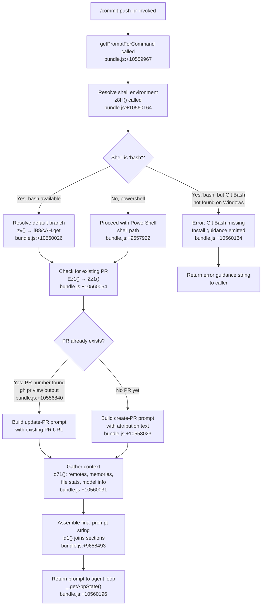

# `/commit-push-pr`

> Analysis basis: CC v2.1.148 bundle.js (AST extraction + Claude interpretation)
> Minimum version: v2.1.148

---

## Overview

`/commit-push-pr` is a prompt-type slash command that instructs the Claude Code agent to stage all changes, commit them, push to the remote, and open a pull request — all in a single invocation. The command builds its agent prompt dynamically at runtime via `getPromptForCommand`, incorporating context such as the current default branch, existing PR state, and shell environment before handing off to the agent loop.

---

## Registration

| Field | Value |
|---|---|
| type | `prompt` |
| name | `commit-push-pr` |
| description | Commit, push, and open a PR |
| loc_byte | `10559763` |
| loc_byte_end | `10560375` |
| loc_line | `8459` |
| handler_method | `getPromptForCommand` |
| handler_method_start | `10559967` |
| handler_method_end | `10560374` |
| prompt_body.length | `203` |
| prompt_body.trace | `call→z8H(...) (1 literals)` |
| arbor_handler.name | `getPromptForCommand` |
| arbor_handler.fqn | `claude-2.1.148::getPromptForCommand` |
| arbor_handler.kind | `Method` |
| arbor_handler.resolution_path | `direct` |
| arbor_handler.n_hits | `3` |

Analysis basis: CC v2.1.148 bundle.js:+10559763

---

## Input Branching

The handler follows four or more distinct paths depending on shell availability, existing PR state, and platform. A Mermaid flowchart is used.



---

## Behavioral Spec

### 1. Handler Entry — `getPromptForCommand`

The command's handler is an ObjectMethod directly on the registration object, resolved by Arbor as `getPromptForCommand` (resolution path: `direct`, n_hits: 3).

```
method getPromptForCommand(context):
    shellEnv  = resolveShellEnvironment(context)        // z8H()
    existing  = detectExistingPR(context)               // Ez1()
    repoCtx   = gatherRepositoryContext(context)        // o71(), zv()
    prompt    = buildPromptString(shellEnv, existing,
                                  repoCtx, context)
    return prompt
```

Analysis basis: CC v2.1.148 bundle.js:+10559967

---

### 2. Shell Environment Resolution — `resolveShellEnvironment` (`z8H`)

`z8H` determines which shell will execute Git commands. It checks the configured shell identifier and, on Windows, verifies that Git Bash is installed.

```
function resolveShellEnvironment(context):
    shellId = context.shell ?? "bash"                   // default

    if shellId == "bash":
        if platform == "win32":
            gitBashPath = locateGitBash()               // O4() → o6()
            if gitBashPath is null:
                return ErrorGuidance(
                    "requires bash … Git Bash was not found. " +
                    "Install Git for Windows … or change … to powershell"
                )
        return BashShellConfig(gitBashPath or systemBash)

    if shellId == "powershell":
        return PowerShellConfig()                       // Xp()

    raise Error("unsupported shell: " + shellId)
```

Key constants observed:
- Shell identifier `"bash"` — bundle.js:+9657676
- Shell identifier `"powershell"` — bundle.js:+9657922
- PR existence check command (bash): `"gh pr view --json number 2>/dev/null || true"` — bundle.js:+10556840
- PR existence check command (PowerShell): `"gh pr view --json number 2>$null; if (-not $?) { \"\" }"` — bundle.js:+10556887

Analysis basis: CC v2.1.148 bundle.js:+10560164

---

### 3. Default Branch Detection — `resolveDefaultBranch` (`zv`)

`zv` attempts to determine the repository's default branch so the PR can target it correctly.

```
function resolveDefaultBranch(repoRoot):
    // Attempt 1: read cached value
    cached = cacheStore.get("defaultBranch")            // lB8 → cAH.get, literal "defaultBranch" bundle.js:+1055735
    if cached is not null:
        return cached

    // Attempt 2: ask git for origin/HEAD symbolic ref
    result = runGit(["symbolic-ref", "--short",         // bundle.js:+1066497, +1066512
                     "refs/remotes/origin/HEAD"])        // bundle.js:+1066522
    if result.success:
        branch = result.stdout.trim()
        cacheStore.set("defaultBranch", branch)
        return branch

    // Attempt 3: probe known default branch names
    for candidate in ["main", "master"]:                // bundle.js:+1066635, +1066642
        exists = runGit(["show-ref", "--verify",        // bundle.js:+1066704, +1066715
                         "--quiet",                     // bundle.js:+1066726
                         "refs/remotes/origin/" + candidate])
        if exists:
            return candidate

    return "main"   // last-resort fallback
```

Analysis basis: CC v2.1.148 bundle.js:+10560026

---

### 4. Existing PR Detection — `detectExistingPR` (`Ez1`)

`Ez1` runs a `gh` CLI command to check whether a PR already exists for the current branch. The two shell variants are selected based on the resolved shell environment.

```
function detectExistingPR(shellEnv):
    cmd = shellEnv.isBash
        ? "gh pr view --json number 2>/dev/null || true"     // bundle.js:+10556840
        : "gh pr view --json number 2>$null; if (-not $?) { \"\" }"  // bundle.js:+10556887

    raw = runShellCommand(cmd)                          // Zz1() → H.replace
    prData = tryParseJSON(raw)

    if prData and prData.number is defined:
        return ExistingPR(number: prData.number)
    return NoPR
```

Analysis basis: CC v2.1.148 bundle.js:+10560054

---

### 5. Repository Context Gathering — `gatherRepositoryContext` (`o71`)

`o71` assembles the contextual data injected into the prompt. This includes remote origin information, staged diff statistics, memory/notes content, and model attribution.

```
function gatherRepositoryContext(appState):
    remotes     = getRemoteList()                   // literal "remote" bundle.js:+10102523
    diffStats   = computeDiffStats()                // WX_() via dP7()
    memories    = readMemoryFiles()                 // literal "memory"/"memories" bundle.js:+10103371,+10103380
    modelInfo   = resolveModelAttribution()         // jq(), Bq()
    prAttrib    = getPRAttributionDefault()         // literal "PR Attribution: returning default (no data)" bundle.js:+10103296

    return RepositoryContext(
        remotes:   remotes,
        diffStats: diffStats,
        memories:  memories,
        modelInfo: modelInfo,
        prAttrib:  prAttrib
    )
```

Diff stat computation (`WX_`) inspects staged files:
- Runs `git diff --cached --name-status` with a 5 000-item limit — bundle.js:+5321762, +5321801
- Marks deleted files with prefix `"D\t"` — bundle.js:+5321866
- Runs `git diff --stat` for human-readable summary — bundle.js:+5321341
- Recognises singular/plural form: `"file changed"` / `"files changed"` — bundle.js:+5321489, +5321517
- Caps individual file context at 100 items — bundle.js:+5320421

Analysis basis: CC v2.1.148 bundle.js:+10560031

---

### 6. Prompt Assembly — `buildPromptString` (`z8H` continuation + `Iq1`)

After all context is gathered, the prompt string is assembled from multiple sections joined by `Iq1`.

```
function buildPromptString(shellEnv, existingPR, repoCtx, appState):
    sections = []

    // Core instruction block (~203 chars, sourced from getPromptForCommand body)
    // References git workflow: stage, commit, push, open/update PR
    sections.push(coreInstructionText)              // bundle.js:+10559967–10560374

    if existingPR != NoPR:
        sections.push(updatePRInstruction(existingPR.number))
    else:
        sections.push(createPRInstruction())
        // Includes attribution text ending:
        // "…ending with the attribution text shown in the example below"
        // bundle.js:+10558023

    sections.push(formatDiffContext(repoCtx.diffStats))
    sections.push(formatMemoryContext(repoCtx.memories))

    // Join non-empty sections; trim whitespace
    return sections
        .filter(s => s.trim() != "")                // Iq1: bundle.js:+9658629
        .join("\n\n")                                // Iq1: bundle.js:+9658747
```

The prompt body length is 203 characters. The trace indicates the body is produced via a single call to `z8H` with one literal interpolated — bundle.js:+10560164.

Analysis basis: CC v2.1.148 bundle.js:+9658493

---

### 7. App State Access

At the very end of the handler, `_.getAppState()` is called to retrieve live session state (e.g. current working directory, model choice) for final injection into the prompt.

```
function finalisePrompt(prompt, _):
    state = _.getAppState()                         // bundle.js:+10560196
    return injectStateContext(prompt, state)
```

Analysis basis: CC v2.1.148 bundle.js:+10560196

---

### 8. Parallel Context Fetch (`Promise.all`)

The handler calls `Promise.all` at bundle.js:+10560013 to resolve multiple async data sources concurrently (default branch, existing PR check, repository context). This keeps latency low before prompt assembly begins.

```
function handler(context):
    [branchResult, prResult, repoResult] = await Promise.all([
        resolveDefaultBranch(context),              // zv() bundle.js:+10560026
        detectExistingPR(context),                  // o71() bundle.js:+10560031
        gatherShellEnv(context)                     // Ez1() bundle.js:+10560054
    ])
    prompt = buildPromptString(branchResult, prResult, repoResult)
    return prompt
```

Analysis basis: CC v2.1.148 bundle.js:+10560013

---

## State & Side Effects

| Item | Detail |
|---|---|
| Telemetry — `tengu_bg_spare_enable` | Background spare process lifecycle (bundle.js:+15116918) |
| Telemetry — `tengu_bg_low_mem_mb` | Low-memory threshold event during background ops (bundle.js:+12461545) |
| Telemetry — `tengu_bg_spare_spawn` | Spare background process spawned (bundle.js:+15117278) |
| Telemetry — `tengu_daemon_config_reload` | Daemon configuration reload event (bundle.js:+15132353) |
| Telemetry — `tengu_daemon_control` | Daemon start/stop control event (bundle.js:+15153677) |
| Telemetry — `tengu_cobalt_ridge` | Low-level API routing event (bundle.js:+4775999) |
| Telemetry — `tengu_auto_mode_fallback_to_ask` | Auto-mode permission fallback (bundle.js:+10184364) |
| Telemetry — `tengu_auto_mode_decision` | Auto-mode permission decision recorded (bundle.js:+10185072) |
| Telemetry — `tengu_bash_allowlist_strip_all` | Bash allowlist stripped entirely (bundle.js:+10186316) |
| Telemetry — `tengu_iron_gate_closed` | Auto-mode classifier blocked action (bundle.js:+10188820) |
| Telemetry — `tengu_auto_mode_denial_limit_exceeded` | Denial count exceeded threshold (bundle.js:+10178578) |
| Telemetry — `tengu_tool_empty_result` | Tool returned empty result (bundle.js:+4883900) |
| Telemetry — `tengu_tool_result_persisted` | Tool result written to transcript (bundle.js:+4884140) |
| Hook registration | `H.on("exit", …)` and `H.on("error", …)` registered during subprocess spawn — `OPA` (bundle.js:+1037967) |
| appState changes | `_sH` calls `H.setAppState(Object.assign(…))` to merge tool permission context (bundle.js:+10178144) |
| Default branch cache | Written to `cAH` store under key `"defaultBranch"` on first successful resolution (bundle.js:+1055735) |
| Shell subprocess | Spawned via `Bun.spawn` in `V6A` for Git and `gh` commands (bundle.js:+15097391) |
| Sound | <!-- TODO: not found in depth-2 traversal; needs --depth 4 --> |
| Self-reference literal | String `"/commit-push-pr"` present at bundle.js:+10560353 (likely used for command identity checks) |

---

## Version History

| Version | Change |
|---|---|
| v2.1.148 | Initial analysis |

---

## Common Mistakes

1. **No `gh` CLI installed** — The command relies on the GitHub CLI (`gh`) for both PR detection (`gh pr view`) and PR creation. If `gh` is absent or not authenticated, both `Ez1` and the agent's subsequent `gh pr create` call will fail silently or emit errors. Ensure `gh auth login` has been completed before invoking this command.

2. **Running on Windows without Git Bash** — When the shell is configured as `bash` (the default) and the platform is `win32`, `z8H` will abort prompt construction early with an installation guidance message rather than delegating to the agent. Install Git for Windows or explicitly set `shell: powershell` in the project's CLAUDE.md frontmatter.

3. **Calling on a detached HEAD** — `zv` uses `refs/remotes/origin/HEAD` to find the default branch. Repositories that have never had their remote HEAD configured (e.g. shallow clones, forks without upstream) may fall through to the `"main"` fallback, causing the PR to target the wrong base branch.

4. **Large staged diffs** — `WX_` caps file-level context at 100 items (bundle.js:+5320421) and name-status output at 5 000 entries (bundle.js:+5321801). Extremely large commits may produce truncated diff context in the prompt, potentially causing the agent to write an incomplete PR description.

5. **Conflating `/commit-push-pr` with `/pr-comments`** — `/commit-push-pr` creates or updates a PR; it does not read or respond to existing review comments. Use `/pr-comments` for that workflow.

6. **Expecting a specific commit message format without guidance** — The command does not accept a free-text argument for the commit message. All commit message content is determined by the agent based on the diff context supplied in the assembled prompt.

---

## Appendix — Identifier Mapping

> For bundle debugging only. Identifiers change across versions.

| Identifier | Role |
|---|---|
| `__handler_commit-push-pr` | Synthetic BFS entry point for the command handler (bookkeeping node, not a real bundle symbol) |
| `zv` | Default branch resolver; queries git symbolic-ref and show-ref |
| `lB8` | Default branch cache reader; wraps `cAH.get("defaultBranch")` |
| `T_` | Shell subprocess executor; orchestrates process lifecycle |
| `i2H` | Core subprocess manager; spawns and monitors child processes |
| `NPA` | Windows command-line builder; handles `.exe` / `cmd /q` paths |
| `hB8` | Subprocess stdout collector |
| `SB8` | Subprocess stderr collector |
| `CB8` | Subprocess combined output (stdout+stderr) handler |
| `bJA` | Numeric exit-code validator |
| `eq6` | Subprocess error classifier; distinguishes buffer errors from process errors |
| `yB8` | Reflect-based property definer for process handle |
| `OPA` | Process event registrar; attaches `exit` and `error` listeners |
| `CJA` | Subprocess timeout handler using `setTimeout` / `Promise.race` |
| `xJA` | Process kill handler; calls `H.kill` on signal |
| `SJA` | Process spawn helper (bound) |
| `RJA` | Process force-kill helper (bound) |
| `fPA` | Multi-stream output reader; uses `Promise.all` over stdout/stderr |
| `q16` | Output buffer finaliser |
| `LPA` | Pipe configurator for child process streams |
| `MPA` | Stream adder; calls `A.add` on the stream set |
| `UJA` | Writable binding helper |
| `D` | Background daemon orchestrator; manages spare process pool |
| `V6` | Tool-call router; dispatches to registered tool handlers |
| `$` | Session dispose handler; calls `ZC1` on cleanup |
| `sG8` | macOS memory monitor; checks free memory at 1 024 MB threshold |
| `V6A` | Daemon spare process spawner via `Bun.spawn` |
| `c` | Generic async utility / continuation helper |
| `Az` | Async result aggregator |
| `N` | Shell-type detector; maps platform to shell name (debug level) |
| `q8` | Queue / task scheduler utility |
| `RH` | Error reporter; calls `Gl.logError` and pushes to `bbH` |
| `JFK` | String coercer; wraps built-in `String()` with radix 10 |
| `_` | Lodash-style utility namespace (used throughout) |
| `o71` | Repository context aggregator; collects remotes, diff stats, memories, model info |
| `$RH` | App-state reader helper |
| `eO6` | Environment variable accessor |
| `FD` | API endpoint factory; selects staging / local / production URL |
| `l_` | Module-export bootstrapper |
| `oN6` | Module binding helper (bound) |
| `q` | HTTP/file I/O utility (context-dependent) |
| `jD_` | Local endpoint configurator; sets `http://localhost:4000` |
| `rfL` | URL resolver helper |
| `HA` | Settings loader; calls `Km` to read disk settings |
| `Km` | Settings-from-disk orchestrator; emits `loadSettingsFromDisk_start/end` |
| `gR` | Settings getter |
| `Wq` | Memory-usage tracker; uses `process.memoryUsage` |
| `Xg8` | Settings load executor; fires `settings_load_started/completed` telemetry |
| `WF` | Flag/policy settings aggregator |
| `xI6` | Settings index builder |
| `H` | Generic handle / object placeholder (context-dependent throughout) |
| `dP7` | Staged-file context builder; calls `WX_` |
| `A` | Array/collection utility namespace |
| `M` | Map/stream utility namespace |
| `WX_` | Diff stat computer; runs `git diff --cached --name-status` and `--stat` |
| `uYH` | Git command runner utility |
| `h6` | Path helper; calls `oV` |
| `Y` | Supervisor config manager; start/stop/updateConfig |
| `z` | Daemon-stop controller |
| `X5q` | File extension classifier; checks `IKH.basename` / `IKH.extname` |
| `t2L` | Staged-diff runner; calls `T_` (subprocess exec) with `git diff --cached` |
| `G5q` | Diff-stat parser; extracts insertion/deletion counts via `parseInt` |
| `L` | Promise-queue / task-set tracker |
| `nP7` | Conversation history trimmer; finds last compact boundary |
| `XM` | Path joiner; builds full file paths via `aYH.join` |
| `sy` | Path resolver wrapper |
| `w_` | Platform path utility |
| `$x6` | File binary reader; uses `Buffer.allocUnsafe` + `ru.open` |
| `IUK` | Buffer-from helper |
| `SUK` | Line scanner for UTF-8 streams |
| `RUK` | Multi-line scanner with offset tracking |
| `CUK` | Buffer copy helper |
| `bUK` | Buffer slice helper |
| `xUK` | Buffer finaliser |
| `_WH` | Stream decoder; handles UTF-8 BOM (bytes 239, 187, 191) |
| `HgK` | BOM detector |
| `_gK` | Byte-index searcher |
| `qgK` | JSON-line extractor |
| `AgK` | Buffer-to-string line parser |
| `K` | Key/index utility namespace |
| `QP7` | Conversation message filter |
| `gP7` | Individual message type classifier |
| `lP7` | Tool-use block detector |
| `Jm_` | Team-member file checker |
| `jq` | Model capability resolver; maps model ID to feature flags |
| `AQ6` | Model metadata fetcher |
| `Ij` | Model ID normaliser; lower-cases and strips vendor prefixes |
| `By8` | Inference-profile detector |
| `eP` | Model string replacer |
| `Bq` | PR attribution builder |
| `ps` | Attribution string assembler |
| `aV` | Attribution prefix builder |
| `_AH` | Attribution suffix builder |
| `FF` | Full attribution formatter; handles `anthropic.` prefix |
| `lq` | Model display-name resolver |
| `GW` | Model tier mapper |
| `C9H` | Model family classifier |
| `yv` | Sonnet model namer |
| `kmH` | Haiku model namer |
| `kv` | Opus model namer |
| `A99` | "Best" alias resolver → `kv` |
| `W3` | Provider-type resolver |
| `Sd6` | Extended-context suffix adder (e.g. `" (1M context)"`) |
| `ymH` | UH-based string coercer |
| `bJ` | PR body builder |
| `WW` | Full PR description composer |
| `Z5q` | Model-family inclusion checker |
| `Ez1` | Existing PR detector; runs `gh pr view` and parses JSON |
| `ykH` | PR URL resolver |
| `X3H` | Branch suffix checker (`.endsWith`) |
| `Et8` | Branch name normaliser |
| `Zz1` | Raw `gh` output sanitiser; calls `H.replace` |
| `O4` | Config/path resolver; calls `o6` and `QAH` |
| `z8H` | Shell environment resolver and main prompt constructor |
| `Xp` | Shell config builder; handles `UH`/`r1` coercion |
| `UH` | String coercer (wraps `String()`) |
| `r1` | String coercer variant |
| `nA8` | String replacer helper |
| `d2` | Agent-loop runner; drives `arH` |
| `arH` | Core agent execution loop; manages tool calls, permissions, state |
| `L27` | Bash tool permission checker |
| `S_` | App-state reader; calls `H.getAppState` |
| `t06` | Tool-result handler |
| `_sH` | App-state writer; calls `H.setAppState(Object.assign(…))` |
| `i51` | Tool-call dispatcher |
| `cd` | Recursive safety-check runner |
| `iJ8` | Self-recursive permission resolver |
| `d51` | Permission denial handler |
| `iq` | MCP tool prefix checker (`mcp__`) |
| `lJ8` | Late-stage permission gater |
| `Ru` | High-risk operation handler |
| `PW_` | Auto-mode allowlist processor |
| `Wxq` | Allow-set adder |
| `tD6` | Auto-mode classifier runner |
| `OwH` | Allow-set remover |
| `yd6` | Permission error formatter |
| `$86` | Input token counter |
| `Pw` | Output token counter |
| `O86` | Cache-read token counter |
| `z86` | Cache-creation token counter |
| `Xk` | Tool routing dispatcher (calls `V6`) |
| `o51` | Non-interactive permission check |
| `C51` | Headless abort handler |
| `K27` | Tool permission context setter |
| `r51` | Permission prompt renderer |
| `q27` | Hook-based permission rewriter |
| `n51` | Asyncagent context guard |
| `YP` | Stop-sequence detector |
| `RM1` | Message stop-reason classifier |
| `f` | Tool registry lookup |
| `QQH` | Tool result mapper; calls `H.mapToolResultToToolResultBlockParam` |
| `q6q` | Tool result content transformer |
| `SOL` | Tool result text trimmer |
| `M6q` | Array tool result detector |
| `f6q` | Array result reducer |
| `UzH` | Multi-content tool result handler |
| `FzH` | Fallback content handler |
| `BzH` | Single object tool result handler |
| `_6q` | Token-length capper for tool results (`Math.min`) |
| `Iq1` | Prompt section joiner; filters empty, joins with `\n\n` |
| `Iz7` | Prompt sub-section builder; calls `Iq1` and `ZH` |
| `ZH` | String coercer (wraps `String()`) |

---

Note: index built via Arbor fallback; some signals (telemetry, literals) may be missing — see arbor-fallback.js.