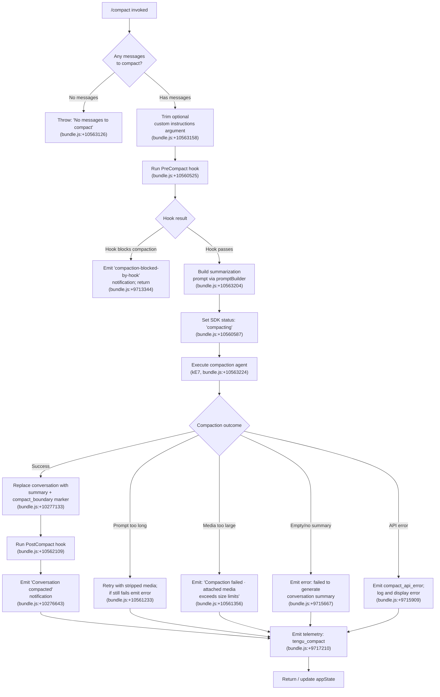

# `/compact`

> Analysis basis: CC v2.1.148 bundle.js (AST extraction + Claude interpretation)
> Minimum version: v2.1.148

---

## Overview

`/compact` frees up context window space by summarizing the current conversation history into a condensed form, replacing the full message history with a compact representation. It optionally accepts custom summarization instructions as an argument, and supports both manual invocation and automatic (reactive) triggering when context limits are approached.

---

## Registration

| Field | Value |
|---|---|
| type | `local` |
| name | `compact` |
| description | `Free up context by summarizing the conversation so far` |
| argumentHint | `<optional custom summarization instructions>` |
| supportsNonInteractive | `true` |
| thinClientDispatch | `post-text` |
| module_id | `kz1` |
| load_inline | `true` |
| loc_byte | `10564089` |
| loc_byte_end | `10564402` |
| loc_line | `8465` |
| arbor_handler.name | `IE7` |
| arbor_handler.fqn | `claude-2.1.148::IE7` |
| arbor_handler.kind | `AsyncFunction` |
| arbor_handler.resolution_path | `module_id` |
| arbor_handler.n_hits | `0` |

Analysis basis: CC v2.1.148 bundle.js:+10564089

---

## Input Branching

The `/compact` handler has more than 3 distinct paths (empty message list, custom instructions provided vs. absent, auto-compact path, manual path, hook-blocked path, media-too-large path, prompt-too-long path). A Mermaid flowchart is used.



---

## Behavioral Spec

### Handler Entry: `compactCommandHandler` (`IE7`)

The primary async handler resolves from module `kz1` via Arbor's `module_id` resolution path.

```
async function compactCommandHandler(context):
    messages = getConversationMessages(context)  // OO / _W7

    if messages is empty:
        throw Error("No messages to compact")    // bundle.js:+10563126

    customInstructions = trimArgument(context.args)  // H.trim, bundle.js:+10563158

    // Run pre-compact hook pipeline
    hookResult = runPreCompactHook(context)          // XLH, bundle.js:+10563204
    if hookResult.blocks:
        emitNotification("compaction-blocked-by-hook")
        return

    // Gather system prompt and app state
    systemPromptData = buildSystemPromptContext(context)  // Iz1, bundle.js:+10563261

    // Execute the compaction agent turn
    compactionResult = await runCompactionAgent(        // kE7, bundle.js:+10563224
        messages,
        customInstructions,
        systemPromptData
    )

    // Handle state reset and cleanup
    postCompactCleanup(compactionResult)               // $o, bundle.js:+10563416

    // Update display state
    updateDisplayState(compactionResult)               // DkH, bundle.js:+10563391
    registerKeyBinding(compactionResult)               // Nz1, bundle.js:+10563488

    return compactionResult
```

Analysis basis: CC v2.1.148 bundle.js:+10563095

---

### Compaction Agent Execution: `runCompactionAgent` (`kE7`)

This async sub-function orchestrates the actual summarization API call.

```
async function runCompactionAgent(messages, customInstructions, systemContext):
    startTime = performance.now()                  // bundle.js:+10560608

    // Collect context: tools, MCP state, app state
    [toolDefs, mcpState] = await Promise.all([
        buildToolContext(context),                 // ud, bundle.js:+10560670
        buildSystemPrompt(systemContext),          // Iz1, bundle.js:+10560745
    ])

    // Build summarization message list
    summarizationMessages = buildSummarizationMessages(messages)  // wj8, bundle.js:+10560756

    // Emit progress markers
    emitProgress("compact_progress")               // bundle.js:+10560471
    emitProgress("hooks_start")                    // bundle.js:+10560502
    emitProgress("pre_compact")                    // bundle.js:+10560525
    setSDKStatus("compacting")                     // bundle.js:+10560587

    // Launch the reactive compact loop
    result = await reactiveCompactLoop(            // qx_, bundle.js:+10561060
        summarizationMessages,
        customInstructions
    )

    if result.error == "prompt_too_long":
        emitError("Compaction failed · conversation could not be reduced below the context limit")
        // bundle.js:+10561233
    else if result.error == "media_too_large":
        emitError("Compaction failed · attached media exceeds size limits")
        // bundle.js:+10561356
    else if not result.success:
        emitError("unknown error")                 // bundle.js:+10561481

    // Emit final telemetry marker
    emit("compact_end")                            // bundle.js:+10562109
    emit("success" if result.ok else "failure")    // bundle.js:+10562310

    duration = performance.now() - startTime
    emitTelemetry("tengu_compact", { duration })   // bundle.js:+9717210

    return result
```

Analysis basis: CC v2.1.148 bundle.js:+10560608

---

### Reactive Compact Loop: `reactiveCompactLoop` (`qx_`)

This function drives the actual summarization turns, including retry logic for media-size errors.

```
async function reactiveCompactLoop(messages, customInstructions):
    startTime = performance.now()            // bundle.js:+9763116

    // Build summarization prompt (may use auto-detected token threshold)
    prompt = buildCompactionPrompt(          // lj, bundle.js:+9763086
        messages,
        customInstructions
    )

    attempt = 0
    while attempt < maxRetries:
        compactResult = await runSummarizationAgent(  // Gj8, bundle.js:+9763180
            prompt,
            mode = "reactive-compact"                // bundle.js:+9731971
        )

        if compactResult.error == "media_too_large":
            strippedPrompt = stripMediaFromPrompt(prompt)
            if cannotStrip(strippedPrompt):
                recordFailure("media_unstrippable")  // bundle.js:+9735428
                break
            prompt = strippedPrompt
            attempt++
            continue

        if compactResult.success:
            emitTelemetry("tengu_reactive_compact_succeeded")  // bundle.js:+9765606
            storeResult("compact_reactive")          // bundle.js:+9763755
            return compactResult

        recordFailure(compactResult.errorCode)
        emitTelemetry("tengu_reactive_compact_failed")  // bundle.js:+9763352
        break

    return { success: false, error: compactResult.errorCode }
```

Analysis basis: CC v2.1.148 bundle.js:+9763086

---

### Summarization Agent Turn: `summarizationAgentTurn` (`Gj8`)

Orchestrates a single LLM turn dedicated to summarizing the conversation.

```
async function summarizationAgentTurn(promptMessages, opts):
    // Require at least 2 message groups
    if groups(promptMessages).length < 2:
        log("Reactive compact: fewer than 2 groups, nothing to compact")  // bundle.js:+9733867
        recordOutcome("too_few_groups")            // bundle.js:+9733957
        return { skip: true }

    // Select which messages to summarize (up to batch of 3 groups per turn)
    // bundle.js:+9734104
    selectedMessages = selectSummarizationWindow(promptMessages, groupCount=3)

    // Call the LLM for summarization
    response = await callSummarizationLLM(         // YY7, bundle.js:+9734801
        selectedMessages,
        systemPrompt = "You are a helpful AI assistant tasked with summarizing conversations.",
        // bundle.js:+9727056
        toolUsePolicy = "deny"                     // bundle.js:+9724722
    )

    if not response.hasAssistantMessage:
        logError("no assistant message in summarization response")  // bundle.js:+9732584
        return { error: "no_summary" }

    if response.summaryText is empty:
        logError("Reactive compact: empty summary text in summarization response")  // bundle.js:+9733027
        return { error: "empty_summary" }

    return { success: true, summary: response.summaryText }
```

Analysis basis: CC v2.1.148 bundle.js:+9733792

---

### Post-Compact Cleanup: `postCompactCleanup` (`$o`)

Resets session state after a successful or failed compaction.

```
function postCompactCleanup(result):
    clearPrecomputedCompactCache()           // kj8 → R51.clear, bundle.js:+10160104
    clearTurnCaches()                        // mJq, bundle.js:+9758802
    clearTransientState()                    // Txq, bundle.js:+9758808
    clearWildcardState()                     // $wH, bundle.js:+9758814
    resetAutonomousLoopDelivered()           // SY7.resetAutonomousLoopDelivered, bundle.js:+9758834
    clearPendingOperations()                 // Pw, bundle.js:+9758884
    if result.success:
        storeCompactMetadata(result)         // "compactMetadata", bundle.js:+10561565
```

Analysis basis: CC v2.1.148 bundle.js:+9758712

---

### Compact Boundary Insertion: `insertCompactBoundary` (`OO`)

Inserts a sentinel marker into the message list to indicate the compact point.

```
function insertCompactBoundary(messages, summaryText):
    // Marker string: "compact_boundary"  (bundle.js:+10277133)
    // Role for boundary message: "system"  (bundle.js:+10277111)
    boundaryMessage = {
        role: "system",
        type: "compact_boundary",
        index: 1,          // bundle.js:+10277187
        content: summaryText
    }
    trimmedMessages = messages.slice(...)    // H.slice, bundle.js:+10277286
    return [boundaryMessage, ...trimmedMessages]
```

Analysis basis: CC v2.1.148 bundle.js:+10277133

---

### Auto-Compact Threshold Evaluation: `autoCompactThresholdCheck` (`hj8`)

Evaluates whether auto-compact should be triggered based on token usage.

```
function autoCompactThresholdCheck(appState):
    autoCompactEnabled = getConfig("autoCompactEnabled")  // bundle.js:+9769775

    if not autoCompactEnabled:
        return { shouldCompact: false }

    // Parse threshold value
    thresholdPct = parseThreshold(appState)     // Mx_, bundle.js:+9768029
    // "auto" means use default threshold       // bundle.js:+9767597
    // Numeric: parsed from string, divided by 1000 or 100
    // bundle.js:+9767702, bundle.js:+9767738

    currentUsagePct = computeTokenUsagePct(appState)  // QG, bundle.js:+9767915

    if currentUsagePct >= thresholdPct:
        return { shouldCompact: true, reason: "threshold_exceeded" }

    return { shouldCompact: false }
```

Analysis basis: CC v2.1.148 bundle.js:+9767915

---

### PreCompact Hook Dispatch: `dispatchPreCompactHook` (`XLH`)

Runs any registered `PreCompact` hooks before compaction begins.

```
async function dispatchPreCompactHook(context):
    hookConfig = loadHookConfig("PreCompact")    // kjH, bundle.js:+9759873
    // "PreCompact" literal: bundle.js:+12719972

    if hookConfig is empty:
        return { blocked: false }

    hookContext = buildHookContext(context)       // AG, bundle.js:+9759891
    result = await executeHook(hookContext)       // bP, bundle.js:+9759896

    // Check jq for message filtering    bundle.js:+9759923
    // Run hj8 for auto-compact re-evaluation  bundle.js:+9759932

    if result.decision == "block":
        return { blocked: true }

    return { blocked: false, additionalContext: result.additionalContext }
```

Analysis basis: CC v2.1.148 bundle.js:+9759873

---

## State & Side Effects

| Item | Detail |
|---|---|
| Telemetry: `tengu_compact` | Main compaction event, emitted at end of handler (bundle.js:+9717210) |
| Telemetry: `tengu_reactive_compact_attempt` | Emitted at start of each reactive compact attempt (bundle.js:+9734590) |
| Telemetry: `tengu_reactive_compact_succeeded` | Emitted on successful reactive compaction (bundle.js:+9765606) |
| Telemetry: `tengu_reactive_compact_failed` | Emitted on reactive compact failure (bundle.js:+9763352) |
| Telemetry: `tengu_compact_failed` | Emitted when summarization turn fails (bundle.js:+9728335) |
| Telemetry: `tengu_compact_ptl_retry` | Emitted on prompt-too-long retry (bundle.js:+9715299) |
| Telemetry: `tengu_compact_cache_prefix` | Emitted related to cache prefix sharing (bundle.js:+9714827) |
| Telemetry: `tengu_compact_cache_sharing_success` | Cache sharing succeeded (bundle.js:+9725614) |
| Telemetry: `tengu_compact_cache_sharing_fallback` | Cache sharing fell back (bundle.js:+9726244) |
| Telemetry: `tengu_precomputed_compact_discarded` | Pre-computed compact result discarded (bundle.js:+9742286) |
| Telemetry: `tengu_post_compact_file_restore_success` | Post-compact file reference restoration succeeded (bundle.js:+9728817) |
| Telemetry: `tengu_post_compact_file_restore_error` | Post-compact file reference restoration failed (bundle.js:+9728859) |
| Telemetry: `tengu_run_hook` | Hook execution lifecycle event (bundle.js:+12772535) |
| Telemetry: `tengu_repl_hook_finished` | REPL hook finished (bundle.js:+12756614) |
| Hook registration | `PreCompact` hook is dispatched before compaction; `PostCompact` hook is dispatched after. Literal hook type names: `"PreCompact"` (bundle.js:+12719972), `"PostCompact"` (bundle.js:+12752363) |
| appState changes | After compaction: `compactMetadata` key written to appState (bundle.js:+10561565); SDK status set to `"compacting"` then reset; `conversation_reset` event emitted (bundle.js:+10220629); autonomous loop delivery counter reset |
| Cache cleared | `R51.clear` (pre-compact cache), `nD6.clear` / `t2_.clear` (turn caches) on completion (bundle.js:+10160104, +6503864, +6503876) |
| Notification | User-facing `"Conversation compacted"` notification emitted on success (bundle.js:+10276643); failure messages emitted on error paths |
| SDK status event | `sdk_status` → `"compacting"` emitted at compaction start (bundle.js:+10560567, +10560587) |
| Progress events | `"compact_progress"`, `"hooks_start"`, `"pre_compact"`, `"compact_start"`, `"compact_end"` emitted at lifecycle stages (bundle.js:+10560471, +10560502, +10560525, +10561029, +10562109) |
| Key binding registered | `app:toggleTranscript` registered as `ctrl+o` under `Global` scope after compaction (bundle.js:+10562387, +10562419) |
| OTel span | `claude_code.compaction` span emitted (bundle.js:+9714051) with attributes `compact_auto` / `compact_manual` distinguishing trigger mode (bundle.js:+9713987, +9714002) |

---

## Version History

| Version | Change |
|---|---|
| v2.1.148 | Initial analysis |

---

## Common Mistakes

1. **Running `/compact` with no conversation history** — The handler throws an immediate error (`"No messages to compact"`) if the message list is empty. Ensure at least one conversation turn exists before invoking.
2. **Expecting tool use during compaction** — The summarization agent turn is configured with `toolUsePolicy = "deny"` (bundle.js:+9724722). Any attempt to route tool calls through the compaction agent will be rejected with the message `"Tool use is not allowed during compaction"` (bundle.js:+9724737).
3. **Assuming compaction always produces a shorter context** — If the conversation cannot be reduced below the context limit (e.g., because of very large attached media), the command fails with `"Compaction failed · conversation could not be reduced below the context limit"` (bundle.js:+10561233) rather than silently succeeding.
4. **Custom instructions in non-interactive mode** — The command supports non-interactive usage (`supportsNonInteractive: true`), but custom summarization instructions passed as arguments are trimmed only; complex formatting in the argument string may be simplified.
5. **PreCompact hook blocking** — If a registered `PreCompact` hook returns a blocking decision, compaction is silently cancelled with a `"compaction-blocked-by-hook"` notification (bundle.js:+9713344). No error is raised; callers should check for this notification type.
6. **Auto-compact threshold misunderstanding** — The `autoCompactEnabled` config key controls automatic triggering (bundle.js:+9769775). The threshold value `"auto"` (bundle.js:+9767597) selects a default threshold; numeric values are divided by 1000 or 100 depending on their range (bundle.js:+9767702, +9767738). Setting this to an unexpected string format will fall back silently.

---

## Appendix — Identifier Mapping

> For bundle debugging only. Identifiers change across versions.

| Identifier | Role |
|---|---|
| `IE7` | Main `/compact` command handler (AsyncFunction) |
| `OO` | Message list accessor / compact boundary inserter |
| `_W7` | Message list internal getter |
| `pX` | Low-level message array accessor |
| `XLH` | PreCompact hook dispatcher |
| `kjH` | Hook config loader |
| `h_` | Generic config/state reader |
| `V6` | App state accessor |
| `Ct` | Config value resolver |
| `As6` | Config cache lookup |
| `x6` | App state writer |
| `AG` | Token/model limit calculator |
| `UH` | String coercion utility |
| `GW` | Model token budget helper |
| `u9H` | Model string normalizer |
| `Tm` | Model capability checker |
| `jq` | Message role/type filter |
| `Sh` | Provider type classifier |
| `RD` | API provider resolver |
| `x9H` | Extended message accessor |
| `Qr6` | Token count estimator |
| `bP` | Hook execution runner |
| `hj8` | Auto-compact threshold evaluator |
| `QG` | Token usage percentage calculator |
| `C7` | Auto-compact config reader |
| `Mx_` | Threshold value parser |
| `kE7` | Compaction agent orchestrator |
| `CZ` | Message normalizer for summarization input |
| `jD7` | Summarization message builder |
| `EzH` | Message type normalizer |
| `vx_` | Full message payload builder |
| `ud` | Tool and hook context aggregator |
| `hL` | Hook list loader |
| `h6` | Hook entry reader |
| `Ah` | Async hook runner |
| `Z2` | Message effort resolver |
| `EZ` | Effort level extractor |
| `JV` | Hook join/merge utility |
| `b6` | Hook base runner |
| `e2` | Full hook execution pipeline |
| `Qm` | Policy settings reader |
| `N` | Debug/log level normalizer |
| `k7H` | Hook state reader |
| `Ho_` | Hook type classifier |
| `FB1` | Third-party hook filter |
| `er_` | Hook error filter |
| `QB1` | Hook queue builder |
| `c` | Generic callback/close utility |
| `CH` | JSON serializer |
| `RH` | Error reporter/logger |
| `mH` | Generic message handler |
| `C2H` | Compact callback helper |
| `iZ` | Abort/timeout controller |
| `J` | Subprocess/callback registry |
| `Y_H` | Async context propagator |
| `SV` | Stream validator |
| `oT8` | Stream output transformer |
| `ar_` | MCP tool result router |
| `eT8` | Hook output text parser |
| `O8H` | Hook output object normalizer |
| `or_` | HTTP hook executor |
| `BB1` | Hook result body parser |
| `O7H` | Hook output serializer |
| `HE8` | Subprocess hook executor |
| `WNH` | Hook worker notifier |
| `bH` | Background hook runner |
| `K` | Agent session manager |
| `L` | Session lifecycle handler |
| `M` | Session close handler |
| `f` | MCP server state collector |
| `EkH` | MCP connection builder |
| `k7K` | MCP update applier |
| `$` | MCP client registry |
| `_D5` | MCP tool loader |
| `Iz1` | System prompt and app-state context builder |
| `UG` | Full system prompt assembler |
| `wo_` | Working directory formatter |
| `Tw8` | Environment info builder |
| `HA` | Host platform detector |
| `zV` | Version info emitter |
| `gs7` | Style guide prompt injector |
| `Qs7` | Additional context injector |
| `Xo_` | Context management mode reader |
| `Pt7` | Context mode decision helper |
| `kW6` | Growthbook flag reader |
| `ds7` | Feature flag dispatcher |
| `Ht7` | Routine/schedule prompt builder |
| `bf6` | Memory prompt loader |
| `ls7` | Language setting injector |
| `ft7` | Output style prompt builder |
| `Mt7` | Environment details builder |
| `ns7` | Scratchpad prompt injector |
| `is7` | Context efficiency prompt injector |
| `Ot7` | Background session prompt injector |
| `zt7` | Z-prompt injector |
| `Dt7` | Brief mode checker |
| `Jt7` | Focus mode prompt injector |
| `qt7` | App state prompt injector |
| `KH1` | External context loader |
| `S_` | Allowed tools / avoid-prompts reader |
| `kP8` | Tool allow-list parser |
| `bx` | System prompt getter |
| `TK` | Thread/context key resolver |
| `iY` | Identity resolver |
| `wj8` | Summarization message list builder |
| `mb_` | Media block stripper |
| `qx_` | Reactive compact loop |
| `lj` | Compaction prompt constructor |
| `LHH` | Rate limit set checker |
| `IHq` | Prompt inference helper |
| `Ii` | Inline prompt resolver |
| `Gj8` | Summarization agent turn runner |
| `PaH` | Message push helper |
| `D11` | Group floor/max calculator |
| `w` | Background session worker |
| `YY7` | Single summarization LLM call |
| `j` | Subprocess agent store |
| `DY7` | Summarization retry calculator |
| `JG` | Message effort + level resolver |
| `eY` | App state getter |
| `pw` | Progress emitter |
| `gb` | Path sanitizer |
| `K8` | Compact callback invoker |
| `C11` | Full compaction pipeline driver |
| `ZZH` | Token context initializer |
| `Nz6` | Model output-token map builder |
| `hEH` | Head-end helper |
| `pQ` | Token usage tracker |
| `xD6` | Token usage map reader |
| `KRH` | Token ratio calculator |
| `GaH` | Version accessor |
| `A` | Lowercase string utility |
| `K06` | UUID generator |
| `L8H` | Token delta accumulator |
| `bY7` | Batch summarization dispatcher |
| `IjH` | Incremental message joiner |
| `ub_` | Compact result slicer |
| `a4H` | Compact extra context builder |
| `Mj8` | Round-time calculator |
| `Lj8` | Message sequence flattener |
| `$o` | Post-compact state cleanup |
| `Vj8` | Precomputed compact cache accessor |
| `Ej8` | Cache entry validator |
| `j11` | Compact cache entry builder |
| `kz6` | HE context reader |
| `HE` | HE state accessor |
| `K8H` | Compact cache invalidation helper |
| `by8` | Cache byte checker |
| `Qy8` | BI8 state accessor |
| `kj8` | R51 cache clearer |
| `mJq` | Turn cache clearer |
| `Txq` | Transient state clearer |
| `$wH` | Wildcard state clearer |
| `Pw` | Pending operations clearer |
| `eb_` | Extra cleanup handler |
| `DkH` | Display state updater |
| `Nz1` | Key binding registrar |
| `scH` | Compact status screen handler |
| `jyL` | Model display name resolver |
| `lJ` | Keybinding registration helper |
| `zH8` | Keybinding action dispatcher |
| `YH8` | Keybinding config resolver |
| `QzH` | OTel metric emitter |
| `A4` | OTel attribute builder |
| `Ck8` | OTel counter initializer |
| `xZH` | OTel resource builder |
| `u86` | OTel metric recorder |
| `orH` | Full compaction sub-pipeline (reactive) |
| `oD6` | OTel span starter |
| `pKH` | Span attribute setter |
| `nZ` | Span name resolver |
| `dk` | Active span accessor |
| `JaH` | Abort signal handler |
| `zj8` | Text trimmer |
| `G8` | Session UUID generator |
| `Y11` | Summarization turn orchestrator |
| `v_1` | Rate limit state reader |
| `rD8` | Rate limit map getter |
| `V_1` | Rate limit map setter |
| `FW` | Conversation turn executor |
| `tY8` | App state setter for turn |
| `G` | Feature flag map |
| `ck` | Random bytes generator |
| `H8H` | History entry builder |
| `Cx` | Command lifecycle emitter |
| `HG6` | Tombstone flag checker |
| `PM1` | Post-turn summary builder |
| `D` | Daemon session store |
| `BG7` | Background turn callback |
| `pb_` | Pause/backpressure handler |
| `JLH` | Max output token resolver |
| `j$H` | Context window token calculator |
| `KHH` | Token cap parser |
| `LE` | Last message finder |
| `Oj8` | Summary tag extractor |
| `$j8` | Summary tag parser (finds `<summary>` tags) |
| `s8` | Message role string resolver |
| `I` | Away-summary gate |
| `VY8` | XoH state getter |
| `xM5` | Be_ state accessor |
| `s6K` | Rate limit key |
| `Z` | Away summary executor |
| `w18` | Away summary trigger handler |
| `sM1` | Away summary UUID generator |
| `B` | Agent store |
| `fY7` | Failure reason classifier |
| `lc` | Log channel |
| `q06` | Full tool-search decision driver |
| `jXH` | Tool search context |
| `UVH` | Tool search mode evaluator |
| `oIH` | Tool result presence checker |
| `Xx_` | Tool search request builder |
| `MD7` | Tool search mode decision |
| `xb_` | Message content mapper |
| `KY7` | Content array type checker |
| `LY7` | Message filter by role |
| `MY7` | Message content flattener |
| `A06` | Content block normalizer |
| `bb_` | Nested content flattener |
| `M11` | String char-code mapper |
| `moH` | Main agent loop entry |
| `Tx_` | Tool batch dispatcher |
| `xF1` | Full query execution pipeline |
| `gG` | Message normalization pipeline |
| `k27` | Message group builder |
| `om_` | Orphan message handler |
| `b27` | Ll9 builder |
| `C27` | Content block type normalizer |
| `x27` | Thinking block checker |
| `h` | Token budget manager |
| `aJ8` | Tool use presence checker |
| `z` | Stream write helper |
| `n27` | UUID injector |
| `K0` | Compact message reducer |
| `SS_` | Summary sentinel inserter |
| `sJ8` | Session message builder |
| `BS` | Tool block status builder |
| `Hp_` | Tool result content mapper |
| `y27` | Tool call presence checker |
| `V` | Content block list |
| `h27` | Array content block checker |
| `l27` | Tool-search context extractor |
| `j4` | Permission context builder |
| `Kf1` | Content filter helper |
| `m27` | Message batch normalizer |
| `gM1` | Message accumulator |
| `i27` | Tool mention assembler |
| `T` | Keyboard event handler |
| `u27` | Session message joiner |
| `UX6` | Orphan thinking block filter |
| `qW7` | Message window slicer |
| `pX6` | Tool use session filter |
| `KW7` | Message slice helper |
| `p27` | Message push helper |
| `FM1` | Message list merger |
| `QM1` | Message at-index pusher |
| `R27` | Message content array slicer |
| `q` | Active session store |
| `Y` | Output channel / supervisor |
| `LPH` | Progress header printer |
| `sx1` | Status line formatter |
| `kfK` | Heartbeat writer |
| `NU` | Array-check utility |
| `$11` | Message window builder |
| `YgH` | Token estimator entry |
| `uEH` | Content array token counter |
| `x$_` | Token count extractor |
| `HN` | Starts-with prefix checker |
| `jj8` | File context builder for compaction |
| `$Y7` | File attachment set builder |
| `cs6` | Path prefix checker |
| `J9` | Path normalizer |
| `zY7` | File content entry builder |
| `DE` | File descriptor builder |
| `fTH` | CLAUDE.md file loader |
| `Gw8` | File read + attach helper |
| `toH` | File read dispatcher |
| `Jx6` | File system reader |
| `PBH` | Path binary detector |
| `F6` | File system access layer |
| `RA1` | File read with pagination |
| `JN` | Content normalizer (at-mention) |
| `n2H` | Floor-divide byte calculator |
| `fL` | String index finder |
| `W9` | Session UUID generator (wA1) |
| `i5` | Math.round wrapper |
| `Wj8` | Local agent session collector |
| `A3` | Task path builder |
| `yiH` | Task entry builder |
| `Jj8` | Plan file reference builder |
| `wE` | Plan file descriptor |
| `J8` | q8 accessor |
| `p` | Stdout writer with throttle |
| `S` | Output stream |
| `b` | Subprocess handle |
| `Xj8` | Extended file reference builder |
| `Pj8` | Previous session file restorer |
| `yy8` | Map setter |
| `OY7` | File slice helper |
| `KLH` | Tool use permission accumulator |
| `hC_` | Tool permission state manager |
| `P` | Buffer concatenator |
| `X` | MCP tool call executor |
| `L9` | Tool permission list |
| `W` | File watcher |
| `eIH` | MCP tool pool manager |
| `OX_` | Tool list formatter |
| `r1` | String type coercer |
| `NKH` | Tool name set builder |
| `QwH` | Tool filter deduplicator |
| `kLH` | Flat tool list builder |
| `rY6` | Tool relevance filter |
| `Fq8` | Tool name matcher |
| `$X_` | Tool permission path builder |
| `p2L` | Permission join helper |
| `q1` | Permission request emitter |
| `qa8` | Permission type classifier |
| `Aa8` | Permission state accessor |
| `mD` | API key/config resolver |
| `HkH` | Tool status push helper |
| `g_1` | Tool queue state manager |
| `$U` | Plugin hook loader |
| `cK` | UH caller |
| `BY` | m8 policy builder |
| `m8` | Model config reader |
| `zTH` | Tool include-set builder |
| `abH` | Date-stamped log writer |
| `C8` | File append logger |
| `CX6` | Conversation runner |
| `l2` | Full conversation turn handler |
| `XM` | Terminal output formatter |
| `sy` | oV accessor |
| `oV` | Output stream writer |
| `w_` | oV write helper |
| `CW` | CLI/remote context resolver |
| `Og` | Context mode getter |
| `UO6` | REPL context registry |
| `_06` | REPL context formatter |
| `ez7` | Text replace/match helper |
| `ki` | LHH rate-limit checker |
| `z11` | Error compaction logger |
| `ZH` | String coercer |
| `TS` | LRU shift/push helper |
| `Su` | Stack accessor |
| `uML` | LRU cache manager |
| `uK8` | Unknown key 8 helper |
| `rVH` | Status setter |
| `zx_` | UH compact display formatter |

---

Note: index built via Arbor fallback; some signals (telemetry, literals) may be missing — see arbor-fallback.js.