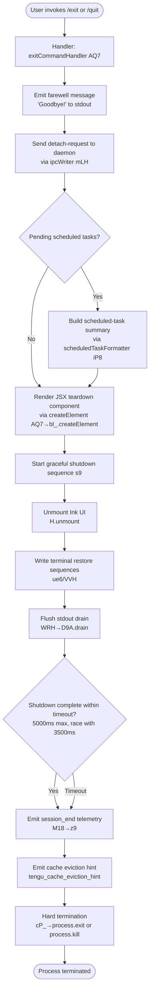

# `/exit`

> Analysis basis: CC v2.1.148 bundle.js (AST extraction + Claude interpretation)
> Minimum version: v2.1.148

---

## Overview

The `/exit` command (also aliased as `/quit`) terminates the Claude Code CLI session immediately. It is a `local-jsx` type command that triggers an inline, non-deferred shutdown sequence: it displays a farewell message, tears down the UI, flushes pending I/O, fires session-end telemetry, and ultimately calls `process.exit` or `process.kill` to terminate the process.

---

## Registration

| Field | Value |
|---|---|
| type | `local-jsx` |
| name | `exit` |
| description | `null` |
| aliases | `["quit"]` |
| immediate | `true` |
| module_id | `BS1` |
| load_inline | `true` |
| loc_byte | `12114540` |
| loc_byte_end | `12114701` |
| loc_line | `9964` |
| arbor_handler.name | `AQ7` |
| arbor_handler.fqn | `claude-2.1.148::AQ7` |
| arbor_handler.kind | `AsyncFunction` |
| arbor_handler.resolution_path | `module_id` |
| arbor_handler.n_hits | `1` |

Analysis basis: CC v2.1.148 bundle.js:+12114540

---

## Input Branching

The shutdown sequence has more than three distinct logical branches (farewell display, UI teardown, detach-request path, scheduled-task handling, session-end flush, and hard process termination). A Mermaid flowchart is used.



Analysis basis: CC v2.1.148 bundle.js:+12113789, +12113801, +12113805, +12113836, +12113866, +5274961, +5273493, +5273518

---

## Behavioral Spec

### 1. Command Entry Point — `exitCommandHandler` (AQ7)

The handler is an `AsyncFunction` resolved via `module_id` → `BS1`.

```
async function exitCommandHandler(context):
    // 1. Emit farewell text
    writeToStdout("Goodbye!")                    // loc: +12113753

    // 2. Notify daemon layer — send detach-request IPC message
    sendDetachRequest(ipcChannel)                // loc: +12113805, +10550222

    // 3. Collect any pending scheduled tasks for display
    taskSummary = buildScheduledTaskSummary()    // loc: +12113836

    // 4. Render JSX shutdown component
    element = createElement(ShutdownComponent, taskSummary)   // loc: +12113866

    // 5. Invoke the main shutdown orchestrator
    await shutdownOrchestrator(element, context) // loc: +12113972

    // 6. Record prompt_input_exit telemetry marker
    emitMarker("prompt_input_exit")              // loc: +12113977
```

Analysis basis: CC v2.1.148 bundle.js:+12113789

---

### 2. Detach-Request IPC — `ipcDetachWriter` (mLH)

```
function ipcDetachWriter(channel):
    // Mark session state as detaching
    setSessionState(0)                           // loc: +10544771
    setTaskType("task")                          // loc: +10544815

    // Write "detach-request" message over IPC socket
    ipcWrite(channel, "detach-request")          // loc: +10550222

    // Finalize the IPC message as JSON
    finalizeJsonMessage(channel)                 // loc: +10550268
```

Analysis basis: CC v2.1.148 bundle.js:+10550188, +10550207, +10550213, +10550222, +10550268

---

### 3. Scheduled-Task Summary — `scheduledTaskFormatter` (iP8)

Before UI teardown, any active scheduled tasks are collected and formatted for display.

```
function buildScheduledTaskSummary():
    tasks = getActiveTasks()                     // loc: +10543715
    if tasks is empty:
        return null

    // Push each task description into display buffer
    for task in tasks:
        taskBuffer.push(formatTaskEntry(task))   // loc: +10543720

    // Format timing info using scheduleEntryFormatter (JE7)
    timing = scheduleEntryFormatter(tasks)       // loc: +10543761

    // Build bar representation (bq) respecting terminal width
    barText = buildBar(timing)                   // loc: +10543776

    return { tasks, timing, barText }
```

The `scheduleEntryFormatter` (JE7) resolves time expressions including:
- "Every minute" label (loc: +4748993)
- "Every hour" label (loc: +4749210)
- Day-of-week patterns via `getUTCDay`, `setUTCDate`, `getDay` calls
- Minute intervals using `parseInt` with base 10 (loc: +4749049)
- Maximum scheduling window of 527,040 minutes (loc: +4748162), corresponding to approximately 366 days

Analysis basis: CC v2.1.148 bundle.js:+10543715, +10543761, +10543847, +4748993, +4749210

---

### 4. Graceful Shutdown Orchestrator — `shutdownOrchestrator` (s9)

This is the central shutdown coordinator. It races multiple async cleanup paths against a deadline.

```
async function shutdownOrchestrator(uiElement, context):
    // Step 1: Resolve any pending promises
    await Promise.resolve()                      // loc: +5274961

    // Step 2: Unmount Ink UI layer
    unmountUI()                                  // loc: +5272893 (VVH→H.unmount)

    // Step 3: Write terminal save/restore escape sequences
    writeTerminalRestoreEscapes()                // loc: +3686190 (\x1b7), +3686201 (\x1b8)

    // Step 4: Handle terminal multiplexer quirks
    // - tmux: double-escape translation        // loc: +3343266, +3343312
    // - screen: alternate handling             // loc: +3343339
    // - iTerm.app/Ghostty: version-gated paths // loc: +3419257, +3419326

    // Step 5: Flush stdout
    await drainStdout()                          // loc: +5275154 (WRH→D9A.drain)

    // Step 6: Race shutdown against timeout
    //   - Primary timeout: 5000ms              // loc: +5275058
    //   - Secondary inner timeout: 3500ms      // loc: +5275065
    result = await Promise.race([
        runSessionEndCleanup(),
        AbortSignal.timeout(5000)               // loc: +5275320
    ])

    // Step 7: Clear any lingering timers
    clearTimeout(shutdownTimer)                  // loc: +5275255

    // Step 8: Emit session_end telemetry
    emitSessionEndTelemetry()                    // loc: +5275369 (M18), +5275429 ("session_end")

    // Step 9: Emit cache eviction hint
    emitCacheEvictionHint()                      // loc: +5275394 ("tengu_cache_eviction_hint")

    // Step 10: Write final newline to stdout
    writeSync(stdout, "\n")                      // loc: +5275498

    // Step 11: Hard termination
    hardTerminate()                              // loc: +5273493, +5273518
```

Analysis basis: CC v2.1.148 bundle.js:+5274961, +5275058, +5275065, +5275320, +5275255, +5275369

---

### 5. Terminal Cleanup — `terminalRestoreWriter` (ue6) and `uiTeardown` (VVH)

```
function uiTeardown():
    // Write to stdout via yYH.writeSync             loc: +5272816
    // Retrieve renderer from QL registry            loc: +5272842
    // Unmount Ink component tree                    loc: +5272893
    // Finalize display (nh)                         loc: +5272927
    // Invoke terminal restore writer (ue6)          loc: +5272975

function terminalRestoreWriter():
    // Save/restore cursor position escape sequences loc: +3686190, +3686201
    // Detect and handle terminal type (FTH):
    //   - Ghostty >= 1.2.0                          loc: +3419257, +3419287
    //   - iTerm.app >= 3.6.6                        loc: +3419326, +3419358
    // Neutralize tmux/screen escape doubling (zG):  loc: +3343266, +3343339
    //   Replace double-escape sequences             loc: +3343312
```

Analysis basis: CC v2.1.148 bundle.js:+5272816, +5272893, +3686190, +3686201, +3419257, +3343266

---

### 6. Hard Termination — `hardTerminator` (cP_)

```
function hardTerminator():
    clearTimeout(shutdownTimer)                  // loc: +5273412

    // Retrieve current process group from QL map
    pid = processRegistry.get(key)               // loc: +5273445

    if normalExitPath:
        process.exit(0)                          // loc: +5273493
    else:
        // Force-kill the process group
        process.kill(pid, signal)                // loc: +5273518

    // Guard: if execution reaches here, throw
    throw new Error("unreachable")               // loc: +5273560, +5273566
```

Analysis basis: CC v2.1.148 bundle.js:+5273412, +5273493, +5273518, +5273566

---

### 7. Session-End Telemetry — `sessionEndEmitter` (M18)

```
function sessionEndEmitter():
    scrollSummary = buildScrollSummary(sV)       // loc: +5274347, +5274361 ("tengu_scroll_summary")
    sessionData   = collectSessionData(c)        // loc: +5274359
    timingStats   = computeTimingStats(U7q)      // loc: +5274388
    renderState   = captureRenderState(z9)       // loc: +5274405

    emit("session_end", {                        // loc: +5275429
        scroll:  scrollSummary,
        session: sessionData,
        timing:  timingStats,
        render:  renderState
    })

    emit("tengu_cache_eviction_hint", ...)       // loc: +5275394
```

Analysis basis: CC v2.1.148 bundle.js:+5274347, +5274361, +5274388, +5274405, +5275429, +5275394

---

### 8. Farewell Variation — `goodbyeVariantPicker` (H → Math.random / setTimeout)

A minor aesthetic variation is applied to the "Goodbye!" message output. The implementation uses `Math.random` to select among display variants (numeric range 0–2 observed, loc: +13143285, +13143301) and `setTimeout` with a brief delay before render, suggesting a small randomized farewell animation or text variant.

Analysis basis: CC v2.1.148 bundle.js:+13143287, +13143324

---

### 9. Render-State Capture — `renderStateSnapshot` (z9)

The `z9` function captures the UI render state at exit for telemetry purposes. It checks for `local-agent` mode (loc: +3351017), evaluates fullscreen status (loc: +3351562), and branches on environment flags:

- tmux-CC / iTerm2 integration mode: fullscreen disabled, warning emitted (loc: +3351228)
- Windows over SSH / ConPTY: fullscreen disabled, alternate warning (loc: +3351414)
- Emits `tengu_amber_creek` (loc: +3351745) or `tengu_pewter_brook` (loc: +3351653) telemetry depending on the path taken.

Analysis basis: CC v2.1.148 bundle.js:+3351017, +3351228, +3351414, +3351562, +3351653, +3351745

---

## State & Side Effects

| Item | Detail |
|---|---|
| Telemetry — session_end | Emitted by `sessionEndEmitter` (M18) at shutdown; loc: +5275429 |
| Telemetry — tengu_scroll_summary | Scroll position summary captured before teardown; loc: +5274361 |
| Telemetry — tengu_cache_eviction_hint | Cache hint fired just before process termination; loc: +5275394 |
| Telemetry — tengu_amber_creek | Render-path branch A (fullscreen resolution); loc: +3351745 |
| Telemetry — tengu_pewter_brook | Render-path branch B (fullscreen resolution); loc: +3351653 |
| Telemetry — tengu_daemon_config_reload | Fired during supervisor/daemon stop sequence; loc: +15132353 |
| Telemetry — tengu_bg_dispatch_sigkill_escalate | Background process SIGKILL escalation; loc: +15117585 |
| Telemetry — tengu_bg_dispatch_low_mem | Background process low memory event; loc: +15118164 |
| Telemetry — tengu_bg_spare_enable | Background spare-process pool enable; loc: +15118859 |
| Telemetry — tengu_bg_spare_claim | Spare process claimed; loc: +15118980 |
| Telemetry — tengu_bg_spare_claim_fail | Spare process claim failure; loc: +15119243 |
| Telemetry — tengu_bg_spare_spawn | Spare background process spawned; loc: +15117278 |
| Telemetry — tengu_startup_perf | Startup performance report emitted (via r_6/bS8); loc: +212052 |
| IPC side effect | `detach-request` message sent to daemon over IPC socket; loc: +10550222 |
| UI teardown | Ink component tree unmounted via `H.unmount`; loc: +5272893 |
| Terminal state | Save/restore escape sequences written (ESC-7 / ESC-8); loc: +3686190, +3686201 |
| Process termination | `process.exit` or `process.kill` invoked; execution does not return; loc: +5273493, +5273518 |
| stdout flush | `D9A.drain` called before termination; loc: +57511 |
| Farewell text | Literal "Goodbye!" written to stdout; loc: +12113753 |
| Scheduled tasks | Active scheduled tasks summarised in UI before teardown; loc: +10543734 |
| Timing budget | Shutdown race timeout: 5000 ms max, inner deadline 3500 ms; loc: +5275058, +5275065 |

---

## Version History

| Version | Change |
|---|---|
| v2.1.148 | Initial analysis |

---

## Common Mistakes

1. **Using `/exit` during an active tool call**: because `immediate: true` is set, the command fires without waiting for a running tool to complete. Any in-progress file writes or shell commands may be left in a partial state.
2. **Expecting a clean exit on Windows over SSH**: the ConPTY re-rendering path disables fullscreen and may produce visible artefacts; this is a known environment limitation logged at loc: +3351414.
3. **Confusing `/exit` with a soft close**: `/exit` always results in `process.exit` or `process.kill` — it is not a suspend or detach. The `detach-request` IPC message is informational to the daemon, not a request to keep the session alive.
4. **Assuming `/quit` has different behaviour**: `/quit` is a registered alias with identical semantics; both names resolve to the same handler `AQ7`.
5. **Relying on the 5-second shutdown window for large flushes**: the shutdown orchestrator races against a hard 5000 ms `AbortSignal.timeout`; any cleanup that exceeds this deadline will be abandoned before `process.exit` is called.

---

## Appendix — Identifier Mapping

> For bundle debugging only. Identifiers change across versions.

| Identifier | Role |
|---|---|
| `AQ7` | Exit command handler (AsyncFunction; arbor_handler for `/exit`) |
| `Rq` | Process-type checker (checks "bg", "daemon", "daemon-worker" modes) |
| `T3H` | Process-type branch resolver |
| `H` | Farewell variant picker (uses Math.random + setTimeout) |
| `mLH` | IPC detach-request writer |
| `Bd6` | IPC channel provider |
| `Mz1` | Session-state setter |
| `QjH` | Session-state initialiser |
| `v8` | State value resolver |
| `Jo` | IPC socket writer |
| `CH` | JSON serialiser for IPC messages |
| `h8H` | IPC message finaliser |
| `Nf` | Context/environment accessor |
| `iP8` | Scheduled-task summary builder |
| `k0` | Active-task getter |
| `oV` | Environment variable reader |
| `JE7` | Schedule entry formatter (parses cron-like time specs) |
| `SZ` | Cron expression parser |
| `K` | Cron pattern map / column formatter |
| `w` | Background process lifecycle manager |
| `L` | Async task tracker (add/finally/delete) |
| `j` | Process group kill helper |
| `D` | Daemon process manager |
| `$` | IPC connection resolver |
| `J` | Date/UTC day calculator |
| `DN` | Schedule descriptor normaliser |
| `D3L` | Schedule token splitter |
| `A` | Token lowercase mapper |
| `EQH` | Time expression evaluator |
| `_` | Date anchor for schedule computation |
| `O` | Mutable Date object for schedule resolution |
| `M` | Terminal/renderer registry |
| `q` | File-system unlink / exit registry |
| `Hq` | Duration formatter (floor/round helper) |
| `bq` | Terminal bar builder (width-aware) |
| `j8` | Grapheme-width measurer (Bun.stringWidth) |
| `Yq` | Wide-char segment builder |
| `cz` | Segment combiner |
| `_Q7` | Shutdown JSX component factory |
| `s9` | Graceful shutdown orchestrator |
| `VVH` | UI teardown and stdout writer |
| `nh` | Display finaliser |
| `ue6` | Terminal restore escape writer |
| `FTH` | Terminal type detector (Ghostty / iTerm.app) |
| `mTH` | Terminal mode setter |
| `zG` | tmux/screen escape neutraliser |
| `UH` | String coercer |
| `dP_` | Stdout dim-text writer (dimmed exit info) |
| `sV` | Scroll summary collector |
| `dR` | Display row reader |
| `h6` | Home-directory resolver |
| `PD6` | Config file stat helper |
| `sy` | Config path builder |
| `w_` | Alternate config path builder |
| `F6` | File existence checker |
| `CO` | Config override reader |
| `v4` | Config value resolver |
| `F7q` | Formatted text writer |
| `cP_` | Hard terminator (process.exit / process.kill) |
| `WRH` | Stdout drain wrapper |
| `Y` | Supervisor/daemon session stopper |
| `LPH` | Session statistics collector |
| `M1` | Async-local store reader |
| `q8` | Queue/state resetter |
| `Hi_` | Session-end helper |
| `ZH` | String conversion wrapper |
| `sx1` | Output column formatter |
| `T` | Input event stop handler |
| `b` | Input event object |
| `IW` | User settings reader |
| `V` | Daemon config manager (stop/updateConfig/start) |
| `kfK` | Heartbeat canceller |
| `xt` | Heartbeat ticker |
| `Z` | Background session starter |
| `c` | Session context accessor |
| `r_6` | Startup performance reporter |
| `bS8` | Performance metrics emitter |
| `pu` | Node.js `require` wrapper |
| `JKA` | Startup profiling report builder |
| `WKA` | Profiling checkpoint formatter |
| `JAH` | Atomic file writer (open/write/fsync/close) |
| `YKA` | Profiling entry serialiser |
| `N` | Log/debug message emitter |
| `M18` | Session-end telemetry emitter |
| `B7q` | Session byte-count tracker |
| `U7q` | Session timing stats computer |
| `m7q` | Timing metric aggregator |
| `z9` | Render-state snapshot (fullscreen/env detection) |
| `VbH` | Render cache checker |
| `G7_` | Render output builder |
| `bn` | Render block helper |
| `W7_` | Fullscreen eligibility evaluator |
| `HA` | Keyboard map resolver |
| `ql4` | Fullscreen-enabled telemetry emitter (tengu_amber_creek path) |
| `V6` | Display renderer (Df6/wf6/Ct pipeline) |
| `Y86` | Exit code resolver |
| `f18` | Parallel cleanup runner (Promise.all / Promise.race) |
| `r8` | Abort-signal timeout wrapper |

---

Note: index built via Arbor fallback; some signals (telemetry, literals) may be missing — see arbor-fallback.js.