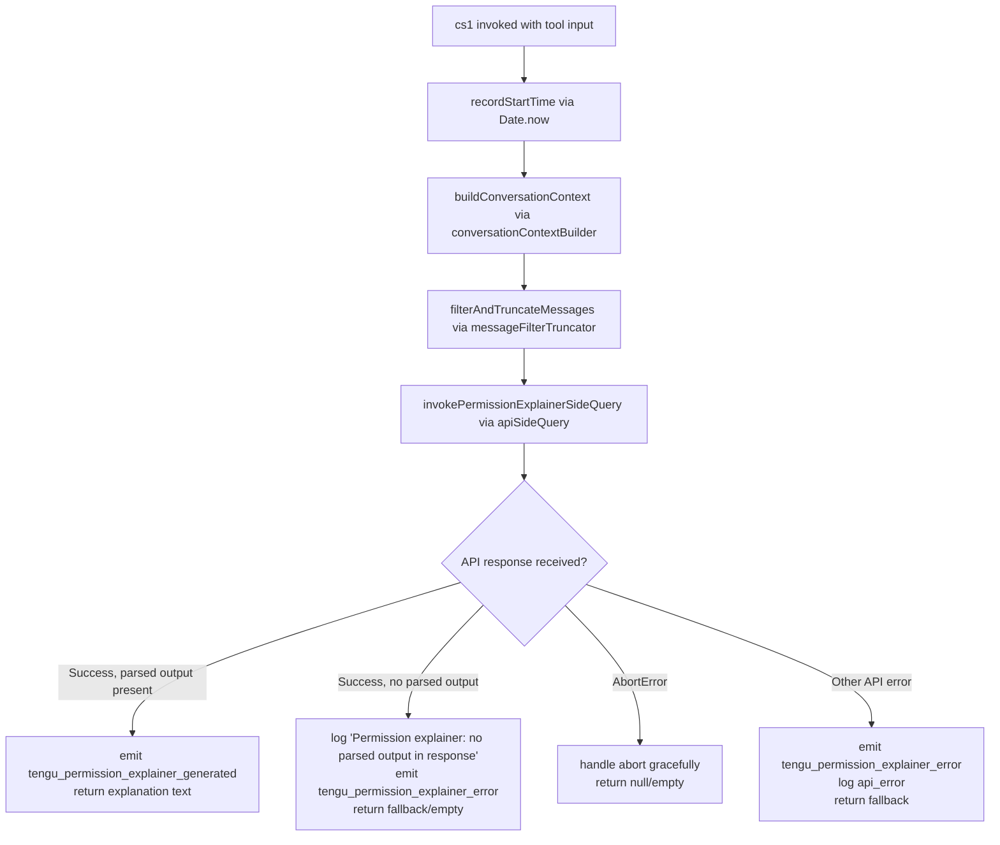

# `/explain_command`

> Analysis basis: CC v2.1.148 bundle.js (AST extraction + Claude interpretation)
> Minimum version: v2.1.148

---

## Overview

The `explain_command` tool is an internal tool-type command that generates human-readable explanations for permission-requiring operations (e.g., tool calls, shell commands). It invokes a side-query against the Anthropic API — using a distilled view of recent conversation history — to produce a plain-language justification of why a given command or tool use requires specific permissions. The result is surfaced in the permission explainer UI component.

---

## Registration

| Field | Value |
|---|---|
| type | `tool` |
| name | `explain_command` |
| description | `null` |
| loc_byte | `13611898` |
| loc_byte_end | `13611934` |
| loc_line | `12285` |
| arbor_handler.name | `cs1` |
| arbor_handler.fqn | `claude-2.1.148::cs1` |
| arbor_handler.kind | `AsyncFunction` |
| arbor_handler.resolution_path | `direct` |
| arbor_handler.n_hits | `1` |

Analysis basis: CC v2.1.148 bundle.js:+13611898

---

## Input Branching

Four distinct execution paths exist based on the outcome of the side-query API call, making a Mermaid flowchart the appropriate representation.



Analysis basis: CC v2.1.148 bundle.js:+13611593, +13611638, +13611656, +13611803, +13612381, +13612483, +13612593, +13613051, +13613122

---

## Behavioral Spec

### Handler Entry Point (`cs1`)

The async handler `cs1` is the direct entry point resolved by Arbor at byte offset 13611898.

```
async function permissionExplainerHandler(toolInput):
    startTime = Date.now()                          // loc: +13611617

    // Step 1: Build a compact representation of the recent API exchange
    contextPayload = buildConversationContext(toolInput)   // B45, loc: +13611638

    // Step 2: Filter & truncate messages for the side-query prompt
    //   - Keeps only 'assistant'-role messages (literal "assistant", loc: +13611192)
    //   - Takes up to last 3 messages (literal 3, loc: +13611212)
    //   - Limits total characters to approx 1000 chars per entry (literal 1000, loc: +13611157)
    //   - Extracts text-type content blocks (literal "text", loc: +13611295)
    //   - Reverses the array, slices, unshifts, then joins with "..." separator (literal "...", loc: +13611393)
    filteredMessages = filterAndTruncateMessages(contextPayload)  // F45, loc: +13611656

    // Step 3: Resolve prompt context (model selection, tool metadata, system prompt fragments)
    promptContext = buildPromptContext(toolInput)    // Bq, loc: +13611803

    // Step 4: Issue the side-query API call
    //   - Annotated as "side_query" internally (literal "side_query", loc: +12891744)
    //   - Runs through the standard API client (rb → xm pipeline)
    response = await issuePermissionExplainerSideQuery(promptContext, filteredMessages)  // rb, loc: +13611816

    // Step 5: Branch on response
    if response contains parsed explanation output:
        emit telemetry("tengu_permission_explainer_generated")   // loc: +13612381
        return structuredExplanation(response)

    elif response is present but lacks parsed output:
        log("Permission explainer: no parsed output in response")  // loc: +13612728
        emit telemetry("tengu_permission_explainer_error")         // loc: +13612593
        return fallbackExplanation()

    elif error.name == "AbortError":                              // literal "AbortError", loc: +13613051
        return null

    else:  // api_error
        emit telemetry("tengu_permission_explainer_error")        // loc: +13612593
        log("api_error")                                          // literal "api_error", loc: +13613122
        return fallbackExplanation()
```

Analysis basis: CC v2.1.148 bundle.js:+13611593

---

### Conversation Context Builder (`B45`)

Constructs a compact representation of the conversation state for embedding into the side-query prompt.

```
function buildConversationContext(input):
    // Applies JSON serialization (CH → JSON.stringify, loc: +181894)
    // Coerces numeric fields to String (literal 2, loc: +13611113)
    serialized = serializeToString(input)
    return serialized
```

Analysis basis: CC v2.1.148 bundle.js:+13611103

---

### Message Filter and Truncator (`F45`)

Prepares a compact string of recent assistant turns to embed in the explanation request.

```
function filterAndTruncateMessages(messages):
    // Filter to assistant-role messages only (literal "assistant", loc: +13611192)
    assistantMessages = messages.filter(m => m.role == "assistant")

    // Reverse to get most-recent-first
    assistantMessages.reverse()

    // Take up to 3 most recent (literal 3, loc: +13611212)
    recentMessages = assistantMessages.slice(0, 3)

    // Extract text content blocks (literal "text", loc: +13611295)
    // Truncate each to ~1000 chars (literal 1000, loc: +13611157)
    textParts = recentMessages.map(extractAndTruncateText)

    // Prepend query context
    textParts.unshift(queryContext)

    // Join with ellipsis separator (literal "...", loc: +13611393)
    return textParts.join("...")
```

Analysis basis: CC v2.1.148 bundle.js:+13611169, +13611237, +13611380, +13611401, +13611434

---

### Side-Query API Invocation (`rb` → `xm`)

The main API call chain uses the standard `rb` (side-query runner) and `xm` (HTTP client / request builder) pipeline. This is the same infrastructure used by other side-query commands.

Key behaviors within `xm`:
- Attaches `x-app: cli-bg` or `x-app: cli` header (literals "cli-bg", "cli", loc: +2898006, +2898015)
- Sets `User-Agent` header (literal "User-Agent", loc: +2898021)
- Sets `X-Claude-Code-Session-Id` (loc: +2898039)
- Handles OAuth token refresh via `z1_` if needed (loc: +2898623)
- Applies proxy authentication via `sU6` (loc: +2898776)
- Timeout: 600000 ms (10 minutes) maximum (literal 600000, loc: +2898900)
- Cloud gateway session expiry triggers: `"Cloud gateway session expired — run /login to reconnect."` (loc: +2899080)

Analysis basis: CC v2.1.148 bundle.js:+13611816, +12891712, +2897977

---

### Permission Explainer Registration Verification (`iq`)

Before dispatching, `cs1` calls `iq` to validate that the registered tool name matches expected internal names.

```
function validateToolRegistration(toolName):
    // Checks Object.hasOwn on tool registration (loc: +3137997)
    // Verifies name does not start with "mcp_tool" prefix (literal "mcp_tool", loc: +3138077)
    // Checks name starts with expected prefix via H.startsWith (loc: +3138049)
    if not validRegistration(toolName):
        raise RegistrationError
```

Analysis basis: CC v2.1.148 bundle.js:+13612431, +3137997

---

### Prompt Context Assembly (`Bq`)

Assembles the full prompt payload sent to the model, incorporating:
- Current model selection and tier information (literals: `"opusplan"`, `"sonnet"`, `"haiku"`, `"opus"`, `"best"` — loc: +2172032 through +2172188)
- Tool metadata normalization via `lq` (trim, lowercase, replacement, loc: +2171936–+2172278)
- Conversation structure formatting via `WW` and its sub-calls (`GA`, `gs`, `W3H`, `hmH`, `kv`, `tP`, `W3`, `hA`, `gf`, `yv`)
- Provider routing: `"firstParty"`, `"anthropicAws"`, `"gateway"`, `"bedrock"`, `"foundry"`, `"mantle"`, `"vertex"` (loc: +2170798, +2030270, +2030290, +2029601, +2029651, +2029761, +2029809)

Analysis basis: CC v2.1.148 bundle.js:+13611803, +2168172

---

## State & Side Effects

| Item | Detail |
|---|---|
| Telemetry: `tengu_permission_explainer_generated` | Fired on successful explanation generation (loc: +13612381) |
| Telemetry: `tengu_permission_explainer_error` | Fired when response lacks parsed output or on API error (loc: +13612593) |
| Telemetry: `tengu_api_success` | Fired by the API client layer on a successful HTTP response (loc: +12893195) |
| Telemetry: `tengu_prompt_cache_1h_config` | Fired by `tVH` when 1-hour cache control is applied to the prompt (loc: +12854241) |
| Telemetry: `tengu_config_parse_error` | Fired by config reader `k$H` if config JSON is malformed (loc: +3187440) |
| Telemetry: `tengu_oauth_token_refresh_*` | Full OAuth refresh lifecycle emitted by `z1_` if token is stale (loc: +2939392–+2940916) |
| Telemetry: `tengu_stream_watchdog_default_on` | Fired by stream watchdog in API client (loc: +2906005) |
| Telemetry: `tengu_byte_watchdog_fired_late` | Fired if byte-level watchdog triggers after stream read (loc: +2905275) |
| Side-query type | Internally labelled `"side_query"` (loc: +12891744); does not appear in the main conversation history |
| appState changes | None observed at depth-2; explanation result is returned to the calling UI component |
| Hook registration | Uses `r9` → `D9A.register` for file-watch hooks on config (loc: +57468) |
| Sound | None |
| File I/O | Config is read via `k$H` → `q.readFileSync` (loc: +3186859); backups directory created at `"backups"` sub-path (loc: +3186371) |
| Config guard | `"Config accessed before allowed."` error thrown if config is read before initialization (loc: +3186803) |

---

## Version History

| Version | Change |
|---|---|
| v2.1.148 | Initial analysis |

---

## Common Mistakes

1. **Treating `explain_command` as a user-facing slash command**: It is registered as a `tool` type, not a `prompt` type. It is invoked programmatically by the permission UI, not by typing `/explain_command` in the chat input.
2. **Expecting `description` to be present**: The `description` field in the registration is `null`. Any consumer relying on a description string for display purposes must handle `null`.
3. **Assuming all conversation messages are included in the side-query**: Only the most recent 3 `assistant`-role messages are included, each truncated to approximately 1000 characters, joined by `"..."`.
4. **Ignoring the abort path**: The handler explicitly checks for `AbortError` and returns gracefully. Integrations must handle a `null` return from the explainer.
5. **Conflating `explain_command` with `mcp_tool`**: The registration validator (`iq`) actively checks that the name does **not** match the `mcp_tool` prefix pattern, meaning MCP-sourced tools are excluded from this explainer path.
6. **Assuming instant response**: The API client sets a 600,000 ms (10-minute) timeout. The explainer is an async call and callers must await it properly.

---

## Appendix — Identifier Mapping

> For bundle debugging only. Identifiers change across versions.

| Identifier | Role |
|---|---|
| `cs1` | Main async handler for `explain_command` (arbor_handler) |
| `Rt_` | Top-level dispatcher called from `cs1`; routes to config + context initialisation |
| `x6` | File-watch / config context setup; calls config reader and watch-file infrastructure |
| `k$H` | Config reader: reads JSON config from disk, handles backups, ENOENT, EEXIST |
| `hy9` | Directory scanner for config backup paths |
| `EQ4` | File-watch registration; attaches `ws6.watchFile` / `ws6.unwatchFile` |
| `B45` | Conversation context builder; serialises input to string for side-query |
| `CH` | JSON stringify wrapper |
| `F45` | Message filter and truncator; filters to assistant-role, reverses, slices, joins |
| `Bq` | Prompt context assembler; calls `ps`, `lq`, `bJ` |
| `ps` | Prompt structure builder; calls `aV`, `_AH`, `XA`, `FF` |
| `FF` | Full prompt formatter; handles model name normalisation, provider filtering, tool serialisation |
| `lq` | Model-name normaliser; trims, lowercases, applies alias replacements |
| `bJ` | Prompt body joiner; calls `lq` and `WW` |
| `WW` | Conversation turn formatter; assembles user/assistant/system turns |
| `rb` | Side-query runner; orchestrates `xm`, handles retries, hashing, message assembly |
| `xm` | HTTP request builder and API client; sets headers, handles auth, streaming, proxy |
| `z1_` | OAuth token refresh manager; handles locking, retrying, race resolution |
| `sU6` | Proxy authentication helper; applies proxy auth headers when workspace trust accepted |
| `Eu4` | API stream manager; sets up ReadableStream, manages timeouts, enqueues chunks |
| `Gu4` | Byte-level stream watchdog; fires `tengu_byte_watchdog_fired_late` on stall |
| `mD` | Auth credential resolver; dispatches to `Uv` (OAuth), `r$` (API key), `ZqH` |
| `r$` | API key credential handler; reads `ANTHROPIC_API_KEY`, validates helper config |
| `Uv` | OAuth credential handler; selects OAuth flow based on provider |
| `tVH` | Prompt cache configurator; applies `cache_control: "1h"` and emits `tengu_prompt_cache_1h_config` |
| `nr6` | Message normaliser for side-query; calls `jq`, `Pt`, filters included messages |
| `jq` | Message content formatter; applies `Ij` for model-specific replacements |
| `Ij` | Per-model content transformer; lowercases, replaces, cleans content blocks |
| `mOH` | Response parser; validates array structure, calls `Um`, `I5`, `h6`, `CH` |
| `Um` | Tool-use block extractor from response |
| `M8` | Config state object; holds fields: `_L_`, `MG`, `sUH`, `yy9`, `tUH` |
| `iq` | Tool registration validator; checks `Object.hasOwn` and `startsWith` for `mcp_tool` prefix |
| `N` | Log/notification utility; formats debug/error messages with level strings |
| `RH` | Error reporter; calls `n_`, `UH`, `j1`, `FpK`, `Gl.logError` |
| `UH` | String coercion wrapper |
| `ZH` | String conversion helper |
| `bH` | Feature flag OK emitter → `tengu_feature_ok` |
| `mH` | Feature flag bad emitter → `tengu_feature_bad` |
| `K8` | Feature sad emitter → `tengu_feature_sad` |
| `V6` | Filesystem context builder; calls `Df6`, `wf6`, `Ct`, `As6`, `x6` |
| `Go_` | Hash utility; uses `fF1.createHash` with SHA-256 |
| `st7` | Message finder; searches conversation for user/assistant turns |
| `SGH` | System-generation helper; calls `jq`, `RD`, `Sh` |
| `Sh` | System-prompt helper (calls `hA`) |
| `bZH` | Context window budget calculator; calls `aOL`, `RH` |
| `GQ` | Agent-prefix router; dispatches based on `agent:builtin:`, `agent:custom:`, `agent:` prefixes |
| `oOL` | Agent identifier parser; handles startsWith, slice, `eA8`, `XD_` |
| `XD_` | Agent path splitter; uses indexOf and slice |
| `Y2` | Message mapper utility |
| `MZ` | Config merge utility; calls `_1_`, `UH` |
| `Ws6` | Workspace helper; calls `hA` |
| `AL_` | Backup path builder; calls `UY.join`, `o8` |
| `OC` | String prefix stripper; `startsWith` + `slice` |
| `B6` | JSON parse wrapper |
| `Rd6` | Session store accessor; reads `f99.getStore` |
| `bD` | Context store reader; reads `K99.getStore` |
| `Wu4` | String split/trim/indexOf/slice utility for header parsing |
| `Rq` | Request queue handler; calls `T3H` |
| `jn` | Session context builder; calls `Rd6` |
| `h6` | Output view helper; calls `oV` |
| `Nt8` | URL encoder helper; `H.replace` + `encodeURIComponent` |
| `i$` | Auth initialiser; calls `z1_` |
| `$99` | Boolean coercion utility |
| `Hz` | Environment/header helper |
| `Pu4` | Provider URL builder; calls `GJ`, `OUH` |
| `OUH` | OAuth URL helper; calls `Bv`, `$29`, `Date.now`, `K29` |
| `h_` | Feature flag check helper |
| `Eu4` | (see above) |
| `RD` | Role disambiguator; calls `HQ6`, `gj4`, `hA`, `eg6` |
| `eg6` | Role normaliser; lowercases and maps role values |
| `tz` | Token resolver; calls `UH`, `EC`, `ul`, `pu6`, `nmA` |
| `ul` | Auth header parser; handles https/port, lowercase, startsWith, substring, endsWith |
| `pu6` | Prompt cache level resolver; calls `Eh`, `fm` |
| `Xu4` | Request executor; calls `Br6`, `tV`, `ERH`, `IXH`, `R9` |
| `Br6` | Request builder; calls `HX`, `Bq`, `jq`, `tV` |
| `IXH` | Instance ID lookup; uses `kDK.find`, `H.startsWith`, `Wk6` |
| `R9` | Endpoint resolver; validates staging/prod, applies `ODA`, `RmK` |
| `v3H` | Gateway refresh token handler; calls `Ly8`, `JW4`, `qk6` |
| `JW4` | Token refresh HTTP poster; calls `cF.post`, `wq9`, `N`, `Hz`, `Dq9`, `jq9`, `ZH` |
| `Ky8` | Token timestamp recorder; uses `Date.now` |
| `DM6` | Header case-normaliser; `Object.entries` + `q.toLowerCase` |
| `w$H` | SDK warning emitter; `console.error` with `"[Anthropic SDK WARN]"` prefix |
| `Lc6` | WIF (Workload Identity Federation) credential fetcher; calls `fetch`, `AbortSignal.timeout` |
| `BmH` | Provider credential combiner; calls `Lc6`, `GW4`, `bH`, `mH` |
| `GW4` | Provider include-list checker |
| `Vj` | Credential validator; calls `r$` |
| `tP` | Subscription-tier prompt builder; calls `u9H`, `m9H`, `hA`, `GA`, `q1` |
| `GA` | Tier resolver; calls `mD`, `vC`, `eA` |
| `gs` | Max-tier formatter; calls `q1` |
| `W3H` | Team-tier formatter; calls `q1`, `$g` |
| `hmH` | Enterprise-tier formatter; calls `q1`, `w29` |
| `kv` | Model-tier combiner; calls `W3`, `gf` |
| `yv` | Alternate model-tier combiner; calls `W3`, `gf` |
| `W3` | Tier string builder; calls `hA` |
| `hA` | Provider string builder; calls `UH` |
| `gf` | Formatted model builder; calls `MRH`, `dj4`, `AaA`, `_Q6`, `hA` |
| `AQ6` | Object-entries tool serialiser; calls `HA`, `Object.entries` |
| `ImH` | Content-type inclusion checker; uses `X24.includes` |
| `_99` | Content-type index finder; calls `ImH`, `A.indexOf` |
| `W24` | Content-block checker; calls `H.includes`, `C9H`, `lq` |
| `C9H` | Content-role checker; uses `R9H.includes` |
| `G24` | Content-group formatter; calls `C9H`, `lq`, `H99`, `_.startsWith` |
| `Ct` | Context builder helper; calls `UH`, `rC` |
| `As6` | Context set manager; calls `b4_.has`, `V$H.get`, `b4_.add`, `C4_`, `p4_` |
| `bd6` | Conversation history formatter; calls `r1`, `hA`, `Rd6`, `N` |
| `fj5` | Background daemon protocol handler (large); manages ping/nudge/yield/lease/dispatch/kill/resize messages |
| `LfK` | Background protocol lease/timeout manager |
| `Mj5` | Background job lifecycle manager |
| `KN6` | Background channel write helper |
| `P` | Background protocol reader; buffers, splits, decodes JSON frames |
| `KM` | Background channel end handler |
| `RK` | Background socket path builder; calls `jX.join`, `wG` |
| `G$` | Realpath normaliser; calls `ru.realpath`, `H.normalize` |
| `WT` | Socket path helper; calls `FbH.join`, `$v`, `Lz` |
| `RMH` | File line-reader; opens, creates readline interface, streams |
| `X` | Supervisor repaint handler; calls `YN8`, `jy`, `PU`, `VLH`, `Ti`, `RH`, `n_` |
| `Lj5` | Stall timer helper; calls `V6`, `Math.max` |
| `h8H` | Background startup state display helper |
| `h` | Away-summary trigger handler; checks blur/focus, computes timers |
| `I` | Away-summary generator; checks rate limits, draft input, emits `away_summary_generate` |
| `s6K` | Summary cache accessor |
| `Vg` | Blur/focus event classifier |
| `w` | Background daemon session manager; handles spawn, kill, freemem, retire |
| `r8` | Abort controller helper; manages timeout, clearTimeout |
| `u` | Deferred write helper; calls `clearTimeout`, `$.write` |
| `p` | Transient display writer; calls `z.write`, `Math.round`, `setTimeout` |
| `rq_` | Token budget calculator; `Math.max`, `Number` |
| `Tu4` | Request metadata builder; calls `r1`, `UH`, `V6` |
| `Zu4` | Header sanitiser; redacts `authorization` → `"<opaque>"`, checks `anthropic-beta`, `x-anthropic-` |
| `EC` | Environment credential reader |
| `gP` | Proxy config getter; calls `i2H` |
| `xWH` | Proxy URL builder; calls `UH` |
| `lmA` | Proxy URL secondary builder; calls `xWH` |
| `a14` | Numeric parser helper; `parseInt` + `Number.isNaN` |
| `HQ6` | Role header builder; calls `hA`, `UH` |
| `gj4` | Role prefix checker; `H.startsWith` |
| `HY` | Background service label helper; calls `v$H` |
| `fF1` | Node.js `crypto` module reference (used for SHA-256 in `Go_`) |

---

Note: index built via Arbor fallback; some signals (telemetry, literals) may be missing — see arbor-fallback.js.