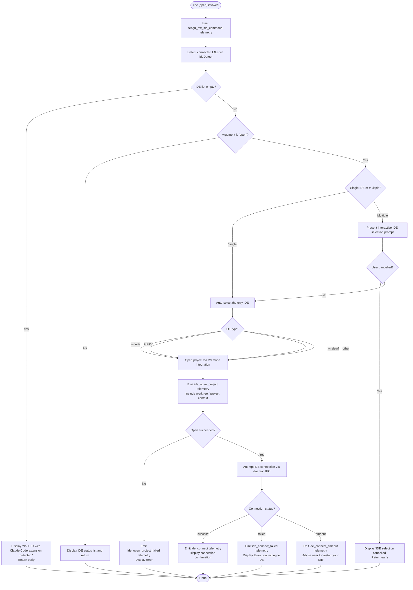

# `/ide`

> Analysis basis: CC v2.1.148 bundle.js (AST extraction + Claude interpretation)
> Minimum version: v2.1.148

---

## Overview

The `/ide` command manages IDE integrations for Claude Code, detecting connected IDEs, displaying their status, and optionally opening the current project in a selected IDE. It operates as an async handler (`Vk7`) that resolves connected IDEs via the daemon's IPC layer, presents a selection prompt when multiple IDEs are available, and emits structured telemetry for each phase of the IDE open workflow.

---

## Registration

| Field | Value |
|---|---|
| type | `local-jsx` |
| name | `ide` |
| description | `Manage IDE integrations and show status` |
| argumentHint | `[open]` |
| module_id | `PJ1` |
| load_inline | `true` |
| loc_byte | `11068157` |
| loc_byte_end | `11068313` |
| loc_line | `8572` |
| arbor_handler.name | `Vk7` |
| arbor_handler.fqn | `claude-2.1.148::Vk7` |
| arbor_handler.kind | `AsyncFunction` |
| arbor_handler.resolution_path | `module_id` |
| arbor_handler.n_hits | `0` |

Analysis basis: CC v2.1.148 bundle.js:+11068157

---

## Input Branching

Six or more distinct paths exist (no detected IDEs, no IDE selected, sub-command `open`, specific IDE type, connection success/failure, timeout), so a Mermaid flowchart is used.



Analysis basis: CC v2.1.148 bundle.js:+11064271 (handler entry `Vk7`), +11064379 (`"open"` literal), +11064488 (no-IDE message), +11064626 (no-selection message)

---

## Behavioral Spec

### 1. Command Entry and Telemetry Bootstrap

```
async function ideCommandHandler(context):
    emit telemetry("tengu_ext_ide_command", context)
    args = context.args
    connectedIdes = await detectConnectedIDEs(context)  // calls ideDetect (odH)
    if connectedIdes is empty:
        display("No IDEs with Claude Code extension detected.")
        return
```

Analysis basis: CC v2.1.148 bundle.js:+11064271, +11064393 (call to `Nf`), +11064417 (call to `b6`), +11064431 (call to `odH`)

---

### 2. IDE Detection (`ideDetect`)

The IDE detection function (`odH`) resolves a list of running IDE processes that have the Claude Code extension active. It:

1. Calls `getWorkspaceDirectories` (via `aq8`) to enumerate candidate workspace roots, handling WSL paths (`/mnt/c/Users`), home directory, and `.claude` config directories. Analysis basis: CC v2.1.148 bundle.js:+5242956 (`sLq.homedir`), +5242970 (`".claude"`), +5243015 (`"wsl"`)
2. On Linux, runs a `ps aux` shell command to grep for known IDE process names: `code`, `cursor`, `windsurf`, `idea`, `pycharm`, `webstorm`, `phpstorm`, `rubymine`, `clion`, `goland`, `rider`, `datagrip`, `dataspell`, `aqua`, `gateway`, `fleet`, `android-studio`. Analysis basis: CC v2.1.148 bundle.js:+5249963
3. Normalises IDE type names to lowercase; recognises `"appcode"` and `"jetbrains"` variants. Analysis basis: CC v2.1.148 bundle.js:+5250337, +5241536
4. Emits `"ide_detect"` on success and `"ide_detect_failed"` on any error. Analysis basis: CC v2.1.148 bundle.js:+5246429, +5246493

```
async function detectConnectedIDEs(context):
    workspaceDirs = await getWorkspaceDirectories(context)  // aq8 / lXL
    rawList = []
    if platform is linux:
        output = shell("ps aux | grep -E 'code|cursor|...' | grep -v grep")
        rawList = parseIDEProcessList(output)  // ULq, LP
    else:
        rawList = await nativeIDEQuery(workspaceDirs)
    normalised = rawList
        .map(normaliseIDEEntry)       // lower-case type, resolve path
        .filter(isValidEntry)
    emit("ide_detect", { count: normalised.length })
    return normalised
```

Analysis basis: CC v2.1.148 bundle.js:+5245086 (`parseInt`), +5245105 (call to `w_`), +5245149 (`Promise.all`)

---

### 3. Status Display (no `open` argument)

When the command is invoked without arguments or without `"open"`, the handler renders a status table of all detected IDEs. The display helper (`K`) pads IDE names to a fixed width (40 characters) and joins entries with `"  "` (two spaces). Analysis basis: CC v2.1.148 bundle.js:+15143577 (literal `40`), +15141606 (literal `"  "`)

```
function renderIDEStatusList(ideList):
    rows = ideList.map(entry =>
        entry.name.padEnd(40) + "  " + entry.status
    )
    return rows.join("\n")
```

Analysis basis: CC v2.1.148 bundle.js:+15141585 (`M.padEnd`), +15141572 (`L.map`)

---

### 4. IDE Selection (multiple IDEs detected)

When `open` is requested and multiple IDEs are found, an interactive selection prompt is presented via the JSX component (`JJ1`). The component uses React hooks (`useState`, `useRef`, `useEffect`, `useCallback`) to manage selection state. Analysis basis: CC v2.1.148 bundle.js:+11066159 (`x5.useState`), +11066237 (`x5.useRef`), +11066251 (`x5.useEffect`), +11066658 (`x5.useCallback`)

```
function ideSelectionComponent(ideList, onSelect, onCancel):
    [selected, setSelected] = useState(null)
    [status, setStatus] = useState("pending")

    useEffect(() => {
        if ideList.length == 1:
            onSelect(ideList[0])
    }, [ideList])

    // Renders interactive list; calls onSelect or onCancel
```

If the user cancels (escapes or dismisses), the handler displays `"IDE selection cancelled"` and returns without side effects. Analysis basis: CC v2.1.148 bundle.js:+11067539

---

### 5. IDE Open (`open` sub-command)

After IDE selection, the handler opens the project in the chosen IDE:

```
async function openProjectInIDE(ideEntry, context):
    emit("ide_open_project", {
        ide_type: ideEntry.type,        // "vscode" | "cursor" | "windsurf" | ...
        context_type: isWorktree        // "worktree" | "project"
    })
    try:
        result = await hP_(ideEntry, context)   // tXL -> gP -> i2H
        if result.failed:
            emit("ide_open_project_failed", { reason: result.error })
            display(result.errorMessage)
            return
        await connectToIDE(ideEntry, context)
    catch error:
        emit("ide_open_project_failed", { error })
        display("Exited without opening IDE")
```

Recognised IDE type strings: `"vscode"`, `"cursor"`, `"windsurf"`. Analysis basis: CC v2.1.148 bundle.js:+11064686, +11064727, +11064768
Context type is `"worktree"` or `"project"` depending on current working directory state. Analysis basis: CC v2.1.148 bundle.js:+11064860, +11064871

---

### 6. IDE Connection via Daemon IPC

Connection is established through the background daemon's socket IPC (`v6A`). The flow:

1. Claims a spare background session (`KB.claim`). Analysis basis: CC v2.1.148 bundle.js:+15098530
2. Writes a claim frame via `bU` (builds a length-prefixed binary frame with `Buffer.allocUnsafe`, `writeUInt32BE`, `writeUInt8`). Analysis basis: CC v2.1.148 bundle.js:+10545375, +10545415, +10545443
3. Connects via `EN8.connect` to the daemon Unix socket. Analysis basis: CC v2.1.148 bundle.js:+15098833
4. Timeout threshold: **5000 ms** for send-claim. Analysis basis: CC v2.1.148 bundle.js:+15099107 (literal `5000`)
5. On `ECONNREFUSED`, retries with exponential back-off until exhausted. Analysis basis: CC v2.1.148 bundle.js:+15099255

```
async function connectToIDE(ideEntry, context):
    emit("ide_connect", { ide: ideEntry.type })
    try:
        socket = await daemonConnect(ideEntry.socketPath, timeout=5000)
        writeClaimFrame(socket, sessionId)
        await awaitAck(socket)
        display("Connected to " + ideEntry.label)
    catch TimeoutError:
        emit("ide_connect_timeout")
        display("Error connecting to IDE.")
        advise("restart your IDE")
    catch ConnectionError:
        emit("ide_connect_failed", { error })
        display("Error connecting to IDE.")
```

Analysis basis: CC v2.1.148 bundle.js:+11066376 (`"ide_connect"`), +11066463 (`"ide_connect_failed"`), +11066570 (`"ide_connect_timeout"`), +11066688 (`"Error connecting to IDE."`), +11065491 (`"restart your IDE"`)

---

### 7. MCP IDE Tool Namespace Detection

During connection status rendering, the handler checks for active MCP tool connections that begin with the prefix `"mcp__ide__"` to determine whether the IDE integration is fully functional via the MCP protocol layer. Analysis basis: CC v2.1.148 bundle.js:+11066966

```
function hasActiveMCPIDETools(mcpTools):
    return mcpTools.some(tool => tool.name.startsWith("mcp__ide__"))
```

Analysis basis: CC v2.1.148 bundle.js:+11067173 (`j.startsWith`), +11066966

---

### 8. Disconnect Detection

The handler monitors for IDE disconnection events and emits `"ide_disconnect"` telemetry when a connected IDE drops its socket. Analysis basis: CC v2.1.148 bundle.js:+11067069

---

### 9. Connection URL Display

When a WebSocket-based IDE connection is active (URL begins with `"ws:"`), the handler shows the connection URI prefixed with `"Connecting to "`. Analysis basis: CC v2.1.148 bundle.js:+11067186 (`"ws:"`), +11067406 (`"Connecting to "`)

---

### 10. Connection List Formatting

When displaying multiple active connections, entries are joined with `", "` and truncated with `", …"` when the list exceeds display bounds. Analysis basis: CC v2.1.148 bundle.js:+11067913, +11067927

---

## State & Side Effects

| Item | Detail |
|---|---|
| Telemetry — `tengu_ext_ide_command` | Fired at command entry (bundle.js:+11064273) |
| Telemetry — `ide_detect` | Fired after successful IDE process scan (bundle.js:+5246429) |
| Telemetry — `ide_detect_failed` | Fired if detection throws (bundle.js:+5246493) |
| Telemetry — `ide_open_project` | Fired when IDE open is attempted; carries type + context (bundle.js:+11064826) |
| Telemetry — `ide_open_project_failed` | Fired on open failure (bundle.js:+11064933) |
| Telemetry — `ide_connect` | Fired on successful IPC connection (bundle.js:+11066376) |
| Telemetry — `ide_connect_failed` | Fired on connection error (bundle.js:+11066463) |
| Telemetry — `ide_connect_timeout` | Fired after 5000 ms send-claim timeout (bundle.js:+11066570) |
| Telemetry — `ide_disconnect` | Fired when a connected IDE socket drops (bundle.js:+11067069) |
| Daemon IPC | Connects to background daemon via Unix socket; claims spare session |
| appState changes | Sets connection status; updates MCP tool roster (`mcp__ide__` prefix check) |
| File system | `ideDetect` reads `.claude` directory and resolves workspace symlinks |
| Process scan (Linux) | Shells out `ps aux` with grep for IDE process names |
| Sound | None detected |

---

## Version History

| Version | Change |
|---|---|
| v2.1.148 | Initial analysis |

---

## Common Mistakes

1. **Invoking `/ide` without the extension installed** — The command will immediately display `"No IDEs with Claude Code extension detected."` and exit. Install the Claude Code extension in VS Code, Cursor, or Windsurf first.
2. **Expecting `/ide` alone to open a project** — Without the `open` argument, the command only shows status. Use `/ide open` to trigger the project-open flow.
3. **Ignoring the "restart your IDE" advice on timeout** — A `ide_connect_timeout` result means the daemon socket handshake exceeded 5000 ms. The most reliable recovery is restarting the IDE rather than retrying the command immediately.
4. **WSL path confusion** — On WSL, paths under `/mnt/c/Users` are enumerated but `Public`, `Default`, `Default User`, and `All Users` profile directories are explicitly excluded from the candidate list. Placing workspace roots in those directories will cause them to be missed.
5. **Assuming all JetBrains IDEs are listed** — Detection on macOS/Windows uses native queries, but on Linux a `ps aux` grep is used. Processes named `appcode` are matched via the `"jetbrains"` variant path; processes not matching the grep expression will not appear.
6. **Cancelling the selection prompt and expecting a default** — Cancellation is a hard exit with no fallback; the command prints `"IDE selection cancelled"` and terminates the flow.

---

## Appendix — Identifier Mapping

> For bundle debugging only. Identifiers change across versions.

| Identifier | Role |
|---|---|
| `Vk7` | Main async handler for `/ide` command (arbor_handler) |
| `CF_` | IDE connection list formatter / display helper |
| `b6` | App-state accessor (reads current application state store) |
| `sb6` | Synchronous state store reader |
| `Fc` | State store fallback / initialiser |
| `w_` | Workspace path resolver |
| `oV` | Path normalisation utility |
| `odH` | IDE detection function (enumerates running IDEs) |
| `aq8` | Workspace directory enumeration (parallel async) |
| `lXL` | Single workspace directory resolver (handles WSL, home, .claude) |
| `dXL` | IDE entry normaliser / validator |
| `It8` | IDE info parser (parseInt, isNaN guards) |
| `T_` | Shell command executor for IDE detection |
| `ULq` | Regex match helper for IDE process lines |
| `LP` | IDE label/name formatter (toLower, basename) |
| `Uq` | String slice helper (indexOf + slice) |
| `tXL` | IDE open orchestrator (dispatches to platform handler) |
| `gP` | Platform-specific IDE open caller |
| `i2H` | Core IDE open implementation (protocol negotiation) |
| `hP_` | IDE open entry point (wraps tXL) |
| `D` | Daemon background session manager |
| `V6A` | Background spare PTY spawner |
| `w` | Background session dispatcher / lifecycle manager |
| `C` | Session supervisor (kill, write, restart) |
| `S6A` | Session roster management (add/delete/update entries) |
| `v6A` | IDE IPC claim+connect handler |
| `tw5` | Send-claim with timeout (5000 ms) |
| `ew5` | Socket connect + ack wait |
| `sw5` | Claim frame builder wrapper |
| `bU` | Binary frame serialiser (UInt32BE + UInt8 + Buffer copy) |
| `So_` | Auth token writer (writes JSON to daemon socket dir) |
| `zT6` | Socket path resolver |
| `MF_` | Daemon socket directory path builder |
| `gsH` | Roster file watcher / updater |
| `BU` | Roster file reader and parser |
| `qI7` | Roster file writer (atomic via ez) |
| `QLH` | PTY-pids path resolver |
| `UU` | Unix socket cleanup utility |
| `qF_` | Platform socket helper |
| `BsH` | Socket base-path builder |
| `Ny` | PID-list file reader |
| `jyH` | PTY-pids file path builder |
| `ZC1` | Daemon status JSON writer |
| `aE6` | Status file path builder |
| `ll` | Logger initialiser |
| `M1` | Request context store accessor |
| `CH` | JSON.stringify wrapper |
| `sG8` | macOS memory check helper |
| `gw1` | Spare PTY socket path builder |
| `Hc` | Spare PTY directory path resolver |
| `Qw1` | Alternate spare PTY path builder |
| `Hj5` | PTY argument array builder |
| `cf` | Array.isArray check utility |
| `aw5` | Spawned process output handler |
| `Nf` | Display/render helper (bold text via P6.bold) |
| `JJ1` | React JSX component for IDE selection UI |
| `J6` | App-state hook (useSyncExternalStore) |
| `wf_` | App-state context reader |
| `zA` | Secondary app-state hook |
| `_Y` | Compound state/ref/memo hook bundle |
| `sN` | Cleanup registration helper |
| `laH` | CH-based label formatter |
| `O` | Outer JSX container component |
| `v8` | Inner view component |
| `j` | Active IDE map iterator (values + kill) |
| `y` | Individual IDE session writer/closer |
| `Xk7` | IDE list filter / sort helper |
| `ii` | IDE icon/label renderer |
| `K` | IDE status row renderer (padEnd) |
| `rdH` | IDE detail row builder |
| `qE` | Selection prompt component |
| `T8` | Shell executor with timeout |
| `K8` | Config accessor wrapper |
| `tLq` | Process kill helper (process.kill) |
| `W` | Debounced skills/config change handler |
| `qzH` | Hook runner (dispatches to e2) |
| `hL` | Hook configuration loader |
| `e2` | Hook execution engine |
| `pgH` | Hook pre-check (H.some) |
| `qo` | Skills index cache invalidator |
| `gHH` | Skills cache resolver (Promise.resolve + clearSkillIndexCache) |
| `Vw8` | Skills feature flag reader |
| `gA1` | Skills list accessor |
| `tw8` | Skills change broadcaster |
| `_kH` | Skills cache clearer (Pw8.clear) |
| `P` | Daemon protocol message handler (IPC framing) |
| `KM` | Socket end + CH serialiser |
| `fj5` | Full daemon IPC session handler (attach/dispatch/repaint) |
| `Lj5` | Stall-detection helper (V6 + Math.max) |
| `Mj5` | Session phase manager (running/respawn/resume) |
| `LfK` | Lease timeout tracker (Date.now + Math.min) |
| `HY` | Background service context marker |
| `k6A` | Lease set manager |
| `X` | PTY repaint coordinator |
| `WT` | PTY socket path joiner |
| `G$` | PTY realpath normaliser |
| `RMH` | PTY history file reader (createInterface + readline) |
| `u` | Repaint write helper |
| `b` | Periodic repaint scheduler |
| `h8H` | Repaint state tracker |
| `RK` | Jobs directory path builder |
| `dq` | Job file reader/writer (stat + readFile + hOH cache) |
| `bw` | Job state classifier (TZ/kEH) |
| `TZ` | Job active-state checker |
| `h5` | Job file atomic writer (ez) |
| `ez` | Atomic file write (randomBytes + writeFile + rename) |
| `Cw` | Job cache invalidator |
| `Y` | Connection registry (get/set/delete + start/stop/updateConfig) |
| `LPH` | Connection entry builder (q8 + Hi_ + ZH + vq) |
| `sx1` | Connection state column formatter (Object.keys + Math.max) |
| `T` | Remote-control-at-startup handler |
| `kfK` | Heartbeat scheduler |
| `Z` | Heartbeat timer |
| `S` | Transient connection marker |
| `p` | Idle-exit timer (setTimeout + Math.round) |
| `I` | Away-summary generator (cache check + rate-limit guard) |
| `t` | Toggle-silence voice timeout handler |
| `e` | Focus-silence voice timeout handler |
| `B` | Kick handler (g + $) |
| `l` | Permission filter helper |
| `i` | Input writer/router |
| `d` | Input dispatcher (Ta_) |
| `G` | SDK connection bootstrapper (F06 + YN8) |
| `KN6` | Raw socket write helper (destroy + write + CH) |
| `RH` | Error normaliser / logger (n_ + UH + j1 + FpK) |
| `n_` | Error string coercer |
| `j1` | Error context enricher (XwA) |
| `XwA` | Error UH wrapper |
| `FpK` | Error queue manager (lb6 shift/push) |
| `q8` | Filesystem error code classifier |
| `J8` | Filesystem error handler (q8) |
| `N` | Log message formatter and writer |
| `vJK` | Verbose log helper (Av + VJK + j9A) |
| `j9A` | Debug identifier formatter (NDK + IDK) |
| `f4` | Log line formatter (l1A + replace + at + lastIndexOf + slice) |
| `l1A` | Log prefix map builder (WJK.map) |
| `lRH` | Log write helper (b1A) |
| `b1A` | Raw H.write logger |
| `kJK` | Main log-to-file writer (XRH + XAH + IJK + t1A + r9) |
| `XRH` | Buffered log flush scheduler (clearTimeout + setTimeout + setImmediate) |
| `XAH` | Log directory initialiser (o1A + gXH.join + h6) |
| `C_6` | Log file path builder (q8) |
| `e1A` | Log file opener (gXH.join + h6) |
| `t1A` | Log file rotator (stat + endsWith + rename + J8 + unlink) |
| `IJK` | Log entry appender (mkdir + appendFile + C_6 + e1A + t1A + _KA) |
| `r9` | Log cleanup / rotation registrar |
| `Az` | Async utility / promise helper |
| `ZH` | String coercer (String wrapper) |
| `V6` | Config normaliser / reader |
| `Df6` | Config field deserialiser |
| `wf6` | Config field serialiser |
| `Ct` | Config store accessor (UH + rC) |
| `rC` | Config raw reader (Qh) |
| `As6` | Config get-or-create helper (b4_.has + V$H.get + b4_.add + C4_) |
| `C4_` | Config entry initialiser (rC + ATH + Um + XUH + randomUUID + CH + ig4 + Gn.emit) |
| `p4_` | Config change emitter (y29 + HA + Jy9 + VbH) |
| `x6` | Config file watcher (F6 + MG + o4_ + k$H + EQ4) |
| `k$H` | Config file backup/restore (readFileSync + statSync + mkdirSync + readdirStringSync + copyFileSync) |
| `EQ4` | Config file change watcher (ws6.watchFile + vq + OC + o4_ + Tn + r9 + ws6.unwatchFile) |
| `Ou` | Graceful shutdown orchestrator (Promise.race + Promise.all + Jg + Tg + r8 + process.exit) |
| `z` | Daemon stop handler (bH + mH + Pk) |
| `Pk` | Daemon stop event emitter (rC + jg.push + ATH + R4_) |
| `SfK` | Socket realpath + stat verifier (NN8.realpath + NN8.stat + J8) |
| `Nj5` | Daemon version directory builder (LY8) |
| `LY8` | Versions directory path resolver (cf + D26.join + iDH) |
| `T$6` | Pins file reader (wX.readFile + M$_ + B6 + Array.isArray + _.filter + J8 + v9L) |
| `M$_` | Pins file path builder (jX.join + wG) |
| `wG` | Jobs base directory path builder (jX.join + o8) |
| `B6` | JSON.parse wrapper |
| `v9L` | Jobs directory scanner (wX.readdir + wG + Promise.all + H.filter + K.isDirectory + wX.readFile + jX.join + A.push + $c9 + J8 + RH) |
| `$c9` | Job directory creator + pin writer (M$_ + wX.mkdir + jX.dirname + ez + CH) |
| `g` | Session retirement checker (oH.filter + vH.has) |
| `oH` | Session filter helper |
| `Z6` | Session list provider |
| `vH` | Active session map |
| `V` | Orphaned-permission session checker |
| `_1` | Platform detection helper (bH + mH) |
| `bH` | macOS platform check |
| `mH` | Windows platform check |
| `UH` | String coercer (String wrapper, used in error and config paths) |
| `Vk7` | *(listed above — arbor handler entry point)* |

---

Note: index built via Arbor fallback; some signals (telemetry, literals) may be missing — see arbor-fallback.js.