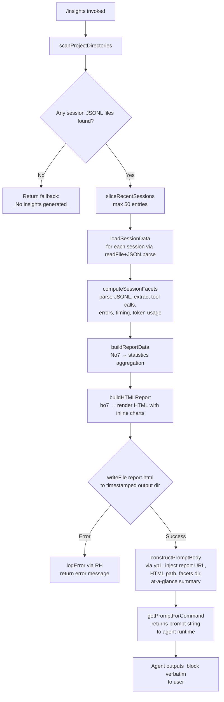

# `/insights`

> Analysis basis: CC v2.1.148 bundle.js (AST extraction + Claude interpretation)
> Minimum version: v2.1.148

---

## Overview

The `/insights` command generates a shareable HTML usage-analysis report from accumulated Claude Code session data. It reads session JSONL logs and associated facet files from the local data store, computes aggregated statistics, writes a `report.html` file to a timestamped output directory, and then instructs the agent to relay the report location and a contextual summary to the user verbatim.

---

## Registration

| Field | Value |
|---|---|
| type | `prompt` |
| name | `insights` |
| description | `Generate a report analyzing your Claude Code sessions` |
| loc_byte | `12592548` |
| loc_byte_end | `12593852` |
| loc_line | `11619` |
| handler_method | `getPromptForCommand` |
| handler_method_start | `12592722` |
| handler_method_end | `12593851` |
| prompt_body.length | `513` |
| prompt_body.trace | `call→yp1(...) (1 literals)` |
| arbor_handler.name | `getPromptForCommand` |
| arbor_handler.kind | `Method` |
| arbor_handler.resolution_path | `direct` |
| arbor_handler.fqn | `claude-2.1.148::getPromptForCommand` |
| arbor_handler.n_hits | `1` |

Analysis basis: CC v2.1.148 bundle.js:+12592548

---

## Input Branching

The handler has 4+ distinct paths depending on available session data, report generation success/failure, and whether prior insights exist. A Mermaid flowchart is used.



Analysis basis: CC v2.1.148 bundle.js:+12592722

---

## Behavioral Spec

### 1. Handler Entry (`getPromptForCommand`)

The inline `getPromptForCommand` ObjectMethod (handler_method) at byte range `12592722–12593851` is the primary entry point. It calls the data-collection function (`kp1` → described as `collectInsightsData`) and, upon success, delegates prompt construction to `yp1` (`buildPromptString`).

```
method getPromptForCommand(commandContext):
    roundedStat = Math.round(...)           // intermediate numeric formatting
    insightsPayload = collectInsightsData() // calls kp1
    promptText = buildPromptString(         // calls yp1
        insightsPayload,
        reportPath,
        facetsDir,
        atAGlanceSummary
    )
    serialized = serializeToJSON(promptText) // calls CH → JSON.stringify
    reportDirPath = resolveReportDir()       // calls wT8 → path resolution
    return promptText
```

Analysis basis: CC v2.1.148 bundle.js:+12592728

---

### 2. Project Directory Scan (`scanProjectDirectories` / `uo7`)

Reads the top-level projects directory (literal `"projects"` at bundle.js:+6497058) to discover active project subdirectories. Filters entries using `isDirectory`. Iterates using `setImmediate` batching (batch sizes 10 and 9, literals at bundle.js:+12579468 and +12579473) to avoid blocking the event loop. Results are sorted before further processing.

```
function scanProjectDirectories(baseDir):
    entries = fs.readdir(baseDir)
    dirs = entries.filter(entry => entry.isDirectory())
    for each dir in dirs:
        path = path.join(baseDir, dir)
        sessionFiles = scanSessionFiles(path)  // calls FeH
        results.push(sessionFiles)
        yield via setImmediate every 10/9 items
    return results.sort()
```

Analysis basis: CC v2.1.148 bundle.js:+12579199, +12579218, +12579498

---

### 3. Session File Scan (`scanSessionFiles` / `FeH`)

Within each project directory, enumerates files and filters for `.jsonl` extension (literal `".jsonl"` at bundle.js:+12662005). Checks each entry with `isFile`. Collects matching file paths, retrieves file stats, and associates size metadata with each entry.

```
function scanSessionFiles(projectDir):
    entries = fs.readdir(projectDir)
    jsonlFiles = entries.filter(e => e.isFile() && matchesExtension(e, ".jsonl"))
    for each file in jsonlFiles:
        stat = fs.stat(path.join(projectDir, file.basename))
        fileRecord.set(stat metadata)
        results.push(fileRecord)
    return Promise.all(statPromises)
```

Analysis basis: CC v2.1.148 bundle.js:+12661899, +12662005, +12662208

---

### 4. Session Data Collection (`collectInsightsData` / `kp1`)

Core orchestration function. Slices the discovered session list to a maximum of **50** entries (literal at bundle.js:+12579610) with a secondary limit of **200** (bundle.js:+12579615). Loads each session file in parallel via `Promise.all`. Parses stored JSON through `loadSessionJSON` (`Zo7`). Processes facets for each session. Accumulates results into multiple maps tracking: tool usage, timing, token counts, error categories, and commit metadata.

```
function collectInsightsData():
    allSessions = scanProjectDirectories(baseDir)
    sessions = allSessions.slice(0, 50)        // max 50 recent sessions
    loadedData = await Promise.all(
        sessions.map(s => loadSessionJSON(s))  // calls Zo7
    )
    for each sessionData in loadedData:
        facets = computeSessionFacets(sessionData)  // calls jT8
        buildStats(facets)                          // calls No7
    htmlContent = buildHTMLReport(stats)            // calls bo7
    reportPath = path.join(outputDir, "report.html") // literal at +12581848
    await fs.mkdir(outputDir, { recursive: true })
    await fs.writeFile(reportPath, htmlContent)
    return { reportPath, facetsDir, atAGlanceSummary }
```

Session count limit (50): bundle.js:+12579610
Secondary limit (200): bundle.js:+12579615
Report filename (`"report.html"`): bundle.js:+12581848

---

### 5. Session JSON Loading (`loadSessionJSON` / `Zo7`)

Resolves the session metadata path using `ti_` (resolves `session-meta` subdirectory, literal at bundle.js:+12519082) and the usage-data path using `pZ6` (resolves `usage-data` subdirectory, literal at bundle.js:+12518986). Reads the file with `fs.readFile` using `"utf-8"` encoding (literal at bundle.js:+12525117), then parses via `JSON.parse`.

```
function loadSessionJSON(sessionRef):
    metaPath = resolveSessionMeta(sessionRef)    // calls ti_
    usagePath = resolveUsageData(sessionRef)     // calls pZ6
    raw = await fs.readFile(metaPath, "utf-8")
    return parseJSON(raw)                        // calls B6 → JSON.parse
```

Analysis basis: CC v2.1.148 bundle.js:+12525050, +12525093, +12525134

---

### 6. Output Directory Resolution (`resolveOutputDir` / `wT8` and `pZ6`)

Computes the output directory path by joining the base insights directory (literal `"insights"` at bundle.js:+12526383) with the `"facets"` subdirectory (literal at bundle.js:+12519036). The report is written to a timestamped path constructed from `Date` components: full year, month (0-based), day, hours, minutes, seconds (bundle.js:+12581649 through +12581798).

```
function resolveOutputDir(baseDir, timestamp):
    insightsDir = path.join(baseDir, "insights")
    year   = timestamp.getFullYear()
    month  = timestamp.getMonth()
    day    = timestamp.getDate()
    hours  = timestamp.getHours()
    mins   = timestamp.getMinutes()
    secs   = timestamp.getSeconds()
    return path.join(insightsDir, formatTimestamp(year, month, day, hours, mins, secs))
```

Analysis basis: CC v2.1.148 bundle.js:+12519036, +12581649, +12581798

---

### 7. Facet Computation (`computeSessionFacets` / `jT8`)

Parses conversation records to extract structured facets. Checks a session-tracking map (`W.has`) to avoid duplicate processing. Calls `buildTranscriptChain` (`d4H`) to order messages, then `extractMessageFacets` (`Er_`) and `validateFacets` (`Vr_`). Aggregates data across multiple maps (keyed `q`, `K`, `L`, `M`, `f`, `$`, `O`, `w`, `j`, `J`, `z`, `Y`, `D`, `G`).

```
function computeSessionFacets(sessionRecords):
    if sessionId in processedSet: return cached
    chain = buildTranscriptChain(sessionRecords)    // calls d4H
    for each message in chain:
        facets = extractMessageFacets(message)      // calls Er_
        validate = validateFacets(facets)           // calls Vr_
        accumulate into topic/tool/timing maps
    return aggregatedFacets
```

Analysis basis: CC v2.1.148 bundle.js:+12662649, +12662734, +12662798

---

### 8. Statistics Aggregation (`buildStats` / `No7`)

Iterates over collected facet data using `Object.entries`. Sorts sessions by timestamp. Computes median and percentile response times using `Math.floor` and `Math.round`. Calculates per-tool usage counts. Uses `Ip1` for numeric distribution bucketing and `Uq` for string-range slicing. Produces an `at_a_glance` summary object (literal `"at_a_glance"` at bundle.js:+12532788).

Time buckets used (response time distribution, literals at bundle.js:+12535761 through +12535821):
- `"2-10s"`, `"10-30s"`, `"30s-1m"`, `"1-2m"`, `"2-5m"`, `"5-15m"`, `">15m"`

Time-of-day buckets (literals at bundle.js:+12536609 through +12536762):
- `"Morning (6-12)"`, `"Afternoon (12-18)"`, `"Evening (18-24)"`, `"Night (0-6)"`

```
function buildStats(allFacets):
    for each [sessionId, facets] in Object.entries(allFacets):
        aggregate toolUsage, errorCounts, tokenTotals
        bucket responseTime into predefined intervals
        bucket sessionHour into time-of-day bands
    compute median via sorted array midpoint (Math.floor)
    build atAGlance summary keyed "at_a_glance"
    return statsObject
```

Analysis basis: CC v2.1.148 bundle.js:+12528379, +12530381, +12532788

---

### 9. HTML Report Generation (`buildHTMLReport` / `bo7`)

Produces a self-contained HTML file with inline charts and statistics tables. Applies HTML entity escaping via `o7` (converts `&`, `<`, `>`, `"`, `'` to their entity equivalents — literals at bundle.js:+4662210 through +4662333). Wraps bold text with `<strong>$1</strong>` (literal at bundle.js:+12537467). Renders bullet items prefixed with `"• "` (bundle.js:+12537510) and line breaks as `<br>` (bundle.js:+12537540).

Chart colors used (literals at bundle.js:+12573426 through +12573879):
- Primary: `#2563eb`, `#0891b2`, `#10b981`, `#8b5cf6`
- Error highlight: `#dc2626` (bundle.js:+12577142)
- Success: `#16a34a` (bundle.js:+12577391)
- Warning: `#eab308` (bundle.js:+12577884)

Empty-state placeholders:
- No data: `<p class="empty">No data</p>` (bundle.js:+12535252)
- No response time data: `<p class="empty">No response time data</p>` (bundle.js:+12535709)
- No time data: `<p class="empty">No time data</p>` (bundle.js:+12536559)
- No tool errors: `<p class="empty">No tool errors</p>` (bundle.js:+12577153)

Max HTML content size: **8192** characters for certain inline sections (literal at bundle.js:+12534930); facet token budget: **4096** (bundle.js:+12526492).

```
function buildHTMLReport(stats):
    escaped = htmlEscape(stats)              // calls o7 for entity encoding
    sections = [
        renderToolUsageSection(stats),       // calls N7H
        renderTimeDistSection(stats),        // calls So7
        renderResponseTimeSection(stats),    // calls Ro7
        renderErrorSection(stats)
    ]
    for each section:
        if empty: insert empty-state placeholder
    return assembleHTML(sections)
```

Analysis basis: CC v2.1.148 bundle.js:+12537395, +12573404, +12574096, +12576929

---

### 10. Prompt Body Construction (`buildPromptString` / `yp1`)

Assembles the 513-character prompt that is returned to the agent runtime. The prompt body (bundle.js:+12593754) injects:
1. Full insights data payload
2. Report URL
3. HTML file path
4. Facets directory path
5. At-a-glance summary (marked as context-only, not yet visible to the user)

The prompt instructs the agent to output the content between `<message>` tags verbatim as its entire response, ending with an invitation to explore specific sections. Separator literal `" · "` (bundle.js:+12593180) is used in the report URL formatting. Fallback literal `"_No insights generated_"` (bundle.js:+12593619) is used when no data is available.

```
function buildPromptString(insightsData, reportURL, htmlPath, facetsDir, atAGlance):
    if insightsData is empty:
        return "_No insights generated_"
    body = templateString(
        insightsData,
        reportURL,         // formatted with " · " separator
        htmlPath,
        facetsDir,
        atAGlance
    )
    return body            // 513 chars, instructs verbatim <message> output
```

Analysis basis: CC v2.1.148 bundle.js:+12593754, +12593619, +12593180

---

### 11. Per-Session Parallel Report Writing (`writePerSessionFacets` / `Vo7` and `Eo7`)

After the main report is written, per-session facet JSON files are also persisted. `Vo7` writes the session-level metadata (calls `fs.mkdir`, `fs.writeFile`, serializes via `CH`/`JSON.stringify`, with a 384-byte size hint at bundle.js:+12525323). `Eo7` writes the per-session usage data in a similar pattern. Errors are logged via `RH` (log-error utility).

```
function writePerSessionFacets(sessionId, facets, outputBase):
    dir = path.join(outputBase, sessionId)
    await fs.mkdir(dir, { recursive: true })
    metaPath = path.join(dir, resolveSessionMeta())
    await fs.writeFile(metaPath, JSON.stringify(facets.meta))
    usagePath = path.join(dir, resolveUsageData())
    await fs.writeFile(usagePath, JSON.stringify(facets.usage))
```

Analysis basis: CC v2.1.148 bundle.js:+12525191, +12524877, +12525338

---

## State & Side Effects

| Item | Detail |
|---|---|
| Files written | `report.html` in a timestamped insights subdirectory (bundle.js:+12581848) |
| Directories created | Timestamped output dir and per-session facet subdirs via `fs.mkdir` (bundle.js:+12581589, +12525191) |
| Files read | Session `.jsonl` files and `session-meta` / `usage-data` JSON from the projects store (bundle.js:+12662005, +12519082, +12518986) |
| Telemetry | No `tengu_*` events are fired directly in the insights-specific code path; telemetry events in the call graph (listed below) are from shared infrastructure reached transitively |
| Transitive telemetry reached | `tengu_transcript_phantom_parent`, `tengu_transcript_parent_cycle`, `tengu_chain_parent_cycle`, `tengu_chain_timestamp_fallback`, `tengu_chain_parallel_tr_recovered`, `tengu_relink_walk_broken` (transcript-chain infrastructure) |
| Hook registration | None specific to `/insights` |
| appState changes | None observed in the direct handler path |
| Sound | None |
| MCP side effects | None |
| Error handling | File-write failures logged via `RH` (log-error wrapper, bundle.js:+12651031); falls back to `"_No insights generated_"` output |

---

## Version History

| Version | Change |
|---|---|
| v2.1.148 | Initial analysis |

---

## Common Mistakes

1. **Running `/insights` in a project with no `.jsonl` session files** — the command will return the `"_No insights generated_"` fallback message rather than a report, since there is no data to aggregate (bundle.js:+12593619).
2. **Expecting real-time or live data** — the report is generated from persisted `.jsonl` logs, not from the current in-memory session state; the current session may not yet be fully reflected.
3. **Assuming the agent will paraphrase the output** — the prompt explicitly instructs the agent to output the `<message>` block verbatim; any follow-up editing of the message would require a separate exchange.
4. **Confusing the HTML file path with a hosted URL** — the report is written to a local file path; sharing requires the user to manually distribute or serve the file.
5. **Expecting more than 50 sessions to be analysed** — the `collectInsightsData` function hard-caps input at 50 recent sessions (bundle.js:+12579610); older sessions beyond this limit are silently excluded.

---

## Appendix — Identifier Mapping

> For bundle debugging only. Identifiers change across versions.

| Identifier | Role |
|---|---|
| `__handler_insights` | Synthetic BFS entry node for the `/insights` command handler |
| `kp1` | `collectInsightsData` — main data-collection and report-writing orchestrator |
| `uo7` | `scanProjectDirectories` — reads and filters project directories |
| `QQ` | `resolveProjectsPath` — joins base path with `"projects"` literal |
| `FeH` | `scanSessionFiles` — enumerates `.jsonl` files within a project dir |
| `Ar` | `matchesJsonlExtension` — regex test for `.jsonl` file filter |
| `Zo7` | `loadSessionJSON` — reads and parses a session JSON file |
| `ti_` | `resolveSessionMetaPath` — resolves `session-meta` subdirectory path |
| `pZ6` | `resolveUsageDataPath` — resolves `usage-data` subdirectory path |
| `B6` | `parseJSONSafe` — wraps `JSON.parse` |
| `jT8` | `computeSessionFacets` — extracts facet data from conversation records |
| `g6H` | `aggregateFacetMaps` — populates the many per-facet data maps |
| `d4H` | `buildTranscriptChain` — orders transcript messages by parent reference |
| `Ya7` | `validateChainEntry` — checks chain entry validity |
| `Da7` | `buildChainIndex` — indexes transcript entries for chain traversal |
| `Oa7` | `sortChainQueue` — queues and sorts chain entries |
| `GU1` | `getChainValues` — retrieves values from chain index map |
| `Er_` | `extractMessageFacets` — extracts structured facets from a message |
| `WE6` | `parseMessageContent` — parses message content blocks |
| `Vr_` | `validateFacets` — validates extracted facet arrays |
| `wa7` | `checkFacetArray` — checks array facet entries |
| `ja7` | `checkFacetSome` — checks `Array.some` over facet conditions |
| `UrH` | `mapTranscriptEntries` — maps over transcript entries |
| `NT8` | `getChainNode` — retrieves a node from the chain map |
| `IT8` | `getChainValues` — returns array of chain map values |
| `No7` | `buildStats` — aggregates statistics from facet data |
| `BeH` | `buildStatsEntries` — enumerates facet entries for aggregation |
| `Uq` | `sliceStringRange` — string index/slice helper |
| `Ip1` | `bucketNumericValues` — distributes numeric values into buckets |
| `ko7` | `buildReportData` — assembles final report data object |
| `Vp1` | `buildPerSessionReport` — builds per-session sub-report |
| `Oo7` | `resolveInsightsBase` — resolves base path for insights output |
| `bo7` | `buildHTMLReport` — renders the full HTML report string |
| `Co7` | `serializeHTMLSection` — serializes a report section via `CH` |
| `N7H` | `renderToolUsageSection` — renders tool usage chart section |
| `So7` | `renderTimeDistSection` — renders time-of-day distribution section |
| `Ro7` | `renderResponseTimeSection` — renders response-time distribution section |
| `DT8` | `renderChartItem` — renders individual chart bar/item |
| `Y5` | `htmlEscapeString` — escapes HTML special characters |
| `o7` | `htmlEntityReplace` — replaces `&`, `<`, `>`, `"`, `'` with entities |
| `Hr_` | `formatSessionSummary` — formats per-session summary text |
| `Np1` | `parseSessionRecord` — parses a single session record |
| `wo7` | `getFileExtension` — retrieves file extension via `path.extname` |
| `IYH` | `computeDiff` — computes diff (calls `G7q.diff`) |
| `fL` | `findIndexHelper` — array index lookup helper |
| `hf` | `formatDuration` — formats a duration in seconds |
| `jo7` | `isNaNCheck` — wraps `Number.isNaN` |
| `Vo7` | `writeSessionMeta` — writes per-session metadata JSON file |
| `Eo7` | `writeSessionUsage` — writes per-session usage-data JSON file |
| `To7` | `readAndDeleteTempFile` — reads a temp report file then unlinks it |
| `wT8` | `resolveInsightsOutputDir` — joins base with `"insights"` and timestamp |
| `hp1` | `handleReadError` — handles file-read error cases |
| `vo7` | `orchestrateReportPipeline` — outer pipeline: build, write, return paths |
| `Go7` | `buildReportSections` — builds all HTML sections in parallel |
| `Po7` | `buildSectionContent` — builds content for a single report section |
| `DjH` | `buildSessionBlock` — builds a per-session HTML block |
| `TK` | `getSessionTitle` — retrieves title for a session |
| `Fj8` | `buildFacetHTML` — writes facet data to HTML file |
| `G8` | `generateSessionUUID` — generates a UUID for a session block |
| `FyH` | `extractAssistantMessage` — extracts the assistant message from a block |
| `vp1` | `resolveInsightsVersion` — resolves insights version via `kv` |
| `kv` | `getVersionInfo` — retrieves version information |
| `LK` | `filterHTMLSections` — filters HTML sections by predicate |
| `n_` | `wrapError` — wraps an error with String conversion |
| `mo7` | `getStatsKeys` — retrieves keys from stats object |
| `yp1` | `buildPromptString` — constructs the final 513-char prompt body |
| `CH` | `serializeJSON` — wraps `JSON.stringify` |
| `RH` | `logError` — error logging utility (wraps `Gl.logError`) |
| `UH` | `stringifyValue` — wraps `String()` constructor |
| `ZH` | `coerceToString` — coerces a value to string via `String` |
| `N` | `normalizeString` — string normalization (trim, uppercase, includes checks) |
| `EkH` | `initMCPConnection` — initialises an MCP server connection |
| `k7K` | `applyMCPUpdate` — applies an MCP server state update |
| `_D5` | `syncMCPClients` — synchronises active MCP clients |
| `laH` | `cleanupMCPClient` — cleans up a single MCP client |
| `sN` | `shutdownMCPServer` — shuts down an MCP server |
| `B` | `getMCPClientState` — retrieves MCP client + state objects |
| `f` | `manageMCPClientSet` — manages the set of active MCP clients |
| `ei_` | `getInsightsConfig` — retrieves insights-related config value |
| `mZ6` | `resolveModelPath` — resolves model/tool path |
| `$G` | `finalizeSessionBlock` — finalises a session HTML block |
| `pX` | `reindexEntries` — re-indexes chain entries after mutation |

---

*Note: index built via Arbor fallback; some signals (telemetry, literals) may be missing — see arbor-fallback.js.*