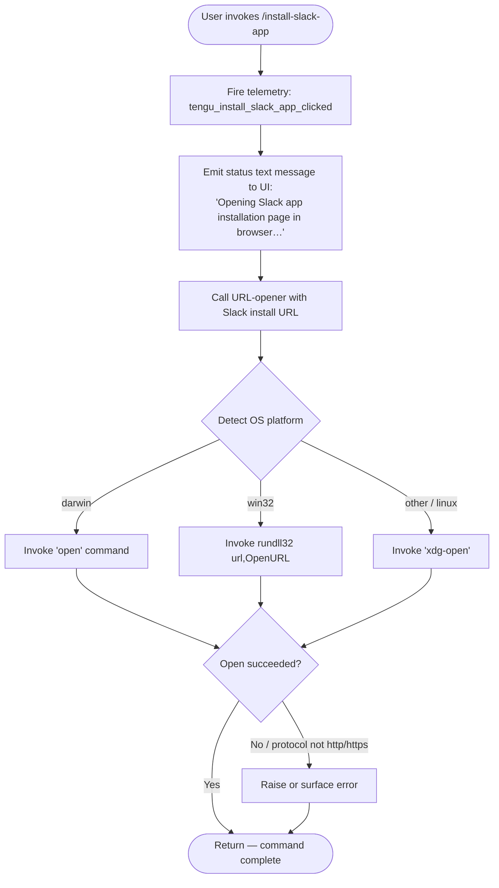

# `/install-slack-app`

> Analysis basis: CC v2.1.148 bundle.js (AST extraction + Claude interpretation)
> Minimum version: v2.1.148

---

## Overview

The `/install-slack-app` command opens the Claude Slack app installation page in the system's default browser. It is a lightweight, non-interactive command that fires a telemetry event, displays a status message to the user, and delegates to the platform-aware URL-opening subsystem. No arguments are accepted and no persistent state beyond telemetry is written.

---

## Registration

| Field | Value |
|---|---|
| type | `local` |
| name | `install-slack-app` |
| description | `Install the Claude Slack app` |
| supportsNonInteractive | `false` |
| module_id | `hP1` |
| load_inline | `true` |
| loc_byte | `11155224` |
| loc_byte_end | `11155410` |
| loc_line | `9204` |
| arbor_handler.name | `lk7` |
| arbor_handler.fqn | `claude-2.1.148::lk7` |
| arbor_handler.kind | `AsyncFunction` |
| arbor_handler.resolution_path | `module_id` |
| arbor_handler.n_hits | `0` |

Analysis basis: CC v2.1.148 bundle.js:+11155224

---

## Input Branching

The command's branching logic has three or more distinct paths (URL-open success, platform-specific open strategy selection, and error/fallback), so a Mermaid flowchart is used.



Analysis basis: CC v2.1.148 bundle.js:+11154828 – +11154976, +6463072 – +6463325

---

## Behavioral Spec

### 1. Entry Point — Async Handler (`lk7`)

The Arbor-resolved handler for this command is the async function `lk7` (module `hP1`). It is registered via the inline `load:()=>Promise.resolve({call: lk7})` shape.

```
async function installSlackAppHandler(context):

    // Step 1 — Telemetry
    recordTelemetry("tengu_install_slack_app_clicked")
    // Analysis basis: CC v2.1.148 bundle.js:+11154830

    // Step 2 — Config/context read
    configSnapshot = readCurrentConfig(context)           // calls configReader (c)
    globalSettings = loadGlobalSettings(context)          // calls globalSettingsLoader (M8)

    // Step 3 — Emit UI status message
    emitTextMessage("Opening Slack app installation page in browser…")
    // Analysis basis: CC v2.1.148 bundle.js:+11154976

    // Step 4 — Open URL in browser
    openUrlInBrowser(slackInstallUrl)                     // calls urlOpener (MK)

    return
```

Analysis basis: CC v2.1.148 bundle.js:+11154828 – +11154943

---

### 2. URL-Opener Subsystem (`MK`)

`MK` is the platform-aware URL opener called from the handler. It validates the URL's protocol before dispatching to the correct OS-level open command.

```
function openUrlInBrowser(url):

    // Step 1 — Protocol guard (IIL)
    if url does NOT start with "http:" AND does NOT start with "https:":
        raise Error("Only http/https URLs are permitted")
        // Analysis basis: CC v2.1.148 bundle.js:+6462785, +6462835, +6462857

    // Step 2 — Ensure platform token (WJ)
    platformToken = resolvePlatformToken()

    // Step 3 — Dispatch by platform (T8)
    platform = process.platform
    if platform == "darwin":
        spawn("open", [url])
        // Analysis basis: CC v2.1.148 bundle.js:+6463318
    else if platform == "win32":
        spawn("rundll32", ["url,OpenURL", url])
        // Analysis basis: CC v2.1.148 bundle.js:+6463244, +6463256
    else:
        spawn("xdg-open", [url])
        // Analysis basis: CC v2.1.148 bundle.js:+6463325

    await spawnProcess(b6, T_)   // background-spawn helpers
```

Analysis basis: CC v2.1.148 bundle.js:+6463072 – +6463325

---

### 3. Global Settings Loader (`M8`)

`M8` is called early in the handler to obtain the current global configuration. It orchestrates file-system lock acquisition, config read, backup management, and stale-write safety.

```
function loadGlobalSettings(context):

    settings = readGlobalConfigFile()      // MG helper
    randomValue = getRandomJitter()        // H helper (Math.random, setTimeout with jitter 2)
    structuredEntries = buildEntries()     // sUH
    perEntryTimestamp = timestampEntries() // yy9 (Object.entries)
    lockTimestamp = acquireLockTimestamp() // tUH (Date.now)
    apiResult = callApi(context)           // N helper

    configData = readConfigWithLock()      // k$H — see §4

    authSafetyCheck(configData)            // Wf6 — refuse to write if auth would be lost
    // "saveGlobalConfig fallback: re-read config is missing auth…"
    // Analysis basis: CC v2.1.148 bundle.js:+3182068

    return configData
```

Analysis basis: CC v2.1.148 bundle.js:+11154868, +3181861 – +3182308

---

### 4. Config Read With Lock (`_L_` / `k$H`)

`_L_` implements the low-level locked config read. It acquires a filesystem lock, detects contention, reads the config file, manages backups, and writes the updated config atomically via `sq6`.

```
function readConfigWithLock(configPath):

    // Step 1 — Ensure parent directory
    parentDir = path.dirname(configPath)      // UY.dirname
    mkdirIfMissing(parentDir)                  // L.mkdirSync
    // Analysis basis: CC v2.1.148 bundle.js:+3184559, +3184565, +3184586

    // Step 2 — Acquire file lock with timeout
    lockStart = Date.now()
    // Analysis basis: CC v2.1.148 bundle.js:+3184631
    while lock not acquired:
        if (Date.now() - lockStart) > lockTimeout (60000 ms):
            // Analysis basis: CC v2.1.148 bundle.js:+3185540
            emitTelemetry("tengu_config_lock_contention")
            // Analysis basis: CC v2.1.148 bundle.js:+3184859
            log("error", "Lock acquisition took longer than expected…")
            // Analysis basis: CC v2.1.148 bundle.js:+3184770
            break

    // Step 3 — Read config file (k$H)
    if not fileExists(configPath):
        handle ENOENT gracefully
        // Analysis basis: CC v2.1.148 bundle.js:+3185125

    rawBytes = fs.readFileSync(configPath, "utf-8")
    // Analysis basis: CC v2.1.148 bundle.js:+3186886

    parsed = JSON.parse(rawBytes)     // B6 → JSON.parse
    // Analysis basis: CC v2.1.148 bundle.js:+182634

    // Step 4 — Stale-write guard
    if re-read config is missing auth token that in-memory cache has:
        emitTelemetry("tengu_config_stale_write")
        // Analysis basis: CC v2.1.148 bundle.js:+3184995
        emit("tengu_config_auth_loss_prevented")
        // Analysis basis: CC v2.1.148 bundle.js:+3185338
        log warning: "saveConfigWithLock: re-read config is missing auth…"
        // Analysis basis: CC v2.1.148 bundle.js:+3185186
        abort write

    // Step 5 — Backup management (hy9 / AL_)
    backupDir = path.join(configDir, "backups")
    // Analysis basis: CC v2.1.148 bundle.js:+3186371
    keepMostRecentN = 5
    // Analysis basis: CC v2.1.148 bundle.js:+3185789

    // Step 6 — Atomic write via sq6
    atomicWriteFile(configPath, newContent, permissions=384 /*0o600*/)
    // Analysis basis: CC v2.1.148 bundle.js:+3186071

    return parsed
```

Analysis basis: CC v2.1.148 bundle.js:+3181861 – +3186109

---

### 5. Atomic File Write (`sq6`)

Used by the config subsystem for safe, fsync-backed file replacement.

```
function atomicWriteFile(targetPath, content, permissions):

    tmpPath = targetPath + "." + randomBytes(6).toString("hex") + ".tmp"
    // Analysis basis: CC v2.1.148 bundle.js:+1006785, +1006813

    fd = fs.openSync(tmpPath, flags)
    fs.writeFileSync(fd, content)
    fs.fchmodSync(fd, permissions)
    // Analysis basis: CC v2.1.148 bundle.js:+1007279

    log("Applied original permissions to temp file")
    // Analysis basis: CC v2.1.148 bundle.js:+1007300

    fs.fsyncSync(fd)
    // Analysis basis: CC v2.1.148 bundle.js:+1007345

    fs.closeSync(fd)
    fs.renameSync(tmpPath, targetPath)
    // Analysis basis: CC v2.1.148 bundle.js:+1007473

    if error: fs.unlinkSync(tmpPath)
    // Analysis basis: CC v2.1.148 bundle.js:+1007630
```

Analysis basis: CC v2.1.148 bundle.js:+1006069 – +1007630

---

### 6. Background Spawn Helper (`T_` / `b6`)

`T8` invokes `T_` and `b6` as a spawn pipeline for the OS-level open command. This is the same background-process subsystem used elsewhere in CC.

```
async function backgroundSpawn(command, args):

    // Concurrency limit: max 10 simultaneous spawns
    // Analysis basis: CC v2.1.148 bundle.js:+1044118

    // Memory cap: 1,000,000 bytes stdout buffer
    // Analysis basis: CC v2.1.148 bundle.js:+1044640

    processHandle = spawnProcess(command, args)       // i2H
    result = await processHandle                       // T_

    if error:
        buildErrorString(result)                       // JFK → String
        notify(Az, N)                                  // error reporters

    return result
```

Analysis basis: CC v2.1.148 bundle.js:+1044173 – +1045082

---

## State & Side Effects

| Item | Detail |
|---|---|
| Telemetry — command | `tengu_install_slack_app_clicked` fired on every invocation (bundle.js:+11154830) |
| Telemetry — config lock contention | `tengu_config_lock_contention` when lock takes > 60 000 ms (bundle.js:+3184859) |
| Telemetry — stale write | `tengu_config_stale_write` when cached auth would be overwritten (bundle.js:+3184995) |
| Telemetry — auth loss prevented | `tengu_config_auth_loss_prevented` on auth-safe abort (bundle.js:+3185338) |
| Telemetry — config parse error | `tengu_config_parse_error` on JSON parse failure (bundle.js:+3187440) |
| Telemetry — bg SIGKILL escalate | `tengu_bg_dispatch_sigkill_escalate` (background-process subsystem, bundle.js:+15117585) |
| Telemetry — bg low memory | `tengu_bg_dispatch_low_mem` (bundle.js:+15118164) |
| Telemetry — bg spare enable | `tengu_bg_spare_enable` (bundle.js:+15118859) |
| Telemetry — bg spare claim | `tengu_bg_spare_claim` (bundle.js:+15118980) |
| Telemetry — bg spare claim fail | `tengu_bg_spare_claim_fail` (bundle.js:+15119243) |
| Telemetry — bg spare spawn | `tengu_bg_spare_spawn` (bundle.js:+15117278) |
| UI output | One `text`-type message: `"Opening Slack app installation page in browser…"` (bundle.js:+11154963, +11154976) |
| File system | Config file read with advisory lock; backup directory `backups/` managed; atomic write via temp-rename if any config mutation occurs |
| Hook registration | None identified at depth ≤ 2 |
| appState changes | None identified at depth ≤ 2 |
| Sound | None identified at depth ≤ 2 |
| Non-interactive support | `false` — command must not be invoked in non-interactive (headless) mode |

---

## Version History

| Version | Change |
|---|---|
| v2.1.148 | Initial analysis |

---

## Common Mistakes

1. **Running in non-interactive mode**: `supportsNonInteractive` is `false`. Calling `/install-slack-app` from a script or piped session will fail or be rejected by the command dispatcher.
2. **Expecting a return value or output beyond the status line**: The command only emits a single informational text message. No URL or confirmation is returned to the calling context.
3. **Running on a headless server without a display**: The platform-detection logic calls `open` / `xdg-open` / `rundll32` — all of which require a graphical session or `$DISPLAY`. On a headless server the OS call will fail silently or with a system error.
4. **Assuming the Slack URL is configurable**: No argument is accepted; the target URL is embedded in the bundle and not user-overridable.
5. **Confusing auth-loss prevention with a write failure**: The `tengu_config_auth_loss_prevented` + `tengu_config_stale_write` telemetry pair indicates a safety guard, not a crash — the command still completes normally, it simply refuses to overwrite auth credentials.

---

## Appendix — Identifier Mapping

> For bundle debugging only. Identifiers change across versions.

| Identifier | Role |
|---|---|
| `lk7` | Main async handler for `/install-slack-app` (Arbor-resolved, FQN `claude-2.1.148::lk7`) |
| `c` | Context / config accessor helper |
| `M8` | Global settings loader (orchestrates config read + lock) |
| `_L_` | Low-level locked config read implementation |
| `_` | Filesystem abstraction (readdir, statSync, etc.) |
| `F6` | File existence / access check helper |
| `L` | Primary filesystem module wrapper (mkdirSync, statSync, copyFileSync, etc.) |
| `q` | Secondary filesystem module wrapper (readFileSync, statSync, mkdirSync, etc.) |
| `M` | Promise / stream finalizer (close handlers) |
| `n99` | Config object builder / merger |
| `et8` | Config entry constructor |
| `N` | API call dispatcher |
| `vJK` | HTTP/network request helper |
| `H` | Retry/jitter helper (Math.random, setTimeout) |
| `CH` | JSON serializer helper (JSON.stringify) |
| `f4` | String formatting / path trimmer |
| `lRH` | Log record helper |
| `kJK` | HTTP request body builder / byte-length calculator |
| `q8` | Error classification helper |
| `k$H` | Config file reader with parse and backup logic |
| `B6` | JSON parser wrapper |
| `OC` | String prefix stripper |
| `hy9` | Backup directory scanner and pruner |
| `RH` | Error reporter / logger |
| `AL_` | Backup path builder (path.join + subdirectory helper) |
| `w` | Background process manager / dispatcher |
| `Wf6` | Auth-loss safety guard for config writes |
| `A` | Case-normaliser helper (toLowerCase) |
| `Z` | Path or string prefix checker (startsWith) |
| `X` | MCP / SDK connection manager |
| `YN8` | SDK transport factory |
| `n_` | Error constructor wrapper |
| `V` | Array/buffer slice utility |
| `sq6` | Atomic file write utility (temp-rename + fsync) |
| `O` | fs.Stats symbolic-link checker |
| `J8` | Error code helper |
| `sUH` | Settings entry structure builder |
| `yy9` | Object.entries iterator for config entries |
| `tUH` | Lock timestamp recorder (Date.now) |
| `HL_` | Symlink-aware config path resolver |
| `MK` | Platform-aware URL opener (main browser-open function) |
| `IIL` | URL protocol validator (http/https guard) |
| `WJ` | Platform token resolver |
| `T8` | Spawn coordinator (wraps T_ and b6) |
| `T_` | Async spawn executor with error surface |
| `i2H` | Low-level child-process spawner |
| `D` | Background session / daemon manager |
| `JFK` | Error-string builder (String coercion) |
| `Az` | Error notification emitter |
| `b6` | Spawn concurrency context reader |
| `sb6` | AsyncLocalStorage store accessor for spawn context |
| `w_` | Outer concurrency-pool wrapper |

---

Note: index built via Arbor fallback; some signals (telemetry, literals) may be missing — see arbor-fallback.js.