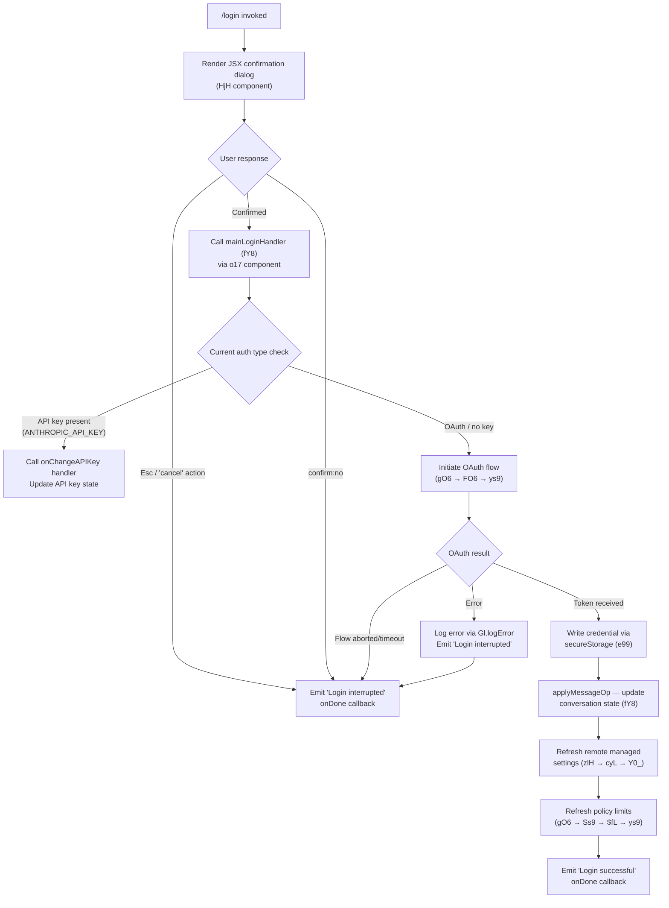

# `/login`

> Analysis basis: CC v2.1.147 bundle.js (AST extraction + Claude interpretation)
> Minimum version: v2.1.147

---

## Overview

The `/login` command initiates an interactive OAuth-based authentication flow that allows users to sign in with or switch between Anthropic accounts. It renders a local JSX UI component that guides the user through account authentication, updating the application's API key state upon successful completion. The command also tears down and re-initializes policy-limits and remote-managed-settings subsystems as part of the account-change sequence.

---

## Registration

| Field | Value |
|---|---|
| type | `local-jsx` |
| name | `login` |
| description | `"Switch Anthropic accounts \| Sign in with your Anthropic account"` |
| module_id | `Hrq` |
| load_inline | `true` |
| loc_byte | `11103557` |
| loc_byte_end | `11103790` |
| loc_line | `9060` |
| arbor_handler.name | `RJ1` |
| arbor_handler.fqn | `claude-2.1.147::RJ1` |
| arbor_handler.kind | `Function` |
| arbor_handler.resolution_path | `direct` |
| arbor_handler.n_hits | `2` |

Analysis basis: CC v2.1.147 bundle.js:+11103557

---

## Input Branching

The command drives a multi-stage interactive React UI with more than three distinct user-facing branches (Confirmation dialog, OAuth flow, success, interruption, cancellation). A Mermaid flowchart is used.



Analysis basis: CC v2.1.147 bundle.js:+8807696, +8808092, +8808105, +8808124

---

## Behavioral Spec

### 1. Command Entry — JSX Wrapper Components

The registration `type` is `local-jsx`, meaning the CLI renders a React component tree instead of running a simple prompt. Two top-level components participate:

- **ConfirmationWrapper** (`HjH`): Renders the initial confirmation dialog. It uses a `Symbol.for` key (sentinel `"react.memo_cache_sentinel"`, bundle.js:+8808299) and a memo-cache slot count of 3 (bundle.js:+8808283). It wires a context hook (`nJ` → `TEH.useContext`) and an `onDone` callback. The confirmation dialog presents the label `"Login"` (bundle.js:+8808801) and listens for `"Esc"` (bundle.js:+8808404) and `"cancel"` (bundle.js:+8808422) to abort, or a positive confirmation to proceed.

- **LoginFlowContainer** (`o17`): Rendered after confirmation. It creates a React element (bundle.js:+8808045), calls the main login handler `fY8`, and passes the current `H` (app-state reference) to it. On completion it emits either `"Login successful"` (bundle.js:+8808105) or `"Login interrupted"` (bundle.js:+8808124) via the `onDone` callback.

```
function ConfirmationWrapper(props):
    context = useContext(TEH)
    memo_slots = allocate(3)
    render ConfirmationDialog(
        title   = "Login",
        keyEsc  = "Esc",
        onCancel → emit("Login interrupted")
        onConfirm → render LoginFlowContainer
    )

function LoginFlowContainer(appState):
    element = createElement(mainLoginHandler, appState)
    on element.onDone(result):
        if result == "success":
            invoke onDone("Login successful")
        else:
            invoke onDone("Login interrupted")
```

Analysis basis: CC v2.1.147 bundle.js:+8808045, +8808092, +8808170, +8808189, +8808224, +8808288, +8808330

---

### 2. Main Login Handler — `mainLoginHandler` (`fY8`)

`fY8` is the core imperative function invoked by `LoginFlowContainer`. It orchestrates all side effects of an account switch.

```
function mainLoginHandler(appState):
    // 1. Record timestamp for this login attempt
    timestamp = LRH()   // wraps Date.now()

    // 2. Determine current authentication configuration
    authConfig = resolveAuthConfig(zlH)  // inspects env vars, config file

    // 3. If API-key-based auth:
    if authConfig.type in ["bedrock", "vertex", "anthropicAws",
                           "mantle", "foundry", "firstParty"]:
        onChangeAPIKey(appState, newKey)
        applyMessageOp(appState)       // update conversation
        goto step 6

    // 4. If OAuth-based auth — initiate browser/device flow:
    oauthResult = runOAuthFlow(gO6)

    // 5. Persist credential
    if oauthResult.token:
        writeSecureCredential(e99, oauthResult.token)
        // falls back to plaintext if secure storage unavailable
    else:
        raise "No authentication available"

    // 6. Post-auth refresh
    refreshRemoteManagedSettings(zlH)   // triggers cyL → Y0_
    refreshPolicyLimits(gO6)            // triggers FO6 → Ss9

    // 7. Update app state
    setAppState(appState, {apiKey: resolvedKey})

    // 8. Signal completion
    emit("Login successful")
```

Analysis basis: CC v2.1.147 bundle.js:+8807696, +8807715, +8807777, +8807783, +8807861, +8807957

---

### 3. Authentication Configuration Resolution (`zlH`)

`zlH` inspects environment variables and configuration to determine the active auth back-end. It recognises the following provider strings (all literals found in implementation):

| Provider string | Description |
|---|---|
| `"bedrock"` | AWS Bedrock (bundle.js:+2029601) |
| `"foundry"` | Azure Foundry (bundle.js:+2029651) |
| `"anthropicAws"` | Anthropic-on-AWS (bundle.js:+2029707) |
| `"mantle"` | Mantle managed (bundle.js:+2029761) |
| `"vertex"` | Google Vertex AI (bundle.js:+2029809) |
| `"firstParty"` | Direct Anthropic API (bundle.js:+2029818) |
| `"gateway"` | Internal gateway (bundle.js:+6670736) |
| `"local-agent"` | Local agent mode (bundle.js:+6670869) |
| `"enterprise"` | Enterprise plan (bundle.js:+6671014) |
| `"team"` | Team plan (bundle.js:+6671049) |

The primary environment variables consulted are `ANTHROPIC_API_KEY` (bundle.js:+2924835) and `CLAUDE_CODE_OAUTH_TOKEN`. If neither is set the error `"ANTHROPIC_API_KEY or CLAUDE_CODE_OAUTH_TOKEN env var is required"` is thrown (bundle.js:+2925256). The helper key-file descriptor `CLAUDE_CODE_API_KEY_FILE_DESCRIPTOR` (bundle.js:+2048516) is also checked, reading up to 20 characters (bundle.js:+2050182).

The VS Code integration path is identified by the client string `"claude-vscode"` (bundle.js:+49436); the `--bare` flag (bundle.js:+59517) suppresses interactive output in that context.

```
function resolveAuthConfig(configData):
    if env["ANTHROPIC_API_KEY"] present:
        return {type: "firstParty", key: env["ANTHROPIC_API_KEY"]}
    if env["CLAUDE_CODE_API_KEY_FILE_DESCRIPTOR"] present:
        fd  = open(env["CLAUDE_CODE_API_KEY_FILE_DESCRIPTOR"])
        key = read(fd, maxBytes=20)    // literal 20, bundle.js:+2050182
        return {type: "firstParty", key: key}
    if oauthTokenExists:
        return {type: "oauth", token: oauthToken}
    throw Error("ANTHROPIC_API_KEY or CLAUDE_CODE_OAUTH_TOKEN env var is required")
```

Analysis basis: CC v2.1.147 bundle.js:+2924835, +2924929, +2925256, +2048516, +2050182

---

### 4. OAuth Flow (`gO6` / `FO6` / `ys9`)

`gO6` manages the full OAuth lifecycle. It delegates to `FO6` (flow orchestrator) which calls `ys9` (token-fetch worker) and `Ss9` (polling supervisor).

```
function runOAuthFlow():
    // Cancel any pending timeout from a previous attempt
    clearTimeout(vY_)

    // Resolve OAuth endpoint URL
    endpoint = resolveOAuthEndpoint(ES)
    // Endpoints vary by environment:
    //   prod    → api.anthropic.com
    //   local   → http://localhost:8000 / :4000 / :3000
    //   staging → http://localhost:8205
    //   custom  → validated against approved list

    // Remove stale socket/lock file
    BO6.unlink(lockFilePath)

    // Compute lock-file path
    lockFilePath = buildLockPath(c_8)   // uses Is9.join + o8

    // Start flow orchestrator
    result = FO6(endpoint)
    return result

function flowOrchestrator(endpoint):
    // Fetch current token state
    currentState = fetchTokenState(ys9)

    // Start polling supervisor with interval/backoff
    pollHandle = Ss9(g_8, $fL)
    register(r9)    // D9A.register hook

    clearTimeout on exit

function fetchTokenState(endpoint):
    // Read existing credential file
    raw = Ns9.readFileSync(credentialFilePath)
    credPath = buildCredPath(c_8)

    // Compute content hash for change detection
    hash = AfL(raw)   // vs9.createHash("sha256") → hex digest
    
    // Determine auth headers
    if oauthTokenPresent:
        headers["anthropic-beta"] = "oauth"
        headers["x-api-key"]      = <redacted>
    else:
        headers["x-api-key"] = apiKey
        authType = "api_key"

    // Make HTTP request with retry/backoff (qfL → ie → r8)
    // ie implements exponential backoff:
    //   max delay = 32000 ms  (bundle.js:+10302279)
    //   base      = 0.25      (bundle.js:+10302342)
    //   max tries = 10        (bundle.js:+10302372)

    response = httpFetch(endpoint, headers)

    switch response.status:
        case 200: applyNewState(); emit("Remote settings: Fetched successfully")
        case 204: noContent()
        case 304: emit("Policy limits: Cache still valid (304 Not Modified)")
        case 401: emit(tengu_remote_settings_401_force_refresh_retry); refresh()
        case 404: deleteCache(); emit("Policy limits: Deleted cached file (404 response)")
        default:  useStaleCacheOrError()
```

Analysis basis: CC v2.1.147 bundle.js:+4675674, +4675680, +4675709, +4675720, +4675740, +4673844, +4673867, +4672039, +10302279, +10302342, +10302372

---

### 5. Secure Credential Storage (`e99`)

After a successful OAuth token is obtained, `e99` persists it. It attempts primary (OS secure store) first, then falls back to plaintext.

```
function writeSecureCredential(token):
    telemetry("secure_storage_credentials_write")

    try:
        result = primaryStore.write(token)
        if result == "primary_transient_skip_fallback":
            // Transient failure — do not fall back
            return
        telemetry("plaintext_fallback_used") if usedFallback
    catch:
        if bothFailed:
            telemetry("primary_and_fallback_failed")
            throw

    bH(token)   // update in-memory credential cache
    K8(token)   // notify subscribers
```

Analysis basis: CC v2.1.147 bundle.js:+2209543, +2209546, +2209644, +2209793, +2209896

---

### 6. Remote Managed Settings Refresh (`zlH` → `cyL` → `Y0_`)

After credential change, `zlH` triggers a full remote-settings refresh cycle:

```
function refreshRemoteManagedSettings():
    // Notify watchers of an auth change
    WS.notifyChange("policySettings")          // bundle.js:+6676537, +6676553

    // Emit debug message
    log("Remote settings: Refreshed after auth change")  // bundle.js:+6676442

    // Start background poller with interval/backoff (g_8 → setInterval/clearInterval)
    startPoller(i2q → g_8)

    // Inner refresh handler (cyL):
    function onPoll():
        config = fetchRemoteSettings(Or)
        applySettings(_fH)
        writeSettingsFile(Y0_ → QyL)
        //   file written atomically:
        //   fvH.open → A.writeFile (max 384 bytes, bundle.js:+6674192)
        //             → A.datasync → A.close
        //   encoding: "utf-8"   (bundle.js:+6674242)
        WS.notifyChange("Remote settings: Changed during background poll")
        // On 404: fvH.unlink(cachedFile)
```

Security-dialog telemetry is emitted when managed settings differ from cached:
- `tengu_managed_settings_security_dialog_shown` (bundle.js:+6669791)
- `tengu_managed_settings_security_dialog_accepted` (bundle.js:+6669886)
- `tengu_managed_settings_security_dialog_rejected` (bundle.js:+6669936)

Analysis basis: CC v2.1.147 bundle.js:+6676537, +6676442, +6676712, +6676761, +6674177, +6674192, +6674242, +6675617

---

### 7. Policy Limits Refresh (`gO6` / `Ss9` / `$fL` / `ys9`)

Policy-limits state is refreshed in parallel with remote settings:

```
function refreshPolicyLimits():
    log("Policy limits: Refreshed after auth change")   // bundle.js:+4675748
    telemetry("policy_limits_poll")                      // bundle.js:+4675932

    result = fetchPolicyLimits(ys9)

    switch result:
        case newRestrictions:
            log("Policy limits: Applied new restrictions successfully")
            // bundle.js:+4674498
        case emptyCache:
            log("Policy limits: No restrictions (cached empty)")
            // bundle.js:+4674553
        case staleCacheUsed:
            telemetry event with status "stale_cache_used"
            log("Policy limits: Using stale cache after fetch failure")
            // bundle.js:+4674175
        case unexpectedError:
            telemetry event with status "unexpected_error"
            // bundle.js:+4674722
```

Analysis basis: CC v2.1.147 bundle.js:+4675748, +4675932, +4674175, +4674498, +4674553, +4674722

---

### 8. Trusted-Device Enrollment (`AlH`)

During the login flow, `AlH` attempts trusted-device enrollment (applicable on macOS with OAuth):

```
function tryTrustedDeviceEnrollment(appState):
    if env["CLAUDE_TRUSTED_DEVICE_TOKEN"] set:
        log("[trusted-device] CLAUDE_TRUSTED_DEVICE_TOKEN env var is set, skipping")
        // bundle.js:+6638234
        return

    if essentialTrafficOnly:
        log("[trusted-device] Essential traffic only, skipping enrollment")
        // bundle.js:+6638516
        return

    if not oauthToken:
        log("[trusted-device] No OAuth token, skipping enrollment")
        // bundle.js:+6638629
        return

    if platform != "darwin":   // bundle.js:+6638825
        return

    // Make POST to enrollment endpoint
    response = k_.post(enrollmentURL, {
        headers: {"Content-Type": "application/json"},
        timeout: 10000,                    // bundle.js:+6638918
        retryDelay: 500                    // bundle.js:+6638944
    })

    switch response.status:
        case 201:                          // bundle.js:+6639106
            if not response.device_token:
                telemetry("bridge_trusted_device_enroll", {status: "missing_token"})
                // bundle.js:+6639303, +6639404
            else:
                storeDeviceToken(e99)
        case httpError:
            telemetry("bridge_trusted_device_enroll", {status: "http_error"})
            // bundle.js:+6639225
        default:
            telemetry("bridge_trusted_device_enroll", {status: "unknown"})
            // bundle.js:+6639565
```

Analysis basis: CC v2.1.147 bundle.js:+6638234, +6638516, +6638629, +6638825, +6638918, +6639020, +6639106, +6639225

---

### 9. App State Update and Session Cleanup (`LTH`, `QW_`)

On login success, the CLI finalises the session:

```
function finaliseSession(appState):
    // Tear down existing MCP client sessions (LTH)
    lUH.teardown():
        clearInterval(intervalHandles)
        process.removeListener("beforeExit")   // bundle.js:+3166108
        process.off("exit")                    // bundle.js:+3165451
        V$H.clear(); _s6.clear(); zf6.clear(); b4_.clear(); Pg.clear()
        cUH.emit(teardownEvent)

    // Rebuild session store (QW_)
    initSessionManager(WA, l_, EO)
    nKH(V6)   // re-register tool-permission hooks
    pK(e99)   // re-attach credential reader

    // Persist updated appState
    setAppState(appState, {apiKey: resolvedKey})
```

Analysis basis: CC v2.1.147 bundle.js:+8807789, +8807795, +8807801, +3165393, +3165451, +3166085, +3166108

---

## State & Side Effects

| Item | Detail |
|---|---|
| Telemetry — `tengu_remote_settings_401_force_refresh_retry` | Fired when remote-settings endpoint returns HTTP 401, triggering forced re-auth (bundle.js:+6673818) |
| Telemetry — `tengu_feature_bad` | Fired on feature-flag evaluation failure (bundle.js:+960887) |
| Telemetry — `tengu_feature_ok` | Fired on successful feature-flag evaluation (bundle.js:+960829) |
| Telemetry — `tengu_feature_sad` | Fired on feature-flag evaluation producing a degraded state (bundle.js:+960964) |
| Telemetry — `tengu_managed_settings_security_dialog_shown` | Fired when managed-settings security dialog is displayed (bundle.js:+6669791) |
| Telemetry — `tengu_managed_settings_security_dialog_accepted` | Fired when user accepts new managed settings (bundle.js:+6669886) |
| Telemetry — `tengu_managed_settings_security_dialog_rejected` | Fired when user rejects new managed settings (bundle.js:+6669936) |
| Telemetry — `tengu_slate_kestrel` | Fired during OAuth token-validation network call (bundle.js:+4671398) |
| Telemetry — `tengu_policy_limits_fetch` | Fired on each policy-limits HTTP fetch attempt (bundle.js:+4673958) |
| Telemetry — `tengu_disable_bypass_permissions_mode` | Fired if the new account disables bypass-permissions mode (bundle.js:+10203679) |
| Telemetry — `tengu_auto_mode_config` | Fired with auto-mode configuration resolved under the new account (bundle.js:+10201706) |
| Telemetry — `tengu_daemon_config_reload` | Fired when daemon config is reloaded after auth change (bundle.js:+15132565) |
| Hook registration | `r9` calls `D9A.register` to register a cleanup hook for the OAuth polling loop (bundle.js:+57468) |
| Hook registration | `process.removeListener("beforeExit")` and `process.off("exit")` called during MCP session teardown (bundle.js:+3166085, +3165451) |
| `appState` changes | `H.setAppState` called with updated API key / OAuth token after successful login (bundle.js:+8807957) |
| `appState` read | `H.getAppState` called to read current auth before initiating flow (bundle.js:+8807861) |
| Credential file writes | `LfL` calls `BO6.writeFile` with new OAuth token; `QyL` writes remote-settings cache file with `fvH.open → A.writeFile → A.datasync → A.close` (bundle.js:+4673626, +6674177) |
| Credential file deletes | `gO6` calls `BO6.unlink` on stale lock file; `fvH.unlink` on 404 remote-settings response (bundle.js:+4675709, +6675617) |
| In-memory cache clear | `VY` clears `bI6` and `pI8` caches on settings reset (bundle.js:+26086, +26098) |
| Sound | None detected in depth-2 traversal |

---

## Version History

| Version | Change |
|---|---|
| v2.1.147 | Initial analysis |

---

## Common Mistakes

1. **Invoking `/login` while a task is running** — The command tears down MCP client sessions (`lUH`) and clears all permission/tool-state maps. Any in-progress task will lose its session context.
2. **Expecting instant effect of a new API key** — `setAppState` is called only after the full OAuth flow and credential-write sequence. If the write to secure storage fails transiently (status `"primary_transient_skip_fallback"`), the new key is not persisted and the next launch will re-prompt.
3. **Using `/login` in `--bare` mode** — The `--bare` flag (bundle.js:+59517) suppresses interactive output; the confirmation dialog cannot be rendered and the command will silently abort.
4. **Setting `CLAUDE_CODE_CUSTOM_OAUTH_URL` to an unapproved endpoint** — The OAuth-URL validator rejects it with `"CLAUDE_CODE_CUSTOM_OAUTH_URL is not an approved endpoint."` (bundle.js:+946134).
5. **Assuming trusted-device enrollment on non-macOS** — The enrollment branch checks `platform === "darwin"` (bundle.js:+6638825); it is skipped on Linux and Windows.
6. **Cancelling mid-flow** — Pressing `Esc` or choosing `"cancel"` at the confirmation dialog emits `"Login interrupted"` immediately and does **not** roll back any partial side effects already applied (e.g., a partial settings cache write).

---

## Appendix — Identifier Mapping

> For bundle debugging only. Identifiers change across versions.

| Identifier | Role |
|---|---|
| `RJ1` | Arbor-resolved handler for `/login` (top-level command function) |
| `fY8` | Main login handler — orchestrates auth change sequence |
| `o17` | React login-flow container component |
| `HjH` | React confirmation-dialog wrapper component |
| `tD` | Inner dialog component; builds model/state via `lq`, `WW` |
| `oiq` | Dialog state hook — `useReducer` + `useEffect` for dialog lifecycle |
| `J6` | App-state context accessor (`zOH.useSyncExternalStore`) |
| `nJ` | Context consumer hook (`TEH.useContext`) |
| `LRH` | Timestamp helper (wraps `Date.now`) |
| `zlH` | Auth-configuration resolver and remote-settings coordinator |
| `r2q` | Auth-config reader sub-helper |
| `$0_` | Auth provider type selector (delegates to `OWA`) |
| `Or` | Remote-settings HTTP fetcher |
| `sAH` | Shared settings/state accessor |
| `hA` | Provider-type determination helper (delegates to `UH`) |
| `UH` | String-based type coercion helper |
| `$5` | Settings merge helper |
| `r$` | API-key resolution and validation |
| `cK` | Config-key lookup utility |
| `Bv` | Flag-settings reader (`flagSettings`) |
| `XM6` | `apiKeyHelper` config reader |
| `GJ` | Auth-mode selector |
| `zRH` | VS Code integration checker (`h_`) |
| `b46` | File-descriptor key reader (`CLAUDE_CODE_API_KEY_FILE_DESCRIPTOR`) |
| `x6` | Credential event recorder |
| `Rh` | Key-string slicer (max 20 chars, `H.slice`) |
| `O0_` | Policy-settings notifier (`WS.notifyChange`) |
| `RH` | Settings-queue processor |
| `n_` | Error/string normaliser |
| `j1` | Settings-change notifier (`XwA`) |
| `FpK` | Settings-queue shift/push manager (`lb6`) |
| `Y0_` | Remote-settings apply and file-write orchestrator |
| `N` | HTTP request builder with header injection |
| `vJK` | Request construction helper (`Av`, `VJK`, `j9A`) |
| `CH` | JSON serialiser (`JSON.stringify`) |
| `f4` | Path/string manipulation for settings |
| `lRH` | Settings-body builder (`b1A`) |
| `kJK` | File-write atomicity helper (uses `Buffer.byteLength`, `Ny6.then`) |
| `_fH` | Settings-application gate (`EQK`, `VY`) |
| `EQK` | Array/object settings validator |
| `VY` | Cache-clear on settings reset (`bI6.clear`, `pI8.clear`) |
| `f2q` | Settings hash computer (`M2q.createHash("sha256")`) |
| `lW_` | Deep-normalise helper for settings objects |
| `gyL` | Remote-settings fetch loop (`l2q`, `ie`, `N`, `r8`) |
| `l2q` | Core HTTP fetch for remote settings |
| `ie` | Exponential-backoff calculator |
| `r8` | Retry scheduler (`setTimeout`, `clearTimeout`, `L.unref`) |
| `mH` | Component-mount/unmount hook (`c`) |
| `bH` | In-memory credential cache updater |
| `d2q` | Settings deep-clone helper (`xP`, `wC`) |
| `xP` | Deep-clone via `structuredClone` |
| `wC` | Settings-write coordinator (`KQK`, `MQK`) |
| `B2q` | Managed-settings security-check orchestrator |
| `P48` | Settings-key enumerator (`Object.keys`) |
| `MlH` | Settings-entry transformer (`Object.entries`) |
| `J2q` | Settings-diff/merge helper |
| `sV` | Settings validation helper |
| `_p` | File-write helper (`tM_`, `Of_`, `j1H`) |
| `q` | Stale-file unlinker (`HfK.unlinkSync`) |
| `A` | Lower-case normaliser (`M.toLowerCase`) |
| `iQ` | Settings-cache accessor (`byL`) |
| `F2q` | Settings-apply dispatcher (`ZK`) |
| `ZK` | Settings-change broadcaster (`s9`, `N`, `VVH`, `dP_`, `cP_`) |
| `QyL` | Atomic settings-file writer (`fvH.open`, `A.writeFile`, `A.datasync`, `A.close`) |
| `m16` | Settings-path builder (`sAH`, `$WA.join`, `o8`) |
| `i2q` | Remote-settings background poller setup |
| `g_8` | Generic interval poller (`setInterval`, `clearInterval`) |
| `cyL` | On-poll remote-settings handler |
| `r9` | Cleanup-hook registrar (`D9A.register`) |
| `gO6` | OAuth flow entry point (clears old lock, calls `FO6`) |
| `vY_` | Timeout-cancel helper for OAuth (`CY_`, `clearTimeout`) |
| `d_8` | OAuth loading-state notifier (`setTimeout`, `N`, `ne`) |
| `ES` | OAuth endpoint resolver |
| `V6` | Auth-event dispatcher (`Df6`, `wf6`, `Ct`, `V$H`, `As6`, `zf6`, `Pg`, `x6`) |
| `c_8` | Credential-file path builder (`Is9.join`, `o8`) |
| `FO6` | OAuth flow orchestrator (`ys9`, `Ss9`, `clearTimeout`) |
| `ys9` | OAuth token-fetch worker (`IY_`, `AfL`, `ks9`, `qfL`) |
| `IY_` | Credential-file reader (`Ns9.readFileSync`, `vq`, `WY_`) |
| `AfL` | Content-hash builder (`vs9.createHash`) |
| `ks9` | OAuth result handler (`eA`, `GA`, `r$`) |
| `qfL` | Retry-with-backoff wrapper for OAuth fetch (`KfL`, `ie`, `N`, `r8`) |
| `LfL` | OAuth credential file writer (`BO6.writeFile`) |
| `Ss9` | Policy-limits polling supervisor (`ES`, `g_8`, `$fL`, `r9`) |
| `$fL` | Policy-limits poll handler (`ES`, `CH`, `ys9`, `N`) |
| `W$H` | Session-state watcher |
| `LTH` | MCP session teardown (`lUH`, `cUH.emit`, `fG`, `RH`, `n_`) |
| `lUH` | Full cleanup — clears all interval/event/map state |
| `B4_` | Interval/listener cleanup sub-helper |
| `Ct` | MCP client-state accessor (`UH`, `rC`) |
| `rC` | Client-transport resolver (`Qh`) |
| `Qh` | Transport factory (`Hg4`, `Hz`, `cq6`) |
| `QW_` | Session manager initialiser (`WA`, `l_`, `EO`, `H`, `nKH`, `pK`) |
| `l_` | Module loader / bootstrap (`MXH`, `DI8`, `rN6`, `oN6`, `g3K`, `$8A`) |
| `EO` | Auth-event emitter adapter (`hA`) |
| `nKH` | Tool-permission hook registrar (`V6`) |
| `pK` | Credential reader attachment (`e99`) |
| `e99` | Secure credential store read/write |
| `$0H` | Credential update helper (`$W4`, `H.readAsync`, `H.update`) |
| `AlH` | Trusted-device enrollment handler |
| `oC` | Client-session constructor (`Df6`, `wf6`, `Ct`, `x6`, `As6`, `zf6`, `Py9`) |
| `Df6` | Client-type discriminator |
| `wf6` | Client-config reader |
| `As6` | Active-session set manager (`V$H`, `b4_`, `C4_`, `p4_`) |
| `C4_` | Session-object constructor (`rC`, `ATH`, `Um`, `XUH`, `h4_.randomUUID`, `CH`, `Gn.emit`) |
| `p4_` | Session-lifecycle manager (`y29`, `HA`, `Jy9`, `VbH`) |
| `Py9` | Pending-session resolver (`Df6`, `wf6`, `Ct`, `fG`, `Pg`, `L.getFeatureValue`, `As6`) |
| `L` | Async-task set (`q.add`, `M.finally`, `q.delete`) |
| `A2q` | Session-init helper (`iM`, `l_`) |
| `R9` | OAuth URL builder/validator (`ODA`, `RmK`, `Rb6.includes`, `Error`) |
| `ODA` | Environment-config reader |
| `RmK` | OAuth URL formatter |
| `ZH` | String coercion helper |
| `aiq` | Animation/spinner controller |
| `P26` | Permission-mode manager (`MY8`, `_`, `LvH`) |
| `MY8` | Bypass-permissions guard (`U4_`) |
| `U4_` | Permission-mode setter (`Df6`, `wf6`, `Ct`, `x6`) |
| `LvH` | Permission-rule applicator (`Ef`) |
| `Ef` | Permission-rule set updater (`N`, `FM`, `CH`, `A.set`, `K.filter`, `L.has`, `A.delete`) |
| `FM` | Permission-rule formatter (`cgK`) |
| `K` | Padding/map helper (`L.map`, `M.padEnd`) |
| `S_` | Session-parameter reader (`H.getAppState`, `kP8`) |
| `kP8` | Parameter extractor (`L9`) |
| `ph_` | Post-login notification helper |
| `X26` | Auto-mode configuration loader (`W26`, `_`, `q`) |
| `W26` | Auto-mode state machine (`bt`, `Fm_`, `Bm_`, `Bq`, `zUH`, `KsH`, `N`, `Y`, `hLH`, `_h`, `qKH`, `Ef`, `yLH`) |
| `bt` | Auto-mode availability checker (`qs6`) |
| `qs6` | Pending-session auto-mode gate (`Py9`) |
| `Fm_` | Auto-mode feature-flag reader |
| `Bm_` | Auto-mode model validator (`XA`) |
| `Bq` | Model-alias resolver (`ps`, `lq`, `bJ`) |
| `ps` | Model selector (`aV`, `_AH`, `XA`, `FF`) |
| `lq` | Model-string normaliser (trim, toLowerCase, replace) |
| `bJ` | Model-alias lookup (`lq`, `WW`) |
| `zUH` | Extended-thinking model checker (`jq`, `hA`, `_.includes`) |
| `jq` | Model-capability tester (`AQ6`, `Ij`, `By8`, `eP`) |
| `KsH` | Auto-mode consent resolver (`JC`) |
| `JC` | Consent-mode detector (`m8`, `N`) |
| `Y` | Daemon/supervisor process manager |
| `LPH` | Daemon config builder (`M1`, `q8`, `Hi_`, `ZH`, `vq`, `en_`) |
| `sx1` | Daemon config serialiser |
| `M` | Daemon socket manager (`A.close`, `q.close`, `L`) |
| `T` | Remote-control input handler |
| `V` | Daemon process handle |
| `kfK` | Heartbeat scheduler (`xt`) |
| `Z` | Daemon lifecycle object |
| `hLH` | Auto-mode gate-notification emitter |
| `_h` | Plan-based auto-mode gate |
| `qKH` | Audit-event emitter (`A4`) |
| `A4` | Structured event builder (`Ck8`, `N`, `xZH`, `u86`, `Object.entries`, `A.emit`) |
| `yLH` | Permission-map rebuilder (`Ef`, `K.map`) |
| `WW` | Model/plan resolution composite (`GA`, `gs`, `W3H`, `hmH`, `kv`, `tP`, `W3`, `hA`, `gf`, `yv`) |
| `GA` | Plan-type resolver (`mD`, `vC`, `eA`) |
| `mD` | Model-descriptor builder (`cK`, `Uv`, `EO`, `XA`, `GJ`, `r$`, `ZqH`) |
| `vC` | Array/include membership tester |
| `gs` | Subscription-tier accessor (`q1`) |
| `q1` | Plan-metadata struct (`qa8`, `Aa8`, `mD`, `eA`) |
| `W3H` | Plan-display builder (`q1`, `$g`) |
| `$g` | Plan-name formatter (`_a8`, `mD`, `eA`) |
| `hmH` | Plan-capability checker (`q1`, `w29`) |
| `w29` | Capability flag resolver (`I5`) |
| `kv` | Model-config resolver (`W3`, `gf`) |
| `W3` | Base-model config accessor (`hA`) |
| `gf` | Model-feature reader (`MRH`, `dj4`, `AaA`, `_Q6`, `hA`) |
| `tP` | Effective-model resolver (`u9H`, `m9H`, `hA`, `GA`, `q1`) |
| `u9H` | Model-string coercion (`UH`) |
| `m9H` | Model-plan compatibility check (`q1`) |
| `yv` | Model-alias fallback (`W3`, `gf`) |
| `nJ` | React context consumer for tool-use context (`TEH.useContext`) |