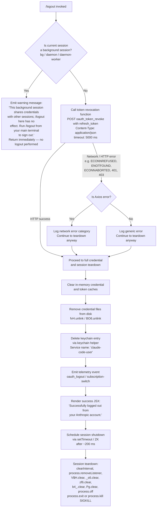

# `/logout`

> Analysis basis: CC v2.1.148 bundle.js (AST extraction + Claude interpretation)
> Minimum version: v2.1.148

---

## Overview

The `/logout` command signs the user out of their Anthropic account by revoking the active OAuth token via a network call, clearing all in-memory credential state, removing credential files from disk, and then terminating the CLI session. It is a destructive, non-reversible operation that requires re-authentication on next launch. If invoked from a background (daemon/worker) session, the command refuses to act and instead instructs the user to log out from their main terminal.

---

## Registration

| Field | Value |
|---|---|
| type | `local-jsx` |
| name | `logout` |
| description | Sign out from your Anthropic account |
| loc_byte | `11103639` |
| loc_byte_end | `11103827` |
| loc_line | `9056` |
| module_id | `gyq` |
| load_inline | `true` |
| arbor_handler.name | `IcL` |
| arbor_handler.fqn | `claude-2.1.148::IcL` |
| arbor_handler.kind | `AsyncFunction` |
| arbor_handler.resolution_path | `module_id` |
| arbor_handler.n_hits | `0` |

Analysis basis: CC v2.1.148 bundle.js:+11103639

---

## Input Branching

The command has four distinct execution paths depending on session type and whether the token revocation network call succeeds. A Mermaid flowchart is used.



Analysis basis: CC v2.1.148 bundle.js:+7469484 (handler entry `IcL`), +7469594 (background-session guard literal), +7468566 (token revocation call), +7469265 (telemetry literal `oauth_logout`), +7469793 (success message literal), +7469856 (`setTimeout` scheduling)

---

## Behavioral Spec

### Background Session Guard

When invoked, the handler first queries the running process type (using the same classification as the daemon startup — string literals `"bg"`, `"daemon"`, `"daemon-worker"` at bundle.js:+2181150, +2181160, +2181174). If the current process matches any background role, the handler renders the warning string

> "This background session shares credentials with other sessions; /logout here has no effect. Run /logout from your main terminal to sign out."

(bundle.js:+7469594)

and returns without performing any logout action.

```
function backgroundSessionGuard(sessionType):
    if sessionType in ["bg", "daemon", "daemon-worker"]:
        renderWarning(BACKGROUND_LOGOUT_WARN_MESSAGE)
        return ABORT
    return CONTINUE
```

Analysis basis: CC v2.1.148 bundle.js:+7469557 (`IcL` → `AJ6`), +2181150

### OAuth Token Revocation

The handler calls the token revocation helper (identified as `Ma8` in the bundle, which posts to the configured OAuth endpoint).

```
async function revokeOAuthToken(credentials):
    endpoint = resolveOAuthEndpoint()   // reads env / config; supports local/staging/prod
    payload  = { refresh_token: credentials.refreshToken }
    headers  = { "Content-Type": "application/json" }
    try:
        await httpClient.post(endpoint + "/oauth_token_revoke",
                              payload,
                              { timeout: 5000 })
        recordTelemetry("oauth_token_revoke", { result: "ok" })
    catch error:
        category = classifyError(error)   // auth | timeout | network | http | other
        recordTelemetry("oauth_token_revoke", { result: category })
        // Non-fatal: teardown continues regardless
```

Key constants:
- Timeout: **5000 ms** (bundle.js:+2038411)
- Telemetry literal `"oauth_token_revoke"` (bundle.js:+2038421)
- HTTP error categories: `"auth"` (401/403), `"timeout"` (ECONNABORTED), `"network"` (ECONNREFUSED/ENOTFOUND), `"http"`, `"other"` (bundle.js:+173353, +173419, +173552, +173273)

Analysis basis: CC v2.1.148 bundle.js:+7468745 (`IcL` → `Ma8`), +2038253, +2038313, +2038368, +2038421

### Credential Cache Clearance

After revocation (success or error), all in-memory credential stores are wiped:

```
function clearCredentialCaches():
    primaryCredentialStore.clear()     // A29.clear — bundle.js:+2918513
    tokenReaderCache.clear()           // via rr6
    transientTokenStore.delete(key)    // e99 → _.delete  bundle.js:+2209525
    primaryTokenStore.delete(key)      // e99 → H.delete  bundle.js:+2209737
```

Telemetry strings observed in the credential subsystem:
- `"secure_storage_credentials_write"` (bundle.js:+2209546)
- `"primary_transient_skip_fallback"` (bundle.js:+2209644)
- `"plaintext_fallback_used"` (bundle.js:+2209793)
- `"primary_and_fallback_failed"` (bundle.js:+2209896)

Analysis basis: CC v2.1.148 bundle.js:+7468591 (`IcL` → `Rq`), +7469438 (`_J6` → `n2q`), +2918513

### Disk File Removal

Credential and lock files are deleted from disk:

```
function removeCredentialFiles():
    await asyncUnlink(credentialFilePath)     // fvH.unlink — bundle.js:+6674516
    await asyncUnlink(lockFilePath)           // BO6.unlink — bundle.js:+4675831
    clearTimeoutOnLockWatcher()               // clearTimeout — bundle.js:+4670522
```

The lock file path is composed via a path join helper (bundle.js:+4670781).
A fallback for ENOENT is expected; missing files are silently ignored.

Analysis basis: CC v2.1.148 bundle.js:+7469438 (`_J6` → `n2q`), +6674516, +7469450 (`_J6` → `RY_`), +4675831

### Keychain Entry Deletion

The keychain helper (identified via `WaA` → `Nv`) targets the service name `"claude-code-user"` (bundle.js:+2049357), using a SHA-256 hash of a normalized user identifier (algorithm: `"sha256"`, encoding: `"hex"`, bundle.js:+2049177, +2049204). On failure, the error message `"Failed to delete keychain entry"` is emitted (bundle.js:+2050115) but the overall logout is not aborted.

```
async function deleteKeychainEntry(userId):
    normalizedId = normalize(userId, "NFC")
    hash         = sha256hex(normalizedId)[0:8]   // first 8 chars
    service      = "claude-code-user"
    try:
        await keychainHelper.delete(service, hash)
    catch err:
        log("Failed to delete keychain entry", err)
```

Analysis basis: CC v2.1.148 bundle.js:+2935050 (`N1_` → `D29`), +2049357, +2049177, +2050115

### Telemetry Emission and UI Rendering

After credential teardown the handler emits the `"oauth_logout"` telemetry event (bundle.js:+7469265) with type `"oauth"` (bundle.js:+7469538), then renders a JSX success component:

```
function renderLogoutSuccess():
    return createElement(SystemMessage, {
        content: "Successfully logged out from your Anthropic account.",
        role:    "system"
    })
```

Success message literal at bundle.js:+7469793; role literal `"system"` at bundle.js:+7469746.

A `"subscription-switch"` event is also present (bundle.js:+7469110), suggesting subscription state is reset as part of logout.

Analysis basis: CC v2.1.148 bundle.js:+7469265, +7469768, +7469793

### Session Shutdown

After UI rendering, the handler schedules session teardown via `setTimeout` (bundle.js:+7469856) with a **200 ms** delay (bundle.js:+7469888), then calls the shutdown helper (`ZK` → `s9`):

```
async function shutdownSession(delayMs = 200):
    await sleep(delayMs)
    flushPendingWrites()              // WRH → D9A.drain
    await drainOutputQueue()          // yYH.writeSync final flush
    clearAllIntervals()               // clearInterval / B4_
    removeProcessListeners()          // process.removeListener, process.off
    clearRegisteredMaps()             // V$H, _s6, zf6, b4_, Pg — all .clear()
    unmountInkRenderer()              // H.unmount via VVH
    exitOrKill()                      // process.exit or process.kill("SIGKILL")
```

Shutdown timeout budget: **3500 ms** before SIGKILL fallback (bundle.js:+5275065).
Grace delay for output drain: **2000 ms** (bundle.js:+5275243).
`session_end` telemetry event fired during this phase (bundle.js:+5275429).

Analysis basis: CC v2.1.148 bundle.js:+7469856, +7469888, +5275065, +5275429, +3166050, +3165393

---

## State & Side Effects

| Item | Detail |
|---|---|
| Telemetry — oauth_logout | Fired after credential teardown; type `"oauth"` (bundle.js:+7469265, +7469538) |
| Telemetry — subscription-switch | Fired to reset subscription state (bundle.js:+7469110) |
| Telemetry — oauth_token_revoke | Fired by HTTP revocation call with result category (bundle.js:+2038421) |
| Telemetry — session_end | Fired during process shutdown (bundle.js:+5275429) |
| Telemetry — tengu_feature_ok / tengu_feature_sad / tengu_feature_bad | Credential-subsystem outcome events (bundle.js:+960829, +960964, +960887) |
| Telemetry — tengu_config_lock_contention | Fired if config lock takes unexpectedly long (bundle.js:+3184859) |
| Telemetry — tengu_config_stale_write | Fired if stale config write is detected (bundle.js:+3184995) |
| Telemetry — tengu_config_parse_error | Fired if config JSON is unparseable (bundle.js:+3187440) |
| Telemetry — tengu_config_auth_loss_prevented | Fired if a write would erase auth from config (bundle.js:+3185338) |
| Telemetry — tengu_daemon_config_reload | Fired when daemon reloads config on shutdown (bundle.js:+15132353) |
| Telemetry — tengu_startup_perf | Startup profiling flushed at exit (bundle.js:+212052) |
| Telemetry — tengu_scroll_summary | Scroll metrics flushed at exit (bundle.js:+5274361) |
| Telemetry — tengu_cache_eviction_hint | Cache eviction hint emitted at exit (bundle.js:+5275394) |
| Telemetry — tengu_pewter_brook | Display/fullscreen mode telemetry flushed at exit (bundle.js:+3351653) |
| Disk mutation — credential file | Async unlink via `fvH.unlink` (bundle.js:+6674516) |
| Disk mutation — lock file | Async unlink via `BO6.unlink` (bundle.js:+4675831) |
| Disk mutation — config backup | Config subsystem may write backup on teardown; `"backups"` directory used (bundle.js:+3186371) |
| Keychain mutation | Keychain entry `"claude-code-user"` deleted (bundle.js:+2049357) |
| In-memory caches | `A29`, primary token store, transient token store all cleared |
| Process listeners | All `process.on("exit")`, `process.on("beforeExit")` listeners removed (bundle.js:+3165451, +3166108) |
| Registered interval/timer maps | `V$H`, `_s6`, `zf6`, `b4_`, `Pg` all cleared (bundle.js:+3165512–3165560) |
| Terminal/renderer | Ink renderer unmounted; final stdout flush written (bundle.js:+5272893) |
| Process exit | `process.exit()` called; `process.kill(SIGKILL)` as fallback after 3500 ms (bundle.js:+5273518, +5275065) |
| Background session guard | No side effects if background session detected; early return only |
| Config safety guard | Logout refuses to save config if auth would be wiped (GH #3117 reference, bundle.js:+3185186, +3182068) |

---

## Version History

| Version | Change |
|---|---|
| v2.1.148 | Initial analysis |

---

## Common Mistakes

1. **Running `/logout` in a background or daemon session.** The command detects `"bg"`, `"daemon"`, and `"daemon-worker"` process roles and refuses to log out, printing an advisory message instead. You must run `/logout` from your primary interactive terminal.

2. **Expecting instant re-use of the same session after logout.** The command schedules a full process exit (~200 ms delay, up to 3500 ms for drain). The CLI terminates; you must start a new `claude` process to authenticate again.

3. **Assuming network failure prevents logout.** The OAuth token revocation HTTP call (timeout: 5000 ms) is best-effort. A network error is logged and categorized, but credential and disk teardown proceed regardless. Local state will be cleared even if the server cannot be reached.

4. **Ignoring the config auth-loss safety guard.** During logout the config subsystem checks that writing the updated config would not erase an existing auth token (GH #3117). If this check fails, the config write is refused and a `tengu_config_auth_loss_prevented` telemetry event is emitted; manual remediation of `~/.claude.json` may be required.

5. **Running `/logout` when another Claude instance holds the config lock.** Lock contention produces the warning "Lock acquisition took longer than expected — another Claude instance may be running" (bundle.js:+3184770) and fires `tengu_config_lock_contention`. Quit other instances first.

---

## Appendix — Identifier Mapping

> For bundle debugging only. Identifiers change across versions.

| Identifier | Role |
|---|---|
| `IcL` | Main async logout handler (arbor_handler; AsyncFunction in module `gyq`) |
| `AJ6` | Logout orchestrator — sequences token revocation, cache clear, file removal, UI render |
| `_J6` | Credential and file cleanup coordinator |
| `Rq` | Session-type classifier (bg / daemon / daemon-worker guard) |
| `T3H` | Session-type constant table |
| `ZZ_` | Token revocation pre-flight helper |
| `A` | toLowerCase normalisation utility |
| `M` | Socket / connection close helper |
| `q` | File unlink helper (synchronous) |
| `L` | Async task set manager (add/delete/finally) |
| `Xw6` | Credential context accessor |
| `ir6` | Token invalidation helper |
| `rr6` | Credential map clear helper (`A29.clear`) |
| `W$H` | Auth state reset helper |
| `LTH` | Session listener teardown orchestrator |
| `Ct` | Environment variable reader |
| `UH` | String-to-boolean utility |
| `rC` | Config key lookup helper |
| `lUH` | Multi-map clear and process-listener removal helper |
| `B4_` | Interval/timer cancellation helper (`clearInterval`, `process.removeListener`) |
| `RH` | Log writer / log-queue manager |
| `n_` | Error serialiser |
| `j1` | Essential-traffic log helper |
| `FpK` | Log-queue shift/push manager |
| `n2q` | Credential file removal orchestrator |
| `r2q` | Credential path resolver |
| `$0_` | Credential directory builder |
| `OWA` | OS credential directory helper |
| `sAH` | Path join utility (credential paths) |
| `m16` | Credential file path composer |
| `RY_` | Lock file removal orchestrator |
| `vY_` | Lock watcher teardown |
| `CY_` | Lock watcher state clearer |
| `c_8` | Lock file path composer |
| `hA` | Auth provider type checker (bedrock / foundry / anthropicAws / mantle / vertex / firstParty) |
| `pK` | Secure storage (keychain) interface |
| `e99` | Keychain read/write/delete implementation |
| `H` | Primary credential store (Map-based, with async read/readAsync/update/delete) |
| `_` | Transient / plaintext fallback credential store |
| `$0H` | Keychain async-write orchestrator |
| `$W4` | Keychain storage context builder |
| `bH` | Telemetry feature-ok emitter |
| `c` | Telemetry event emitter (core) |
| `K8` | Telemetry feature-sad emitter |
| `mH` | Telemetry feature-bad emitter |
| `K` | Terminal column-width formatter |
| `Ma8` | OAuth token revocation HTTP caller |
| `R9` | OAuth endpoint URL resolver |
| `ODA` | Prod OAuth base URL constant |
| `RmK` | Endpoint whitelist checker |
| `N` | HTTP request builder / fetch wrapper |
| `vJK` | HTTP response handler |
| `j9A` | HTTP error classifier |
| `CH` | JSON stringify helper |
| `f4` | URL path formatter |
| `l1A` | URL segment mapper |
| `lRH` | HTTP response body writer |
| `b1A` | Raw write helper |
| `kJK` | Log file writer / rotator |
| `XRH` | Log output formatter |
| `XAH` | Log line assembler |
| `F6` | File existence / stat utility |
| `C_6` | EISDIR error handler |
| `e1A` | Log file path builder |
| `t1A` | Log file rotation helper |
| `IJK` | Log file append / rotate implementation |
| `r9` | Log drain register helper |
| `Ia` | Config read helper |
| `N1_` | Global config save orchestrator |
| `D29` | Config path builder |
| `WaA` | Keychain entry path builder (SHA-256 hash of user ID) |
| `Nv` | User ID normaliser and hasher |
| `gP` | Keychain native binding helper |
| `AZ` | OS username resolver |
| `ZH` | Number-to-string coercer |
| `M8` | Global config write implementation |
| `_L_` | Config-with-lock writer |
| `n99` | Config object merger |
| `q8` | EISDIR / error code checker |
| `k$H` | Config file read / parse / backup implementation |
| `Wf6` | Config validation helper |
| `AL_` | Config backup path builder |
| `Z` | Backup filename string helper |
| `X` | SDK connection state machine |
| `V` | Render renderer instance |
| `sq6` | Atomic file write helper (temp + rename, fchmod, fsync) |
| `sUH` | Config schema validator |
| `yy9` | Config entries enumerator |
| `tUH` | Config timestamp helper |
| `HL_` | Config directory sync helper |
| `Le8` | Config migration helper |
| `ZXH` | Subscription state resetter |
| `iQH` | OTEL metrics / telemetry attribute builder |
| `BE` | OTEL attribute coercer |
| `A4` | OTEL event emitter |
| `Ck8` | OTEL meter factory |
| `xZH` | OTEL resource builder (user.id, session.id, app.version, etc.) |
| `Um` | Secure random bytes + session ID generator |
| `h6` | Promise resolve-or-throw helper |
| `Rw_` | OTEL environment flag reader |
| `I5` | OTEL metric recorder |
| `S6q` | OTEL histogram/counter selector |
| `A98` | OTEL identity source attribute builder |
| `u86` | OTEL workspace path attribute builder |
| `ZK` | Session shutdown entry point |
| `s9` | Session shutdown implementation (drain, unmount, exit) |
| `VVH` | Ink renderer finaliser (writeSync + unmount) |
| `nh` | Renderer cleanup helper |
| `ue6` | Terminal restore helper (ESC-7 / ESC-8 save/restore cursor) |
| `dP_` | Pre-exit output formatter |
| `sV` | Scroll-state snapshot |
| `dR` | Scroll delta calculator |
| `PD6` | CWD stat helper |
| `CO` | Terminal colour helper |
| `F7q` | Output line builder |
| `cP_` | Process kill orchestrator (exit + SIGKILL fallback) |
| `WRH` | Log drain flusher (`D9A.drain`) |
| `Y` | Renderer render-loop / supervisor |
| `LPH` | Render-state builder |
| `sx1` | Column-layout calculator |
| `T` | Input event handler (remoteControlAtStartup) |
| `kfK` | Heartbeat helper |
| `r_6` | Startup profiling reporter |
| `bS8` | Perf mark aggregator |
| `JKA` | Profiling log writer |
| `M18` | Scroll-summary emitter |
| `B7q` | Scroll buffer snapshot |
| `U7q` | Scroll timing calculator |
| `z9` | Display mode detector (fullscreen / tmux-CC / ConPTY) |
| `Y86` | Cache eviction hint emitter |
| `f18` | Parallel teardown coordinator |
| `r8` | Timeout-with-abort helper |