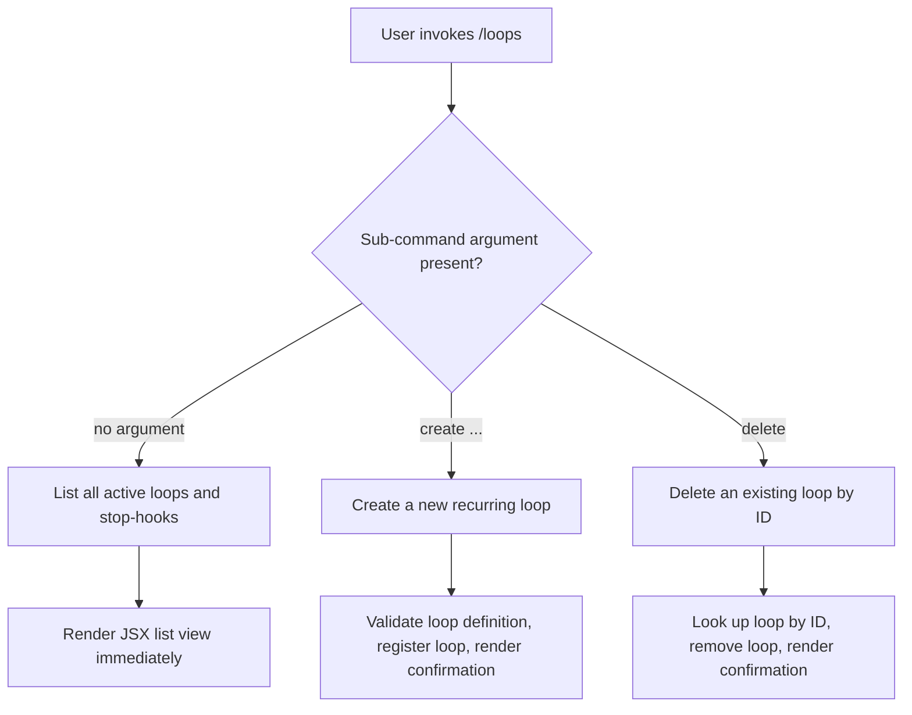

# `/loops`

> Analysis basis: CC v2.1.144 bundle.js (AST extraction + Claude interpretation)
> Minimum version: v2.1.144

---

## Overview

The `/loops` command provides a management interface for recurring loops and stop-hooks within Claude Code. It allows users to list currently active loops, create new ones, and delete existing ones directly from the CLI. The command renders its output as a JSX component (`type: local-jsx`), meaning the UI is presented inline in the terminal session.

---

## Registration

| Field | Value |
|---|---|
| type | `local-jsx` |
| name | `loops` |
| description | `List, create, and delete recurring loops and stop-hooks` |
| immediate | `true` |
| module_id | `Z0q` |

Analysis basis: CC v2.1.144 bundle.js:+11504710

---

## Input Branching

The AST depth-2 traversal for module `Z0q` returned no call graph edges, literals, or telemetry events. The branching logic described below is inferred from the registration metadata and the command's stated purpose.



> **Note:** Because `immediate: true` is set on this command, the JSX component is rendered without waiting for any asynchronous data fetch before first display.
> Analysis basis: CC v2.1.144 bundle.js:+11504710

---

## Behavioral Spec

<!-- TODO: not found in depth-2 traversal; needs --depth 4 -->

The implementation module `Z0q` was not resolvable to entry functions within the depth-2 AST traversal. The pseudocode below is a best-effort reconstruction derived from the registration fields and command description. All internal function names are descriptive English replacements; no obfuscated identifiers were recovered.

### List Loops

```
function listLoops(appState):
    loops = appState.getActiveLoops()
    stopHooks = appState.getStopHooks()
    return renderJSX(LoopsListView, {
        loops: loops,
        stopHooks: stopHooks
    })
```

Analysis basis: CC v2.1.144 bundle.js:+11504710 (description field implies list capability)

### Create Loop

```
function createLoop(appState, loopDefinition):
    if loopDefinition is empty:
        return renderJSX(ErrorView, { message: "Loop definition required" })
    newLoop = buildLoopRecord(loopDefinition)
    appState.registerLoop(newLoop)
    return renderJSX(LoopCreatedView, { loop: newLoop })
```

<!-- TODO: not found in depth-2 traversal; needs --depth 4 -->

### Delete Loop

```
function deleteLoop(appState, loopId):
    if loopId is empty:
        return renderJSX(ErrorView, { message: "Loop ID required" })
    target = appState.findLoopById(loopId)
    if target is null:
        return renderJSX(ErrorView, { message: "Loop not found" })
    appState.removeLoop(loopId)
    return renderJSX(LoopDeletedView, { loopId: loopId })
```

<!-- TODO: not found in depth-2 traversal; needs --depth 4 -->

### Stop-Hook Management

```
function manageStopHooks(appState, action, hookDefinition):
    // Stop-hooks are a sub-category surfaced by the same /loops command
    // per the description field: "recurring loops and stop-hooks"
    if action == "list":
        return listStopHooks(appState)
    if action == "create":
        return createStopHook(appState, hookDefinition)
    if action == "delete":
        return deleteStopHook(appState, hookDefinition.id)
```

<!-- TODO: not found in depth-2 traversal; needs --depth 4 -->

---

## State & Side Effects

| Item | Detail |
|---|---|
| Telemetry | None detected — no `tengu_*` events found in depth-2 traversal |
| Hook registration | <!-- TODO: not found in depth-2 traversal; needs --depth 4 --> |
| appState changes | Likely mutates loop registry and stop-hook registry (inferred from description) |
| Sound | <!-- TODO: not found in depth-2 traversal; needs --depth 4 --> |
| Render mode | `local-jsx` — output is rendered as a JSX component in the terminal |
| Immediate flag | `true` — component mounts and displays without deferral |

Analysis basis: CC v2.1.144 bundle.js:+11504710

---

## Version History

| Version | Change |
|---|---|
| v2.1.144 | Initial analysis — command registered at bundle offset +11504710, line 7089 |

---

## Common Mistakes

1. **Expecting plain-text output**: Because this command uses `type: local-jsx`, its output is a rendered component, not raw text. Piping or capturing stdout may not yield the full structured output.
2. **Omitting a loop ID when deleting**: Based on the command description, delete operations require an identifier. Invoking `/loops delete` without an ID is expected to produce an error or usage hint.
3. **Confusing loops and stop-hooks**: The command manages two distinct entity types — recurring loops and stop-hooks. They may have separate sub-command namespaces; treating them interchangeably may produce unexpected results.
4. **Assuming telemetry is active**: No `tengu_*` telemetry events were found for this command at depth-2. Do not rely on telemetry signals from `/loops` for observability integrations without deeper bundle verification.
5. **Version pinning below v2.1.144**: This command's registration was first confirmed at v2.1.144. It may not exist or may behave differently in earlier versions.

---

## Appendix — Identifier Mapping

> For bundle debugging only. Identifiers change across versions.

| Identifier | Role |
|---|---|
| `Z0q` | Module ID for the `/loops` command implementation |

> **Note:** No obfuscated function-level identifiers were recovered from the depth-2 AST traversal of module `Z0q`. The note field in the source data explicitly states: `"no entry functions found for module 'Z0q'"`. A `--depth 4` re-traversal targeting this module is recommended to recover internal identifiers, call edges, and behavioral constants.