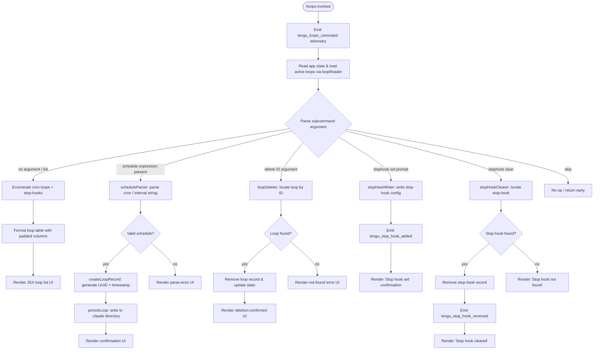

# `/loops`

> Analysis basis: CC v2.1.148 bundle.js (AST extraction + Claude interpretation)
> Minimum version: v2.1.148

---

## Overview

The `/loops` command provides a management interface for recurring loop tasks and stop-hooks within Claude Code. It allows users to list active loops (including cron-type recurring tasks and stop-hooks), create new recurring loops by parsing schedule expressions, and delete existing ones. The command renders a JSX-based interactive UI, interacts with app state, and dispatches telemetry on every invocation.

---

## Registration

| Field | Value |
|---|---|
| type | `local-jsx` |
| name | `loops` |
| description | `List, create, and delete recurring loops and stop-hooks` |
| loc_byte | `11952201` |
| loc_byte_end | `11952383` |
| loc_line | `9817` |
| immediate | `true` |
| module_id | `wk1` |
| load_inline | `true` |
| arbor_handler.name | `PB7` |
| arbor_handler.fqn | `claude-2.1.148::PB7` |
| arbor_handler.kind | `AsyncFunction` |
| arbor_handler.resolution_path | `module_id` |
| arbor_handler.n_hits | `0` |

Analysis basis: CC v2.1.148 bundle.js:+11952201

---

## Input Branching

The handler processes several distinct branches depending on the subcommand argument: list (no argument / default), create (with a schedule expression), delete a loop, manage a stop-hook (set or clear), and a skip/no-op path. This yields 5+ distinct paths and requires a flowchart.



Analysis basis: CC v2.1.148 bundle.js:+11951158 through +11952035

---

## Behavioral Spec

### 1. Handler Entry — `loopsCommandHandler` (PB7)

The top-level handler is an `AsyncFunction` resolved via `module_id` → `wk1`.

```
async function loopsCommandHandler(context):
    emit telemetry("tengu_loops_command")          // +11951160
    rawLoops = await readLoopConfig(context)       // calls loopConfigReader (ae) → +11951198
    scheduleMap = await buildScheduleMap(context)  // calls scheduleMapBuilder (YsH) → +11951205
    appState = context.getAppState()               // +11951209
    loopList = appState.loops ?? []
    mappedLoops = loopList.map(loopEntryFormatter) // +11951237

    subcommand = parseSubcommand(context.args)

    if subcommand.kind == "list" or none:
        return renderLoopListUI(mappedLoops, scheduleMap)

    if subcommand.kind == "create":
        schedule = scheduleParser(subcommand.expression)  // SZ → +11951288
        if not schedule.valid:
            return renderErrorUI("invalid schedule")
        record = createLoopRecord(schedule)               // NQH → +11951806
        await persistLoop(record)
        return renderConfirmationUI(record)

    if subcommand.kind == "stophook-set":
        await writeStopHook(context, subcommand.prompt)   // DsH → +11951894
        return renderStaticMessage("Stop hook set")       // literal +11951918

    if subcommand.kind == "stophook-clear":
        result = clearStopHook(context)                   // wsH → +11951582
        if result.cleared:
            return renderStaticMessage("Stop hook cleared")  // literal +11951622
        else:
            return renderStaticMessage("Stop hook not found") // literal +11951600

    if subcommand.kind == "delete":
        await deleteLoop(context, subcommand.id)          // oe → +11951444
        return renderDeletionUI()

    if subcommand.kind == "skip":
        return                                            // literal "skip" +11952067

    return renderJSXComponent(mappedLoops)               // +11951961
```

Analysis basis: CC v2.1.148 bundle.js:+11951158

---

### 2. Loop Configuration Reader — `loopConfigReader` (ae → VZH)

Reads the loops configuration from the filesystem, normalising encoding and validating structure.

```
async function loopConfigReader(context):
    configPath = buildConfigPath(pathJoiner, configDir)  // s1H → +4751032
    raw = await fs.readFile(configPath, "utf-8")         // +4751101, literal "utf-8" +4751129
    parsed = parseJSON(raw)                              // +4751471
    if not Array.isArray(parsed):                        // +4751245
        parsed = []
    validated = parsed.map(validateLoopEntry)            // N → +4751424
    normalised = normaliseLoopText(validated)            // DN → +4751493
    return normalised
```

Error codes handled: `ENOENT`, `EACCES`, `EPERM`, `ENOTDIR`, `ELOOP`, `EROFS`
(literals at +172908–+172977)

Analysis basis: CC v2.1.148 bundle.js:+4751082

---

### 3. Schedule Parser — `scheduleParser` (SZ)

Parses a human-readable or cron-syntax schedule expression into a structured schedule object.

```
function scheduleParser(expression):
    trimmed = expression.trim()                     // +4748873

    // Match cron syntax (5-field or shorthand)
    cronMatch = trimmed.match(CRON_PATTERN)         // +4749014
    if cronMatch:
        fields = parseCronFields(cronMatch)
        // Validate fields: minutes 0-59, hours 0-23, days 1-31
        // (literals: 60→+11950891, 59→+11950925, 23→+11950996, 31→+11951049)
        return { kind: "cron", fields, humanLabel: formatCronLabel(fields) }

    // Match interval shorthand: "Every minute", "Every hour"
    if trimmed == "Every minute":                   // literal +4748993
        return { kind: "cron", expression: "* * * * *" }
    if trimmed == "Every hour":                     // literal +4749210
        return { kind: "cron", expression: "0 * * * *" }

    // Match numeric range like "1-5"               // literal "1-5" +4749917
    rangeMatch = trimmed.match(RANGE_PATTERN)       // +4749284
    if rangeMatch:
        return { kind: "interval", range: parseRange(rangeMatch) }

    // Parse day-of-week component
    dateObj = new Date()
    dayOfWeek = dateObj.getUTCDay()                 // +4749750
    dateObj.setUTCDate(...)                         // +4749769
    dateObj.setUTCHours(...)                        // +4749800

    return { valid: false }
```

Key numeric limits (from literals):
- Minutes: max 59 (bundle.js:+11950925)
- Hours: max 23 (bundle.js:+11950996)
- Days: max 31 (bundle.js:+11951049)
- Cron field count: validated against 60 (bundle.js:+11950891)

Analysis basis: CC v2.1.148 bundle.js:+4748873

---

### 4. Cron Field Normaliser — `cronFieldNormaliser` (D3L)

Called from within the schedule-parsing pipeline to expand and deduplicate cron step/range expressions.

```
function cronFieldNormaliser(fieldString):
    parts = fieldString.split(",")               // +4747122
    for part in parts:
        match = part.match(STEP_RANGE_PATTERN)   // +4747142
        if match:
            start, end, step = parseInt(match groups)  // +4747187
            // max step guard: 10                // literal +4747201
            for v in range(start, end, step):
                resultSet.add(v)                 // +4747248
    // Numeric bounds checks: 3, 6, 7 field positions
    // (literals +4747363, +4747399, +4747405)
    return Array.from(resultSet)                 // +4747650
```

Analysis basis: CC v2.1.148 bundle.js:+4747122

---

### 5. Loop Record Creator — `loopRecordCreator` (NQH)

Constructs a new loop record ready for persistence.

```
async function loopRecordCreator(schedule, context):
    id = crypto.randomUUID()                   // He9.randomUUID → +4752429
    // UUID buffer size: 8 bytes               // literal +4752454
    createdAt = Date.now()                     // +4752491
    record = {
        id,
        schedule,
        createdAt,
        ...buildLoopMetadata(schedule)         // VXH → +4752537
    }
    await persistLoopConfig(record, context)   // VZH → +4752581
    loopPersistenceQueue.push(record)          // +4752594
    return record
```

Analysis basis: CC v2.1.148 bundle.js:+4752429

---

### 6. Loop Persistence Writer — `loopPersistenceWriter` (vQH)

Writes a loop record to the `.claude` configuration directory.

```
async function loopPersistenceWriter(record, configDir):
    baseDir = buildConfigPath(configDir)        // M4 → +4752238
    await fs.mkdir(baseDir, { recursive: true }) // GA8.mkdir → +4752249
    filePath = path.join(baseDir, ".claude", record.id + ".json")
    // directory literal: ".claude"             // +4752270
    content = record.entries.map(serializeEntry) // H.map → +4752310
    await fs.writeFile(filePath, serialized)    // GA8.writeFile → +4752346
    checksum = computeConfigChecksum(content)   // s1H → +4752360
```

Analysis basis: CC v2.1.148 bundle.js:+4752238

---

### 7. Stop-Hook Writer — `stopHookWriter` (DsH)

Writes a new stop-hook configuration, associating a prompt with the session.

```
async function stopHookWriter(context, prompt):
    gateCheck = checkHooksGate(context)         // Gp_ → +10323266
    // policy key: "hooks_gate"                 // literal +10323162
    // trust key:  "trust_gate"                 // literal +10323216
    if not gateCheck.allowed:
        return renderPolicyBlockedUI()

    sessionState = getAppState(context)         // +10323351
    scheduleMap  = buildScheduleMap(context)    // YsH → +10323347
    stopHookEntry = {
        id:        crypto.randomUUID(),         // +10323637
        kind:      "stophook",
        prompt,
        addedAt:   Date.now()                   // +10323515
    }
    newState = applyMessageOp(sessionState, {
        op:    "append",                        // literal +10323986
        kind:  "goal",                          // literal +10324051
        type:  "attachment",                    // literal +10324092
        entry: stopHookEntry
    })                                          // _.applyMessageOp → +10323595
    setAppState(newState)                       // _.setAppState → +10323553
    emit telemetry("tengu_stop_hook_added")     // +10323652
    emit telemetry("tengu_feature_ok")          // bH → +10323712
```

Analysis basis: CC v2.1.148 bundle.js:+10323266

---

### 8. Stop-Hook Clearer — `stopHookClearer` (wsH)

Removes the active stop-hook from session state, if one is registered.

```
async function stopHookClearer(context):
    scheduleMap  = buildScheduleMap(context)    // YsH → +10323761
    sessionState = getAppState(context)         // H.getAppState → +10323765
    existing = sessionState.stopHook
    if not existing:
        return { cleared: false }               // literal "Stop hook not found" +11951600
    newState = applyMessageOp(sessionState, {
        op: "remove",
        id: existing.id
    })                                          // H.applyMessageOp → +10323963
    setAppState(newState)                       // H.setAppState → +10323894
    emit telemetry("tengu_stop_hook_removed")   // If1 / wsH region → +10324020
    return { cleared: true }
```

Analysis basis: CC v2.1.148 bundle.js:+10323754

---

### 9. Loop Deleter — `loopDeleter` (oe)

Finds and removes a loop by ID, filtering the active loops collection.

```
async function loopDeleter(context, loopId):
    hasPredicate = buildHasPredicate(loopId)    // ya → +4752758
    config = await readLoopConfig(context)       // VZH → +4752807
    active = config.filter(l => l.id != loopId) // q.filter → +4752816
    if active.length == config.length:
        return { deleted: false }               // A.has check → +4752831
    await persistLoopList(active, context)      // vQH → +4752880
    return { deleted: true }
```

Analysis basis: CC v2.1.148 bundle.js:+4752758

---

### 10. Schedule Map Builder — `scheduleMapBuilder` (YsH → UwH)

Builds a display map from the internal schedule registry for the list view.

```
function scheduleMapBuilder(context):
    scheduleRegistry = getScheduleRegistry()     // UwH → +10322966
    // Literal column type "Stop"                // +10322974
    // Display type "prompt"                     // +10323081
    result = Map()
    for entry in scheduleRegistry:
        formatted = formatScheduleEntry(entry)   // tdq → +8499593
        result.set(entry.id, formatted)          // K.set → +8499824
    pushDisplayList(result)                      // A.push → +10323090
    return result
```

Column padding: 40-character pad-end (literal `40` at bundle.js:+15143577), separator `"  "` (literal at +15141606).

Analysis basis: CC v2.1.148 bundle.js:+10322966

---

### 11. Loop Type Classification

Loops are partitioned into two display categories based on the `kind` field:

| Kind | Literal | Source byte |
|---|---|---|
| Cron loop | `"cron"` | +11951255 |
| Stop-hook | `"stophook"` | +11951341 |
| System entry | `"system"` | +11951489 |

The list view maps over the combined collection (`PB7` → `A.map` at +11951237, `q.map` at +11951321).

Analysis basis: CC v2.1.148 bundle.js:+11951255

---

## State & Side Effects

| Item | Detail |
|---|---|
| Telemetry: `tengu_loops_command` | Fired on every `/loops` invocation (bundle.js:+11951160) |
| Telemetry: `tengu_stop_hook_added` | Fired when a stop-hook is successfully registered (+10323652) |
| Telemetry: `tengu_stop_hook_removed` | Fired when a stop-hook is cleared (+10324020) |
| Telemetry: `tengu_feature_ok` | Fired on successful stop-hook write via bH (+10323712) |
| Telemetry: `tengu_feature_bad` | Fired on failure path via mH (+960887) |
| Telemetry: `tengu_feature_sad` | Fired on error/sad path via K8 (+960964) |
| Telemetry: `tengu_daemon_control` | Fired during daemon interaction reachable from loop runner (+15153677) |
| Telemetry: `tengu_bg_*` family | Background session management events reachable indirectly from loop execution context (see callGraph depth-2 nodes w, V6A, S6A) |
| App state changes | `setAppState` / `applyMessageOp` called for stop-hook add and remove; loop records written to `~/.claude/` directory |
| Filesystem | Loop configs written under `.claude/` subdirectory; `mkdir` + `writeFile` used (GA8); stop-hook entries use JSON encoding |
| JSX render | `Qc_.createElement` called at +11951961; final output is a JSX component tree |
| MCP side-effects | Indirectly: `_D5` / `EkH` chain (reachable from loop execution) may re-connect or update MCP server clients |
| Hook registration | Stop-hook lifecycle managed through `applyMessageOp` with `"append"` / remove ops and `goal_status` tracking (literals +10324179) |
| Sound | <!-- TODO: not found in depth-2 traversal; needs --depth 4 --> |

---

## Version History

| Version | Change |
|---|---|
| v2.1.148 | Initial analysis — `loops` command with list/create/delete/stophook-set/stophook-clear subcommands confirmed |

---

## Common Mistakes

1. **Omitting the loop type flag**: The parser distinguishes `"cron"` and `"stophook"` kinds. Passing a stop-hook prompt as a bare cron expression will fail validation silently with "Stop hook not found" on the next clear attempt.
2. **Invalid cron field values**: Minutes must be ≤ 59, hours ≤ 23, and day-of-month ≤ 31. Values outside these bounds cause the schedule to be rejected without error detail (literals: +11950925, +11950996, +11951049).
3. **Expecting synchronous list refresh**: The loop list is read from the filesystem each invocation (`VZH`). A loop created in one terminal session may not appear immediately in a second session if config writes are still in flight.
4. **Confusing "Stop hook" with loop deletion**: `/loops` with a stop-hook clear subcommand emits `"Stop hook not found"` (literal +11951600) — not a deletion error — when no stop-hook is registered. Loop deletion and stop-hook management are separate subcommand paths.
5. **Assuming `immediate: true` means blocking**: The `immediate` flag means the command renders its JSX UI without waiting for an LLM turn; the underlying loop execution (daemon/background sessions) is asynchronous.

---

## Appendix — Identifier Mapping

> For bundle debugging only. Identifiers change across versions.

| Identifier | Role |
|---|---|
| `PB7` | Top-level `/loops` command handler (AsyncFunction, arbor_handler) |
| `ae` | Loop config reader dispatcher (calls VZH) |
| `VZH` | Core loop configuration reader (filesystem read + validation) |
| `F6` | File utility / path resolver used inside loop reader |
| `s1H` | Config path builder (joins path segments) |
| `M4` | Base config directory resolver |
| `t9` | Low-level async queue helper (calls q8) |
| `q8` | Promise/async utility |
| `RH` | Error handler / error-push utility for loop operations |
| `n_` | Error normaliser (wraps Error + String) |
| `UH` | String coercion helper |
| `j1` | Essential-traffic router (calls XwA) |
| `FpK` | FIFO queue manager (lb6.shift / lb6.push) |
| `N` | Loop entry validator / normaliser |
| `vJK` | Loop entry sub-validator (calls Av, VJK, j9A) |
| `CH` | JSON.stringify wrapper |
| `f4` | Text redaction utility (replaces sensitive content with `[REDACTED]`) |
| `lRH` | Text processor (calls b1A) |
| `kJK` | File-write pipeline (path join, Buffer.byteLength, writeFile) |
| `DN` | Loop text normaliser (trim + D3L) |
| `D3L` | Cron field parser (split, match, parseInt, Set operations) |
| `A` | Generic array accumulator / toLowerCase helper |
| `L` | Promise-wrapper with add/finally/delete lifecycle |
| `q` | File-cleanup set (unlinkSync) |
| `M` | Stream/handle manager (close, finally) |
| `k0` | Auxiliary config loader (calls oV) |
| `oV` | Config object accessor |
| `YsH` | Schedule map builder (calls UwH, A.push) |
| `UwH` | Schedule registry setter (K.set, tdq) |
| `K` | Schedule map with padEnd formatting |
| `tdq` | Schedule entry formatter (H.map) |
| `h6` | App-state convenience accessor (calls oV) |
| `SZ` | Schedule / cron expression parser |
| `w` | Background worker / loop runner (process manager) |
| `C` | Process supervisor (SfK, Az, N, RH, Nj5) |
| `SfK` | Realpath + stat resolver |
| `Az` | Auxiliary process utility |
| `Nj5` | Process launch helper (LY8) |
| `z` | Daemon write channel (bH, mH, Pk, Ou) |
| `mH` | Failure-signal writer (calls c, emits tengu_feature_bad) |
| `bH` | Success-signal writer (calls c, emits tengu_feature_ok) |
| `sG8` | macOS memory sampler (calls o6, V6) |
| `V6` | Background dispatch gate (memory + spare pool checks) |
| `T$6` | Pins file reader (pins.json) |
| `M$_` | Pins path builder (jX.join, wG) |
| `B6` | JSON.parse wrapper |
| `J8` | Error-kind classifier (calls q8) |
| `v9L` | Directory loop scanner (readdir + readFile) |
| `g` | Retired-session filter (oH.filter, vH.has) |
| `oH` | Session filter list (Z6) |
| `vH` | Orphaned-permission session map (V) |
| `v6A` | Spawn-and-claim orchestrator (KB.claim, So_, tw5, sw5) |
| `So_` | Config persistence writer (mkdir, writeFile, JSON.stringify) |
| `tw5` | Claim timeout handler (Date.now, Error, q8) |
| `sw5` | Claim frame builder (KB.buildClaimFrame) |
| `ZH` | String coercion wrapper |
| `bU` | Binary framing encoder (Buffer.from, allocUnsafe, writeUInt32BE, writeUInt8) |
| `S6A` | Full session lifecycle manager (spawn, retire, delete, roster) |
| `RK` | Session path builder (jX.join, wG) |
| `dq` | Session state reader/writer (stat, readFile, JSON parse, hOH cache) |
| `bw` | Active-state marker (TZ) |
| `h5` | Session config writer (ez, CH, Cw) |
| `gsH` | Session completion recorder (Date.now, BU, qI7) |
| `QLH` | Session path resolver (Y$.join, jyH) |
| `Ny` | Session cleanup path splitter (o6, Y$.join) |
| `UU` | Session unlink helper (o6, qF_, BsH) |
| `zT6` | Session directory maker (Y$.join, MF_) |
| `Y` | Session config reload handler (stop/start/updateConfig) |
| `D` | Session tick / heartbeat loop (V6, sG8, R6A.freemem) |
| `$` | Disposable session handle (ZC1) |
| `V6A` | Spare-session spawner (eMK.randomBytes, Bun.spawn, M.kill) |
| `S` | Session disposal handle |
| `j` | Kill-all iterator (A.values, y.kill) |
| `y` | Foreground-yield handler (z.write, c, emits tengu_daemon_yield) |
| `J` | Date computation context (w wrapper) |
| `oe` | Loop deleter dispatcher (ya, VZH, vQH) |
| `ya` | Existence predicate builder (_.has) |
| `vQH` | Loop persistence writer (mkdir, writeFile, CH) |
| `wsH` | Stop-hook clearer (getAppState, setAppState, applyMessageOp, If1) |
| `If1` | UUID generator for stop-hook entries (Vf1.randomUUID) |
| `JB7` | Cron-expression validator / next-run calculator (Math.max, Math.ceil, Math.round, DN) |
| `NQH` | Loop record creator (He9.randomUUID, Date.now, VXH, VZH) |
| `VXH` | Loop metadata builder |
| `f` | MCP server manager (EkH, k7K, L.get, _D5) |
| `EkH` | MCP connection orchestrator (Object.entries, RHH, TN, ux_, mx_, wL1, bx_, B2_, k7, OL1) |
| `RHH` | MCP server record builder (gQ, CKH, iYH, SHH, cD6, Object.assign) |
| `TN` | MCP type resolver (o$, c2_) |
| `s8` | MCP state helper (calls _) |
| `F06` | MCP filter/format helper |
| `rj7` | MCP request handler (Su_, WK8, Date.now) |
| `GK8` | MCP response writer (WK8, MP) |
| `XK8` | MCP protocol helper (pK) |
| `z8` | MCP debug logger (bbH.push, Gl.logMCPDebug) |
| `ux_` | MCP OAuth flow initiator (Hw7, PF, sD7, P8H, RaH, AJ8, Ud, qm, rN) |
| `mx_` | MCP OAuth callback handler (PF, tD7, SaH, CaH) |
| `wL1` | MCP post-auth tool refresh (vJ8.then, Su_, M1, IJ8, CH) |
| `bx_` | MCP connection retry handler (MP, pK, z8, ZH) |
| `B2_` | MCP capability checker (M8, A.includes) |
| `k7` | MCP error logger (bbH.push, Gl.logMCPError) |
| `OL1` | MCP client getter (Gi) |
| `g06` | MCP integer parser A (parseInt) |
| `Ru_` | MCP integer parser B (parseInt) |
| `k7K` | MCP update applier (H.applyMcpUpdate, kJ8, A.cleanup, sN, nj) |
| `kJ8` | MCP serialiser (CH) |
| `sN` | MCP cleanup runner (laH, K.cleanup) |
| `_D5` | MCP server diff/reconciler (Object.entries, EkH, k7K, Object.fromEntries) |
| `EK8` | MCP capability set checker (uIL.has, mIL.has) |
| `r8` | Async retry with timeout (K, Error, setTimeout, clearTimeout, L.unref) |
| `laH` | MCP state serialiser (CH) |
| `ll` | Pipe/IO helper (p9H) |
| `p9H` | Pipe reader (Ks, _.trim) |
| `Ks` | Pipe chunk slicer (H.slice, kPA, b6) |
| `DsH` | Stop-hook writer (Gp_, K8, h6, YsH, getAppState, setAppState, applyMessageOp, If1, bH) |
| `Gp_` | Policy gate checker (Qm, BY, h_, S7) |
| `Qm` | Policy settings reader (m8) |
| `m8` | Settings loader (Cu6, WF) |
| `BY` | Policy entry builder (m8, XA) |
| `h_` | Gate condition evaluator |
| `S7` | Trust gate resolver (XQ4) |
| `XQ4` | Trust resolution engine (UH, DRH, Rq, x6, HBH, YF, b6, UY.resolve) |
| `K8` | Feature-sad emitter (c, tengu_feature_sad) |
| `Pw` | Output token counter (_RH, Object.values) |

---

Note: index built via Arbor fallback; some signals (telemetry, literals) may be missing — see arbor-fallback.js.