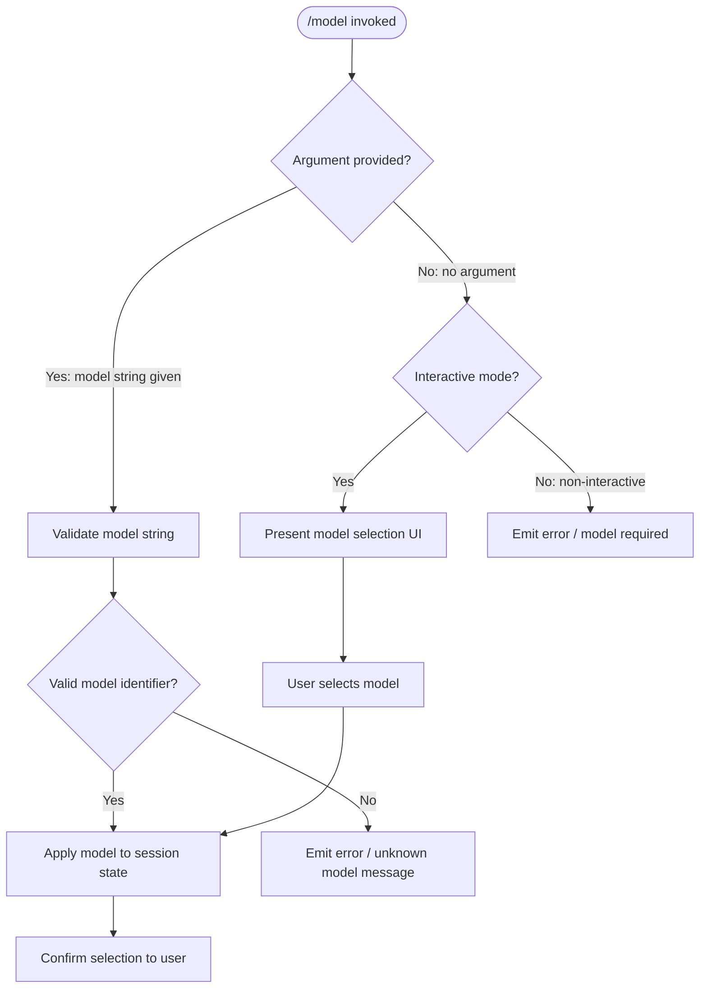

# `/model`

> Analysis basis: CC v2.1.144 bundle.js (AST extraction + Claude interpretation)
> Minimum version: v2.1.144

---

## Overview

The `/model` command allows users to set or switch the AI model used by Claude Code during a session. It accepts an optional `<model>` argument; when provided, it configures the target model directly, and when omitted it is expected to prompt the user for a selection. The command is registered as a `local` type and supports non-interactive (scripted/headless) invocation.

---

## Registration

| Field | Value |
|---|---|
| type | `local` |
| name | `model` |
| description | `Set the AI model for Claude Code` |
| argumentHint | `<model>` |
| supportsNonInteractive | `true` |
| module_id | `DZq` |

Analysis basis: CC v2.1.144 bundle.js:+11690163

---

## Input Branching

The command accepts zero or one positional argument. Based on the registration metadata, the following branching logic is expected:



> **Note:** The call graph, literals, and telemetry arrays returned by the AST traversal for module `DZq` are all empty (`"note": "no entry functions found for module 'DZq'"`). The branching flowchart above is therefore inferred from the registration fields (`argumentHint`, `supportsNonInteractive`) and general Claude Code slash-command conventions. Fine-grained branch conditions, validation rules, and error message strings are not confirmed by depth-2 analysis.
>
> <!-- TODO: not found in depth-2 traversal; needs --depth 4 -->

---

## Behavioral Spec

### Model Application

```
function applyModelCommand(rawArgument, sessionState, isInteractive):

    trimmed = trim(rawArgument)

    if trimmed is empty:
        if not isInteractive:
            # Non-interactive path: argument is required
            emitError("A model identifier must be supplied in non-interactive mode")
            return FAILURE
        else:
            # Interactive path: delegate to selection UI
            selectedModel = presentModelSelectionUI()
            if selectedModel is null:
                return CANCELLED
            trimmed = selectedModel

    if not isValidModelIdentifier(trimmed):
        emitError("Unknown or unsupported model: " + trimmed)
        return FAILURE

    sessionState.currentModel = trimmed
    confirmToUser("Model set to: " + trimmed)
    return SUCCESS
```

> **Note:** `isValidModelIdentifier`, `presentModelSelectionUI`, and `confirmToUser` are inferred roles. Their exact implementations are not present in the depth-2 traversal of module `DZq`.
>
> Analysis basis: CC v2.1.144 bundle.js:+11690163
>
> <!-- TODO: not found in depth-2 traversal; needs --depth 4 -->

---

## State & Side Effects

| Item | Detail |
|---|---|
| Telemetry | None detected in depth-2 traversal of module `DZq` <!-- TODO: not found in depth-2 traversal; needs --depth 4 --> |
| Hook registration | Not detected in depth-2 traversal <!-- TODO: not found in depth-2 traversal; needs --depth 4 --> |
| appState changes | Expected: active model identifier updated in session/app state <!-- TODO: not found in depth-2 traversal; needs --depth 4 --> |
| Sound | Not detected in depth-2 traversal <!-- TODO: not found in depth-2 traversal; needs --depth 4 --> |

---

## Version History

| Version | Change |
|---|---|
| v2.1.144 | Initial analysis |

---

## Common Mistakes

1. **Omitting the argument in non-interactive mode.** The registration marks `supportsNonInteractive: true`, which implies the command can be used in scripted pipelines. However, without a model argument, non-interactive invocation is expected to fail. Always pass the target model string explicitly when running headlessly (e.g., `--print` / pipe mode).

2. **Assuming the command persists across sessions.** The `/model` command operates on the current session's state. Whether the selection is written to a persistent configuration file is not confirmed by the available AST data; do not assume it will survive a fresh CLI invocation without verification.

3. **Passing an unqualified or abbreviated model name.** The `argumentHint` is `<model>`, suggesting a full model identifier string is expected. Abbreviated aliases may not be recognised depending on the internal validation logic, which is not visible at depth-2 traversal.

---

## Appendix — Identifier Mapping

> For bundle debugging only. Identifiers change across versions.

| Identifier | Role |
|---|---|
| *(none)* | No obfuscated identifiers were returned by the depth-2 AST traversal of module `DZq`. <!-- TODO: not found in depth-2 traversal; needs --depth 4 --> |