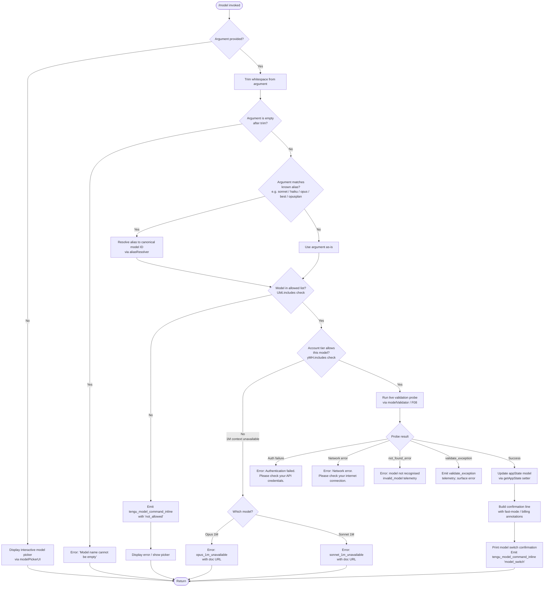

# `/model`

> Analysis basis: CC v2.1.148 bundle.js (AST extraction + Claude interpretation)
> Minimum version: v2.1.148

---

## Overview

The `/model` command allows the user to switch the AI model used by Claude Code during a session. When invoked with a model name argument, it validates the specified model (including account-tier eligibility checks and an optional live API probe), updates application state, and prints a confirmation with contextual annotations such as fast-mode status and billing source. When invoked without an argument, it displays an interactive picker listing all available models for the current account.

---

## Registration

| Field | Value |
|---|---|
| type | `local` |
| name | `model` |
| description | Set the AI model for Claude Code |
| argumentHint | `<model>` |
| supportsNonInteractive | `true` |
| module_id | `fR1` |
| load_inline | `true` |
| loc_byte | `12139545` |
| loc_byte_end | `12139719` |
| loc_line | `9968` |
| arbor_handler.name | `TQ7` |
| arbor_handler.fqn | `claude-2.1.148::TQ7` |
| arbor_handler.kind | `AsyncFunction` |
| arbor_handler.resolution_path | `module_id` |
| arbor_handler.n_hits | `0` |

Analysis basis: CC v2.1.148 bundle.js:+12139545

---

## Input Branching

Four distinct paths exist depending on whether an argument is provided, whether the model is in the known-alias list, whether account-tier eligibility passes, and whether the live validation call succeeds.



Analysis basis: CC v2.1.148 bundle.js:+12131356 (trim), +12131372 (Ub6 check), +12131459 (yMH check), +12131512 (inline telemetry), +12093062 (empty-name error), +12093204 (not_found check)

---

## Behavioral Spec

### 1. Entry Point — Handler (`TQ7`)

The Arbor-resolved handler is the async function `TQ7` (fqn `claude-2.1.148::TQ7`), reached via `module_id → fR1`.

```
async function modelCommandHandler(argument, context):
    trimmed = argument.trim()                         // +12131356
    if trimmed is empty:
        return error("Model name cannot be empty")    // +12093062

    if not allowedModelsList.includes(trimmed):       // +12131372
        emitTelemetry("tengu_model_command_inline",
                       { result: "not_allowed" })     // +12131514
        showModelPicker(context)
        return

    appState = context.getAppState()                  // +12131395

    validationResult = await validateModel(trimmed, appState)  // +12131439

    if not extendedContextAllowed.includes(trimmed):  // +12131459
        return showUnavailableError(trimmed)

    updateAppStateModel(appState, trimmed)            // implied by +12131395 setter
    printConfirmation(trimmed, appState)              // +12131579
    emitTelemetry("tengu_model_command_inline",
                   { result: "model_switch" })        // +12094823
```

Analysis basis: CC v2.1.148 bundle.js:+12131356–+12131579

---

### 2. Alias Resolution (`lq`)

A set of short aliases map to full model identifiers. Resolution trims, lower-cases, and replaces the alias token with the canonical model string.

Known aliases found in literals:

| Alias | Meaning |
|---|---|
| `sonnet` | Latest Sonnet model |
| `haiku` | Latest Haiku model |
| `opus` | Latest Opus model |
| `best` | Highest-capability model available |
| `opusplan` | Opus in plan mode, else Sonnet (`+2170590`) |
| `[1m]` | 1 M-token context suffix (`+2172058`) |

```
function resolveAlias(raw):
    s = raw.trim().toLowerCase()               // +2171936, +2171947
    s = applyGatewayReplacements(s)            // GW helper +2171965
    s = s.replace(alias pattern)              // +2171975
    s = applyContextWindowSuffix(s)           // C9H +2172011
    s = resolveTierShorthand(s)               // yv +2172050
    s = resolveSpecialAliases(s)              // kmH +2172127, kv +2172165, A99 +2172202
    s = applyPlanModeLogic(s)                 // W3 +2172220, Sd6 +2172226, ymH +2172234
    s = s.replace(remaining pattern)          // +2172278
    return s
```

Special alias `opusplan`: resolves to `opus` during plan-mode sessions, `sonnet` otherwise (literal at +2170607: "Opus in plan mode, else Sonnet").

Analysis basis: CC v2.1.148 bundle.js:+2171936

---

### 3. Model Validation Probe (`F08` / `modelValidator`)

When a model name passes the allow-list check, a lightweight API call is sent to verify the model is accessible for the account. The probe uses a minimal "Hi" message with `ephemeral` cache control and a `side_query` classification.

```
async function validateModel(modelId, appState):
    if modelId is empty:                                   // +12093025
        return error("Model name cannot be empty")

    candidates = buildModelList(modelId)                   // FF +12093096
    modelLower = modelId.toLowerCase()                     // +12093185

    if not recognisedFamilies.includes(modelLower):        // R9H.includes +12093204
        return { ok: false, reason: "not_found_error" }

    if validationCache.has(modelId):                       // wS1.has +12093306
        return validationCache.get(modelId)

    probe = {
        model: modelId,
        messages: [{ role: "user", content: "Hi" }],      // +12093436, +12093470
        cache: "ephemeral",                                // +12093495
        queryType: "side_query"                            // +12891744
    }

    result = await apiCall(probe)                          // rb +12093351

    validationCache.set(modelId, result)                   // wS1.set +12093514
    return result
```

Error handling within the probe (`rb`):

| Condition | Message |
|---|---|
| HTTP auth failure | `"Authentication failed. Please check your API credentials."` (+12093761) |
| Network failure | `"Network error. Please check your internet connection."` (+12093863) |
| API `not_found_error` type | Model flagged as `invalid_model` (+12094064, +12093982) |
| Unknown exception | `validate_exception` telemetry emitted (+12095582) |

Analysis basis: CC v2.1.148 bundle.js:+12093025–+12093514

---

### 4. Extended-Context (1 M) Eligibility Guard (`Cg7` / `bg7`)

Two guards run after the allow-list check for models requesting 1 M context windows.

```
function checkOpus1MAvailability(modelId, appState):
    if modelId.toLowerCase() indicates opus-1m:            // +12096642
        if not accountAllows1MOpus(appState):              // UHH +12096665
            emitEvent("opus_1m_unavailable")               // +12094985
            showError(
              "Opus with 1M context is not available for your account. " +
              "Learn more: https://code.claude.com/docs/en/model-config#extended-context-with-1m"
            )                                              // +12095023
            return false
    return true

function checkSonnet1MAvailability(modelId, appState):
    if modelId matches "sonnet[1m]" or "sonnet-4-6[1m]":  // +12096782, +12096808
        if not accountAllows1MSonnet(appState):            // lKH +12096763
            emitEvent("sonnet_1m_unavailable")             // +12095202
            showError(
              "Sonnet 4.6 with 1M context is not available for your account. " +
              "Learn more: https://code.claude.com/docs/en/model-config#extended-context-with-1m"
            )                                              // +12095242
            return false
    return true
```

Analysis basis: CC v2.1.148 bundle.js:+12094985, +12095202

---

### 5. Model Picker UI (`Nl_`)

When no argument is given (or the model is not in the allowed list), an interactive picker is rendered.

```
function renderModelPicker(appState):
    currentModel = appState.model                         // Nl_ +12095809
    availableModels = buildAvailableList(appState)        // A +12095822

    for each model in availableModels:
        label  = formatModelLabel(model)                  // bH +12095884
        bold   = P6.bold(label)                           // +12095925
        detail = buildDetailLine(model, appState)         // Sy +12095933

    annotations = []
    if fastModeActive:
        annotations.push(" · Fast mode ON")              // +12096050
    if billingSource == "usage_credits":
        annotations.push(" · Draws from usage credits")  // +12096101
    if not fastModeActive:
        annotations.push(" · Fast mode OFF")             // +12096147

    settingsSource = resolveSettingsSource()              // Sg7 +12096179
    // settings source display order:
    //   projectSettings  (+12096307)
    //   localSettings    (+12096330)
    //   policySettings   (+12096351)
    //   "Managed settings" label (+12096453)

    render picker with annotations and settings-source footnote
```

Settings source file paths referenced:
- `.claude/settings.json` (+1205919, +1205929)
- `.claude/settings.local.json` (+1205991)

Analysis basis: CC v2.1.148 bundle.js:+12095765–+12096179

---

### 6. Account-Tier Model Filtering (`WW` / `modelTierFilter`)

The set of models shown in the picker (and accepted via argument) is gated by the user's subscription tier.

```
function filterModelsByTier(allModels, appState):
    tier = appState.accountTier   // values: "max", "team", "enterprise",
                                  //         "enterprise_usage_based", "firstParty"
                                  //         +2941653, +2941724, +2941739,
                                  //         +2941834, +2941856, +2170798

    if tier == "max" and plan includes "default_claude_max_5x":  // +2941739
        unlockMaxTierModels()

    if tier in ["enterprise", "enterprise_usage_based"]:
        unlockEnterpriseModels()

    // Provider routing flags used for display labelling:
    // "anthropicAws" (+2030270), "gateway" (+2030290),
    // "bedrock"      (+2029601), "foundry"  (+2029651),
    // "mantle"       (+2029761), "vertex"   (+2029809)

    return filteredList
```

Opus Plan model label: `"Opus Plan"` (+2170898), alias key `"opusplan"` (+2170590).

Analysis basis: CC v2.1.148 bundle.js:+2941646–+2941856

---

### 7. Confirmation Display (`Sg7`)

After a successful model switch, a confirmation line is assembled and printed.

```
function buildConfirmationLine(newModel, appState):
    line = "model: " + newModel                          // +12094064 prefix
    source = resolveSettingsSource(appState)             // zWH +12096287

    if source == "projectSettings":
        line += dim(" (project settings)")
    else if source == "localSettings":
        line += dim(" (local settings)")
    else if source == "policySettings":
        line += dim(" (managed settings)")              // +12096453

    line += bold(annotations)                           // P6.bold +12096511
    print(line)                                         // dl +12096519
```

Analysis basis: CC v2.1.148 bundle.js:+12096287–+12096519

---

## State & Side Effects

| Item | Detail |
|---|---|
| Telemetry — `tengu_model_command_inline` | Emitted on inline model switch; payload contains `result` field (`model_switch` or `not_allowed`) — +12131514 |
| Telemetry — `tengu_api_success` | Emitted when the live validation probe returns successfully — +12893195 |
| Telemetry — `tengu_feature_ok` | Emitted by sub-feature helper on clean path — +960829 |
| Telemetry — `tengu_feature_bad` | Emitted by sub-feature helper on error path — +960887 |
| appState changes | `appState.model` updated to new canonical model ID after successful validation — +12131395 |
| Validation cache | `wS1` (Map) caches per-model probe results to avoid redundant API calls — +12093306, +12093514 |
| Network I/O | One `globalThis.fetch` call issued per uncached model validation — +12891797 |
| Max token limit for probe | 1024 tokens — +12891560 |
| Probe TTL hint | `"1h"` seen in literals — +12892594 |
| Settings files written | Model may be persisted to `.claude/settings.json` or `.claude/settings.local.json` depending on scope — +1205929, +1205991 |
| Sound | <!-- TODO: not found in depth-2 traversal; needs --depth 4 --> |

---

## Version History

| Version | Change |
|---|---|
| v2.1.148 | Initial analysis |

---

## Common Mistakes

1. **Passing a partial alias without understanding normalization.** The alias resolver lower-cases and trims before matching, so `"Sonnet"` and `"SONNET"` both work, but a trailing space in a script invocation will cause the empty-name guard to fire if the entire string is whitespace.
2. **Assuming the `[1m]` suffix is always available.** The `[1m]` extended-context suffix (e.g. `sonnet[1m]`, `opus[1m]`) is gated by account tier. Attempting to set these models on an ineligible account returns a hard error with a documentation URL rather than silently falling back.
3. **Reusing a cached validation result across sessions.** The `wS1` validation cache persists within a session. If credentials change mid-session, the cached "valid" response may allow a model that is no longer accessible.
4. **Confusing `opusplan` with `opus`.** The alias `opusplan` dynamically resolves to `opus` only when plan mode is active; in a normal session it resolves to the current Sonnet model. Using it outside plan mode will select Sonnet, not Opus.
5. **Expecting `supportsNonInteractive: true` to bypass validation.** Even in non-interactive mode the live API probe is still executed; a network or auth error will surface as a fatal error rather than a soft fallback.

---

## Appendix — Identifier Mapping

> For bundle debugging only. Identifiers change across versions.

| Identifier | Role |
|---|---|
| `TQ7` | Main async handler for `/model` command (Arbor-resolved entry point) |
| `H` | Generic string / helper variable used in trim / setTimeout paths |
| `_` | App-state / utility reference used throughout handler |
| `d08` | Intermediate model-resolution dispatcher |
| `Sy` | Model list builder, calls alias resolver and tier filter |
| `ML6` | Model list construction helper (calls alias resolver `lq` and provider helper `CJ`) |
| `CJ` | Provider routing constructor |
| `lq` | Alias resolver — normalises short model names to canonical IDs |
| `WW` | Account-tier model filter; determines available model set |
| `GA` | Provider metadata helper used by tier filter |
| `gs` | Tier check sub-helper (max tier) |
| `W3H` | Tier check sub-helper (team / max-5x tier) |
| `hmH` | Tier check sub-helper (enterprise tiers) |
| `kv` | Model label formatter |
| `tP` | Model detail-line builder (firstParty path) |
| `W3` | Display helper used by label formatter |
| `hA` | Low-level render helper |
| `gf` | Model capability flags helper |
| `yv` | Alias shorthand resolver (tier-based) |
| `c` | Core context/config accessor |
| `jS1` | Orchestrator that sequences validation + picker display |
| `vl_` | Model validation pipeline coordinator |
| `FF` | Builds candidate model list for API probe |
| `A` | Array/string helper variable |
| `f` | Settings/config lookup helper |
| `K` | Model display formatter (padEnd for alignment, width 40) |
| `q` | Collection helper variable |
| `AQ6` | Object-entries iteration helper used in model list building |
| `ImH` | Context-window include-check helper |
| `_99` | Model index-of lookup helper |
| `W24` | Model include / alias sub-resolver |
| `C9H` | Context-window suffix normaliser |
| `G24` | Model ID prefix matcher (handles `claude-` prefix) |
| `mH` | Feature-flag sub-helper (calls core config accessor `c`) |
| `Cg7` | Opus 1 M eligibility guard |
| `UHH` | Account entitlement checker used by Opus 1 M guard |
| `bg7` | Sonnet 1 M eligibility guard |
| `lKH` | Account entitlement checker used by Sonnet 1 M guard |
| `Rg7` | Recognised-family include check (pre-probe gate) |
| `F08` | Model validation probe dispatcher (wraps `rb`) |
| `rb` | Raw API call executor for model probe |
| `yg7` | Post-validation result formatter / cache writer |
| `ZH` | String conversion utility |
| `Nl_` | Interactive model picker renderer |
| `bH` | Model label builder (used in picker rows) |
| `vK` | Picker row renderer helper |
| `UH` | String helper used in row rendering |
| `J3H` | Picker layout helper |
| `CD` | Model detail compositor (fast-mode / credits annotations) |
| `Ql` | Picker item highlight helper |
| `ejH` | Fast-mode annotation builder |
| `bJ` | Billing-source annotation builder |
| `GW` | Usage-credit check helper |
| `Sg7` | Confirmation line builder (post-switch display) |
| `zWH` | Settings-source resolver used in confirmation |
| `m8` | Settings file path builder |
| `jC` | Path joiner (`.claude/settings*.json`) |
| `dl` | Output printer for confirmation line |

---

Note: index built via Arbor fallback; some signals (telemetry, literals) may be missing — see arbor-fallback.js.