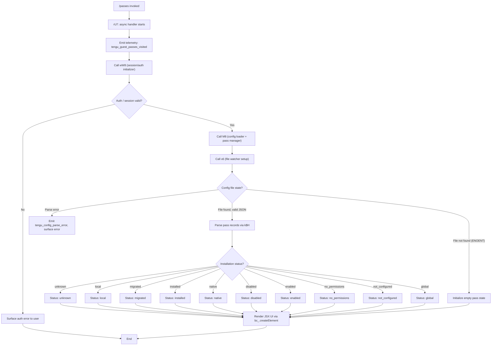

# `/passes`

> Analysis basis: CC v2.1.148 bundle.js (AST extraction + Claude interpretation)
> Minimum version: v2.1.148

---

## Overview

The `/passes` command allows a Claude Code user to share a free week of Claude Code with friends via guest passes. It is a `local-jsx` command that renders a JSX UI component, reads and manages guest-pass state from the local configuration, and fires a telemetry event upon each visit. The command's handler is the async function resolved via module `kI1` (Arbor identifier `rU7`).

---

## Registration

| Field | Value |
|---|---|
| type | `local-jsx` |
| name | `passes` |
| description | `Share a free week of Claude Code with friends` |
| loc_byte | `11901223` |
| loc_byte_end | `11901545` |
| loc_line | `9723` |
| isHidden | `null` (not hidden) |
| module_id | `kI1` |
| load_inline | `true` |
| arbor_handler.name | `rU7` |
| arbor_handler.fqn | `claude-2.1.148::rU7` |
| arbor_handler.kind | `AsyncFunction` |
| arbor_handler.resolution_path | `module_id` |
| arbor_handler.n_hits | `2` |

Analysis basis: CC v2.1.148 bundle.js:+11901223

---

## Input Branching

The command's top-level handler (`rU7`) has three distinct execution paths: initial setup/config loading, JSX rendering of the passes UI, and telemetry emission. The inner config-management helper (`M8` / configuration-loader) has multiple further branches based on installation state. A Mermaid flowchart is used to represent the branching logic.



Analysis basis: CC v2.1.148 bundle.js:+11900906, +11900940, +11900946, +11901044, +11901095

---

## Behavioral Spec

### 1. Top-Level Handler (`rU7` — passes command main handler)

```
async function passesCommandHandler(context):
    emit telemetry("tengu_guest_passes_visited")          // +11901046
    sessionInfo = await initializeSession(context)        // wW8 → +11900940
    configState = await loadPassConfig(context)           // M8  → +11900946
    fileWatcher = setupFileWatcher(context)               // x6  → +11900906
    stateValue = resolveCurrentState(context)             // c   → +11901044
    return createElement(PassesUIComponent, {             // bc_.createElement → +11901095
        sessionInfo,
        configState,
        fileWatcher,
        stateValue
    })
```

Analysis basis: CC v2.1.148 bundle.js:+11900906

### 2. Session / Auth Initializer (`wW8`)

```
async function initializeSession(context):
    authContext = await buildAuthContext(context)         // I5 → +11531641
    fileWatchState = await setupWatchedConfig(authContext) // x6 → +11531689
    return { authContext, fileWatchState }
```

The auth context builder (`I5` → `mD`) reads the `ANTHROPIC_API_KEY` environment variable (literal: `"ANTHROPIC_API_KEY"`, +2924835) and checks for an OAuth token. If neither is present it throws an Error with a message indicating both env vars are required (literal fragment at +2925256). It also uses a `firstParty` flag (+2029885) to distinguish authentication paths.

Analysis basis: CC v2.1.148 bundle.js:+11531641, +2924835, +2925256

### 3. Config Loader and Pass Manager (`M8` — configuration loader)

```
async function loadPassConfig(context):
    rawConfig = readConfigSynchronous()                   // k$H → +3182042
    installationStatus = resolveInstallationStatus(rawConfig)
    // Status strings: "unknown","local","migrated","installed",
    //   "native","disabled","enabled","no_permissions",
    //   "not_configured","global"               // literals +3182521–+3182727
    pendingWrites = collectPendingWrites(rawConfig)       // Wf6 → +3182058
    stateContainer = buildStateContainer(context)         // c → +3182194
    historyList = resolveHistory(context)                 // HL_ → +3182308
    configEntries = buildConfigEntries()                  // yy9 → +3181936 (Object.entries)
    timestampedConfig = stampConfig()                     // tUH → +3181961 (Date.now)
    return {
        installationStatus,
        pendingWrites,
        configEntries,
        historyList,
        timestampedConfig
    }
```

Analysis basis: CC v2.1.148 bundle.js:+3181861

### 4. Raw Config File Reader (`k$H` — config file reader)

```
function readConfigSynchronous(configPath):
    if configPath is inaccessible:
        throw Error("Config accessed before allowed.")    // literal +3186803
    
    rawText = fs.readFileSync(configPath, "utf-8")        // +3186859, literal +3186886
    parsed = jsonParse(rawText)                           // B6 → JSON.parse +3186906
    
    normalized = normalizePrefix(parsed)                  // OC → +3186909
    // OC checks H.startsWith, then H.slice for prefix stripping
    
    type = determineType(parsed)                          // _ → +3186926
    converted = String(value)                             // +3186980
    
    try:
        backupDir = resolveBackupDirectory()              // hy9 → +3187049
        // hy9 uses UY.basename, AL_ (UY.join, o8), _.readdirStringSync,
        // checks f.startsWith, UY.dirname, _.statSync
    catch err if err.code === "ENOENT":                   // literal +3187033
        // silently continue — no backup directory yet
    
    buildAPIRequest(config)                               // N → +3187284
    renderOutput(result)                                  // RH → +3187381
    
    if stat fails:
        log error("error")                                // literal +3187354
    
    stat = fs.statSync(configPath)                        // +3187400
    fallbackValue = c(context)                            // +3187438
    
    basename = path.basename(configPath)                  // +3187592
    backupPath = resolveAltPath(basename)                 // AL_ → +3187609
    fs.mkdirSync(backupPath)                              // +3187619
    
    entries = fs.readdirStringSync(dir)                   // +3187677
    // filter entries that do NOT startsWith expected prefix  // +3187712
    
    destPath = path.join(dir, name)                       // +3187831
    timestamp = Date.now()                                // +3187930
    fs.copyFileSync(src, destPath)                        // +3187948
    
    return parsed
```

Error constant note: `"Config accessed before allowed."` is the guard message at +3186803. The `"ENOENT"` string (+3187033) and `"EEXIST"` string (+3187654) are used for filesystem error-code checks. The `"saveGlobalConfig fallback: re-read config is missing auth…"` warning (+3182068) and corresponding `"saveConfigWithLock: re-read config is missing auth…"` (+3185186) guard against accidentally wiping authentication data.

Analysis basis: CC v2.1.148 bundle.js:+3186797

### 5. File Watcher Setup (`x6` — file watch manager)

```
function setupFileWatcher(context):
    initialValue = buildInitialValue(MG, o4_, k$H)       // +3183687–+3183724
    timestamp = Date.now()                                // +3183776
    watchHandle = setupWatchedFile(EQ4, context)          // EQ4 → +3183829
    return watchHandle

function watchedFileSetup(onChange, context):
    // EQ4 internals:
    watchObject = MG(initialConfig)                       // +3183194
    watcher = fs.watchFile(configPath, callback)          // ws6.watchFile → +3183199
    on change:
        newValue = computeNewValue(vq, OC, o4_)           // +3183363–+3183424
        notify(Tn)                                        // +3183432
        register(r9)                                      // D9A.register → +3183513
    on stop:
        fs.unwatchFile(configPath)                        // ws6.unwatchFile → +3183526
    return watchObject
```

Analysis basis: CC v2.1.148 bundle.js:+3183687

### 6. Backup Directory Resolver (`hy9` — backup path resolver)

```
function resolveBackupDirectory(configPath):
    base = path.basename(configPath)                      // +3186411
    dir  = resolveAltPath(base)                           // AL_ → +3186428
    // AL_ = path.join(root, "backups") + o8             // literal "backups" +3186371
    
    entries = fs.readdirStringSync(dir)                   // +3186444
    filtered = entries.filter(e => e.startsWith(prefix)) // +3186479
    
    joined = path.join(dir, entry)                        // +3186535
    parentDir = path.dirname(joined)                      // +3186561
    
    if entry.startsWith(expectedPrefix):                  // +3186620
        stat = fs.statSync(joined)                        // +3186720
    
    return resolvedBackupPath
```

Analysis basis: CC v2.1.148 bundle.js:+3186404

### 7. API Request Builder (`N` — API request builder)

```
function buildAPIRequest(config):
    debugLevel = "debug"                                  // literal +201876
    
    requestPayload = buildPayload(Q_6, vJK)              // +201900, +201918
    // vJK: calls Av, VJK, j9A                          // +200509–+200636
    
    if payload includes certain marker:                   // H.includes → +201940
        headerValue = CH(payload)                        // JSON.stringify → +201958
    
    uppercased = value.toUpperCase()                     // _.toUpperCase → +202002
    formatted  = formatMessage(f4, config)               // +202022
    // f4: calls l1A, H.replace, q.at, A.lastIndexOf, A.slice   // +193922–+194111
    // "[REDACTED]" literal used for sensitive data masking      // +194001
    
    trimmed = value.trim()                               // +202025
    checked = hI(trimmed)                                // +202041
    
    logEntry = lRH(config)                               // +202047
    // lRH → b1A                                        // +189952
    
    chunkSizeLimit = 1000                                // literal +201707
    chunkCount     = 100                                 // literal +201726
    
    requestWriter = kJK(config)                          // +202061
    // kJK: XRH, XAH, path.dirname, Av, F6, C_6, e1A,
    //      t1A, Buffer.byteLength, _KA, Ny6.then,
    //      IJK.bind, r9                                // +201388–+201751
    
    return requestPayload
```

Analysis basis: CC v2.1.148 bundle.js:+201900

### 8. Output Renderer (`RH` — output renderer / display)

```
function renderOutput(data):
    errorWrapper = n_(data)                              // +965923
    // n_: Error, String conversions                   // +172092–+172098
    
    displayItem = UH(data)                              // String conversion → +965936
    
    historyEntry = j1(data)                             // XwA → +966182
    
    queueItem = FpK(data)                               // +966265
    // FpK: lb6.shift, lb6.push (queue management)    // +965603–+965615
    
    outputBuffer.push(result)                           // bbH.push → +966283
    
    if error:
        Gl.logError(error)                              // +966323
    
    return rendered
```

Analysis basis: CC v2.1.148 bundle.js:+965923

### 9. Atomic Config Write with Lock (`_L_` — locked config writer)

```
async function writeConfigWithLock(config):
    parentDir = path.dirname(configPath)               // +3184565
    logFn = F6(context)                               // +3184581
    fs.mkdirSync(parentDir, {recursive:true})          // L.mkdirSync → +3184586
    
    timestamp = Date.now()                             // +3184631
    metaRecord = buildMetaRecord(n99, config)          // +3184644
    // n99: calls et8 → l99, then Object.assign        // +2208144, +2208171
    
    apiResult = buildAPIRequest(config)                // N → +3184686
    stateContainer = buildStateContainer(context)      // c → +3184857
    configSnapshot = MG(config)                        // +3184920
    
    stat = fs.statSync(lockPath)                       // L.statSync → +3184935
    
    // Lock contention guard:
    if lock held too long:
        emit telemetry("tengu_config_lock_contention") // +3184859
        warn("Lock acquisition took longer than expected…") // literal +3184770
    
    emit telemetry("tengu_config_stale_write")         // +3184995
    
    configWriter = k$H(config)                        // +3185148
    pendingState = Wf6(config)                         // +3185170
    
    // Auth-loss prevention:
    if reReadConfig is missing auth that cache has:
        emit telemetry("tengu_config_auth_loss_prevented") // +3185338
        warn("saveConfigWithLock: re-read config is missing auth…") // literal +3185186
    
    // Backup rotation:
    entries = fs.readdirStringSync(backupDir)          // L.readdirStringSync → +3185548
    // filter entries starting with expected prefix    // +3185583
    index = Number(parts)                              // +3185641
    parts = entry.split(separator)                     // X.split → +3185648
    // keep newest 5 backups                           // literal 5 → +3185789
    
    destPath = path.join(backupDir, name)              // +3185724
    fs.copyFileSync(src, destPath)                     // L.copyFileSync → +3185763
    
    // Trim old backups beyond retention limit:
    sliced = entries.slice(0, cutoff)                  // V.slice → +3185892
    fs.unlinkSync(old)                                 // L.unlinkSync → +3185907
    
    // Atomic write via temp file:
    symlinkResolver = sq6(path)                        // +3186029
    // sq6: readlinkSync, isAbsolute, resolve, dirname,
    //      closeSync, openSync (random temp name, 6 bytes hex),
    //      writeFileSync, fchmodSync (permissions 384 = 0o600),
    //      fsyncSync, renameSync, unlinkSync
    // Permission constant 0o600 = 384               // literal +3186071
    
    fileHandle = M(path)                               // +3186109
    return fileHandle
```

Analysis basis: CC v2.1.148 bundle.js:+3184559

---

## State & Side Effects

| Item | Detail |
|---|---|
| Telemetry — `tengu_guest_passes_visited` | Fired once every time `/passes` is invoked (+11901046) |
| Telemetry — `tengu_config_parse_error` | Fired when the passes config file cannot be parsed (+3187440) |
| Telemetry — `tengu_config_lock_contention` | Fired when config lock is held longer than expected (+3184859) |
| Telemetry — `tengu_config_stale_write` | Fired when a stale config write is detected (+3184995) |
| Telemetry — `tengu_config_auth_loss_prevented` | Fired when a write would have wiped cached auth (+3185338) |
| Telemetry — `tengu_bg_dispatch_sigkill_escalate` | Fired from background-process manager reached via `w` call graph (+15117585) |
| Telemetry — `tengu_feature_bad` / `tengu_feature_ok` | Feature-flag probe events emitted by helpers `mH`/`bH` (+960887, +960829) |
| Telemetry — `tengu_bg_low_mem_mb` | Low-memory warning from background session subsystem (+12461545) |
| Telemetry — `tengu_bg_dispatch_low_mem` | Low-memory dispatch event (+15118164) |
| Telemetry — `tengu_bg_spare_enable` | Background spare process enabled event (+15118859) |
| Telemetry — `tengu_bg_spare_claim` | Spare session claimed event (+15118980) |
| Telemetry — `tengu_bg_spare_spawn` | Spare session spawned event (+15117278) |
| Telemetry — `tengu_bg_spare_claim_fail` | Spare claim failed event (+15119243) |
| Telemetry — `tengu_bg_sendclaim_failed` | Background send-claim failed event (+15098686) |
| File system reads | `fs.readFileSync` (config), `fs.readdirStringSync` (backup dir), `fs.statSync` (lock/config) |
| File system writes | `fs.copyFileSync` (backup), `fs.writeFileSync` + `fs.renameSync` (atomic write), `fs.unlinkSync` (old backups, temp files), `fs.mkdirSync` |
| File watch registration | `fs.watchFile` on config path; unregistered via `fs.unwatchFile` on stop (`EQ4`) |
| Config lock | Lock-acquisition contention tracked with `Date.now` timestamps; contention logged and telemetry emitted |
| Auth-loss guard | Refuses to overwrite `~/.claude.json` if re-read is missing auth fields the cache has (GH #3117) |
| JSX component render | `bc_.createElement` used to build the passes UI component returned to the CLI host |
| Background session subsystem | `M8` → `w` call chain touches background-daemon infrastructure (spawn, claim, kill, file-based IPC) |
| appState changes | Guest-pass state read/written through the locked config mechanism; no direct in-memory appState mutation observed at depth ≤ 2 |
| Sound | <!-- TODO: not found in depth-2 traversal; needs --depth 4 --> |

---

## Version History

| Version | Change |
|---|---|
| v2.1.148 | Initial analysis |

---

## Common Mistakes

1. **Invoking `/passes` before authentication is set up** — the handler checks for `ANTHROPIC_API_KEY` or an OAuth token early in `wW8`→`mD`→`r$`; if neither is present the command surfaces an error before rendering any UI. Ensure the environment variable or OAuth flow is completed first.
2. **Concurrent Claude Code instances writing config simultaneously** — the locked config writer (`_L_`) detects lock contention and emits `tengu_config_lock_contention`. Running multiple Claude Code processes against the same `~/.claude.json` can trigger this warning and delay pass state updates.
3. **Deleting the backup directory** — `k$H` silently continues when the backup directory is absent (`ENOENT`), but unexpected deletion of the parent config directory will cause a hard error because the guard `"Config accessed before allowed."` is evaluated before any read.
4. **Expecting immediate file updates** — config writes are atomic (write to temp → `fsync` → rename), so the new state is not visible until the rename completes. File watchers (`EQ4` via `fs.watchFile`) only fire after the rename, so UI refreshes may lag briefly.
5. **Misreading the installation-status values** — the status enum contains ten distinct string values (`"unknown"`, `"local"`, `"migrated"`, `"installed"`, `"native"`, `"disabled"`, `"enabled"`, `"no_permissions"`, `"not_configured"`, `"global"`); code that checks only a subset will silently fall through to a default branch.

---

## Appendix — Identifier Mapping

> For bundle debugging only. Identifiers change across versions.

| Identifier | Role |
|---|---|
| `rU7` | Passes command main async handler (Arbor-resolved entry point) |
| `x6` | File watcher setup / watched-config factory |
| `F6` | Logging / context factory utility |
| `o4_` | Initial value builder for watched config |
| `k$H` | Raw config file reader with backup logic |
| `q` | Filesystem module reference (readFileSync, statSync, mkdirSync, etc.) |
| `B6` | JSON parse wrapper |
| `OC` | Prefix normalization helper (startsWith / slice) |
| `H` | String/value utility with Math.random and setTimeout |
| `_` | Filesystem utility (readdirStringSync, statSync, toUpperCase) |
| `q8` | Shared utility / state accessor |
| `hy9` | Backup directory resolver |
| `AL_` | Backup path builder (path.join + o8) |
| `f` | Feature-flag / MCP tool map accessor |
| `$` | Symbol/path utility (startsWith, ZC1) |
| `N` | API request builder |
| `vJK` | Request payload constructor (calls Av, VJK, j9A) |
| `CH` | JSON.stringify wrapper |
| `f4` | Message formatter (replace, at, lastIndexOf, slice) |
| `lRH` | Log-record builder → b1A |
| `kJK` | Request writer (Buffer.byteLength, streaming, bind) |
| `RH` | Output renderer / display |
| `n_` | Error/string conversion wrapper |
| `UH` | String conversion utility |
| `j1` | History-entry builder → XwA |
| `FpK` | Output queue manager (shift/push) |
| `c` | State container builder |
| `w` | Background session / process dispatch manager |
| `A` | Process map / toLowerCase utility |
| `C` | Background session process object |
| `mH` | Feature-flag "bad" probe helper |
| `bH` | Feature-flag "ok" probe helper |
| `sG8` | Memory / OS info collector (macos, 1024 KB unit) |
| `T$6` | Config file reader for background sessions (readFile, JSON parse, filter) |
| `g` | Settled-session filter (oH.filter, vH.has) |
| `V6` | Watcher/process registry (Df6, wf6, Ct, zf6, Pg) |
| `v6A` | Background session connector (KB.claim, EN8.connect, M.on/once/write) |
| `S6A` | Session lifecycle manager (add/delete, rm, unlink, roster, setTimeout) |
| `L` | Session queue helper (add/finally/delete) |
| `D` | Background dispatch loop (V6, sG8, freemem, Date.now, recursive) |
| `S` | Disposable resource handle |
| `EQ4` | Watched-file change handler (watchFile/unwatchFile, OC, Tn, r9) |
| `Tn` | Change notification dispatcher |
| `r9` | Disposable registration → D9A.register |
| `wW8` | Session / auth initializer (calls I5, x6) |
| `I5` | Auth context builder (calls mD, x6) |
| `mD` | Credential resolver (cK, Uv, EO, XA, GJ, r$, ZqH) |
| `cK` | Credential key formatter → UH |
| `Uv` | OAuth/API-key checker ($Q6, cK, ZqH, gl, Bv, UH) |
| `EO` | First-party flag handler → hA |
| `GJ` | Auth type classifier |
| `r$` | Credential validation and error throwing (ANTHROPIC_API_KEY, apiKeyHelper) |
| `ZqH` | Token normalizer (UH, VMH) |
| `M8` | Config loader and pass manager entry point |
| `_L_` | Locked config writer with backup rotation and atomic write |
| `n99` | Meta-record builder (et8 → l99, Object.assign) |
| `et8` | Record base constructor → l99 |
| `Wf6` | Pending-write state tracker |
| `Z` | Entry prefix filter reference |
| `X` | Parallel SDK connection manager (YN8, jy, PU, Promise.all, RH, n_) |
| `YN8` | SDK connection factory |
| `V` | Backup entries array (sliced for retention) |
| `sq6` | Atomic file writer (temp name, fchmod 0o600, fsync, rename) |
| `O` | Symlink/stat result object (isSymbolicLink, v8) |
| `J8` | Utility with q8 dependency |
| `M` | Socket/stream handle (close, L) |
| `sUH` | Config supplement loader |
| `yy9` | Config entries enumerator → Object.entries |
| `tUH` | Config timestamper → Date.now |
| `HL_` | History list builder (dirname, F6, lE, CH, sq6) |