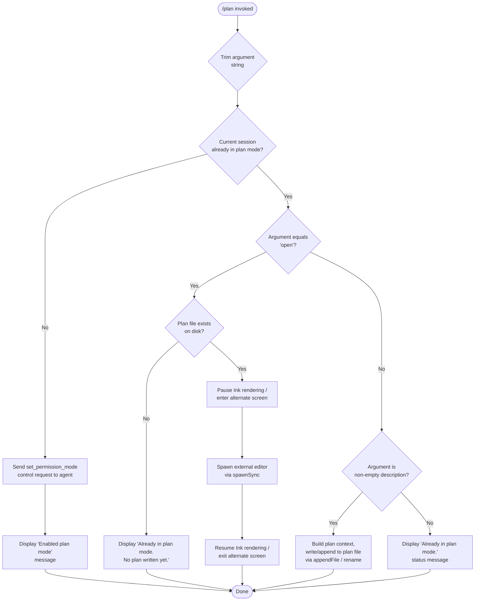

# `/plan`

> Analysis basis: CC v2.1.147 bundle.js (AST extraction + Claude interpretation)
> Minimum version: v2.1.147

---

## Overview

The `/plan` command enables **plan mode** for the current Claude Code session, or opens the session's existing plan document in an external editor. When plan mode is not yet active, the command sends a `set_permission_mode` control request to the agent; when already active, it either reports the current state or launches an editor to view/edit the plan file. The command is implemented as a `local-jsx` handler (`UU7`) that coordinates permission-mode transitions, file I/O, and terminal UI rendering.

---

## Registration

| Field | Value |
|---|---|
| type | `local-jsx` |
| name | `plan` |
| description | Enable plan mode or view the current session plan |
| argumentHint | `[open\|<description>]` |
| module_id | `DI1` |
| load_inline | `true` |
| loc_byte | `11889852` |
| loc_byte_end | `11890051` |
| loc_line | `9727` |
| arbor_handler.name | `UU7` |
| arbor_handler.fqn | `claude-2.1.147::UU7` |
| arbor_handler.kind | `AsyncFunction` |
| arbor_handler.resolution_path | `module_id` |
| arbor_handler.n_hits | `0` |

Analysis basis: CC v2.1.147 bundle.js:+11889852

---

## Input Branching

The command has 5+ distinct paths based on current mode state, the `open` sub-command keyword, and whether a plan file exists. A Mermaid flowchart is mandatory here.



Analysis basis: CC v2.1.147 bundle.js:+11888726 – +11889629

---

## Behavioral Spec

### 1. Entry Point — Handler Dispatch (`UU7`)

The Arbor-resolved handler `UU7` is an `AsyncFunction` reached via `module_id → DI1`.

```
async function planCommandHandler(context):
    rawArg   = context.argument
    trimmed  = rawArg.trim()                        // A.trim  (+11889232)

    permMode = getCurrentPermissionMode(context)    // q       (+11888726)
    settings = getSessionSettings(context)          // t3      (+11888759)
    appState = getAppState(context)                 // Sa      (+11888798)

    if permMode is NOT "plan":
        sendControlRequest(context,                 // f.sendControlRequest (+11888934)
            type: "set_permission_mode",            // literal (+11888964)
            value: "plan")
        displayMessage("Enabled plan mode")         // literal (+11889002)
        return

    // Already in plan mode
    if trimmed == "open":                           // literal (+11889251)
        planFilePath = resolvePlanFilePath(context) // DE      (+11889368)
        if planFilePath exists:
            openPlanInEditor(context, planFilePath) // gU      (+11889511)
        else:
            displayMessage("Already in plan mode. No plan written yet.")
                                                    // literal (+11889410)
        return

    if trimmed is non-empty (not "open"):
        buildAndWritePlanContent(context, trimmed)  // bNH     (+11888850)
        return

    // trimmed is empty, already in plan mode
    displayMessage("Already in plan mode.")         // literal (+11889030)
    return
```

Analysis basis: CC v2.1.147 bundle.js:+11888726

---

### 2. Permission-Mode Resolution (`q` / `getPermissionModeSync`)

Called at the very start of `UU7` to determine whether the session is already in plan mode.

```
function getPermissionModeSync(sessionContext):
    // Reads current mode from session state.
    // If mode is "plan", returns truthy.
    // Uses HfK.unlinkSync internally for temp-file cleanup.
    return sessionMode                              // q  (+11888726)
                                                    // HfK.unlinkSync (+15096468)
```

Analysis basis: CC v2.1.147 bundle.js:+11888726

---

### 3. Settings Resolution (`t3` / `getSessionSettings` → `NXH`)

```
function getSessionSettings(context):
    // Resolves layered configuration:
    //   policySettings  (+1217029)
    //   userSettings    (+1217180)
    //   localSettings   (+1217227)
    //   flagSettings    (+1217275)
    // Returns merged settings object.
    return mergedSettings                           // t3 → NXH (+11888759, +4070004)
```

Analysis basis: CC v2.1.147 bundle.js:+11888759

---

### 4. Permission-Mode Enforcement (`Ef` / `applyPermissionMode`)

Handles the `set_permission_mode` action, including bypass-permissions guard.

```
function applyPermissionMode(modeRequest, sessionState):
    if modeRequest == "bypassPermissions"           // literal (+4623668)
       AND bypassPermissions not available:
        log("Ignoring permission update: setMode 'bypassPermissions' rejected …")
                                                    // literal (+4623734)
        return

    action = modeRequest.action                     // "setMode" (+4623646)

    switch action:
        case "addRules":                            // literal (+4624010)
            for each rule in payload:
                if ruleType == "allow":             // literal (+4624195)
                    append to alwaysAllowRules      // literal (+4624203)
                elif ruleType == "deny":            // literal (+4624235)
                    append to alwaysDenyRules       // literal (+4624242)
                else:
                    append to alwaysAskRules        // literal (+4624260)

        case "replaceRules":                        // literal (+4624358)
            replace rule set wholesale

        case "addDirectories":                      // literal (+4624669)
            add entries to allowed-directory list

        case "removeRules":                         // literal (+4625015)
            filter out matching rules               // K.filter (+4625325)
            check membership via L.has             // (+4625340)

        case "removeDirectories":                   // literal (+4625399)
            delete directory entry                  // A.delete (+4625627)

    persistUpdatedSettings(sessionState)
```

Analysis basis: CC v2.1.147 bundle.js:+11888847

---

### 5. Plan Content Build & Write (`bNH` / `buildAndWritePlanContent`)

Invoked when the user supplies a description argument while already in plan mode.

```
function buildAndWritePlanContent(context, descriptionText):
    // Step 1 – build the list of permitted-tool strings
    toolList = buildToolDisplayList(context)        // yLH (+10205204)
               // iterates Object.entries of tool map (+10196282)
               // calls applyPermissionMode (Ef) for each entry (+10196332)

    // Step 2 – build context object: allowed-tool sources,
    //           cliArg tools (--allowed-tools literal +10194074),
    //           session-scoped tools (+10195315)
    contextObj = buildPermissionContext(context)    // ld  (+10205298)
                 // iterates entries, calls formatToolEntry (Mz) (+10195698)
                 // Mz applies substring / replaceAll escaping
                 // calls LM1 to resolve session-tool details

    // Step 3 – assemble final plan entry
    planEntry = assemblePlanEntry(contextObj,       // mm_ (+10195763)
                    descriptionText)
                // includes relative path of relevant files (um_, t51.relative)
                // includes match patterns via q.match (+10193885)

    // Step 4 – persist to disk
    writeOrAppendPlanFile(planEntry)                // kJK (+202061) via N (+201900)
        // ensures directory exists (yI.mkdir +201142)
        // appends with yI.appendFile (+201201)
        // renames .txt temp file when buffer size threshold met (+200898)
        // measures byte length via Buffer.byteLength (+201596, +201294)

    // Step 5 – emit info-level log entry
    logPlanActivity("info")                         // literal (+10205400)
```

Analysis basis: CC v2.1.147 bundle.js:+11888850

---

### 6. Open Plan in External Editor (`gU` / `openPlanInEditor`)

Invoked when the argument is `"open"` and a plan file exists on disk.

```
async function openPlanInEditor(context, planFilePath):
    inkInstance = getInkInstance(context)           // F6  (+11041743)
    if inkInstance is null:
        throw Error("Ink instance not found - cannot pause rendering")
                                                    // literal (+11041791)

    editorBin = resolveEditorBinary(context)        // sI7 → VF_ (+11041932)
                // uses lX8.basename to find binary name (+11040288)
                // checks lI7.find for known editor list (+11040319)

    // Suspend terminal UI
    inkInstance.enterAlternateScreen()              // (+11041944)
    inkInstance.pause()                             // (+11041974)
    inkInstance.suspendStdin()                      // (+11041984)

    // Spawn the editor synchronously
    editorArgs = buildEditorArgs(editorBin,         // LP  (+11889604)
                     planFilePath)
                 // normalises name to lowercase (+5250838)
                 // detects IDE environment ("IDE" literal +5250783)

    result = Uj1.spawnSync(editorBin, editorArgs,  // (+11042066)
                 { stdio: "inherit" })              // literal (+11042098)

    // Read back any changes
    updatedContent = _.readFileSync(planFilePath,   // (+11042368)
                         "utf-8")                  // literal (+12671128)

    // Restore terminal UI
    inkInstance.exitAlternateScreen()               // (+11042446)
    inkInstance.resumeStdin()                       // (+11042475)
    inkInstance.resume()                            // (+11042491)
```

Analysis basis: CC v2.1.147 bundle.js:+11889511

---

### 7. Plan File Path Resolution (`DE` / `resolvePlanFilePath`)

```
function resolvePlanFilePath(context):
    basePath = h6(context)                          // h6  (+12670975)
               // calls oV to get project root     // (+39784)

    segments = qB.join(basePath, …)                 // qB.join (+12670994)
    // normalises separator (Sz +12671002)
    // handles .txt suffix check (+200846)
    // slices last 4 chars for extension strip (+200857, literal 4 +200868)
    return resolvedFilePath
```

Analysis basis: CC v2.1.147 bundle.js:+11889368

---

### 8. JSX Output Rendering (`eyq` / `renderPlanOutput`)

The `local-jsx` type means the handler returns a React element tree.

```
function renderPlanOutput(message, context):
    // Wraps text output in Ink/React element
    stream = VnH(message)                           // VnH (+7476751)
             // attaches K.on("data", …) listener  // (+7476537)
             // converts buffer via M.toString      // (+7476574)
             // uses _p / Of_ to create element     // CU9.createElement (+3741735)

    stripped = y5(stream)                           // y5  (+7476767)
               // Bun.stripANSI to remove colour    // (+3740126)

    return IE.createElement(outputElement,          // IE.createElement (+11889629)
               { children: stripped })
```

Analysis basis: CC v2.1.147 bundle.js:+11889625

---

## State & Side Effects

| Item | Detail |
|---|---|
| Telemetry | None detected in depth-2 traversal (`telemetry: []`) |
| Permission-mode transition | Sends `set_permission_mode` control request (`f.sendControlRequest` at +11888934) when not already in plan mode |
| App-state reads | Reads current permission mode (`q` +11888726), session settings (`t3` +11888759), and general app state (`Sa` +11888798) |
| Plan file writes | `yI.appendFile` (+201201) appends plan content; `yI.rename` (+200898) rotates temp `.txt` files; `yI.mkdir` (+201142) creates directory if absent |
| Plan file reads | `_.readFileSync` (+11042368) re-reads file after editor session |
| Terminal UI suspension | `enterAlternateScreen`, `pause`, `suspendStdin` called before editor spawn; reversed with `exitAlternateScreen`, `resumeStdin`, `resume` after |
| External process spawn | `Uj1.spawnSync` (+11042066) with `stdio: "inherit"` (+11042098) — blocks until editor exits |
| Logging | Emits `"info"`-level log entry (+10205400) after successful plan write; `"error"` level (+966298) on RH-path failures |
| `bypassPermissions` guard | Silently ignores `setMode bypassPermissions` when mode is unavailable; logs warning literal at +4623734 |

---

## Version History

| Version | Change |
|---|---|
| v2.1.147 | Initial analysis |

---

## Common Mistakes

1. **Running `/plan` when already in plan mode without an argument** — the command prints "Already in plan mode." and exits; it does not toggle plan mode off. To deactivate plan mode, use a different permission-mode command.
2. **Using `/plan open` before any plan has been written** — if no plan file exists on disk yet, the command displays "Already in plan mode. No plan written yet." rather than opening an editor. Write a description first (e.g. `/plan <description>`) to create the file.
3. **Editor not resolving** — `gU`/`openPlanInEditor` calls `sI7`→`VF_` to find the editor binary. If neither a standard terminal editor nor an IDE environment (`"IDE"` +5250783) is detected, the spawn may fail. Ensure `$EDITOR` or a supported IDE integration is configured.
4. **Assuming telemetry events are emitted** — the telemetry array is empty; no `tengu_*` events are fired by this command as of v2.1.147.
5. **Passing `bypassPermissions` as the mode argument** — this is silently rejected when `disableBypassPermissionsMode` is set or the session was not originally launched in bypass mode (literal at +4623734).

---

## Appendix — Identifier Mapping

> For bundle debugging only. Identifiers change across versions.

| Identifier | Role |
|---|---|
| `UU7` | Main `/plan` command handler (AsyncFunction, Arbor-resolved via module_id DI1) |
| `q` | Get-current-permission-mode / sync cleanup helper (calls `HfK.unlinkSync`) |
| `t3` | Session-settings resolver (calls `NXH`) |
| `NXH` | Merged settings builder (target of `t3`) |
| `Sa` | App-state accessor |
| `K` | Table/column formatting helper (calls `L.map`, `M.padEnd`) |
| `L` | Async task-set manager (add/finally/delete) |
| `M` | Stream/connection object (close, toLowerCase) |
| `A` | Map-like state container (set, delete, entries) |
| `Ef` | Apply-permission-mode dispatcher |
| `N` | Telemetry / log event emitter (calls `Q_6`, `vJK`, `CH`, `f4`, `lRH`, `kJK`) |
| `vJK` | Log-event router (calls `Av`, `VJK`, `j9A`) |
| `j9A` | Log-destination selector (calls `NDK`, `IDK`) |
| `H` | General-purpose string / buffer variable (context-dependent) |
| `CH` | JSON-stringify wrapper |
| `_` | Filesystem / string utility namespace (statSync, readFileSync, includes) |
| `f4` | Log-message formatter (path trimming, redaction) |
| `l1A` | WJK-map iterator helper |
| `lRH` | File-write log helper (calls `b1A`) |
| `b1A` | Low-level write emitter (calls `H.write`) |
| `kJK` | Plan-file write orchestrator (mkdir, appendFile, rename, byteLength) |
| `XRH` | Debounced flush / timeout manager (clearTimeout, setTimeout, setImmediate) |
| `XAH` | Path-join + hook-dispatch helper (calls `o1A`, `gXH.join`, `o8`, `h6`) |
| `F6` | Ink-instance / renderer accessor |
| `C_6` | Error-code classifier (calls `q8`) |
| `e1A` | Path-join helper (calls `gXH.join`, `h6`) |
| `t1A` | File-rotation helper (stat, endsWith `.txt`, rename, unlink) |
| `IJK` | Plan-directory + append-file writer (mkdir, appendFile, byteLength, _KA) |
| `r9` | Signal/hook registration helper (calls `D9A.register`) |
| `FM` | String-escape / sanitise utility (calls `cgK`) |
| `cgK` | Backslash / paren escaper (calls `H.replaceAll`) |
| `bNH` | Build-and-write-plan-content orchestrator |
| `cm_` | Plan-context assembler (calls `JC`, `Vy`, `Ng8`) |
| `JC` | Policy-settings resolver (calls `m8`, `N`) |
| `m8` | Settings-merge helper (calls `Cu6`, `WF`) |
| `Vy` | Provider-compatibility checker (calls `Bm_`, `zUH`, `Bq`) |
| `Bm_` | Disable-state handler (calls `XA`) |
| `zUH` | Provider-include checker (firstParty, anthropicAws, claude-* strings) |
| `Bq` | Subscription/quota helper (calls `ps`, `lq`, `bJ`) |
| `Ng8` | Settings fallback accessor (calls `m8`) |
| `_h` | Plan-state flag accessor |
| `yLH` | Tool-list display builder (Object.entries + Ef + K.map) |
| `ld` | Permission-context builder (Object.entries, Mz, LM1, FM, N) |
| `Mz` | Tool-entry formatter (ngK, oE, igK, substring, lgK) |
| `ngK` | Tool-name normaliser |
| `oE` | Object.hasOwn ownership checker |
| `igK` | Tool-flag accessor |
| `lgK` | Tool-description escaper (calls `H.replaceAll`) |
| `mm_` | Plan-entry assembler (calls `a51`, `um_`, `q.match`) |
| `a51` | Plan-entry sub-field builder (calls `HM1`, `_M1`, `AM1`) |
| `um_` | Relative-path resolver (yJ.includes, fz, t51.relative, b6) |
| `LM1` | Session-tool detail resolver (calls `$27`, `q.get`, `f.push`, `q.set`, `Ef`) |
| `$27` | zC.includes membership test |
| `f` | Tool-registry map (EkH, k7K, L.get, N, L.values, $, _D5) |
| `otH` | Plan-status message renderer (calls `S5H`, `h6`) |
| `S5H` | Status-string builder |
| `h6` | Project-root / base-path accessor (calls `oV`) |
| `oV` | Root-directory resolver |
| `wE` | Plan-file read-after-open handler (calls `DE`, `F6`, `J8`, `RH`) |
| `DE` | Plan-file-path resolver + normaliser (calls `JjH`, `h6`, `qB.join`, `Sz`) |
| `JjH` | File-path cache manager (h6, S5H, q.get/set, g4_, nUH, Ls6, F6) |
| `g4_` | Path-segment splitter (calls `H.split`) |
| `nUH` | Path-join formatter (calls `jf6`) |
| `Ls6` | Alternate-path formatter (calls `jf6`) |
| `J8` | Error-checked file-read wrapper (calls `q8`) |
| `q8` | Low-level sync file-read |
| `RH` | Error-handler / logger (calls `n_`, `UH`, `j1`, `FpK`, `bbH.push`, `Gl.logError`) |
| `n_` | Error constructor wrapper (Error, String) |
| `UH` | String coercion helper |
| `j1` | Error-chain builder (calls `XwA`) |
| `XwA` | Error-detail extractor (calls `UH`) |
| `FpK` | Error-buffer ring (lb6.shift, lb6.push) |
| `gU` | Open-plan-in-editor orchestrator (spawnSync, enterAlternateScreen, pause, etc.) |
| `ix` | Editor-binary locator (calls `WJ`, `oI7`) |
| `WJ` | Which-binary resolver |
| `sI7` | Editor-selection helper (calls `VF_`) |
| `VF_` | Basename + editor-list matcher (lX8.basename, Uq, lI7.find, _.includes) |
| `Uq` | Extension-strip helper (indexOf, slice) |
| `LP` | Editor-args builder / IDE detector (toLowerCase, Uq, GN.basename, OVH) |
| `eyq` | JSX output renderer (calls `VnH`, `y5`) |
| `VnH` | Stream-to-element bridge (K.on data, M.toString, _p, J6H.createElement) |
| `_p` | React-element factory helper (tM_, Of_, j1H) |
| `Of_` | Element creator (calls `CU9.createElement`) |
| `j1H` | Text-node wrapper (calls `UH`, `wFH`) |
| `y5` | ANSI-strip utility (calls `Bun.stripANSI`) |

---

Note: index built via Arbor fallback; some signals (telemetry, literals) may be missing — see arbor-fallback.js.