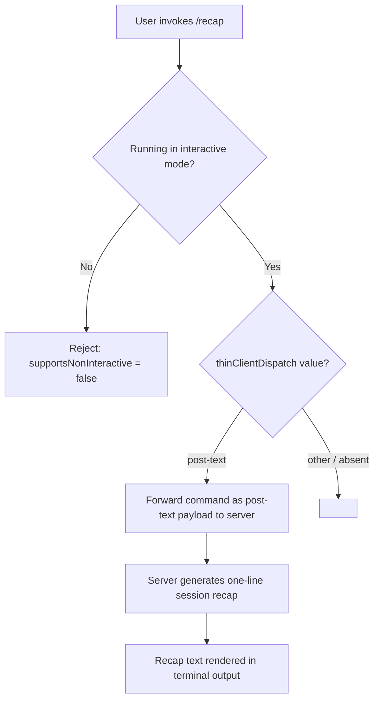

# `/recap`

> Analysis basis: CC v2.1.143 bundle.js (AST extraction + Claude interpretation)
> Minimum version: v2.1.143

---

## Overview

The `/recap` command triggers an immediate one-line summary of the current session's activity. It is a thin-client–dispatched command, meaning the execution payload is forwarded as post-text to the server rather than handled entirely within the local CLI process. No user-supplied arguments are defined for this command.

---

## Registration

| Field | Value |
|---|---|
| type | `local` |
| name | `recap` |
| description | `Generate a one-line session recap now` |
| supportsNonInteractive | `false` |
| thinClientDispatch | `post-text` |

Analysis basis: CC v2.1.143 bundle.js:+11932233

---

## Input Branching

The AST traversal for this command returned an empty call graph and no associated literals or telemetry events at depth ≤ 2. The only confirmed branching point is therefore at the dispatch layer, which is determined by the `thinClientDispatch` registration field.



Analysis basis: CC v2.1.143 bundle.js:+11932233

---

## Behavioral Spec

### Dispatch Gate (Interactive Mode Check)

Because `supportsNonInteractive` is `false`, the command must be invoked from an interactive terminal session. Invocation outside an interactive context (for example, piped or scripted non-interactive use) is not supported and is expected to be rejected before dispatch.

```
function recapDispatchGate(context):
    if context.isNonInteractive:
        raise UnsupportedError("/recap does not support non-interactive mode")
    return allowDispatch(context)
```

Analysis basis: CC v2.1.143 bundle.js:+11932233

### Thin-Client Post-Text Dispatch

The `thinClientDispatch` field is set to `"post-text"`, which indicates that when the command is invoked, the CLI serializes the command invocation as a text-type post payload and forwards it to the remote server endpoint. Local processing of recap logic is not performed within the CLI bundle at this layer.

```
function recapThinClientDispatch(command):
    payload = buildPostTextPayload(command.name, arguments=[])
    response = sendToServer(payload)
    renderOutput(response.text)
```

Analysis basis: CC v2.1.143 bundle.js:+11932233

### Session Recap Generation

The actual one-line recap content is generated server-side. The nature of the recap (e.g., what session data is summarised, token window considered, summarisation model used) is <!-- TODO: not found in depth-2 traversal; needs --depth 4 -->.

```
function generateSessionRecap(sessionContext):
    # Executed server-side; not resolvable at depth-2 AST traversal
    summary = model.summariseSession(sessionContext, maxLines=1)
    return summary
```

<!-- TODO: not found in depth-2 traversal; needs --depth 4 -->

---

## State & Side Effects

| Item | Detail |
|---|---|
| Telemetry | None detected at depth ≤ 2 traversal. <!-- TODO: not found in depth-2 traversal; needs --depth 4 --> |
| Hook registration | None detected at depth ≤ 2 traversal. <!-- TODO: not found in depth-2 traversal; needs --depth 4 --> |
| appState changes | None detected at depth ≤ 2 traversal. <!-- TODO: not found in depth-2 traversal; needs --depth 4 --> |
| Sound | None detected at depth ≤ 2 traversal. <!-- TODO: not found in depth-2 traversal; needs --depth 4 --> |
| Dispatch side effect | Emits a `post-text` payload to the server endpoint as a side effect of invocation. |
| Interactive requirement | Will not execute and produces no side effects when invoked in non-interactive mode. |

---

## Version History

| Version | Change |
|---|---|
| v2.1.143 | Initial analysis. Command registered as `local` type with `post-text` thin-client dispatch. |

---

## Common Mistakes

1. **Invoking `/recap` in a non-interactive script or pipe**: Because `supportsNonInteractive` is `false`, this command will be rejected in any non-interactive context. Use only within a live interactive Claude Code session.
2. **Expecting local execution of recap logic**: The `thinClientDispatch: "post-text"` registration means the command is forwarded to the server. Any assumption that the recap is generated purely client-side within the CLI is incorrect.
3. **Supplying arguments**: No argument schema is defined in the registration. Passing positional or named arguments to `/recap` is not supported and their handling is undefined at the depth-2 traversal level.
4. **Expecting rich multi-line output**: The command description explicitly states "one-line session recap". Downstream logic that expects multi-paragraph summaries may be misaligned with the intended output contract.

---

## Appendix — Identifier Mapping

> For bundle debugging only. Identifiers change across versions.

| Identifier | Role |
|---|---|
| *(none)* | No obfuscated identifiers were reached during depth ≤ 2 AST traversal for this command. The `identifiers` array returned empty. |